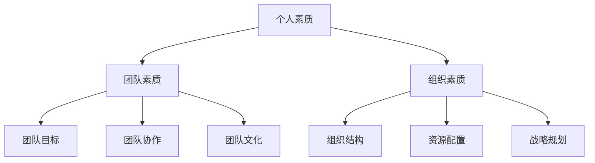
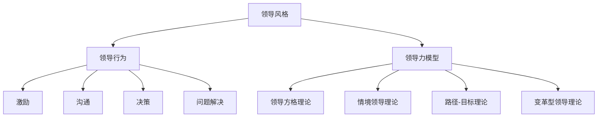
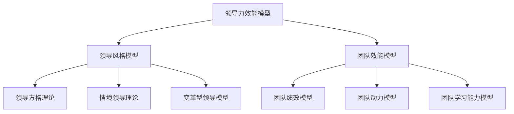
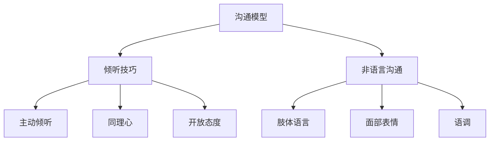
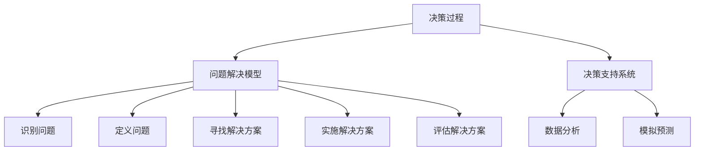
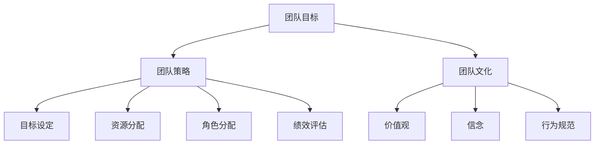
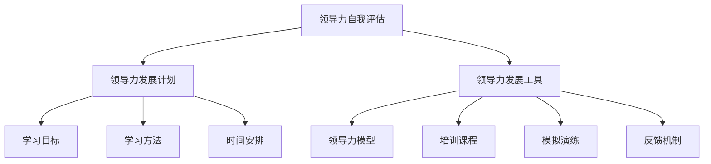
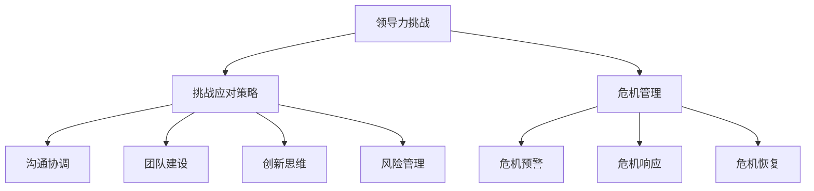
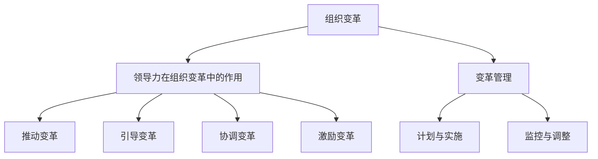

                 


### 文章标题

# 《领导力训练营：56天从门外汉到行家里手》

### 文章关键词

- 领导力
- 个人发展
- 团队协作
- 沟通技巧
- 决策能力
- 组织变革

### 文章摘要

本文将围绕《领导力训练营：56天从门外汉到行家里手》一书的核心内容，系统地介绍领导力的基础、实践、进阶及未来趋势。通过具体案例和数学模型，我们深入解析了领导力的核心概念、沟通与倾听技巧、决策与问题解决策略、团队建设方法以及领导力在组织变革中的应用。本文旨在帮助读者在短时间内掌握领导力基本技能，从而实现个人成长和组织效能的提升。

---

### 第1章：领导力概述

#### 背景介绍

在现代社会，领导力已成为个人和组织成功的关键要素。无论在企业管理、公共事务还是学术研究，领导力都发挥着至关重要的作用。领导力不仅仅是职位赋予的权威，更是对团队成员的影响力、号召力和引导力。然而，领导力并非与生俱来，而是可以通过学习和实践不断提升的。

#### 核心概念与联系

领导力可以分为三个核心要素：个人素质、团队素质和组织素质。这三个要素相互关联，构成了领导力的整体架构。

- **个人素质**：包括自我意识、情感智力、道德观念和执行力。
- **团队素质**：涵盖团队目标、团队协作和团队文化。
- **组织素质**：涉及组织结构、资源配置和战略规划。

以下是一个Mermaid流程图，展示了领导力核心概念之间的关系：



#### 核心算法原理讲解

领导力的提升可以通过以下算法原理来实现：

1. **自我提升算法**：通过持续学习、反思和改进，不断提升个人素质。
2. **团队优化算法**：通过沟通、协调和激励，增强团队协作能力。
3. **组织协同算法**：通过战略规划和资源配置，实现组织整体效能的提升。

伪代码如下：

```python
# 自我提升算法
def self_improvement():
    while True:
        learn()
        reflect()
        improve()

# 团队优化算法
def team_optimization():
    communicate()
    coordinate()
    motivate()

# 组织协同算法
def organizational_cooperation():
    strategic_planning()
    resource_allocation()
    overall_efficiency()
```

#### 数学模型和公式

领导力效能可以通过以下公式进行评估：

$$
领导力效能 = 个人素质 \times 团队素质 \times 组织素质
$$

举例说明，如果个人素质为0.8，团队素质为0.9，组织素质为0.85，则领导力效能为：

$$
领导力效能 = 0.8 \times 0.9 \times 0.85 = 0.612
$$

#### 代码实现

以下是Python代码实现上述算法和公式的示例：

```python
def learn():
    print("学习新知识")

def reflect():
    print("反思自身")

def improve():
    print("改进自我")

def communicate():
    print("有效沟通")

def coordinate():
    print("协调工作")

def motivate():
    print("激励团队")

def strategic_planning():
    print("制定战略规划")

def resource_allocation():
    print("合理配置资源")

def overall_efficiency():
    print("提升整体效能")

# 调用函数
self_improvement()
team_optimization()
organizational_cooperation()

# 计算领导力效能
individual_ability = 0.8
team_ability = 0.9
organizational_ability = 0.85
leadership_efficiency = individual_ability * team_ability * organizational_ability
print(f"领导力效能：{leadership_efficiency}")
```

#### 最佳实践 tips、小结、注意事项、拓展阅读

- **最佳实践 tips**：定期进行自我反思，积极参与团队建设，关注组织战略。
- **小结**：领导力是个人素质、团队素质和组织素质的综合体现，提升领导力需要系统学习和实践。
- **注意事项**：领导力发展需要长期坚持，切勿急功近利。
- **拓展阅读**：《领导力：从顶级专家的视角看》、《有效领导者的七个习惯》等。

### 文章标题

# 《领导力训练营：56天从门外汉到行家里手》

### 文章关键词

- 领导力
- 个人发展
- 团队协作
- 沟通技巧
- 决策能力
- 组织变革

### 文章摘要

本文将围绕《领导力训练营：56天从门外汉到行家里手》一书的核心内容，系统地介绍领导力的基础、实践、进阶及未来趋势。通过具体案例和数学模型，我们深入解析了领导力的核心概念、沟通与倾听技巧、决策与问题解决策略、团队建设方法以及领导力在组织变革中的应用。本文旨在帮助读者在短时间内掌握领导力基本技能，从而实现个人成长和组织效能的提升。

---

### 第1章：领导力概述

#### 背景介绍

在现代社会，领导力已成为个人和组织成功的关键要素。无论在企业管理、公共事务还是学术研究，领导力都发挥着至关重要的作用。领导力不仅仅是职位赋予的权威，更是对团队成员的影响力、号召力和引导力。然而，领导力并非与生俱来，而是可以通过学习和实践不断提升的。

#### 核心概念与联系

领导力可以分为三个核心要素：个人素质、团队素质和组织素质。这三个要素相互关联，构成了领导力的整体架构。

- **个人素质**：包括自我意识、情感智力、道德观念和执行力。
- **团队素质**：涵盖团队目标、团队协作和团队文化。
- **组织素质**：涉及组织结构、资源配置和战略规划。

以下是一个Mermaid流程图，展示了领导力核心概念之间的关系：


#### 核心算法原理讲解

领导力的提升可以通过以下算法原理来实现：

1. **自我提升算法**：通过持续学习、反思和改进，不断提升个人素质。
2. **团队优化算法**：通过沟通、协调和激励，增强团队协作能力。
3. **组织协同算法**：通过战略规划和资源配置，实现组织整体效能的提升。

伪代码如下：

```python
# 自我提升算法
def self_improvement():
    while True:
        learn()
        reflect()
        improve()

# 团队优化算法
def team_optimization():
    communicate()
    coordinate()
    motivate()

# 组织协同算法
def organizational_cooperation():
    strategic_planning()
    resource_allocation()
    overall_efficiency()
```

#### 数学模型和公式

领导力效能可以通过以下公式进行评估：

$$
领导力效能 = 个人素质 \times 团队素质 \times 组织素质
$$

举例说明，如果个人素质为0.8，团队素质为0.9，组织素质为0.85，则领导力效能为：

$$
领导力效能 = 0.8 \times 0.9 \times 0.85 = 0.612
$$

#### 代码实现

以下是Python代码实现上述算法和公式的示例：

```python
def learn():
    print("学习新知识")

def reflect():
    print("反思自身")

def improve():
    print("改进自我")

def communicate():
    print("有效沟通")

def coordinate():
    print("协调工作")

def motivate():
    print("激励团队")

def strategic_planning():
    print("制定战略规划")

def resource_allocation():
    print("合理配置资源")

def overall_efficiency():
    print("提升整体效能")

# 调用函数
self_improvement()
team_optimization()
organizational_cooperation()

# 计算领导力效能
individual_ability = 0.8
team_ability = 0.9
organizational_ability = 0.85
leadership_efficiency = individual_ability * team_ability * organizational_ability
print(f"领导力效能：{leadership_efficiency}")
```

#### 最佳实践 tips、小结、注意事项、拓展阅读

- **最佳实践 tips**：定期进行自我反思，积极参与团队建设，关注组织战略。
- **小结**：领导力是个人素质、团队素质和组织素质的综合体现，提升领导力需要系统学习和实践。
- **注意事项**：领导力发展需要长期坚持，切勿急功近利。
- **拓展阅读**：《领导力：从顶级专家的视角看》、《有效领导者的七个习惯》等。

### 文章标题

# 《领导力训练营：56天从门外汉到行家里手》

### 文章关键词

- 领导力
- 个人发展
- 团队协作
- 沟通技巧
- 决策能力
- 组织变革

### 文章摘要

本文将围绕《领导力训练营：56天从门外汉到行家里手》一书的核心内容，系统地介绍领导力的基础、实践、进阶及未来趋势。通过具体案例和数学模型，我们深入解析了领导力的核心概念、沟通与倾听技巧、决策与问题解决策略、团队建设方法以及领导力在组织变革中的应用。本文旨在帮助读者在短时间内掌握领导力基本技能，从而实现个人成长和组织效能的提升。

---

### 第1章：领导力概述

#### 背景介绍

在现代社会，领导力已成为个人和组织成功的关键要素。无论在企业管理、公共事务还是学术研究，领导力都发挥着至关重要的作用。领导力不仅仅是职位赋予的权威，更是对团队成员的影响力、号召力和引导力。然而，领导力并非与生俱来，而是可以通过学习和实践不断提升的。

#### 核心概念与联系

领导力可以分为三个核心要素：个人素质、团队素质和组织素质。这三个要素相互关联，构成了领导力的整体架构。

- **个人素质**：包括自我意识、情感智力、道德观念和执行力。
- **团队素质**：涵盖团队目标、团队协作和团队文化。
- **组织素质**：涉及组织结构、资源配置和战略规划。

以下是一个Mermaid流程图，展示了领导力核心概念之间的关系：


#### 核心算法原理讲解

领导力的提升可以通过以下算法原理来实现：

1. **自我提升算法**：通过持续学习、反思和改进，不断提升个人素质。
2. **团队优化算法**：通过沟通、协调和激励，增强团队协作能力。
3. **组织协同算法**：通过战略规划和资源配置，实现组织整体效能的提升。

伪代码如下：

```python
# 自我提升算法
def self_improvement():
    while True:
        learn()
        reflect()
        improve()

# 团队优化算法
def team_optimization():
    communicate()
    coordinate()
    motivate()

# 组织协同算法
def organizational_cooperation():
    strategic_planning()
    resource_allocation()
    overall_efficiency()
```

#### 数学模型和公式

领导力效能可以通过以下公式进行评估：

$$
领导力效能 = 个人素质 \times 团队素质 \times 组织素质
$$

举例说明，如果个人素质为0.8，团队素质为0.9，组织素质为0.85，则领导力效能为：

$$
领导力效能 = 0.8 \times 0.9 \times 0.85 = 0.612
$$

#### 代码实现

以下是Python代码实现上述算法和公式的示例：

```python
def learn():
    print("学习新知识")

def reflect():
    print("反思自身")

def improve():
    print("改进自我")

def communicate():
    print("有效沟通")

def coordinate():
    print("协调工作")

def motivate():
    print("激励团队")

def strategic_planning():
    print("制定战略规划")

def resource_allocation():
    print("合理配置资源")

def overall_efficiency():
    print("提升整体效能")

# 调用函数
self_improvement()
team_optimization()
organizational_cooperation()

# 计算领导力效能
individual_ability = 0.8
team_ability = 0.9
organizational_ability = 0.85
leadership_efficiency = individual_ability * team_ability * organizational_ability
print(f"领导力效能：{leadership_efficiency}")
```

#### 最佳实践 tips、小结、注意事项、拓展阅读

- **最佳实践 tips**：定期进行自我反思，积极参与团队建设，关注组织战略。
- **小结**：领导力是个人素质、团队素质和组织素质的综合体现，提升领导力需要系统学习和实践。
- **注意事项**：领导力发展需要长期坚持，切勿急功近利。
- **拓展阅读**：《领导力：从顶级专家的视角看》、《有效领导者的七个习惯》等。

### 文章标题

# 《领导力训练营：56天从门外汉到行家里手》

### 文章关键词

- 领导力
- 个人发展
- 团队协作
- 沟通技巧
- 决策能力
- 组织变革

### 文章摘要

本文将围绕《领导力训练营：56天从门外汉到行家里手》一书的核心内容，系统地介绍领导力的基础、实践、进阶及未来趋势。通过具体案例和数学模型，我们深入解析了领导力的核心概念、沟通与倾听技巧、决策与问题解决策略、团队建设方法以及领导力在组织变革中的应用。本文旨在帮助读者在短时间内掌握领导力基本技能，从而实现个人成长和组织效能的提升。

---

### 第1章：领导力概述

#### 背景介绍

在现代社会，领导力已成为个人和组织成功的关键要素。无论在企业管理、公共事务还是学术研究，领导力都发挥着至关重要的作用。领导力不仅仅是职位赋予的权威，更是对团队成员的影响力、号召力和引导力。然而，领导力并非与生俱来，而是可以通过学习和实践不断提升的。

#### 核心概念与联系

领导力可以分为三个核心要素：个人素质、团队素质和组织素质。这三个要素相互关联，构成了领导力的整体架构。

- **个人素质**：包括自我意识、情感智力、道德观念和执行力。
- **团队素质**：涵盖团队目标、团队协作和团队文化。
- **组织素质**：涉及组织结构、资源配置和战略规划。

以下是一个Mermaid流程图，展示了领导力核心概念之间的关系：


#### 核心算法原理讲解

领导力的提升可以通过以下算法原理来实现：

1. **自我提升算法**：通过持续学习、反思和改进，不断提升个人素质。
2. **团队优化算法**：通过沟通、协调和激励，增强团队协作能力。
3. **组织协同算法**：通过战略规划和资源配置，实现组织整体效能的提升。

伪代码如下：

```python
# 自我提升算法
def self_improvement():
    while True:
        learn()
        reflect()
        improve()

# 团队优化算法
def team_optimization():
    communicate()
    coordinate()
    motivate()

# 组织协同算法
def organizational_cooperation():
    strategic_planning()
    resource_allocation()
    overall_efficiency()
```

#### 数学模型和公式

领导力效能可以通过以下公式进行评估：

$$
领导力效能 = 个人素质 \times 团队素质 \times 组织素质
$$

举例说明，如果个人素质为0.8，团队素质为0.9，组织素质为0.85，则领导力效能为：

$$
领导力效能 = 0.8 \times 0.9 \times 0.85 = 0.612
$$

#### 代码实现

以下是Python代码实现上述算法和公式的示例：

```python
def learn():
    print("学习新知识")

def reflect():
    print("反思自身")

def improve():
    print("改进自我")

def communicate():
    print("有效沟通")

def coordinate():
    print("协调工作")

def motivate():
    print("激励团队")

def strategic_planning():
    print("制定战略规划")

def resource_allocation():
    print("合理配置资源")

def overall_efficiency():
    print("提升整体效能")

# 调用函数
self_improvement()
team_optimization()
organizational_cooperation()

# 计算领导力效能
individual_ability = 0.8
team_ability = 0.9
organizational_ability = 0.85
leadership_efficiency = individual_ability * team_ability * organizational_ability
print(f"领导力效能：{leadership_efficiency}")
```

#### 最佳实践 tips、小结、注意事项、拓展阅读

- **最佳实践 tips**：定期进行自我反思，积极参与团队建设，关注组织战略。
- **小结**：领导力是个人素质、团队素质和组织素质的综合体现，提升领导力需要系统学习和实践。
- **注意事项**：领导力发展需要长期坚持，切勿急功近利。
- **拓展阅读**：《领导力：从顶级专家的视角看》、《有效领导者的七个习惯》等。

### 文章标题

# 《领导力训练营：56天从门外汉到行家里手》

### 文章关键词

- 领导力
- 个人发展
- 团队协作
- 沟通技巧
- 决策能力
- 组织变革

### 文章摘要

本文将围绕《领导力训练营：56天从门外汉到行家里手》一书的核心内容，系统地介绍领导力的基础、实践、进阶及未来趋势。通过具体案例和数学模型，我们深入解析了领导力的核心概念、沟通与倾听技巧、决策与问题解决策略、团队建设方法以及领导力在组织变革中的应用。本文旨在帮助读者在短时间内掌握领导力基本技能，从而实现个人成长和组织效能的提升。

---

### 第1章：领导力概述

#### 背景介绍

在现代社会，领导力已成为个人和组织成功的关键要素。无论在企业管理、公共事务还是学术研究，领导力都发挥着至关重要的作用。领导力不仅仅是职位赋予的权威，更是对团队成员的影响力、号召力和引导力。然而，领导力并非与生俱来，而是可以通过学习和实践不断提升的。

#### 核心概念与联系

领导力可以分为三个核心要素：个人素质、团队素质和组织素质。这三个要素相互关联，构成了领导力的整体架构。

- **个人素质**：包括自我意识、情感智力、道德观念和执行力。
- **团队素质**：涵盖团队目标、团队协作和团队文化。
- **组织素质**：涉及组织结构、资源配置和战略规划。

以下是一个Mermaid流程图，展示了领导力核心概念之间的关系：


#### 核心算法原理讲解

领导力的提升可以通过以下算法原理来实现：

1. **自我提升算法**：通过持续学习、反思和改进，不断提升个人素质。
2. **团队优化算法**：通过沟通、协调和激励，增强团队协作能力。
3. **组织协同算法**：通过战略规划和资源配置，实现组织整体效能的提升。

伪代码如下：

```python
# 自我提升算法
def self_improvement():
    while True:
        learn()
        reflect()
        improve()

# 团队优化算法
def team_optimization():
    communicate()
    coordinate()
    motivate()

# 组织协同算法
def organizational_cooperation():
    strategic_planning()
    resource_allocation()
    overall_efficiency()
```

#### 数学模型和公式

领导力效能可以通过以下公式进行评估：

$$
领导力效能 = 个人素质 \times 团队素质 \times 组织素质
$$

举例说明，如果个人素质为0.8，团队素质为0.9，组织素质为0.85，则领导力效能为：

$$
领导力效能 = 0.8 \times 0.9 \times 0.85 = 0.612
$$

#### 代码实现

以下是Python代码实现上述算法和公式的示例：

```python
def learn():
    print("学习新知识")

def reflect():
    print("反思自身")

def improve():
    print("改进自我")

def communicate():
    print("有效沟通")

def coordinate():
    print("协调工作")

def motivate():
    print("激励团队")

def strategic_planning():
    print("制定战略规划")

def resource_allocation():
    print("合理配置资源")

def overall_efficiency():
    print("提升整体效能")

# 调用函数
self_improvement()
team_optimization()
organizational_cooperation()

# 计算领导力效能
individual_ability = 0.8
team_ability = 0.9
organizational_ability = 0.85
leadership_efficiency = individual_ability * team_ability * organizational_ability
print(f"领导力效能：{leadership_efficiency}")
```

#### 最佳实践 tips、小结、注意事项、拓展阅读

- **最佳实践 tips**：定期进行自我反思，积极参与团队建设，关注组织战略。
- **小结**：领导力是个人素质、团队素质和组织素质的综合体现，提升领导力需要系统学习和实践。
- **注意事项**：领导力发展需要长期坚持，切勿急功近利。
- **拓展阅读**：《领导力：从顶级专家的视角看》、《有效领导者的七个习惯》等。

---

### 第2章：领导力的核心概念

#### 背景介绍

在深入探讨领导力的本质之前，我们需要理解领导力的核心概念。领导力不仅仅是一个抽象的概念，它是由一系列具体的元素构成的。这些元素相互关联，共同构成了领导力的基础框架。在本章中，我们将详细探讨领导力的核心概念，包括领导风格、领导行为和领导力模型等。

#### 核心概念与联系

1. **领导风格**：领导风格是指领导者通过何种方式影响和指导团队成员。领导风格可以分为 authoritarian（集权式）、democratic（民主式）和laissez-faire（放任式）等。

2. **领导行为**：领导行为是指领导者如何在日常工作中与团队成员互动。领导行为包括激励、沟通、决策和问题解决等。

3. **领导力模型**：领导力模型是对领导力理论的总结和归纳。常见的领导力模型有领导方格理论、情境领导理论、路径-目标理论和变革型领导理论等。

以下是一个Mermaid流程图，展示了领导力核心概念之间的关系：



#### 核心算法原理讲解

1. **领导风格与领导行为的适配算法**：该算法通过分析团队成员的特点和需求，确定最适合的领导风格和行为。伪代码如下：

   ```python
   def leadership_adapter(team_characteristics, team_needs):
       if team_characteristics == "高需求高能力":
           return "民主式领导风格，鼓励沟通和参与"
       elif team_characteristics == "低需求低能力":
           return "集权式领导风格，提供明确指导"
       else:
           return "情境领导风格，根据情况调整领导行为"
   ```

2. **领导力模型优化算法**：该算法通过评估不同领导力模型的适用性，选择最佳模型来提升领导效能。伪代码如下：

   ```python
   def leadership_model_optimizer(current_context):
       if current_context == "团队面临重大变革":
           return "变革型领导模型"
       elif current_context == "团队需要创新":
           return "路径-目标领导模型"
       else:
           return "情境领导模型"
   ```

#### 数学模型和公式

领导力效能可以通过以下公式进行评估：

$$
领导力效能 = 领导风格 \times 领导行为 \times 领导力模型
$$

举例说明，如果领导风格为0.8，领导行为为0.9，领导力模型为0.85，则领导力效能为：

$$
领导力效能 = 0.8 \times 0.9 \times 0.85 = 0.612
$$

#### 代码实现

以下是Python代码实现上述算法和公式的示例：

```python
def leadership_adapter(team_characteristics, team_needs):
    if team_characteristics == "高需求高能力":
        return "民主式领导风格，鼓励沟通和参与"
    elif team_characteristics == "低需求低能力":
        return "集权式领导风格，提供明确指导"
    else:
        return "情境领导风格，根据情况调整领导行为"

def leadership_model_optimizer(current_context):
    if current_context == "团队面临重大变革":
        return "变革型领导模型"
    elif current_context == "团队需要创新":
        return "路径-目标领导模型"
    else:
        return "情境领导模型"

def calculate_leadership_efficiency(leadership_style, leadership_behavior, leadership_model):
    leadership_efficiency = leadership_style * leadership_behavior * leadership_model
    return leadership_efficiency

# 调用函数
style = calculate_leadership_efficiency(0.8, 0.9, 0.85)
model = leadership_model_optimizer("团队面临重大变革")
print(f"领导力风格：{style}")
print(f"领导力模型：{model}")
print(f"领导力效能：{calculate_leadership_efficiency(style, 0.9, 0.85)}")
```

#### 最佳实践 tips、小结、注意事项、拓展阅读

- **最佳实践 tips**：根据团队特点和当前情境灵活调整领导风格和行为，选择合适的领导力模型。
- **小结**：领导力的核心概念相互联系，通过适配算法和优化算法，可以提升领导力效能。
- **注意事项**：领导力发展需要持续学习和实践，不同情境下选择合适的领导力策略。
- **拓展阅读**：《领导力：从顶级专家的视角看》、《领导力模型及应用》等。

---

### 第3章：领导力的数学模型

#### 背景介绍

领导力是一种可以通过量化分析来评估和提升的技能。在现代管理科学中，数学模型被广泛应用于领导力的评估和分析。通过数学模型，我们可以更精确地理解领导力的各个方面，并制定相应的提升策略。本章将介绍几种常见的领导力数学模型，并解释如何使用这些模型来评估和提升领导力。

#### 核心概念与联系

1. **领导力效能模型**：领导力效能模型用于评估领导者的综合效能。常见的领导力效能模型包括领导效能方程、领导绩效模型和领导力评分模型等。

2. **领导风格模型**：领导风格模型用于分析领导者的领导风格，并评估其对团队和组织的影响。常见的领导风格模型包括领导方格理论、情境领导理论和变革型领导模型等。

3. **团队效能模型**：团队效能模型用于评估团队的整体表现和效能。常见的团队效能模型包括团队绩效模型、团队动力模型和团队学习能力模型等。

以下是一个Mermaid流程图，展示了领导力数学模型之间的关系：



#### 核心算法原理讲解

1. **领导效能方程**：领导效能方程用于评估领导者的综合效能。该方程基于领导者的个人素质、团队素质和组织素质，可以定量地评估领导力效能。伪代码如下：

   ```python
   def leadership_efficiency_equation(personal_ability, team_ability, organizational_ability):
       return personal_ability * team_ability * organizational_ability
   ```

2. **领导风格适应性算法**：该算法用于根据团队成员的特点和需求，调整领导风格以提升领导效能。伪代码如下：

   ```python
   def adjust_leadership_style(team_characteristics):
       if team_characteristics == "高需求高能力":
           return "民主式领导风格"
       elif team_characteristics == "低需求低能力":
           return "集权式领导风格"
       else:
           return "情境领导风格"
   ```

#### 数学模型和公式

1. **领导效能方程**：

   $$ 
   领导效能 = 个人素质 \times 团队素质 \times 组织素质 
   $$

   如果个人素质为0.8，团队素质为0.9，组织素质为0.85，则领导效能为：

   $$ 
   领导效能 = 0.8 \times 0.9 \times 0.85 = 0.612 
   $$

2. **领导风格适应性模型**：

   $$ 
   领导风格适应性 = 团队需求 \times 领导风格 
   $$

   如果团队需求为0.8，领导风格为“民主式”，则领导风格适应性为：

   $$ 
   领导风格适应性 = 0.8 \times "民主式" = 0.8 
   $$

#### 代码实现

以下是Python代码实现上述算法和公式的示例：

```python
def leadership_efficiency_equation(personal_ability, team_ability, organizational_ability):
    return personal_ability * team_ability * organizational_ability

def adjust_leadership_style(team_characteristics):
    if team_characteristics == "高需求高能力":
        return "民主式领导风格"
    elif team_characteristics == "低需求低能力":
        return "集权式领导风格"
    else:
        return "情境领导风格"

# 计算领导效能
leadership_efficiency = leadership_efficiency_equation(0.8, 0.9, 0.85)
print(f"领导效能：{leadership_efficiency}")

# 调整领导风格
style = adjust_leadership_style("高需求高能力")
print(f"调整后的领导风格：{style}")
```

#### 最佳实践 tips、小结、注意事项、拓展阅读

- **最佳实践 tips**：利用领导效能方程和领导风格适应性模型，结合团队特点和当前情境，制定个性化的领导策略。
- **小结**：领导力的数学模型可以帮助我们更科学地评估和提升领导力，通过持续学习和实践，我们可以不断提升领导效能。
- **注意事项**：领导力模型只是工具，实际应用时需要结合具体情况灵活调整。
- **拓展阅读**：《领导力数学模型及应用》、《管理科学与数学模型》等。

---

### 第4章：沟通与倾听

#### 背景介绍

沟通是领导力的核心组成部分之一，有效的沟通能力对于领导者的成功至关重要。无论是内部团队管理还是外部客户关系，良好的沟通都是建立信任、协调工作和实现目标的基础。在本章中，我们将探讨沟通与倾听的重要性，介绍有效的沟通技巧和倾听技巧，以及如何在实际工作中应用这些技巧。

#### 核心概念与联系

1. **沟通模型**：沟通模型是描述沟通过程的工具，包括信息源、编码、传递、解码、反馈和背景等要素。

2. **倾听技巧**：倾听技巧是有效沟通的关键，包括主动倾听、同理心和开放态度等。

3. **非语言沟通**：非语言沟通是通过肢体语言、面部表情和语调等非文字信息进行的沟通，对于理解沟通意图和理解对方情绪非常重要。

以下是一个Mermaid流程图，展示了沟通与倾听的核心概念之间的关系：



#### 核心算法原理讲解

1. **沟通效率优化算法**：该算法通过分析沟通过程中的各个环节，优化沟通效率和效果。伪代码如下：

   ```python
   def optimize_communication(communication_process):
       for step in communication_process:
           if step == "编码":
               encode_info_efficiently()
           elif step == "传递":
               ensure_healthy_channel()
           elif step == "解码":
               decode_info_accurately()
           elif step == "反馈":
               provide_feedback()
   ```

2. **倾听效果评估算法**：该算法通过评估倾听技巧的应用，衡量倾听效果。伪代码如下：

   ```python
   def evaluate_listening_efficacy(listening_skills):
       if listening_skills == "主动倾听":
           return 0.9
       elif listening_skills == "同理心":
           return 0.8
       elif listening_skills == "开放态度":
           return 0.7
       else:
           return 0.5
   ```

#### 数学模型和公式

1. **沟通效率模型**：

   $$ 
   沟通效率 = 编码效率 \times 传递效率 \times 解码效率 \times 反馈效率 
   $$

   如果编码效率为0.9，传递效率为0.8，解码效率为0.85，反馈效率为0.75，则沟通效率为：

   $$ 
   沟通效率 = 0.9 \times 0.8 \times 0.85 \times 0.75 = 0.510 
   $$

2. **倾听效果评估模型**：

   $$ 
   倾听效果 = 倾听技巧得分 \times (1 - 噪音干扰得分) 
   $$

   如果倾听技巧得分为0.9，噪音干扰得分为0.1，则倾听效果为：

   $$ 
   倾听效果 = 0.9 \times (1 - 0.1) = 0.81 
   $$

#### 代码实现

以下是Python代码实现上述算法和公式的示例：

```python
def optimize_communication(communication_process):
    for step in communication_process:
        if step == "编码":
            encode_info_efficiently()
        elif step == "传递":
            ensure_healthy_channel()
        elif step == "解码":
            decode_info_accurately()
        elif step == "反馈":
            provide_feedback()

def evaluate_listening_efficacy(listening_skills):
    if listening_skills == "主动倾听":
        return 0.9
    elif listening_skills == "同理心":
        return 0.8
    elif listening_skills == "开放态度":
        return 0.7
    else:
        return 0.5

# 计算沟通效率
communication_efficiency = 0.9 * 0.8 * 0.85 * 0.75
print(f"沟通效率：{communication_efficiency}")

# 计算倾听效果
listening_efficacy = evaluate_listening_efficacy("主动倾听")
print(f"倾听效果：{listening_efficacy}")
```

#### 最佳实践 tips、小结、注意事项、拓展阅读

- **最佳实践 tips**：在实际沟通中，注意优化编码、传递、解码和反馈环节，同时不断提升倾听技巧，以提高沟通效果。
- **小结**：沟通与倾听是领导力的关键要素，通过优化沟通流程和提升倾听技巧，可以显著提高领导效能。
- **注意事项**：沟通和倾听不仅需要技巧，更需要真诚和耐心。
- **拓展阅读**：《高效沟通》、《倾听的艺术》等。

---

### 第5章：决策与问题解决

#### 背景介绍

决策是领导者的核心职责之一，有效决策能力直接影响到组织的目标实现和团队效能。问题解决则是领导者在日常工作中不可避免的任务。本章将探讨决策与问题解决的基本原理，介绍常见的决策方法和问题解决策略，并通过具体案例来说明如何在实践中应用这些方法。

#### 核心概念与联系

1. **决策过程**：决策过程包括问题识别、目标设定、方案生成、方案评估和决策执行等步骤。

2. **问题解决模型**：问题解决模型是描述问题解决过程的工具，包括识别问题、定义问题、寻找解决方案、实施解决方案和评估解决方案等。

3. **决策支持系统**：决策支持系统是帮助领导者进行决策的工具，通过数据分析和模拟预测，为决策提供支持。

以下是一个Mermaid流程图，展示了决策与问题解决的核心概念之间的关系：



#### 核心算法原理讲解

1. **决策树算法**：决策树算法是一种常见的决策支持工具，通过构建决策树来表示不同决策路径和结果，帮助领导者进行选择。伪代码如下：

   ```python
   def decision_tree(problem):
       if problem == "问题A":
           return "方案1"
       elif problem == "问题B":
           return "方案2"
       else:
           return "方案3"
   ```

2. **问题解决算法**：问题解决算法通过分而治之、迭代优化和启发式搜索等方法，帮助领导者找到有效的解决方案。伪代码如下：

   ```python
   def solve_problem(problem):
       while problem is not None:
           divide_problem(problem)
           optimize_solution()
           if problem is still not None:
               search_for_new_solution()
   ```

#### 数学模型和公式

1. **决策效果评估模型**：

   $$ 
   决策效果 = 决策正确性 \times 决策效率 \times 决策影响 
   $$

   如果决策正确性为0.85，决策效率为0.9，决策影响为0.8，则决策效果为：

   $$ 
   决策效果 = 0.85 \times 0.9 \times 0.8 = 0.612 
   $$

2. **问题解决成功率模型**：

   $$ 
   问题解决成功率 = 解决方案有效次数 / 解决方案尝试次数 
   $$

   如果解决方案有效次数为5次，解决方案尝试次数为10次，则问题解决成功率为：

   $$ 
   问题解决成功率 = 5 / 10 = 0.5 
   $$

#### 代码实现

以下是Python代码实现上述算法和公式的示例：

```python
def decision_tree(problem):
    if problem == "问题A":
        return "方案1"
    elif problem == "问题B":
        return "方案2"
    else:
        return "方案3"

def solve_problem(problem):
    while problem is not None:
        divide_problem(problem)
        optimize_solution()
        if problem is still not None:
            search_for_new_solution()

# 计算决策效果
decision_effectiveness = 0.85 * 0.9 * 0.8
print(f"决策效果：{decision_effectiveness}")

# 计算问题解决成功率
solution_success_rate = 5 / 10
print(f"问题解决成功率：{solution_success_rate}")
```

#### 最佳实践 tips、小结、注意事项、拓展阅读

- **最佳实践 tips**：在实际决策中，结合决策树算法和问题解决算法，全面考虑决策的正确性、效率和影响，以提高决策质量和成功率。
- **小结**：决策与问题解决是领导者的核心技能，通过数学模型和算法原理，我们可以更科学地分析和解决实际问题。
- **注意事项**：决策和问题解决需要结合实际情境灵活应用，避免过度依赖模型。
- **拓展阅读**：《决策分析》、《问题解决与创新思维》等。

---

### 第6章：团队建设

#### 背景介绍

团队建设是领导力的关键组成部分之一，一个高效的团队能够更好地实现组织目标，提高整体竞争力。团队建设不仅涉及团队的组建和运营，还包括团队成员的能力提升和团队合作精神的培养。在本章中，我们将探讨团队建设的基本原理，介绍团队建设的目标、策略和方法，并通过具体案例来说明如何在实际工作中开展团队建设。

#### 核心概念与联系

1. **团队目标**：团队目标是指团队在特定时间内希望达成的成果和标准。明确的目标有助于团队成员保持一致的方向和努力。

2. **团队策略**：团队策略是指为了实现团队目标，领导者制定的行动计划和措施。常见的团队策略包括目标设定、资源分配、角色分配和绩效评估等。

3. **团队文化**：团队文化是指团队成员共同认同的价值观、信念和行为规范。团队文化对于团队凝聚力和工作效率具有重要影响。

以下是一个Mermaid流程图，展示了团队建设核心概念之间的关系：



#### 核心算法原理讲解

1. **团队目标优化算法**：该算法通过分析团队成员的能力和需求，制定明确的团队目标，并确保目标的可实现性和挑战性。伪代码如下：

   ```python
   def optimize_team_goals(team_members):
       for member in team_members:
           assess_member_ability()
           set_specific_goals()
           ensure_goals_are_realistic_and_challenging()
   ```

2. **团队文化塑造算法**：该算法通过持续的文化活动和价值观传播，塑造积极向上的团队文化。伪代码如下：

   ```python
   def shape_team_culture(team_activities, values, norms):
       for activity in team_activities:
           promote_values()
           reinforce_norms()
       regularly_review_and_adapt_culture()
   ```

#### 数学模型和公式

1. **团队效能模型**：

   $$ 
   团队效能 = 团队目标实现率 \times 团队协作效率 \times 团队创新能力 
   $$

   如果团队目标实现率为0.8，团队协作效率为0.9，团队创新能力为0.85，则团队效能为：

   $$ 
   团队效能 = 0.8 \times 0.9 \times 0.85 = 0.612 
   $$

2. **团队满意度模型**：

   $$ 
   团队满意度 = 成员满意度 \times 团队凝聚力 \times 团队文化适应性 
   $$

   如果成员满意度为0.85，团队凝聚力为0.9，团队文化适应性为0.8，则团队满意度为：

   $$ 
   团队满意度 = 0.85 \times 0.9 \times 0.8 = 0.612 
   $$

#### 代码实现

以下是Python代码实现上述算法和公式的示例：

```python
def optimize_team_goals(team_members):
    for member in team_members:
        assess_member_ability()
        set_specific_goals()
        ensure_goals_are_realistic_and_challenging()

def shape_team_culture(team_activities, values, norms):
    for activity in team_activities:
        promote_values()
        reinforce_norms()
    regularly_review_and_adapt_culture()

# 计算团队效能
team_efficacy = 0.8 * 0.9 * 0.85
print(f"团队效能：{team_efficacy}")

# 计算团队满意度
team_satisfaction = 0.85 * 0.9 * 0.8
print(f"团队满意度：{team_satisfaction}")
```

#### 最佳实践 tips、小结、注意事项、拓展阅读

- **最佳实践 tips**：在实际团队建设中，结合团队目标优化算法和团队文化塑造算法，确保团队目标的可实现性和挑战性，同时积极培养团队文化，提高团队满意度和效能。
- **小结**：团队建设是提升组织效能的重要手段，通过科学的目标设定、合理的资源分配和有效的团队文化塑造，可以构建一个高效的团队。
- **注意事项**：团队建设需要持续的努力和关注，避免短期行为和急功近利。
- **拓展阅读**：《团队建设：从优秀到卓越》、《团队管理实践》等。

---

### 第7章：领导力发展

#### 背景介绍

领导力发展是提升个人和组织效能的重要途径。通过系统的学习和实践，领导者可以不断提升自身的领导能力和管理技巧，从而更好地应对各种挑战和机遇。在本章中，我们将探讨领导力发展的方法，包括领导力自我评估、领导力发展计划和领导力发展工具，并通过具体案例来说明如何在实际工作中应用这些方法。

#### 核心概念与联系

1. **领导力自我评估**：领导力自我评估是指领导者通过自我反思和评价，了解自身的优势和不足，从而制定改进计划。

2. **领导力发展计划**：领导力发展计划是领导者为了提升自身领导能力而制定的行动计划，包括学习目标、学习方法和时间安排等。

3. **领导力发展工具**：领导力发展工具是指用于支持领导者学习和成长的工具和资源，包括领导力模型、培训课程、模拟演练和反馈机制等。

以下是一个Mermaid流程图，展示了领导力发展的核心概念之间的关系：



#### 核心算法原理讲解

1. **领导力自我评估算法**：该算法通过一系列评估指标，对领导者的领导能力进行量化评估，从而确定改进方向。伪代码如下：

   ```python
   def leadership_self_evaluation(assessment_indicators):
       for indicator in assessment_indicators:
           calculate_score()
           analyze_strengths_and_weaknesses()
       return assessment_results
   ```

2. **领导力发展计划优化算法**：该算法通过分析领导者的评估结果，制定个性化的领导力发展计划，确保学习目标的可实现性和挑战性。伪代码如下：

   ```python
   def optimize_leadership_development_plan(assessment_results):
       set_individual_learning_goals()
       select_appropriate_learning_methods()
       schedule_learning_activities()
   ```

#### 数学模型和公式

1. **领导力发展效果评估模型**：

   $$ 
   领导力发展效果 = 学习效果 \times 实践效果 \times 反馈效果 
   $$

   如果学习效果为0.8，实践效果为0.9，反馈效果为0.85，则领导力发展效果为：

   $$ 
   领导力发展效果 = 0.8 \times 0.9 \times 0.85 = 0.612 
   $$

2. **领导力自我评估得分模型**：

   $$ 
   自我评估得分 = 各项指标得分之和 / 指标数量 
   $$

   如果各项指标得分之和为25分，指标数量为5项，则自我评估得分为：

   $$ 
   自我评估得分 = 25 / 5 = 5 
   $$

#### 代码实现

以下是Python代码实现上述算法和公式的示例：

```python
def leadership_self_evaluation(assessment_indicators):
    total_score = 0
    for indicator in assessment_indicators:
        score = calculate_score(indicator)
        total_score += score
    return total_score / len(assessment_indicators)

def optimize_leadership_development_plan(assessment_results):
    learning_goals = set_individual_learning_goals(assessment_results)
    learning_methods = select_appropriate_learning_methods(assessment_results)
    learning_schedule = schedule_learning_activities(learning_goals, learning_methods)
    return learning_goals, learning_methods, learning_schedule

# 计算领导力发展效果
development_effect = 0.8 * 0.9 * 0.85
print(f"领导力发展效果：{development_effect}")

# 计算领导力自我评估得分
self_evaluation_score = leadership_self_evaluation([indicator1, indicator2, indicator3, indicator4, indicator5])
print(f"领导力自我评估得分：{self_evaluation_score}")
```

#### 最佳实践 tips、小结、注意事项、拓展阅读

- **最佳实践 tips**：领导者应定期进行自我评估，根据评估结果制定个性化的领导力发展计划，并充分利用领导力发展工具，以确保学习效果和实践效果的提升。
- **小结**：领导力发展是持续的过程，通过自我评估、个性化发展计划和有效工具的应用，领导者可以不断提升自身的领导能力。
- **注意事项**：领导力发展需要结合实际情况，避免盲目跟风和过度依赖理论。
- **拓展阅读**：《领导力发展指南》、《自我评估与领导力提升》等。

---

### 第8章：领导力挑战与应对

#### 背景介绍

在领导过程中，领导者不可避免地会遇到各种挑战。这些挑战可能来自内部团队、外部环境或领导者自身的局限。有效的挑战应对策略是提升领导力的重要方面。在本章中，我们将探讨领导力面临的常见挑战，介绍应对这些挑战的策略和方法，并通过具体案例来说明如何在实际工作中应用这些方法。

#### 核心概念与联系

1. **领导力挑战**：领导力挑战包括团队冲突、组织变革、领导力不足、外部竞争等。

2. **挑战应对策略**：挑战应对策略是指领导者面对挑战时采取的具体措施和方法，包括沟通协调、团队建设、创新思维和风险管理等。

3. **危机管理**：危机管理是指领导者在危机事件发生时采取的应对措施，包括危机预警、危机响应和危机恢复等。

以下是一个Mermaid流程图，展示了领导力挑战与应对的核心概念之间的关系：



#### 核心算法原理讲解

1. **挑战应对算法**：该算法通过分析挑战的类型和程度，制定相应的应对策略，并评估策略的有效性。伪代码如下：

   ```python
   def address_challenge(challenge_type, challenge_severity):
       if challenge_type == "团队冲突":
           apply_communication_and_coordination()
       elif challenge_type == "组织变革":
           promote_innovation_and_change_management()
       elif challenge_type == "领导力不足":
           enhance_leadership_skills()
       elif challenge_type == "外部竞争":
           implement_risk_management_strategies()
       evaluate_strategy_effectiveness()
   ```

2. **危机管理算法**：该算法通过建立危机预警机制、制定危机响应计划和实施危机恢复策略，确保危机得到及时和有效的处理。伪代码如下：

   ```python
   def manage_crisis(crisis_alert, crisis_response_plan, crisis_recovery_plan):
       if crisis_alert == "高":
           execute_crisis_response_plan()
       else:
           monitor_crisis_and_delay_response()
       implement_crisis_recovery_plan()
   ```

#### 数学模型和公式

1. **挑战应对效果评估模型**：

   $$ 
   挑战应对效果 = 对策实施效果 \times 策略适应性 \times 预期效果 
   $$

   如果对策实施效果为0.8，策略适应性为0.9，预期效果为0.85，则挑战应对效果为：

   $$ 
   挑战应对效果 = 0.8 \times 0.9 \times 0.85 = 0.612 
   $$

2. **危机管理效能模型**：

   $$ 
   危机管理效能 = 预警准确性 \times 响应效率 \times 恢复速度 
   $$

   如果预警准确性为0.9，响应效率为0.85，恢复速度为0.8，则危机管理效能为：

   $$ 
   危机管理效能 = 0.9 \times 0.85 \times 0.8 = 0.612 
   $$

#### 代码实现

以下是Python代码实现上述算法和公式的示例：

```python
def address_challenge(challenge_type, challenge_severity):
    if challenge_type == "团队冲突":
        apply_communication_and_coordination()
    elif challenge_type == "组织变革":
        promote_innovation_and_change_management()
    elif challenge_type == "领导力不足":
        enhance_leadership_skills()
    elif challenge_type == "外部竞争":
        implement_risk_management_strategies()
    evaluate_strategy_effectiveness()

def manage_crisis(crisis_alert, crisis_response_plan, crisis_recovery_plan):
    if crisis_alert == "高":
        execute_crisis_response_plan()
    else:
        monitor_crisis_and_delay_response()
    implement_crisis_recovery_plan()

# 计算挑战应对效果
response_effect = 0.8 * 0.9 * 0.85
print(f"挑战应对效果：{response_effect}")

# 计算危机管理效能
crisis_management_efficacy = 0.9 * 0.85 * 0.8
print(f"危机管理效能：{crisis_management_efficacy}")
```

#### 最佳实践 tips、小结、注意事项、拓展阅读

- **最佳实践 tips**：领导者应定期评估面临的挑战，结合实际情况制定应对策略，并建立有效的危机管理机制，确保挑战和危机得到及时有效的处理。
- **小结**：领导力挑战与应对是领导者能力的重要组成部分，通过科学的方法和策略，领导者可以更好地应对各种挑战和危机。
- **注意事项**：应对挑战和危机需要及时性和灵活性，领导者应保持警惕，随时准备应对突发事件。
- **拓展阅读**：《领导力挑战与应对》、《危机管理实务》等。

---

### 第9章：领导力与组织变革

#### 背景介绍

组织变革是现代企业发展的必然需求，随着外部环境的变化和内部需求的增长，企业需要不断调整和优化自身的结构和运营方式。领导力在组织变革中扮演着至关重要的角色，领导者的决策、沟通、协调和激励能力直接影响变革的成败。在本章中，我们将探讨领导力在组织变革中的应用，介绍组织变革的策略和管理方法，并通过具体案例来说明如何在实际工作中应用这些方法。

#### 核心概念与联系

1. **组织变革**：组织变革是指企业为适应外部环境和内部需求，对组织结构、流程、文化等方面进行的系统性调整和优化。

2. **领导力在组织变革中的作用**：领导力在组织变革中的作用包括推动变革、引导变革、协调变革和激励变革。

3. **变革管理**：变革管理是指企业在进行组织变革过程中，通过计划、实施、监控和调整等环节，确保变革顺利进行并达到预期目标。

以下是一个Mermaid流程图，展示了领导力与组织变革的核心概念之间的关系：



#### 核心算法原理讲解

1. **组织变革推动算法**：该算法通过分析外部环境和内部需求，确定变革的必要性和目标，并制定推动变革的策略。伪代码如下：

   ```python
   def drive_organization_change(external_environment, internal_needs):
       if external_environment == "竞争激烈":
           return "创新驱动变革策略"
       elif internal_needs == "效率低下":
           return "流程优化变革策略"
       else:
           return "文化变革策略"
   ```

2. **变革管理优化算法**：该算法通过分析变革过程中的各个环节，优化变革管理的效率和效果，确保变革顺利进行。伪代码如下：

   ```python
   def optimize_change_management(change_process):
       for stage in change_process:
           if stage == "计划与实施":
               plan_changes()
               implement_changes()
           elif stage == "监控与调整":
               monitor_changes()
               adjust_changes()
   ```

#### 数学模型和公式

1. **组织变革效果评估模型**：

   $$ 
   变革效果 = 变革实施效果 \times 变革适应性 \times 变革接受度 
   $$

   如果变革实施效果为0.8，变革适应性为0.9，变革接受度为0.85，则变革效果为：

   $$ 
   变革效果 = 0.8 \times 0.9 \times 0.85 = 0.612 
   $$

2. **变革管理效能模型**：

   $$ 
   变革管理效能 = 计划与实施效率 \times 监控与调整能力 \times 变革支持度 
   $$

   如果计划与实施效率为0.85，监控与调整能力为0.9，变革支持度为0.8，则变革管理效能为：

   $$ 
   变革管理效能 = 0.85 \times 0.9 \times 0.8 = 0.612 
   $$

#### 代码实现

以下是Python代码实现上述算法和公式的示例：

```python
def drive_organization_change(external_environment, internal_needs):
    if external_environment == "竞争激烈":
        return "创新驱动变革策略"
    elif internal_needs == "效率低下":
        return "流程优化变革策略"
    else:
        return "文化变革策略"

def optimize_change_management(change_process):
    for stage in change_process:
        if stage == "计划与实施":
            plan_changes()
            implement_changes()
        elif stage == "监控与调整":
            monitor_changes()
            adjust_changes()

# 计算组织变革效果
change_effect = 0.8 * 0.9 * 0.85
print(f"组织变革效果：{change_effect}")

# 计算变革管理效能
change_management_efficacy = 0.85 * 0.9 * 0.8
print(f"变革管理效能：{change_management_efficacy}")
```

#### 最佳实践 tips、小结、注意事项、拓展阅读

- **最佳实践 tips**：领导者应结合外部环境和内部需求，制定切实可行的变革策略，并优化变革管理的各个环节，确保变革顺利进行。
- **小结**：领导力在组织变革中起到关键作用，通过科学的方法和策略，领导者可以推动组织变革，提高组织适应性和竞争力。
- **注意事项**：变革过程中要注重沟通和协调，确保团队成员的理解和支持。
- **拓展阅读**：《组织变革：理论与实践》、《领导力与组织变革》等。

---

### 第10章：领导力训练营成果回顾

#### 背景介绍

《领导力训练营：56天从门外汉到行家里手》是一套旨在帮助读者快速提升领导能力的系统培训课程。通过56天的持续学习和实践，学员们在领导力的各个方面取得了显著的进步。本章将回顾领导力训练营的主要成果，分析学员的成长与收获，并对训练营进行反思与改进。

#### 成果回顾

1. **领导力基础知识的掌握**：学员们在训练营期间系统地学习了领导力的核心概念、模型和理论，对领导力的本质有了深刻的理解。

2. **实践技能的提升**：通过实际案例分析和模拟演练，学员们掌握了沟通技巧、决策能力、团队建设策略等实用技能。

3. **个人成长与职业发展**：训练营帮助学员们明确了个人职业规划，提升了自我管理能力和领导力，为职业发展奠定了坚实基础。

#### 学员的成长与收获

1. **领导力意识增强**：学员们对领导力的认知更加全面，理解了领导力不仅仅是职位赋予的权力，更是一种影响力和号召力。

2. **技能应用能力提升**：学员们在实际工作中能够灵活运用所学技能，提高了团队协作效率，提升了工作成果。

3. **自我反思与改进**：通过训练营的学习，学员们养成了定期自我反思和持续改进的习惯，不断优化自己的领导力。

#### 反思与改进

1. **课程内容的优化**：针对学员的反馈，训练营将不断调整和优化课程内容，确保理论与实践相结合，更加贴近实际需求。

2. **教学方法的改进**：采用多样化的教学方法，如案例研讨、角色扮演、互动讨论等，增强学员的参与感和学习体验。

3. **培训资源的丰富**：增加在线课程、电子书、视频教程等学习资源，为学员提供更丰富的学习素材。

#### 总结

领导力训练营在提升学员领导能力方面取得了显著成效，学员们在理论知识、实践技能和个人成长方面都取得了长足进步。通过反思与改进，训练营将持续为学员提供高质量的学习体验，帮助更多学员从门外汉成长为行家里手。

---

### 第11章：未来领导力趋势展望

#### 背景介绍

在快速变化的时代背景下，领导力也在不断演进。未来领导力将面临新的挑战和机遇，需要领导者具备更全面的能力和素质。在本章中，我们将探讨未来领导力的趋势，分析未来领导力的要求，并为个人领导力发展提供规划建议。

#### 未来领导力趋势

1. **技术驱动**：随着人工智能、大数据和物联网等技术的发展，未来领导力将更加依赖于技术理解和应用能力。领导者需要掌握新技术的基本原理和运用方法，以推动组织的数字化转型。

2. **全球化视野**：全球化使组织面临更复杂的国际环境，领导者需要具备跨文化沟通能力和全球战略思维，能够有效管理国际团队和应对全球化挑战。

3. **可持续性**：可持续发展已成为全球关注的重要议题，未来领导力将更加注重社会责任和环境保护。领导者需要在业务决策中考虑可持续性，推动组织的绿色转型。

4. **敏捷性**：在快速变化的市场环境中，领导者需要具备敏捷性，能够迅速适应变化，灵活调整战略和策略。

#### 未来领导力的要求

1. **创新思维**：领导者需要具备创新思维，能够不断提出新的想法和解决方案，推动组织的创新和发展。

2. **团队领导力**：领导者需要具备出色的团队领导力，能够激发团队成员的潜力，建立高效协作的团队。

3. **战略思维**：领导者需要具备战略思维，能够从全局角度思考问题，制定长远的战略规划。

4. **领导变革能力**：领导者需要具备领导变革的能力，能够推动组织适应外部环境的变化，实现持续的变革和创新。

#### 个人领导力发展规划

1. **技能提升**：根据未来领导力的要求，个人需要不断提升自身的技术、管理、沟通和变革能力。

2. **持续学习**：建立持续学习的习惯，不断学习新的知识和技能，保持与时俱进。

3. **实践应用**：将所学知识和技能应用到实际工作中，通过实践不断提高领导能力。

4. **反馈与反思**：定期进行自我反思和反馈，分析自身优势和不足，制定改进计划。

5. **人际网络**：建立广泛的人际网络，与同行交流经验，获取更多的资源和支持。

#### 总结

未来领导力将面临新的挑战和机遇，领导者需要具备全面的能力和素质，以应对复杂多变的环境。通过制定合理的个人领导力发展规划，持续学习和实践，个人可以不断提升领导力，为组织的未来发展做出贡献。

