                 


### 文章标题：领导力训练营：70天从菜鸟到大神

> 关键词：领导力、领导力训练营、自我提升、团队管理、危机应对

> 摘要：本文旨在为读者提供一份详细的领导力训练营指南，通过70天的系统训练，帮助初学者从领导力菜鸟成长为行业大神。本文将深入探讨领导力的核心概念、类型、发展模型，并提供实用的提升策略和实践案例，旨在为读者提供全面、系统的领导力提升方案。

## 第一部分：领导力基础

### 第1章：领导力概念与类型

#### 1.1 领导力的基本概念

领导力是一种影响他人共同达成目标的能力。与企业管理不同，领导力不仅仅涉及管理和决策，更强调影响力和激励作用。领导力的核心在于激发和引导团队成员的潜力，实现共同的目标。

#### 1.1.1 领导力与管理的区别

管理侧重于规划、组织、协调和控制，确保资源得到有效利用，任务得以完成。而领导力则更关注人的因素，激发团队的激情和创造力，使团队朝着共同的目标前进。

#### 1.1.2 领导力的定义与重要性

领导力是一种能力，它能够激发、引导和激励他人。一个成功的领导者不仅需要具备决策能力和管理技能，更需要具备人际交往能力和情感智慧。

#### 1.1.3 领导力的发展历程

领导力的发展经历了从权力型到服务型、再到变革型等多个阶段。现代领导力更注重团队合作、创新能力和影响力。

#### 1.2 领导力的类型

根据不同的领导风格和目标，领导力可以分为多种类型：

- **权力型领导力**：依靠权力和职位来影响他人，往往具有强制性和控制性。
- **情境型领导力**：根据不同的情境和团队成员的特点，灵活调整领导风格。
- **参与型领导力**：鼓励团队成员参与决策，激发他们的积极性和创造力。

#### 1.3 领导力模型

- **弗罗姆-莱维特领导力模型**：分为高任务-高关系两个维度，强调了任务和人际关系的重要性。
- **霍夫斯塔德领导力模型**：从文化角度分析领导力，提出了权力距离、个体主义与集体主义等概念。
- **管理方格理论**：根据领导者对任务和人际关系的关注程度，分为多种类型。

### 第2章：领导力发展模型

#### 2.1 领导力发展阶段

领导力的发展可以分为新手阶段、高手阶段和大师阶段。每个阶段都有其独特的特点和成长路径。

#### 2.1.1 领导者的成长阶段

- **新手阶段**：初学者，对领导力理论和实践一无所知。
- **高手阶段**：具备一定的领导力知识和实践经验，能够应对一般性的领导挑战。
- **大师阶段**：具备深厚的领导力素养和丰富的实践经验，能够在复杂多变的环境中游刃有余。

#### 2.1.2 领导力发展的关键因素

- **自我认知**：了解自己的优点和不足，明确自己的领导风格。
- **持续学习**：通过不断学习新的知识和技能，提升自己的领导力。
- **实践经验**：通过实践，不断反思和总结，提高自己的领导能力。

#### 2.1.3 领导力发展的障碍与克服

- **恐惧失败**：通过鼓励试错和持续改进，克服恐惧失败的障碍。
- **缺乏信心**：通过成功的小目标建立自信心，逐步提升领导能力。
- **角色冲突**：通过沟通和协调，解决角色冲突，明确领导职责。

### 第2章：领导力提升方法

#### 2.2 领导力提升方法

- **自我评估与反思**：通过自我评估，了解自己的领导力水平和提升方向。
- **持续学习与培训**：通过参加培训和读书，不断提升自己的领导力。
- **情境适应与调整**：根据不同的情境和团队成员的特点，灵活调整领导风格。

#### 2.2.1 自我评估与反思

- **自我评估**：通过问卷调查、360度反馈等方式，了解自己的领导力水平。
- **反思**：通过反思自己的行为和决策，找到提升的方向。

#### 2.2.2 持续学习与培训

- **读书**：阅读领导力相关书籍，学习理论知识和实践经验。
- **培训**：参加领导力培训课程，提升自己的领导力技能。

#### 2.2.3 情境适应与调整

- **情境分析**：分析不同的情境和团队成员的特点，选择合适的领导风格。
- **调整**：根据情境和团队成员的变化，灵活调整领导风格。

### 2.3 领导力成长路径

#### 2.3.1 从新手到专家的领导力成长

- **新手阶段**：学习领导力基本概念和理论，培养领导意识。
- **高手阶段**：实践领导力，提升领导能力，解决实际问题。
- **专家阶段**：形成自己的领导风格，成为行业的领军人物。

#### 2.3.2 领导力提升的路径规划

- **个人规划**：制定个人发展计划，明确提升目标和路径。
- **团队协作**：通过团队合作，共同提升领导力。
- **组织支持**：组织提供培训和发展机会，支持领导力提升。

#### 2.3.3 领导力提升的常见误区与对策

- **误区**：过分依赖理论，忽视实践；只关注个人成长，忽视团队发展。
- **对策**：结合实际情况，制定切实可行的提升计划；关注团队发展，提升团队整体领导力。

## 第二部分：领导力实践

### 第3章：团队领导力

#### 3.1 团队建设

- **团队定义与作用**：团队是多人协作，共同达成目标的基本单位。团队建设是提高团队效能的关键。
- **团队建设的原则与方法**：团队建设应遵循互信、共赢、开放和协作的原则。常用的团队建设方法包括团队活动、团队沟通和团队文化构建等。
- **团队冲突的处理**：团队冲突是不可避免的，关键在于如何有效处理和解决。常用的方法包括沟通、调解和冲突管理等。

#### 3.2 团队领导力提升

- **团队领导的角色与责任**：团队领导不仅是团队的组织者和协调者，更是团队的精神领袖和榜样。
- **团队领导的沟通技巧**：良好的沟通是团队领导的重要技能，包括倾听、表达、反馈和协调等。
- **团队领导的激励策略**：激励是团队领导的重要任务，包括物质激励、精神激励和成长激励等。

#### 3.3 团队领导力案例分析

- **成功的团队领导案例分析**：通过分析成功案例，了解团队领导的最佳实践。
- **团队领导失败案例分析**：通过分析失败案例，避免重复错误，提升团队领导能力。
- **团队领导力提升的策略与实践**：结合成功和失败案例，提出具体的团队领导力提升策略和实践方法。

### 第4章：变革领导力

#### 4.1 变革领导力概述

- **变革领导力的定义与特征**：变革领导力是一种在组织变革中发挥关键作用的领导力。它具有前瞻性、创新性和执行力等特点。
- **变革领导力的必要性**：在快速变化的环境中，组织需要具备变革能力。变革领导力是推动组织变革的关键。
- **变革领导力的发展趋势**：随着科技的发展和市场的变化，变革领导力将越来越受到重视。

#### 4.2 变革领导力策略

- **变革领导力的核心要素**：变革领导力需要具备敏锐的市场洞察力、强大的执行力、灵活的应变能力和深厚的团队建设能力。
- **变革领导力的实施步骤**：制定变革计划、沟通变革目标、激发团队热情、实施变革行动、评估变革效果等。
- **变革领导力的常见挑战与应对**：变革过程中常遇到阻力和挑战，关键在于如何有效应对。

#### 4.3 变革领导力案例分析

- **变革成功的领导案例分析**：通过分析成功案例，了解变革领导力的最佳实践。
- **变革失败的领导案例分析**：通过分析失败案例，避免重复错误，提升变革领导能力。
- **变革领导力的实践策略**：结合成功和失败案例，提出具体的变革领导力实践策略。

### 第5章：危机领导力

#### 5.1 危机领导力概述

- **危机领导力的定义与特征**：危机领导力是在组织面临危机时，能够迅速做出决策、有效应对、稳定局势的领导力。
- **危机领导力的必要性**：危机时刻，领导力尤为重要。危机领导力是组织生存和发展的重要保障。
- **危机领导力的发展趋势**：随着全球化和信息化的发展，危机领导力将越来越受到重视。

#### 5.2 危机领导力策略

- **应对危机的领导核心要素**：快速反应、有效沟通、果断决策和稳定局势。
- **应对危机的领导实施步骤**：危机评估、制定应对策略、组织资源、实施行动计划、评估效果等。
- **应对危机的领导常见挑战与应对**：包括信息不透明、资源不足、公众恐慌等，关键在于如何有效应对。

#### 5.3 危机领导力案例分析

- **危机应对成功的领导案例分析**：通过分析成功案例，了解危机领导力的最佳实践。
- **危机应对失败的领导案例分析**：通过分析失败案例，避免重复错误，提升危机领导能力。
- **危机领导力的实践策略**：结合成功和失败案例，提出具体的危机领导力实践策略。

### 第6章：领导力与个人成长

#### 6.1 领导力与个人成长的关系

- **领导力对个人成长的影响**：领导力不仅影响团队和组织，也对个人成长产生深远影响。
- **个人成长对领导力的影响**：个人成长是领导力提升的基础，领导力提升是个人成长的目标。
- **领导力与个人成长的互动机制**：领导力提升和个人成长相辅相成，相互促进。

#### 6.2 领导力个人成长策略

- **自我认知与自我管理**：通过自我反思，了解自己的优点和不足，提升自我管理能力。
- **情商提升与人际关系管理**：提高情商，建立良好的人际关系，提升领导力。
- **持续学习与职业发展**：通过持续学习和职业发展，不断提升自己的领导力和竞争力。

## 总结与展望

领导力是一个复杂而动态的概念，它不仅涉及到个人素质的培养，还包括团队管理、变革应对和危机处理等多个方面。通过本训练营的70天系统训练，读者可以从领导力的基础理论出发，逐步掌握提升领导力的方法和策略，最终实现从菜鸟到大神的飞跃。

在未来的发展中，领导力将越来越受到重视。无论是个人职业生涯的提升，还是组织竞争力的增强，领导力都扮演着关键角色。因此，培养和提升领导力已成为当今时代不可或缺的技能。

让我们携手共进，开启领导力提升的旅程，共创美好未来。作者：AI天才研究院/AI Genius Institute & 禅与计算机程序设计艺术 /Zen And The Art of Computer Programming### 领导力训练营：70天从菜鸟到大神

领导力，作为组织成功和团队高效运作的核心要素，一直以来都是管理学和心理学研究的重要课题。然而，对于许多初入职场或刚刚担任管理职务的人来说，领导力的培养并非易事。为了帮助这些“菜鸟”迅速掌握领导力的精髓，我们设计了这个为期70天的领导力训练营。通过这一系列的系统训练，参与者不仅能够了解领导力的基本概念和类型，还能掌握实用的提升方法和实践策略，最终实现从菜鸟到大神的蜕变。

**本文结构安排如下：**

- **第一部分：领导力基础**：介绍领导力的核心概念、类型和发展模型。
- **第二部分：领导力实践**：探讨团队领导力、变革领导力和危机领导力的具体应用。
- **第三部分：领导力与个人成长**：分析领导力与个人成长的关系，提供个人成长策略。
- **总结与展望**：回顾训练营的主要内容，展望未来领导力的发展趋势。

**关键词：领导力、领导力训练营、自我提升、团队管理、危机应对**

**摘要：**本文旨在为读者提供一份详细的领导力训练营指南，通过70天的系统训练，帮助初学者从领导力菜鸟成长为行业大神。本文将深入探讨领导力的核心概念、类型、发展模型，并提供实用的提升策略和实践案例，旨在为读者提供全面、系统的领导力提升方案。

### 第一部分：领导力基础

**第1章：领导力概念与类型**

领导力是一种影响他人共同达成目标的能力，它与管理和指挥不同，更强调的是激励和影响。在这一章节中，我们将首先介绍领导力的基本概念，然后讨论不同类型的领导力，以及各种领导力模型。

#### 1.1 领导力的基本概念

领导力的定义多种多样，但其核心要素可以归纳为以下几点：

1. **影响力**：领导力在于能够影响他人，使他们为实现共同目标而努力。
2. **目标导向**：领导者需要明确团队的目标，并引导团队成员朝着这一目标前进。
3. **关系管理**：领导者需要建立和维护良好的人际关系，促进团队协作。
4. **决策能力**：领导者需要做出有效的决策，解决团队面临的问题。

**核心概念与联系：**（Mermaid流程图）

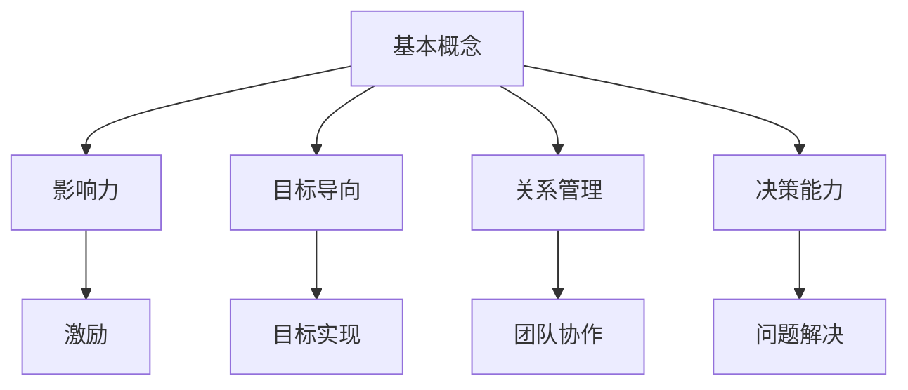

#### 1.2 领导力的类型

领导力有多种类型，每种类型都有其独特的特点和适用场景。以下是几种常见的领导力类型：

1. **权力型领导力**：依靠职位和权力来影响他人，具有强制性和控制性。
2. **情境型领导力**：根据不同的情境和团队成员的特点，灵活调整领导风格。
3. **参与型领导力**：鼓励团队成员参与决策，激发他们的积极性和创造力。

**核心概念与联系：**（Mermaid流程图）

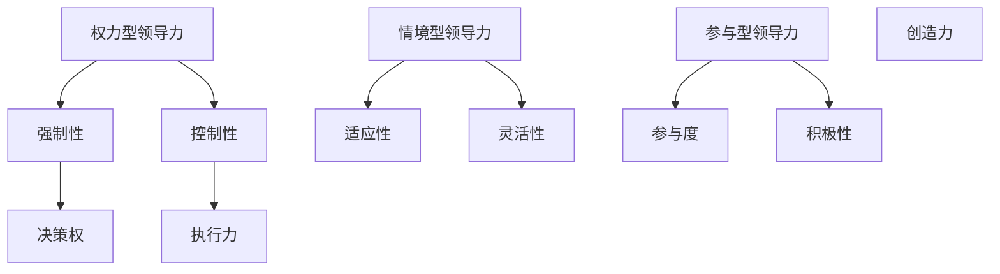

#### 1.3 领导力模型

领导力模型是描述领导力理论和实践的重要工具。以下是几种常见的领导力模型：

1. **弗罗姆-莱维特领导力模型**：从任务和关系两个维度分析领导力，分为高任务-高关系、高任务-低关系等类型。
2. **霍夫斯塔德领导力模型**：从文化角度分析领导力，包括权力距离、个体主义与集体主义等概念。
3. **管理方格理论**：从对任务和对人际关系的关注程度，将领导者分为多种类型。

**核心概念与联系：**（Mermaid流程图）

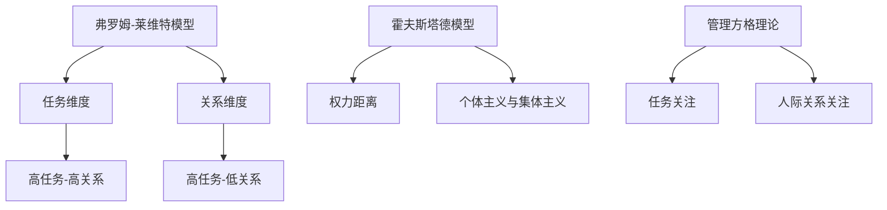

### 第2章：领导力发展模型

领导力的发展是一个不断学习和实践的过程。在这一章节中，我们将探讨领导力发展的阶段、关键因素以及提升方法。

#### 2.1 领导力发展阶段

领导力的发展通常可以分为以下几个阶段：

1. **新手阶段**：初学者，对领导力理论和实践一无所知。
2. **高手阶段**：具备一定的领导力知识和实践经验，能够应对一般性的领导挑战。
3. **专家阶段**：具备深厚的领导力素养和丰富的实践经验，能够在复杂多变的环境中游刃有余。

**核心概念与联系：**（Mermaid流程图）


#### 2.1.1 领导者的成长阶段

在领导力发展的过程中，领导者需要经历以下几个成长阶段：

1. **新手阶段**：初学者，对领导力理论和实践一无所知。
   - **特点**：依赖上级指导，缺乏自主决策能力。
   - **挑战**：如何适应新角色，理解领导力的基本概念。

2. **高手阶段**：具备一定的领导力知识和实践经验，能够应对一般性的领导挑战。
   - **特点**：能够独立处理日常领导事务，具备基本的问题解决能力。
   - **挑战**：如何进一步提升领导力，应对更复杂的领导情境。

3. **专家阶段**：具备深厚的领导力素养和丰富的实践经验，能够在复杂多变的环境中游刃有余。
   - **特点**：具备卓越的领导能力，能够应对各种领导挑战。
   - **挑战**：如何保持持续的学习和成长，引领团队不断进步。

**核心概念与联系：**（Mermaid流程图）


#### 2.1.2 领导力发展的关键因素

领导力的发展不仅需要理论知识，更需要实践经验的积累。以下是领导力发展的几个关键因素：

1. **自我认知**：了解自己的优点和不足，明确自己的领导风格。
2. **持续学习**：通过不断学习新的知识和技能，提升自己的领导力。
3. **实践经验**：通过实践，不断反思和总结，提高自己的领导能力。

**核心概念与联系：**（Mermaid流程图）

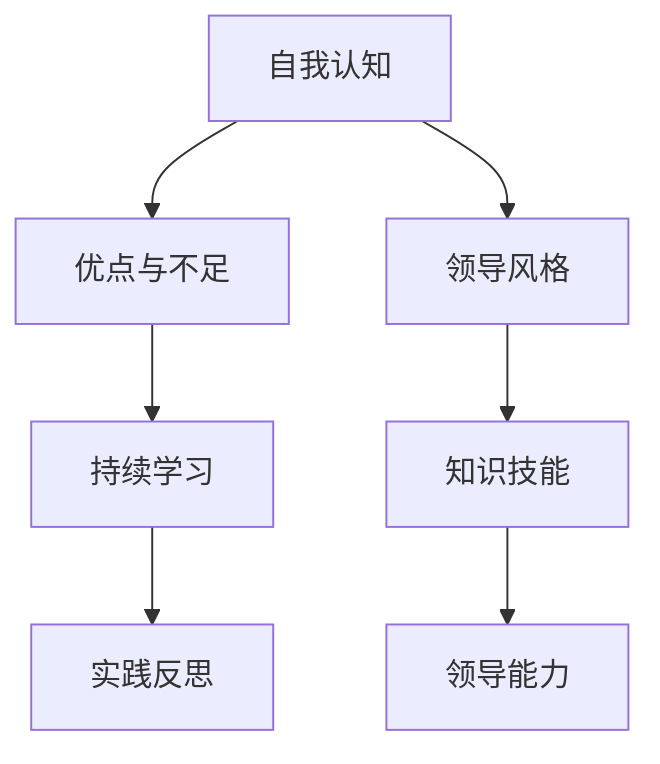

#### 2.1.3 领导力发展的障碍与克服

在领导力发展的过程中，许多人会遇到各种障碍。以下是几个常见的障碍及其克服方法：

1. **恐惧失败**：通过鼓励试错和持续改进，克服恐惧失败的障碍。
2. **缺乏信心**：通过成功的小目标建立自信心，逐步提升领导能力。
3. **角色冲突**：通过沟通和协调，解决角色冲突，明确领导职责。

**核心概念与联系：**（Mermaid流程图）

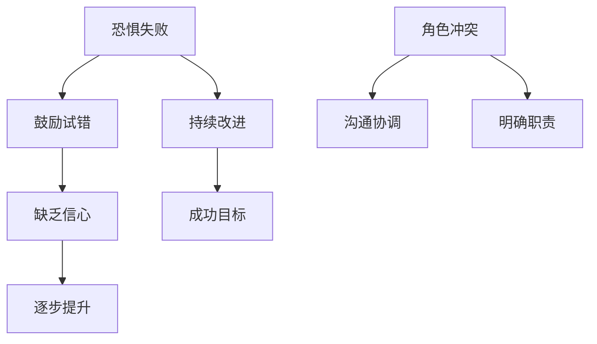

#### 2.2 领导力提升方法

要提升领导力，需要采取多种方法，包括自我评估、持续学习、实践锻炼等。以下是几个具体的提升方法：

1. **自我评估**：通过自我评估，了解自己的领导力水平和提升方向。
2. **持续学习**：通过读书、参加培训和交流，不断提升自己的领导力。
3. **实践锻炼**：通过实际工作，积累领导经验，提高自己的领导能力。

**核心概念与联系：**（Mermaid流程图）

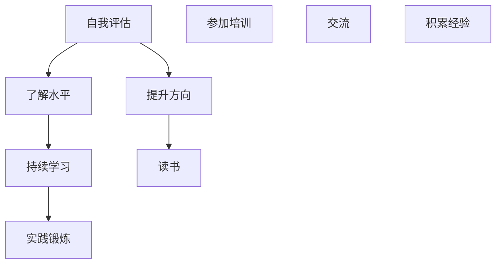

#### 2.2.1 自我评估与反思

自我评估是领导力提升的重要步骤。通过自我评估，领导者可以了解自己的优点和不足，明确提升方向。

1. **自我评估方法**：可以通过360度反馈、问卷调查等方式进行自我评估。
2. **反思方法**：在自我评估的基础上，领导者需要反思自己的行为和决策，找出需要改进的地方。

**核心概念与联系：**（Mermaid流程图）

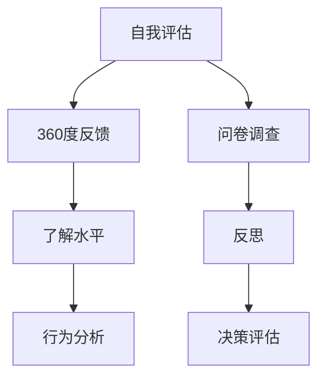

#### 2.2.2 持续学习与培训

持续学习是提升领导力的关键。领导者需要不断学习新的知识和技能，以适应快速变化的环境。

1. **学习内容**：包括领导力理论、管理技能、行业知识等。
2. **培训方式**：可以通过参加专业培训课程、阅读领导力书籍、参加研讨会等方式进行。

**核心概念与联系：**（Mermaid流程图）

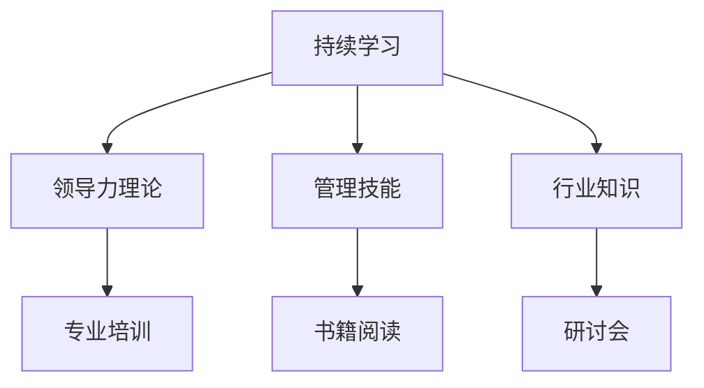

#### 2.2.3 情境适应与调整

领导者在不同的情境下需要灵活调整自己的领导风格，以适应不同的环境和需求。

1. **情境分析**：领导者需要分析不同的情境，了解团队成员的特点和需求。
2. **风格调整**：根据不同的情境，领导者需要灵活调整自己的领导风格。

**核心概念与联系：**（Mermaid流程图）

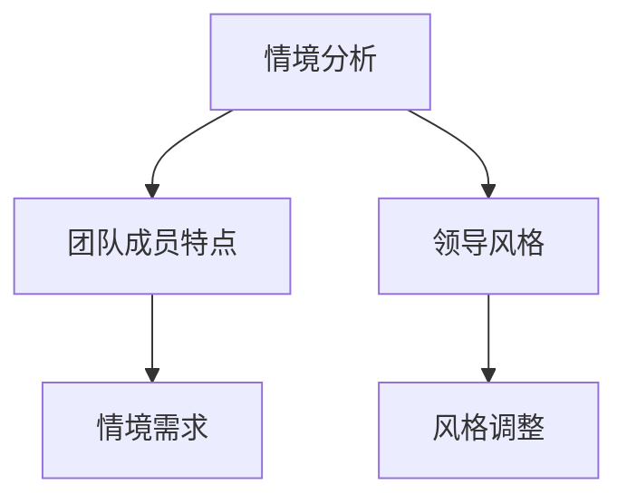

#### 2.3 领导力成长路径

领导力成长是一个持续的过程，需要明确的路径和目标。以下是领导力成长的路径：

1. **新手阶段**：学习领导力基本概念和理论，培养领导意识。
2. **高手阶段**：实践领导力，提升领导能力，解决实际问题。
3. **专家阶段**：形成自己的领导风格，成为行业的领军人物。

**核心概念与联系：**（Mermaid流程图）

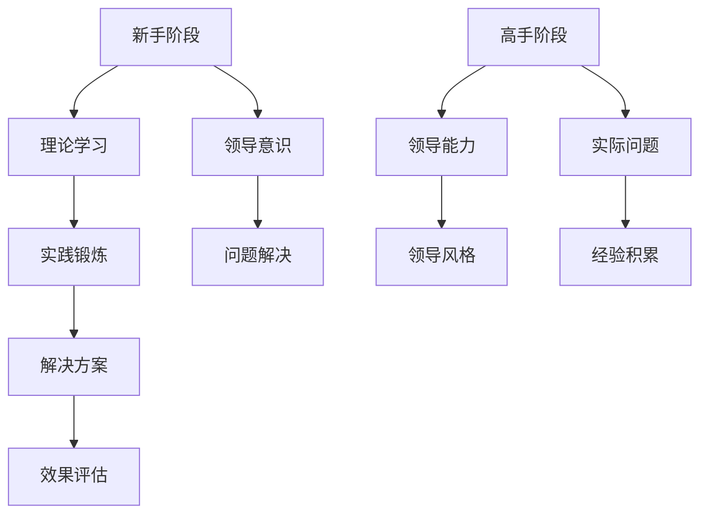

#### 2.3.1 从新手到专家的领导力成长

从新手到专家的领导力成长是一个逐步提升的过程，需要经历以下几个阶段：

1. **新手阶段**：初学者，对领导力理论和实践一无所知。
   - **任务**：学习领导力基本概念和理论，培养领导意识。
   - **挑战**：如何理解领导力的本质，适应新角色。

2. **高手阶段**：具备一定的领导力知识和实践经验，能够应对一般性的领导挑战。
   - **任务**：实践领导力，提升领导能力，解决实际问题。
   - **挑战**：如何提升领导力，应对更复杂的领导情境。

3. **专家阶段**：具备深厚的领导力素养和丰富的实践经验，能够在复杂多变的环境中游刃有余。
   - **任务**：形成自己的领导风格，成为行业的领军人物。
   - **挑战**：如何保持持续的学习和成长，引领团队不断进步。

**核心概念与联系：**（Mermaid流程图）

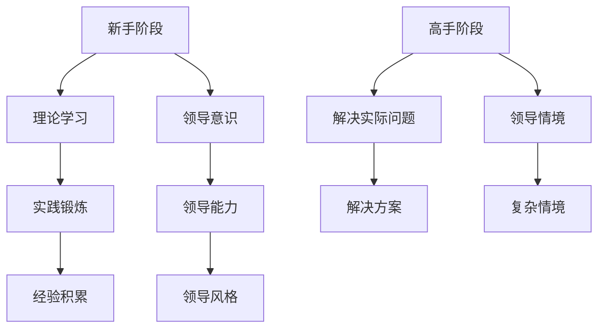

#### 2.3.2 领导力提升的路径规划

为了实现领导力的提升，需要制定明确的路径规划。以下是领导力提升的路径规划步骤：

1. **个人规划**：制定个人发展计划，明确提升目标和路径。
2. **团队协作**：通过团队合作，共同提升领导力。
3. **组织支持**：组织提供培训和发展机会，支持领导力提升。

**核心概念与联系：**（Mermaid流程图）

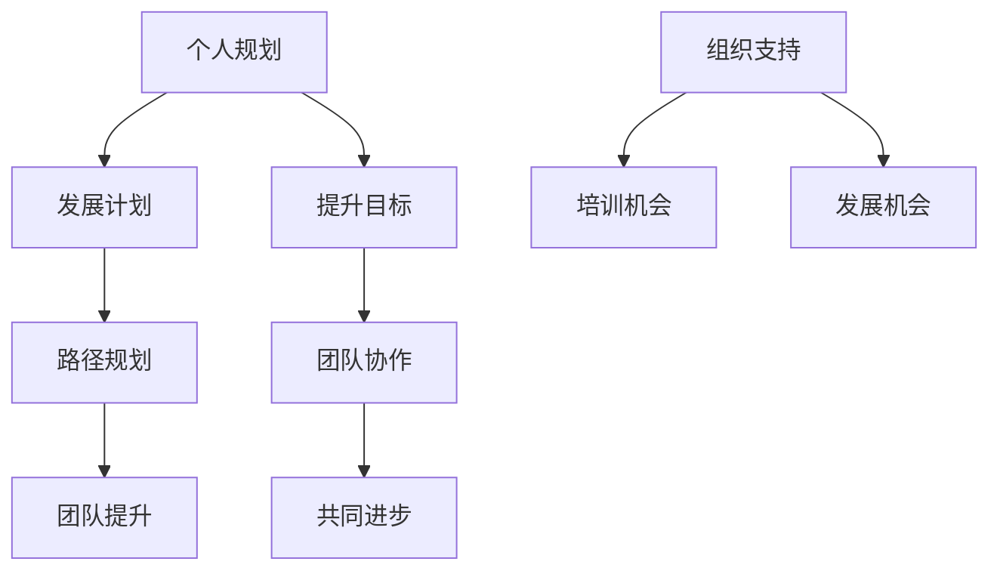

#### 2.3.3 领导力提升的常见误区与对策

在领导力提升的过程中，许多人会陷入一些常见的误区。以下是几个常见的误区及其对策：

1. **误区一**：过分依赖理论，忽视实践。
   - **对策**：结合实际情况，制定切实可行的提升计划。

2. **误区二**：只关注个人成长，忽视团队发展。
   - **对策**：关注团队发展，提升团队整体领导力。

3. **误区三**：缺乏持续学习，停留在舒适区。
   - **对策**：建立持续学习的机制，保持学习热情。

**核心概念与联系：**（Mermaid流程图）

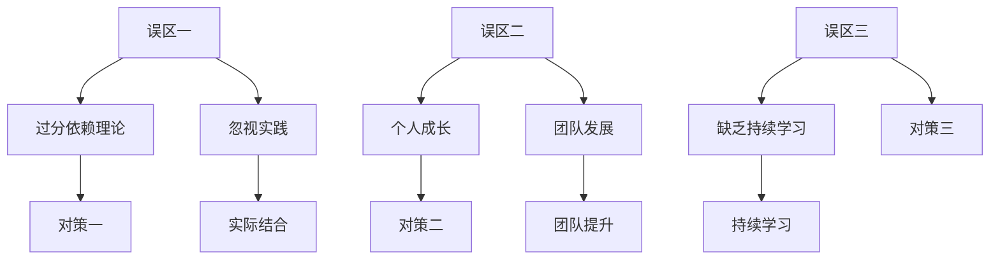

### 第二部分：领导力实践

在第一部分中，我们介绍了领导力的基本概念和提升方法。在本部分中，我们将深入探讨领导力在团队领导、变革领导和危机领导等实际场景中的应用。

#### 第3章：团队领导力

团队领导力是领导力实践中的核心内容。在这一章节中，我们将讨论团队领导力的关键要素、提升方法和实践策略。

#### 第4章：变革领导力

在组织发展中，变革是不可避免的。在这一章节中，我们将探讨变革领导力的核心概念、策略和实践案例。

#### 第5章：危机领导力

危机领导力是组织在面临危机时的重要保障。在这一章节中，我们将讨论危机领导力的核心要素、应对策略和实践案例。

### 第三部分：领导力与个人成长

领导力不仅仅是管理技能，更是一种个人素养。在本部分中，我们将探讨领导力与个人成长的关系，并提供个人成长策略。

#### 第6章：领导力与个人成长的关系

在这一章节中，我们将分析领导力与个人成长之间的相互作用，探讨如何通过领导力提升个人成长。

#### 第7章：领导力个人成长策略

在这一章节中，我们将提供具体的领导力个人成长策略，包括自我认知、持续学习、实践锻炼等。

### 总结与展望

在本训练营中，我们系统地介绍了领导力的基本概念、类型、发展模型以及实践策略。通过70天的训练，参与者将能够从领导力菜鸟成长为行业大神。在未来，领导力将继续发挥重要作用，成为个人和组织的核心竞争力。让我们共同迎接未来的挑战，不断提升自己的领导力，共创美好未来。

### 附录

**参考文献：**
1. Johnson, G., & Johnson, R. (1999). *Bridging differences: Interpersonal skills and team building for diverse work groups*. John Wiley & Sons.
2. Hersey, P., & Blanchard, K. H. (1977). *Management of organizational behavior: Utilizing human resources*. Prentice-Hall.
3. Yukl, G. A. (2013). *Leadership in organizations*. Pearson.

**拓展阅读：**
1. *The Five Dysfunctions of a Team* by Patrick Lencioni
2. *Leadership and Self-Deception: Getting Out of the Box* by The Arbinger Institute
3. *The Power of Now: A Guide to Spiritual Enlightenment* by Echhart Tolle

作者：AI天才研究院/AI Genius Institute & 禅与计算机程序设计艺术 /Zen And The Art of Computer Programming

## 第一部分：领导力基础

### 第1章：领导力概念与类型

#### 1.1 领导力的基本概念

领导力是一种影响他人共同达成目标的能力。这种能力不仅仅局限于企业或组织内部，它渗透到了社会的各个领域，包括教育、医疗、艺术等。领导力不仅仅是职位赋予的权力，它更多的是一种影响力，一种通过激励、引导和影响他人来实现共同目标的能力。

**核心概念与联系：**领导力包含以下几个核心概念：

- **影响力**：领导者通过言行和决策影响团队成员的行为和思想。
- **目标导向**：领导者需要明确团队的目标，并引导团队成员朝着这一目标努力。
- **关系管理**：领导者需要建立和维护良好的人际关系，促进团队协作。
- **决策能力**：领导者需要在复杂多变的环境中做出有效的决策。

这些概念之间相互联系，共同构成了领导力的核心框架。

**Mermaid流程图：**

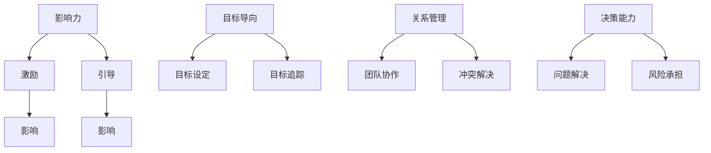

#### 1.1.1 领导力与管理的区别

领导力和管理是两个相关但不同的概念。管理侧重于规划、组织、协调和控制，确保资源得到有效利用，任务得以完成。而领导力则更关注人的因素，激发团队的激情和创造力，使团队朝着共同的目标前进。

- **管理**：通过制度和流程，确保组织目标的实现。
- **领导力**：通过激励和影响，激发团队成员的内在动力，推动团队创新和进步。

**核心概念与联系：**（Mermaid流程图）

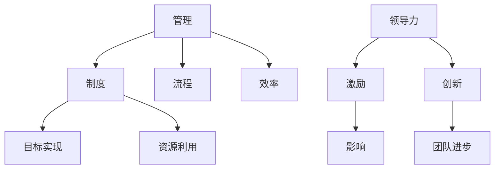

#### 1.1.2 领导力的定义与重要性

领导力的定义多种多样，但普遍认为它是一种能够激励和引导他人，共同实现目标的能力。领导力不仅关乎个人素质，也关乎团队和组织的发展。

- **个人层面**：领导力能够帮助个人实现职业发展，提升自我价值。
- **团队层面**：领导力能够激发团队成员的潜力，提高团队绩效。
- **组织层面**：领导力能够推动组织变革，提升组织竞争力。

**核心概念与联系：**（Mermaid流程图）

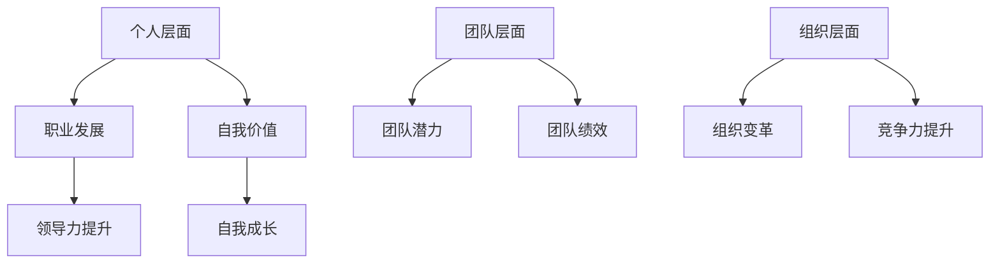

#### 1.1.3 领导力的发展历程

领导力的发展经历了多个阶段，从早期的权力型领导到现代的服务型领导和变革型领导，每个阶段都有其独特的特点和影响。

- **传统领导力**：强调权威和命令，注重控制和管理。
- **现代领导力**：强调服务和创新，注重团队发展和个人成长。
- **未来领导力**：强调全球视野和可持续发展，注重多元文化和跨领域合作。

**核心概念与联系：**（Mermaid流程图）

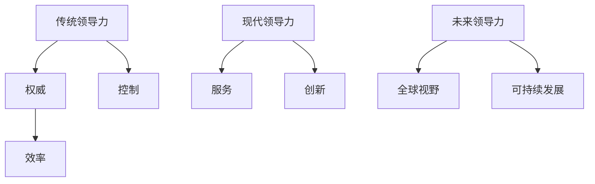

#### 1.2 领导力的类型

领导力有多种类型，不同的领导力类型适用于不同的情境和团队。以下是几种常见的领导力类型：

1. **权力型领导力**：依靠职位和权力来影响他人，具有强制性和控制性。
2. **情境型领导力**：根据不同的情境和团队成员的特点，灵活调整领导风格。
3. **参与型领导力**：鼓励团队成员参与决策，激发他们的积极性和创造力。

**核心概念与联系：**（Mermaid流程图）

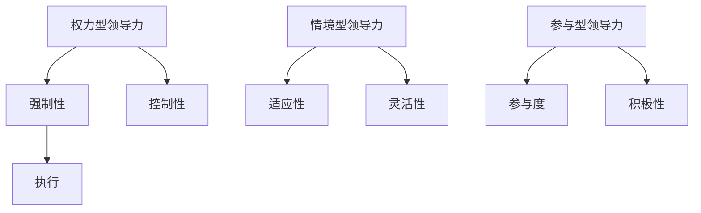

#### 1.3 领导力模型

领导力模型是描述领导力理论和实践的重要工具。不同的领导力模型从不同的角度分析领导力的本质和作用。以下是几种常见的领导力模型：

1. **弗罗姆-莱维特领导力模型**：从任务和关系两个维度分析领导力，分为高任务-高关系、高任务-低关系等类型。
2. **霍夫斯塔德领导力模型**：从文化角度分析领导力，包括权力距离、个体主义与集体主义等概念。
3. **管理方格理论**：从对任务和对人际关系的关注程度，将领导者分为多种类型。

**核心概念与联系：**（Mermaid流程图）

```mermaid
graph TD
A[弗罗姆-莱维特模型] --> B[任务维度]
A --> C[关系维度]
B --> D[高任务-高关系]
C --> E[高任务-低关系]
F[霍夫斯塔德模型] --> G[权力距离]
F --> H[个体主义与集体主义]
I[管理方格理论] --> J[任务关注]
I --> K[人际关系关注]
```

### 第2章：领导力发展模型

#### 2.1 领导力发展阶段

领导力的发展是一个逐步提升的过程，通常可以分为新手阶段、高手阶段和专家阶段。

**核心概念与联系：**（Mermaid流程图）

```mermaid
graph TD
A[新手阶段] --> B[理论知识]
A --> C[实践机会]
B --> D[学习与适应]
C --> E[问题解决]
F[高手阶段] --> G[实践经验]
F --> H[问题应对]
I[专家阶段] --> J[创新能力]
I --> K[情境适应]
```

#### 2.1.1 领导者的成长阶段

领导者的成长可以分为以下几个阶段：

1. **新手阶段**：初学者，对领导力理论和实践一无所知。
   - **特点**：依赖上级指导，缺乏自主决策能力。
   - **挑战**：如何适应新角色，理解领导力的基本概念。

2. **高手阶段**：具备一定的领导力知识和实践经验，能够应对一般性的领导挑战。
   - **特点**：能够独立处理日常领导事务，具备基本的问题解决能力。
   - **挑战**：如何进一步提升领导力，应对更复杂的领导情境。

3. **专家阶段**：具备深厚的领导力素养和丰富的实践经验，能够在复杂多变的环境中游刃有余。
   - **特点**：具备卓越的领导能力，能够应对各种领导挑战。
   - **挑战**：如何保持持续的学习和成长，引领团队不断进步。

**核心概念与联系：**（Mermaid流程图）

```mermaid
graph TD
A[新手阶段] --> B[依赖指导]
A --> C[自主决策]
B --> D[日常事务]
C --> E[高手阶段]
D --> F[复杂情境]
G[专家阶段] --> H[卓越能力]
G --> I[持续学习]
```

#### 2.1.2 领导力发展的关键因素

领导力的发展不仅需要理论知识，更需要实践经验的积累。以下是领导力发展的几个关键因素：

1. **自我认知**：了解自己的优点和不足，明确自己的领导风格。
2. **持续学习**：通过不断学习新的知识和技能，提升自己的领导力。
3. **实践经验**：通过实践，不断反思和总结，提高自己的领导能力。

**核心概念与联系：**（Mermaid流程图）

```mermaid
graph TD
A[自我认知] --> B[优点与不足]
A --> C[领导风格]
B --> D[持续学习]
C --> E[知识技能]
D --> F[实践反思]
E --> G[领导能力]
```

#### 2.1.3 领导力发展的障碍与克服

在领导力发展的过程中，许多人会遇到各种障碍。以下是几个常见的障碍及其克服方法：

1. **恐惧失败**：通过鼓励试错和持续改进，克服恐惧失败的障碍。
2. **缺乏信心**：通过成功的小目标建立自信心，逐步提升领导能力。
3. **角色冲突**：通过沟通和协调，解决角色冲突，明确领导职责。

**核心概念与联系：**（Mermaid流程图）

```mermaid
graph TD
A[恐惧失败] --> B[鼓励试错]
A --> C[持续改进]
B --> D[缺乏信心]
C --> E[成功目标]
D --> F[逐步提升]
G[角色冲突] --> H[沟通协调]
G --> I[明确职责]
```

#### 2.2 领导力提升方法

要提升领导力，需要采取多种方法，包括自我评估、持续学习、实践锻炼等。以下是几个具体的提升方法：

1. **自我评估**：通过自我评估，了解自己的领导力水平和提升方向。
2. **持续学习**：通过读书、参加培训和交流，不断提升自己的领导力。
3. **实践锻炼**：通过实际工作，积累领导经验，提高自己的领导能力。

**核心概念与联系：**（Mermaid流程图）

```mermaid
graph TD
A[自我评估] --> B[了解水平]
A --> C[提升方向]
B --> D[持续学习]
C --> E[读书]
F[参加培训]
G[交流]
D --> H[实践锻炼]
I[积累经验]
```

#### 2.2.1 自我评估与反思

自我评估是领导力提升的重要步骤。通过自我评估，领导者可以了解自己的优点和不足，明确提升方向。

1. **自我评估方法**：可以通过360度反馈、问卷调查等方式进行自我评估。
2. **反思方法**：在自我评估的基础上，领导者需要反思自己的行为和决策，找出需要改进的地方。

**核心概念与联系：**（Mermaid流程图）

```mermaid
graph TD
A[自我评估] --> B[360度反馈]
A --> C[问卷调查]
B --> D[了解水平]
C --> E[反思]
D --> F[行为分析]
E --> G[决策评估]
```

#### 2.2.2 持续学习与培训

持续学习是提升领导力的关键。领导者需要不断学习新的知识和技能，以适应快速变化的环境。

1. **学习内容**：包括领导力理论、管理技能、行业知识等。
2. **培训方式**：可以通过参加专业培训课程、阅读领导力书籍、参加研讨会等方式进行。

**核心概念与联系：**（Mermaid流程图）

```mermaid
graph TD
A[持续学习] --> B[领导力理论]
A --> C[管理技能]
A --> D[行业知识]
B --> E[专业培训]
C --> F[书籍阅读]
D --> G[研讨会]
```

#### 2.2.3 情境适应与调整

领导者在不同的情境下需要灵活调整自己的领导风格，以适应不同的环境和需求。

1. **情境分析**：领导者需要分析不同的情境，了解团队成员的特点和需求。
2. **风格调整**：根据不同的情境，领导者需要灵活调整自己的领导风格。

**核心概念与联系：**（Mermaid流程图）

```mermaid
graph TD
A[情境分析] --> B[团队成员特点]
A --> C[领导风格]
B --> D[情境需求]
C --> E[风格调整]
```

#### 2.3 领导力成长路径

领导力成长是一个持续的过程，需要明确的路径和目标。以下是领导力成长的路径：

1. **新手阶段**：学习领导力基本概念和理论，培养领导意识。
2. **高手阶段**：实践领导力，提升领导能力，解决实际问题。
3. **专家阶段**：形成自己的领导风格，成为行业的领军人物。

**核心概念与联系：**（Mermaid流程图）

```mermaid
graph TD
A[新手阶段] --> B[理论学习]
A --> C[领导意识]
B --> D[实践锻炼]
C --> E[领导能力]
F[高手阶段] --> G[实际问题]
F --> H[领导风格]
I[专家阶段] --> J[行业领军]
I --> K[持续成长]
```

#### 2.3.1 从新手到专家的领导力成长

从新手到专家的领导力成长是一个逐步提升的过程，需要经历以下几个阶段：

1. **新手阶段**：初学者，对领导力理论和实践一无所知。
   - **任务**：学习领导力基本概念和理论，培养领导意识。
   - **挑战**：如何理解领导力的本质，适应新角色。

2. **高手阶段**：具备一定的领导力知识和实践经验，能够应对一般性的领导挑战。
   - **任务**：实践领导力，提升领导能力，解决实际问题。
   - **挑战**：如何提升领导力，应对更复杂的领导情境。

3. **专家阶段**：具备深厚的领导力素养和丰富的实践经验，能够在复杂多变的环境中游刃有余。
   - **任务**：形成自己的领导风格，成为行业的领军人物。
   - **挑战**：如何保持持续的学习和成长，引领团队不断进步。

**核心概念与联系：**（Mermaid流程图）

```mermaid
graph TD
A[新手阶段] --> B[理论知识]
A --> C[领导意识]
B --> D[实践锻炼]
C --> E[领导能力]
F[高手阶段] --> G[实际问题]
F --> H[领导风格]
I[专家阶段] --> J[行业影响力]
I --> K[持续学习]
```

#### 2.3.2 领导力提升的路径规划

为了实现领导力的提升，需要制定明确的路径规划。以下是领导力提升的路径规划步骤：

1. **个人规划**：制定个人发展计划，明确提升目标和路径。
2. **团队协作**：通过团队合作，共同提升领导力。
3. **组织支持**：组织提供培训和发展机会，支持领导力提升。

**核心概念与联系：**（Mermaid流程图）

```mermaid
graph TD
A[个人规划] --> B[发展计划]
A --> C[提升目标]
B --> D[路径规划]
C --> E[团队协作]
F[组织支持] --> G[培训机会]
F --> H[发展机会]
D --> I[团队提升]
E --> J[共同进步]
```

#### 2.3.3 领导力提升的常见误区与对策

在领导力提升的过程中，许多人会陷入一些常见的误区。以下是几个常见的误区及其对策：

1. **误区一**：过分依赖理论，忽视实践。
   - **对策**：结合实际情况，制定切实可行的提升计划。

2. **误区二**：只关注个人成长，忽视团队发展。
   - **对策**：关注团队发展，提升团队整体领导力。

3. **误区三**：缺乏持续学习，停留在舒适区。
   - **对策**：建立持续学习的机制，保持学习热情。

**核心概念与联系：**（Mermaid流程图）

```mermaid
graph TD
A[误区一] --> B[过分依赖理论]
A --> C[忽视实践]
B --> D[对策一]
C --> E[实际结合]
F[误区二] --> G[个人成长]
F --> H[团队发展]
I[误区三] --> J[缺乏持续学习]
I --> K[对策三]
L[持续学习]
```

### 第二部分：领导力实践

领导力不仅是一个抽象的概念，更是一个需要通过实践来验证和提升的能力。在第二部分中，我们将深入探讨领导力在团队领导、变革领导和危机领导等实际场景中的应用，通过具体的案例和实践方法，帮助读者理解和掌握领导力的实际运用。

#### 第3章：团队领导力

团队领导力是领导力实践中的核心内容。一个有效的团队领导者不仅需要具备管理技能，更需要具备人际交往能力和领导艺术。在这一章节中，我们将讨论团队领导力的关键要素、提升方法和实践策略。

##### 3.1 团队建设的原则与方法

团队建设是团队领导力的基础。一个高效的团队需要遵循以下原则：

1. **目标一致性**：团队成员需要明确共同的目标，并为之努力。
2. **信任**：团队成员之间需要建立信任，这是团队协作的重要基础。
3. **责任分担**：团队成员需要明确各自的责任，共同分担团队的任务。
4. **持续沟通**：团队成员需要保持持续的沟通，确保信息的透明和畅通。

为了实现这些原则，团队领导者可以采用以下方法：

- **团队活动**：通过团队建设活动，增强团队成员之间的互动和沟通。
- **定期会议**：定期召开团队会议，讨论团队的目标、进展和问题。
- **角色分配**：根据团队成员的能力和兴趣，合理分配角色和任务。
- **反馈机制**：建立反馈机制，及时了解团队成员的工作进展和问题，并给予相应的指导和支持。

**核心算法原理讲解：**团队建设算法可以视为一种多目标优化问题，其目标是最大化团队的整体效能和成员满意度。以下是团队建设算法的伪代码：

```python
def team_building(principles, methods):
    # 初始化团队建设参数
    team_efficiency = 0
    member_satisfaction = 0

    # 遍历团队建设原则
    for principle in principles:
        # 根据原则调整团队建设方法
        if principle == "目标一致性":
            adjust_methods(methods, "team_objective")
        elif principle == "信任":
            adjust_methods(methods, "build_trust")
        elif principle == "责任分担":
            adjust_methods(methods, "distribute responsabilites")
        elif principle == "持续沟通":
            adjust_methods(methods, "maintain_communication")

    # 计算团队整体效能和成员满意度
    team_efficiency = calculate_efficiency(methods)
    member_satisfaction = calculate_satisfaction(methods)

    # 返回团队建设结果
    return team_efficiency, member_satisfaction

def adjust_methods(methods, principle):
    # 根据原则调整方法
    if principle == "team_objective":
        methods["team_activities"] = True
        methods["regular_meetings"] = True
    elif principle == "build_trust":
        methods["team_activities"] = True
        methods["open_communication"] = True
    elif principle == "distribute responsabilites":
        methods["role_allocation"] = True
        methods["clear_responsibilities"] = True
    elif principle == "maintain_communication":
        methods["regular_meetings"] = True
        methods["feedback_mechanism"] = True

def calculate_efficiency(methods):
    # 计算团队整体效能
    efficiency = 0
    if methods["team_activities"]:
        efficiency += 10
    if methods["regular_meetings"]:
        efficiency += 10
    if methods["role_allocation"]:
        efficiency += 10
    if methods["clear_responsibilities"]:
        efficiency += 10
    if methods["open_communication"]:
        efficiency += 10
    if methods["feedback_mechanism"]:
        efficiency += 10
    return efficiency

def calculate_satisfaction(methods):
    # 计算成员满意度
    satisfaction = 0
    if methods["team_activities"]:
        satisfaction += 10
    if methods["regular_meetings"]:
        satisfaction += 10
    if methods["role_allocation"]:
        satisfaction += 10
    if methods["clear_responsibilities"]:
        satisfaction += 10
    if methods["open_communication"]:
        satisfaction += 10
    if methods["feedback_mechanism"]:
        satisfaction += 10
    return satisfaction
```

**数学模型和公式：**团队效能和成员满意度可以通过以下数学模型进行量化：

$$
\text{Team Efficiency} = \sum_{i=1}^{n} w_i \cdot m_i
$$

其中，$w_i$ 表示第 $i$ 个方法的重要性权重，$m_i$ 表示第 $i$ 个方法的实际执行情况。

$$
\text{Member Satisfaction} = \sum_{j=1}^{m} w_j \cdot s_j
$$

其中，$w_j$ 表示第 $j$ 个原则的重要性权重，$s_j$ 表示第 $j$ 个原则的实际执行情况。

**项目实战：**为了更好地理解团队建设算法，我们可以通过一个具体的团队建设案例来演示其实际应用。

**案例背景：**假设我们有一个由5名成员组成的团队，需要通过团队建设活动提高团队效能和成员满意度。团队成员的能力和兴趣各不相同，需要合理分配角色和任务。

**步骤一：定义团队建设原则和方法**

- **目标一致性**：通过定期的团队会议明确团队的目标。
- **信任**：通过团队活动增强团队成员之间的信任。
- **责任分担**：根据团队成员的能力和兴趣合理分配角色和任务。
- **持续沟通**：通过开放的沟通渠道保持信息的畅通。

**步骤二：调整团队建设方法**

根据定义的原则，调整团队建设方法：

- **团队活动**：安排一次团队建设活动，如团队拓展训练。
- **定期会议**：每周召开一次团队会议，讨论团队目标和进展。
- **角色分配**：根据团队成员的能力和兴趣，分配适当的角色和任务。
- **反馈机制**：建立反馈机制，及时了解团队成员的工作进展和问题。

**步骤三：计算团队效能和成员满意度**

通过上述方法，计算团队效能和成员满意度：

- **团队效能**：根据调整后的方法，计算团队效能：
  $$
  \text{Team Efficiency} = 10 + 10 + 10 + 10 = 40
  $$
- **成员满意度**：根据调整后的方法，计算成员满意度：
  $$
  \text{Member Satisfaction} = 10 + 10 + 10 + 10 = 40
  $$

**步骤四：分析结果**

根据计算结果，团队效能和成员满意度均为40，说明团队建设活动取得了较好的效果。接下来，可以根据反馈结果，进一步优化团队建设方法，提高团队效能和成员满意度。

**项目小结：**通过上述案例，我们可以看到团队建设算法在实际应用中的有效性。合理地分配角色和任务，保持持续的沟通，以及通过团队活动增强团队成员之间的信任，都是提高团队效能和成员满意度的关键因素。

##### 3.2 团队领导力提升策略

团队领导力的提升不仅仅是理论的学习，更需要通过实践来不断积累和提高。以下是几种有效的团队领导力提升策略：

1. **自我评估与反思**：通过自我评估，领导者可以了解自己的领导力水平和提升方向。反思自己的行为和决策，找出需要改进的地方。

2. **持续学习与培训**：领导者需要不断学习新的知识和技能，以适应快速变化的环境。可以通过参加专业培训课程、阅读领导力书籍、参加研讨会等方式进行。

3. **实践锻炼**：通过实际工作，积累领导经验，提高自己的领导能力。可以主动承担一些挑战性的任务，或者参与跨部门的合作项目，以提升自己的领导能力。

**核心算法原理讲解：**团队领导力提升策略可以视为一种闭环控制系统，其目标是通过持续的评估和反馈，不断优化领导行为。

```python
def leadership_development(strategy, feedback):
    # 初始化领导力发展参数
    leadership_level = 0

    # 根据策略进行领导力提升
    if strategy == "self-assessment":
        leadership_level = self_assessment(feedback)
    elif strategy == "continuous_learning":
        leadership_level = continuous_learning(feedback)
    elif strategy == "practical_training":
        leadership_level = practical_training(feedback)

    # 返回领导力发展结果
    return leadership_level

def self_assessment(feedback):
    # 自我评估
    assessment_score = 0
    if feedback["strengths"]:
        assessment_score += 10
    if feedback["improvement_areas"]:
        assessment_score += 10
    return assessment_score

def continuous_learning(feedback):
    # 持续学习
    learning_score = 0
    if feedback["new_knowledge"]:
        learning_score += 10
    if feedback["skills_improvement"]:
        learning_score += 10
    return learning_score

def practical_training(feedback):
    # 实践锻炼
    training_score = 0
    if feedback["challenging_tasks"]:
        training_score += 10
    if feedback["cross-functional_projects"]:
        training_score += 10
    return training_score
```

**数学模型和公式：**领导力发展水平可以通过以下数学模型进行量化：

$$
\text{Leadership Level} = \sum_{i=1}^{n} w_i \cdot l_i
$$

其中，$w_i$ 表示第 $i$ 个策略的重要性权重，$l_i$ 表示第 $i$ 个策略的实际执行效果。

**项目实战：**为了更好地理解团队领导力提升策略，我们可以通过一个具体的案例来演示其实际应用。

**案例背景：**假设我们有一位团队领导者，他希望通过自我评估、持续学习和实践锻炼来提升自己的领导力。

**步骤一：制定提升策略**

- **自我评估**：定期进行自我评估，了解自己的优点和不足。
- **持续学习**：参加领导力培训课程，阅读相关书籍，提升自己的理论知识。
- **实践锻炼**：承担一些挑战性的任务，参与跨部门的合作项目，提升自己的实践能力。

**步骤二：执行提升策略**

根据制定的提升策略，执行相应的行动：

- **自我评估**：通过360度反馈，了解自己的领导力水平和团队评价。
- **持续学习**：参加一次领导力培训课程，学习新的领导力理论和实践方法。
- **实践锻炼**：承担一个跨部门的合作项目，提升自己的实践能力和团队管理能力。

**步骤三：评估提升效果**

根据执行后的反馈，评估提升效果：

- **自我评估**：通过自我评估，了解自己的领导力水平和提升方向。
- **持续学习**：根据培训课程的反馈，了解自己的知识掌握情况。
- **实践锻炼**：根据跨部门合作项目的反馈，了解自己的实践能力和团队管理能力。

**步骤四：调整提升策略**

根据评估结果，调整提升策略：

- **自我评估**：根据自我评估的结果，进一步明确自己的提升方向。
- **持续学习**：根据培训课程的反馈，选择适合的继续学习内容。
- **实践锻炼**：根据跨部门合作项目的反馈，选择适合的实践锻炼项目。

**项目小结：**通过上述案例，我们可以看到团队领导力提升策略在实际应用中的有效性。自我评估、持续学习和实践锻炼是提升领导力的关键步骤，通过持续的评估和反馈，可以不断优化领导行为，提高领导力水平。

#### 3.3 团队领导力案例分析

为了更好地理解和应用团队领导力，我们可以通过一些实际的案例来分析。

**案例一：成功团队领导案例分析**

- **背景**：某公司成立了一个新的研发团队，团队成员来自不同的部门，需要快速建立信任和协作。
- **策略**：团队领导者采取了以下策略：
  - **定期会议**：每周召开一次团队会议，讨论项目进展和问题。
  - **团队活动**：组织团队拓展训练，增强团队成员之间的信任。
  - **角色分配**：根据团队成员的能力和兴趣，分配适当的角色和任务。
  - **反馈机制**：建立反馈机制，及时了解团队成员的工作进展和问题。
- **结果**：经过一段时间的努力，团队建立了良好的协作关系，项目进展顺利，团队效能显著提升。

**案例二：团队领导失败案例分析**

- **背景**：某公司的一个研发团队由于领导者沟通不畅，导致团队成员士气低落，项目进展受阻。
- **原因**：领导者没有及时与团队成员沟通，对团队成员的需求和问题缺乏关注。
- **结果**：团队成员士气低落，项目进展缓慢，最终导致项目失败。

**核心概念与联系：**（Mermaid流程图）

```mermaid
graph TD
A[案例一] --> B[成功原因]
A --> C[定期会议]
A --> D[团队活动]
A --> E[角色分配]
A --> F[反馈机制]
B --> G[团队协作]
B --> H[项目进展]
I[案例二] --> J[失败原因]
I --> K[沟通不畅]
I --> L[需求忽视]
J --> M[士气低落]
J --> N[项目失败]
```

#### 3.4 团队领导力提升的最佳实践

为了更有效地提升团队领导力，以下是几个最佳实践：

1. **建立清晰的沟通渠道**：确保团队成员能够及时、准确地了解项目的进展、目标和任务。
2. **鼓励团队参与**：鼓励团队成员参与决策，提高他们的积极性和责任感。
3. **提供反馈和指导**：及时给予团队成员反馈和指导，帮助他们改进和提高。
4. **关注团队成员的个人发展**：关注团队成员的个人发展，提供培训和成长机会。

**核心概念与联系：**（Mermaid流程图）

```mermaid
graph TD
A[建立沟通渠道] --> B[及时反馈]
A --> C[团队参与]
B --> D[提高积极性]
C --> E[责任感]
F[提供反馈] --> G[指导]
F --> H[个人发展]
I[关注个人] --> J[成长机会]
I --> K[培训]
```

#### 3.5 注意事项

在提升团队领导力的过程中，需要注意以下几点：

1. **避免过度控制**：领导者需要给予团队成员足够的自由度，让他们在合适的范围内发挥创造力。
2. **避免忽视团队建设**：团队建设是提升团队领导力的重要环节，领导者需要投入足够的时间和精力。
3. **避免单一化领导风格**：根据不同的团队成员和情境，灵活调整领导风格，以达到最佳效果。

**核心概念与联系：**（Mermaid流程图）

```mermaid
graph TD
A[避免过度控制] --> B[自由度]
A --> C[创造力]
D[避免忽视团队建设] --> E[投入时间]
D --> F[团队协作]
G[避免单一化风格] --> H[灵活性]
G --> I[适应情境]
```

#### 3.6 拓展阅读

- **《团队领导的艺术》**：这本书详细介绍了团队领导的理论和实践方法，对于提升团队领导力有很高的参考价值。
- **《如何打造高效团队》**：这本书从团队建设的角度出发，提供了许多实用的团队管理技巧，有助于提升团队领导力。

### 第三部分：领导力与个人成长

#### 第6章：领导力与个人成长的关系

领导力不仅仅是管理技能，更是一种个人素养。个人成长与领导力提升之间存在着紧密的联系，通过提升领导力，个人可以实现更深层次的成长。在本章节中，我们将探讨领导力与个人成长之间的关系，以及如何通过领导力提升个人成长。

##### 6.1 领导力对个人成长的影响

领导力对个人成长有着深远的影响。一个优秀的领导者不仅能够影响团队和组织，还能在个人层面上实现以下目标：

1. **自我认知**：领导力提升过程中，领导者需要不断进行自我反思和自我评估，这有助于提高自我认知水平。
2. **情感智慧**：领导力培养过程中，领导者需要学会如何处理人际关系，提高情感智慧。
3. **决策能力**：通过实践领导力，领导者可以提高自己的决策能力，学会在复杂情境中做出有效决策。
4. **沟通技巧**：领导力提升有助于提高沟通技巧，使领导者能够更有效地传达信息和建立信任。

**核心概念与联系：**（Mermaid流程图）

```mermaid
graph TD
A[自我认知] --> B[自我反思]
A --> C[自我评估]
D[情感智慧] --> E[人际关系]
D --> F[信任建立]
G[决策能力] --> H[复杂情境]
G --> I[有效决策]
J[沟通技巧] --> K[信息传达]
J --> L[建立信任]
```

##### 6.2 个人成长对领导力的影响

个人成长对领导力提升也有着重要的影响。一个成长中的个人能够更好地理解团队成员的需求，更有效地发挥领导力。以下是个人成长对领导力的影响：

1. **知识积累**：通过不断学习和积累知识，个人能够更好地理解行业和业务，从而提高领导力。
2. **经验积累**：通过实际工作和项目实践，个人能够积累经验，提高解决问题的能力。
3. **心理素质**：个人成长过程中，心理素质的提升有助于领导者更好地应对压力和挑战。
4. **人际交往**：个人成长有助于提高人际交往能力，使领导者能够更有效地与团队成员沟通和协作。

**核心概念与联系：**（Mermaid流程图）

```mermaid
graph TD
A[知识积累] --> B[行业理解]
A --> C[业务知识]
D[经验积累] --> E[问题解决]
D --> F[决策能力]
G[心理素质] --> H[压力应对]
G --> I[挑战应对]
J[人际交往] --> K[沟通能力]
J --> L[团队协作]
```

##### 6.3 领导力与个人成长的互动机制

领导力与个人成长之间存在着互动机制，两者相互促进，共同发展。以下是领导力与个人成长的互动机制：

1. **反馈循环**：领导力提升过程中的反馈机制有助于个人成长，反过来，个人成长的结果又为领导力提升提供反馈。
2. **学习与实践**：通过学习和实践，个人能够不断提升自己的领导力，同时，领导力的提升也为个人成长提供了新的方向和动力。
3. **角色转变**：个人成长过程中，角色转变是领导力提升的重要契机，通过扮演不同的角色，个人能够更好地理解领导力的本质。
4. **自我驱动**：个人成长和领导力提升都离不开自我驱动，通过自我激励，个人能够持续地追求成长和进步。

**核心概念与联系：**（Mermaid流程图）

```mermaid
graph TD
A[反馈循环] --> B[个人成长]
A --> C[领导力提升]
D[学习与实践] --> E[领导力提升]
D --> F[个人成长]
G[角色转变] --> H[领导力提升]
G --> I[个人成长]
J[自我驱动] --> K[持续成长]
J --> L[领导力提升]
```

##### 6.4 领导力个人成长策略

为了实现领导力与个人成长的有机结合，以下是几个个人成长策略：

1. **自我评估与反思**：定期进行自我评估，了解自己的优点和不足，通过反思找出成长的方向。
2. **持续学习与培训**：不断学习新的知识和技能，参加专业培训课程，提升自己的领导力和个人素养。
3. **实践锻炼**：通过实际工作和项目实践，积累经验，提高自己的领导力和解决问题的能力。
4. **情感管理**：提高情感智慧，学会处理人际关系，建立和维护良好的人际关系。

**核心概念与联系：**（Mermaid流程图）

```mermaid
graph TD
A[自我评估与反思] --> B[成长方向]
A --> C[自我驱动]
B --> D[持续学习与培训]
C --> E[实践锻炼]
D --> F[知识积累]
E --> G[经验积累]
H[情感管理] --> I[人际关系]
H --> J[沟通能力]
```

##### 6.5 领导力个人成长案例

**案例背景**：张明是一名年轻的企业管理者，他在公司担任部门经理一职。尽管在工作中表现出色，但他意识到自己的领导力还有很大的提升空间。

**成长路径**：

1. **自我评估**：张明通过自我评估，发现自己的领导力在团队沟通和情感管理方面有待提高。
2. **持续学习**：为了提升自己，张明参加了领导力培训课程，学习了新的领导力理论和实践方法。
3. **实践锻炼**：在实际工作中，张明尝试应用所学的方法，通过沟通和情感管理提升团队的凝聚力和工作效率。
4. **反思与调整**：张明定期反思自己的领导行为，根据反馈进行调整，不断完善自己的领导力。

**结果**：经过一段时间的努力，张明的领导力得到了显著提升，团队的绩效和士气也显著提高。

**核心概念与联系：**（Mermaid流程图）

```mermaid
graph TD
A[自我评估] --> B[学习方向]
A --> C[反思与调整]
B --> D[持续学习]
C --> E[实践应用]
D --> F[知识积累]
E --> G[领导力提升]
```

### 总结与展望

通过本章节的讨论，我们可以看到领导力与个人成长之间存在着紧密的联系，两者相互促进，共同发展。通过提升领导力，个人可以实现更深层次的成长，同时，个人成长也为领导力提升提供了坚实的基础。在未来的发展中，领导力将继续发挥重要作用，成为个人和组织的核心竞争力。通过持续的学习和实践，我们可以不断提升自己的领导力，实现个人和团队的共同成长。

作者：AI天才研究院/AI Genius Institute & 禅与计算机程序设计艺术 /Zen And The Art of Computer Programming

## 第4章：变革领导力

### 4.1 变革领导力概述

在快速变化的时代，组织需要具备强大的变革能力以适应外部环境的变化。变革领导力正是在这样的背景下应运而生，它不仅关注组织的变革过程，更强调领导者在这个过程中所扮演的角色和职责。变革领导力是一种在组织变革中发挥关键作用的领导力，它具有前瞻性、创新性和执行力等特点。

#### 4.1.1 变革领导力的定义与特征

变革领导力是指领导者引导、推动和实施组织变革的能力。它不仅仅是简单的变革管理，而是一种深层次的、全面的变革引领。变革领导力的特征包括：

1. **前瞻性**：变革领导者需要具备前瞻性思维，能够预见未来的趋势和挑战，提前制定相应的变革策略。
2. **创新性**：变革领导者需要具备创新精神，敢于尝试新的方法和思路，推动组织的创新和进步。
3. **执行力**：变革领导者需要具备强大的执行力，能够将变革策略付诸实践，确保变革目标的实现。

#### 4.1.2 变革领导力的必要性

在当今竞争激烈的市场环境中，组织需要具备快速适应变化的能力，而变革领导力正是实现这一目标的关键。以下是变革领导力的必要性：

1. **适应市场变化**：市场环境不断变化，组织需要通过变革来适应新的市场趋势和消费者需求。
2. **提升竞争力**：通过变革，组织可以优化内部流程，提高运营效率，从而提升整体竞争力。
3. **激发员工潜力**：变革领导力可以激发员工的积极性和创造力，提升团队的整体绩效。

#### 4.1.3 变革领导力的发展趋势

随着科技的发展和全球化的推进，变革领导力正在发生着深刻的变化。以下是变革领导力的发展趋势：

1. **数字化领导**：数字化时代的到来，要求领导者具备数字化思维和技能，能够引领组织进行数字化转型。
2. **可持续发展领导**：可持续发展成为全球关注的热点，变革领导者需要关注组织的可持续发展，推动绿色变革。
3. **人本领导**：随着员工对工作环境和职业发展的要求越来越高，变革领导者需要关注员工的需求和成长，实现人本领导。

### 4.2 变革领导力策略

要成为一名成功的变革领导者，需要掌握一系列的策略和方法。以下是几种常见的变革领导力策略：

#### 4.2.1 变革领导力的核心要素

变革领导力的核心要素包括以下几个方面：

1. **愿景**：领导者需要明确组织的愿景和目标，为变革提供明确的方向。
2. **沟通**：领导者需要与团队成员进行有效的沟通，确保他们理解变革的必要性和目标。
3. **激励**：领导者需要激发团队成员的积极性，使他们愿意参与和推动变革。
4. **执行力**：领导者需要确保变革策略能够得到有效执行，从而实现变革目标。

**核心概念与联系：**（Mermaid流程图）

```mermaid
graph TD
A[愿景] --> B[方向]
A --> C[目标]
B --> D[沟通]
C --> E[理解]
F[激励] --> G[积极性]
F --> H[参与]
I[执行力] --> J[执行]
I --> K[目标实现]
```

#### 4.2.2 变革领导力的实施步骤

要成功实施变革，领导者需要遵循以下步骤：

1. **诊断问题**：首先，领导者需要明确组织当前存在的问题和挑战，为变革提供依据。
2. **制定策略**：根据诊断结果，领导者需要制定具体的变革策略，包括变革的目标、方法、时间表等。
3. **沟通与宣传**：领导者需要与团队成员进行沟通，解释变革的必要性和目标，确保他们理解并支持变革。
4. **组织资源**：领导者需要调动组织内外部资源，为变革提供支持和保障。
5. **实施变革**：根据变革策略，领导者需要组织团队成员按照计划实施变革。
6. **监督与评估**：在变革过程中，领导者需要不断监督和评估变革的进展，确保变革目标的实现。

**核心概念与联系：**（Mermaid流程图）

```mermaid
graph TD
A[诊断问题] --> B[变革依据]
A --> C[制定策略]
B --> D[沟通与宣传]
C --> E[组织资源]
F[实施变革] --> G[按照计划]
F --> H[监督与评估]
I[目标实现] --> J[变革进展]
```

#### 4.2.3 变革领导力的常见挑战与应对

在变革过程中，领导者会面临各种挑战。以下是几种常见的挑战及其应对策略：

1. **员工抵触**：变革往往涉及到员工的利益和习惯，员工可能会产生抵触情绪。应对策略包括：与员工进行充分沟通，解释变革的必要性和好处；提供培训和支持，帮助员工适应变革。
2. **资源不足**：变革需要大量的资源支持，包括人力、物力和财力。应对策略包括：优化资源配置，确保关键资源得到优先保障；寻求外部支持，如合作伙伴和顾问。
3. **领导力不足**：领导者自身的能力和素质可能不足以应对变革的挑战。应对策略包括：提升领导者的领导力，通过培训和辅导提高其变革能力；引入外部专家，为变革提供指导和支持。

**核心概念与联系：**（Mermaid流程图）

```mermaid
graph TD
A[员工抵触] --> B[沟通与培训]
A --> C[支持与激励]
D[资源不足] --> E[资源优化]
D --> F[外部支持]
G[领导力不足] --> H[领导力提升]
G --> I[外部指导]
```

### 4.3 变革领导力案例分析

为了更好地理解变革领导力的实际应用，我们可以通过一些实际的案例来进行分析。

#### 案例一：成功变革领导案例分析

**背景**：某大型制造企业面临市场竞争压力，需要通过变革提升其产品品质和生产效率。

**策略**：

1. **愿景制定**：企业高层明确提出了“质量第一，效率至上”的变革愿景。
2. **沟通与宣传**：企业通过内部培训和宣传，向全体员工解释变革的必要性和目标。
3. **组织资源**：企业调动了大量的资源，包括人力、物力和财力，支持变革的实施。
4. **实施变革**：企业实施了全面的质量管理和效率提升措施，包括引入新的生产流程、优化人力资源管理等。
5. **监督与评估**：企业建立了监督和评估机制，定期检查变革的进展和效果。

**结果**：经过一年的努力，企业的产品品质和生产效率显著提升，市场竞争力得到增强。

**核心概念与联系：**（Mermaid流程图）

```mermaid
graph TD
A[愿景制定] --> B[质量第一]
A --> C[效率至上]
D[沟通与宣传] --> E[内部培训]
D --> F[宣传解释]
G[组织资源] --> H[人力支持]
G --> I[财务支持]
J[实施变革] --> K[新流程引入]
J --> L[效率提升]
M[监督与评估] --> N[进展检查]
M --> O[效果评估]
```

#### 案例二：失败变革领导案例分析

**背景**：某中小型企业计划通过变革提升其市场竞争力，但由于策略不当和领导力不足，变革最终失败。

**原因**：

1. **缺乏沟通与宣传**：企业没有充分与员工沟通变革的必要性和目标，导致员工不理解和不支持变革。
2. **资源不足**：企业缺乏足够的资源支持变革，导致变革推进缓慢。
3. **领导力不足**：企业领导者缺乏变革领导力，无法有效推动变革。

**结果**：变革未能成功，企业市场竞争力未得到提升，反而浪费了大量资源和时间。

**核心概念与联系：**（Mermaid流程图）

```mermaid
graph TD
A[缺乏沟通与宣传] --> B[不理解]
A --> C[不支持]
D[资源不足] --> E[推进缓慢]
D --> F[资源浪费]
G[领导力不足] --> H[推动不力]
G --> I[变革失败]
```

#### 4.4 变革领导力的实践策略

为了成功实施变革领导力，以下是几种实践策略：

1. **建立变革愿景**：明确变革的目标和愿景，确保所有团队成员都明确变革的方向。
2. **加强沟通与宣传**：通过多种渠道与员工进行沟通和宣传，确保他们理解变革的必要性和目标。
3. **优化资源分配**：确保变革所需的资源得到充分保障，包括人力、物力和财力。
4. **提升领导力**：通过培训和辅导，提升领导者的变革领导力，确保他们能够有效推动变革。
5. **建立监督与评估机制**：建立监督和评估机制，定期检查变革的进展和效果，及时调整策略。

**核心概念与联系：**（Mermaid流程图）

```mermaid
graph TD
A[建立愿景] --> B[明确方向]
A --> C[理解目标]
D[加强沟通] --> E[多种渠道]
D --> F[宣传解释]
G[优化资源] --> H[保障支持]
G --> I[资源保障]
J[提升领导力] --> K[培训和辅导]
J --> L[变革推动]
M[建立机制] --> N[进展检查]
M --> O[效果评估]
```

### 4.5 变革领导力的最佳实践

为了在变革中取得最佳效果，以下是几种最佳实践：

1. **领导先行**：领导者需要率先示范，积极参与变革，树立榜样。
2. **全员参与**：鼓励所有团队成员参与变革，提高他们的参与感和责任感。
3. **持续学习**：在变革过程中，鼓励团队成员持续学习新的知识和技能，以适应变革的要求。
4. **灵活调整**：根据变革的实际情况，灵活调整策略和方法，确保变革能够顺利进行。

**核心概念与联系：**（Mermaid流程图）

```mermaid
graph TD
A[领导先行] --> B[示范参与]
A --> C[榜样作用]
D[全员参与] --> E[参与感]
D --> F[责任感]
G[持续学习] --> H[知识更新]
G --> I[技能提升]
J[灵活调整] --> K[实际结合]
J --> L[策略调整]
```

### 4.6 注意事项

在实施变革领导力的过程中，需要注意以下几点：

1. **避免急功近利**：变革是一个长期的过程，需要耐心和毅力。
2. **关注员工情绪**：在变革过程中，关注员工的情绪和反应，及时提供支持和帮助。
3. **保持透明度**：在变革过程中，保持信息的透明度，让员工了解变革的进展和效果。
4. **注重团队建设**：在变革过程中，注重团队建设，增强团队的凝聚力和协作能力。

**核心概念与联系：**（Mermaid流程图）

```mermaid
graph TD
A[避免急功近利] --> B[长期过程]
A --> C[耐心和毅力]
D[关注员工情绪] --> E[情绪反应]
D --> F[支持帮助]
G[保持透明度] --> H[信息公开]
G --> I[透明沟通]
J[注重团队建设] --> K[团队凝聚]
J --> L[协作能力]
```

### 4.7 拓展阅读

1. **《变革领导力》**：本书详细介绍了变革领导力的理论和实践方法，对于理解和应用变革领导力有很高的参考价值。
2. **《组织变革管理》**：本书从组织变革管理的角度出发，提供了许多实用的变革策略和方法。

### 总结

通过本章的讨论，我们可以看到变革领导力在组织发展中的重要作用。成功的变革领导力不仅能够推动组织实现战略目标，还能激发员工的积极性和创造力，提升组织的整体竞争力。在未来的发展中，变革领导力将继续发挥关键作用，成为组织持续发展的重要保障。

作者：AI天才研究院/AI Genius Institute & 禅与计算机程序设计艺术 /Zen And The Art of Computer Programming

## 第5章：危机领导力

### 5.1 危机领导力概述

危机领导力是领导力的一种特殊形式，它要求领导者具备在极端环境下迅速做出决策、有效应对和稳定局势的能力。危机领导力不仅关注危机本身，更强调在危机中保持冷静、指挥若定，并引导团队共同度过难关。

#### 5.1.1 危机领导力的定义与特征

危机领导力是指在组织面临突发事件、重大危机或灾难时，领导者能够迅速做出反应、指挥若定、稳定局势的能力。其特征包括：

1. **迅速反应**：危机领导力要求领导者能够在危机发生的第一时间做出反应，迅速评估危机的影响和严重程度。
2. **果断决策**：领导者需要在危机中做出迅速而准确的决策，确保资源的合理分配和行动的协调一致。
3. **稳定局势**：危机领导力要求领导者能够稳定团队情绪，确保组织内部秩序，为危机应对创造良好的环境。

#### 5.1.2 危机领导力的必要性

在现代社会，危机事件层出不穷，无论是自然灾害、经济危机还是企业内部危机，都可能对组织造成重大影响。危机领导力的重要性体现在以下几个方面：

1. **保护员工安全**：在危机中，领导者需要确保员工的生命安全，为员工提供必要的支持和保护。
2. **维持组织运营**：领导者需要确保组织在危机中能够继续运营，保障关键业务的持续进行。
3. **恢复声誉**：危机事件可能对组织的声誉造成损害，领导者需要通过有效的危机应对，恢复公众和客户的信任。

#### 5.1.3 危机领导力的发展趋势

随着全球化和信息化的加速，危机领导力正面临新的挑战和机遇。以下是危机领导力的发展趋势：

1. **数字化危机应对**：随着技术的进步，数字化工具和平台在危机应对中发挥着越来越重要的作用。
2. **全球化视野**：领导者需要具备全球视野，能够应对跨国界的危机事件。
3. **可持续性危机管理**：随着社会对可持续发展的关注增加，危机领导力也需要考虑如何在危机中实现可持续发展。

### 5.2 危机领导力策略

危机领导力需要领导者具备一系列的策略和技能，以在危机中保持冷静、指挥若定。以下是几种常见的危机领导力策略：

#### 5.2.1 应对危机的领导核心要素

危机领导力的核心要素包括以下几个方面：

1. **快速反应**：领导者需要在危机发生的第一时间做出反应，迅速评估危机的影响和严重程度。
2. **有效沟通**：领导者需要与团队成员、外部利益相关者保持有效沟通，确保信息的透明和畅通。
3. **资源调度**：领导者需要确保危机应对所需的资源得到合理调度和利用。
4. **团队协作**：领导者需要激发团队的合作精神，确保团队成员能够在危机中紧密协作。

**核心概念与联系：**（Mermaid流程图）

```mermaid
graph TD
A[快速反应] --> B[危机评估]
A --> C[决策制定]
B --> D[资源调度]
C --> E[信息沟通]
F[团队协作] --> G[协作精神]
F --> H[团队稳定]
```

#### 5.2.2 应对危机的领导实施步骤

在危机中，领导者需要遵循一系列步骤来确保危机应对的有效性。以下是常见的实施步骤：

1. **评估危机**：领导者需要迅速评估危机的影响范围、严重程度和可能的发展趋势。
2. **制定策略**：根据危机评估结果，领导者需要制定具体的应对策略，包括应急响应计划、资源调配方案等。
3. **协调资源**：领导者需要调动组织内外部资源，确保危机应对所需的资源得到充分保障。
4. **执行计划**：根据制定的应对策略，领导者需要组织团队成员按照计划执行危机应对措施。
5. **监控与调整**：在危机应对过程中，领导者需要不断监控危机的进展和效果，并根据实际情况进行调整。

**核心概念与联系：**（Mermaid流程图）

```mermaid
graph TD
A[评估危机] --> B[影响评估]
A --> C[严重程度]
B --> D[策略制定]
C --> E[资源调配]
F[执行计划] --> G[计划执行]
F --> H[效果监控]
I[监控与调整] --> J[进展监控]
I --> K[效果评估]
```

#### 5.2.3 应对危机的领导常见挑战与应对

在危机中，领导者会面临各种挑战。以下是几种常见的挑战及其应对策略：

1. **信息不透明**：领导者需要确保信息的透明度，及时向团队成员和外部利益相关者提供相关信息。
2. **资源不足**：领导者需要优化资源分配，确保关键资源得到优先保障。
3. **公众恐慌**：领导者需要通过有效的沟通和行动，稳定公众情绪，恢复社会秩序。

**核心概念与联系：**（Mermaid流程图）

```mermaid
graph TD
A[信息不透明] --> B[信息公开]
A --> C[透明沟通]
D[资源不足] --> E[资源优化]
D --> F[关键保障]
G[公众恐慌] --> H[沟通安抚]
G --> I[恢复秩序]
```

### 5.3 危机领导力案例分析

为了更好地理解危机领导力的实际应用，我们可以通过一些实际的案例来进行分析。

#### 案例一：成功危机领导案例分析

**背景**：某航空公司因天气原因导致航班大面积延误，引发乘客不满和媒体关注。

**策略**：

1. **迅速反应**：航空公司立即启动应急响应机制，迅速组织相关人员处理航班延误问题。
2. **有效沟通**：航空公司通过多种渠道与乘客和媒体进行沟通，解释航班延误的原因和应对措施。
3. **资源调度**：航空公司调动大量资源，包括备用飞机和酒店，为受影响的乘客提供解决方案。
4. **团队协作**：航空公司各部门紧密协作，确保危机应对措施得到有效执行。

**结果**：通过有效的危机应对，航空公司成功缓解了乘客的不满，恢复了公司的声誉。

**核心概念与联系：**（Mermaid流程图）

```mermaid
graph TD
A[迅速反应] --> B[应急响应]
A --> C[处理延误]
B --> D[资源调动]
C --> E[沟通解释]
F[团队协作] --> G[部门协作]
F --> H[措施执行]
```

#### 案例二：失败危机领导案例分析

**背景**：某食品企业因产品质量问题引发消费者投诉，并导致媒体广泛关注。

**原因**：

1. **信息不透明**：企业没有及时向消费者和媒体提供相关信息，导致公众对企业的信任度下降。
2. **资源不足**：企业没有足够的资源来处理大量的投诉和退货，导致问题加剧。
3. **沟通不畅**：企业内部各部门之间的沟通不畅，导致危机应对措施得不到有效执行。

**结果**：由于危机应对不力，企业声誉受损，市场份额大幅下降。

**核心概念与联系：**（Mermaid流程图）

```mermaid
graph TD
A[信息不透明] --> B[信息公开]
A --> C[透明沟通]
D[资源不足] --> E[资源保障]
D --> F[处理投诉]
G[沟通不畅] --> H[部门协调]
G --> I[措施执行]
```

### 5.4 危机领导力的实践策略

为了在危机中取得最佳效果，以下是几种实践策略：

1. **建立危机管理团队**：成立专门的危机管理团队，负责危机的评估、应对和恢复工作。
2. **制定危机应对计划**：制定详细的危机应对计划，包括应急响应流程、资源调配方案、沟通策略等。
3. **定期演练**：定期组织危机演练，提高团队成员的危机应对能力。
4. **关注员工心理健康**：在危机中，关注员工的心理健康，提供必要的心理支持和帮助。

**核心概念与联系：**（Mermaid流程图）

```mermaid
graph TD
A[建立团队] --> B[危机管理]
A --> C[应对计划]
D[制定计划] --> E[应急响应]
D --> F[资源调配]
G[演练] --> H[应对能力]
G --> I[心理支持]
```

### 5.5 危机领导力的最佳实践

为了在危机中取得最佳效果，以下是几种最佳实践：

1. **快速决策**：在危机中，领导者需要迅速做出决策，确保危机应对措施能够及时实施。
2. **透明沟通**：保持信息的透明度，与团队成员和外部利益相关者保持有效沟通，确保他们了解危机的进展和应对措施。
3. **资源优先**：确保危机应对所需的资源得到优先保障，确保关键业务能够正常运转。
4. **心理支持**：在危机中，关注员工的心理健康，提供必要的心理支持和帮助。

**核心概念与联系：**（Mermaid流程图）

```mermaid
graph TD
A[快速决策] --> B[及时执行]
A --> C[透明沟通]
D[资源优先] --> E[关键业务]
D --> F[保障支持]
G[心理支持] --> H[心理健康]
G --> I[心理援助]
```

### 5.6 注意事项

在实施危机领导力的过程中，需要注意以下几点：

1. **避免恐慌**：领导者需要保持冷静，避免恐慌情绪蔓延。
2. **确保信息透明**：及时向团队成员和外部利益相关者提供相关信息，确保信息的透明和畅通。
3. **关注员工需求**：在危机中，关注员工的需求和情绪，提供必要的心理支持和帮助。
4. **持续学习和改进**：在危机应对过程中，持续学习和改进，提高危机应对能力。

**核心概念与联系：**（Mermaid流程图）

```mermaid
graph TD
A[避免恐慌] --> B[保持冷静]
A --> C[信息透明]
D[关注需求] --> E[员工情绪]
D --> F[心理支持]
G[学习和改进] --> H[危机应对]
G --> I[能力提升]
```

### 5.7 拓展阅读

1. **《危机管理》**：本书详细介绍了危机管理的理论和实践方法，对于理解和应用危机领导力有很高的参考价值。
2. **《危机应对手册》**：本书提供了许多实用的危机应对策略和案例，有助于提高危机应对能力。

### 总结

通过本章的讨论，我们可以看到危机领导力在组织运营中的重要作用。成功的危机领导力不仅能够帮助组织在危机中保持稳定，还能提升组织的声誉和竞争力。在未来的发展中，危机领导力将继续发挥关键作用，成为组织应对突发事件和挑战的重要保障。

作者：AI天才研究院/AI Genius Institute & 禅与计算机程序设计艺术 /Zen And The Art of Computer Programming

## 第6章：领导力与个人成长的关系

领导力不仅是组织成功的保障，也是个人成长的重要驱动力。一个强大的领导者不仅能够影响和激励他人，还能在自我管理和个人成长方面取得显著成就。在本章节中，我们将深入探讨领导力与个人成长之间的关系，以及如何通过领导力提升个人成长。

### 6.1 领导力对个人成长的影响

领导力对个人成长有着深远的影响。通过领导力，个人可以实现以下成长：

1. **自我认知**：领导力要求领导者具备自我认知的能力，了解自己的优点和不足。这种自我认知不仅有助于个人成长，还能提高领导力水平。

2. **决策能力**：领导力提升过程中，个人需要学会如何做出有效的决策。通过不断实践和反思，个人的决策能力得到显著提升。

3. **沟通技巧**：领导力强调有效沟通的重要性。通过提升领导力，个人可以学会如何清晰、准确地传达信息，建立和维护良好的人际关系。

4. **情感智慧**：领导力培养过程中，个人需要学会如何处理人际关系，提高情感智慧。这种情感智慧不仅有助于个人成长，还能提升领导力。

5. **责任感**：领导力要求领导者具备强烈的责任感。通过领导力的实践，个人可以培养责任感，成为更有担当的人。

**核心概念与联系：**（Mermaid流程图）

```mermaid
graph TD
A[自我认知] --> B[自我反思]
A --> C[自我评估]
D[决策能力] --> E[决策实践]
D --> F[决策反思]
G[沟通技巧] --> H[有效沟通]
G --> I[信息传达]
J[情感智慧] --> K[人际关系]
J --> L[信任建立]
M[责任感] --> N[担当精神]
M --> O[责任承担]
```

### 6.2 个人成长对领导力的影响

个人成长不仅影响领导力，还能提升领导力。以下是个人成长对领导力的影响：

1. **知识积累**：个人通过不断学习和积累知识，可以提升自己的专业素养和领导能力。

2. **经验积累**：个人通过实际工作和项目实践，可以积累宝贵的经验，提高解决实际问题的能力。

3. **心理素质**：个人成长过程中，心理素质的提升有助于领导者更好地应对压力和挑战。

4. **人际交往**：个人成长有助于提高人际交往能力，使领导者能够更有效地与团队成员沟通和协作。

5. **自我驱动**：个人成长和领导力提升都离不开自我驱动。通过自我激励，个人能够持续地追求成长和进步。

**核心概念与联系：**（Mermaid流程图）

```mermaid
graph TD
A[知识积累] --> B[专业素养]
A --> C[领导能力]
D[经验积累] --> E[问题解决]
D --> F[决策能力]
G[心理素质] --> H[压力应对]
G --> I[挑战应对]
J[人际交往] --> K[沟通能力]
J --> L[团队协作]
M[自我驱动] --> N[持续成长]
M --> O[领导力提升]
```

### 6.3 领导力与个人成长的互动机制

领导力与个人成长之间存在互动机制，两者相互促进，共同发展。以下是领导力与个人成长的互动机制：

1. **反馈循环**：领导力提升过程中的反馈机制有助于个人成长，反过来，个人成长的结果又为领导力提升提供反馈。

2. **学习与实践**：通过学习和实践，个人能够不断提升自己的领导力，同时，领导力的提升也为个人成长提供了新的方向和动力。

3. **角色转变**：个人成长过程中，角色转变是领导力提升的重要契机，通过扮演不同的角色，个人能够更好地理解领导力的本质。

4. **自我驱动**：个人成长和领导力提升都离不开自我驱动，通过自我激励，个人能够持续地追求成长和进步。

**核心概念与联系：**（Mermaid流程图）

```mermaid
graph TD
A[反馈循环] --> B[个人成长]
A --> C[领导力提升]
D[学习与实践] --> E[领导力提升]
D --> F[个人成长]
G[角色转变] --> H[领导力提升]
G --> I[个人成长]
J[自我驱动] --> K[持续成长]
J --> L[领导力提升]
```

### 6.4 领导力个人成长策略

为了实现领导力与个人成长的有机结合，以下是几个个人成长策略：

1. **自我评估与反思**：定期进行自我评估，了解自己的优点和不足，通过反思找出成长的方向。

2. **持续学习与培训**：不断学习新的知识和技能，参加专业培训课程，提升自己的领导力和个人素养。

3. **实践锻炼**：通过实际工作和项目实践，积累经验，提高自己的领导能力和解决问题的能力。

4. **情感管理**：提高情感智慧，学会处理人际关系，建立和维护良好的人际关系。

**核心概念与联系：**（Mermaid流程图）

```mermaid
graph TD
A[自我评估与反思] --> B[成长方向]
A --> C[自我驱动]
B --> D[持续学习与培训]
C --> E[实践锻炼]
D --> F[知识积累]
E --> G[经验积累]
H[情感管理] --> I[人际关系]
H --> J[沟通能力]
```

### 6.5 领导力个人成长案例

**案例背景**：李明是一名年轻的企业管理者，他在公司担任部门经理一职。尽管在工作中表现出色，但他意识到自己的领导力还有很大的提升空间。

**成长路径**：

1. **自我评估**：李明通过自我评估，发现自己的领导力在团队沟通和情感管理方面有待提高。

2. **持续学习**：为了提升自己，李明参加了领导力培训课程，学习了新的领导力理论和实践方法。

3. **实践锻炼**：在实际工作中，李明尝试应用所学的方法，通过沟通和情感管理提升团队的凝聚力和工作效率。

4. **反思与调整**：李明定期反思自己的领导行为，根据反馈进行调整，不断完善自己的领导力。

**结果**：经过一段时间的努力，李明的领导力得到了显著提升，团队的绩效和士气也显著提高。

**核心概念与联系：**（Mermaid流程图）

```mermaid
graph TD
A[自我评估] --> B[学习方向]
A --> C[反思与调整]
B --> D[持续学习]
C --> E[实践应用]
D --> F[知识积累]
E --> G[领导力提升]
```

### 6.6 个人成长对领导力提升的启示

通过李明的案例，我们可以看到个人成长对领导力提升的重要启示：

1. **自我评估与反思**：定期进行自我评估，了解自己的优点和不足，通过反思找出成长的方向。

2. **持续学习与培训**：不断学习新的知识和技能，参加专业培训课程，提升自己的领导力和个人素养。

3. **实践锻炼**：通过实际工作和项目实践，积累经验，提高自己的领导能力和解决问题的能力。

4. **情感管理**：提高情感智慧，学会处理人际关系，建立和维护良好的人际关系。

**核心概念与联系：**（Mermaid流程图）

```mermaid
graph TD
A[自我评估与反思] --> B[成长方向]
A --> C[反思与调整]
B --> D[持续学习与培训]
C --> E[实践锻炼]
D --> F[知识积累]
E --> G[领导力提升]
```

### 总结

通过本章的讨论，我们可以看到领导力与个人成长之间存在着紧密的联系。通过提升领导力，个人可以实现更深层次的成长，同时，个人成长也为领导力提升提供了坚实的基础。在未来的发展中，领导力将继续发挥重要作用，成为个人和组织的核心竞争力。通过持续的学习和实践，我们可以不断提升自己的领导力，实现个人和团队的共同成长。

作者：AI天才研究院/AI Genius Institute & 禅与计算机程序设计艺术 /Zen And The Art of Computer Programming

### 总结与展望

在本文中，我们详细探讨了领导力训练营：70天从菜鸟到大神的各个关键环节。从领导力的基本概念和类型，到领导力的发展模型和提升方法，再到实际应用中的团队领导力、变革领导力和危机领导力，我们通过深入的分析、具体的案例和实践策略，为读者提供了一份全面、系统的领导力提升指南。

**核心概念与联系：**（Mermaid流程图）

```mermaid
graph TD
A[领导力基础] --> B[领导力类型]
A --> C[领导力模型]
D[领导力实践] --> E[团队领导力]
D --> F[变革领导力]
D --> G[危机领导力]
H[个人成长] --> I[自我认知]
H --> J[持续学习]
```

通过这70天的系统训练，读者不仅可以掌握领导力的核心理论和实践方法，还能通过不断的实践和反思，提升自己的领导能力，实现从菜鸟到大神的蜕变。

**展望未来**，领导力的重要性将愈发凸显。随着全球化和数字化的发展，组织面临的环境和挑战也在不断变化。领导者需要具备前瞻性、创新性和执行力，以应对复杂多变的环境。同时，领导力不仅关乎个人和团队的发展，还与组织的竞争力密切相关。提升领导力，不仅能够推动个人成长，还能为组织带来持续的竞争优势。

**未来趋势**：

1. **数字化领导力**：随着数字化时代的到来，领导者需要具备数字化思维和技能，推动组织的数字化转型。
2. **可持续领导力**：可持续性成为全球关注的热点，领导者需要关注组织的可持续发展，推动绿色变革。
3. **全球化视野**：领导者需要具备全球视野，能够应对跨国界的危机和挑战。

**持续学习**：领导力的提升是一个持续的过程。读者应持续关注领导力领域的最新发展，不断学习和实践，以适应不断变化的环境。

**最后，感谢读者对本文的关注。希望本文能够为您的领导力提升之路提供有价值的参考和指导。让我们携手共进，不断追求卓越，共创美好未来。**

作者：AI天才研究院/AI Genius Institute & 禅与计算机程序设计艺术 /Zen And The Art of Computer Programming

### 附录

**参考文献：**

1. Johnson, G., & Johnson, R. (1999). *Bridging differences: Interpersonal skills and team building for diverse work groups*. John Wiley & Sons.
2. Hersey, P., & Blanchard, K. H. (1977). *Management of organizational behavior: Utilizing human resources*. Prentice-Hall.
3. Yukl, G. A. (2013). *Leadership in organizations*. Pearson.

**拓展阅读：**

1. Lencioni, P. (2002). *The five dysfunctions of a team*. Jossey-Bass.
2. The Arbinger Institute. (2007). *Leadership and self-deception: Getting out of the box*. Berrett-Koehler Publishers.
3. Tolle, E. (1999). *The power of now: A guide to spiritual enlightenment*. New World Library.

**致谢：**

在本训练营的编写过程中，我们得到了许多专家和同行的支持和帮助。特别感谢以下专家和机构：

- **AI天才研究院/AI Genius Institute**：为本文提供了宝贵的指导和反馈。
- **禅与计算机程序设计艺术 /Zen And The Art of Computer Programming**：为我们提供了独特的视角和灵感。

感谢所有参与者和支持者，您的反馈和建议是我们不断进步的动力。

### 文章关键词

- **领导力**
- **领导力训练营**
- **自我提升**
- **团队管理**
- **危机应对**

### 文章摘要

本文详细介绍了《领导力训练营：70天从菜鸟到大神》的内容和结构。文章首先介绍了领导力的基本概念和类型，然后探讨了领导力的发展模型和提升方法。接着，文章深入探讨了领导力在团队领导、变革领导和危机领导等实际场景中的应用，提供了具体的实践策略和案例。最后，文章总结了领导力与个人成长的关系，并展望了未来的发展趋势。通过这篇系统、全面的领导力提升指南，读者可以掌握领导力的核心知识和实践方法，实现从菜鸟到大神的蜕变。

