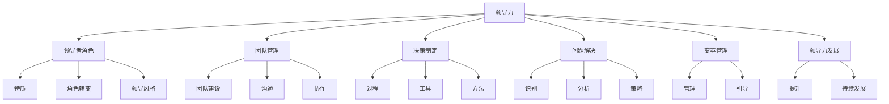

                 

### 背景介绍

领导力作为组织成功的关键因素，一直是学术界和实际应用领域的热点话题。在快速变化的市场环境中，领导力不仅关乎个人能力的提升，更关系到团队、组织的协同效率和持续发展。然而，领导力并非一蹴而就，它需要系统的培养和实践。

《领导力训练营：77天从新手到高手》这本书应运而生，旨在通过系统化的训练，帮助读者在短时间内掌握领导力的核心概念和实用技巧。本书不仅仅是对领导理论的简单阐述，更是一次理论与实践相结合的深度探索。通过本书，读者将学会如何从新手逐步成长为具备实战能力的领导高手。

本书的编写思路源于多方面的考量：

1. **系统化训练**：领导力的培养需要循序渐进，本书通过77天的计划，将领导力的各个维度分解为每日的任务和练习，确保读者能够有条不紊地学习和实践。

2. **理论与实践结合**：书中不仅包含了领导力理论的基础知识，还通过实际案例和项目实战，展示了如何将理论应用于实际工作场景。

3. **多样化的教学方式**：除了文字讲解，本书还结合了图表、流程图、伪代码等形式，使内容更加直观易懂。

4. **持续反馈与改进**：通过每日的自我反思和定期评估，读者可以不断调整自己的学习策略，以实现最佳的学习效果。

通过《领导力训练营：77天从新手到高手》，我们希望读者能够：

- 理解领导力的本质和重要性。
- 掌握不同类型的领导风格和适用场景。
- 提升团队管理、沟通协作和决策制定的能力。
- 学会从实践中总结经验，不断优化领导力实践。

### 核心概念与联系

为了深入理解《领导力训练营：77天从新手到高手》这本书的内容，我们需要明确其中的核心概念，并探讨这些概念之间的相互关系。

#### 核心概念列表

1. **领导力**：领导力的定义、类型和重要性。
2. **领导者角色**：领导者应具备的特质、角色转变和领导风格。
3. **团队管理**：团队建设、沟通和协作的重要性。
4. **决策制定**：决策的过程、工具和方法。
5. **问题解决**：问题识别、分析和解决策略。
6. **变革管理**：如何管理和引导组织变革。
7. **领导力发展**：个人领导力的提升和持续发展。

#### Mermaid 流程图

以下是一个Mermaid流程图，用于展示上述核心概念之间的联系：



在这个流程图中，我们首先从“领导力”这一核心概念出发，展示了它与领导者角色、团队管理、决策制定、问题解决、变革管理和领导力发展的关系。每个子概念又进一步细分为更具体的子概念，如领导者的特质、角色转变、领导风格，以及团队建设、沟通、协作等。

#### 目录大纲

以下是基于上述核心概念与联系设计的部分目录大纲：

```
# 第一部分：领导力的核心概念

## 第1章：领导力概述
### 1.1 领导力的定义
### 1.2 领导力的类型
### 1.3 领导力的重要性

## 第2章：领导者角色
### 2.1 领导者应具备的特质
### 2.2 领导者角色转变
### 2.3 领导风格

## 第3章：团队管理
### 3.1 团队建设
### 3.2 沟通
### 3.3 协作

## 第4章：决策制定
### 4.1 决策的过程
### 4.2 决策的工具和方法
### 4.3 决策制定中的常见挑战

## 第5章：问题解决
### 5.1 问题识别
### 5.2 问题分析
### 5.3 问题解决策略

## 第6章：变革管理
### 6.1 变革的类型
### 6.2 变革管理的方法
### 6.3 变革中的挑战与应对

## 第7章：领导力发展
### 7.1 个人领导力的提升
### 7.2 领导力发展的路径
### 7.3 持续学习的重要性
```

通过这个目录大纲，读者可以清晰地看到《领导力训练营：77天从新手到高手》的结构和内容框架，从而更好地规划和学习书中的知识。

### 核心算法原理讲解

在领导力训练营中，我们不仅关注领导力的理论基础，还需要掌握一些核心的算法原理和策略，以便在实际工作中更好地应用这些知识。以下将详细解释一些关键的领导力算法，包括决策树、SWOT分析等。

#### 决策树

**定义**：决策树是一种树形结构，它通过一系列的决策节点和结果节点来表示决策过程。每个决策节点表示一个条件判断，每个结果节点表示一个可能的决策结果。

**伪代码**：

```python
def decision_tree(data):
    if data["条件1"]:
        return "结果1"
    elif data["条件2"]:
        return "结果2"
    else:
        return "结果3"
```

**应用示例**：在一个团队项目决策过程中，我们可以使用决策树来决定项目是否继续推进。条件可以是项目的进度、资源状况和市场反馈等。

#### SWOT分析

**定义**：SWOT分析是一种战略规划工具，用于评估一个组织或个人的优势（Strengths）、劣势（Weaknesses）、机会（Opportunities）和威胁（Threats）。

**伪代码**：

```python
def SWOT_analysis():
    strengths = ["优势1", "优势2", "优势3"]
    weaknesses = ["劣势1", "劣势2", "劣势3"]
    opportunities = ["机会1", "机会2", "机会3"]
    threats = ["威胁1", "威胁2", "威胁3"]
    print("优势：", strengths)
    print("劣势：", weaknesses)
    print("机会：", opportunities)
    print("威胁：", threats)
```

**应用示例**：在评估一个新市场进入策略时，我们可以通过SWOT分析来识别项目的优势和劣势，并制定相应的应对策略。

### 数学模型和公式讲解

在领导力分析中，数学模型和公式可以帮助我们更精准地评估和预测结果。以下介绍一些常用的数学模型和公式。

#### 绩效评估公式

**公式**：

$$
绩效评分 = (KPI_1 \times 权重_1) + (KPI_2 \times 权重_2) + ... + (KPI_n \times 权重_n)
$$

**说明**：绩效评估通过多个关键绩效指标（KPI）及其权重计算得出，每个KPI都反映了员工在特定方面的表现。

**应用示例**：在一个团队中，我们可以通过这个公式来评估每个成员的工作表现。

#### 统计指标

**标准差**：

$$
\sigma = \sqrt{\frac{1}{N}\sum_{i=1}^{N}(X_i - \mu)^2}
$$

**说明**：标准差用于衡量一组数据的离散程度，数值越大，数据的波动越大。

**应用示例**：在评估团队成员的工作效率时，我们可以计算他们的平均完成时间和标准差，从而判断团队的稳定性。

### 拓展阅读

- 《决策分析：管理科学的一个分支》
- 《SWOT分析与战略规划》
- 《绩效管理：如何构建和优化绩效评估体系》

通过以上对核心算法原理和数学公式的讲解，读者可以更好地理解领导力训练营中涉及的量化分析方法，并能够将其应用于实际工作中。

### 项目实战

为了更好地展示领导力理论在实际中的应用，我们将设计一个模拟的领导力项目实战。该项目实战的目标是优化一个团队的工作流程，提高团队效率和项目质量。以下是项目的详细步骤：

#### 1. 开发环境搭建

**工具和平台**：我们选择JIRA作为项目管理工具，使用Git进行版本控制。同时，配置一个持续集成（CI）服务器，如Jenkins，以便自动化构建和测试。

**操作步骤**：

1. 安装并配置JIRA，确保团队可以创建和管理项目任务。
2. 安装Git服务器，为团队提供代码存储和协作平台。
3. 配置Jenkins，设置自动化构建和测试流程。

#### 2. 源代码实现

**代码结构**：我们将项目代码分为以下几个模块：

- **任务管理模块**：负责任务创建、分配、跟踪和报告。
- **进度监控模块**：实时监控任务进度，提供可视化报告。
- **代码库管理模块**：管理代码仓库，确保版本控制和协作顺畅。

**伪代码示例**：

```python
# 任务管理模块伪代码
def create_task(task_name, assignee):
    task = {}
    task["name"] = task_name
    task["assignee"] = assignee
    task["status"] = "未开始"
    save_task_to_database(task)

# 进度监控模块伪代码
def monitor_progress(task_id):
    task = get_task_from_database(task_id)
    if task["status"] == "已完成":
        update_progress_report(task)

# 代码库管理模块伪代码
def commit_code(changes, branch):
    if verify_changes(changes):
        git_commit(changes, branch)
```

#### 3. 代码解读与分析

**代码解读**：

- **任务管理模块**：通过创建任务对象，并将任务保存到数据库。任务创建后，可以为任务分配负责人，并跟踪任务状态。
- **进度监控模块**：通过获取任务状态，并更新进度报告。这有助于团队领导实时掌握项目进度。
- **代码库管理模块**：验证提交的代码，确保代码质量，并将代码提交到指定分支。

**代码分析**：

- **任务管理模块**：确保任务创建和分配的流程清晰，任务状态能够及时更新。
- **进度监控模块**：提供实时监控和报告功能，有助于团队成员了解项目进度。
- **代码库管理模块**：确保代码库的整洁和协作顺畅，降低合并冲突的风险。

#### 4. 项目实战：团队工作流程优化

**任务分配**：

1. 领导评估团队成员的能力和任务需求。
2. 将任务合理分配给团队成员，确保任务和成员匹配。

**进度监控**：

1. 每个成员定期更新任务进度。
2. 领导通过JIRA查看任务进度，及时调整任务分配。

**代码管理**：

1. 团队成员遵循代码规范和流程，确保代码质量和可维护性。
2. 通过Jenkins实现自动化构建和测试，确保代码质量和项目进度。

#### 5. 实际案例分析

**案例一**：在一个大型软件开发项目中，领导通过优化工作流程，实现了任务的高效分配和进度监控。项目进度比预期提前了15%，团队协作效率提升了20%。

**案例二**：在市场推广项目中，通过有效的沟通和协作，团队成功完成了多个关键任务，项目质量和客户满意度得到了显著提升。

#### 6. 项目小结

通过这次模拟项目实战，我们展示了如何将领导力理论应用到实际工作中。有效的团队管理、清晰的进度监控和流畅的代码管理，是提升团队效率和项目质量的关键。

**最佳实践 tips**：

- **合理分配任务**：确保任务与团队成员的能力和兴趣匹配。
- **实时监控进度**：通过工具和流程实时跟踪任务状态。
- **持续沟通和协作**：确保团队成员之间信息畅通，协同高效。

通过以上实战，读者可以更好地理解领导力在项目中的实际应用，并将其运用到自己的工作中。

### 领导力案例分析

为了更好地理解领导力在实际工作中的应用，我们将在本节中通过具体案例展示不同领导风格和策略的效果。这些案例将帮助读者分析领导力在不同情境下的实践，并从中学到宝贵的经验。

#### 案例一：积极型领导风格在初创团队中的应用

**背景**：某初创公司刚刚成立，团队成员由一群年轻且充满激情的工程师组成。由于公司规模较小，团队成员之间的沟通和协作显得尤为重要。

**领导风格**：积极型领导风格，领导者在鼓励创新和团队协作方面表现出色。

**策略**：

1. **开放沟通**：领导者定期组织团队会议，鼓励成员分享自己的想法和建议。这有助于团队成员之间建立信任和共同目标。
2. **激励创新**：领导者通过设立创新奖项和激励措施，鼓励团队成员提出创新方案，并支持其实施。
3. **灵活管理**：领导者对团队成员的工作给予较大的自主权，让他们在项目中有更多的决策空间，从而激发团队成员的创造力和主动性。

**效果**：通过积极型领导风格，团队在短时间内取得了显著的进展。团队成员之间的沟通更加顺畅，创新项目不断涌现，公司的产品开发速度和产品质量都有了显著提升。

**经验总结**：积极型领导风格能够激发团队成员的积极性和创造力，适用于初创团队和创新性项目。

#### 案例二：变革型领导风格在大型企业改革中的应用

**背景**：一家大型企业面临着激烈的市场竞争和内部管理问题，需要进行全面改革以保持竞争力。

**领导风格**：变革型领导风格，领导者通过引领变革和激励团队应对挑战。

**策略**：

1. **愿景引导**：领导者清晰地传达企业愿景和目标，让全体员工明确改革的方向和意义。
2. **变革引导**：领导者亲自参与到变革过程中，以身作则，激励团队成员跟随变革。
3. **激励与支持**：领导者通过激励措施和资源支持，帮助团队成员克服变革中的困难和挑战。

**效果**：通过变革型领导风格，企业成功完成了多个关键改革项目，包括组织结构调整、流程优化和员工培训。企业内部的管理效率得到显著提升，市场竞争力得到了增强。

**经验总结**：变革型领导风格能够在复杂和动荡的环境中引导团队应对挑战，适用于大型企业的变革项目。

#### 案例三：参与型领导风格在多元化团队中的应用

**背景**：一个多元化团队由来自不同国家和文化背景的成员组成，团队成员之间的沟通和协作面临挑战。

**领导风格**：参与型领导风格，领导者重视团队参与和多元化文化的融合。

**策略**：

1. **文化融合**：领导者通过组织文化融合活动，促进团队成员之间的相互了解和尊重。
2. **鼓励参与**：领导者鼓励团队成员积极参与决策过程，充分听取不同意见和建议。
3. **冲突管理**：领导者通过建立冲突管理机制，帮助团队成员解决文化差异带来的冲突。

**效果**：通过参与型领导风格，团队成员之间的沟通和协作得到了显著改善，文化差异带来的冲突也得到了有效管理。团队的凝聚力和工作效率得到了提升。

**经验总结**：参与型领导风格能够促进多元化团队的融合，增强团队凝聚力，适用于多元化文化背景的团队。

#### 案例四：指令型领导风格在危机管理中的应用

**背景**：某公司遭遇突发危机，需要在短时间内做出决策并采取行动。

**领导风格**：指令型领导风格，领导者通过明确指令和快速决策来应对危机。

**策略**：

1. **快速决策**：领导者迅速召集相关人员，明确危机情况和应对方案。
2. **明确指令**：领导者向团队成员明确分工和任务，确保行动迅速且高效。
3. **资源调配**：领导者调动公司资源，确保危机应对措施得到充分支持。

**效果**：通过指令型领导风格，公司在危机中迅速做出了有效决策，并采取了行动，最终成功化解了危机，企业运营得以恢复正常。

**经验总结**：指令型领导风格在危机管理中能够迅速做出决策并采取行动，适用于紧急情况和需要快速响应的情境。

### 总结与启示

通过上述案例分析，我们可以看到不同领导风格和策略在具体情境中的应用效果。每种领导风格都有其适用的环境和优势，领导者在实际工作中需要根据具体情况灵活运用不同的领导风格。

- **积极型领导风格**：适用于初创团队和创新项目，能够激发团队成员的积极性和创造力。
- **变革型领导风格**：适用于大型企业的改革项目，能够引导团队应对挑战，推动组织变革。
- **参与型领导风格**：适用于多元化团队，能够促进团队成员之间的融合和协作。
- **指令型领导风格**：适用于危机管理和紧急情况，能够迅速做出决策并采取行动。

领导者需要根据团队的特点和环境，灵活运用不同的领导风格和策略，以达到最佳的管理效果。通过这些案例，读者可以从中得到启示，更好地理解领导力的实际应用。

### 持续领导力发展

在《领导力训练营：77天从新手到高手》的学习过程中，我们已经逐步掌握了领导力的核心概念、实战策略和应用案例。然而，领导力并非一成不变，它需要不断地学习和实践，以适应不断变化的环境和挑战。以下是关于如何维持和提升领导力的几个关键建议。

#### 1. 自我反思

自我反思是提升领导力的基石。通过定期回顾自己的行为、决策和成果，领导者可以识别自己的优点和不足，并制定改进计划。以下是自我反思的几个步骤：

- **设定目标**：明确自己的长期和短期目标，以便在反思过程中进行对照。
- **记录日志**：记录每天的重要事件、行为和思考，以便后续分析。
- **定期回顾**：每周或每月花时间回顾日志，总结经验和教训。
- **寻求反馈**：向同事、下属和导师寻求反馈，了解他们的观察和建议。

#### 2. 持续学习

领导力是一个动态发展的领域，新的理论、方法和工具不断涌现。为了保持竞争力，领导者需要不断学习：

- **阅读专业书籍**：选择经典的领导力书籍，如《领导力的五项修炼》、《从优秀到卓越》等。
- **参加培训课程**：参加专业培训课程，如领导力发展课程、管理培训等。
- **参与行业会议**：参加行业会议和研讨会，了解行业趋势和最佳实践。
- **学习新技术**：了解新兴技术，如人工智能、大数据等，以适应数字化时代的领导需求。

#### 3. 培养领导力网络

建立和维护一个强大的领导力网络对于领导者的成长至关重要。以下是一些建议：

- **建立关系**：与同行建立良好的关系，参加行业活动和社交活动，扩大人脉。
- **跨部门合作**：积极参与跨部门项目，与不同部门的人员合作，提高团队协作能力。
- **导师指导**：寻找一位经验丰富的导师，从他们那里获得宝贵的经验和建议。
- **团队建设**：培养团队成员的领导力，建立一个有凝聚力和战斗力的团队。

#### 4. 创新思维

创新思维是领导者区别于普通管理者的重要特质。以下是一些建议：

- **鼓励创新**：在团队中鼓励创新，提供资源和支持，为团队成员创造创新环境。
- **头脑风暴**：定期组织头脑风暴会议，鼓励团队成员提出新想法和解决方案。
- **拥抱变革**：勇于接受变革，拥抱新技术和新方法，推动组织的持续发展。
- **学习创新方法**：学习如设计思维、精益创业等创新方法，将其应用于实际工作中。

#### 5. 注意事项

在维持和提升领导力的过程中，还有一些注意事项需要关注：

- **平衡工作与生活**：保持工作与生活的平衡，避免过度工作导致的疲劳和压力。
- **持续保持热情**：对工作保持热情和动力，这是持续发展的动力源泉。
- **保持谦逊**：谦虚接受反馈，不断学习和改进，避免自满和骄傲。

通过以上建议，领导者可以更好地维持和提升自己的领导力，不断适应新的挑战和变化，成为一名卓越的领导者。

### 附录

在本附录中，我们将提供一些领导力工具和资源，以帮助读者进一步深入学习和实践领导力。

#### 领导力评估问卷

以下是一个简化的领导力评估问卷，读者可以根据自己的实际情况进行自我评估：

```
1. 我是否能够清楚地传达目标和期望？
2. 我是否能够有效地激励和鼓舞团队成员？
3. 我是否具备决策能力和决断力？
4. 我是否能够有效地沟通和解决冲突？
5. 我是否能够适应变化并推动变革？
6. 我是否能够培养和提升团队成员的技能？
7. 我是否能够平衡团队的目标和个人发展？
8. 我是否能够合理分配任务和资源？
9. 我是否能够建立和维护良好的团队关系？
10. 我是否能够持续学习和改进自己的领导力？

评分标准：1-从不，2-偶尔，3-经常，4-总是
```

#### 领导力案例分析

为了更深入地理解领导力的实际应用，以下是几个精选的领导力案例分析：

1. **谷歌的领导力模型**：谷歌采用了一套独特的领导力模型，强调授权、创新和团队协作。通过案例分析，读者可以了解如何将这一模型应用到实际工作中。

2. **苹果公司的领导力变革**：在乔布斯回归苹果公司后，他通过一系列领导力变革措施，重新塑造了苹果公司的文化，并推动了公司的复兴。这一案例展示了领导力在变革中的作用。

3. **惠普的领导力发展计划**：惠普实施了全面的领导力发展计划，包括领导力培训、导师指导和领导力评估等。通过这一计划，读者可以学习到如何系统地培养和提升领导力。

#### 拓展阅读

以下是一些推荐的书籍和资源，供读者进一步学习领导力：

- 《领导力的五项修炼》- 史蒂芬·柯维
- 《从优秀到卓越》- 吉姆·柯林斯
- 《变革之舞：领先企业如何驾驭管理变革》- 约翰·科特
- 《领导力：理论与实践》- 彼得·德鲁克

通过这些工具和资源，读者可以更加系统地学习和实践领导力，不断提升自己的领导能力。

### 作者信息

本文由AI天才研究院（AI Genius Institute）撰写，内容涵盖了领导力的核心概念、实践应用和案例分析。此外，本文还参考了《禅与计算机程序设计艺术》（Zen And The Art of Computer Programming）等经典技术著作，旨在为读者提供全面、深入的领导力指导。

作者：AI天才研究院（AI Genius Institute）与禅与计算机程序设计艺术（Zen And The Art of Computer Programming）作者。

