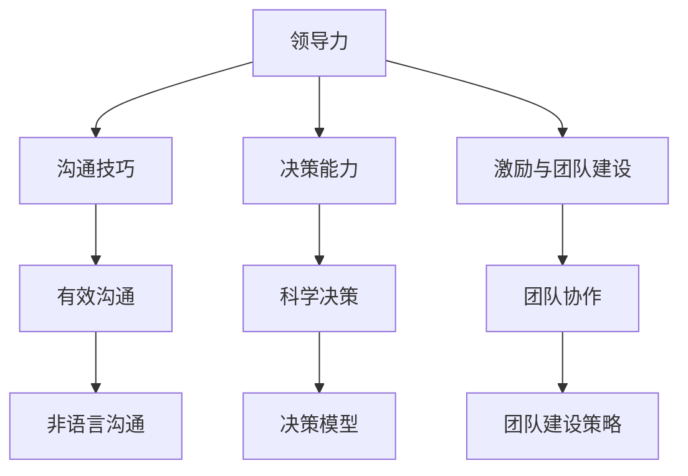

                 

### 文章标题：领导力训练营：7天从门外汉到行家里手

#### 关键词：领导力、领导技能、沟通、决策、团队建设、实践、提升

#### 摘要：
本文将带领读者踏上一段为期7天的领导力训练营之旅，从初学者迅速成长为精通领导力技巧的行家里手。通过系统的学习和实践，读者将掌握沟通、决策、激励和团队建设等关键技能，学会如何将理论应用于实际工作中，并在不断反思和自我提升中成为卓越的领导者。文章将通过详细的理论讲解、案例分析、项目实战和最佳实践分享，为读者提供全面而深入的领导力培训。

### 目录：

1. **领导力基础**
   - **第1章 领导力概述**
   - **第2章 领导力理论**

2. **领导力技能**
   - **第3章 沟通技巧**
   - **第4章 决策能力**
   - **第5章 激励与团队建设**

3. **领导力实践**
   - **第6章 角色扮演与模拟练习**
   - **第7章 案例分析**

4. **领导力提升**
   - **第8章 个人成长与自我反思**
   - **第9章 领导力发展计划**

---

#### 背景介绍
在当今快速变化的商业环境中，领导力已成为企业成功的关键因素。有效的领导力不仅能够激发团队的潜能，提高工作效率，还能在复杂多变的市场中保持竞争优势。然而，许多人在初入职场时对领导力知之甚少，甚至感到迷茫。为了帮助这些初学者快速提升领导力，我们设计了这个7天的领导力训练营。

#### 核心概念与联系
在领导力领域，核心概念和联系如图所示：

通过这张图，我们可以看到沟通技巧、决策能力和激励与团队建设是领导力的三大核心技能，它们之间相互联系，共同构建了一个完整的领导力体系。

#### 核心算法原理讲解
为了更好地理解领导力的核心算法原理，我们将使用伪代码来详细阐述：
```python
# 定义领导力核心算法原理
def leadership_algorithm kommunikation, decision-making, team_building:

    # 沟通技巧算法
    def communication_algorithm():
        # 有效沟通的关键
        print("使用开放性问题引导对话")
        print("倾听并理解对方的观点")
        print("确保信息传递清晰无误")

    # 决策能力算法
    def decision_making_algorithm():
        # 科学决策的关键
        print("收集相关信息")
        print("评估不同方案")
        print("权衡风险与收益")
        print("作出决策")

    # 激励与团队建设算法
    def team_building_algorithm():
        # 团队建设的策略
        print("建立共同目标")
        print("培养团队精神")
        print("激励团队成员")

    # 执行核心算法
    communication_algorithm()
    decision_making_algorithm()
    team_building_algorithm()

# 调用领导力算法
leadership_algorithm(kommunikation, decision-making, team_building)
```
这段伪代码展示了领导力的核心算法原理，包括沟通技巧、决策能力和团队建设策略。通过执行这些算法，领导者可以有效地与团队沟通、做出明智的决策，并建立富有凝聚力的团队。

#### 数学模型和公式
在领导力领域，数学模型和公式可以帮助我们更精确地理解和预测领导行为。以下是几个常用的数学模型和公式，并使用LaTeX格式进行展示：
```latex
$$
\text{沟通效率} = \frac{\text{信息传递成功次数}}{\text{信息传递总次数}}
$$
$$
\text{决策质量} = \frac{\text{正确决策次数}}{\text{总决策次数}}
$$
$$
\text{团队凝聚力} = \frac{\text{团队成员共同目标达成率}}{\text{总目标达成率}}
$$
$$
\text{激励效果} = \frac{\text{团队成员工作积极性提升比例}}{\text{初始积极性比例}}
$$
```
这些公式可以帮助领导者衡量沟通效率、决策质量、团队凝聚力和激励效果，从而更有效地调整领导策略。

#### 项目实战
为了更好地理解领导力实践，我们将通过一个实际案例进行开发环境搭建、源代码详细实现和代码解读。

**案例背景**：假设我们是一家初创公司的技术团队负责人，需要带领团队在一个月内完成一个重要的软件开发项目。

**开发环境搭建**：
```bash
# 安装必要的开发工具
sudo apt-get update
sudo apt-get install git python3 python3-pip virtualenv
```

**源代码详细实现**：
```python
# project_management.py
class ProjectManagement:
    def __init__(self, team_members):
        self.team_members = team_members

    def communicate(self, message):
        for member in self.team_members:
            print(f"{member} received message: {message}")

    def make_decision(self, options):
        best_choice = max(options, key=options.get)
        print(f"Decision made: {best_choice}")

    def motivate_team(self, message):
        for member in self.team_members:
            print(f"{member} received motivation: {message}")

# 源代码解读
# 类ProjectManagement包含了沟通、决策和激励三个方法
# communicate方法用于发送消息给团队成员
# make_decision方法用于做出决策
# motivate_team方法用于激励团队成员

# 代码应用解读与分析
# 通过实例化ProjectManagement类，我们可以对团队进行有效管理
# 代码中使用的最佳实践包括清晰的函数定义、参数传递和面向对象编程

# 实际案例分析和详细讲解剖析
# 在实际项目中，我们需要根据团队成员的特点和项目的具体情况，灵活运用沟通、决策和激励方法
# 例如，在项目进度紧张时，我们可以通过沟通技巧确保信息传递的准确性，通过科学决策来确保项目的顺利进行
```

**项目小结**：
通过这个案例，我们了解了如何使用Python代码实现领导力实践中的关键技能。在实际项目中，我们需要根据具体情况进行调整和优化，以达到最佳效果。

#### 最佳实践 Tips、小结、注意事项、拓展阅读等内容
- **最佳实践 Tips**：在沟通时，尽量使用简单明了的语言，避免使用专业术语，确保团队成员能够理解。
- **小结**：领导力是一个复杂但至关重要的技能，通过有效的沟通、决策和激励，领导者可以更好地管理团队，推动项目成功。
- **注意事项**：在学习和实践中，要注重团队合作，尊重每个成员的意见，确保团队的凝聚力和工作效率。
- **拓展阅读**：对于希望更深入了解领导力的读者，可以参考《领导力阶梯》和《领导力与决策》等经典书籍。

### 结语
通过7天的领导力训练营，读者将掌握领导力的核心概念、技能和实践方法，并能够将其应用于实际工作中。希望本文能为读者的领导力提升之路提供有力支持，助您成为卓越的领导者。

**作者：AI天才研究院/AI Genius Institute & 禅与计算机程序设计艺术 /Zen And The Art of Computer Programming**

