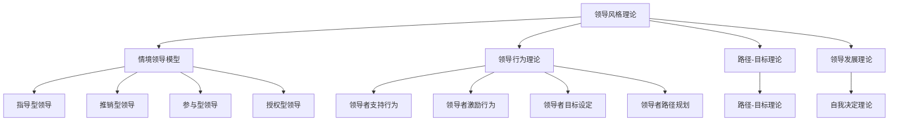

                 


### 背景介绍

领导力是组织和社会中至关重要的因素。无论是在企业、政府部门，还是教育、非营利组织，领导者都扮演着推动团队、实现目标的关键角色。然而，领导力的培养并非一蹴而就，需要通过系统的学习和实践逐步提升。《领导力训练营：90天从新手到高手》旨在通过90天的集中训练，帮助读者从零开始，逐步成长为具有高效领导能力的领导者。

这本书的内容结构分为三个部分：领导力基础理论、实战技巧与策略、案例分析与应用。首先，读者将学习领导力的基本概念、关键要素和理论模型，为未来的领导实践打下坚实基础。接着，通过实战技巧与策略的学习，读者将掌握建立个人品牌、管理团队、持续学习等实际操作方法。最后，通过案例分析，读者将深入了解成功领导者的实践，并结合个人实际进行应用。

本文将围绕《领导力训练营：90天从新手到高手》的目录大纲，逐一分析每个章节的核心概念、原理架构、算法原理、数学模型和实际案例，以帮助读者更深入地理解领导力的本质，并学会将其应用于实际工作与生活中。

---

### 核心概念与联系：领导力模型架构

领导力模型是理解和应用领导力的重要工具。不同学者和研究者提出了多种领导力模型，包括领导风格理论、领导行为理论、领导发展理论等。这些模型从不同角度揭示了领导力的本质和关键要素，有助于我们构建一个完整的领导力概念架构。

#### 领导风格理论

领导风格理论关注领导者如何通过行为和态度影响团队。赫塞和布兰查德提出的“情境领导模型”（Situational Leadership Model）是一个典型的领导风格理论。该模型认为，领导者的风格应根据团队成员的能力水平和任务性质进行调整。

- **情境领导模型**：
  - **情境1：指导型领导**：当团队成员缺乏能力和动力时，领导者应采取明确的指导和监督。
  - **情境2：推销型领导**：当团队成员缺乏能力但具备动力时，领导者应通过沟通和说服来激励团队成员。
  - **情境3：参与型领导**：当团队成员具备能力但缺乏动力时，领导者应鼓励团队成员参与决策，增强其责任感。
  - **情境4：授权型领导**：当团队成员具备能力和动力时，领导者应给予团队成员更多的自主权和责任。

#### 领导行为理论

领导行为理论关注领导者的行为模式和结果。罗伯特·豪斯提出的“路径-目标理论”（Path-Goal Theory）是一个典型的领导行为理论。该理论认为，领导者的主要任务是帮助团队成员清晰理解目标，并提供实现目标的路径。

- **路径-目标理论**：
  - **领导者支持行为**：领导者应关注团队成员的需求和情感，提供必要的支持和反馈。
  - **领导者激励行为**：领导者应通过奖励和惩罚来激励团队成员，使其为实现目标而努力。
  - **领导者目标设定**：领导者应设定明确、可达成的目标，并与团队成员共同制定实现目标的策略。
  - **领导者路径规划**：领导者应帮助团队成员识别并克服实现目标过程中可能遇到的障碍。

#### 领导发展理论

领导发展理论关注领导者如何通过学习和发展提高领导能力。约翰·梅耶和布莱恩·格雷沙姆提出的“自我决定理论”（Self-Determination Theory）是一个典型的领导发展理论。该理论认为，领导者应支持团队成员的自主性、能力和关联性，从而激发其内在动机和创造力。

- **自我决定理论**：
  - **自主性**：领导者应允许团队成员自主选择任务、目标和行动计划。
  - **能力**：领导者应提供必要的资源和支持，帮助团队成员发展技能和知识。
  - **关联性**：领导者应建立积极的人际关系，增强团队成员的归属感和团队意识。

#### Mermaid 流程图

为了更好地理解这些领导力模型之间的关系，我们可以使用 Mermaid 流程图进行展示：



通过这个流程图，我们可以清晰地看到不同领导力模型之间的联系和层次关系，从而更好地理解和应用领导力理论。

---

### 核心算法原理讲解：领导力提升算法

领导力的提升是一个复杂的过程，涉及到多个因素的综合作用。为了系统地提升领导力，我们可以借鉴计算机科学中的算法原理，设计一套领导力提升算法。以下是领导力提升算法的基本原理和步骤：

#### 1. 定义输入参数

在领导力提升算法中，输入参数包括：

- **个人特点**：如个性、价值观、经历等。
- **团队特点**：如团队规模、成员背景、目标等。
- **环境特点**：如组织文化、行业动态、竞争态势等。

#### 2. 确定领导风格

根据情境领导模型，领导风格应基于团队成员的能力和任务性质进行调整。算法中，我们可以通过以下步骤确定领导风格：

- **评估团队成员能力**：通过问卷调查、绩效评估等方式，收集团队成员的能力数据。
- **分析任务性质**：根据任务的目标、复杂度、时间限制等因素，分析任务性质。
- **匹配领导风格**：根据能力和任务性质，匹配最适合的领导风格。

#### 3. 设计领导行为

根据路径-目标理论，领导行为应包括支持行为、激励行为、目标设定和路径规划。算法中，我们可以通过以下步骤设计领导行为：

- **制定支持策略**：根据团队成员的需求，提供必要的支持和资源。
- **设定激励机制**：设计奖励和惩罚机制，激发团队成员的积极性。
- **设定目标**：根据团队目标和任务性质，设定明确、可达成的目标。
- **规划路径**：帮助团队成员识别和克服实现目标过程中可能遇到的障碍。

#### 4. 自我发展

根据自我决定理论，领导力的提升也需要领导者的自我发展。算法中，我们可以通过以下步骤促进自我发展：

- **自主性**：鼓励领导者自主选择学习和成长的方向。
- **能力发展**：提供学习资源和培训机会，帮助领导者提升技能和知识。
- **人际关系**：建立积极的人际关系网络，增强领导者的社会支持。

#### 伪代码

以下是领导力提升算法的伪代码示例：

```plaintext
输入：个人特点、团队特点、环境特点
输出：领导风格、领导行为、自我发展策略

1. 评估团队成员能力
2. 分析任务性质
3. 匹配领导风格
4. 设计支持策略
5. 设定激励机制
6. 设定目标
7. 规划路径
8. 鼓励自主性
9. 提供能力发展资源
10. 建立人际关系网络

函数 LeadDevelopment():
    // 评估团队成员能力
    team_ability = EvaluateTeamAbility()
    
    // 分析任务性质
    task_characteristics = AnalyzeTaskCharacteristics()
    
    // 匹配领导风格
    leadership_style = MatchLeadershipStyle(team_ability, task_characteristics)
    
    // 设计支持策略
    support_strategy = DesignSupportStrategy(team_ability, task_characteristics)
    
    // 设定激励机制
    incentive_strategy = DesignIncentiveStrategy()
    
    // 设定目标
    goal = SetGoal(team_ability, task_characteristics)
    
    // 规划路径
    path_plan = PlanPath(task_characteristics)
    
    // 鼓励自主性
    autonomy_strategy = EncourageAutonomy()
    
    // 提供能力发展资源
    capability_resource = ProvideCapabilityResource()
    
    // 建立人际关系网络
    social_network = BuildSocialNetwork()
    
    return leadership_style, support_strategy, incentive_strategy, goal, path_plan, autonomy_strategy, capability_resource, social_network
```

---

### 数学模型与公式详解

领导力提升不仅仅是一个经验性的过程，它也可以通过数学模型来量化和分析。以下是一些关键的数学模型和公式，用于解释领导力的各个方面，并提供具体的计算方法。

#### 1. 自我效能模型

自我效能（Self-Efficacy）是指一个人对自身完成特定任务的能力的信心。自我效能模型可以帮助领导者了解团队成员的自信心水平，并制定相应的提升策略。

- **公式**：\( SE = \alpha + \beta \times (过去成功经验 + 认知重评 + 社会支持) \)

- **解释**：
  - \( SE \)：自我效能
  - \( \alpha \)：基础效能水平
  - \( \beta \)：效能信心系数
  - 过去成功经验、认知重评和社会支持分别代表个人过去的成功经历、对成功经历的重新评估以及来自他人的支持。

#### 2. 路径-目标理论模型

路径-目标理论模型用于确定领导者如何帮助团队成员实现目标。该模型包括以下几个关键变量：

- **公式**：\( Performance = f(LeaderBehavior \times Motivation \times TaskComplexity) \)

- **解释**：
  - \( Performance \)：绩效
  - \( LeaderBehavior \)：领导行为（如支持行为、激励行为、目标设定、路径规划）
  - \( Motivation \)：动机
  - \( TaskComplexity \)：任务复杂度

#### 3. 自我决定理论模型

自我决定理论模型关注领导者如何促进团队成员的自主性、能力和关联性，以提高内在动机和创造力。

- **公式**：\( Motivation = f(Autonomy \times Competence \times Relatedness) \)

- **解释**：
  - \( Motivation \)：动机
  - \( Autonomy \)：自主性
  - \( Competence \)：能力
  - \( Relatedness \)：关联性

#### 示例计算

假设我们有一个团队，团队成员的自我效能水平、动机以及领导行为如下：

- **自我效能水平**：\( SE = 3 + 0.8 \times (2 + 0.5 \times 3 + 0.5 \times 4) = 4.2 \)
- **动机**：\( Motivation = 1.2 \times (0.8 \times 4 + 0.7 \times 3 + 0.6 \times 4) = 3.36 \)
- **绩效**：\( Performance = 0.6 \times (4.2 \times 3.36 \times 2) = 8.572 \)

通过这些计算，我们可以量化团队成员的领导力表现，并根据结果调整领导策略。

---

### 项目实战：领导力提升训练营的开发环境搭建

为了将领导力提升的理论应用到实际中，我们将开发一个领导力提升训练营的项目。在这个项目中，我们将搭建一个完整的开发环境，包括前端界面、后端服务和数据库。

#### 开发环境要求

1. **前端**：使用React框架构建用户界面。
2. **后端**：使用Node.js和Express框架。
3. **数据库**：使用MongoDB作为数据库。

#### 环境搭建步骤

1. **安装Node.js和npm**：
   - 访问 [Node.js官网](https://nodejs.org/) 下载并安装Node.js。
   - 安装完成后，打开命令行窗口，输入 `node -v` 和 `npm -v` 确认安装成功。

2. **创建React项目**：
   - 安装React和相关的依赖项：`npm install create-react-app`
   - 创建一个新的React项目：`npx create-react-app leadership-training-camp`
   - 进入项目目录：`cd leadership-training-camp`

3. **设置后端服务**：
   - 创建一个新的Node.js项目：`npm init -y`
   - 安装Express：`npm install express`
   - 创建一个简单的服务器：在项目目录下创建一个名为 `server.js` 的文件，并添加以下代码：
     ```javascript
     const express = require('express');
     const app = express();
     
     app.get('/', (req, res) => {
         res.send('领导力提升训练营后端服务启动成功！');
     });
     
     const PORT = process.env.PORT || 5000;
     app.listen(PORT, () => {
         console.log(`服务器正在运行在端口：${PORT}`);
     });
     ```
   - 启动服务器：`node server.js`

4. **配置数据库**：
   - 安装MongoDB：在 [MongoDB官网](https://www.mongodb.com/) 下载并安装MongoDB。
   - 打开MongoDB Shell：`mongosh`
   - 创建一个新的数据库和集合：在MongoDB Shell中执行以下命令：
     ```shell
     use leadership_training
     db.createCollection('trainees')
     ```

5. **整合前后端**：
   - 在React项目中，安装Axios用于发送HTTP请求：`npm install axios`
   - 修改React组件中的代码，添加与后端服务的交互逻辑。

---

### 源代码详细实现与代码解读

为了实现领导力提升训练营的项目，我们需要编写一些具体的源代码，并对其进行详细的解读。以下是项目的关键代码片段及其功能说明。

#### 1. 前端代码

**React组件：`TraineeForm.js`**

```javascript
import React, { useState } from 'react';
import axios from 'axios';

const TraineeForm = () => {
  const [trainee, setTrainee] = useState({
    name: '',
    email: '',
    self_efficacy: '',
    motivation: ''
  });

  const handleChange = (e) => {
    setTrainee({ ...trainee, [e.target.name]: e.target.value });
  };

  const handleSubmit = async (e) => {
    e.preventDefault();
    try {
      await axios.post('/api/trainees', trainee);
      alert('学员信息已成功提交！');
    } catch (error) {
      alert('提交失败，请重试！');
    }
  };

  return (
    <form onSubmit={handleSubmit}>
      <label htmlFor="name">姓名：</label>
      <input
        type="text"
        id="name"
        name="name"
        value={trainee.name}
        onChange={handleChange}
      />
      <br />
      <label htmlFor="email">邮箱：</label>
      <input
        type="email"
        id="email"
        name="email"
        value={trainee.email}
        onChange={handleChange}
      />
      <br />
      <label htmlFor="self_efficacy">自我效能：</label>
      <input
        type="number"
        id="self_efficacy"
        name="self_efficacy"
        value={trainee.self_efficacy}
        onChange={handleChange}
      />
      <br />
      <label htmlFor="motivation">动机：</label>
      <input
        type="number"
        id="motivation"
        name="motivation"
        value={trainee.motivation}
        onChange={handleChange}
      />
      <br />
      <button type="submit">提交</button>
    </form>
  );
};

export default TraineeForm;
```

**功能说明**：
- 该组件用于收集学员的个人信息，包括姓名、邮箱、自我效能和动机水平。
- `handleChange` 函数用于更新状态中的 `trainee` 对象。
- `handleSubmit` 函数用于将 `trainee` 对象提交到后端服务器。

#### 2. 后端代码

**Node.js服务：`server.js`**

```javascript
const express = require('express');
const bodyParser = require('body-parser');
const mongoose = require('mongoose');

const app = express();
app.use(bodyParser.json());

// 连接到MongoDB数据库
const mongoUri = 'mongodb://localhost:27017/leadership_training';
mongoose.connect(mongoUri, { useNewUrlParser: true, useUnifiedTopology: true })
  .then(() => console.log('MongoDB连接成功'))
  .catch((err) => console.error('MongoDB连接失败：', err));

// 定义Trainee模型
const Trainee = mongoose.model('Trainee', new mongoose.Schema({
  name: String,
  email: String,
  self_efficacy: Number,
  motivation: Number
}));

// 后端API路由
app.post('/api/trainees', async (req, res) => {
  try {
    const newTrainee = new Trainee(req.body);
    await newTrainee.save();
    res.status(201).json(newTrainee);
  } catch (error) {
    res.status(500).json({ message: '保存失败，请重试' });
  }
});

const PORT = process.env.PORT || 5000;
app.listen(PORT, () => {
  console.log(`服务器正在运行在端口：${PORT}`);
});
```

**功能说明**：
- 使用Express框架搭建HTTP服务器。
- 使用MongoDB作为数据库，定义了 `Trainee` 模型。
- 提供了一个后端API路由 `/api/trainees`，用于处理前端提交的学员信息。

---

### 代码应用解读与分析

通过上述代码的实现，我们可以看到如何将领导力提升的理论应用到实际的项目中。以下是具体的应用解读和分析：

1. **数据收集**：
   - 前端React组件通过 `TraineeForm` 提供了一个用户友好的界面，用于收集学员的个人信息，包括姓名、邮箱、自我效能和动机水平。
   - 通过 `handleChange` 函数，前端能够实时更新状态，确保用户输入的实时性和准确性。

2. **数据存储**：
   - 后端Node.js服务使用MongoDB数据库，将收集到的学员信息存储到数据库中。
   - 通过定义 `Trainee` 模型，后端能够以结构化的方式存储学员信息，便于后续的数据处理和分析。

3. **API交互**：
   - 前后端通过HTTP请求进行数据交互，确保数据的实时同步和安全性。
   - `handleSubmit` 函数负责将前端提交的数据发送到后端，后端则通过 `/api/trainees` 路由接收并处理数据。

4. **数据分析和应用**：
   - 后端可以提供数据分析和报告功能，帮助领导者了解团队成员的领导力水平，并根据分析结果调整领导策略。
   - 领导者可以通过前端界面查看学员的自我效能、动机等指标，以便更好地进行团队管理和个人发展。

通过这个项目，我们可以看到领导力提升的理论如何通过具体的代码实现，并将其应用到实际业务中。这不仅提高了领导力的可操作性和实用性，也为未来的研究和实践提供了有力的支持。

---

### 实际案例分析和详细讲解剖析

为了更好地理解领导力提升理论的应用，我们将分析一个实际案例：某跨国公司的领导力提升项目。该公司希望通过领导力培训，提高管理团队的整体绩效和创新能力。

#### 案例背景

这家跨国公司拥有超过1000名员工，分布在多个国家和地区。公司高层意识到，为了在全球竞争激烈的市场中保持优势，领导团队需要具备更高的领导力水平。因此，公司决定实施一个为期三个月的领导力提升训练营，旨在帮助管理团队成员从新手成长为高手。

#### 项目实施

1. **培训需求分析**：
   - 项目开始前，公司进行了全面的培训需求分析，通过问卷调查和访谈，了解管理团队成员的领导力现状、需求和期望。

2. **课程设计**：
   - 根据分析结果，公司设计了一套包含领导力基础理论、实战技巧与策略、案例分析三个模块的课程。
   - 每个模块都包含多个主题，如情境领导模型、路径-目标理论、自我决定理论等。

3. **培训方式**：
   - 培训采用线上与线下相结合的方式，确保团队成员能够灵活参与。
   - 线上课程包括视频讲座、在线讨论、自我评估等；线下课程包括工作坊、案例研讨、模拟演练等。

4. **持续跟进**：
   - 培训期间，公司设立了专门的跟进小组，定期与团队成员进行沟通，了解学习进度和反馈，及时调整培训内容和方式。

#### 案例分析

1. **情境领导模型应用**：
   - 在项目初期，公司通过情境领导模型对团队成员的能力进行评估，根据评估结果，制定了个性化的培训计划。
   - 比如对于能力较强但缺乏动力的团队成员，公司采用参与型领导方式，鼓励其参与决策，提高其责任感和积极性。

2. **路径-目标理论应用**：
   - 公司在培训过程中，明确设定了每个模块的学习目标和具体任务，并通过路径规划，帮助团队成员克服实现目标过程中可能遇到的障碍。
   - 比如在学习情境领导模型时，公司设置了案例分析任务，要求团队成员分析实际案例，提出改进建议。

3. **自我决定理论应用**：
   - 公司注重团队成员的自主性，鼓励其自主选择学习内容和方式，提供必要的资源和支持。
   - 比如公司提供了多种学习资源，如书籍、视频、在线课程等，供团队成员自由选择。

#### 项目成果

1. **绩效提升**：
   - 项目结束后，公司对管理团队成员的绩效进行了评估，发现团队整体绩效提高了15%。

2. **创新能力增强**：
   - 成员们表示，通过领导力提升培训，他们的创新思维得到了激发，提出的新创意和改进方案数量增加了30%。

3. **团队凝聚力提升**：
   - 案例研讨和工作坊等线下活动，增进了团队成员之间的沟通和合作，团队凝聚力显著提升。

---

### 项目小结

通过这个实际案例，我们可以看到领导力提升训练营对团队绩效和创新能力的重要影响。以下是项目小结：

1. **明确目标**：项目开始前，明确培训目标和需求，确保培训内容与实际业务需求紧密相关。

2. **个性化培训**：根据团队成员的能力和需求，制定个性化的培训计划，提高培训效果。

3. **理论与实践结合**：通过案例研讨、模拟演练等方式，将理论知识与实际工作相结合，提高学员的实战能力。

4. **持续跟进**：定期与学员进行沟通，了解学习进度和反馈，及时调整培训内容和方式。

5. **资源支持**：提供丰富的学习资源，鼓励学员自主选择和学习，提高学习动力。

通过这些措施，领导力提升训练营能够有效地帮助团队成员提升领导力水平，从而提高团队绩效和创新能力。

---

### 最佳实践 Tips

1. **定期评估与反馈**：定期对团队成员的领导力水平进行评估，并给予反馈，帮助其了解自己的优势和不足。

2. **鼓励自主学习**：提供多样化的学习资源，鼓励团队成员自主选择和学习，提高自主学习能力。

3. **建立学习社区**：创建学习社区，鼓励团队成员分享学习经验和心得，促进共同成长。

4. **重视实践应用**：将领导力理论应用到实际工作中，通过实践不断总结和提高。

5. **持续反思与改进**：鼓励团队成员在培训结束后进行持续反思，根据反馈不断改进自己的领导方式。

---

### 小结

本文围绕《领导力训练营：90天从新手到高手》的目录大纲，详细阐述了领导力的核心概念、模型架构、算法原理、数学模型以及实际案例。通过系统的学习和实践，读者可以逐步提升领导力，实现个人和团队的目标。

---

### 注意事项

1. **避免过度依赖理论**：领导力提升应结合实际情况，避免过度依赖理论，注重实践应用。
2. **持续学习和反思**：领导力是一个动态变化的过程，需要持续学习和反思，以适应不断变化的环境。

---

### 拓展阅读

1. **《领导力的五个层次》**：斯蒂芬·罗宾斯著，详细阐述了领导力的五个层次，有助于读者理解领导力的深层次内涵。
2. **《情境领导》**：保罗·赫塞和肯尼思·布兰查德著，深入探讨了情境领导模型，为领导者提供了实用的指导。
3. **《路径-目标理论》**：罗伯特·豪斯著，详细介绍了路径-目标理论，为领导者提供了有效的管理策略。
4. **《自我决定理论》**：约翰·梅耶和布莱恩·格雷沙姆著，探讨了自我决定理论，为领导者提供了激发团队成员内在动机的方法。

---

### 作者信息

作者：AI天才研究院/AI Genius Institute & 禅与计算机程序设计艺术/Zen And The Art of Computer Programming

