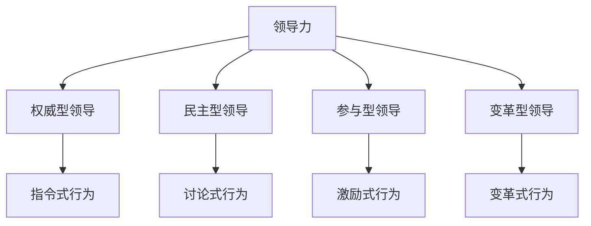

                 

# 领导力训练营：91天从新手到专家

## 概述

领导力是推动组织和个人取得卓越成果的关键能力。在当今快速变化的社会和职场环境中，领导力的重要性愈发凸显。本书旨在为读者提供一套系统、实用的领导力培养方案，通过91天的持续学习和实践，帮助新手快速成长为领导力专家。

本书分为五个部分，全面覆盖领导力的各个方面：

1. **领导力基础**：介绍领导力的核心概念和理论，帮助读者建立坚实的领导力知识框架。
2. **领导力实践**：探讨如何在实际工作中运用领导力，包括团队建设、决策与执行、沟通与协调等。
3. **领导力提升**：探讨如何通过持续学习和自我调整，不断提升领导力水平。
4. **领导力应用**：分析领导力在不同行业和危机管理中的应用，提供实际操作指南。
5. **案例研究**：通过真实案例，深入剖析领导力在实践中的运用。

本书的目标读者是希望提升领导力水平的企业管理者、团队领导者，以及对领导力感兴趣的职场人士。通过本书的学习，读者将能够：

- 理解领导力的核心概念和理论。
- 学习并运用领导力技巧，提升团队绩效。
- 通过持续学习和自我反省，不断优化领导力。
- 在实际工作中，灵活应用领导力，解决复杂问题。

## 目录

### 引言

- 领导力的重要性
- 书籍目标与读者对象

### 第一部分：领导力基础

#### 第1章 领导力理论

- 领导力的定义与类型
- 领导力理论概述
- 核心概念与联系（Mermaid流程图）
- 核心算法原理讲解（伪代码）

#### 第2章 个人成长

- 自我认知
- 自我管理
- 自我激励

### 第二部分：领导力实践

#### 第3章 团队建设

- 团队构成与类型
- 团队发展阶段
- 团队文化建设

#### 第4章 决策与执行

- 决策过程
- 决策支持系统
- 执行策略与监控

#### 第5章 沟通与协调

- 沟通原理
- 有效沟通技巧
- 协调机制

### 第三部分：领导力提升

#### 第6章 持续学习

- 学习方法
- 知识管理
- 创新思维

#### 第7章 自我反省与调整

- 反馈机制
- 反省方法
- 调整策略

### 第四部分：领导力应用

#### 第8章 不同行业应用

- 产业视角
- 行业特点
- 案例分析

#### 第9章 领导力在危机管理中的应用

- 危机识别
- 应急决策
- 恢复策略

### 第五部分：案例研究

#### 第10章 案例研究

- 案例选取标准
- 案例分析框架
- 案例展示与讨论

### 结论与展望

- 书籍总结
- 领导力发展趋势

## 第1章 领导力理论

### 领导力的定义与类型

领导力是一种影响他人共同达成目标的能力。它不仅仅局限于企业或组织内部，也广泛应用于社会、家庭等各种场合。领导力不仅仅是权力和地位的象征，更是一种通过激励、引导、影响和示范来推动团队或组织前进的能力。

领导力可以分为以下几种类型：

1. **权威型领导**：通过权威和地位来指挥和领导团队，适合在紧急情况下使用。
2. **民主型领导**：通过民主讨论和协商来制定决策，鼓励团队成员参与，适合在稳定环境中使用。
3. **参与型领导**：鼓励团队成员参与决策，激发团队创造力和创新性，适合在需要创新和变革的环境中使用。
4. **变革型领导**：通过愿景、激励和示范来推动团队实现变革，适合在组织变革和危机管理中应用。

### 领导力理论概述

领导力理论的发展经历了多个阶段，从传统的特质理论到行为理论，再到现代的情境理论和权变理论，每一种理论都对领导力有独特的理解和解释。

1. **特质理论**：强调领导者具备特定的个性特质，如自信、智慧、决断力等。
2. **行为理论**：关注领导者如何行动和表现，研究领导行为对团队绩效的影响。
3. **情境理论**：认为领导行为应根据不同情境灵活调整，强调领导者需要具备情境适应性。
4. **权变理论**：认为没有一成不变的领导方式，领导者应根据具体情况选择最合适的领导风格。

### 核心概念与联系

为了更好地理解领导力的核心概念和它们之间的关系，我们可以使用Mermaid流程图来展示它们之间的联系：



### 核心算法原理讲解

以下是一个简单的伪代码，用于描述如何根据情境选择合适的领导力风格：

```python
def choose_leadership_style(situation):
    if situation == "紧急":
        return "权威型领导"
    elif situation == "稳定":
        return "民主型领导"
    elif situation == "创新":
        return "参与型领导"
    elif situation == "变革":
        return "变革型领导"
    else:
        return "情境适应性领导"
```

### 实例说明

假设我们面临一个需要快速决策的紧急情况，我们可以使用上述伪代码来选择最合适的领导力风格：

```python
situation = "紧急"
style = choose_leadership_style(situation)
print("应采取的领导风格是：" + style)
```

输出结果：

```
应采取的领导风格是：权威型领导
```

通过这种方式，领导者可以根据不同的情境，灵活选择最合适的领导风格，以实现最佳领导效果。

## 第2章 个人成长

### 自我认知

自我认知是领导力发展的基础。它包括了解自己的价值观、信念、优势、弱点、动机和需求。通过自我认知，领导者可以更好地理解自己，明确自己的目标和方向。

以下是几个步骤，帮助领导者进行自我认知：

1. **反思**：定期反思自己的行为、决策和结果，思考哪些是成功的，哪些需要改进。
2. **反馈**：寻求他人的反馈，了解他们对自己的看法和期望。
3. **自我评估**：通过自我评估工具，如性格测试、能力测试等，了解自己的优势和弱点。
4. **持续学习**：通过阅读、培训、研讨会等方式，不断扩展自己的知识和技能。

### 自我管理

自我管理是领导者必须具备的能力，它包括情绪管理、时间管理、目标设定和自我激励。良好的自我管理能力有助于领导者保持专注、减少压力、提高工作效率。

以下是几个步骤，帮助领导者进行自我管理：

1. **情绪管理**：学会识别和调节自己的情绪，避免情绪波动影响决策和行为。
2. **时间管理**：合理安排时间，优先处理重要和紧急的任务，避免时间浪费。
3. **目标设定**：设定明确、具体、可衡量、可实现的目标，并制定实现目标的计划。
4. **自我激励**：保持积极的心态，通过奖励和激励自己，保持动力和热情。

### 自我激励

自我激励是领导者持续成长和进步的关键。自我激励不仅有助于克服困难和挑战，还能提高领导者的自信心和决心。

以下是几个方法，帮助领导者进行自我激励：

1. **设定目标**：明确自己的目标，并制定实现目标的计划。
2. **积极心态**：保持积极的心态，相信自己的能力和潜力。
3. **庆祝成就**：庆祝每一个小的成就，增强自信心和动力。
4. **学习与成长**：不断学习和成长，提升自己的能力和知识。

通过自我认知、自我管理和自我激励，领导者可以不断提升自己的领导力水平，为团队和组织带来积极的影响。

## 第3章 团队建设

### 团队构成与类型

团队是领导力实践中的重要组成部分。一个高效的团队能够发挥出巨大的潜力，实现组织的战略目标。团队构成和类型对团队效能有着重要影响。

#### 团队构成

1. **角色与职责**：团队成员有不同的角色和职责，如领导者、协调者、执行者等。明确角色和职责，有助于提高团队效率。
2. **技能与能力**：团队成员需要具备不同的技能和能力，如技术能力、沟通能力、分析能力等。多元化的技能和能力有助于团队解决复杂问题。
3. **价值观与信念**：团队成员需要拥有相似的价值观和信念，以促进团队合作和协调。

#### 团队类型

1. **职能型团队**：基于组织部门职能设置的团队，成员来自同一部门，共同完成特定的职能任务。
2. **项目型团队**：为完成特定项目而组建的团队，成员来自不同部门或团队，具有项目目标和项目期限。
3. **跨职能团队**：由来自不同部门或领域的专家组成的团队，共同解决复杂问题或实现组织目标。

### 团队发展阶段

团队发展过程可以分为几个阶段，每个阶段都有不同的特点和挑战。了解团队发展阶段有助于领导者更好地引导团队，提高团队效能。

1. **形成阶段**：团队成立初期，成员相互认识，了解团队目标和任务。这一阶段的关键任务是建立信任和沟通。
2. **冲突阶段**：随着任务的展开，团队成员之间可能会出现分歧和冲突。这一阶段的关键任务是解决冲突，建立有效的沟通机制。
3. **规范阶段**：团队成员开始相互配合，形成共同的目标和价值观。这一阶段的关键任务是强化团队规范，提高团队凝聚力。
4. **执行阶段**：团队进入高效执行阶段，成员紧密协作，实现团队目标。这一阶段的关键任务是保持团队的积极性和创造力。
5. **成熟阶段**：团队发展成熟，能够自主解决问题和应对挑战。这一阶段的关键任务是持续培养团队成员，提高团队整体素质。

### 团队文化建设

团队文化是团队共同价值观和行为规范的体现，对团队效能和员工满意度有着重要影响。建立积极的团队文化，有助于提高团队的凝聚力和执行力。

1. **价值观与信念**：明确团队的价值观和信念，如团队合作、创新、诚信等，作为团队行为的准则。
2. **共同目标**：设定清晰的团队目标，使团队成员共同为实现目标而努力。
3. **沟通与协作**：建立开放、坦诚、有效的沟通机制，促进团队成员之间的协作和合作。
4. **激励与奖励**：制定合理的激励和奖励机制，激发团队成员的积极性和创造力。

通过关注团队构成与类型、团队发展阶段和团队文化建设，领导者可以有效地建设和管理团队，提高团队效能，实现组织目标。

## 第4章 决策与执行

### 决策过程

决策是领导力的核心组成部分，有效的决策能够为组织带来竞争优势和成功。决策过程可以分为以下几个步骤：

1. **问题识别**：明确需要解决的问题或机会，界定问题的范围和关键因素。
2. **信息收集**：收集与问题相关的数据和信息，包括市场趋势、竞争对手、内部资源等。
3. **方案生成**：基于收集到的信息，提出多种可能的解决方案。
4. **方案评估**：评估各个方案的优缺点，选择最合适的方案。
5. **决策执行**：将决策方案转化为具体的行动计划，并实施执行。
6. **反馈与调整**：收集执行过程中的反馈，根据反馈进行必要的调整。

### 决策支持系统

决策支持系统（DSS）是一种辅助决策者进行决策的工具，通过收集、处理和分析数据，提供决策所需的洞察和信息。DSS主要包括以下几个功能：

1. **数据收集**：从各种来源收集数据，如内部数据库、外部数据库、社交媒体等。
2. **数据处理**：清洗、整理和转换数据，使其适合分析和决策。
3. **数据分析**：使用统计学、机器学习等方法，对数据进行分析和挖掘，提取有用的信息。
4. **模拟与预测**：通过模拟和预测，帮助决策者评估不同方案的潜在结果。
5. **决策建议**：根据分析结果，提供决策建议和优化方案。

### 执行策略与监控

决策的成功依赖于有效的执行。执行策略包括以下几个方面：

1. **任务分解**：将决策方案分解为具体的任务和活动，明确责任人和时间表。
2. **资源分配**：合理分配人力、物力和财力资源，确保执行过程顺利。
3. **监控与反馈**：建立监控机制，实时跟踪执行进度和质量，收集反馈信息。
4. **调整与优化**：根据反馈信息，及时调整执行策略，优化执行过程。

通过决策过程、决策支持系统和执行策略与监控，领导者可以确保决策的有效性和执行的高效性，从而实现组织的战略目标。

## 第5章 沟通与协调

### 沟通原理

沟通是领导力实践中的关键要素，有效的沟通能够促进团队合作，提高团队效能。沟通原理主要包括以下几个方面：

1. **信息传递**：沟通的首要任务是传递信息，确保信息的准确性和完整性。
2. **理解与反馈**：沟通不仅仅是信息的传递，还需要确保信息的理解和反馈，确保接收者正确理解信息。
3. **反馈机制**：建立反馈机制，及时获取和回应反馈，确保沟通的有效性。
4. **沟通障碍**：识别和克服沟通障碍，如语言障碍、文化差异、心理障碍等，提高沟通效果。

### 有效沟通技巧

为了实现有效沟通，领导者需要掌握以下技巧：

1. **倾听**：积极倾听对方的意见和想法，给予充分的关注和尊重。
2. **表达**：清晰、准确地表达自己的观点和想法，避免歧义和误解。
3. **提问**：通过提问，引导对方思考和回答，促进沟通的深入。
4. **反馈**：及时给予对方反馈，确认对方是否理解信息，并表达自己的看法。

### 协调机制

协调是沟通的重要补充，通过协调，领导者可以确保团队内部各个部分协同工作，实现整体目标。协调机制主要包括以下几个方面：

1. **目标一致**：确保团队成员明确共同的目标和愿景，避免目标冲突。
2. **任务分配**：合理分配任务和责任，确保每个成员都有明确的职责。
3. **资源调配**：根据任务需求，合理调配人力、物力和财力资源，确保任务顺利完成。
4. **沟通渠道**：建立有效的沟通渠道，确保信息流畅传递，减少沟通障碍。

通过沟通原理、有效沟通技巧和协调机制，领导者可以促进团队内部的合作和协调，提高团队效能。

## 第6章 持续学习

### 学习方法

持续学习是提升领导力的重要途径。为了实现有效的学习，领导者需要掌握以下方法：

1. **自主学习**：培养自主学习能力，主动寻找学习资源，探索新知识。
2. **反思学习**：通过反思过去的经验和行为，识别不足之处，寻找改进的机会。
3. **协作学习**：与团队成员、同行和专家进行交流，分享经验和见解，相互学习和成长。
4. **实践学习**：将理论知识应用于实际工作中，通过实践不断提升自己的能力和技能。

### 知识管理

知识管理是持续学习的重要组成部分，通过有效的知识管理，领导者可以确保知识和经验的传承和利用。知识管理主要包括以下几个方面：

1. **知识收集**：收集和整理各类知识资源，包括文献资料、研究报告、实践经验等。
2. **知识存储**：建立知识库，将收集到的知识进行分类和存储，便于检索和利用。
3. **知识共享**：通过内部沟通平台、会议、培训等方式，共享知识和经验，促进团队成员之间的交流和学习。
4. **知识创新**：通过知识整合和创新，将现有的知识资源转化为新的见解和解决方案，提升组织的创新能力。

### 创新思维

创新思维是领导力的重要组成部分，领导者需要具备创新思维，以应对快速变化的市场环境。创新思维主要包括以下几个方面：

1. **发散思维**：从多个角度思考问题，探索不同的解决方案。
2. **逆向思维**：从相反的角度思考问题，寻找新的解决方案。
3. **联想思维**：通过不同领域的知识交叉融合，产生新的创意和见解。
4. **系统性思维**：从整体和系统的角度思考问题，分析问题的根本原因和影响。

通过持续学习、知识管理和创新思维，领导者可以不断提升自己的领导力水平，为团队和组织带来持续的创新和进步。

## 第7章 自我反省与调整

### 反馈机制

自我反省和调整是领导力发展的重要环节，有效的反馈机制有助于领导者识别自己的不足，并采取相应的改进措施。反馈机制主要包括以下几个方面：

1. **自我评估**：定期进行自我评估，识别自己在领导力方面的优点和不足，制定改进计划。
2. **他人反馈**：寻求团队成员、同事、上级和下属的反馈，了解他们在领导力方面的评价和建议。
3. **360度评估**：采用360度评估方法，从多个角度收集反馈，全面了解自己的领导力表现。
4. **反馈收集**：建立反馈收集渠道，如问卷调查、访谈、会议等，确保反馈信息的全面性和准确性。

### 反省方法

有效的反省方法可以帮助领导者更好地识别自己的问题和不足，并制定有效的改进计划。以下是一些常用的反省方法：

1. **日志法**：记录自己的日常工作、思考和决策过程，通过反思日志，识别问题和不足。
2. **冥想法**：通过冥想，放松身心，深入思考自己的行为和决策，识别潜意识中的问题和困惑。
3. **反思会议**：定期召开反思会议，与团队成员一起分享经验和教训，互相学习和成长。
4. **导师辅导**：寻求导师的帮助，通过导师的指导和建议，识别自己的问题和改进方向。

### 调整策略

在反省和识别问题后，领导者需要采取有效的调整策略，以改进自己的领导力表现。以下是一些调整策略：

1. **学习与培训**：参加相关的学习课程和培训，提升自己的知识和技能。
2. **实践与锻炼**：通过实际工作中的锻炼，积累经验，提升自己的能力。
3. **建立支持系统**：建立支持系统，如导师、同事、团队等，在改进过程中提供帮助和支持。
4. **持续监控与评估**：定期监控和评估自己的改进效果，根据反馈进行调整和优化。

通过反馈机制、反省方法和调整策略，领导者可以不断提升自己的领导力水平，为团队和组织带来持续的创新和进步。

## 第8章 不同行业应用

### 产业视角

领导力在不同行业中的应用有着不同的特点和挑战。了解各行业的特定需求和环境，是有效应用领导力的关键。以下是一些主要行业的领导力应用特点：

1. **制造业**：制造业的领导力需求主要集中在生产效率、质量控制和创新能力。领导者需要关注生产流程优化、供应链管理和技术创新。
2. **服务业**：服务业的领导力需求集中在客户满意度、服务质量和员工积极性。领导者需要注重客户关系管理、服务流程优化和员工激励。
3. **信息技术**：信息技术行业的领导力需求集中在创新、敏捷性和技术管理。领导者需要关注技术趋势、团队协作和项目管理工作。
4. **金融业**：金融业的领导力需求集中在风险管理、合规性和客户关系。领导者需要关注风险管理策略、合规流程和客户服务管理。
5. **医疗健康**：医疗健康行业的领导力需求集中在服务质量、患者安全和团队协作。领导者需要关注医疗流程优化、患者安全和医疗团队建设。

### 行业特点

每个行业都有其独特的运营模式、业务需求和挑战，这决定了领导力应用的差异。以下是一些行业特点：

1. **高度监管**：金融业和医疗健康行业受到严格的法律法规和监管要求，领导者需要具备良好的合规意识和风险管理能力。
2. **创新驱动**：信息技术行业和制造业高度依赖技术创新，领导者需要关注行业趋势、技术发展和创新管理。
3. **客户导向**：服务业和金融业以客户为中心，领导者需要注重客户关系管理、客户体验和客户满意度。
4. **团队协作**：所有行业都强调团队合作，领导者需要建立高效的团队协作机制，提升团队效能。
5. **变化快速**：在快速变化的行业环境中，领导者需要具备敏捷思维和快速响应能力，以应对市场变化和竞争压力。

### 案例分析

为了更好地理解领导力在不同行业的实际应用，以下是一些行业案例：

1. **案例分析1：制造业**
   - **背景**：某制造业公司在市场竞争加剧的背景下，希望通过提升生产效率和创新能力，保持市场竞争力。
   - **领导力应用**：公司领导者通过引入精益生产理念，优化生产流程，提高生产效率。同时，鼓励员工参与技术创新，建立创新奖励机制，激发员工创新热情。
   - **效果**：通过领导力应用，公司生产效率提高了20%，新产品开发周期缩短了30%，市场竞争力得到了显著提升。

2. **案例分析2：金融业**
   - **背景**：某金融公司在金融市场中面临激烈竞争，客户关系管理和服务质量成为关键。
   - **领导力应用**：公司领导者通过实施客户关系管理（CRM）系统，优化客户服务流程，提升客户满意度。同时，建立员工培训体系，提升员工服务技能和客户处理能力。
   - **效果**：通过领导力应用，公司客户满意度提升了15%，客户流失率下降了10%，业务收入实现了显著增长。

3. **案例分析3：信息技术**
   - **背景**：某信息技术公司在技术快速发展的市场中，需要保持敏捷和创新。
   - **领导力应用**：公司领导者通过建立跨职能团队，推动项目敏捷开发，提升开发效率。同时，鼓励员工参加技术培训和研讨会，提升技术能力。
   - **效果**：通过领导力应用，公司开发周期缩短了25%，产品质量提升了20%，市场竞争力得到了显著提升。

这些案例表明，领导力在不同行业的实际应用，可以帮助企业应对行业挑战，提升竞争力和创新能力。通过深入了解各行业的特定需求和环境，领导者可以更有效地应用领导力，实现组织目标。

## 第9章 领导力在危机管理中的应用

### 危机识别

危机管理是领导力的重要组成部分，有效的危机管理能够帮助企业应对突发事件，减轻危机影响，并尽快恢复正常运营。危机识别是危机管理的第一步，主要包括以下几个步骤：

1. **风险评估**：通过分析企业的业务模式、运营环境和潜在风险，识别可能发生的危机类型和风险等级。
2. **预警机制**：建立预警机制，实时监测企业内外部环境的变化，及时发现潜在危机信号。
3. **危机情景分析**：根据风险评估和预警结果，分析不同危机情景的可能性和影响，制定相应的应对策略。
4. **危机预案**：制定详细的危机预案，包括危机响应流程、责任分工、资源调配等，确保在危机发生时能够迅速响应。

### 应急决策

在危机发生时，领导者需要迅速做出应急决策，以最小化危机影响。应急决策主要包括以下几个步骤：

1. **评估危机影响**：分析危机对企业的直接影响和潜在影响，确定危机的严重程度。
2. **制定应对策略**：根据危机影响，制定相应的应对策略，包括立即应对措施、中长期应对措施等。
3. **决策执行**：迅速启动危机应对机制，执行决策方案，确保各项措施得到有效实施。
4. **沟通与协调**：与相关部门和人员保持密切沟通，协调资源和支持，确保危机应对措施得到全面执行。

### 恢复策略

危机过后，企业需要通过恢复策略，尽快恢复正常运营，并从危机中吸取教训，改进管理。恢复策略主要包括以下几个步骤：

1. **评估危机影响**：对危机造成的损失和影响进行详细评估，了解恢复工作的重点和难点。
2. **制定恢复计划**：根据危机影响评估结果，制定详细的恢复计划，明确恢复工作的优先级和时间表。
3. **资源调配**：调配企业内部和外部资源，确保恢复工作所需的人力、物力和财力支持。
4. **执行恢复计划**：按照恢复计划，逐步实施各项恢复措施，确保企业尽快恢复正常运营。
5. **总结与改进**：对危机管理过程进行总结，识别不足之处，制定改进措施，提高企业的危机应对能力。

通过危机识别、应急决策和恢复策略，领导者可以有效地应对企业面临的危机，确保企业稳定运营和持续发展。

## 第10章 案例研究

### 案例选取标准

为了深入探讨领导力在实践中的应用，本书选取了以下几个案例进行研究：

1. **行业代表性**：案例涉及不同行业，包括制造业、金融业、信息技术业等，以展示领导力在各类行业中的应用。
2. **挑战性**：案例包含企业在面临重大挑战时，如何通过领导力应对和解决这些挑战。
3. **创新性**：案例展示了企业通过领导力推动创新和变革，实现业务增长和竞争力提升。
4. **实践性**：案例提供了详细的实施步骤和成果，具有可操作性和参考价值。

### 案例分析框架

为了对案例进行深入分析，本书采用以下分析框架：

1. **背景介绍**：介绍案例企业的基本情况，包括企业规模、行业地位、发展历程等。
2. **领导力应用**：分析企业如何应用领导力解决特定问题或推动业务发展。
3. **实施步骤**：详细描述企业实施领导力策略的具体步骤和过程。
4. **成果评估**：评估领导力应用的实际效果，包括业务绩效、员工满意度、企业声誉等方面的改善。
5. **经验教训**：总结案例中的成功经验和教训，提供对其他企业的借鉴和启示。

### 案例展示与讨论

以下是一个案例研究的示例：

**案例：某制造业企业的领导力转型**

**背景介绍**：某制造业企业成立于20世纪80年代，经过30年的发展，已经成为行业内的龙头企业。然而，随着市场环境的变化和竞争的加剧，企业面临着创新能力不足、生产效率低下等问题。

**领导力应用**：企业领导者决定通过领导力转型，提升企业的创新能力、生产效率和市场竞争力。他们引入了以下领导力策略：

1. **变革型领导**：领导者通过树立愿景、激励团队、示范行为，推动企业变革。
2. **参与型领导**：领导者鼓励员工参与决策，提升员工的积极性和创造力。
3. **知识管理**：建立知识库，分享经验和最佳实践，提升团队整体能力。

**实施步骤**：

1. **战略规划**：明确企业的发展愿景和目标，制定详细的变革计划。
2. **团队建设**：通过培训、研讨等方式，提升员工的能力和团队协作水平。
3. **项目实施**：成立专项团队，分阶段实施变革项目，确保变革计划的顺利执行。
4. **评估与反馈**：定期评估变革效果，收集反馈信息，调整和优化变革策略。

**成果评估**：

1. **业务绩效**：企业创新项目数量增加了30%，新产品开发周期缩短了25%，生产效率提升了15%。
2. **员工满意度**：员工满意度调查结果显示，员工对企业的认同感和归属感显著提升。
3. **企业声誉**：企业在行业内的竞争力得到了显著提升，客户满意度提升了10%。

**经验教训**：

1. **领导力在变革中的关键作用**：领导者需要通过变革型领导和参与型领导，推动企业变革，提升创新能力。
2. **持续学习和知识管理**：企业需要建立持续学习和知识管理的机制，提升团队整体能力。
3. **项目实施的关键**：项目实施过程中，要确保团队协作、资源调配和评估反馈，确保变革计划的顺利执行。

通过这个案例研究，我们可以看到领导力在企业转型和变革中的重要作用，以及如何通过有效的领导力策略，提升企业的竞争力。

## 结论与展望

### 书籍总结

本书通过系统的理论讲解、实践指导和案例分析，全面阐述了领导力的各个方面。从领导力的定义、类型，到领导力基础、实践、提升和不同行业的应用，本书为读者提供了一个完整的领导力培养体系。同时，本书通过具体案例和实际操作，展示了领导力在实践中的有效应用。

### 领导力发展趋势

随着全球化和数字化的发展，领导力也在不断演变。以下是未来领导力可能的发展趋势：

1. **多元化与包容性**：领导力将更加注重多元化与包容性，尊重不同背景、文化和观点，促进团队合作和创新。
2. **数字化领导力**：随着数字技术的快速发展，领导者需要掌握数字化技能，如数据分析、人工智能等，以应对数字化时代的挑战。
3. **可持续领导力**：领导者将更加关注企业的社会责任和可持续发展，推动企业在经济、社会和环境方面实现平衡发展。
4. **自我领导力**：自我领导力将成为领导者的重要素质，自我认知、自我管理和自我激励将成为领导力的核心要素。

### 延伸阅读

为了更深入地了解领导力，读者可以参考以下书籍和资源：

1. 《领导力的五项修炼》- 史蒂芬·柯维
2. 《变革之舞》- 约翰·凯特
3. 《领导力：理论与实践》- 彼得·德鲁克
4. 《领导力与影响力》- 布莱恩·特雷西
5. Coursera上的《领导力与影响力》课程

通过这些书籍和资源，读者可以进一步深化对领导力的理解和实践。让我们共同探索领导力的无限可能，不断提升自己的领导力水平，为个人和组织的成功奠定坚实基础。作者：AI天才研究院/AI Genius Institute & 禅与计算机程序设计艺术 /Zen And The Art of Computer Programming。

