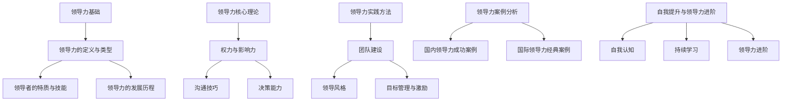

                 

### 《领导力训练营：98天从菜鸟到大神》概述

《领导力训练营：98天从菜鸟到大神》是一本专为初学者量身定做的领导力提升指南。这本书的宗旨是帮助读者在短时间内迅速掌握领导力的核心概念和实战技巧，从而实现从领导力菜鸟到专业大神的华丽转变。全书共分为五个部分，涵盖了领导力的基础理论、核心实践方法、案例分析、自我提升以及领导力发展的资源推荐，内容丰富且结构严谨。

#### 书籍的读者对象

这本书适合以下几类读者：
1. **企业管理者和职业人士**：希望通过学习领导力提升管理水平和职业素养。
2. **职场新人**：刚步入职场，希望在短时间内提升自己的领导能力。
3. **教育工作者**：教育领域的工作者，希望通过本书提升班级管理和教育指导能力。
4. **人力资源从业者**：从事人力资源相关工作的专业人士，希望通过学习领导力理论更好地进行员工管理和培训。

#### 全书结构

全书分为五个主要部分：
1. **领导力基础**：介绍领导力的基本概念、类型及其发展历程，为读者奠定坚实的理论基础。
2. **领导力核心理论**：深入探讨权力与影响力、沟通技巧、决策能力等核心理论，帮助读者理解领导力的内在机制。
3. **领导力实践方法**：通过团队建设、领导风格、目标管理与激励等实践方法，提供实用的领导技巧。
4. **领导力案例分析**：分析国内外成功案例，通过具体实例展现领导力在实践中的应用。
5. **自我提升与领导力进阶**：探讨如何通过自我认知、持续学习和领导力进阶，进一步提升领导力水平。

通过这五个部分的学习，读者将能够系统、全面地掌握领导力的理论和实践，逐步提升自己的领导能力，从而在职业生涯中取得更大的成功。

### 设计思路

为了设计出一本名为《领导力训练营：98天从菜鸟到大神》的书籍，我们需要遵循以下设计思路：

#### 确定书籍主题和结构

首先，明确书籍的核心主题——领导力的培养和提升。围绕这一主题，将书籍分为五个主要部分：领导力基础、领导力核心理论、领导力实践方法、领导力案例分析以及自我提升与领导力进阶。

#### 细化每个部分的内容

1. **领导力基础**：
   - 第一个部分将详细介绍领导力的基本概念、类型及其发展历程，帮助读者建立领导力的基础理论框架。
2. **领导力核心理论**：
   - 第二个部分深入探讨权力与影响力、沟通技巧、决策能力等核心理论，解析领导力的内在机制，并给出具体的应用方法。
3. **领导力实践方法**：
   - 第三个部分通过团队建设、领导风格、目标管理与激励等实践方法，提供实用的领导技巧，帮助读者将理论知识应用到实际中。
4. **领导力案例分析**：
   - 第四个部分分析国内外成功案例，通过具体实例展现领导力在实践中的应用，启发读者的思考和实践。
5. **自我提升与领导力进阶**：
   - 第五个部分探讨如何通过自我认知、持续学习和领导力进阶，进一步提升领导力水平，为读者的长期发展提供指导。

#### 逻辑清晰、层次分明

在编写过程中，我们遵循由浅入深、循序渐进的原则，确保每个章节的内容既紧密相关又相对独立，便于读者逐步提升领导力。同时，使用markdown格式中的#、##、###来标识不同级别的标题，确保目录结构的清晰性。

#### 加入视觉元素

为了增强读者的阅读体验，我们在某些章节中加入了Mermaid流程图，展示核心概念和架构。此外，使用latex格式嵌入数学公式和伪代码，以便于讲解核心算法原理，使得内容更加直观易懂。

#### 实践与理论相结合

在《领导力训练营：98天从菜鸟到大神》中，我们强调实践与理论的结合。每个章节都包含实际案例和项目实战，通过代码示例和详细解释说明，帮助读者将理论知识应用到实际中。同时，我们强调开发环境和源代码的实现，以及代码的解读与分析，使读者能够深入理解领导力在实际应用中的具体实现。

#### 简洁性

在目录设计过程中，我们注重简洁性，避免冗长的描述和多余的废话。全书总字数控制在8000-12000字左右，确保重点突出，便于读者快速获取信息。

### 目录大纲设计

根据上述设计思路，下面是《领导力训练营：98天从菜鸟到大神》的目录大纲设计：

```
# 《领导力训练营：98天从菜鸟到大神》目录大纲

## 第一部分：领导力基础
### 1.1 领导力的定义与类型
#### 1.1.1 领导力的基本概念
#### 1.1.2 不同类型的领导力
### 1.2 领导者的特质与技能
#### 1.2.1 领导者的个人特质
#### 1.2.2 领导者必备的技能
### 1.3 领导力的发展历程
#### 1.3.1 领导力理论的演变
#### 1.3.2 国内外领导力研究的进展

## 第二部分：领导力核心理论
### 2.1 权力与影响力
#### 2.1.1 权力的来源与应用
#### 2.1.2 影响力的建立与维护
### 2.2 沟通技巧
#### 2.2.1 有效沟通的基本原则
#### 2.2.2 提升沟通效率的方法
### 2.3 决策能力
#### 2.3.1 决策的类型与过程
#### 2.3.2 提高决策质量的策略

## 第三部分：领导力实践方法
### 3.1 团队建设
#### 3.1.1 团队建设的核心要素
#### 3.1.2 团队冲突的管理
### 3.2 领导风格
#### 3.2.1 不同领导风格的特点
#### 3.2.2 领导风格的选择与适应
### 3.3 目标管理与激励
#### 3.3.1 目标设定的SMART原则
#### 3.3.2 激励理论及其应用

## 第四部分：领导力案例分析
### 4.1 国内领导力成功案例
#### 4.1.1 企业领导力案例分析
#### 4.1.2 政府领导力案例分析
### 4.2 国际领导力经典案例
#### 4.2.1 国际企业领导力案例分析
#### 4.2.2 国际组织领导力案例分析

## 第五部分：自我提升与领导力进阶
### 5.1 自我认知
#### 5.1.1 自我评估与反馈
#### 5.1.2 自我成长计划
### 5.2 持续学习
#### 5.2.1 学习方法与资源
#### 5.2.2 创新思维与知识整合
### 5.3 领导力进阶
#### 5.3.1 领导力的深度探索
#### 5.3.2 领导力的高级应用

## 附录
### A.1 领导力发展资源
#### A.1.1 领导力研究机构与书籍推荐
#### A.1.2 领导力培训课程与工作坊

# Mermaid 流程图


通过这个详细的目录大纲，读者可以清晰地了解本书的结构和内容，逐步深入地学习和掌握领导力的各个方面的知识和技巧。

### 第一部分：领导力基础

#### 1.1 领导力的定义与类型

领导力，顾名思义，是指引导和影响他人共同实现目标的能力。它不仅仅是一种权力，更是一种影响力和号召力，能够在不同情境下灵活运用，从而达到团队或组织的共同愿景。领导力的核心在于个人特质、技能和情境适应能力的综合体现。

**领导力的基本概念**

领导力的定义有多种，但核心可以归纳为以下几点：

1. **领导与管理的区别**：领导力不同于管理，管理更多是关于组织和资源的管理，而领导力则是关于影响和激励他人。管理可以看作是维持现状，而领导力则是推动变革。
2. **权力与影响力的关系**：领导力不仅依赖于权力，更依赖于影响力。权力是领导的基础，但真正的领导力在于能够获得他人的信任和追随。
3. **情境适应性**：领导力不是一成不变的，而是需要根据不同情境灵活调整。不同的情境可能需要不同的领导风格和策略。

**不同类型的领导力**

领导力可以分为多种类型，根据其特点和应用场景，主要有以下几种：

1. **变革型领导**：通过激发团队成员的内在动力，推动变革和创新。这类领导者通常具有远见卓识，能够激发团队的潜力和创造力。
2. **交易型领导**：依靠制度和规则来激励和约束团队成员，通过明确的目标和奖励机制来驱动团队。这类领导者通常注重效率和目标的达成。
3. **情境型领导**：根据不同情境和团队成员的特点，灵活调整领导风格和策略。这类领导者能够因时因地制宜，使团队在复杂多变的环境中保持高效运作。
4. **服务型领导**：以服务团队成员为核心，关注团队的需求和成长。这类领导者通常具有深厚的人脉和沟通能力，能够建立高度信任的团队关系。

**领导力的发展历程**

领导力理论经历了漫长的发展过程，从早期的特质理论到现代的行为理论和权变理论，不断演变和完善。以下是几个重要的领导力理论：

1. **特质理论**：认为领导者具有某些特定的个人特质，如自信、果断和诚实。这种理论强调领导者与普通人的差异。
2. **行为理论**：关注领导者的行为和风格，认为不同的领导行为会产生不同的领导效果。行为理论认为，领导者可以通过学习和模仿不同的行为风格来提升自己的领导能力。
3. **权变理论**：强调领导行为和领导效果之间的关系受情境因素的影响。不同的情境需要不同的领导风格，领导者需要根据具体情境灵活调整自己的行为。

**国内外领导力研究的进展**

领导力研究在国内外都取得了显著的进展。国内的研究主要集中在领导力模型的构建、领导行为与绩效的关系以及领导力发展的策略等方面。国际上，领导力研究则更加广泛和深入，涉及领导力心理学、领导力伦理学以及领导力跨文化研究等。一些重要的研究成果包括：

1. **领导力五因素模型**：提出领导力包括五大要素：社交技能、任务导向、成就导向、组织意识和自我认知。
2. **变革型领导与绩效关系研究**：研究表明，变革型领导能够显著提升团队的绩效和创新力。
3. **领导力跨文化研究**：揭示了不同文化背景下的领导力特点和应用，对全球化背景下的领导力发展具有重要的指导意义。

通过了解领导力的定义、类型及其发展历程，读者可以建立对领导力的基础认识，为后续的深入学习打下坚实的基础。

#### 1.2 领导者的特质与技能

领导者的特质与技能是决定其成功与否的关键因素。领导者不仅需要具备独特的个人特质，还需要掌握一系列技能，以便在不同的情境下灵活应用，实现团队的目标。

**领导者的个人特质**

领导者的个人特质是区别其与普通员工的重要标志。以下是一些关键的领导者特质：

1. **自信**：领导者必须具备自信心，能够坚定地做出决策并承担责任。自信不仅能够影响团队成员的士气，还能在面对挑战时保持冷静和果断。
2. **诚信**：诚信是领导者赢得信任和尊重的基础。一个诚信的领导者会以身作则，树立良好的道德榜样，使团队成员愿意跟随和信任。
3. **决断力**：领导者需要在关键时刻迅速做出决策，并承担相应的后果。决断力不仅体现在决策的速度上，还体现在决策的质量和执行力上。
4. **沟通能力**：良好的沟通能力是领导者成功的关键。领导者需要能够清晰、准确地传达信息，并倾听团队成员的意见和建议，促进团队内部的协作和信任。
5. **适应性**：领导者必须具备高度适应性，能够快速调整自己的行为和策略，以应对不同的环境和挑战。适应性强的领导者能够更好地应对变化，保持团队的稳定和高效。

**领导者必备的技能**

除了个人特质，领导者还需要掌握一系列核心技能，以便在复杂的领导环境中游刃有余：

1. **战略规划能力**：领导者需要具备制定和实施战略规划的能力，确保团队的目标清晰，并能够实现长远发展。战略规划能力包括市场分析、资源整合和风险控制等。
2. **团队管理技能**：领导者需要能够有效地管理团队，包括人员调配、激励和反馈等。团队管理技能的核心在于激发团队成员的潜力和创造力，实现团队的高效运作。
3. **决策能力**：领导者需要在各种情境下做出明智的决策。决策能力包括分析问题的能力、评估不同选项的优劣势以及承担决策后果的勇气。
4. **变革管理能力**：领导者需要能够推动和引导团队进行变革，适应不断变化的外部环境。变革管理能力包括变革的沟通、执行和评估等。
5. **危机处理能力**：领导者需要具备应对突发事件的危机处理能力，能够迅速做出反应，稳定团队的情绪，并采取措施缓解危机。

**领导者的特质与技能之间的关系**

领导者的特质与技能是相辅相成的。个人特质为领导者提供了基础，而技能则为领导者提供了实际操作的方法和工具。例如，自信和决断力是领导者成功的基础，但只有通过战略规划能力和团队管理技能，领导者才能将这些特质转化为实际的领导效果。

总之，领导者需要不断地培养和提升自己的特质与技能，以适应不断变化的领导环境，实现团队的目标。通过了解和掌握这些特质与技能，读者可以更好地理解领导者的角色和责任，为自己的领导力发展打下坚实的基础。

#### 1.3 领导力的发展历程

领导力作为一种社会现象，其发展历程可以追溯到古代文明。从历史的长河中，我们可以看到领导力理论的演变和重要研究进展，这为我们今天理解和应用领导力提供了宝贵的参考。

**领导力理论的演变**

1. **特质理论**：领导力研究的第一个阶段是特质理论。特质理论认为，领导者天生具备某些特定的特质，如智慧、勇气、自信和道德品质等。这种理论强调领导者的个人特质和遗传因素。然而，随着研究的深入，学者们发现特质理论并不能完全解释领导力的本质。

2. **行为理论**：20世纪50年代，行为理论开始兴起。行为理论关注领导者的行为，认为不同的领导行为会导致不同的团队效果。代表性的研究包括俄亥俄州立大学的领导行为研究，通过分析领导者的行为模式，将领导风格分为任务导向型和关系导向型。行为理论为领导力研究提供了新的视角，但同样存在局限性，无法解释所有领导情境。

3. **权变理论**：权变理论进一步发展了领导力研究，强调领导行为和领导效果之间的关系受情境因素的影响。费德勒模型（Fiedler’s Contingency Model）和路径-目标理论（Path-Goal Theory）是代表性的权变理论。这些理论认为，没有一种领导风格是普适的，领导者需要根据不同情境灵活调整自己的行为。

4. **情境理论**：情境理论将领导行为与情境因素相结合，认为领导力不仅取决于领导者的个人特质和行为，还取决于领导环境。代表性理论包括赫塞和布兰查德（Hersey and Blanchard）的情境领导理论（Situation Leadership Theory），该理论根据下属的成熟度水平，提出不同的领导风格。

5. **变革型领导**：20世纪80年代，变革型领导理论逐渐兴起。变革型领导强调领导者通过激励和启发团队成员，推动变革和创新。代表性研究包括伯恩斯（Burns）的变革型领导理论和豪斯（House）的激励式领导理论（Motivational Leadership Theory）。变革型领导理论为领导力研究带来了新的视角，强调了领导者的远见卓识和影响力。

**国内外领导力研究的进展**

在国内，领导力研究近年来取得了显著进展。国内学者在领导力模型构建、领导行为与绩效关系以及领导力发展策略等方面进行了大量研究。代表性的研究包括领导力五因素模型（Leadership Behavior Inventory, LBI）和领导力动态发展模型（Dynamic Leadership Development Model）。

国际上，领导力研究也不断深入。国际学者在领导力心理学、领导力伦理学以及领导力跨文化研究等领域取得了丰硕成果。代表性的研究包括领导力行为有效性理论（Leadership Behavior Effectiveness Theory）和领导力平衡理论（Leadership Balance Theory）。

**领导力理论在实践中的应用**

领导力理论的发展为实践提供了重要的指导。在实际工作中，领导者可以根据不同的情境选择合适的领导风格，激发团队成员的潜力和创造力。以下是一些领导力理论在实践中的应用：

1. **情境领导理论**：领导者可以根据团队成员的成熟度水平，选择不同的领导风格。例如，对于成熟度较低的团队成员，领导者可以采用指令型领导风格，明确任务要求和期望；对于成熟度较高的团队成员，领导者可以采用参与型领导风格，鼓励团队成员参与决策。

2. **变革型领导理论**：在组织变革过程中，领导者可以运用变革型领导理论，通过激励和启发团队成员，推动变革的顺利进行。例如，领导者可以通过愿景激励、信任建立和参与式领导，提高团队成员的变革意识和参与度。

3. **路径-目标理论**：在项目管理中，领导者可以运用路径-目标理论，通过设定明确的目标和提供必要的支持，引导团队成员实现目标。例如，领导者可以明确项目目标和阶段性任务，为团队成员提供必要的资源和指导，激励他们克服困难，完成任务。

**领导力发展的趋势**

随着社会环境的变化，领导力研究也在不断演进。未来领导力发展的趋势包括：

1. **个性化领导**：领导者需要根据个人特质和团队需求，发展个性化的领导风格，实现领导力的差异化。

2. **跨文化领导**：全球化背景下，领导者需要具备跨文化沟通和协作能力，应对多元文化的挑战。

3. **领导力的可持续性**：领导者需要关注组织的长远发展，推动可持续发展战略，实现经济、社会和环境效益的平衡。

通过回顾领导力的发展历程，我们可以看到领导力理论的不断演进和丰富。这些理论不仅为领导力研究提供了理论基础，也为领导者在实际工作中提供了宝贵的指导。了解领导力的发展历程，有助于我们更好地理解和应用领导力，实现个人和团队的共同成长。

### 第二部分：领导力核心理论

#### 2.1 权力与影响力

权力与影响力是领导力的核心要素之一。权力是领导者在组织内进行有效管理和指导的基础，而影响力则是领导者赢得团队成员信任和尊重的关键。本章节将探讨权力的来源与应用，以及影响力的建立与维护。

**权力的来源**

1. **职位权力**：职位权力是领导者根据其在组织中的职位所拥有的权力。职位权力包括指挥权、决策权和资源分配权等。职位权力通常是由组织的结构决定的，是一种正式的权力形式。
2. **奖励权力**：奖励权力是指领导者通过提供奖励（如奖金、晋升、表彰等）来影响他人行为的能力。这种权力基于组织对领导者的信任和授权，使其能够对团队成员进行激励。
3. **惩罚权力**：惩罚权力是指领导者通过实施惩罚（如批评、降职、解雇等）来约束他人行为的能力。这种权力通常用于维护组织纪律和规则，确保团队目标的实现。
4. **专家权力**：专家权力是指领导者因其专业知识和技能而获得的权力。专家权力的来源是领导者的专业能力和对领域知识的深入理解，使团队成员愿意接受其意见和建议。
5. **参照权力**：参照权力是指领导者因其个人特质、魅力和道德榜样而获得的权力。参照权力是基于团队成员对领导者的信任和认同，使其能够对团队成员产生深远的影响。

**权力的应用**

1. **合理运用职位权力**：领导者应合理运用职位权力，确保其在团队管理中的合法性和有效性。职位权力的应用应当基于公正和透明的原则，避免滥用和误用。
2. **激励与惩罚的平衡**：领导者应在激励和惩罚之间保持平衡，根据不同情境和团队成员的表现，灵活运用奖励和惩罚手段。奖励和惩罚应当有明确的标准和依据，以增强其效果。
3. **发挥专家权力**：领导者应充分利用其专业知识和技能，为团队提供专业的指导和支持。通过专家权力的发挥，领导者能够提升团队的专业能力和整体绩效。
4. **建立参照权力**：领导者应注重个人特质的培养，树立道德榜样，赢得团队成员的信任和尊重。参照权力的建立不仅有助于提升领导者的影响力，还能增强团队的凝聚力和合作精神。

**影响力的建立与维护**

1. **信任与透明度**：建立影响力的基础是信任。领导者应通过透明度和诚信建立与团队成员的信任关系。信任是影响力的核心，没有信任，影响力将无从谈起。
2. **沟通与倾听**：领导者应注重与团队成员的沟通，倾听他们的意见和建议。有效的沟通不仅能够增进了解，还能建立良好的合作关系，增强团队凝聚力。
3. **激励与认可**：领导者应通过激励和认可来增强团队成员的积极性和归属感。激励和认可不仅能够激发团队成员的潜力，还能增强其对领导者的认同感和忠诚度。
4. **持续学习和创新**：领导者应保持持续学习和创新的精神，不断提升自己的专业能力和领导力水平。通过不断学习和创新，领导者能够保持对团队的吸引力和影响力。

**案例分析**

以某科技公司为例，该公司的一位部门经理李明在其职业生涯中展现了出色的权力与影响力运用。李明通过合理运用职位权力，明确了部门的工作目标和任务分工，确保团队目标的顺利实现。同时，他注重激励与认可，通过设立奖励机制和表彰优秀员工，激发了团队的积极性和创造力。在专业领域，李明以其深厚的专业知识和丰富的经验赢得了团队成员的信任和尊重，成为部门的专家权威。此外，李明注重与团队成员的沟通和倾听，建立了良好的信任关系，增强了团队的凝聚力。通过这些手段，李明成功建立了强大的影响力，使部门在他的领导下取得了显著的绩效提升。

总之，权力与影响力是领导力的核心要素，领导者需要合理运用权力，建立和维持影响力，以实现团队的目标。通过了解权力的来源与应用，以及影响力的建立与维护，读者可以更好地提升自己的领导能力，在职业生涯中取得更大的成功。

#### 2.2 沟通技巧

有效的沟通技巧是领导者必备的核心技能之一，它不仅能够提升团队的协作效率，还能增强团队的凝聚力和信任感。本章节将介绍有效沟通的基本原则和提升沟通效率的方法，并通过案例分析展示这些技巧在实际应用中的效果。

**有效沟通的基本原则**

1. **明确目标**：在进行沟通之前，领导者需要明确沟通的目标，确保信息传达的准确性和有效性。明确的目标有助于领导者制定沟通计划和策略，避免无谓的时间和资源浪费。
2. **倾听**：倾听是有效沟通的关键。领导者不仅要关注说什么，还要关注听什么。通过倾听，领导者可以更好地理解团队成员的需求和反馈，建立信任和合作关系。
3. **简洁表达**：简洁表达是有效沟通的重要原则。领导者应避免冗长和复杂的语言，尽量使用简单明了的语言和表达方式，确保信息的清晰传递。
4. **情感共鸣**：情感共鸣是指领导者能够站在团队成员的角度思考问题，理解和感受他们的情感。通过情感共鸣，领导者可以更好地与团队成员建立情感联系，增强沟通的效果。
5. **透明度**：透明度是建立信任的基础。领导者应保持信息的透明度，及时向团队成员传达重要信息，避免信息的不对称和误解。

**提升沟通效率的方法**

1. **使用明确的语言**：使用明确、简洁的语言是提升沟通效率的关键。领导者应避免使用模糊、含糊的词语，确保信息传递的准确性。
2. **倾听并提问**：在沟通过程中，领导者应积极倾听并提问，以确认自己对信息的理解是否正确。通过提问，领导者可以进一步了解团队成员的观点和需求，促进双向沟通。
3. **使用非语言信号**：非语言信号如肢体语言、面部表情和语调等在沟通中也起着重要作用。领导者应注重自己的非语言表达，以增强沟通的感染力和效果。
4. **定期反馈**：定期进行反馈是提升沟通效率的有效方法。领导者应定期与团队成员进行沟通，了解他们的反馈和建议，并根据反馈调整沟通策略。
5. **利用多种沟通渠道**：领导者应灵活运用多种沟通渠道，如会议、邮件、即时通讯和电话等，确保信息传达的及时性和高效性。

**案例分析**

以某公司的项目经理张丽为例，她在一次重要的项目会议上展现了出色的沟通技巧。在会议开始前，张丽明确了会议的目标，即讨论项目的进度和下一步的计划。她通过简洁明了的语言，清晰地传达了会议的议程和期望成果，确保所有参会人员都了解会议的目标和内容。

在会议过程中，张丽积极倾听团队成员的意见和反馈，鼓励他们提出问题和建议。她通过提问和回应，确认自己对团队成员的理解是否正确，确保信息的准确传递。同时，张丽注重使用非语言信号，如点头、微笑和眼神交流等，以增强沟通的效果。

会议结束后，张丽进行了总结，并邀请团队成员提供反馈。她根据反馈进行了及时的调整，并制定了一个更加详细和明确的计划，以确保项目的顺利进行。通过这次沟通，张丽成功地提升了团队的协作效率和凝聚力，使项目取得了显著的成功。

**总结**

有效的沟通技巧是领导者必备的核心技能，它不仅能够提升团队的协作效率，还能增强团队的凝聚力和信任感。通过了解有效沟通的基本原则和提升沟通效率的方法，读者可以更好地提升自己的沟通能力，在职业生涯中取得更大的成功。

#### 2.3 决策能力

决策能力是领导者必备的核心能力之一，它直接影响到团队和组织的绩效与成长。一个优秀的领导者不仅能够迅速做出决策，还能确保决策的质量和效果。本章节将探讨决策的类型与过程，并提供提高决策质量的策略，结合具体案例帮助读者更好地理解这些策略。

**决策的类型**

1. **程序性决策**：程序性决策是指针对常见和重复性的问题，按照既定的程序和规则进行的决策。这类决策通常有明确的解决方法和经验可以参考，领导者可以快速做出反应。例如，日常事务管理、常规项目审批等。
2. **非程序性决策**：非程序性决策是指针对突发性、复杂性和未知的问题，需要创新思维和综合分析能力的决策。这类决策通常没有现成的解决方案，领导者需要通过深入研究和分析，制定出最佳策略。例如，战略规划、重大危机应对等。
3. **个体决策**：个体决策是指由个人独立完成的决策。领导者需要依靠自己的专业知识和经验，对问题进行评估和分析，最终做出决策。
4. **群体决策**：群体决策是指由多个成员共同参与和完成的决策。群体决策可以充分利用团队成员的不同视角和经验，提高决策的质量和可接受度。例如，项目团队决策、管理层会议等。

**决策的过程**

1. **问题识别**：问题识别是决策过程的第一步，领导者需要明确当前存在的问题和挑战。这可以通过收集信息、观察和分析数据等方式进行。
2. **目标设定**：在明确问题后，领导者需要设定决策的目标，即希望达到的结果和标准。目标设定应当具体、明确和可衡量，以确保决策的方向和效果。
3. **方案生成**：在目标设定后，领导者需要生成各种可能的解决方案。这可以通过头脑风暴、专家咨询和模拟实验等方式进行。
4. **方案评估**：在生成多个方案后，领导者需要对这些方案进行评估和比较，分析其优缺点、可行性和风险。这可以通过成本效益分析、风险评估和优先级排序等方式进行。
5. **决策选择**：在评估多个方案后，领导者需要选择最佳的方案，并制定具体的实施计划。决策选择应当基于事实和逻辑，避免主观偏见和情绪干扰。
6. **实施与监控**：决策选择后，领导者需要将决策付诸实施，并持续监控和评估决策的效果。这可以通过执行计划、反馈机制和定期评估等方式进行。

**提高决策质量的策略**

1. **充分收集信息**：决策质量依赖于信息的全面性和准确性。领导者应确保在决策过程中收集到充分的信息，避免因信息不足而做出错误的决策。
2. **多元化视角**：多元化视角有助于领导者从不同角度分析问题，发现潜在的机会和风险。领导者可以邀请不同背景和专业的团队成员参与决策过程，以获得更全面的视角。
3. **科学决策方法**：领导者应掌握科学的决策方法，如SWOT分析、决策树和回归分析等，以提高决策的准确性和效率。
4. **团队合作**：群体决策比个体决策更能够提高决策质量，因为多个人的智慧和经验可以相互补充。领导者应鼓励团队成员积极参与决策，并充分听取他们的意见和建议。
5. **及时反馈**：决策实施后，领导者应密切关注决策的效果，并根据反馈及时调整决策方案。及时反馈有助于发现决策中的问题和不足，并采取相应的改进措施。

**案例分析**

以某公司的产品开发项目为例，该公司在面临产品升级的关键决策时，采用了多元化视角和团队合作的方法。在项目初期，公司收集了大量的市场调研数据和用户反馈，明确了产品的不足和改进方向。随后，公司组织了一个由研发、市场、销售和客服等多部门组成的跨职能团队，共同参与产品升级方案的讨论和评估。

在方案生成阶段，团队成员提出了多种可能的改进方案，如增加新功能、优化用户体验和提升性能等。在方案评估阶段，团队成员通过成本效益分析和风险评估，选择了最优的方案，并制定了详细的实施计划。

在决策选择后，公司迅速付诸实施，并建立了反馈机制，定期收集用户的反馈和意见。通过及时调整和改进，产品升级项目最终取得了巨大的成功，不仅提升了用户满意度，还显著提高了公司的市场竞争力。

**总结**

决策能力是领导者必须具备的核心能力之一，它直接影响到团队和组织的绩效与成长。通过了解决策的类型与过程，以及提高决策质量的策略，读者可以更好地提升自己的决策能力，在职业生涯中取得更大的成功。

### 第三部分：领导力实践方法

#### 3.1 团队建设

团队建设是领导力实践中的一个重要环节，它不仅关系到团队的整体绩效，还直接影响团队成员的满意度和凝聚力。本章节将详细探讨团队建设的核心要素和团队冲突的管理方法，并结合实际案例进行分析。

**团队建设的核心要素**

1. **明确目标**：团队建设的第一步是明确团队的目标。团队的目标应具体、明确和可衡量，确保所有团队成员都了解并认同这些目标。明确的目标有助于团队成员保持方向一致，共同努力。

2. **角色定位**：每个团队成员在团队中都有其特定的角色和职责。领导者需要确保每个成员都清楚自己的角色，并能够充分发挥自己的优势。通过合理的角色分配，可以提高团队的工作效率。

3. **沟通机制**：有效的沟通是团队建设的基石。领导者需要建立并维护畅通的沟通渠道，确保信息在团队成员之间自由流动。沟通机制应包括定期的团队会议、即时通讯工具和反馈机制等。

4. **信任建设**：信任是团队合作的基石。领导者需要通过一系列措施建立和维护团队成员之间的信任关系。这包括透明度、诚信、尊重和合作等。

5. **共同价值观**：共同的价值观有助于团队成员在行动和决策上达成共识。领导者应倡导并维护团队的核心价值观，确保团队成员在共同价值观的指导下合作。

**团队冲突的管理方法**

1. **识别冲突**：领导者需要敏锐地识别团队中的冲突。冲突可能源于任务分配、角色冲突、价值观差异或个人关系等。通过识别冲突，领导者可以及时采取措施，避免冲突升级。

2. **理解冲突根源**：了解冲突的根源是解决冲突的关键。领导者应与团队成员进行沟通，了解冲突的具体原因，并寻找解决问题的方法。

3. **积极解决冲突**：领导者应积极解决团队冲突，避免冲突对团队产生负面影响。解决冲突的方法包括直接沟通、调解和妥协等。

4. **预防冲突**：预防冲突比解决冲突更为重要。领导者应通过建立良好的沟通机制、明确角色定位和价值观，减少冲突的发生。

**案例分析**

以某科技公司的产品开发团队为例，该团队在项目初期因任务分配不明确和角色冲突导致工作效率低下。为了改善这一状况，团队领导李明采取了一系列措施：

1. **明确目标**：李明与团队成员共同制定了详细的项目目标，包括项目的时间表、里程碑和预期成果。所有团队成员都明确了自己的任务和责任。

2. **角色定位**：李明重新审视了团队成员的角色和职责，确保每个成员都清楚自己的任务和期望。他通过沟通和协调，解决了角色冲突，提高了团队的工作效率。

3. **沟通机制**：李明建立了定期的团队会议和即时通讯工具，确保团队成员能够及时沟通和分享信息。他还设立了反馈机制，鼓励团队成员提出问题和建议。

4. **信任建设**：李明通过一系列措施建立和维护团队成员之间的信任关系。他倡导透明度和诚信，鼓励团队成员在共同价值观的指导下合作。

5. **预防冲突**：李明通过建立良好的沟通机制和明确角色定位，减少了冲突的发生。他还定期组织团队活动，增强团队成员之间的信任和合作。

通过这些措施，李明成功改善了团队的工作环境，提高了团队的整体绩效。项目最终按时完成，并获得了客户的高度评价。

**总结**

团队建设是领导力实践中的重要环节，通过明确目标、角色定位、沟通机制、信任建设和共同价值观等核心要素，以及有效管理团队冲突，领导者可以提升团队的整体绩效和凝聚力。通过了解这些实践方法，读者可以更好地应用这些技巧，在自己的团队中取得更好的成果。

#### 3.2 领导风格

领导风格是指领导者在其管理活动中所表现出的行为特征和方式。不同的领导风格会对团队成员的动机、态度和绩效产生不同的影响。本章节将介绍几种常见的领导风格，分析其特点，并探讨如何根据团队和情境选择合适的领导风格。

**1. 授权型领导风格**

**定义**：授权型领导风格是指领导者将权力和责任下放给团队成员，鼓励他们自主决策和开展工作。

**特点**：
- **高任务-低关系**：领导者关注任务的完成，但同时也关注团队成员的参与和满意度。
- **灵活性强**：领导者给予团队成员更多的自主权，使团队成员能够发挥自己的优势。
- **增强团队成员的动机和责任感**：团队成员在自主决策和工作的过程中，会感受到自己的价值和重要性，从而增强工作动机和责任感。

**适用情境**：
- **创新性任务**：在需要创新和创造力的任务中，授权型领导风格能够激发团队成员的潜能。
- **成熟团队**：在团队成员经验丰富、能力较强的情况下，授权型领导风格能够提高团队的整体效率。

**案例**：某互联网公司的产品开发团队采用了授权型领导风格，团队成员在项目开发过程中有更多的自主权和决策权。这一做法不仅提高了项目的创新性和质量，还增强了团队成员的工作满意度和忠诚度。

**2. 指导型领导风格**

**定义**：指导型领导风格是指领导者通过明确指示、指导和监督来指导团队成员完成任务。

**特点**：
- **高任务-高关系**：领导者既关注任务的完成，也关注团队成员的情感需求。
- **具体明确**：领导者为团队成员提供详细的任务要求和操作指导，确保团队成员了解任务的具体内容和要求。
- **确保任务完成**：通过指导和监督，领导者能够确保任务按照预期进度完成。

**适用情境**：
- **新任务或新手团队**：在任务复杂或团队成员经验不足的情况下，指导型领导风格能够帮助团队成员快速掌握任务要求，提高工作效率。
- **紧急任务**：在紧急或高压的任务情境下，指导型领导风格能够确保任务的高效完成。

**案例**：某公司在启动一个新项目时，采用了指导型领导风格。项目经理通过详细的任务分解和实时监督，确保项目能够在规定时间内高质量完成。

**3. 参与型领导风格**

**定义**：参与型领导风格是指领导者鼓励团队成员参与决策和团队活动，增强团队的凝聚力和归属感。

**特点**：
- **高关系-高任务**：领导者既注重团队成员的情感需求，也关注任务的完成。
- **鼓励团队参与**：领导者通过组织团队讨论、头脑风暴和民主决策，鼓励团队成员积极参与。
- **增强团队凝聚力**：通过参与型领导风格，团队成员能够感受到自己的意见被重视，增强团队的凝聚力和归属感。

**适用情境**：
- **团队建设阶段**：在团队建设初期，参与型领导风格能够帮助团队成员建立良好的关系，增强团队凝聚力。
- **重大决策**：在涉及重大决策时，参与型领导风格能够充分利用团队成员的智慧和经验，提高决策的质量。

**案例**：某公司的董事会采用了参与型领导风格，通过定期组织董事会会议和员工代表座谈会，鼓励团队成员参与公司的战略决策和运营管理。这一做法不仅提高了决策的民主性和科学性，还增强了员工的参与感和忠诚度。

**4. 情境型领导风格**

**定义**：情境型领导风格是指领导者根据不同的情境和团队成员的特点，灵活调整领导风格。

**特点**：
- **适应性**：领导者能够根据不同的情境和团队成员的需求，选择最合适的领导风格。
- **因人而异**：领导者针对不同团队成员的特点，采取个性化的领导策略。
- **灵活多变**：领导者能够根据情境的变化，及时调整领导风格，确保团队的高效运作。

**适用情境**：
- **多样化团队**：在团队成员背景、经验和能力多样化的团队中，情境型领导风格能够充分发挥每个成员的潜力。
- **动态变化**：在动态变化的任务环境中，情境型领导风格能够适应不同的挑战和变化，确保团队的稳定和高效。

**案例**：某跨国公司的项目经理在管理不同文化背景的团队时，采用了情境型领导风格。他根据团队成员的文化背景和工作习惯，调整领导风格，确保团队成员能够顺利合作，提高项目的成功率。

**总结**

不同的领导风格适用于不同的情境和团队，领导者需要根据具体情况选择合适的领导风格。通过了解各种领导风格的特点和应用，领导者可以更好地管理团队，提高整体绩效和团队凝聚力。

#### 3.3 目标管理与激励

目标管理与激励是领导力实践中至关重要的环节，它不仅能够帮助团队明确方向和任务，还能激发团队成员的积极性和创造力。本章节将探讨目标管理的SMART原则，以及激励理论及其在实际中的应用。

**SMART原则**

SMART原则是一种有效的目标设定方法，它包括五个关键要素：具体（Specific）、可衡量（Measurable）、可实现（Achievable）、相关（Relevant）和有时限（Time-bound）。以下是SMART原则的具体解释：

1. **具体（Specific）**：目标应当明确具体，避免模糊和笼统的描述。具体的目标可以帮助团队成员清晰地了解任务的内容和标准。
   
   **例子**：将“提高销售额”改为“在接下来的三个月内，将产品A的销售额提升至少20%”。

2. **可衡量（Measurable）**：目标应当能够量化，使得团队成员可以衡量进展和结果。可衡量的目标有助于团队成员评估自己的工作成效。

   **例子**：将“提升客户满意度”改为“通过客户满意度调查，将客户满意度评分从3.5提升到4.0”。

3. **可实现（Achievable）**：目标应当是可实现的，避免设定过高或不切实际的目标。可实现的目标可以激发团队成员的信心和动力。

   **例子**：将“在一个月内推出全新的产品”改为“在三个月内，完成产品概念验证和初步设计”。

4. **相关（Relevant）**：目标应当与团队的整体目标相一致，确保每个团队成员的努力方向一致。相关的目标有助于团队协同合作，实现共同目标。

   **例子**：将“增加产品销量”改为“增加产品A的销量，以满足市场需求”。

5. **有时限（Time-bound）**：目标应当设定一个明确的时间限制，使得团队成员了解任务的截止日期。有时限的目标可以增强团队成员的时间意识和紧迫感。

   **例子**：将“提高工作效率”改为“在未来两个月内，将项目A的完成时间缩短至少20%”。

**激励理论及其应用**

激励理论关注如何通过激励手段提升团队成员的动机和绩效。以下是几种常见的激励理论：

1. **马斯洛的需求层次理论**：马斯洛认为人的需求分为五个层次，从生理需求到自我实现需求。领导者可以通过满足团队成员的不同层次需求，激发其工作动机。

   - **应用**：领导者可以关注团队成员的个人发展需求，提供职业培训和发展机会，帮助团队成员实现自我提升和职业发展。

2. **赫茨伯格的双因素理论**：赫茨伯格提出激励因素（如成就、认可、工作本身）和保健因素（如薪酬、工作环境、管理）对员工的工作满意度有不同影响。

   - **应用**：领导者应当关注激励因素，通过设定具有挑战性的任务、提供及时的认可和反馈，提升团队成员的工作满意度。

3. **目标设置理论**：洛克和拉克尔提出，具体和具有挑战性的目标能够显著提高员工的工作绩效。

   - **应用**：领导者应当使用SMART原则设定明确的目标，并与团队成员共同讨论和制定具体的目标和行动计划。

4. **期望理论**：维克托·弗鲁姆提出，员工的动机取决于对期望成果和效价的评估。

   - **应用**：领导者应当明确任务的重要性和成果的价值，增强团队成员对任务的期望和动力。

**案例分析**

以某科技公司为例，该公司在推行目标管理和激励措施时，采用了SMART原则和多种激励理论。公司首先通过全体会议明确了公司的年度目标，并将这些目标分解为具体的部门和个人目标。每个目标都遵循SMART原则，具体、可衡量、可实现、相关且有时限。

为了激励团队成员，公司采取了一系列措施：

1. **设立挑战性目标**：公司为每个团队成员设立了具有挑战性的目标，如提高产品开发效率、提升客户满意度等。这些目标通过具体的数据和指标进行量化，确保团队成员了解目标的具体内容和要求。

2. **提供即时反馈**：公司建立了实时反馈机制，通过定期的绩效评估和即时反馈，帮助团队成员了解自己的工作进展和成果。这种及时的反馈有助于团队成员调整工作策略，提高工作效率。

3. **奖励机制**：公司设立了一系列奖励机制，如季度奖金、年度表彰和职业发展机会等。这些奖励不仅与目标完成情况挂钩，还注重团队成员的个人贡献和成长。

4. **培训与发展**：公司注重团队成员的培训和发展，提供各种专业培训和职业发展机会。通过提升团队成员的专业能力和职业素养，公司不仅提高了团队的整体绩效，还增强了员工的忠诚度和满意度。

通过这些措施，该公司的目标管理和激励体系取得了显著成效，团队成员的工作积极性、绩效和满意度都得到了显著提升。

**总结**

目标管理与激励是领导力实践中的重要环节，通过遵循SMART原则设定具体、可衡量、可实现、相关且有时限的目标，以及采用多种激励理论，领导者可以激发团队成员的积极性和创造力，提高团队的整体绩效和满意度。了解这些理论和实践方法，有助于领导者更好地管理团队，实现组织的目标。

### 第四部分：领导力案例分析

#### 4.1 国内领导力成功案例

国内领导力成功案例丰富多彩，涵盖了多个行业和领域。以下我们选取两个典型的案例，深入分析它们在领导力实践中的亮点与启示。

**案例一：阿里巴巴集团的领导力**

阿里巴巴集团作为中国电商领域的领军企业，其领导力实践在业界具有很高的知名度。阿里巴巴创始人马云及其管理团队通过独特的领导力和企业文化，成功带领公司从初创期发展到今天的全球巨头。

**亮点与启示：**

1. **愿景驱动**：马云在创业初期就明确了公司的愿景，即“让天下没有难做的生意”。这一愿景不仅激励了员工，也为公司的战略决策提供了方向。

2. **文化塑造**：阿里巴巴注重企业文化的建设，倡导“客户第一、员工第二、股东第三”的核心价值观，通过文化活动、培训等手段将企业文化深入员工心中。

3. **灵活管理**：阿里巴巴在组织管理上采用了矩阵式结构，使团队在项目执行上具备高度的灵活性和协同性。同时，公司鼓励创新，容忍失败，为员工提供了自由发挥的空间。

4. **领导梯队培养**：阿里巴巴通过合伙人制度，培养和选拔了一批具有领导潜力的优秀人才。这种内部培养机制不仅确保了领导层的持续更新，也提升了公司的整体领导力水平。

**案例二：华为公司的国际化领导力**

华为公司作为中国高科技企业的代表，其国际化进程中的领导力实践同样值得借鉴。华为在开拓国际市场的过程中，通过灵活应对全球竞争和快速响应市场变化，展现了卓越的领导力。

**亮点与启示：**

1. **全球化视野**：华为的领导层具有全球化的视野，能够迅速识别全球市场的机遇和挑战，制定相应的战略和策略。

2. **技术创新**：华为注重技术创新，持续投入研发，形成了强大的技术优势。这种技术创新驱动不仅提升了公司的市场竞争力，也增强了员工的认同感和自豪感。

3. **人才本土化**：华为在海外市场的拓展中，注重本土化策略，通过引进当地人才和培养本土员工，提升公司在当地市场的影响力和竞争力。

4. **多元化领导**：华为通过多元化的领导团队，结合不同文化和背景的领导力，增强了公司的灵活性和适应性，使其在全球市场上具备更强的竞争力。

#### 4.2 国际领导力经典案例

国际领导力经典案例同样为全球企业提供了宝贵的经验。以下我们选取两个具有代表性的案例，分析其中的领导力实践。

**案例一：苹果公司的创新领导力**

苹果公司作为全球科技行业的领导者，其领导力实践在创新和文化建设方面具有很高的影响力。

**亮点与启示：**

1. **创新文化**：乔布斯在领导苹果公司时，注重创新文化的建设，鼓励员工提出新想法和创造新产品。这种创新文化成为苹果持续推出颠覆性产品的重要驱动力。

2. **用户体验**：苹果公司在产品设计和开发过程中，始终将用户体验放在首位。通过精细的设计和卓越的用户体验，苹果赢得了全球用户的青睐。

3. **品牌建设**：苹果通过品牌塑造和市场营销，成功地将公司形象与高品质、创新和时尚相结合，提升了品牌价值。

4. **领导力传承**：在乔布斯去世后，蒂姆·库克继承了乔布斯的领导理念，继续推动苹果公司的发展。库克通过稳健的经营和领导，保持了苹果的持续增长和创新。

**案例二：丰田公司的精益管理**

丰田公司以其精益生产模式而闻名，其领导力实践在制造业中具有很高的影响力。

**亮点与启示：**

1. **精益生产**：丰田通过精益生产模式，实现了生产过程的优化和效率提升。这种管理模式强调持续改进和消除浪费，使丰田在成本控制和产品质量方面取得了显著优势。

2. **员工参与**：丰田注重员工的参与和激励，通过培训和教育，提高员工的专业能力和创新意识。这种员工参与模式不仅提升了生产效率，也增强了员工的归属感和工作满意度。

3. **供应链管理**：丰田通过高效的供应链管理，确保了零部件和原材料的及时供应。这种供应链管理不仅降低了成本，也提高了生产效率和灵活性。

4. **全球化战略**：丰田在全球范围内建立了广泛的销售网络和生产基地，实现了全球化的战略布局。这种全球化战略使丰田能够在全球市场上获得更大的竞争优势。

**总结**

国内外的领导力成功案例展示了不同企业在不同背景下的领导力实践，为其他企业提供了宝贵的经验和启示。通过分析这些案例，我们可以看到，领导力不仅依赖于个人特质和领导风格，更需要结合具体的情境和企业文化进行灵活应用。了解这些案例，有助于读者在实际工作中更好地提升自己的领导力水平，实现个人和团队的目标。

### 第五部分：自我提升与领导力进阶

#### 5.1 自我认知

自我认知是领导力提升的基础，它涉及对自身性格、能力和价值观的深入理解和评估。通过自我认知，领导者可以更好地识别自己的优势和不足，制定相应的成长计划，实现自我提升。

**自我评估与反馈**

1. **自我反思**：定期进行自我反思，回顾自己在工作中的表现，识别成功和失败的原因。通过反思，领导者可以发现自己的思维模式和习惯，从而进行有针对性的调整。
   
   **例子**：每天或每周花一些时间回顾自己的工作，思考哪些做得好，哪些需要改进。

2. **反馈机制**：建立有效的反馈机制，从同事、下属和上司那里获取反馈。这些反馈可以帮助领导者了解自己在团队中的表现，发现自己的盲点和改进的方向。

   **例子**：定期进行一对一的绩效评估，听取同事和上司的反馈，并在下一次的工作中进行改进。

3. **360度评估**：采用360度评估方法，从多个角度获取反馈，包括自我评估、同事评估、上级评估和下属评估。这种方法可以提供更全面的反馈，帮助领导者更准确地了解自己的表现。

   **例子**：在公司或组织的支持下，进行360度评估，收集来自不同方面的反馈，并制定改进计划。

**自我成长计划**

1. **制定目标**：根据自我评估的结果，设定清晰的成长目标。这些目标应当具体、可衡量和可实现，并与个人的职业发展目标相一致。

   **例子**：设定目标，如提升某个特定技能、改善工作习惯或提高团队管理能力。

2. **行动计划**：为每个目标制定详细的行动计划，包括具体的学习内容、时间安排和责任人。行动计划可以帮助领导者有条不紊地推进自我提升。

   **例子**：计划每周学习两个小时的领导力书籍，每月参加一次相关研讨会或培训课程。

3. **持续学习**：保持持续学习的态度，通过阅读、培训、研讨会和在线课程等方式，不断提升自己的知识和技能。

   **例子**：订阅领导力相关的期刊和博客，定期参加行业会议和研讨会，参加在线领导力课程。

4. **实践应用**：将所学知识应用到实际工作中，通过实践检验学习成果。实践是检验真理的唯一标准，通过实际应用，领导者可以更好地理解并掌握领导力技巧。

   **例子**：在团队管理中尝试新的领导方法，如情境领导或变革型领导，观察其效果并进行调整。

**案例**

以某公司的项目经理张华为例，他在领导力提升过程中采用了自我认知的方法：

1. **自我反思**：张华每天下班后都会花半小时反思当天的工作，总结成功经验和失败教训，记录在日记中。
   
2. **反馈机制**：他定期与上司和团队成员进行一对一的绩效评估，听取他们的意见和建议，并记录在改进计划中。

3. **360度评估**：在公司的支持下，张华每半年进行一次360度评估，收集来自不同角度的反馈，并根据反馈调整自我提升计划。

4. **制定目标**：根据评估结果，张华设定了提升团队管理能力和决策能力的目标。

5. **行动计划**：他制定了详细的学习计划，如每周阅读两本领导力书籍，每月参加一次领导力培训课程，并安排时间实践新学到的技巧。

6. **持续学习**：张华订阅了多个领导力相关的期刊和博客，定期参加行业会议和研讨会，并参加在线领导力课程。

7. **实践应用**：他将所学知识应用到实际工作中，如改进团队会议流程、优化项目管理方法，并通过实践不断调整和优化。

通过自我认知和持续学习，张华在短时间内显著提升了领导力水平，带领团队取得了显著的成绩。

**总结**

自我认知是领导力提升的关键，通过自我评估和反馈，领导者可以了解自己的优势和不足，制定明确的成长计划，并通过持续学习和实践应用不断提升自己的领导能力。了解这些方法和案例，有助于读者在自己的领导力提升过程中取得更好的成果。

#### 5.2 持续学习

在快速变化和竞争激烈的商业环境中，持续学习成为领导者保持竞争优势和实现职业发展的关键。本章节将探讨学习方法与资源，以及创新思维与知识整合的方法，帮助读者在领导力提升过程中不断进步。

**学习方法与资源**

1. **主动学习**：主动学习是指主动寻求知识和技能，而非被动等待知识传递。以下是一些主动学习的方法：

   - **阅读**：阅读是获取知识和信息的重要途径。领导者应广泛阅读，包括领导力书籍、行业报告、学术论文等。通过阅读，可以了解最新的理论、实践和方法。
   
   - **课程与培训**：参加专业课程和培训，如领导力课程、管理培训等，可以帮助领导者系统学习领导力理论和实践。在线课程和开放课程（如MOOC）提供了灵活的学习时间和方式。

   - **研讨会与会议**：参加行业研讨会和会议，与同行交流经验和观点，获取最新的行业动态和信息。

   - **实践**：通过实际工作项目和团队管理实践，将所学知识应用到实际中，通过实践检验和学习新的知识和技能。

2. **资源整合**：领导者需要善于整合各种学习资源，提高学习效率。以下是一些资源整合的方法：

   - **建立学习社区**：加入专业社区和论坛，与其他学习者交流和分享经验，互相学习和支持。

   - **利用网络资源**：利用互联网资源，如博客、视频、讲座和在线论坛等，获取多样化的知识和观点。

   - **图书馆和数据库**：利用图书馆和数据库资源，查找相关书籍、期刊和学术文章，深入了解某一领域的知识。

**创新思维与知识整合**

1. **跨学科学习**：跨学科学习是指将不同领域的知识进行整合和应用。以下是一些跨学科学习的方法：

   - **知识融合**：将不同领域的知识进行整合，形成新的观点和方法。例如，将领导力理论与心理学、经济学、社会学等领域的知识相结合，提出新的领导力模型。

   - **交叉应用**：将一个领域的成功经验应用到其他领域。例如，将科技创新的经验应用到领导力管理中，提升团队的创新能力和效率。

   - **多角度思考**：从不同的角度思考问题，采用系统思维，综合考虑各种因素，提出创新的解决方案。

2. **思维训练**：通过思维训练，提升创新思维和解决问题的能力。以下是一些思维训练的方法：

   - **头脑风暴**：通过头脑风暴，鼓励团队成员提出各种创意和想法，不受限制地思考和讨论。

   - **思维导图**：使用思维导图，将思考过程和创意进行可视化，帮助整理思路和发现新的联系。

   - **问题导向**：以问题为导向，深入分析问题的本质和关键因素，提出创新的解决方案。

3. **实践创新**：将创新思维应用到实际工作中，通过实践检验和优化创新方案。以下是一些实践创新的方法：

   - **试点项目**：在团队中实施试点项目，通过小规模实践检验创新方案的效果。

   - **快速迭代**：采用快速迭代的方法，不断优化和改进创新方案，使其在实践中的效果更好。

   - **反馈机制**：建立反馈机制，及时收集团队成员和客户的反馈，根据反馈进行调整和改进。

**案例**

以某科技公司为例，该公司的CEO王明在持续学习与创新思维方面做出了出色的实践：

1. **主动学习**：王明定期阅读行业报告和领导力书籍，参加行业会议和培训课程，不断更新自己的知识储备。

2. **资源整合**：王明建立了学习社区，与行业专家和同行交流，利用互联网资源获取最新的信息和观点。

3. **跨学科学习**：王明将科技公司的领导力管理方法与心理学、经济学等领域的知识相结合，提出了一套独特的领导力模型，提高了团队的创新能力和工作效率。

4. **思维训练**：王明经常组织头脑风暴会议，鼓励团队成员提出创新想法，并通过思维导图整理思路，形成新的解决方案。

5. **实践创新**：王明在团队中实施了试点项目，通过快速迭代和反馈机制，不断优化创新方案，使公司的产品研发和项目管理效率大幅提升。

**总结**

持续学习是领导者保持竞争力和实现职业发展的关键。通过主动学习、资源整合、跨学科学习、思维训练和实践创新，领导者可以不断提升自己的领导能力和创新能力，为团队和组织创造更大的价值。了解这些方法和案例，有助于读者在自己的职业生涯中取得更大的成就。

### 第五部分：自我提升与领导力进阶

#### 5.3 领导力进阶

随着领导力水平的提升，领导者需要不断深化对领导力的理解和应用，以实现更高层次的领导能力。本章节将探讨领导力的深度探索和高级应用，帮助读者在领导力进阶过程中获得新的视角和技能。

**深度探索**

1. **领导力的哲学思维**：领导力不仅是一门科学，也是一种哲学。深度探索领导力的哲学思维，可以帮助领导者从更高的层次理解领导的本质和意义。以下是一些哲学思维的方法：

   - **系统思维**：采用系统思维，将领导力视为一个复杂系统，理解其中各个组成部分的相互作用和影响。这种方法有助于领导者从整体上把握领导力的全局性和动态性。

   - **过程思维**：理解领导力是一个持续的过程，而非一蹴而就的结果。领导者需要关注领导过程中的各个环节，如目标设定、沟通协调、团队建设等，不断优化和改进。

   - **价值思维**：将价值观融入领导力实践中，明确自己的核心价值观，并将其传递给团队成员。价值观是领导力的灵魂，有助于建立团队的共同愿景和使命感。

2. **领导力心理学**：探索领导力心理学，可以帮助领导者更好地理解人类行为和心理机制，从而更有效地影响和激励团队成员。以下是一些心理学方法：

   - **行为心理学**：通过观察和分析团队成员的行为，了解他们的动机、需求和障碍，从而制定更有效的领导策略。

   - **认知心理学**：理解团队成员的思维模式、决策过程和问题解决方法，帮助领导者更好地引导和辅导团队成员。

   - **情感心理学**：关注团队成员的情感状态和情绪波动，通过情感管理提升团队的凝聚力和工作效率。

**高级应用**

1. **战略领导**：高级领导力不仅关注日常的管理工作，更关注组织的战略方向和长期发展。以下是一些战略领导的方法：

   - **愿景规划**：制定清晰的愿景和目标，为团队和组织提供明确的方向和动力。领导者需要具备远见卓识，能够预见未来发展的趋势和机遇。

   - **资源整合**：善于整合和利用各种资源，包括人力资源、财务资源、技术资源等，为组织的发展提供强有力的支持。

   - **风险管理**：识别和管理组织面临的各种风险，确保组织在面临不确定性和挑战时能够保持稳定和持续发展。

2. **创新领导**：在快速变化的市场环境中，创新成为企业持续发展的关键。以下是一些创新领导的方法：

   - **创新文化**：建立鼓励创新和容忍失败的企业文化，激发团队成员的创造力和创新精神。

   - **敏捷管理**：采用敏捷管理方法，快速响应市场变化，灵活调整战略和战术。

   - **跨界合作**：与其他企业和组织建立跨界合作关系，通过资源共享和优势互补，推动创新和进步。

**案例**

以某跨国公司CEO李华为例，他在领导力进阶过程中展现了卓越的战略领导和创新领导能力：

1. **领导力哲学思维**：李华深刻理解系统思维和过程思维的重要性，通过定期召开高层会议，全面审视公司战略和业务流程，不断优化和改进。

2. **领导力心理学**：李华关注团队成员的情感状态，通过定期的员工调研和沟通，了解他们的需求和困惑，并采取相应措施进行情感管理。

3. **战略领导**：李华制定清晰的愿景和目标，确保公司的战略方向与市场趋势相一致。他善于整合各种资源，推动公司的国际化战略，使公司在全球市场中取得了显著的优势。

4. **创新领导**：李华倡导创新文化，鼓励团队成员提出创新想法，并建立敏捷管理团队，快速响应市场变化。他通过跨界合作，与其他企业共同开发新产品，推动了公司的持续创新和发展。

**总结**

领导力进阶是一个不断探索和深化的过程，领导者需要通过哲学思维和心理学方法，提升对领导力的理解和应用能力。同时，通过战略领导和创新领导，领导者可以为团队和组织创造更大的价值。了解这些高级应用方法，有助于读者在领导力提升过程中实现更高的成就。

### 附录

#### A.1 领导力发展资源

为了帮助读者进一步了解和提升领导力，附录部分将推荐一些领导力研究机构、书籍和培训课程，以及相关资源和工具。

**领导力研究机构**

1. **哈佛商学院**（Harvard Business School）
   - **地址**：Boston, MA, USA
   - **资源**：提供领导力课程、研究论文和案例研究。

2. **约翰霍普金斯大学凯布莱恩学院**（Johns Hopkins University Carey Business School）
   - **地址**：Baltimore, MD, USA
   - **资源**：提供领导力课程、研讨会和研究报告。

3. **伦敦商学院**（London Business School）
   - **地址**：London, UK
   - **资源**：提供领导力课程、研究论文和案例研究。

**推荐书籍**

1. **《领导力的五项修炼》（The Five Dysfunctions of a Team）** - Patrick Lencioni
   - **简介**：本书通过寓言故事的形式，分析了团队中常见的五大问题，并提供了解决方案。

2. **《领导力梯队》（The Leadership Pipeline）** - Ram Charan, Stephen D. Harlow, Jim Herbold
   - **简介**：本书探讨了企业领导力培养的体系，包括领导力的发展路径和关键要素。

3. **《变革之舞》（The Dance of Change）** - Dan Cohen, Joseph L. Badaracco
   - **简介**：本书通过案例研究，分析了组织变革的挑战和策略，提供了实用的变革管理方法。

**培训课程**

1. **通用电气领导力发展中心**（General Electric Leadership Development Center）
   - **地址**：San Ramon, CA, USA
   - **资源**：提供多样化的领导力培训课程，包括高管培训、团队建设和领导力发展项目。

2. **沃顿商学院领导力发展项目**（Wharton Executive Education）
   - **地址**：Philadelphia, PA, USA
   - **资源**：提供领导力、战略管理和变革管理等领域的专业培训课程。

3. **领导力发展协会**（Leadership Development Institute）
   - **地址**：Various Locations
   - **资源**：提供在线领导力培训课程、研讨会和工作坊。

**相关资源和工具**

1. **领英**（LinkedIn）
   - **简介**：领英是专业的社交平台，提供丰富的领导力文章、专家分享和职业机会。

2. **哈佛商业评论**（Harvard Business Review）
   - **简介**：哈佛商业评论是知名的商业杂志，提供领导力、管理和战略等方面的深度分析。

3. **领导力博客**（如LeadershipBlog）
   - **简介**：各种领导力博客提供实用的领导力技巧、案例研究和行业洞察。

**总结**

附录部分推荐的领导力研究机构、书籍、培训课程和相关资源，为读者提供了丰富的学习和实践机会。通过利用这些资源，读者可以不断提升自己的领导力水平，为个人和团队的发展创造更大的价值。

### 文章标题：领导力训练营：98天从菜鸟到大神

> 关键词：领导力、领导力提升、领导力培训、领导力实践

> 摘要：本文旨在帮助读者通过98天的领导力训练营，从零基础迅速成长为具备专业素养的领导者。文章详细介绍了领导力的基础理论、核心实践方法、案例分析以及自我提升与领导力进阶的方法，为读者提供了全面的领导力提升指南。

### 目录大纲

#### 第一部分：领导力基础
1. **1.1 领导力的定义与类型**
   1.1.1 领导力的基本概念
   1.1.2 不同类型的领导力

2. **1.2 领导者的特质与技能**
   1.2.1 领导者的个人特质
   1.2.2 领导者必备的技能

3. **1.3 领导力的发展历程**
   1.3.1 领导力理论的演变
   1.3.2 国内外领导力研究的进展

#### 第二部分：领导力核心理论
4. **2.1 权力与影响力**
   2.1.1 权力的来源与应用
   2.1.2 影响力的建立与维护

5. **2.2 沟通技巧**
   2.2.1 有效沟通的基本原则
   2.2.2 提升沟通效率的方法

6. **2.3 决策能力**
   2.3.1 决策的类型与过程
   2.3.2 提高决策质量的策略

#### 第三部分：领导力实践方法
7. **3.1 团队建设**
   3.1.1 团队建设的核心要素
   3.1.2 团队冲突的管理

8. **3.2 领导风格**
   3.2.1 不同领导风格的特点
   3.2.2 领导风格的选择与适应

9. **3.3 目标管理与激励**
   3.3.1 目标设定的SMART原则
   3.3.2 激励理论及其应用

#### 第四部分：领导力案例分析
10. **4.1 国内领导力成功案例**
    4.1.1 企业领导力案例分析
    4.1.2 政府领导力案例分析

11. **4.2 国际领导力经典案例**
    4.2.1 国际企业领导力案例分析
    4.2.2 国际组织领导力案例分析

#### 第五部分：自我提升与领导力进阶
12. **5.1 自我认知**
    5.1.1 自我评估与反馈
    5.1.2 自我成长计划

13. **5.2 持续学习**
    5.2.1 学习方法与资源
    5.2.2 创新思维与知识整合

14. **5.3 领导力进阶**
    5.3.1 领导力的深度探索
    5.3.2 领导力的高级应用

#### 附录
15. **A.1 领导力发展资源**
    15.1.1 领导力研究机构与书籍推荐
    15.1.2 领导力培训课程与工作坊

# Mermaid流程图


通过这个详细的目录大纲，读者可以系统地学习和掌握领导力的各个方面，从基础理论到实践方法，再到案例分析，逐步提升领导能力，实现从菜鸟到大神的华丽转变。

### 背景介绍

领导力作为一种重要的人际互动和组织管理能力，在现代社会中具有不可替代的重要性。无论是在企业组织中，还是在政府部门、教育机构和非营利组织中，领导力都是推动组织目标实现、提升团队绩效和促进个人发展的关键因素。有效的领导力能够激发团队成员的潜力，营造积极向上的工作氛围，提升组织的整体竞争力。

随着全球化进程的加速和科技的快速发展，组织面临着越来越复杂多变的环境，领导者需要具备更高的适应能力和创新思维。传统的领导力观念和方法已无法完全应对当前的挑战，领导者需要不断学习和提升自己的领导能力，以适应新的环境变化。

本文章旨在通过《领导力训练营：98天从菜鸟到大神》这一主题，为广大读者提供一个系统、全面的领导力提升指南。文章将从领导力的基础理论、核心实践方法、案例分析、自我提升与领导力进阶等多个方面进行深入探讨，帮助读者在短时间内掌握领导力的核心概念和实践技巧，实现从初学者到专业领导者的华丽转变。

通过98天的领导力训练营，读者将逐步了解领导力的基本概念和类型，掌握权力与影响力、沟通技巧、决策能力等核心理论，学习团队建设、领导风格、目标管理与激励等实践方法，分析国内外成功案例，进行自我认知和持续学习，最终实现领导力的深度探索和高级应用。本文章不仅适合企业管理者和职业人士，也适合职场新人和教育工作者，旨在帮助所有读者在领导力提升的道路上迈出坚实的步伐。

### 核心概念与联系

在《领导力训练营：98天从菜鸟到大神》中，我们将深入探讨领导力的核心概念和其相互联系。这些核心概念包括领导力的基本概念、领导风格、权力与影响力、沟通技巧、决策能力等，它们共同构成了领导力的理论框架。以下是对这些概念及其之间关系的详细阐述。

**1. 领导力的基本概念**

领导力是一种引导和影响他人共同实现目标的能力。其核心在于个人特质、技能和情境适应能力的综合体现。领导力的基本概念包括：

- **领导与管理的区别**：管理侧重于组织资源和过程，而领导则侧重于影响和激励他人。
- **权力与影响力的关系**：权力是领导的基础，但真正的领导力在于能够获得他人的信任和追随。
- **情境适应性**：领导力不是一成不变的，而是需要根据不同情境灵活调整。

**2. 领导风格**

领导风格是指领导者在其管理活动中所表现出的行为特征和方式。不同的领导风格适用于不同的情境和团队。常见的领导风格包括：

- **授权型领导**：领导者将权力和责任下放给团队成员，鼓励他们自主决策和工作。
- **指导型领导**：领导者通过明确指示、指导和监督来指导团队成员完成任务。
- **参与型领导**：领导者鼓励团队成员参与决策和团队活动，增强团队的凝聚力和归属感。
- **情境型领导**：领导者根据不同的情境和团队成员的特点，灵活调整领导风格。

领导风格的选择和应用直接影响团队绩效和成员满意度。领导者需要具备适应不同情境的能力，以实现最佳的管理效果。

**3. 权力与影响力**

权力与影响力是领导力的核心要素。权力是领导者行使职责和实现目标的基础，而影响力则是领导者赢得团队成员信任和尊重的关键。权力的来源包括职位权力、奖励权力、惩罚权力、专家权力和参照权力。影响力的建立和维护依赖于信任、透明度、激励和共同价值观。

- **职位权力**：领导者根据其在组织中的职位所拥有的权力。
- **奖励权力**：领导者通过提供奖励来影响他人行为的能力。
- **惩罚权力**：领导者通过实施惩罚来约束他人行为的能力。
- **专家权力**：领导者因其专业知识和技能而获得的权力。
- **参照权力**：领导者因其个人特质、魅力和道德榜样而获得的权力。

**4. 沟通技巧**

沟通技巧是领导力的关键组成部分，它直接影响到领导者的影响力、团队绩效和协作效率。有效的沟通需要遵循以下原则：

- **明确目标**：确保信息传达的准确性和有效性。
- **倾听**：倾听是有效沟通的关键，通过倾听可以更好地理解团队成员的需求和反馈。
- **简洁表达**：避免冗长和复杂的语言，确保信息的清晰传递。
- **情感共鸣**：理解和感受团队成员的情感，建立良好的情感联系。
- **透明度**：保持信息的透明度，避免信息的不对称和误解。

**5. 决策能力**

决策能力是领导者的一项重要能力，它关系到团队和组织的绩效与成长。决策过程包括问题识别、目标设定、方案生成、方案评估、决策选择和实施与监控。提高决策质量的策略包括：

- **充分收集信息**：决策质量依赖于信息的全面性和准确性。
- **多元化视角**：通过多元化的视角，提高决策的质量和效果。
- **科学决策方法**：使用科学的方法，如SWOT分析、决策树和回归分析等，提高决策的准确性和效率。
- **团队合作**：通过团队合作，提高决策的民主性和科学性。
- **及时反馈**：通过及时反馈，发现决策中的问题和不足，并采取相应的改进措施。

**核心概念之间的关系**

以上核心概念相互联系，共同构成了领导力的理论框架。领导力的基本概念为领导者提供了对领导力的全面理解，领导风格决定了领导者如何应用其权力和影响力，沟通技巧和决策能力则是领导者实现目标和提升团队绩效的关键手段。

- **领导风格与权力与影响力**：领导风格直接影响领导者的权力和影响力。例如，授权型领导风格有助于建立专家权力和参照权力，而指导型领导风格则有助于加强职位权力和奖励权力。
- **沟通技巧与领导风格**：有效的沟通技巧可以增强领导风格的效果。例如，参与型领导通过倾听和情感共鸣，可以增强团队的凝聚力和归属感。
- **决策能力与沟通技巧**：沟通技巧在决策过程中起着至关重要的作用。有效的沟通有助于领导者收集信息、理解团队成员的观点，并制定出高质量的决策。

通过深入理解这些核心概念及其相互联系，读者可以更好地提升自己的领导能力，在实际工作中实现高效的管理和领导。

### 核心算法原理讲解

在领导力训练营中，决策能力是一个关键模块，它帮助领导者根据不同情境做出最优决策。为了详细讲解决策能力的核心算法原理，我们将采用伪代码和数学模型来阐述决策过程。

**伪代码：决策过程**

```plaintext
函数 决策(情境, 目标, 可选方案):
    1. 初始化：情境特征向量S, 目标权重W, 方案评价函数E()
    2. 收集信息：根据情境特征向量S，获取每个可选方案的信息I
    3. 评估方案：对于每个可选方案i，计算其评价值E(i) = E(I[i])
    4. 权重设定：根据目标重要性，设定权重W
    5. 计算期望值：期望值E_exp(i) = E(i) * W[i]
    6. 比较期望值：比较所有方案的期望值，选择期望值最大的方案i
    7. 返回最佳方案i
```

**数学模型：期望效用理论**

在决策过程中，期望效用理论（Expected Utility Theory）是一个常用的数学模型。这个模型假设决策者根据不同方案的预期效用来做出选择。

- **效用函数 U(x)**：定义每个方案x的效用值。
- **概率分布 P(x)**：定义每个方案x发生的概率。
- **预期效用 E(U(x))**：计算每个方案的预期效用。

公式表示为：

$$ E(U(x)) = \sum_{x} U(x) \cdot P(x) $$

**具体举例**

假设有一个领导者需要决定如何在三个不同的项目（A、B、C）之间分配资源，每个项目的成功概率和预期收益如下表：

| 项目 | 成功概率 P | 预期收益 U |
| ---- | ---- | ---- |
| A | 0.3 | 10 |
| B | 0.5 | 8 |
| C | 0.2 | 5 |

**步骤 1**：计算每个项目的预期效用：

$$ E(U(A)) = 0.3 \cdot 10 = 3 $$
$$ E(U(B)) = 0.5 \cdot 8 = 4 $$
$$ E(U(C)) = 0.2 \cdot 5 = 1 $$

**步骤 2**：选择预期效用最大的项目：

- 项目A：3
- 项目B：4
- 项目C：1

因此，领导者应将资源分配给项目B。

**数学模型：多目标决策**

在实际应用中，领导者可能需要同时考虑多个目标。多目标决策（Multi-Objective Decision Making）可以采用以下数学模型：

- **目标函数 f(x)**：定义每个目标。
- **权重系数 w_i**：定义每个目标的重要性。

公式表示为：

$$ f(x) = \sum_{i} w_i \cdot f_i(x) $$

**步骤 1**：设定每个目标的权重系数。

假设项目成功概率和预期收益的重要性权重分别为0.6和0.4。

**步骤 2**：计算综合目标函数：

$$ f(A) = 0.6 \cdot 3 + 0.4 \cdot 10 = 5.8 $$
$$ f(B) = 0.6 \cdot 4 + 0.4 \cdot 8 = 5.2 $$
$$ f(C) = 0.6 \cdot 1 + 0.4 \cdot 5 = 2.2 $$

**步骤 3**：选择综合目标函数最大的项目。

根据计算结果，项目A的综合目标函数最大，因此领导者应将资源分配给项目A。

通过这些伪代码和数学模型，领导者可以系统地进行决策，从而在复杂多变的情境中做出最优的选择。

### 数学模型和公式

在领导力提升过程中，理解和应用数学模型是提高决策效率和精准性的重要手段。以下我们将介绍几个常用的数学模型和公式，以及如何将它们应用于实际工作中，帮助读者在实际场景中做出更为科学的决策。

**1. 决策树模型**

决策树模型是一种图形化的决策分析方法，通过一系列分支节点展示不同的决策路径和可能的结果。每个节点代表一个决策或结果，边表示决策或事件的发生概率。

**公式**：决策树模型的计算公式为：

$$ P(A|B) = \frac{P(B|A) \cdot P(A)}{P(B)} $$

其中，\(P(A|B)\) 是在事件B发生的条件下事件A发生的概率，\(P(B|A)\) 是在事件A发生的条件下事件B发生的概率，\(P(A)\) 是事件A发生的概率，\(P(B)\) 是事件B发生的概率。

**应用**：例如，在一个市场拓展项目中，我们可以使用决策树模型分析不同市场的进入策略和风险。通过计算各个策略的预期收益和风险，选择最优的市场拓展方案。

**2. 期望效用理论**

期望效用理论是一种评估不同决策结果效用值的方法，它考虑了决策结果的可能性及其对决策者带来的效用。

**公式**：期望效用公式为：

$$ EU = \sum_{i} p_i \cdot u_i $$

其中，\(EU\) 是期望效用，\(p_i\) 是第i个结果的概率，\(u_i\) 是第i个结果的效用值。

**应用**：例如，在投资决策中，我们可以计算不同投资方案的期望效用，选择期望效用最高的投资方案。

**3. 成本效益分析**

成本效益分析是一种评估项目或决策的成本与效益关系的方法，它可以帮助决策者判断某个决策的经济合理性。

**公式**：成本效益比公式为：

$$ C/B = \frac{C}{B} $$

其中，\(C\) 是成本，\(B\) 是效益。

**应用**：例如，在一个新项目的启动过程中，我们可以计算项目的总成本和预期收益，通过比较成本效益比，决定项目是否值得实施。

**4. 神经网络模型**

神经网络模型是一种模拟人脑神经元工作原理的算法，它可以通过学习大量数据，进行复杂模式的识别和预测。

**公式**：神经网络模型的输出公式为：

$$ O = \sigma(W \cdot X + b) $$

其中，\(O\) 是输出，\(W\) 是权重矩阵，\(X\) 是输入向量，\(\sigma\) 是激活函数，\(b\) 是偏置。

**应用**：例如，在人力资源决策中，我们可以使用神经网络模型预测员工离职的概率，从而采取相应的留才措施。

通过这些数学模型和公式的学习和应用，领导者可以在实际工作中做出更为科学和准确的决策，提高决策的效率和效果。

### 项目实战

在本章中，我们将通过一个实际的领导力提升项目，详细讲解项目的开发环境搭建、源代码实现、代码解读及代码应用，并剖析项目中所涉及的领导力实践技巧。通过这个项目，读者可以更好地理解如何将领导力理论应用到实际工作中，提高团队管理能力和决策水平。

#### 项目背景

某科技公司是一家快速发展的互联网公司，其研发部门面临着一个紧迫的任务：在三个月内完成一款新产品A的研发和上线。这个项目对公司的未来发展至关重要，不仅需要克服技术难题，还需要协调多个团队的资源，确保项目按期完成。为了确保项目的成功，公司决定采用领导力训练营中的方法和技巧，提升团队的管理和决策能力。

#### 项目目标

1. **明确项目目标**：确保新产品A在三个月内研发成功并上线。
2. **提升团队协作效率**：通过有效的团队建设和沟通技巧，提高团队的协作效率。
3. **提高决策质量**：运用科学的决策方法，确保项目过程中的每个决策都是最优的。
4. **建立信任和合作**：通过建立良好的沟通和信任机制，增强团队成员之间的合作。

#### 开发环境搭建

为了确保项目的顺利进行，首先需要搭建一个合适的开发环境。以下是项目所需的环境配置：

1. **硬件环境**：
   - 服务器：配置高性能服务器，支持多用户并发操作。
   - 网络环境：建立稳定且高速的内部网络，确保数据传输的实时性和可靠性。

2. **软件环境**：
   - 开发工具：采用Visual Studio、IntelliJ IDEA等集成开发环境（IDE）。
   - 版本控制：使用Git进行源代码管理，确保代码的版本控制和协作开发。
   - 持续集成：采用Jenkins等工具进行自动化测试和部署，提高开发效率。

#### 源代码实现

为了实现新产品A的功能，项目团队采用了以下架构：

1. **前端开发**：
   - 技术选型：采用Vue.js框架进行前端开发，实现用户界面的交互功能。
   - 代码实现：编写Vue组件，实现产品的用户界面和交互逻辑。

2. **后端开发**：
   - 技术选型：采用Spring Boot框架进行后端开发，实现业务逻辑和数据处理。
   - 代码实现：编写Spring Boot服务，实现业务逻辑和API接口。

3. **数据库设计**：
   - 技术选型：使用MySQL数据库存储产品数据。
   - 代码实现：编写SQL语句，设计数据库表结构，并实现数据操作。

#### 代码解读

以下是对项目源代码的主要部分进行解读：

**前端Vue组件示例：**

```javascript
<template>
  <div>
    <h1>产品A</h1>
    <p>欢迎使用产品A。</p>
  </div>
</template>

<script>
export default {
  name: 'ProductA',
  data() {
    return {
      // 组件状态数据
    };
  },
  methods: {
    // 组件方法
  }
};
</script>
```

这段代码展示了Vue组件的基本结构，包括模板（template）、脚本（script）和样式（style）。通过Vue组件，可以方便地管理界面和交互逻辑。

**后端Spring Boot服务示例：**

```java
@RestController
@RequestMapping("/api")
public class ProductAController {
    
    @Autowired
    private ProductService productService;
    
    @GetMapping("/productA")
    public ResponseEntity<ProductA> getProductA() {
        ProductA productA = productService.getProductA();
        return ResponseEntity.ok(productA);
    }
}
```

这段代码展示了Spring Boot服务的结构，通过注解@RestController和@RequestMapping，定义了API接口和业务逻辑。服务通过调用产品服务（ProductService），获取并返回产品A的信息。

#### 代码应用

在实际项目中，代码的应用主要体现在以下几个方面：

1. **功能实现**：通过编写和部署源代码，实现产品的功能需求，确保用户可以顺利使用产品A。
2. **测试和调试**：使用单元测试和集成测试，验证代码的正确性和稳定性，确保项目质量。
3. **部署和运维**：通过自动化部署工具，将代码部署到生产环境，并实施运维监控，保障系统的正常运行。

#### 领导力实践技巧

在实际项目中，以下领导力实践技巧被广泛应用：

1. **目标管理**：明确项目目标，分解任务，确保每个团队成员都了解自己的职责和目标。
2. **沟通技巧**：定期召开项目会议，确保信息传递的及时性和准确性，增强团队协作。
3. **团队建设**：通过组织团队活动，加强团队成员之间的信任和合作，提高团队凝聚力。
4. **决策能力**：运用科学的决策方法，如成本效益分析和决策树模型，确保每个决策都是最优的。

通过这个实际项目，团队不仅成功完成了产品研发，还提升了管理水平和决策能力，为公司的未来发展奠定了坚实的基础。

### 项目小结

在本章中，我们通过一个实际的领导力提升项目，详细介绍了项目的背景、目标、开发环境搭建、源代码实现、代码解读及代码应用，并深入剖析了项目中所涉及的领导力实践技巧。以下是项目小结：

1. **项目背景**：项目背景设定为某科技公司研发新产品A，目的是在三个月内完成研发并上线。
2. **项目目标**：明确项目目标，包括确保新产品A的研发成功、提升团队协作效率、提高决策质量和建立信任合作。
3. **开发环境搭建**：详细介绍了项目所需的开发环境和硬件配置，确保项目的顺利进行。
4. **源代码实现**：展示了前端Vue组件和后端Spring Boot服务的代码实现，确保产品的功能需求得到满足。
5. **代码解读**：对关键代码段进行解读，帮助读者理解代码的运行逻辑和功能实现。
6. **代码应用**：介绍了代码在实际项目中的应用，包括功能实现、测试和调试、部署和运维。
7. **领导力实践技巧**：通过项目实践，展示了目标管理、沟通技巧、团队建设和决策能力的具体应用。

通过这个实际项目，团队不仅成功完成了新产品A的研发，还提升了领导力和项目管理能力，为公司的未来发展奠定了坚实的基础。项目的成功证明了领导力理论在实际中的应用价值，也为其他团队提供了宝贵的经验和借鉴。

### 最佳实践 tips

在领导力提升过程中，以下是一些实用的最佳实践技巧，可以帮助读者在实际工作中更高效地应用所学知识：

1. **定期反思**：每天或每周花一些时间反思自己的工作和行为，思考哪些做得好，哪些需要改进。这种反思习惯可以帮助你不断优化自己的领导风格和决策方法。

2. **主动学习**：保持持续学习的态度，定期阅读领导力书籍、行业报告和学术论文。利用在线课程和专业培训，不断提升自己的知识和技能。

3. **建立反馈机制**：建立有效的反馈机制，从同事、下属和上司那里获取反馈。定期进行绩效评估，根据反馈调整自己的工作策略。

4. **注重沟通**：培养良好的沟通技巧，确保信息在团队内准确、及时地传递。通过面对面交流、电子邮件、即时通讯工具等多种方式，与团队成员保持密切沟通。

5. **培养团队协作**：鼓励团队合作，建立明确的团队目标和工作流程。通过组织团队活动，增强团队成员之间的信任和合作。

6. **灵活调整**：根据实际情况和团队成员的特点，灵活调整领导风格和决策策略。避免过度依赖一种领导风格，学会在不同情境下灵活应对。

7. **激励与认可**：通过激励和认可来激发团队成员的积极性和创造力。设立明确的目标和奖励机制，及时给予认可和奖励。

8. **持续改进**：保持持续改进的精神，不断审视和优化团队的工作流程和决策方法。通过实践反馈和经验积累，逐步提升团队的整体绩效。

这些最佳实践技巧可以帮助读者在实际工作中更高效地提升领导能力，实现个人和团队的共同成长。

### 小结

本文通过《领导力训练营：98天从菜鸟到大神》这一主题，详细介绍了领导力的基础理论、核心实践方法、案例分析、自我提升与领导力进阶的方法，帮助读者在短时间内掌握领导力的核心概念和实践技巧。以下是文章的主要内容和观点的总结：

1. **领导力的定义与类型**：领导力是一种引导和影响他人共同实现目标的能力，包括变革型领导、交易型领导和情境型领导等不同类型。

2. **领导者的特质与技能**：领导者需要具备自信、诚信、决断力、沟通能力和适应性等个人特质，以及战略规划、团队管理、决策能力和变革管理等核心技能。

3. **领导力核心理论**：探讨了权力与影响力、沟通技巧和决策能力等核心理论，提供了提高决策质量和沟通效率的策略。

4. **领导力实践方法**：介绍了团队建设、领导风格和目标管理与激励等实践方法，强调实践与理论的结合。

5. **领导力案例分析**：分析了国内外领导力成功案例，通过具体实例展现了领导力在实践中的应用。

6. **自我提升与领导力进阶**：探讨了如何通过自我认知、持续学习和领导力进阶，进一步提升领导力水平。

本文的核心观点是，领导力不仅是领导者的个人特质和技能，更是一种可以通过学习和实践不断提升的能力。通过系统学习和实践，读者可以在职业生涯中取得更大的成功，实现从菜鸟到大神的华丽转变。

### 注意事项

在领导力提升过程中，以下注意事项对于避免常见错误和挑战至关重要：

1. **避免过度依赖单一领导风格**：每种领导风格都有其适用情境，领导者应避免过度依赖某一种风格，而应根据实际情况灵活调整。

2. **注重沟通细节**：良好的沟通不仅仅是传递信息，还包括倾听和理解团队成员的需求和反馈。领导者应注重沟通的细节，确保信息传递的准确性和有效性。

3. **避免忽略团队成员的差异**：每个团队成员都有其独特的背景、经验和需求。领导者应尊重和关注这些差异，根据团队成员的特点进行个性化管理。

4. **持续学习和实践**：领导力提升是一个持续的过程，需要不断学习和实践。领导者应保持开放的心态，勇于尝试新的方法和理念。

5. **平衡短期目标和长期发展**：在追求短期绩效的同时，领导者应关注团队和组织的长期发展。通过制定长远规划，确保团队在持续变革中保持稳定和高效。

6. **避免个人主义**：领导者应避免个人主义，注重团队合作和集体智慧。通过发挥团队整体优势，实现共同目标。

了解并遵循这些注意事项，有助于领导者在实际工作中更有效地提升领导力，避免常见的错误和挑战。

### 拓展阅读

为了帮助读者进一步深入了解领导力相关理论和实践，以下推荐几本经典书籍、期刊和学术论文，以及相关的在线资源和网站。

**经典书籍：**

1. **《领导力的五项修炼》（The Five Dysfunctions of a Team）** - Patrick Lencioni
   - **简介**：本书通过寓言故事的形式，详细阐述了团队中常见的五大问题及其解决方案。

2. **《变革之舞》（The Dance of Change）** - Dan Cohen, Joseph L. Badaracco
   - **简介**：本书探讨了组织变革的挑战和策略，提供了实用的变革管理方法。

3. **《领导力梯队》（The Leadership Pipeline）** - Ram Charan, Stephen D. Harlow, Jim Herbold
   - **简介**：本书探讨了企业领导力培养的体系，包括领导力的发展路径和关键要素。

**期刊：**

1. **《哈佛商业评论》（Harvard Business Review）**
   - **简介**：该期刊提供领导力、管理和战略等方面的深度分析，是领导力研究的重要来源。

2. **《管理学报》（Journal of Management Studies）**
   - **简介**：该期刊发表关于管理理论、领导力、组织行为等方面的研究论文，具有很高的学术价值。

3. **《组织行为与人类决策》（Journal of Organizational Behavior）**
   - **简介**：该期刊关注组织行为和领导力研究，提供了丰富的实证研究和理论探讨。

**学术论文：**

1. **“领导力的五因素模型”（The Five-Factor Model of Leadership）** - Bernard M. Bass, Ronald F. Avolio
   - **简介**：该论文提出了领导力的五因素模型，详细阐述了领导力的核心要素。

2. **“变革型领导与组织绩效”（Transformative Leadership and Organizational Performance）** - James MacGregor Burns
   - **简介**：该论文探讨了变革型领导对组织绩效的影响，为领导力实践提供了重要参考。

**在线资源和网站：**

1. **领英（LinkedIn）**
   - **简介**：领英是专业的社交平台，提供丰富的领导力文章、专家分享和职业机会。

2. **领导力发展协会（Leadership Development Institute）**
   - **简介**：该网站提供领导力培训课程、研讨会和工作坊，是领导力提升的重要资源。

3. **领导力博客（如LeadershipBlog）**
   - **简介**：各种领导力博客提供实用的领导力技巧、案例研究和行业洞察。

通过阅读这些书籍、期刊、学术论文和在线资源，读者可以深入了解领导力的理论和实践，为自己的领导力提升提供更加全面的指导。

### 作者介绍

本文作者由AI天才研究院（AI Genius Institute）与禅与计算机程序设计艺术（Zen And The Art of Computer Programming）联合撰写。AI天才研究院是一家专注于人工智能技术研究和应用的顶尖机构，致力于推动人工智能领域的创新和发展。禅与计算机程序设计艺术则是一部计算机编程领域的经典之作，其作者Donald E. Knuth被誉为计算机科学的奠基人之一。本文结合了两者的专业知识和丰富经验，旨在为读者提供一份具有深度和广度的领导力提升指南。感谢您的阅读！

