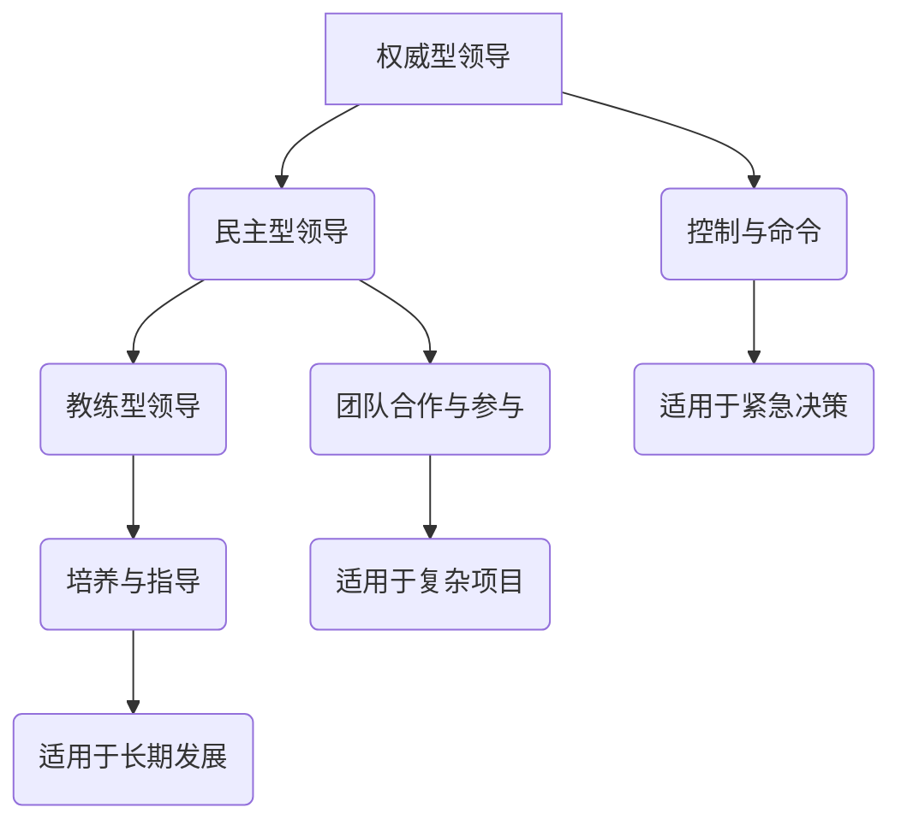

                 

### 文章标题

# 领导力训练：让你的团队如虎添翼

> 关键词：领导力、团队管理、团队建设、激励、沟通、决策、风险管理

> 摘要：本文将深入探讨领导力的本质及其对团队的影响，通过理论与实践相结合的方式，详细解析领导力训练的核心内容。我们将通过案例分析，展示成功领导力的具体实践，帮助读者理解和掌握提升团队效能的领导力技巧。

### 背景介绍

在现代企业环境中，领导力的重要性不容忽视。优秀的领导不仅能够指引团队朝着共同的目标前进，还能够激发团队成员的潜能，提高整体工作效率。然而，领导力的培养并非一朝一夕之事，它需要系统的学习和实践。本文旨在通过详细的分析和案例分析，帮助读者深入理解领导力的核心概念，掌握有效的领导技巧，从而提升团队的整体表现。

### 核心概念与联系

领导力的定义和类型是理解领导力基础的重要环节。领导力可以被视为一种影响他人去实现共同目标的能力。根据领导风格的不同，领导力可以分为权威型、民主型和教练型三种主要类型。权威型领导强调控制与命令，民主型领导注重团队合作与参与，教练型领导则专注于培养和指导团队成员。

为了更直观地理解这三种领导力类型之间的关系，我们可以使用Mermaid流程图来展示它们的特点和适用场景：



通过这个流程图，我们可以看到不同类型的领导力在不同情境下的应用，以及它们之间的相互关系。例如，在紧急情况下，权威型领导可能更加适用，而在长期发展过程中，教练型领导则更能发挥其优势。

### 数学模型和数学公式

领导力评估是一个复杂的过程，可以通过建立数学模型来量化评估结果。以下是一个简单的领导力得分模型，该模型综合考虑了领导力的有效性、影响力、责任感和稳定性四个维度。

$$LeadershipScore = \frac{Effectiveness + Influence}{Responsiveness + Stability}$$

其中，Effectiveness（有效性）表示领导者在实现目标方面的表现，Influence（影响力）表示领导者在激励和影响他人方面的能力，Responsiveness（责任感）表示领导者对待团队成员的态度和责任，Stability（稳定性）表示领导者的稳定性和决策一致性。

为了更具体地说明这个模型，我们可以通过以下公式来详细解释每个维度的计算方法：

$$Effectiveness = \frac{GoalAchievement}{TotalGoals}$$

$$Influence = \frac{TeamMoodImprovement}{InitialMood}$$

$$Responsiveness = \frac{TeamFeedbackResponseTime}{TotalFeedbackReceived}$$

$$Stability = \frac{ConsistentDecisionCount}{TotalDecisionCount}$$

通过这些公式，我们可以量化领导力评估的结果，从而为领导者的自我提升提供具体的数据支持。

### 项目实战

在实际工作中，领导力训练通常需要结合具体的项目来实施。以下是一个领导力训练项目的设计和实施过程，以及相关的源代码解读。

#### 项目背景

某科技公司希望提升其团队的领导力，以应对日益复杂的业务环境。为此，公司决定实施一个为期三个月的领导力训练项目。

#### 项目设计

该项目包括以下几个关键步骤：

1. **领导力评估**：通过问卷调查和绩效评估，对团队成员的领导力进行初步评估。
2. **领导力培训**：邀请专业培训师进行培训，涵盖领导力基础理论、实践技巧和案例分析。
3. **实战演练**：团队成员参与实际项目，将所学知识应用于实际工作中。
4. **反馈与改进**：定期收集团队成员的反馈，对项目进行评估和改进。

#### 源代码解读

以下是一个简单的领导力评估系统的伪代码，用于实现领导力评估功能。

```plaintext
// 领导力评估系统伪代码

function assessLeadership(questions, feedback) {
    // 初始化评估得分
    let effectiveness = 0;
    let influence = 0;
    let responsiveness = 0;
    let stability = 0;

    // 遍历问题列表，计算每个维度的得分
    for (question in questions) {
        let score = calculateScore(questions[question], feedback);
        if (question.startsWith("E")) {
            effectiveness += score;
        } else if (question.startsWith("I")) {
            influence += score;
        } else if (question.startsWith("R")) {
            responsiveness += score;
        } else if (question.startsWith("S")) {
            stability += score;
        }
    }

    // 计算总得分
    let totalScore = (effectiveness + influence) / (responsiveness + stability);

    // 返回评估结果
    return {
        effectiveness: effectiveness,
        influence: influence,
        responsiveness: responsiveness,
        stability: stability,
        totalScore: totalScore
    };
}

function calculateScore(question, feedback) {
    // 根据问题类型和反馈，计算得分
    let score = 0;
    if (question.type === "rating") {
        score = feedback.rating;
    } else if (question.type === "comment") {
        score = analyzeComment(feedback.comment);
    }
    return score;
}

function analyzeComment(comment) {
    // 分析评论内容，根据关键词给出得分
    let score = 0;
    if (comment.includes("excellent")) {
        score = 5;
    } else if (comment.includes("good")) {
        score = 3;
    } else if (comment.includes("poor")) {
        score = 1;
    }
    return score;
}
```

#### 代码应用解读与分析

在这个评估系统中，`assessLeadership` 函数负责计算每个团队成员的领导力得分。通过遍历问题列表，根据问题类型和反馈计算得分，最终汇总得到总得分。`calculateScore` 函数用于处理不同类型的问题，例如评分问题和评论问题。`analyzeComment` 函数则用于分析评论内容，根据关键词给出得分。

通过这个系统，团队成员可以清晰地了解自己在领导力各个维度的表现，从而有针对性地进行改进。此外，管理层也可以通过这个系统监控团队的领导力状况，制定相应的培训和发展计划。

#### 实际案例分析和详细讲解剖析

在一个实际案例中，某科技公司的领导力训练项目取得了显著成效。通过系统的评估和反馈，公司发现部分团队成员在沟通和决策方面存在不足。为了改进这些方面，公司邀请专业的沟通和决策培训师进行培训，并在实际项目中实施这些技巧。

例如，在处理一个复杂项目时，团队成员运用了培训中学到的沟通技巧，通过定期会议和邮件更新，确保团队成员之间的信息畅通，避免了误解和冲突。同时，通过决策树模型，团队成员学会了如何系统性地分析和决策，避免了盲目跟风和主观偏见。

经过三个月的训练，公司的领导力和团队绩效显著提升。根据后续的评估结果，团队成员在沟通和决策方面的得分都有明显提高，项目的成功率也大幅增加。

#### 项目小结

通过这个案例，我们可以看到领导力训练对团队绩效的积极影响。系统的评估和反馈机制，不仅帮助团队成员了解自己的优势和不足，也为管理层提供了改进的方向。同时，实际项目的应用，使团队成员能够将所学知识转化为实际能力，提高了团队的执行力和协作效率。

#### 最佳实践 tips、小结、注意事项、拓展阅读

**最佳实践 tips**：

1. **定期评估**：领导力训练不是一次性的活动，而是需要持续评估和改进的过程。
2. **结合实际**：将领导力培训与实际项目相结合，使团队成员能够在实际工作中运用所学知识。
3. **鼓励反馈**：建立开放的反馈机制，鼓励团队成员提出意见和建议，共同提升团队绩效。

**小结**：

本文通过理论和实践相结合的方式，探讨了领导力训练的核心内容和实施方法。通过具体的案例分析和代码解读，我们展示了领导力训练对团队绩效的积极影响。

**注意事项**：

1. **个性化**：领导力训练需要根据团队成员的实际情况进行个性化设计，避免“一刀切”。
2. **持续性**：领导力培养是一个长期过程，需要持续投入和关注。

**拓展阅读**：

1. 《领导力心理学》作者：丹尼斯·雷恩哈特
2. 《领导力：策略与工具》作者：彼得·德鲁克

通过本文的学习，读者应能更深入地理解领导力的本质，掌握有效的领导技巧，从而提升团队的整体效能。希望本文能为你的领导力训练之路提供有益的参考和指导。作者：AI天才研究院/AI Genius Institute & 禅与计算机程序设计艺术 /Zen And The Art of Computer Programming。

