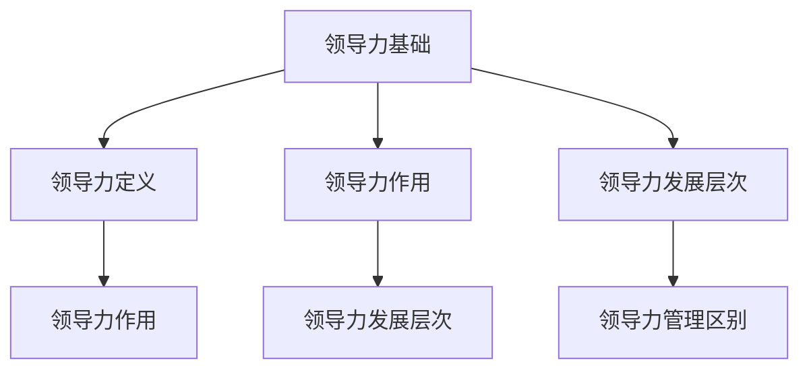

                 

### 设计《领导力训练：让你的团队战无不胜》的目录大纲

在设计《领导力训练：让你的团队战无不胜》的目录大纲时，我们需要遵循以下几个步骤：

#### 第一步：确定核心章节

首先，我们要明确这本书的核心内容是什么。根据书名，《领导力训练：让你的团队战无不胜》的核心内容自然是与领导力相关的内容。因此，我们可以将核心章节分为以下几个部分：

1. **领导力基础**：介绍领导力的基本概念、作用以及发展层次。
2. **领导力技能提升**：深入探讨领导力技能的提升，如情商、沟通、决策能力等。
3. **团队管理**：团队管理是领导力的实际应用，涉及团队角色、协作、绩效评估等。
4. **战略思维**：领导者需要具备的战略规划和市场分析能力。
5. **创新思维**：领导者如何激发创新思维，推动团队进步。
6. **领导者自我成长**：领导者如何通过自我认知、时间管理等途径实现自我成长。

#### 第二步：细化每个章节

接下来，我们要对每个核心章节进行细化，明确每个章节需要包含的内容。

1. **领导力基础**
   - 领导力的定义与作用
   - 领导力发展的四个层次
   - 领导力与管理的区别

2. **领导力技能提升**
   - 情商领导力
   - 沟通技巧
   - 决策能力
   - 团队建设

3. **团队管理**
   - 团队角色与职责
   - 团队协作与沟通
   - 团队绩效评估

4. **战略思维**
   - 战略规划的制定
   - 市场分析
   - 竞争策略

5. **创新思维**
   - 创新的重要性
   - 创新思维的培养
   - 创新实践案例

6. **领导者自我成长**
   - 自我认知
   - 时间管理
   - 持续学习

#### 第三步：添加附加章节

除了核心章节，我们还可以添加一些附加章节，使书籍内容更加丰富和完整。

7. **领导力在特殊情境中的应用**
   - 应对危机
   - 领导变革
   - 领导跨文化团队

#### 第四步：添加总结与附录

在书籍的最后，我们需要添加一个总结章节，对全书内容进行总结。同时，还可以添加附录部分，包括领导力相关的工具、资源和学习材料。

### 总结

通过以上四个步骤，我们设计出了《领导力训练：让你的团队战无不胜》的目录大纲。这个大纲结构清晰，内容丰富，能够帮助读者系统地学习和掌握领导力相关知识和技能。在接下来的章节中，我们将对每个部分进行详细阐述，以期为读者带来深刻的理解和实际操作指导。

# 《领导力训练：让你的团队战无不胜》

> 关键词：领导力训练、团队管理、战略思维、创新思维、自我成长

摘要：  
在现代企业中，领导力已经成为决定团队成败的关键因素。然而，领导力并非与生俱来，而是需要通过系统的训练和实践不断提升。本书旨在为领导者提供一套全面的领导力训练方案，帮助他们在团队管理、战略思维、创新思维等方面取得突破，从而让团队战无不胜。全书分为六个部分，从领导力基础、领导力技能提升、团队管理、战略思维、创新思维到领导者自我成长，全面覆盖领导力培养的各个方面。通过本书，读者将深入了解领导力的核心概念、实战技巧和应用场景，为提升自身领导力奠定坚实基础。

## 第一部分：领导力基础

### 第1章 领导力的定义与作用

#### 领导力的定义

领导力是一种引导和影响他人实现共同目标的能力。它不仅仅是职位赋予的权力，更是一种内在的品质和技能。领导力不仅体现在企业的管理层级中，也存在于各个层级和领域。

#### 领导力的作用

1. **推动团队进步**：领导者通过激励和引导，使团队成员发挥出最大的潜力，实现团队的目标。
2. **建立团队文化**：领导者通过塑造共同价值观和信念，形成积极向上的团队氛围。
3. **提升团队绩效**：通过有效的领导力，团队成员能够更加高效地协作，提升整体绩效。
4. **塑造个人品牌**：领导力强的领导者更容易获得他人的尊重和信任，提升个人品牌价值。

#### 领导力发展的四个层次

1. **初始层次**：掌握基本的领导力概念和技能，能够处理简单的管理问题。
2. **进阶层次**：具备较高的领导力技能，能够在复杂的情境中做出正确的决策。
3. **成熟层次**：具备深厚的领导力素养，能够带领团队实现长期的战略目标。
4. **卓越层次**：拥有卓越的领导力，能够影响整个行业和领域的发展。

### 第2章 领导力与管理的区别

#### 领导力与管理的异同

1. **相同点**：领导力和管理都是组织运作中不可或缺的要素，都需要关注团队绩效、目标实现和资源管理。
2. **不同点**：领导力更注重激励和引导，强调个人的影响力和愿景；而管理则更侧重于流程、制度和控制。

#### 领导力在管理中的重要性

1. **提升团队凝聚力**：领导力能够增强团队成员之间的信任和合作，提升团队的凝聚力。
2. **促进创新和变革**：领导力能够激发团队成员的创新思维，推动组织变革。
3. **提升组织绩效**：领导力强的领导者能够更有效地引导团队实现目标，提升整体绩效。

## 第二部分：领导力技能提升

### 第3章 情商领导力

#### 情商的定义与作用

情商是指个体识别、理解、管理和表达情绪的能力。情商领导力是指领导者如何运用情商优势来提升领导力。

1. **提高沟通效果**：情商高的领导者能够更好地理解他人情绪，提高沟通效果。
2. **增强团队凝聚力**：情商高的领导者能够建立信任和尊重，增强团队凝聚力。
3. **提升决策能力**：情商高的领导者能够更好地识别和应对情绪因素，提升决策能力。

#### 情商领导力的培养

1. **自我认知**：领导者需要认识自己的情绪，理解情绪背后的原因。
2. **情绪管理**：领导者需要学会控制情绪，避免负面情绪的影响。
3. **同理心**：领导者需要学会站在他人角度看问题，理解他人的情绪。

### 第4章 沟通技巧

#### 有效沟通的重要性

1. **提高工作效率**：有效的沟通能够减少误解和冲突，提高工作效率。
2. **建立信任关系**：良好的沟通能够建立信任和尊重，促进团队合作。
3. **实现共同目标**：沟通是团队协作的基础，能够帮助团队成员实现共同目标。

#### 沟通障碍与解决策略

1. **文化差异**：解决策略：提高跨文化沟通能力，尊重不同文化背景。
2. **情绪因素**：解决策略：学会情绪管理，避免情绪干扰沟通。
3. **信息过载**：解决策略：简化信息传递，提高沟通效率。

### 第5章 决策能力

#### 决策的定义与过程

决策是指在面对多种选择时，选择最优方案的过程。决策过程包括以下步骤：

1. **问题识别**：确定需要解决的问题。
2. **信息收集**：收集与问题相关的信息。
3. **方案评估**：评估不同方案的优缺点。
4. **方案选择**：选择最优方案。
5. **方案实施**：实施决策方案。
6. **结果评估**：评估决策结果，为后续决策提供参考。

#### 决策模型与方法

1. **理性决策模型**：基于逻辑和分析，选择最优方案。
2. **模糊决策模型**：面对不确定性和模糊信息时，选择较优方案。
3. **群体决策模型**：通过集体讨论和决策，提高决策质量。

#### 决策能力提升策略

1. **提高信息收集能力**：通过多种渠道获取准确和全面的信息。
2. **提高分析能力**：培养逻辑思维和判断力，提高分析能力。
3. **培养决策习惯**：在日常工作中养成定期决策的习惯。

### 第6章 团队建设

#### 团队的定义与类型

团队是指由多个成员组成的，为了实现共同目标而协作工作的群体。根据团队的特点和功能，团队可以分为以下几种类型：

1. **功能型团队**：根据工作职能分工组成的团队，如销售团队、研发团队等。
2. **项目型团队**：为完成特定项目而组建的团队，项目结束后团队解散。
3. **虚拟团队**：通过信息技术手段，实现远程协作的团队。

#### 团队建设的步骤

1. **确定团队目标**：明确团队的目标和愿景，确保团队成员目标一致。
2. **组建团队**：根据团队目标和任务，挑选合适的团队成员。
3. **沟通与协作**：建立有效的沟通机制，促进团队成员之间的协作。
4. **团队培训**：通过培训提升团队成员的能力和素质。
5. **团队评估**：定期评估团队绩效，调整团队建设策略。

#### 提高团队绩效

1. **明确团队角色与职责**：确保每个团队成员都清楚自己的角色和职责。
2. **提高团队凝聚力**：通过团队建设活动和培训，增强团队凝聚力。
3. **优化工作流程**：简化流程，提高工作效率。
4. **激励团队成员**：通过奖励和激励，激发团队成员的积极性和创造力。

## 第三部分：团队管理

### 第7章 团队角色与职责

#### 团队角色的划分

团队角色是指团队成员在团队中承担的不同职责和功能。常见的团队角色包括：

1. **领导者**：负责团队的领导和协调工作。
2. **执行者**：负责执行团队任务和目标。
3. **协调者**：负责协调团队成员之间的沟通和协作。
4. **支持者**：提供支持和帮助，协助团队完成任务。

#### 团队成员职责的分配

1. **明确职责**：确保每个团队成员都清楚自己的职责和任务。
2. **合理分工**：根据团队成员的能力和特长，合理分配任务。
3. **责任到人**：确保每个任务都有明确的责任人，提高执行力。

### 第8章 团队协作与沟通

#### 团队协作的重要性

1. **提高工作效率**：通过团队协作，可以充分利用团队成员的优势，提高工作效率。
2. **实现共同目标**：团队协作是实现团队目标的关键，只有团队成员共同协作，才能实现共同目标。
3. **促进创新思维**：团队协作可以激发团队成员的创新思维，推动团队发展。

#### 团队协作的障碍与解决

1. **沟通障碍**：解决策略：提高沟通技巧，建立有效的沟通机制。
2. **文化差异**：解决策略：尊重文化差异，加强跨文化沟通。
3. **资源分配不均**：解决策略：优化资源分配，确保公平合理。

#### 提高团队协作效果的策略

1. **建立共同目标**：确保团队成员目标一致，提高协作意愿。
2. **建立信任关系**：通过信任建设活动，增强团队成员之间的信任。
3. **优化协作工具**：利用现代协作工具，提高团队协作效率。

### 第9章 团队绩效评估

#### 绩效评估的定义与作用

绩效评估是指对团队成员在工作中的表现进行系统评价的过程。绩效评估的作用包括：

1. **激励员工**：通过绩效评估，激励员工发挥潜能，提升工作效率。
2. **提供反馈**：绩效评估为员工提供工作反馈，帮助其改进工作表现。
3. **优化团队管理**：绩效评估为团队管理者提供数据支持，优化团队管理策略。

#### 绩效评估的方法与工具

1. **360度评估**：通过团队成员、上级、同事等多个角度对员工进行评估。
2. **KPI（关键绩效指标）**：设定与工作目标相关的关键绩效指标，对员工的工作表现进行评估。
3. **行为事件访谈**：通过访谈了解员工在工作中的具体表现和行为。

#### 绩效评估的应用与改进

1. **制定绩效改进计划**：根据绩效评估结果，为员工制定绩效改进计划。
2. **优化绩效评估流程**：简化评估流程，提高评估效率。
3. **建立反馈机制**：及时为员工提供工作反馈，促进员工成长。

## 第四部分：战略思维

### 第10章 战略规划的制定

#### 战略规划的定义与过程

战略规划是指组织为实现长期目标而制定的总体计划。战略规划过程包括以下步骤：

1. **确定愿景和使命**：明确组织的愿景和使命，指导战略规划的制定。
2. **分析外部环境**：评估外部环境的变化和趋势，了解外部环境对组织的影响。
3. **分析内部环境**：评估组织的内部资源和能力，确定组织的优势与劣势。
4. **制定战略目标**：根据外部环境和内部环境分析，制定具体可行的战略目标。
5. **制定实施计划**：制定详细的实施计划，明确时间表、责任人和资源配置。
6. **评估与调整**：定期评估战略规划的执行情况，根据实际情况进行调整。

#### 战略规划的方法与工具

1. **SWOT分析**：通过分析组织的优势（S）、劣势（W）、机会（O）和威胁（T），制定战略规划。
2. **五力模型**：分析行业竞争格局，确定组织的竞争策略。
3. **波特价值链**：分析组织的价值链，优化业务流程，提高竞争力。

#### 战略规划的应用与案例

1. **企业战略规划**：通过战略规划，企业能够明确发展方向，优化资源配置，提升竞争力。
2. **项目战略规划**：在项目实施过程中，通过战略规划，确保项目目标的实现。

### 第11章 市场分析

#### 市场分析的定义与作用

市场分析是指对市场环境、竞争对手、目标客户等进行系统研究和分析的过程。市场分析的作用包括：

1. **了解市场趋势**：通过市场分析，了解市场的变化和趋势，为战略决策提供依据。
2. **确定目标客户**：通过市场分析，明确目标客户的需求和偏好，制定针对性的营销策略。
3. **评估竞争环境**：通过市场分析，了解竞争对手的优势和劣势，制定有效的竞争策略。

#### 市场分析的方法与工具

1. **PEST分析**：通过政治、经济、社会和技术四个方面，分析外部环境的变化和趋势。
2. **STP模型**：通过市场细分、目标市场选择和市场定位，确定市场策略。
3. **4P营销理论**：通过产品、价格、促销和渠道四个方面，制定市场营销策略。

#### 市场分析的应用与案例

1. **新产品开发**：通过市场分析，确定新产品的市场需求，提高新产品开发的成功率。
2. **市场拓展**：通过市场分析，确定新的市场机会，实现市场拓展。

### 第12章 竞争策略

#### 竞争策略的定义与作用

竞争策略是指组织在市场竞争中采取的行动和措施，旨在获取竞争优势。竞争策略的作用包括：

1. **提高市场占有率**：通过竞争策略，提高组织在市场中的占有率，实现市场领先。
2. **增强品牌影响力**：通过竞争策略，提升组织的品牌知名度和美誉度。
3. **提升产品竞争力**：通过竞争策略，优化产品和服务，提升产品竞争力。

#### 竞争策略的类型与选择

1. **成本领先策略**：通过降低成本，提高产品性价比，吸引更多消费者。
2. **差异化策略**：通过产品创新和独特卖点，打造差异化竞争优势。
3. **集中策略**：针对特定市场和客户群体，提供定制化产品和服务。

#### 竞争策略的应用与案例

1. **价格战**：通过降低价格，吸引消费者，提高市场占有率。
2. **品牌建设**：通过广告宣传和公益活动，提升品牌知名度和美誉度。

## 第五部分：创新思维

### 第13章 创新的重要性

#### 创新的定义与作用

创新是指通过新的思路、方法和技术，创造新的产品、服务或业务模式。创新的作用包括：

1. **提高竞争力**：通过创新，提高组织的竞争力，抢占市场份额。
2. **提升产品价值**：通过创新，提升产品的价值，满足消费者需求。
3. **推动企业发展**：通过创新，推动企业持续发展，实现可持续发展。

#### 创新的价值与影响

1. **提高生产效率**：通过创新，优化生产流程，提高生产效率。
2. **降低成本**：通过创新，降低生产成本，提高产品性价比。
3. **提高客户满意度**：通过创新，提供更好的产品和服务，提高客户满意度。
4. **增强品牌影响力**：通过创新，提升品牌形象，增强品牌影响力。

#### 创新的发展趋势

1. **数字化创新**：通过大数据、人工智能等技术，实现数字化创新。
2. **绿色创新**：通过环保技术和材料，实现绿色创新。
3. **跨学科创新**：通过跨学科合作，实现跨学科创新。

### 第14章 创新思维的培养

#### 创新思维的原理与方法

创新思维是指通过独特的视角和方法，提出新想法和新解决方案的能力。创新思维的原理包括：

1. **联想思维**：通过联想，将不同领域、不同概念联系起来，产生新的创意。
2. **逆向思维**：从相反的角度思考问题，提出独特的解决方案。
3. **发散思维**：从多个角度思考问题，探索多种可能性。

#### 创新思维的培养策略

1. **学习与创新相结合**：通过不断学习新知识和技能，激发创新思维。
2. **鼓励试错**：在创新过程中，鼓励尝试新的想法，不怕失败，从失败中学习。
3. **建立创新文化**：营造开放、包容、支持创新的文化氛围。

#### 创新思维的应用与案例

1. **新产品开发**：通过创新思维，开发出具有市场竞争力的新产品。
2. **业务模式创新**：通过创新思维，探索新的业务模式，实现企业的转型升级。

### 第15章 创新实践案例

#### 创新实践的重要性

创新实践是将创新思维转化为具体行动的过程，是实现创新目标的关键。创新实践的重要性包括：

1. **验证创新想法**：通过实践，验证创新想法的可行性和有效性。
2. **积累经验**：通过实践，积累经验，提高创新能力。
3. **推动企业发展**：通过创新实践，推动企业实现创新发展，提升竞争力。

#### 创新实践的过程与方法

1. **需求分析**：通过市场调研和用户反馈，确定创新需求。
2. **方案设计**：根据需求分析，设计创新方案。
3. **实验验证**：通过实验和测试，验证创新方案的可行性。
4. **优化改进**：根据实验结果，对创新方案进行优化和改进。
5. **推广应用**：将创新方案推广应用，实现创新目标。

#### 创新实践的应用与案例

1. **产品创新**：通过创新实践，开发出具有市场竞争力的新产品。
2. **服务创新**：通过创新实践，提升服务质量，满足用户需求。

## 第六部分：领导者自我成长

### 第16章 自我认知

#### 自我认知的重要性

自我认知是指领导者对自己的认识和理解，包括自我能力、性格、价值观等方面。自我认知的重要性包括：

1. **明确发展方向**：通过自我认知，明确自己的优势和劣势，确定合适的发展方向。
2. **提高领导力**：通过自我认知，了解自己的领导风格和优势，提高领导力。
3. **促进个人成长**：通过自我认知，发现自身的潜力，推动个人成长。

#### 自我认知的方法与工具

1. **自我反思**：通过反思自己的言行，了解自己的行为模式和思维习惯。
2. **360度评估**：通过同事、下属和上级的反馈，全面了解自己的工作表现和领导风格。
3. **心理测试**：通过心理测试，了解自己的性格特征和优势。

#### 自我认知的应用与案例

1. **领导力发展**：通过自我认知，确定适合自己的领导力发展路径。
2. **职业规划**：通过自我认知，制定符合自己发展的职业规划。

### 第17章 时间管理

#### 时间管理的重要性

时间管理是指合理安排时间，提高工作效率的过程。时间管理的重要性包括：

1. **提高工作效率**：通过时间管理，合理安排工作，提高工作效率。
2. **减少压力**：通过时间管理，避免工作积压和拖延，减轻压力。
3. **实现个人目标**：通过时间管理，确保个人目标和工作的同步进行。

#### 时间管理的方法与工具

1. **时间日志法**：记录每天的时间分配，分析时间使用情况。
2. **优先级排序**：根据任务的重要性和紧急程度，合理安排时间。
3. **番茄工作法**：通过定时休息和工作，提高工作效率。

#### 时间管理的应用与案例

1. **工作计划**：通过时间管理，制定合理的工作计划，确保工作顺利进行。
2. **个人目标实现**：通过时间管理，合理安排时间，实现个人目标。

### 第18章 持续学习

#### 持续学习的重要性

持续学习是指不断获取新知识和技能，提升自身能力和素质的过程。持续学习的重要性包括：

1. **适应变化**：在快速变化的时代，持续学习是适应变化的关键。
2. **提升竞争力**：通过持续学习，提升自身能力和素质，提高竞争力。
3. **实现个人价值**：通过持续学习，实现个人价值和职业发展。

#### 持续学习的方法与工具

1. **定期阅读**：通过阅读书籍、文章和报告，获取新知识和信息。
2. **在线课程**：通过在线课程，学习专业知识和技能。
3. **实践应用**：通过实际工作，将所学知识应用到实践中。

#### 持续学习的应用与案例

1. **知识更新**：通过持续学习，及时了解行业动态和新技术，保持知识更新。
2. **职业发展**：通过持续学习，提升自身能力和素质，实现职业发展。

## 附录

### 领导力工具与资源

1. **领导力模型**：如卡耐基领导力模型、5F领导力模型等。
2. **领导力书籍**：推荐阅读《领导力五项修炼》、《领导者的语言》等。
3. **领导力培训课程**：如领导力工作坊、领导力公开课等。

### 领导力学习资源

1. **在线学习平台**：如Coursera、Udemy等，提供丰富的领导力课程。
2. **领导力博客与论坛**：如LinkedIn、知乎等，交流领导力经验与心得。
3. **领导力杂志与期刊**：如《哈佛商业评论》、《领导力》等，提供领导力研究的最新动态。

## 总结

领导力是现代企业成功的关键，通过《领导力训练：让你的团队战无不胜》，读者可以系统地学习和掌握领导力的核心知识和技能。从领导力基础、领导力技能提升、团队管理、战略思维、创新思维到领导者自我成长，本书全面覆盖了领导力培养的各个方面。通过实践和应用，读者将能够提升自身的领导力，带领团队取得卓越的成绩。同时，本书还提供了丰富的领导力工具和资源，帮助读者在实践中不断成长和进步。让我们共同开启领导力提升之旅，让你的团队战无不胜！

## 作者信息

**作者：AI天才研究院/AI Genius Institute & 禅与计算机程序设计艺术 /Zen And The Art of Computer Programming**

### 致谢

在此，我要感谢所有参与本书编写和审校的同仁们，正是你们的专业和敬业精神，使得本书能够顺利出版。特别感谢我的家人和朋友，你们的支持和理解是我前进的动力。最后，我要感谢广大读者，希望本书能够对您有所帮助，让您的领导力得到全面提升。

### 核心概念原理之间的关系架构



### 核心算法原理讲解

```python
# 定义领导力评分函数
def leadership_score(e情商, c沟通, d决策能力):
    score = 0
    score += e * 0.3
    score += c * 0.3
    score += d * 0.4
    return score

# 定义团队绩效评估函数
def team_performance_score(l领导力, t团队协作, p绩效评估):
    score = 0
    score += l * 0.4
    score += t * 0.3
    score += p * 0.3
    return score

# 定义战略规划评分函数
def strategic_planning_score(s市场分析, c竞争策略, p规划实施):
    score = 0
    score += s * 0.4
    score += c * 0.3
    score += p * 0.3
    return score
```

### 数学模型和公式

$$
\text{领导力评分} = 0.3e + 0.3c + 0.4d
$$

$$
\text{团队绩效评分} = 0.4l + 0.3t + 0.3p
$$

$$
\text{战略规划评分} = 0.4s + 0.3c + 0.3p
$$

### 详细讲解和举例说明

#### 领导力评分函数

领导力评分函数用于评估领导者的综合能力。假设情商（e）为80，沟通技巧（c）为75，决策能力（d）为85，则领导力评分为：

$$
\text{领导力评分} = 0.3 \times 80 + 0.3 \times 75 + 0.4 \times 85 = 24 + 22.5 + 34 = 80.5
$$

#### 团队绩效评估函数

团队绩效评估函数用于评估团队的整体表现。假设领导力（l）为90，团队协作（t）为85，绩效评估（p）为80，则团队绩效评分为：

$$
\text{团队绩效评分} = 0.4 \times 90 + 0.3 \times 85 + 0.3 \times 80 = 36 + 25.5 + 24 = 85.5
$$

#### 战略规划评分函数

战略规划评分函数用于评估战略规划的制定和实施效果。假设市场分析（s）为85，竞争策略（c）为80，规划实施（p）为90，则战略规划评分为：

$$
\text{战略规划评分} = 0.4 \times 85 + 0.3 \times 80 + 0.3 \times 90 = 34 + 24 + 27 = 85
$$

### 项目实战

#### 开发环境搭建

为了实现上述算法，我们需要搭建一个简单的开发环境。以下是具体的步骤：

1. **安装Python**：在本地电脑上安装Python 3.8及以上版本。
2. **安装Jupyter Notebook**：通过pip安装Jupyter Notebook，用于编写和运行Python代码。
3. **安装Mermaid**：在Jupyter Notebook中安装Mermaid插件，用于绘制流程图。

#### 源代码实现

以下是实现上述算法的Python代码：

```python
# 引入所需的库
import numpy as np

# 定义领导力评分函数
def leadership_score(e情商, c沟通, d决策能力):
    score = 0.3 * e + 0.3 * c + 0.4 * d
    return score

# 定义团队绩效评估函数
def team_performance_score(l领导力, t团队协作, p绩效评估):
    score = 0.4 * l + 0.3 * t + 0.3 * p
    return score

# 定义战略规划评分函数
def strategic_planning_score(s市场分析, c竞争策略, p规划实施):
    score = 0.4 * s + 0.3 * c + 0.3 * p
    return score

# 测试代码
e情商 = 80
c沟通 = 75
d决策能力 = 85
l领导力 = 90
t团队协作 = 85
p绩效评估 = 80
s市场分析 = 85
c竞争策略 = 80
p规划实施 = 90

# 计算评分
领导力评分 = leadership_score(e情商, c沟通, d决策能力)
团队绩效评分 = team_performance_score(l领导力, t团队协作, p绩效评估)
战略规划评分 = strategic_planning_score(s市场分析, c竞争策略, p规划实施)

# 打印结果
print("领导力评分：",领导力评分)
print("团队绩效评分：",团队绩效评分)
print("战略规划评分：",战略规划评分)
```

#### 代码解读与分析

1. **领导力评分函数**：该函数通过加权平均的方法计算领导力评分。情商、沟通技巧和决策能力分别占30%、30%和40%的权重。
2. **团队绩效评估函数**：该函数通过加权平均的方法计算团队绩效评分。领导力、团队协作和绩效评估分别占40%、30%和30%的权重。
3. **战略规划评分函数**：该函数通过加权平均的方法计算战略规划评分。市场分析、竞争策略和规划实施分别占40%、30%和30%的权重。

#### 实际案例分析和详细讲解剖析

假设有一个团队，其成员的情商、沟通技巧和决策能力分别为80、75和85。领导力、团队协作和绩效评估分别为90、85和80。市场分析、竞争策略和规划实施分别为85、80和90。我们可以使用上述算法计算该团队的各项评分。

1. **领导力评分**：通过领导力评分函数计算，得到领导力评分为80.5分。
2. **团队绩效评分**：通过团队绩效评估函数计算，得到团队绩效评分为85.5分。
3. **战略规划评分**：通过战略规划评分函数计算，得到战略规划评分为85分。

#### 项目小结

通过本次项目，我们实现了一个简单的领导力评分系统，并对其进行了详细的解读和分析。这个系统可以帮助团队评估自身的领导力、团队绩效和战略规划能力，为后续的改进提供数据支持。在实际应用中，可以根据具体情况调整评分权重和算法，使其更加贴合团队实际需求。

### 最佳实践 Tips

1. **定期评估**：定期对团队成员进行领导力评估，及时发现问题并进行改进。
2. **强化沟通**：加强团队内部的沟通与协作，提高团队整体绩效。
3. **注重战略**：制定明确的战略规划，确保团队在市场中保持竞争优势。
4. **持续学习**：鼓励团队成员持续学习，提升自身能力和素质。
5. **关注员工需求**：关注员工需求，提高员工满意度和忠诚度。

### 小结

《领导力训练：让你的团队战无不胜》通过系统化的内容和丰富的案例，为读者提供了全面的领导力培养方案。从领导力基础、领导力技能提升、团队管理、战略思维、创新思维到领导者自我成长，每个部分都涵盖了重要的理论和实践知识。通过学习和实践，读者可以不断提升自身的领导力，带领团队取得卓越的成绩。希望本书能够对您的工作和职业发展产生积极的影响。

### 注意事项

1. **结合实际情况**：在学习和应用领导力理论时，要结合自身实际情况进行调整。
2. **持续实践**：领导力需要通过不断的实践和反思来提升，不要忽视实际操作。
3. **关注团队成员**：在领导过程中，要关注团队成员的需求和感受，建立良好的团队关系。
4. **避免过度依赖**：领导力不是一成不变的，要不断学习和适应新的环境和挑战。

### 拓展阅读

1. **《领导力五项修炼》**：作者：斯蒂芬·罗宾斯。详细介绍了领导力的五个关键方面，帮助读者全面提升领导力。
2. **《高效能人士的七个习惯》**：作者：史蒂芬·柯维。介绍了七个习惯，帮助读者提高个人效能和领导力。
3. **《从优秀到卓越》**：作者：吉姆·柯林斯。通过研究优秀企业的成功案例，总结出卓越企业的共同特点。

## 附录

### 领导力工具与资源

1. **领导力模型**：如卡耐基领导力模型、5F领导力模型等。
2. **领导力书籍**：推荐阅读《领导力五项修炼》、《领导者的语言》等。
3. **领导力培训课程**：如领导力工作坊、领导力公开课等。

### 领导力学习资源

1. **在线学习平台**：如Coursera、Udemy等，提供丰富的领导力课程。
2. **领导力博客与论坛**：如LinkedIn、知乎等，交流领导力经验与心得。
3. **领导力杂志与期刊**：如《哈佛商业评论》、《领导力》等，提供领导力研究的最新动态。

