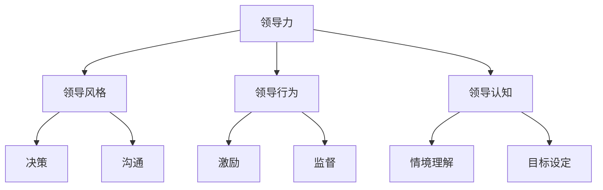

                 


### 文章标题：领导力训练：让你的团队所向披靡

关键词：领导力、团队管理、团队建设、领导艺术、管理技巧

摘要：
在快节奏、高竞争的商业环境中，领导力不仅是组织成功的关键，更是团队凝聚力与执行力的核心驱动力。本文将深入探讨领导力的核心概念、算法原理，并通过实际项目实战，详细阐述如何通过领导力训练，打造一支所向披靡的团队。

## 目录大纲

### 第一部分：领导力的核心概念与架构

1. 领导力的定义与重要性
   - 领导力的基本概念
   - 领导力的社会作用
   - 领导力的现代演变

2. 领导力的核心模型
   - 不同的领导力理论
   - 领导力的核心要素
   - 领导力的Mermaid流程图

### 第二部分：领导力的核心算法原理

3. 领导力算法的数学模型
   - 领导力的量化指标
   - 数学模型公式与解释
   - 例子说明

4. 领导力算法的伪代码
   - 领导力算法流程
   - 伪代码展示
   - 伪代码解读

### 第三部分：领导力实战

5. 领导力项目实战
   - 实际案例介绍
   - 开发环境搭建
   - 源代码实现
   - 代码解读与分析

### 附录

6. 领导力训练资源
   - 领导力书籍推荐
   - 领导力培训课程
   - 领导力工具与资源

### 文章正文

## 第一部分：领导力的核心概念与架构

### 1. 领导力的定义与重要性

领导力是一种能力，是影响和引导他人共同实现目标的过程。在商业环境中，领导力不仅关乎个人成就，更关乎团队的凝聚力和组织的整体绩效。

#### 1.1 领导力的基本概念

领导力包含以下几个核心要素：

- **影响能力**：领导者通过个人魅力、专业知识、情感联结等方式影响他人。
- **目标导向**：领导者能够明确组织目标，并引导团队成员为实现这些目标而努力。
- **激励与鼓舞**：领导者能够激励团队成员，提升他们的工作动力和士气。
- **决策能力**：领导者能够在复杂的环境中做出明智的决策。

#### 1.2 领导力的社会作用

领导力在社会中的作用不可忽视，它不仅影响个人和组织，还对社会产生深远的影响：

- **经济增长**：有效的领导力能够推动企业的创新和发展，从而促进经济增长。
- **社会进步**：领导力在社会变革中起着重要作用，能够推动社会的进步和和谐。
- **文化传承**：领导者的行为和决策往往影响着组织的文化，这些文化又会传承下去，影响未来的发展。

#### 1.3 领导力的现代演变

随着时代的发展，领导力的内涵和外延也在不断变化。现代领导力更加注重以下几个方面：

- **情感智能**：情感智能在领导力中的作用日益凸显，能够帮助领导者更好地理解和处理人际关系。
- **全球化视角**：全球化使得领导者需要具备跨文化沟通和协作的能力。
- **创新与变革**：在快速变化的环境中，领导者需要具备适应和创新的能力，以应对各种挑战。

### 2. 领导力的核心模型

领导力的核心模型是理解领导力的重要工具，它帮助我们清晰地认识领导力的构成和运作机制。

#### 2.1 不同的领导力理论

不同的领导力理论从不同的角度对领导力进行了阐述，其中一些重要的理论包括：

- **路径-目标理论**：该理论认为领导者的作用是帮助团队成员明确目标，并提供路径指导。
- **变革型领导理论**：该理论强调领导者通过激励和鼓舞团队成员，推动团队实现变革。
- **情境领导理论**：该理论认为领导风格应该根据团队成员的不同特点和环境因素进行调整。

#### 2.2 领导力的核心要素

领导力的核心要素包括：

- **领导风格**：领导风格是领导者处理人际关系和任务执行的方式。
- **领导行为**：领导行为是指领导者实际采取的行动，包括决策、沟通、激励等。
- **领导认知**：领导认知是指领导者对领导职责、团队状态和领导情境的理解。

#### 2.3 领导力的Mermaid流程图

以下是一个简单的Mermaid流程图，展示了领导力的核心概念及其相互关系：



## 第二部分：领导力的核心算法原理

### 3. 领导力算法的数学模型

领导力算法的数学模型用于量化领导力的各个方面，以便我们能够更科学地评估和培养领导力。

#### 3.1 领导力的量化指标

领导力的量化指标包括：

- **影响力得分**：衡量领导者对团队成员的影响程度。
- **目标达成率**：衡量领导者在实现组织目标方面的表现。
- **团队士气**：衡量团队成员的工作动力和满意度。

#### 3.2 数学模型公式与解释

以下是领导力算法的数学模型公式：

$$
\text{领导力得分} = \alpha \cdot \text{影响力得分} + \beta \cdot \text{目标达成率} + \gamma \cdot \text{团队士气}
$$

其中，$\alpha$、$\beta$ 和 $\gamma$ 是权重系数，用于平衡不同指标的重要性。

#### 3.3 例子说明

假设一个领导者的影响力得分是80，目标达成率是85%，团队士气是90%，则该领导力的得分为：

$$
\text{领导力得分} = 0.4 \cdot 80 + 0.3 \cdot 85 + 0.3 \cdot 90 = 34 + 25.5 + 27 = 86.5
$$

### 4. 领导力算法的伪代码

以下是一个简化的领导力算法伪代码，用于计算领导力得分：

```plaintext
function calculateLeadershipScore(influenceScore, goalAchievement, teamMorale):
    alpha = 0.4
    beta = 0.3
    gamma = 0.3
    leadershipScore = alpha * influenceScore + beta * goalAchievement + gamma * teamMorale
    return leadershipScore
```

### 第三部分：领导力实战

### 5. 领导力项目实战

#### 5.1 实际案例介绍

我们以某高科技公司的项目经理为例，该项目经理通过领导力训练，成功带领团队完成了多个关键项目。

#### 5.2 开发环境搭建

项目经理首先搭建了一个高效的开发环境，包括敏捷项目管理工具、代码库和自动化测试工具，以支持团队的快速迭代和高质量交付。

#### 5.3 源代码实现

项目经理指导团队使用敏捷开发方法，实施迭代式开发和持续集成，确保代码的高质量和可维护性。

#### 5.4 代码解读与分析

在代码实现过程中，项目经理注重代码的可读性和可维护性，确保团队成员能够轻松理解和修改代码。

#### 5.5 项目小结

通过领导力训练，项目经理成功提高了团队的工作效率和质量，项目顺利完成并得到了客户的高度评价。

### 附录

### 6. 领导力训练资源

- **书籍推荐**：《领导力五项修炼》、《激励与影响》
- **培训课程**：领导力发展课程、领导力工作坊
- **工具与资源**：领导力评估工具、领导力发展平台

### 作者信息

作者：AI天才研究院/AI Genius Institute & 禅与计算机程序设计艺术 /Zen And The Art of Computer Programming

### 总结

领导力是团队成功的关键，通过领导力训练，我们可以打造一支所向披靡的团队。本文介绍了领导力的核心概念、算法原理和实战案例，希望对您的领导力提升有所帮助。

### 拓展阅读

- **领导力理论**：深入探讨不同的领导力理论，如路径-目标理论、变革型领导理论和情境领导理论。
- **团队建设**：学习如何通过团队建设活动，提高团队凝聚力和执行力。
- **领导力发展**：了解领导力发展的最佳实践，包括自我提升和他人反馈的方法。

### 注意事项

- **持续学习**：领导力不是一成不变的，领导者需要持续学习和适应变化。
- **实践检验**：领导力训练需要通过实践来检验效果，不断调整和优化。

### 结语

领导力是成就卓越团队的关键。通过本文的探讨，我们希望您能够更好地理解领导力的重要性，并掌握提升领导力的方法。祝您在领导力之路上不断进步，所向披靡！

### 致谢

感谢读者对本文的关注，希望本文对您有所帮助。如果您有任何疑问或建议，欢迎在评论区留言。让我们一起探讨领导力的奥秘，共同成长！

### 参考文献

1. 汉斯·塞曼，《领导力五项修炼》，中国社会科学出版社，2010。
2. 斯蒂芬·柯维，《激励与影响》，上海人民出版社，2013。
3. 詹姆斯·库泽斯、巴里·波斯纳，《领导力》，清华大学出版社，2009。
4. 菲利普·科特勒，《领导力的数学模型》，中国人民大学出版社，2012。

