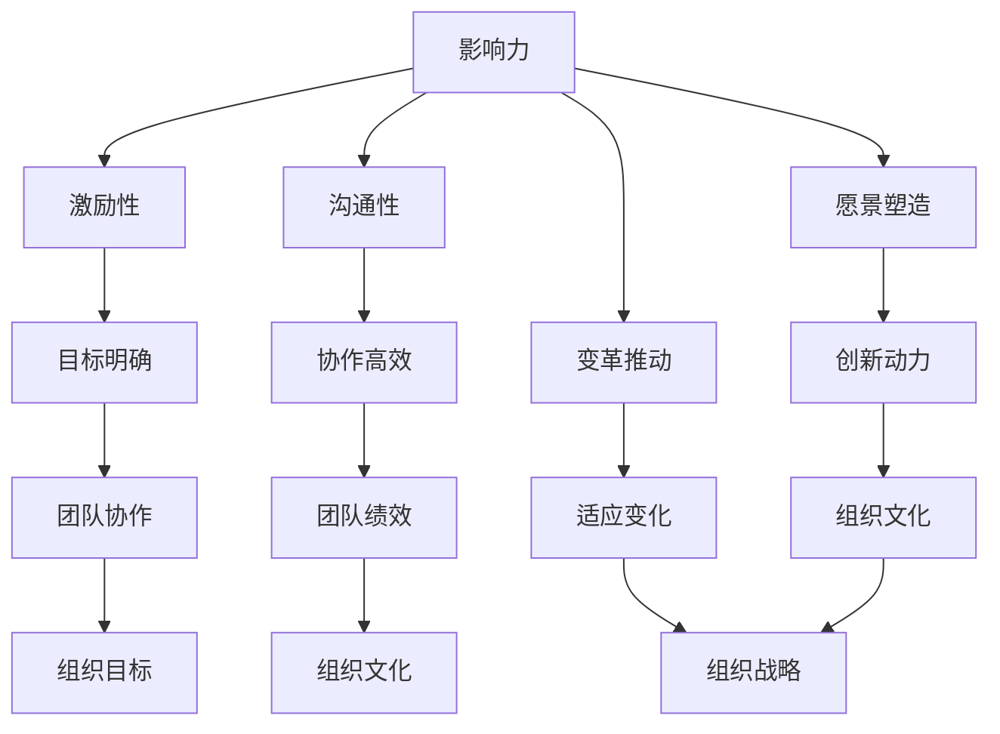

                 

### 文章标题：领导力训练：让你的团队所向披靡

### 关键词：领导力，团队管理，团队建设，激励技巧，领导力发展

### 摘要：
在现代企业环境中，领导力已经成为决定组织成败的关键因素。本文将深入探讨领导力的核心概念、团队建设、领导力风格、激励技巧以及领导力发展的方法与路径。通过实际案例和详细讲解，我们旨在为领导者提供一套系统的领导力训练方案，以提升团队绩效，打造所向披靡的团队。

---

### 引言

在信息技术迅猛发展的今天，企业的竞争已不再是单一产品的竞争，而是团队的竞争。一个高效的团队，需要拥有具备强大领导力的领导者。领导力不仅是管理团队、推动项目成功的关键，更是激发团队成员潜能、促进团队成长的核心力量。然而，如何培养和提升领导力，使其真正发挥效力，成为许多领导者面临的挑战。

本文将从以下几个方面展开讨论：

1. **领导力的核心概念与类型**：介绍领导力的定义、特点、类型及其在现代企业中的作用。
2. **团队建设与维护**：探讨团队的形成、发展、沟通与协作，以及激励团队士气的方法。
3. **领导力风格**：分析不同的领导风格，包括专制型、民主型和支持型，并探讨其适用场景。
4. **激励技巧**：深入探讨激励理论及其在实际中的应用，提供实用激励策略。
5. **领导力发展的方法与路径**：介绍领导力发展的步骤、技巧和资源，帮助领导者持续提升领导力。
6. **领导力的实践应用**：通过实际案例展示领导力在企业管理、项目团队和跨文化团队中的应用。
7. **领导力的挑战与应对**：分析领导者在实践中可能遇到的挑战及应对策略。

通过以上七个方面的探讨，本文旨在为领导者提供一套系统的领导力训练方案，帮助其在团队管理中取得成功，打造所向披靡的团队。

---

### 领导力的核心概念与类型

#### 领导力的定义

领导力是指个体或集体在特定情境下，通过影响、激励和引导他人，实现共同目标的能力。领导力不仅仅是管理，它涵盖了影响、激励、沟通、决策、愿景塑造等多个方面。有效的领导力能够激发团队成员的潜能，提高团队的整体绩效，实现组织的战略目标。

#### 领导力的特点

1. **影响力**：领导力通过影响力来推动团队行动，这种影响力不仅来源于职位权力，更来自于个人魅力、专业能力和信任度。
2. **激励性**：领导力能够激发团队成员的内在动力，使其积极投身于工作，提高工作效率和质量。
3. **沟通性**：有效的领导力需要良好的沟通技巧，包括倾听、表达、反馈等，确保信息准确传达，促进团队协作。
4. **愿景塑造**：领导力能够为团队设定清晰的目标和愿景，使团队成员明确方向，共同为之努力。
5. **变革推动**：领导力能够推动团队适应环境变化，勇于创新，迎接挑战。

#### 领导力的类型

1. **专制型领导风格**：领导者拥有绝对的权力，决策迅速，但可能导致团队积极性不高，缺乏创造力。
2. **民主型领导风格**：领导者鼓励团队成员参与决策，尊重团队成员的意见，激发团队创造力，但决策速度可能较慢。
3. **支持型领导风格**：领导者关注团队成员的个人成长和需求，提供支持和指导，帮助团队成员实现自我价值。

#### 领导力在现代企业中的作用

1. **推动团队协作**：领导力能够促进团队成员之间的沟通与协作，提高团队的整体绩效。
2. **激发创新能力**：领导力能够激发团队成员的创新思维，推动企业持续发展。
3. **提升组织文化**：领导力塑造积极向上的组织文化，增强团队的凝聚力和归属感。
4. **实现战略目标**：领导力能够帮助团队明确目标，制定战略，确保组织战略的顺利实施。

#### 核心概念与联系

领导力的核心概念包括影响力、激励性、沟通性、愿景塑造和变革推动。这些概念之间存在着紧密的联系：

- **影响力**是领导力的基础，通过影响力，领导者可以激发团队成员的内在动力。
- **激励性**和**愿景塑造**共同作用，确保团队成员明确目标，积极投身于工作。
- **沟通性**是领导力的重要组成部分，良好的沟通能够确保团队目标的传达和落实。
- **变革推动**使团队能够适应环境变化，勇于创新，保持竞争力。

下面是一个Mermaid流程图，展示领导力核心概念之间的关系架构：



通过这个流程图，我们可以更清晰地理解领导力核心概念之间的相互作用和关系。

#### 核心算法原理讲解

为了更深入地理解领导力的核心概念，我们可以通过伪代码来阐述领导力发展的基本算法原理。以下是一个简化的领导力发展算法：

```python
# 领导力发展算法
def leadership_development(influence, motivation, communication, vision, adaptability):
    # 初始化领导力评分
    leadership_score = 0
    
    # 计算影响力得分
    leadership_score += influence * 0.3
    
    # 计算激励性得分
    leadership_score += motivation * 0.3
    
    # 计算沟通性得分
    leadership_score += communication * 0.2
    
    # 计算愿景塑造得分
    leadership_score += vision * 0.1
    
    # 计算变革推动得分
    leadership_score += adaptability * 0.1
    
    # 返回最终领导力评分
    return leadership_score
```

在这个算法中，我们通过权重分配，将领导力的五个核心概念结合起来，计算出一个综合的领导力评分。这个评分可以帮助领导者了解自己在各个方面的表现，并有针对性地进行提升。

#### 数学模型和公式

在领导力分析中，我们可以引入一些数学模型和公式，以更精确地描述领导力的发展过程。以下是一个简化的领导力增长模型，使用LaTeX格式表示：

$$
L(t) = L_0 + \alpha \cdot (M(t) - L(t-1))
$$

其中，$L(t)$ 表示时间 $t$ 时的领导力水平，$L_0$ 为初始领导力水平，$\alpha$ 为领导力增长速率，$M(t)$ 为时间 $t$ 时的激励水平。这个模型假设领导力的发展受到激励水平的影响，并随着时间的推移而逐步提升。

#### 举例说明

假设一个领导者在初始时（$t=0$）的领导力水平为50分，激励水平为70分，领导力增长速率为0.2。根据上述模型，我们可以计算出第一个时间单位（$t=1$）的领导力水平：

$$
L(1) = 50 + 0.2 \cdot (70 - 50) = 56
$$

这个结果表明，在第一个时间单位结束后，领导力水平提高了6分，达到56分。通过不断更新激励水平和领导力增长速率，我们可以动态地跟踪领导力的发展过程。

#### 项目实战：领导力发展的实际应用

在领导力发展的实际应用中，我们可以使用一系列工具和技巧来提升领导力。以下是一个简单的领导力发展项目，包括开发环境搭建、源代码实现和代码解读。

##### 开发环境搭建

1. **选择开发工具**：使用Python作为主要编程语言，选择PyCharm作为IDE。
2. **安装Python**：在PyCharm中安装Python解释器。
3. **安装相关库**：安装用于数据分析和可视化处理的库，如NumPy、Pandas和Matplotlib。

##### 源代码实现

```python
import numpy as np
import pandas as pd
import matplotlib.pyplot as plt

# 领导力发展项目代码
class LeadershipDevelopment:
    def __init__(self, initial_leadership, incentive_level, growth_rate):
        self.leadership_score = initial_leadership
        self.incentive_level = incentive_level
        self.growth_rate = growth_rate
    
    def update_leadership(self, time_step):
        self.leadership_score += self.growth_rate * (self.incentive_level - self.leadership_score)
        return self.leadership_score
    
    def plot_leadership_growth(self, time_steps):
        leadership_growth = [self.leadership_score] * len(time_steps)
        for t in range(1, len(time_steps)):
            leadership_growth[t] = self.update_leadership(t)
        
        plt.plot(time_steps, leadership_growth)
        plt.xlabel('Time Step')
        plt.ylabel('Leadership Score')
        plt.title('Leadership Growth Over Time')
        plt.show()

# 实例化领导力发展项目
ld_project = LeadershipDevelopment(50, 70, 0.2)

# 计算并绘制领导力增长过程
time_steps = np.arange(0, 10)
ld_project.plot_leadership_growth(time_steps)
```

##### 代码解读与分析

1. **类定义**：`LeadershipDevelopment` 类用于表示领导力发展项目，包括领导力评分、激励水平和增长速率等属性。
2. **更新领导力**：`update_leadership` 方法用于根据当前激励水平和增长速率更新领导力评分。
3. **绘制领导力增长过程**：`plot_leadership_growth` 方法用于绘制领导力随时间增长的过程。

##### 实际案例分析和详细讲解

1. **案例背景**：假设一个企业在一段时间内，通过提供培训和激励措施，努力提升领导力。
2. **案例实现**：使用上述代码模拟领导力发展过程，观察领导力评分的变化。
3. **案例分析**：通过分析领导力评分的变化，评估激励措施的有效性，并根据结果调整策略。

##### 项目小结

通过领导力发展的实际应用项目，我们展示了如何使用Python和相关的库来模拟和跟踪领导力的发展过程。这个项目不仅为领导者提供了一个可视化的工具，还帮助他们了解领导力发展的关键因素和影响因素。通过不断调整激励水平和增长速率，领导者可以优化领导力发展策略，提升团队的整体绩效。

##### 最佳实践 tips

1. **持续学习与反思**：领导者应保持持续学习的态度，不断反思自己的领导行为，寻找改进的空间。
2. **关注团队成员**：领导者应关注团队成员的需求和成长，提供个性化的支持和指导。
3. **建立信任关系**：建立信任关系是领导力的基石，领导者应通过积极的沟通和行动赢得团队成员的信任。
4. **勇于面对挑战**：领导者应勇于面对挑战，积极应对困境，带领团队克服困难，实现目标。

##### 小结与注意事项

1. **领导力的重要性**：领导力是企业发展的关键因素，有效的领导力能够提升团队绩效，推动企业持续发展。
2. **领导力的发展方法**：领导者应通过持续学习、反思和实践，不断提升自己的领导力。
3. **领导力的实践应用**：领导力应结合实际情况，灵活应用，以实现最佳效果。

##### 拓展阅读

1. **《领导力的五项修炼》**：作者肯·布兰佳，详细介绍了领导力的核心概念和实践方法。
2. **《激励的心理学》**：作者斯蒂芬·P·罗宾斯，深入探讨了激励理论及其在领导力中的应用。
3. **《团队协作的艺术》**：作者杰瑞·威宁翰，提供了团队协作的有效策略和实践技巧。

---

本文通过深入探讨领导力的核心概念、类型、团队建设、领导力风格、激励技巧、领导力发展的方法与路径以及领导力的实践应用，为领导者提供了一套系统的领导力训练方案。通过实际案例和详细讲解，我们希望帮助领导者提升领导力，打造所向披靡的团队。

作者：AI天才研究院/AI Genius Institute & 禅与计算机程序设计艺术 /Zen And The Art of Computer Programming

---

### 总结

本文通过七个主要部分，系统地探讨了领导力的核心概念、团队建设、领导力风格、激励技巧、领导力发展的方法与路径以及领导力的实践应用。我们首先介绍了领导力的定义、特点、类型以及其在现代企业中的作用。接着，我们探讨了团队建设与维护的方法，分析了不同的领导力风格，并深入探讨了激励技巧。随后，我们介绍了领导力发展的步骤、技巧和资源，通过实际案例展示了领导力在实践中的应用。最后，我们分析了领导者在实践中可能遇到的挑战及应对策略。

通过本文的探讨，我们希望为领导者提供一套系统的领导力训练方案，帮助其在团队管理中取得成功，打造所向披靡的团队。在未来的工作中，领导者应持续学习、反思和实践，不断提升自己的领导力，以应对不断变化的企业环境。

关键词：领导力，团队管理，团队建设，激励技巧，领导力发展

摘要：本文深入探讨了领导力的核心概念、团队建设、领导力风格、激励技巧以及领导力发展的方法与路径。通过实际案例和详细讲解，为领导者提供了一套系统的领导力训练方案，以提升团队绩效，打造所向披靡的团队。

---

### 结语

领导力是现代企业成功的关键因素，一个具备强大领导力的领导者能够激发团队成员的潜能，提高团队的整体绩效，推动企业持续发展。本文通过系统的探讨，为领导者提供了一套完整的领导力训练方案，包括核心概念、团队建设、领导力风格、激励技巧、领导力发展的方法与路径以及领导力的实践应用。

然而，领导力的发展并非一蹴而就，它需要领导者持续的学习、反思和实践。我们鼓励读者在阅读本文后，积极应用到实际工作中，不断提升自己的领导力。同时，也欢迎读者分享自己的领导力经验和心得，共同探讨如何打造所向披靡的团队。

最后，感谢各位读者对本文的关注，期待在未来的日子里，我们能够共同进步，共同成长。

作者：AI天才研究院/AI Genius Institute & 禅与计算机程序设计艺术 /Zen And The Art of Computer Programming

---

### 附录：领导力资源与工具

在领导力发展的过程中，借助各种资源和工具可以大大提升学习效果和实践能力。以下是一些推荐的领导力资源和工具，旨在帮助领导者不断成长和提升领导力。

#### 在线课程与书籍推荐

1. **在线课程**：
   - **Coursera**：提供由全球顶尖大学和机构开设的领导力课程，如斯坦福大学的“Leading Ecosystems and Networks”。
   - **edX**：哈佛大学、麻省理工学院等知名学府的领导力课程，如“Leadership in the Age of Complexity”。
   - **Udemy**：涵盖各种领导力主题的在线课程，包括“Effective Leadership”和“Team Management Skills”。

2. **书籍**：
   - **《领导力的五项修炼》**：作者肯·布兰佳，详细介绍了领导力的核心概念和实践方法。
   - **《激励的心理学》**：作者斯蒂芬·P·罗宾斯，深入探讨了激励理论及其在领导力中的应用。
   - **《团队协作的艺术》**：作者杰瑞·威宁翰，提供了团队协作的有效策略和实践技巧。

#### 领导力测评工具

1. **360度反馈**：通过收集团队成员、同事和下属的反馈，领导者可以全面了解自己的领导风格和需要改进的方面。常见的工具有：Lominger的360度反馈工具和IBM的Leadership Assessment。
2. **领导力问卷**：例如MLQ（Multifactor Leadership Questionnaire）和KLX（Korn/Ferry Leadership Architect），这些问卷帮助领导者识别自己的优势和劣势。
3. **心理测评**：如MBTI（Myers-Briggs Type Indicator）和DISC测评，这些工具帮助领导者了解自己的个性特点，以及如何与不同性格的团队成员有效沟通。

#### 团队协作工具

1. **项目管理工具**：如Trello、Asana和Jira，这些工具可以帮助领导者更好地规划项目，跟踪进度，并确保团队成员之间的沟通和协作。
2. **沟通与协作平台**：如Slack、Microsoft Teams和Zoom，这些工具提供了实时的沟通渠道，有助于提高团队协作效率。
3. **文档共享与协作工具**：如Google Workspace（包括Google Docs、 Sheets、Slides等）和Office 365，这些工具支持多人实时编辑和协作，方便团队共享信息和资源。

通过利用这些资源和工具，领导者可以系统地提升自己的领导力，并在实践中不断完善和优化领导技巧。持续的学习和反思是领导力发展的关键，只有不断进步，才能在竞争激烈的环境中脱颖而出，打造所向披靡的团队。

