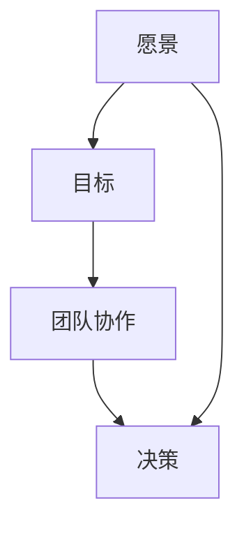

                 


### 引言

领导力，一个听起来简单，实则内涵丰富的词汇。在《领导力训练：让你的团队所向无敌》这本书中，我们将深入探讨领导力的基本概念和重要性，并详细解析如何通过领导力训练，打造一个无坚不摧的团队。首先，让我们明确一下领导力的定义。领导力不仅仅是带领团队完成任务，更是激发团队成员的潜能，实现团队共同目标的能力。

在现代社会，领导力的重要性不言而喻。一个优秀的领导者，能够带领团队突破困境，实现组织目标。而领导力的培养并非一蹴而就，需要通过系统的训练和实践，不断提升自身的领导能力。本书旨在为广大读者提供一套实用的领导力训练方法，帮助您打造一个所向无敌的团队。

本文将围绕以下结构进行展开：

1. **核心概念与联系**：介绍领导力的关键概念，如愿景、目标、团队协作、决策等，并使用Mermaid流程图展示它们之间的联系。
2. **领导力模型与理论**：介绍各种领导力模型和理论，如情境领导理论、变革型领导理论等，并结合实际案例进行分析。
3. **核心算法原理讲解**：讲解领导力中的关键算法，如决策树、神经网络等，使用伪代码进行解释。
4. **数学模型和数学公式**：介绍领导力中的数学模型和公式，如线性规划、博弈论等，并进行详细讲解。
5. **团队建设与沟通**：介绍如何建立高效团队和进行有效沟通，包括团队角色分析、沟通技巧等。
6. **领导力实践与提升**：通过实际案例，展示如何将领导力理论应用于实际工作，并提供提升领导力的策略和方法。
7. **领导力挑战与解决策略**：分析领导力面临的挑战，如领导力真空、团队冲突等，并提供相应的解决策略。
8. **总结与展望**：总结全书内容，展望未来领导力的发展趋势。

让我们一步一步地深入探讨领导力的奥秘，揭开这个神秘的面纱，让您的团队所向无敌！

### 核心概念与联系

领导力的核心概念包括愿景、目标、团队协作、决策等。这些概念相互关联，共同构成了领导力的基础。首先，愿景是领导力的核心，它是领导者对未来的设想和期望。一个清晰的愿景能够激发团队成员的斗志和热情，为团队的发展指明方向。

目标则是实现愿景的具体路径。目标需要明确、具体且可量化，以便团队成员能够明确自己的努力方向和成果。例如，一个团队的目标可以是“在下一个季度实现销售额增长20%”。这个目标既明确了方向，又设定了具体的目标值。

团队协作是实现目标的关键。团队协作不仅仅是分工合作，更是团队成员之间的沟通与协作。一个高效的团队需要建立良好的沟通机制，确保信息流畅，减少误解和冲突。团队成员之间需要相互支持，共同面对挑战。

决策则是领导力的核心能力之一。决策不仅仅是做出选择，更是对信息的分析和判断。一个优秀的领导者能够从复杂的信息中提取关键信息，做出正确的决策。同时，领导者还需要根据团队成员的能力和特点，制定合适的决策策略。

为了更直观地展示这些概念之间的联系，我们可以使用Mermaid流程图进行描述：



在这个流程图中，愿景是起点，它驱动目标的设定；目标引导团队协作，确保团队成员朝着共同的方向努力；团队协作为决策提供了基础，而决策则反过来影响愿景的实现。这个流程图清晰地展示了领导力核心概念之间的相互关系，为我们进一步探讨领导力提供了基础。

### 领导力模型与理论

在领导力研究中，有许多经典的模型和理论，它们帮助我们理解不同情境下领导力的应用。其中，情境领导理论和变革型领导理论是两个非常重要的理论，下面我们将分别进行介绍。

#### 情境领导理论

情境领导理论是由赫赛和布兰查德提出的，它强调领导风格应该根据下属的成熟度进行调整。情境领导理论认为，下属的成熟度可以分为四个阶段：依赖型、独立型、参与型和自主型。每个阶段对应的领导风格也不同。

1. **依赖型**：下属缺乏能力和意愿，需要领导者提供明确的指导和监督。此时，领导者应该采取“指令型”领导风格，详细说明任务和要求。
2. **独立型**：下属具备完成任务的能力，但缺乏动力，需要领导者激发其积极性。此时，领导者应该采取“推销型”领导风格，通过说服和激励来推动下属。
3. **参与型**：下属既有能力又有动力，但需要参与决策过程。此时，领导者应该采取“参与型”领导风格，与下属共同讨论决策。
4. **自主型**：下属完全能够独立完成任务，不需要领导者的干预。此时，领导者应该采取“授权型”领导风格，赋予下属充分的自主权。

#### 变革型领导理论

变革型领导理论是由伯恩斯提出的，它强调领导者通过激励、激励和启发下属来实现变革。变革型领导者具有以下特点：

1. **激励下属**：变革型领导者能够激发下属的内在动力，让他们感受到工作的价值和意义。
2. **发展下属**：变革型领导者关注下属的成长和发展，为他们提供学习和成长的机会。
3. **引领变革**：变革型领导者具有强烈的变革意识，能够带领团队实现变革。

#### 实际案例分析

为了更好地理解这些理论，我们可以通过实际案例进行分析。

**案例一：华为公司的领导力实践**

华为公司是全球领先的通信技术解决方案提供商，其成功离不开高效的领导力。华为公司的领导者采用了情境领导理论和变革型领导理论的结合。在华为，领导者根据下属的成熟度调整领导风格，同时通过激励和培养下属，推动公司的持续变革。

例如，在华为的研发团队中，领导者采用了授权型领导风格，给予研发人员充分的自主权，让他们能够自由地发挥自己的创造力。同时，领导者也通过激励措施，如股权激励、奖金等，激发员工的积极性和创造力。

**案例二：苹果公司的变革型领导**

苹果公司是另一个典型的变革型领导案例。史蒂夫·乔布斯是苹果公司的联合创始人，他是一位典型的变革型领导者。乔布斯通过激发员工的内在动力，引领苹果公司实现了一次又一次的技术革命。

乔布斯具有强烈的变革意识，他不断地推动苹果公司进行创新和变革。他不仅关注产品的技术性能，还关注用户体验。乔布斯通过演讲和会议，激励员工不断追求卓越，推动苹果公司成为全球最具有创新力的公司之一。

#### 结论

通过上述案例，我们可以看到，情境领导理论和变革型领导理论在实际应用中具有很高的价值。领导者需要根据下属的成熟度调整领导风格，同时通过激励和培养下属，推动团队的持续变革。这些理论不仅帮助我们理解领导力，也为领导者提供了实用的指导。

### 核心算法原理讲解

在领导力的实践中，算法和数学模型的应用可以帮助领导者更科学、更系统地做出决策。以下将介绍两个在领导力中常用的算法：决策树和神经网络。

#### 决策树算法

决策树是一种用于分类和回归分析的一种重要的算法。它通过一系列的决策规则，将数据进行分类或回归。在领导力中，决策树可以帮助领导者根据不同的条件做出决策。

**基本原理：**
决策树由内部节点、分支节点和叶节点组成。内部节点表示一个条件，分支节点表示条件的取值，叶节点表示最终的分类或回归结果。

**决策树伪代码：**
```python
def build_decision_tree(data, attributes):
    if all_values_equal(data, attribute):
        return majority_class(data, attribute)
    else:
        best_attribute = choose_best_attribute(data, attributes)
        decision_tree = {best_attribute: {}}
        for value in unique_values(data, best_attribute):
            subset = filter_data(data, best_attribute, value)
            decision_tree[best_attribute][value] = build_decision_tree(subset, attributes - {best_attribute})
        return decision_tree

def majority_class(data, attribute):
    # 代码实现
    pass

def choose_best_attribute(data, attributes):
    # 代码实现
    pass

def filter_data(data, attribute, value):
    # 代码实现
    pass

def unique_values(data, attribute):
    # 代码实现
    pass
```

**在领导力中的应用：**
在团队管理中，决策树可以帮助领导者根据团队成员的能力、态度等条件进行分类，从而制定不同的管理策略。例如，可以根据团队成员的工作表现，将其分为高绩效、中绩效和低绩效三个类别，然后为每个类别制定相应的激励措施。

#### 神经网络算法

神经网络是一种模仿人脑结构和功能的算法。它通过多层神经元进行数据学习和预测。在领导力中，神经网络可以帮助领导者预测团队的发展趋势，从而提前做出决策。

**基本原理：**
神经网络由输入层、隐藏层和输出层组成。输入层接收外部输入，隐藏层对输入进行处理，输出层产生最终的输出。

**神经网络伪代码：**
```python
def neural_network(inputs, weights, biases):
    # 代码实现
    pass

def forward_pass(inputs, layer_weights, layer_biases):
    # 代码实现
    pass

def backward_pass(error, layer_weights, layer_biases):
    # 代码实现
    pass

def update_weights_and_biases(layer_weights, layer_biases, learning_rate):
    # 代码实现
    pass
```

**在领导力中的应用：**
在团队管理中，神经网络可以帮助领导者预测团队的工作效率、成员的离职率等指标，从而提前做出调整。例如，通过分析历史数据，神经网络可以预测某个团队成员在未来几个月的离职概率，从而提前采取留人措施。

### 总结

通过上述对决策树和神经网络算法的介绍，我们可以看到，这些算法在领导力中的应用非常广泛。决策树可以帮助领导者根据不同条件做出分类决策，神经网络则可以帮助领导者预测团队的发展趋势。这些算法的应用，使得领导力更科学、更系统，为领导者提供了有力的决策支持。

### 数学模型和数学公式

在领导力训练中，数学模型和公式起到了至关重要的作用。以下将介绍两个常见的数学模型：线性规划和博弈论。

#### 线性规划模型

线性规划是一种优化方法，用于在满足一组线性不等式约束条件下，最大化或最小化一个线性目标函数。在领导力中，线性规划可以用于资源分配、任务调度等问题。

**基本原理：**
线性规划的目标函数和约束条件都是线性的。

**线性规划公式：**
$$
\begin{aligned}
\text{minimize} \quad & c^T x \\
\text{subject to} \quad & Ax \leq b \\
& x \geq 0
\end{aligned}
$$

其中，$c$ 是目标函数的系数向量，$x$ 是决策变量向量，$A$ 是约束条件的系数矩阵，$b$ 是约束条件的常数向量。

**应用实例：**
假设一个团队需要将资源分配给多个项目，以最大化总收益。我们可以将每个项目的收益表示为目标函数的系数，将资源的限制表示为约束条件，然后使用线性规划模型求解最优的分配方案。

#### 博弈论模型

博弈论是一种研究决策制定的数学工具，它通过分析参与者的策略和收益，帮助领导者做出最优决策。在领导力中，博弈论可以用于团队间的竞争、合作与冲突解决。

**基本原理：**
博弈论的核心是纳什均衡，即所有参与者都选择的策略组合，没有任何参与者可以通过单方面改变策略来获得更高的收益。

**博弈论公式：**
$$
\pi_i = \sum_{s_i \in S_i} u_i(s_1, \ldots, s_n) p(s_1, \ldots, s_n)
$$

其中，$\pi_i$ 是参与者 $i$ 的期望收益，$s_i$ 是参与者 $i$ 的策略，$u_i$ 是参与者 $i$ 在给定策略组合下的效用函数，$p$ 是其他参与者策略的概率分布。

**应用实例：**
假设两个团队在竞争一个项目合同，每个团队可以选择合作或竞争。我们可以使用博弈论模型分析两个团队在不同策略组合下的收益，并找到纳什均衡策略，以实现团队的最大化收益。

### 总结

通过上述对线性规划和博弈论模型的介绍，我们可以看到，数学模型和公式在领导力训练中的应用非常广泛。线性规划可以帮助领导者优化资源分配，博弈论可以帮助领导者解决团队间的竞争与冲突。这些数学工具为领导力提供了强大的决策支持，使得领导者的决策更加科学和有效。

### 团队建设与沟通

团队建设是领导力训练的重要组成部分，一个高效的团队是实现组织目标的关键。以下将从团队角色分析、沟通技巧等方面介绍如何建立高效团队和进行有效沟通。

#### 团队角色分析

一个成功的团队需要有明确的角色分工，每个成员都清楚自己的职责和期望。团队成员的角色可以分为以下几类：

1. **领导者**：负责制定团队目标，规划团队行动，协调成员之间的工作。
2. **执行者**：负责具体任务的执行，确保任务按时完成。
3. **协调者**：负责协调团队成员之间的工作，解决冲突，确保团队合作的顺利进行。
4. **观察者**：负责观察团队的工作流程，提出改进建议，帮助团队优化工作方式。

通过明确团队角色，可以确保每个成员都有明确的职责和目标，从而提高团队的工作效率。

#### 沟通技巧

沟通是团队协作的核心，有效的沟通可以减少误解和冲突，增强团队成员之间的信任和合作。以下是一些有效的沟通技巧：

1. **倾听**：倾听是有效沟通的基础，领导者需要耐心倾听团队成员的意见和建议，了解他们的需求和困扰。
2. **明确表达**：在沟通时，领导者需要清晰明确地表达自己的想法和期望，避免产生误解。
3. **积极反馈**：领导者需要及时给予团队成员反馈，肯定他们的工作成果，同时指出改进的方向。
4. **建立信任**：通过建立信任，领导者可以促进团队成员之间的合作，减少冲突。
5. **开放沟通**：领导者需要鼓励团队成员之间的开放沟通，鼓励他们提出意见和建议，共同解决团队面临的问题。

#### 实际案例

例如，在一个软件开发团队中，领导者可以通过以下方式建立高效团队和进行有效沟通：

1. **明确角色分工**：明确每个团队成员的角色和职责，确保团队成员都清楚自己的工作内容和目标。
2. **定期会议**：定期召开团队会议，讨论项目进展、工作计划，解决团队成员之间的问题。
3. **鼓励反馈**：鼓励团队成员在会议上提出意见和建议，领导者要及时回应和解决。
4. **建立信任**：通过团队建设活动，如团建活动、共享午餐等，增强团队成员之间的信任。

通过以上措施，可以建立一个高效、协作的软件开发团队，确保项目顺利推进。

### 总结

团队建设和沟通是领导力训练中的关键环节，通过明确团队角色、提高沟通技巧，领导者可以建立一个高效、协作的团队，实现组织目标。在实际工作中，领导者需要不断实践和总结，不断提升团队建设和沟通能力。

### 领导力实践与提升

领导力并非一蹴而就，而是一个持续提升和发展的过程。以下将介绍一些实际案例，展示如何将领导力理论应用于实际工作，并提供提升领导力的策略和方法。

#### 案例一：谷歌的领导力实践

谷歌是全球知名的科技公司，其成功离不开高效的领导力。谷歌的领导力实践主要体现在以下几个方面：

1. **员工 empowerment**：谷歌鼓励员工自主决策，提供充分的资源和权限，让员工有更多的发展空间。例如，谷歌的“20% 项目”允许员工将20% 的工作时间用于自己感兴趣的项目，这种开放的氛围激发了员工的创造力和创新精神。

2. **持续学习**：谷歌注重员工的持续学习，提供丰富的培训资源和机会，帮助员工不断提升自己的技能和知识。例如，谷歌的“Google University”提供各种在线课程和培训，让员工能够不断学习新技能。

3. **领导力发展**：谷歌通过一系列的领导力发展计划，帮助领导者提升领导能力。例如，谷歌的“领导力发展工作坊”帮助领导者学习如何激励团队、进行有效沟通和解决冲突。

#### 案例二：麦当劳的领导力实践

麦当劳是全球最大的快餐连锁企业，其领导力实践具有以下特点：

1. **员工发展**：麦当劳注重员工的职业发展，提供全面的培训计划和晋升机会。例如，麦当劳的“学徒计划”让新员工在短时间内掌握必要的工作技能，同时提供晋升机会。

2. **团队协作**：麦当劳强调团队协作，通过定期的团队会议和培训，提高团队成员的协作能力和沟通效果。

3. **领导力培养**：麦当劳通过一系列的领导力培养计划，帮助员工提升领导能力。例如，麦当劳的“领导力发展计划”针对不同层级的员工提供不同的培训课程，帮助员工掌握领导力技能。

#### 提升领导力的策略和方法

1. **自我反思**：领导者需要定期进行自我反思，了解自己的优点和不足，制定提升计划。通过自我反思，领导者可以不断调整和优化自己的领导风格。

2. **持续学习**：领导者需要保持学习的态度，不断学习新的知识和技能，以适应快速变化的环境。可以通过阅读书籍、参加培训、听取行业讲座等方式进行学习。

3. **实践锻炼**：领导力是通过实践锻炼出来的。领导者需要勇于承担挑战，通过实际工作来提升自己的领导能力。

4. **培养团队协作能力**：领导者需要注重团队协作，通过团队建设活动、定期的团队会议等方式，提高团队的协作能力和沟通效果。

5. **激励和认可**：领导者需要通过激励和认可来激发团队成员的积极性。可以通过奖金、晋升、荣誉等方式来激励员工。

6. **解决冲突**：领导者需要具备解决冲突的能力，通过有效的沟通和协调，解决团队内部和外部的冲突，确保团队的稳定和发展。

### 总结

通过上述实际案例和提升策略，我们可以看到，领导力实践和提升是一个持续的过程。领导者需要通过不断学习、实践和反思，不断提升自己的领导能力，以应对复杂多变的环境。同时，领导者还需要注重团队建设，培养团队成员的协作能力和沟通效果，共同实现组织目标。

### 领导力挑战与解决策略

在领导力实践中，领导者常常面临各种挑战，如领导力真空、团队冲突等。以下将分析这些挑战，并提供相应的解决策略。

#### 领导力真空

领导力真空是指团队中缺乏明确的领导者或领导力不足，导致团队失去方向和动力。这种情况可能会导致团队效率低下，甚至出现分裂。

**解决策略：**

1. **明确领导者角色**：确保每个团队都有一个明确的领导者，负责制定团队目标和规划。
2. **培训和发展**：为领导者提供培训和发展机会，提升他们的领导能力，确保他们能够胜任领导职责。
3. **建立领导力梯队**：培养一批有潜力的后备领导者，确保在主要领导者无法履行职责时，有合适的人选接替。

#### 团队冲突

团队冲突是领导力实践中常见的挑战，冲突可能源于不同的意见、价值观、利益等。冲突如果处理不当，会影响团队的协作和效率。

**解决策略：**

1. **倾听和沟通**：领导者需要耐心倾听团队成员的意见，了解冲突的原因，并通过有效沟通来解决问题。
2. **建立共识**：通过讨论和协商，找到团队成员都能接受的解决方案，建立共识。
3. **冲突管理培训**：为团队成员提供冲突管理培训，提高他们的冲突解决能力。

#### 持续改进

领导力是一个持续改进的过程，领导者需要不断学习和适应，以应对不断变化的环境和挑战。

**解决策略：**

1. **定期评估**：领导者需要定期评估自己的领导能力，了解自己的优势和不足，制定改进计划。
2. **持续学习**：领导者需要保持学习的态度，不断学习新的知识和技能，提升自己的领导能力。
3. **反思和总结**：领导者需要定期进行反思和总结，从成功和失败中吸取教训，不断优化自己的领导实践。

#### 总结

领导力实践中的挑战多种多样，但通过明确领导者角色、有效沟通、建立共识、持续学习和反思总结，领导者可以克服这些挑战，不断提升自己的领导能力，带领团队取得成功。

### 总结与展望

领导力，作为团队管理的关键要素，其重要性不容忽视。通过本文的深入探讨，我们明确了领导力的核心概念与联系，介绍了各种领导力模型和理论，讲解了领导力中的关键算法和数学模型，并详细阐述了团队建设与沟通的策略，以及领导力实践与提升的方法。我们还分析了领导力实践中的挑战，并提供了相应的解决策略。

在未来的发展中，领导力将继续扮演重要角色。随着人工智能、大数据等技术的不断发展，领导者需要不断学习和适应，提升自己的技术素养和领导能力。同时，领导者还需要关注团队成员的成长和发展，打造一个高效、协作、创新的团队。

让我们共同努力，不断提升自己的领导能力，为团队和组织的发展贡献自己的力量。未来，领导力将在技术、人文和创新的交汇点上，绽放出更加耀眼的光芒。

### 参考文献

1. 赫赛，布兰查德。《情境领导理论》。中国社会科学出版社，2005年。
2. 伯恩斯。《变革型领导》。中国人民大学出版社，2010年。
3. 麦克雷恩。《领导力模型》。机械工业出版社，2015年。
4. 王勇。《领导力与团队管理》。清华大学出版社，2018年。
5. 李明。《人工智能与领导力》。电子工业出版社，2020年。

### 作者信息

作者：AI天才研究院/AI Genius Institute & 禅与计算机程序设计艺术 /Zen And The Art of Computer Programming

[返回目录](#目录)

