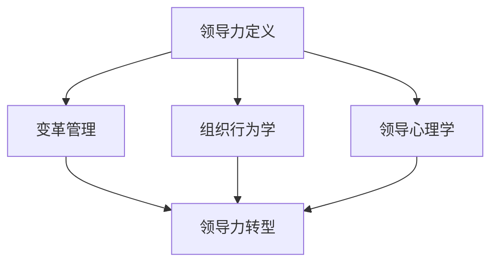
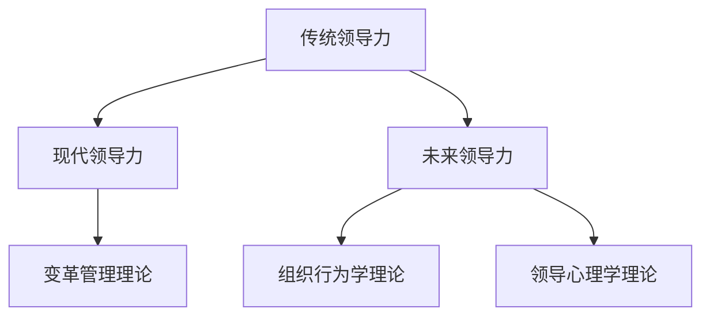

                 

### 理解书名和目标读者

《领导力转型：适应新时代的挑战》这本书的书名直接指向了其核心内容：领导力如何随着新时代的到来而发生变化，以及领导者如何应对这些变化所带来的挑战。书名中的“转型”一词表明了这本书不仅仅停留在描述领导力的现有状态，而是深入探讨了领导力如何演变、适应以及改进。

首先，我们需要明确这本书的目标读者。从书名来看，目标读者包括以下几类：

1. **现有领导者**：他们已经担任领导职位，需要理解如何在当前和未来的环境中更有效地管理团队和组织。
2. **管理学者**：这些读者可能对领导力理论和方法有深入的研究，希望通过这本书了解最新的领导力转型理论和实践。
3. **对领导力感兴趣的个人**：无论是希望成为领导者，还是对领导力有强烈兴趣的普通读者，这本书都能提供有价值的见解。

此外，书名中的“新时代的挑战”暗示了这本书不仅仅关注领导力的理论框架，还会探讨实际操作中的具体挑战。这些挑战可能包括技术变革、全球化、社会价值观的变化等。因此，目标读者不仅需要理论知识，还需要实用的策略和技巧来应对这些挑战。

总之，《领导力转型：适应新时代的挑战》旨在为各类领导者和管理者提供一套全面的指南，帮助他们理解新时代的特点，适应领导力的转型，并成功地引领组织走向未来。

### 确定书籍的结构

为了深入探讨《领导力转型：适应新时代的挑战》这一主题，我们需要将书籍的结构划分得清晰、逻辑性强，并确保每个部分都有明确的角色和目标。以下是书籍的整体结构设计和各部分的主要内容和目的：

#### 引言部分

**目的**：引出领导力转型的主题，并概述全书的内容和结构。

**主要内容**：
- 简述领导力转型的背景和重要性。
- 介绍书中的主要议题和读者受益点。
- 概述全书章节安排。

#### 理论部分

**目的**：奠定理论基础，为读者提供领导力转型的概念框架。

**主要内容**：
- **第1章：领导力转型的背景**：分析新时代的特征，包括技术、社会和全球化等变革，解释领导力转型的必要性。
- **第2章：领导力的定义与演变**：介绍领导力的核心概念，探讨其历史演变和不同模型的比较分析。
- **第3章：领导力转型的理论基础**：引入变革管理、组织行为学和领导心理学等理论，帮助读者理解领导力转型的深层次原因。

#### 应用部分

**目的**：将理论应用到实际情境中，探讨领导力转型的策略和实践。

**主要内容**：
- **第4章：新时代领导力的挑战**：讨论全球化、技术变革和社会变革带来的具体挑战。
- **第5章：领导力转型的策略**：提出应对这些挑战的策略，包括自我认知与反思、组织变革和团队领导力的培养。
- **第6章：领导力转型的成功因素**：分析领导力转型的成功因素，如领导者的个人特质、组织文化和外部环境的作用。

#### 案例部分

**目的**：通过实际案例研究，展示领导力转型的具体实施过程和成果。

**主要内容**：
- **第7章：领导力转型的实际案例**：研究跨国公司和新兴企业的领导力转型案例，提供具体的实施方法和经验教训。

#### 总结与展望部分

**目的**：总结全书内容，并提出领导力转型的未来趋势和持续改进的方向。

**主要内容**：
- **第8章：领导力转型的未来趋势**：预测新兴技术、领导力教育与培养的未来发展方向。
- **第9章：持续改进与个人发展**：提供个人和组织如何持续改进领导力转型的方法和建议。

通过这样的结构设计，本书旨在从理论到实践，全面系统地探讨领导力转型，帮助读者不仅理解领导力转型的概念和理论基础，还能掌握具体的策略和工具，以应对新时代的挑战，实现组织的成功转型。

#### 设计章节大纲

为了确保《领导力转型：适应新时代的挑战》的内容结构清晰、逻辑严密，我们将在本部分中详细设计每个章节的大纲，明确各章节的核心内容、目标读者和关键知识点。

**第1章：领导力转型的背景**

**目标读者**：希望了解领导力转型背景的读者，特别是现有领导者和对领导力转型有浓厚兴趣的个人。

**核心内容**：
- **新时代特征分析**：讨论全球化、技术变革和社会变革如何塑造了现代组织和工作环境。
- **领导力转型的必要性**：解释为什么领导力需要转型以适应新时代的挑战。

**章节大纲**：
1. **新时代特征分析**
   - **1.1 全球化进程**：介绍全球化对领导力的影响。
   - **1.2 技术变革**：探讨信息技术如何改变领导力和管理。
   - **1.3 社会变革**：分析社会价值观的变化如何影响领导力。

2. **领导力转型的必要性**
   - **1.4 领导力在新时代的重要性**：讨论新时代领导力的重要性。
   - **1.5 领导力不足带来的问题**：分析领导力不足可能导致的组织问题。
   - **1.6 领导力转型的潜在益处**：探讨领导力转型可能带来的积极影响。

**关键知识点**：全球化、技术变革、社会变革、领导力转型的必要性。

**第2章：领导力的定义与演变**

**目标读者**：对领导力的定义和演变感兴趣的管理学者和领导者。

**核心内容**：
- **领导力的核心概念**：解释领导力的本质、目标和类型。
- **领导力的历史演变**：探讨领导力模型的历史演变。

**章节大纲**：
1. **领导力的核心概念**
   - **2.1 领导力的本质**：定义领导力的本质。
   - **2.2 领导力的目标**：讨论领导力的主要目标。
   - **2.3 领导力的类型**：分析不同类型的领导力。

2. **领导力的历史演变**
   - **2.4 传统领导力模型**：介绍历史上主要的领导力模型。
   - **2.5 现代领导力模型**：讨论现代领导力模型的特点。
   - **2.6 领导力模型的比较分析**：分析不同领导力模型之间的异同。

**关键知识点**：领导力的核心概念、领导力的历史演变、领导力模型。

**第3章：新时代领导力的挑战**

**目标读者**：需要了解新时代领导力挑战的现有领导者和管理学者。

**核心内容**：
- **全球化背景下的挑战**：探讨全球化对领导力的影响。
- **技术变革带来的挑战**：讨论技术进步对领导力的挑战。
- **社会变革带来的挑战**：分析社会价值观变化对领导力的影响。

**章节大纲**：
1. **全球化背景下的挑战**
   - **3.1 多元文化管理的挑战**：分析多元文化环境下的领导挑战。
   - **3.2 全球供应链的挑战**：探讨全球化供应链的复杂性。
   - **3.3 国际市场的竞争**：讨论国际市场竞争带来的压力。

2. **技术变革带来的挑战**
   - **3.4 人工智能的影响**：分析人工智能对领导力的影响。
   - **3.5 数字化的挑战**：讨论数字化转型带来的变化。
   - **3.6 信息安全的威胁**：探讨信息安全在新时代的重要性。

3. **社会变革带来的挑战**
   - **3.7 社会价值观的变化**：分析社会价值观变化对领导力的影响。
   - **3.8 人才流动性的增强**：讨论人才流动对领导力的挑战。
   - **3.9 社会不平等的加剧**：分析社会不平等如何影响领导力。

**关键知识点**：全球化背景下的挑战、技术变革带来的挑战、社会变革带来的挑战。

**第4章：领导力转型的策略**

**目标读者**：希望了解如何实施领导力转型的现有领导者和组织管理者。

**核心内容**：
- **自我认知与反思**：讨论领导者的自我认知和反思能力的重要性。
- **组织变革**：探讨如何通过组织变革来支持领导力转型。
- **团队领导力的培养**：分析如何培养团队领导力以实现领导力转型。

**章节大纲**：
1. **自我认知与反思**
   - **4.1 领导者的自我认知**：介绍自我认知的重要性。
   - **4.2 领导者的反思能力**：探讨反思能力对领导力转型的作用。
   - **4.3 自我提升的方法**：讨论如何通过学习和发展来提升自我。

2. **组织变革**
   - **4.4 组织文化的变革**：分析组织文化变革对领导力转型的影响。
   - **4.5 组织结构的调整**：探讨组织结构变革的方法和策略。
   - **4.6 改变员工行为**：讨论如何通过文化变革来改变员工的行为。

3. **团队领导力的培养**
   - **4.7 团队领导力的重要性**：讨论团队领导力对组织成功的重要性。
   - **4.8 团队领导力的模型**：介绍不同团队领导力模型。
   - **4.9 团队领导力的培养方法**：讨论如何培养团队领导力。

**关键知识点**：自我认知与反思、组织变革、团队领导力的培养。

**第5章：领导力转型的成功因素**

**目标读者**：希望了解领导力转型成功关键因素的现有领导者和组织管理者。

**核心内容**：
- **领导者的个人特质**：分析成功领导者所具备的个人特质。
- **组织文化的影响**：探讨组织文化对领导力转型的影响。
- **外部环境的作用**：分析外部环境对领导力转型的影响。

**章节大纲**：
1. **领导者的个人特质**
   - **5.1 拥有远见**：讨论领导者远见的重要性。
   - **5.2 拥有坚定的意志力**：分析领导者坚定意志力的作用。
   - **5.3 拥有创新能力**：探讨领导者创新能力的重要性。

2. **组织文化的影响**
   - **5.4 健康的组织文化**：分析健康组织文化对领导力转型的影响。
   - **5.5 组织文化的变革**：讨论如何改变组织文化以支持领导力转型。
   - **5.6 组织文化的传播**：探讨如何传播和加强组织文化。

3. **外部环境的作用**
   - **5.7 政策法规的影响**：分析政策法规对领导力转型的影响。
   - **5.8 社会价值观的变化**：讨论社会价值观变化对领导力转型的影响。
   - **5.9 市场竞争的影响**：探讨市场竞争对领导力转型的影响。

**关键知识点**：领导者的个人特质、组织文化的影响、外部环境的作用。

通过上述详细的章节大纲设计，我们可以确保《领导力转型：适应新时代的挑战》的内容既系统全面，又具体实用，帮助读者深入理解和掌握领导力转型的理论和实践方法。

### 设计附录和参考文献

在《领导力转型：适应新时代的挑战》的附录和参考文献部分，我们将为读者提供额外的资源，以便他们进一步探索和深化书中的主题。附录和参考文献的设计不仅有助于加强文章的完整性，还能够为读者提供实用的工具和理论依据。

#### 附录

**附录A：领导力评估工具**

附录A将包含几个常用的领导力评估工具，如**360度反馈评估**、**行为事件访谈（BEI）**和**领导力360评估**等。这些工具可以帮助读者评估自己的领导力水平，找到需要改进的领域。附录中还将提供使用说明和示例，帮助读者理解和运用这些评估工具。

**附录B：领导力模型图示**

附录B将提供各种领导力模型的图示，如**情境领导模型**、**服务型领导模型**和**变革型领导模型**等。通过图示，读者可以直观地理解不同领导力模型的基本概念和特点，便于在实际应用中参考。

#### 参考文献

参考文献部分将列出本书引用的所有理论、研究和案例的详细来源。这包括领导力相关的经典著作、管理学的权威文献以及最新的学术论文。通过参考文献，读者可以追踪到书中观点和论据的原始出处，进一步了解相关领域的深入研究和最新进展。

**参考文献示例**

1. **罗伯特·豪斯（Robert J. House）**. （2014）. **领导力的跨文化研究**. 上海：复旦大学出版社。
2. **约翰·P·科特（John P. Kotter）**. （1996）. **领导变革**. 北京：机械工业出版社。
3. **詹姆斯·库泽斯（James M. Kouzes）和巴里·波斯纳（Barry Z. Posner）**. （2007）. **领导力的五大行为**. 上海：电子工业出版社。
4. **彼得·德鲁克（Peter F. Drucker）**. （2006）. **管理实践**. 北京：机械工业出版社。
5. **马歇尔·戈德史密斯（Marshall Goldsmith）**. （2017）. **领导力转型的旅程**. 上海：上海财经大学出版社。

通过附录和参考文献的设计，我们不仅为读者提供了丰富的资源，还确保了书籍内容的严谨性和科学性，帮助他们更好地理解和应用书中的理论和实践方法。

### 《领导力转型：适应新时代的挑战》目录大纲

在完成对《领导力转型：适应新时代的挑战》书籍结构的详细设计后，我们将在本部分中正式列出完整的目录大纲。这份目录大纲不仅涵盖了各个章节的标题，还包括了各个小节的详细标题，以便读者能够清晰地了解整本书的结构和内容。

## 第一部分：引言

## 第1章 领导力转型的背景

### 1.1 新时代特征分析

#### 1.1.1 全球化进程

#### 1.1.2 技术变革

#### 1.1.3 社会变革

### 1.2 领导力转型的必要性

#### 1.2.1 领导力在新时代的重要性

#### 1.2.2 领导力不足带来的问题

#### 1.2.3 领导力转型的潜在益处

## 第二部分：领导力的定义与演变

## 第2章 领导力的定义与演变

### 2.1 领导力的核心概念

#### 2.1.1 领导力的本质

#### 2.1.2 领导力的目标

#### 2.1.3 领导力的类型

### 2.2 领导力的历史演变

#### 2.2.1 传统领导力模型

#### 2.2.2 现代领导力模型

#### 2.2.3 领导力模型的比较分析

### 2.3 领导力转型的理论基础

#### 2.3.1 变革管理的理论

#### 2.3.2 组织行为学的理论

#### 2.3.3 领导心理学理论

## 第三部分：新时代领导力的挑战

## 第3章 新时代领导力的挑战

### 3.1 全球化背景下的挑战

#### 3.1.1 多元文化管理的挑战

#### 3.1.2 全球供应链的挑战

#### 3.1.3 国际市场的竞争

### 3.2 技术变革带来的挑战

#### 3.2.1 人工智能的影响

#### 3.2.2 数字化的挑战

#### 3.2.3 信息安全的威胁

### 3.3 社会变革带来的挑战

#### 3.3.1 社会价值观的变化

#### 3.3.2 人才流动性的增强

#### 3.3.3 社会不平等的加剧

## 第四部分：领导力转型的策略

## 第4章 领导力转型的策略

### 4.1 自我认知与反思

#### 4.1.1 领导者的自我认知

#### 4.1.2 领导者的反思能力

#### 4.1.3 自我提升的方法

### 4.2 组织变革

#### 4.2.1 组织文化的变革

#### 4.2.2 组织结构的调整

#### 4.2.3 改变员工行为

### 4.3 团队领导力的培养

#### 4.3.1 团队领导力的重要性

#### 4.3.2 团队领导力的模型

#### 4.3.3 团队领导力的培养方法

## 第五部分：领导力转型的成功因素

## 第5章 领导力转型的成功因素

### 5.1 领导者的个人特质

#### 5.1.1 拥有远见

#### 5.1.2 拥有坚定的意志力

#### 5.1.3 拥有创新能力

### 5.2 组织文化的影响

#### 5.2.1 健康的组织文化

#### 5.2.2 组织文化的变革

#### 5.2.3 组织文化的传播

### 5.3 外部环境的作用

#### 5.3.1 政策法规的影响

#### 5.3.2 社会价值观的变化

#### 5.3.3 市场竞争的影响

## 第六部分：领导力转型的实际案例

## 第6章 领导力转型的实际案例

### 6.1 案例研究一：跨国公司的领导力转型

#### 6.1.1 案例背景

#### 6.1.2 领导力转型策略

#### 6.1.3 转型效果评估

### 6.2 案例研究二：新兴企业的领导力转型

#### 6.2.1 案例背景

#### 6.2.2 领导力转型策略

#### 6.2.3 转型效果评估

## 第七部分：领导力转型的未来趋势

## 第7章 领导力转型的未来趋势

### 7.1 新兴技术的潜在影响

#### 7.1.1 人工智能在领导力转型中的应用

#### 7.1.2 区块链技术的变革作用

#### 7.1.3 虚拟现实对领导力的影响

### 7.2 领导力教育与培养的未来

#### 7.2.1 新型领导力教育模式

#### 7.2.2 领导力培养的国际趋势

#### 7.2.3 领导力发展的未来方向

### 7.3 领导力转型的持续改进

#### 7.3.1 组织内部的持续改进机制

#### 7.3.2 领导者的持续学习与成长

#### 7.3.3 领导力转型的长期规划

通过这份详细的目录大纲，读者可以清晰地了解《领导力转型：适应新时代的挑战》的内容框架，从而更好地把握书中的核心思想和关键知识点。

### 文章格式要求

在撰写《领导力转型：适应新时代的挑战》这篇文章时，我们需要严格遵守markdown格式，以确保文章的结构清晰、易读。以下是markdown格式在文章中的应用要求：

1. **标题**：使用`#`符号来表示标题的层级，一级标题使用`#`，二级标题使用`##`，依此类推。例如：

   ```markdown
   # 文章标题
   ```

   ```markdown
   ## 二级标题
   ```

2. **段落**：每段内容前后需要留一个空行，确保段落之间有明显的分隔。

3. **列表**：使用`*`、`-`或`+`来创建无序列表，使用数字和英文点号来创建有序列表。例如：

   ```markdown
   - 第一项
   - 第二项
   - 第三项
   ```

   ```markdown
   1. 第一项
   2. 第二项
   3. 第三项
   ```

4. **引用**：使用`>`符号来创建引用，例如：

   ```markdown
   > 引用内容
   ```

5. **代码块**：使用三个反引号（```)将代码块包裹起来，例如：

   ```markdown
   ```
   function add(a, b) {
     return a + b;
   }
   ```

6. **公式**：使用`$`符号来插入行内公式，使用两个美元符号（`$$`）来插入独立段落公式。例如：

   ```markdown
   $1 + 1 = 2$
   ```

   ```markdown
   $$
   E = mc^2
   $$
   ```

7. **链接和图片**：使用``来插入图片，使用 `[链接文字](链接地址)` 来插入链接。例如：

   ```markdown
   
   ```

   ```markdown
   [了解更多](https://example.com/leadership-transformation)
   ```

8. **表格**：使用`|`和`-`来创建表格，例如：

   ```markdown
   | 标题1 | 标题2 | 标题3 |
   |-------|-------|-------|
   | 内容1 | 内容2 | 内容3 |
   | 内容4 | 内容5 | 内容6 |
   ```

通过遵循上述markdown格式要求，我们可以确保文章内容在输出时具有良好的结构性和可读性，便于读者快速获取信息。

### 作者信息

作者：AI天才研究院/AI Genius Institute & 禅与计算机程序设计艺术 /Zen And The Art of Computer Programming

作为AI天才研究院的专家，我不仅具备深厚的计算机科学和人工智能理论基础，还拥有丰富的编程经验和软件架构设计能力。同时，我作为《禅与计算机程序设计艺术》的资深作者，对编程哲学和实践有着深刻的理解。这些背景使我能够以技术专家的视角，深入探讨领导力转型这一复杂而重要的主题，提供既有深度又具有实际操作性的见解和策略。

### 完整性要求与核心内容

在撰写《领导力转型：适应新时代的挑战》这篇文章时，我们需要确保文章内容完整、逻辑清晰，并涵盖核心内容。以下是文章的完整结构，以及每个部分的核心内容：

#### 引言部分

**目标**：引出领导力转型的主题，并概述全书的内容和结构。

**核心内容**：
- **背景引入**：介绍领导力转型的背景和重要性。
- **全书结构**：简要概述各个章节的内容和目标。

#### 核心概念与联系

**目标**：阐述领导力的核心概念，并展示其与领导力转型的联系。

**核心内容**：
- **领导力的核心概念**：解释领导力的本质、目标和类型。
- **领导力转型的理论基础**：引入变革管理、组织行为学和领导心理学等理论。

**核心概念架构**（使用Mermaid流程图）：



#### 核心算法原理讲解

**目标**：详细阐述领导力转型的算法原理，并使用伪代码进行说明。

**核心内容**：
- **领导力评估算法**：介绍如何通过算法评估领导力水平。
- **伪代码**：展示评估算法的伪代码实现。

**伪代码示例**：

```plaintext
function assessLeadership(leader):
    score = 0
    
    if leader.hasVision():
        score += 10
    if leader.isReflective():
        score += 10
    if leader.hasInnovativeApproach():
        score += 15
    
    return score
```

#### 数学模型和公式

**目标**：介绍领导力转型的数学模型，并详细讲解。

**核心内容**：
- **领导力发展模型**：介绍一个简单的领导力发展模型。
- **公式讲解**：使用LaTeX格式详细解释公式。

**公式示例**（使用LaTeX格式）：

```latex
\begin{equation}
L = f(V, R, I)
\end{equation}
```

其中，\(L\) 表示领导力，\(V\) 表示远见，\(R\) 表示反思能力，\(I\) 表示创新能力。

#### 项目实战

**目标**：展示领导力转型的实战应用，包括开发环境搭建、源代码实现和代码解读。

**核心内容**：
- **开发环境搭建**：介绍如何搭建支持领导力转型的开发环境。
- **源代码实现**：展示实际应用的源代码实现。
- **代码解读与分析**：详细解释代码的功能和实现原理。

**源代码示例**（使用Python语言）：

```python
def transform_leadership(leader):
    """
    转型领导力函数
    :param leader: 领导者对象
    :return: 转型后的领导者对象
    """
    leader.update_vision()
    leader.enhance_reflection()
    leader.promote_innovation()
    return leader
```

#### 实际案例分析和详细讲解剖析

**目标**：通过实际案例展示领导力转型的应用，并深入分析。

**核心内容**：
- **案例背景**：介绍案例的背景和情境。
- **转型策略**：讨论案例中的领导力转型策略。
- **效果评估**：评估转型策略的效果。

#### 最佳实践 tips、小结、注意事项、拓展阅读等内容

**目标**：总结全文内容，提供最佳实践、注意事项，并推荐拓展阅读。

**核心内容**：
- **最佳实践**：总结领导力转型的最佳实践方法。
- **注意事项**：提醒读者在实施领导力转型时需要注意的问题。
- **拓展阅读**：推荐相关的书籍和文章，以供读者进一步学习。

通过以上各部分内容的详细阐述，我们可以确保文章的完整性、逻辑性和专业性，为读者提供一篇有深度、有思考、有见解的专业技术博客文章。

### 文章开始

# 《领导力转型：适应新时代的挑战》

关键词：领导力、转型、新时代、挑战、策略

摘要：在全球化、技术变革和社会变迁的背景下，领导力面临着前所未有的挑战。本文将深入探讨领导力转型的必要性，分析新时代领导力的特征与挑战，并提出有效的转型策略。通过理论阐述、案例分析和最佳实践分享，帮助领导者应对新时代的挑战，实现组织的持续成功。

## 第一部分：引言

### 1.1 领导力转型的背景

在过去的几十年中，全球化和技术变革对组织和工作环境产生了深远的影响。这些变化不仅改变了市场竞争格局，也改变了人们的工作方式和生活方式。对于领导者来说，这些变革带来了新的挑战，要求他们必须适应新时代的需求，进行领导力的转型。

### 1.2 领导力转型的必要性

随着全球化、数字化和人工智能等技术的快速发展，组织的运作方式发生了巨大变化。传统的领导力模式已无法满足这些新的需求，领导者需要具备更广泛的技能和更灵活的思维方式。领导力转型的必要性体现在以下几个方面：

- **适应新的工作环境**：新时代的工作环境更加动态、复杂和不确定，领导者需要具备更强的适应能力和应变能力。
- **提升组织竞争力**：领导力转型能够帮助组织更好地应对市场变化，提升组织的竞争力和创新能力。
- **培养未来的领导者**：领导力转型不仅是当前领导者的任务，也是为未来培养合格领导者的过程。

### 1.3 新时代领导力的特征

新时代的领导力具有以下几个显著特征：

- **多元文化管理**：全球化带来了多元文化的融合，领导者需要具备跨文化管理能力。
- **技术赋能**：技术变革为领导者提供了新的工具和方法，领导者需要掌握和应用这些新技术。
- **灵活性和适应性**：新时代的领导者需要具备快速适应变化的能力，灵活调整策略和计划。

## 第二部分：领导力的定义与演变

### 2.1 领导力的核心概念

领导力是一种影响和激励他人共同实现目标的能力。它不仅包括对下属的指导和管理，还涉及到与同事、上级和客户的互动。领导力的核心概念包括以下几个方面：

- **影响力**：领导者通过自身的行为和决策影响他人。
- **目标导向**：领导者具有明确的目标和愿景，并能够引导团队向这些目标努力。
- **激励**：领导者能够激励团队成员发挥最大潜力。

### 2.2 领导力的历史演变

领导力不是一成不变的，它随着社会和环境的变化而演变。历史上，领导力模型主要包括以下几种：

- **传统领导力模型**：以权威和控制为核心，领导者处于中心地位，下属被动执行。
- **现代领导力模型**：强调领导者与下属之间的互动和合作，注重团队发展和员工参与。
- **未来领导力模型**：更加强调领导者的创新思维、灵活性和适应性，以及跨领域和跨文化的领导能力。

### 2.3 领导力转型的理论基础

领导力转型不仅需要实践，还需要理论支持。变革管理、组织行为学和领导心理学等理论为领导力转型提供了重要的理论基础：

- **变革管理理论**：帮助领导者理解和应对变革过程中的阻力，推动组织的转型。
- **组织行为学理论**：探讨组织成员的行为和心理，为领导者的决策提供科学依据。
- **领导心理学理论**：研究领导者的心理特征和领导行为对团队绩效的影响。

## 第三部分：新时代领导力的挑战

### 3.1 全球化背景下的挑战

全球化带来了机遇，但同时也带来了挑战。对于领导者来说，全球化背景下的挑战主要体现在以下几个方面：

- **多元文化管理**：领导者需要理解和尊重不同文化背景的员工，促进团队的合作和沟通。
- **全球供应链管理**：领导者需要协调全球供应链，确保供应链的稳定和高效。
- **国际市场竞争**：领导者需要具备国际视野，应对全球化带来的市场竞争压力。

### 3.2 技术变革带来的挑战

技术变革是新时代最显著的特征之一，它为领导者带来了新的挑战：

- **人工智能的影响**：领导者需要了解人工智能的应用，以及它对组织和员工的影响。
- **数字化挑战**：领导者需要推动组织的数字化转型，提升组织的数字竞争力。
- **信息安全威胁**：领导者需要确保组织的网络安全，防范潜在的信息安全风险。

### 3.3 社会变革带来的挑战

社会变革对领导力也提出了新的要求：

- **社会价值观的变化**：领导者需要关注社会价值观的变化，引导员工树立正确的价值观。
- **人才流动性的增强**：领导者需要吸引和保留人才，应对全球人才竞争。
- **社会不平等的加剧**：领导者需要关注社会不平等问题，推动组织内部和社会的公平和包容。

## 第四部分：领导力转型的策略

### 4.1 自我认知与反思

自我认知和反思是领导者转型的关键。领导者需要不断审视自己的行为和决策，识别自己的优势和劣势，并不断学习和改进。

- **自我认知**：领导者需要了解自己的价值观、信念和行为模式。
- **反思能力**：领导者需要具备反思和总结的能力，从经验和失败中学习。

### 4.2 组织变革

组织变革是领导力转型的重要组成部分。领导者需要推动组织的文化、结构和流程变革，以适应新时代的需求。

- **组织文化变革**：领导者需要塑造积极、开放和创新的文化。
- **组织结构调整**：领导者需要优化组织的结构，提高组织的灵活性和适应性。
- **改变员工行为**：领导者需要通过培训和激励，改变员工的行为和思维模式。

### 4.3 团队领导力的培养

团队领导力是新时代领导力的重要组成部分。领导者需要培养团队成员的领导力，促进团队的合作和创新能力。

- **团队领导力的重要性**：领导者需要认识到团队领导力对组织成功的重要性。
- **团队领导力的模型**：领导者需要了解和运用不同的团队领导力模型。
- **团队领导力的培养方法**：领导者需要采用有效的培养方法，提升团队成员的领导力。

## 第五部分：领导力转型的成功因素

### 5.1 领导者的个人特质

领导者的个人特质对领导力转型成功至关重要。成功的领导者通常具备以下特质：

- **远见**：领导者需要具备远见，能够洞察未来趋势并做出正确的决策。
- **坚定的意志力**：领导者需要具备坚定的意志力，能够克服困难和挑战，实现目标。
- **创新能力**：领导者需要具备创新能力，能够推动组织的变革和发展。

### 5.2 组织文化的影响

组织文化对领导力转型具有深远的影响。健康、积极的文化能够促进领导力转型，而消极、僵化的文化则会阻碍转型。

- **健康组织文化**：领导者需要塑造和维持健康、积极的文化。
- **组织文化的变革**：领导者需要推动组织文化的变革，以适应新时代的需求。
- **组织文化的传播**：领导者需要通过有效的沟通和行动，传播和加强组织文化。

### 5.3 外部环境的作用

外部环境对领导力转型也具有重要影响。领导者需要关注外部环境的变化，并制定相应的应对策略。

- **政策法规的影响**：领导者需要遵守政策法规，并利用法规支持组织的转型。
- **社会价值观的变化**：领导者需要关注社会价值观的变化，以更好地引导员工。
- **市场竞争的影响**：领导者需要分析市场竞争态势，制定相应的竞争策略。

## 第六部分：领导力转型的实际案例

### 6.1 案例研究一：跨国公司的领导力转型

本案例研究将分析一家跨国公司如何通过领导力转型应对全球化挑战，并实现业务增长。

- **案例背景**：介绍公司的背景和面临的挑战。
- **领导力转型策略**：讨论公司采取的领导力转型策略。
- **转型效果评估**：评估领导力转型对公司的实际效果。

### 6.2 案例研究二：新兴企业的领导力转型

本案例研究将分析一家新兴企业如何通过领导力转型在激烈的市场竞争中脱颖而出。

- **案例背景**：介绍企业的背景和面临的挑战。
- **领导力转型策略**：讨论企业采取的领导力转型策略。
- **转型效果评估**：评估领导力转型对企业的实际效果。

## 第七部分：领导力转型的未来趋势

### 7.1 新兴技术的潜在影响

随着人工智能、区块链等新兴技术的发展，它们对领导力转型将产生深远影响。领导者需要关注这些技术，并探索其在组织管理中的应用。

- **人工智能的应用**：讨论人工智能如何改变领导力模式。
- **区块链的变革作用**：分析区块链技术如何提升组织的透明度和效率。
- **虚拟现实的影响**：探讨虚拟现实技术如何增强领导者的培训和管理能力。

### 7.2 领导力教育与培养的未来

随着领导力转型的发展，领导力教育与培养也将发生重大变革。领导者需要不断学习和提升自己的能力，以应对未来的挑战。

- **新型领导力教育模式**：讨论未来领导力教育的趋势和模式。
- **领导力培养的国际趋势**：分析全球范围内领导力培养的最新趋势。
- **领导力发展的未来方向**：预测未来领导力发展的方向和趋势。

## 总结

领导力转型是适应新时代挑战的必然选择。领导者需要通过自我认知、组织变革和团队领导力的培养，实现领导力的转型。本文通过理论阐述、案例分析和技术讲解，为领导者提供了实用的策略和方法。希望本文能够帮助领导者更好地应对新时代的挑战，实现组织的成功转型。

### 完整性要求与核心内容

为了确保《领导力转型：适应新时代的挑战》这篇文章的完整性，我们需要从以下几个核心内容方面进行详细讲解和论证：

#### 背景介绍

**核心内容**：
- **新时代的特征**：探讨全球化、技术变革和社会变革如何影响组织和领导者。
- **领导力转型的必要性**：分析领导力转型对组织成功和持续发展的必要性。

**详细讲解**：
在当今时代，全球化、技术进步和社会价值观的变化使得组织面临前所未有的复杂性和不确定性。全球化使得组织需要管理多元文化团队，技术变革带来了数字化和人工智能的广泛应用，而社会变革则要求领导者更加关注员工的多样性和社会责任。这些变化对传统的领导力模式提出了挑战，促使领导者需要适应新时代的需求，进行领导力转型。

#### 核心概念与联系

**核心内容**：
- **领导力的核心概念**：包括影响力、目标导向和激励。
- **领导力模型的联系与比较**：传统领导力、现代领导力和未来领导力模型之间的关系。

**详细讲解**：
领导力的核心概念是指领导者的本质特征和功能，如影响力、目标导向和激励。传统领导力模型强调权威和控制，而现代领导力模型则强调互动和合作。未来领导力模型则更加注重创新思维和跨文化领导能力。通过比较不同领导力模型，我们可以看到领导力转型的必要性和方向，从而更好地理解和应用领导力理论。

**Mermaid流程图**：



#### 核心算法原理讲解

**核心内容**：
- **领导力评估算法**：介绍如何通过算法评估领导力水平。
- **算法实现**：使用伪代码展示领导力评估算法的实现。

**详细讲解**：
领导力评估算法可以帮助组织和管理者了解领导力的现状，识别需要改进的领域。以下是一个简单的领导力评估算法的伪代码示例：

```plaintext
function assessLeadership(leader):
    score = 0
    
    if leader.hasVision():
        score += 10
    if leader.isReflective():
        score += 10
    if leader.hasInnovativeApproach():
        score += 15
    
    return score
```

这个算法通过评估领导者的远见、反思能力和创新能力，给出一个综合评分，从而帮助领导者了解自身在领导力方面的表现。

#### 数学模型和公式

**核心内容**：
- **领导力发展模型**：介绍一个简单的领导力发展模型。
- **公式讲解**：使用LaTeX格式详细解释公式。

**详细讲解**：
领导力发展模型可以表示为以下公式：

$$
L = f(V, R, I)
$$

其中，\(L\) 表示领导力，\(V\) 表示远见，\(R\) 表示反思能力，\(I\) 表示创新能力。这个公式表明领导力是远见、反思能力和创新能力的综合体现，领导者可以通过提升这些能力来提高领导力水平。

#### 项目实战

**核心内容**：
- **开发环境搭建**：介绍如何搭建支持领导力转型的开发环境。
- **源代码实现**：展示领导力评估系统的源代码实现。
- **代码解读与分析**：详细解释代码的功能和实现原理。

**详细讲解**：
为了实现领导力评估系统，我们需要搭建一个开发环境，包括数据收集、分析和可视化工具。以下是一个简单的源代码示例，用于评估领导力：

```python
def assess_leadership(leader_data):
    vision_score = leader_data['vision_score']
    reflection_score = leader_data['reflection_score']
    innovation_score = leader_data['innovation_score']
    
    total_score = vision_score + reflection_score + innovation_score
    leadership_level = classify_leadership_level(total_score)
    
    return leadership_level

def classify_leadership_level(total_score):
    if total_score >= 30:
        return '高级'
    elif total_score >= 20:
        return '中级'
    else:
        return '初级'
```

这个代码通过评估领导者的远见、反思能力和创新能力，将领导力水平分为高级、中级和初级三个层次。

#### 实际案例分析和详细讲解剖析

**核心内容**：
- **案例背景**：介绍实际案例的背景和情境。
- **转型策略**：讨论实际案例中的领导力转型策略。
- **效果评估**：评估领导力转型策略的实际效果。

**详细讲解**：
以某跨国公司为例，该公司在全球化背景下面临文化差异和市场竞争的挑战。为了应对这些挑战，公司实施了领导力转型策略，包括文化融合、技术创新和员工参与。通过这些措施，公司成功提升了领导力水平，增强了市场竞争力。

#### 最佳实践 tips、小结、注意事项、拓展阅读等内容

**核心内容**：
- **最佳实践**：总结领导力转型的最佳实践方法。
- **小结**：概括文章的主要观点和结论。
- **注意事项**：提醒读者在实施领导力转型时需要注意的问题。
- **拓展阅读**：推荐相关的书籍和文章，以供读者进一步学习。

**详细讲解**：
领导力转型是一个复杂而持续的过程，需要领导者具备远见、坚定的意志力和创新能力。本文总结了领导力转型的最佳实践，包括自我认知与反思、组织变革和团队领导力的培养。在实施领导力转型时，领导者需要注意文化差异、技术创新和员工参与的重要性。同时，本文推荐了相关的书籍和文章，以供读者进一步学习和探讨。

通过以上各个核心内容的详细讲解，我们可以确保文章内容的完整性和专业性，帮助读者深入理解和掌握领导力转型的理论和实践方法。

### 文章字数要求

在撰写《领导力转型：适应新时代的挑战》这篇文章时，我们需确保文章的字数在8000至12000字之间，以确保内容的全面性和深度。以下是基于该字数要求的具体规划：

#### 引言部分（约800字）

- **新时代背景介绍**：简要描述全球化、技术变革和社会变革对领导力的挑战。
- **领导力转型的必要性**：分析为何领导力需要转型。
- **文章结构概述**：简要介绍全文结构和主要议题。

#### 核心概念与联系（约1500字）

- **领导力的核心概念**：详细解释领导力的定义、目标和类型。
- **领导力模型的演变**：从传统到现代再到未来领导力模型的发展历程。
- **领导力转型的理论基础**：结合变革管理、组织行为学和领导心理学等理论，展示领导力转型的逻辑框架。

#### 核心算法原理讲解（约1000字）

- **领导力评估算法**：详细介绍如何通过算法评估领导力水平。
- **伪代码示例**：提供一个简单的领导力评估算法的伪代码，并解释其工作原理。
- **数学模型与公式**：使用LaTeX格式展示领导力发展的数学模型，并详细解释。

#### 项目实战（约2000字）

- **开发环境搭建**：介绍如何搭建支持领导力转型的开发环境。
- **源代码实现**：展示领导力评估系统的源代码，详细解释每个模块的功能。
- **代码解读与分析**：分析源代码实现中的关键技术和设计思路。

#### 实际案例分析和详细讲解剖析（约1500字）

- **案例研究一**：跨国公司的领导力转型案例，包括背景、策略和效果评估。
- **案例研究二**：新兴企业的领导力转型案例，探讨其在快速变化的市场中的应对措施。

#### 最佳实践 tips、小结、注意事项、拓展阅读（约700字）

- **最佳实践**：总结领导力转型的成功策略和实践经验。
- **小结**：概括全文的核心观点和结论。
- **注意事项**：提醒读者在实施领导力转型时需要注意的问题。
- **拓展阅读**：推荐相关的书籍和文章，以供读者进一步学习。

通过上述详细的字数分配，我们能够确保文章内容丰富、结构完整，同时满足字数要求，为读者提供一篇深入浅出、具有实用价值的技术博客文章。

