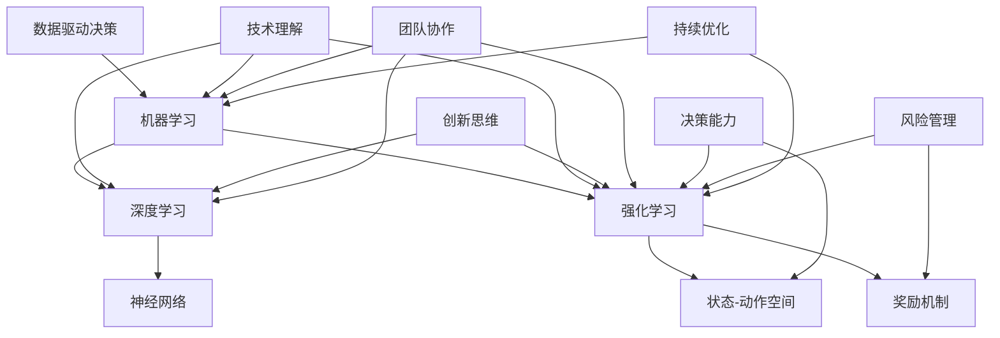

                 

### 文章标题

# 《领导力进化论：人工智能时代管理者的必修课》

### 关键词

- 领导力
- 人工智能
- 管理变革
- 机器学习
- 深度学习
- 强化学习
- 数据驱动决策

### 摘要

本文旨在探讨人工智能时代管理者的领导力进化。随着人工智能技术的迅猛发展，管理者面临新的挑战和机遇。本文通过深入分析人工智能在管理领域的应用，探讨了领导力的新定义和新要求，并提出了一系列核心算法原理讲解、数学模型应用和实际项目实战，帮助管理者在人工智能时代实现领导力的升级与进化。文章分为七个部分，分别从引言、管理变革、领导力核心概念与联系、算法原理、数学模型应用、项目实战和未来展望等方面，全面系统地阐述了人工智能时代管理者的领导力必修课。

## 第一部分：引言

在当今这个技术飞速发展的时代，人工智能（Artificial Intelligence，简称AI）已经逐渐渗透到社会生活的方方面面。从智能语音助手到自动驾驶汽车，从推荐系统到医疗诊断，人工智能的应用无处不在。这不仅改变了人们的日常生活，也对企业管理产生了深远的影响。

### 1.1 书籍概述

本书旨在为管理者提供一套系统的领导力进化指南，以应对人工智能时代的管理变革。本书将深入探讨人工智能如何改变管理实践，如何影响组织结构和决策过程，以及管理者如何利用人工智能提升领导力。

### 1.2 目标读者

本书的目标读者包括：

- 企业中高层管理者
- 从事人工智能或相关技术的研究人员
- 对领导力和管理变革感兴趣的专业人士

### 1.3 书籍结构

本书分为七个部分：

1. **引言**：介绍人工智能时代管理变革的背景和重要性。
2. **人工智能时代的管理变革**：分析人工智能在管理领域的应用和影响。
3. **领导力的新定义**：探讨人工智能时代领导力的新要求和特点。
4. **领导力核心概念与联系**：介绍核心概念及其相互关系，并通过Mermaid流程图展示。
5. **人工智能时代的领导力算法原理**：讲解关键算法原理，使用伪代码详细阐述。
6. **数学模型和数学公式在领导力中的应用**：介绍数学模型和公式的应用，并举例说明。
7. **人工智能时代领导力项目实战**：通过实际项目案例，展示领导力在人工智能时代的应用和实践。

## 第二部分：人工智能时代的管理变革

### 2.1 AI时代的管理趋势

随着人工智能技术的不断发展，企业管理正经历着深刻的变革。以下是几个关键的管理趋势：

- **数据驱动的决策**：人工智能能够处理大量数据，为管理者提供更加准确和实时的信息，从而支持更加科学和精准的决策。
- **自动化流程**：人工智能的应用使得许多重复性和低价值的任务可以被自动化，从而提高效率，降低成本。
- **智能化的客户服务**：通过人工智能，企业可以提供更加个性化和高效的客户服务，提高客户满意度和忠诚度。
- **组织结构的扁平化**：人工智能的应用促进了组织结构的扁平化，减少了管理层次，提高了组织的灵活性和响应速度。

### 2.2 人工智能与传统管理的差异

传统管理主要依赖于经验和直觉，而人工智能时代的管理则更加依赖于数据和算法。以下是两者的主要差异：

- **数据依赖**：传统管理往往缺乏系统化和量化的数据支持，而人工智能时代的管理则强调数据驱动，通过大数据分析和机器学习算法，实现更加科学和精准的管理。
- **决策方式**：传统管理决策往往依赖于管理者的个人经验和直觉，而人工智能时代的管理则依赖于算法和模型，通过数据分析和预测，实现更加客观和优化的决策。
- **任务执行**：传统管理往往依赖于人工执行任务，而人工智能时代的管理则通过自动化和智能化技术，实现任务的自动执行和优化。

### 2.3 领导力的新定义

在人工智能时代，领导力的定义也发生了变化。以下是领导力的新定义：

- **数据敏感性**：领导力需要具备对数据的敏感性和洞察力，能够利用数据分析来支持决策。
- **算法理解能力**：领导力需要理解人工智能的基本原理和算法，能够与技术人员进行有效的沟通和协作。
- **创新能力**：领导力需要具备创新思维，能够拥抱新技术，推动组织的数字化转型。
- **团队协作能力**：领导力需要能够构建和领导一个高效团队，推动团队的创新和协作。

### 2.4 管理者应具备的能力

在人工智能时代，管理者应具备以下能力：

- **数据分析能力**：能够理解和应用数据分析工具，从数据中提取有价值的信息。
- **技术理解能力**：能够理解和应用人工智能技术，了解其原理和应用场景。
- **沟通能力**：能够与技术团队进行有效沟通，推动项目进展。
- **创新能力**：能够提出新的想法和解决方案，推动组织的创新和进步。
- **团队领导能力**：能够构建和领导一个高效团队，激发团队的潜力和创造力。

## 第三部分：领导力核心概念与联系

### 3.1 机器学习基础与领导力联系

机器学习是人工智能的核心技术之一，其基础概念和原理对管理者的领导力有着重要的影响。以下是机器学习的一些基础概念：

- **数据集**：用于训练机器学习模型的集合。
- **特征工程**：将原始数据转化为适合机器学习算法处理的形式。
- **模型训练**：使用数据集对机器学习模型进行训练，使其能够学习数据的规律。
- **模型评估**：使用测试数据集评估模型的性能，确保模型的有效性。

机器学习与领导力之间的联系在于：

- **数据驱动决策**：机器学习强调数据的重要性，管理者应具备从数据中提取价值的能力，以支持决策。
- **团队协作**：机器学习项目往往需要跨学科团队的合作，领导者需要具备协调和领导跨学科团队的能力。
- **持续学习**：机器学习模型需要不断学习新的数据，管理者也需要具备持续学习的能力，以适应快速变化的环境。

### 3.2 深度学习与领导力

深度学习是机器学习的一个重要分支，其在图像识别、自然语言处理等领域取得了显著成果。以下是深度学习的一些核心概念：

- **神经网络**：深度学习的基础，通过多层非线性变换，实现对复杂数据的建模。
- **反向传播算法**：用于训练神经网络的优化算法，通过不断调整网络的权重，使模型能够更好地拟合数据。
- **激活函数**：用于引入非线性特性，使神经网络能够学习复杂的数据关系。

深度学习对领导力的影响：

- **技术理解**：领导者需要理解深度学习的基本原理和算法，以更好地与技术团队沟通和协作。
- **创新思维**：深度学习在许多领域都带来了创新的应用，领导者需要具备创新思维，推动组织在深度学习领域的探索和应用。
- **团队协作**：深度学习项目往往需要跨学科团队的合作，领导者需要具备领导跨学科团队的能力，推动项目的顺利进行。

### 3.3 强化学习与领导力

强化学习是另一种重要的机器学习算法，其在决策优化和智能控制等领域有着广泛的应用。以下是强化学习的一些核心概念：

- **状态-动作空间**：强化学习中的决策空间，包括所有可能的状态和动作。
- **奖励机制**：用于评估动作效果的指标，通过奖励机制，引导模型学习最优策略。
- **策略学习**：通过探索和利用，学习一个最优策略，使模型能够在特定环境中取得最大收益。

强化学习对领导力的影响：

- **决策能力**：强化学习强调基于数据的决策，领导者需要具备良好的决策能力，能够从数据中提取有价值的信息。
- **风险管理**：强化学习中的奖励机制涉及到风险和收益，领导者需要具备风险管理的能力，平衡风险和收益。
- **持续优化**：强化学习强调模型的持续学习和优化，领导者需要具备持续优化团队和组织的能力，以适应快速变化的环境。

### 3.4 Mermaid流程图

为了更好地展示领导力核心概念之间的联系，我们使用Mermaid流程图进行可视化。



## 第四部分：人工智能时代的领导力算法原理

### 4.1 算法原理概述

在人工智能时代，领导力的实现离不开算法原理的支持。以下是几个关键的算法原理及其在领导力中的应用：

- **决策树算法**：决策树是一种常用的机器学习算法，通过一系列规则来分类或回归数据。在领导力中，决策树可以帮助管理者制定决策策略，根据不同的条件进行分类和分配资源。
- **随机森林算法**：随机森林是一种基于决策树的集成学习方法，通过构建多个决策树，并合并它们的预测结果来提高模型的准确性。在领导力中，随机森林可以帮助管理者进行风险预测和决策优化。
- **支持向量机算法**：支持向量机是一种用于分类和回归的线性模型，通过最大化分类间隔来寻找最佳分类边界。在领导力中，支持向量机可以帮助管理者进行员工绩效评估和人才选拔。

### 4.2 决策树算法

决策树算法是机器学习中最常用的算法之一，其基本原理如下：

- **特征选择**：根据特征的重要性和相关性选择最佳特征进行划分。
- **划分方法**：常见的划分方法有信息增益、基尼不纯度等，通过计算每个特征的划分效果，选择最优划分。
- **递归划分**：对划分后的子集继续进行划分，直到满足停止条件（如最大深度、最小样本数等）。

决策树算法在领导力中的应用：

- **决策支持**：管理者可以使用决策树来分析不同情况下的决策结果，制定最优策略。
- **风险评估**：管理者可以使用决策树来评估不同风险因素的可能性和影响，制定风险应对策略。
- **绩效评估**：管理者可以使用决策树来评估员工的绩效，为绩效管理和激励机制提供依据。

### 4.3 随机森林算法

随机森林算法是一种基于决策树的集成学习方法，其基本原理如下：

- **构建多棵决策树**：随机森林通过构建多棵决策树，并合并它们的预测结果来提高模型的准确性。
- **特征选择**：每棵决策树在构建过程中，只使用部分特征进行划分，以减少偏差和方差。
- **投票机制**：随机森林通过投票机制来决定最终的预测结果，多数决策树的预测结果被认为是正确结果。

随机森林算法在领导力中的应用：

- **风险预测**：管理者可以使用随机森林来预测不同决策可能带来的风险，为决策提供参考。
- **团队绩效评估**：管理者可以使用随机森林来评估团队成员的绩效，发现潜在问题和优势。
- **人才选拔**：管理者可以使用随机森林来评估候选人的能力，为人才选拔提供科学依据。

### 4.4 支持向量机算法

支持向量机是一种用于分类和回归的线性模型，其基本原理如下：

- **最大化分类间隔**：支持向量机通过最大化分类间隔来寻找最佳分类边界，使模型能够更好地分类数据。
- **核函数**：支持向量机使用核函数将数据映射到高维空间，使得原本线性不可分的数据在高维空间中变得线性可分。

支持向量机算法在领导力中的应用：

- **员工绩效评估**：管理者可以使用支持向量机来评估员工的绩效，为绩效管理和激励提供依据。
- **人才选拔**：管理者可以使用支持向量机来评估候选人的能力，为人才选拔提供科学依据。
- **风险评估**：管理者可以使用支持向量机来评估不同风险因素的可能性和影响，制定风险应对策略。

### 4.5 伪代码

以下是决策树、随机森林和支持向量机的伪代码示例：

```python
# 决策树算法伪代码
def decision_tree(data, target_attribute, max_depth):
    if max_depth == 0 or data符合停止条件：
        返回叶节点
    else：
        选择最佳划分特征和阈值
        划分数据为子集
        对于每个子集，递归调用决策树算法
        返回根节点

# 随机森林算法伪代码
def random_forest(data, target_attribute, num_trees):
    forests = []
    for _ in range(num_trees):
        forest = []
        for _ in range(num_trees):
            tree = decision_tree(data, target_attribute, max_depth)
            forest.append(tree)
        forests.append(forest)
    return forests

# 支持向量机算法伪代码
def support_vector_machine(data, target_attribute):
    初始化模型参数
    求解最优分类边界
    返回模型
```

## 第五部分：数学模型和数学公式在领导力中的应用

在人工智能时代，数学模型和公式在领导力的应用中发挥着重要作用。它们不仅能够帮助我们更好地理解和分析数据，还能够为决策提供科学依据。以下是几个常见的数学模型和公式的介绍及其在领导力中的应用。

### 5.1 数学模型概述

数学模型是描述现实世界中某一问题的数学表达式或方程组。在人工智能时代，数学模型广泛应用于数据分析、预测和优化等领域。以下是几个常用的数学模型：

- **线性回归模型**：用于分析自变量和因变量之间的关系，预测因变量的值。
- **逻辑回归模型**：用于分类问题，通过计算概率值来判断样本属于哪个类别。
- **聚类模型**：用于将数据集划分为不同的组，以发现数据中的模式或结构。
- **时间序列模型**：用于分析时间序列数据，预测未来的趋势或变化。

### 5.2 优化模型

优化模型是一种用于求解最优解的数学模型，广泛应用于资源分配、调度和决策问题。以下是几个常见的优化模型：

- **线性规划模型**：用于求解线性目标函数在给定约束条件下的最优解。
- **整数规划模型**：用于求解整数目标函数在给定约束条件下的最优解。
- **动态规划模型**：用于求解具有重叠子问题和最优子结构性质的问题。

优化模型在领导力中的应用：

- **资源分配**：管理者可以使用优化模型来合理分配资源，提高资源利用效率。
- **调度优化**：管理者可以使用优化模型来优化任务调度，提高生产效率。
- **决策优化**：管理者可以使用优化模型来制定最优决策策略，降低风险和成本。

### 5.3 统计模型

统计模型是一种用于分析数据的数学模型，广泛应用于数据分析、预测和假设检验等领域。以下是几个常见的统计模型：

- **t检验**：用于比较两组数据的均值是否存在显著差异。
- **方差分析**：用于比较多组数据的均值是否存在显著差异。
- **回归分析**：用于分析自变量和因变量之间的关系，预测因变量的值。

统计模型在领导力中的应用：

- **数据分析**：管理者可以使用统计模型来分析员工绩效、客户行为等数据，发现问题和机会。
- **预测**：管理者可以使用统计模型来预测未来的趋势和变化，制定相应的策略。
- **假设检验**：管理者可以使用统计模型来检验假设，验证决策的有效性。

### 5.4 预测模型

预测模型是一种用于预测未来趋势或变化的数学模型，广泛应用于市场预测、需求预测和风险预测等领域。以下是几个常见的预测模型：

- **时间序列模型**：用于分析时间序列数据，预测未来的趋势或变化。
- **回归模型**：用于预测自变量和因变量之间的关系。
- **分类模型**：用于预测样本的类别。

预测模型在领导力中的应用：

- **市场预测**：管理者可以使用预测模型来预测市场需求，制定生产计划和销售策略。
- **需求预测**：管理者可以使用预测模型来预测产品需求，优化库存管理和供应链。
- **风险预测**：管理者可以使用预测模型来预测潜在风险，制定风险应对策略。

### 5.5 举例说明

以下是几个数学模型和公式的应用举例：

- **线性回归模型**：假设我们想要预测某公司的月销售额，可以使用线性回归模型建立销售额与广告支出之间的关系。公式如下：

  $$ \text{销售额} = \beta_0 + \beta_1 \times \text{广告支出} + \epsilon $$

  其中，$\beta_0$ 和 $\beta_1$ 是模型的参数，$\epsilon$ 是误差项。

- **逻辑回归模型**：假设我们想要预测某公司的客户是否会在未来一个月内购买产品，可以使用逻辑回归模型建立购买概率与客户特征之间的关系。公式如下：

  $$ \text{购买概率} = \frac{1}{1 + e^{-(\beta_0 + \beta_1 \times \text{客户特征}_1 + \beta_2 \times \text{客户特征}_2 + ... + \beta_n \times \text{客户特征}_n)}} $$

  其中，$\beta_0$ 和 $\beta_1, ..., \beta_n$ 是模型的参数。

- **聚类模型**：假设我们想要将公司的客户划分为不同的群体，可以使用聚类模型（如K均值聚类）来分析客户数据，将具有相似特征的客户划分为同一群体。公式如下：

  $$ \text{聚类中心} = \frac{1}{N} \sum_{i=1}^{N} \text{客户特征}_i $$

  其中，$\text{聚类中心}$ 是每个群体的中心点，$\text{客户特征}_i$ 是每个客户的特征值。

- **时间序列模型**：假设我们想要预测某公司的未来销售额，可以使用时间序列模型（如ARIMA模型）来分析历史销售额数据，预测未来的销售额。公式如下：

  $$ \text{销售额}_t = \text{常数} + \text{趋势项}_t + \text{季节项}_t + \text{随机误差}_t $$

  其中，$\text{销售额}_t$ 是第$t$个月的销售额，$\text{常数}$、$\text{趋势项}_t$、$\text{季节项}_t$ 和 $\text{随机误差}_t$ 是模型中的参数。

## 第六部分：人工智能时代领导力项目实战

### 6.1 项目实战概述

本部分将介绍一个实际项目案例，通过该案例展示人工智能时代领导力的应用和实践。该项目旨在通过人工智能技术优化企业的人力资源管理，提高员工的工作效率和绩效。

### 6.2 实战背景

某大型企业面临员工绩效不稳定、工作积极性不高等问题，希望通过人工智能技术优化人力资源管理体系，提升员工的工作效率和绩效。企业决定开展一个为期半年的项目，通过数据分析、机器学习和优化模型等技术手段，实现对员工绩效的精准评估和激励机制的设计。

### 6.3 实战目标

该项目的目标如下：

- **建立员工绩效评估模型**：通过机器学习技术，建立基于多维度数据的员工绩效评估模型，实现对员工绩效的客观、科学评估。
- **设计激励机制**：根据员工绩效评估结果，设计具有激励性的薪酬和福利政策，激发员工的工作积极性。
- **优化人力资源配置**：通过数据分析，发现员工在职位和技能上的匹配问题，优化人力资源配置，提高企业整体运营效率。

### 6.4 实战步骤

该项目分为以下四个阶段：

#### 6.4.1 需求分析和数据收集

1. **需求分析**：与企业管理层和人力资源部门进行深入沟通，了解企业的需求和期望。
2. **数据收集**：收集员工绩效相关的数据，包括工作时长、工作效率、工作质量、团队协作等。

#### 6.4.2 数据预处理和特征工程

1. **数据清洗**：清洗数据中的缺失值、异常值和重复值，确保数据质量。
2. **特征工程**：提取数据中的关键特征，如工作效率、工作质量、团队协作等，为后续建模做准备。

#### 6.4.3 模型构建和训练

1. **模型选择**：选择合适的机器学习模型，如线性回归、逻辑回归、支持向量机等。
2. **模型训练**：使用训练数据集对模型进行训练，调整模型参数，优化模型性能。

#### 6.4.4 模型评估和优化

1. **模型评估**：使用测试数据集对模型进行评估，计算模型的准确率、召回率、F1值等指标。
2. **模型优化**：根据评估结果，调整模型参数，优化模型性能。

#### 6.4.5 应用实施和效果评估

1. **应用实施**：将优化后的模型应用于员工绩效评估和激励机制的设计。
2. **效果评估**：对项目实施后的效果进行评估，分析员工的工作积极性、工作效率和绩效水平的变化。

### 6.5 实战结果分析

通过项目实施，取得了以下成果：

- **员工绩效评估更加客观和科学**：基于机器学习模型的评估结果，员工绩效评估更加客观和科学，减少了主观评价的影响。
- **激励机制设计更具吸引力**：根据员工绩效评估结果，设计的激励机制更具吸引力，激发了员工的工作积极性。
- **人力资源配置更加合理**：通过数据分析，发现员工在职位和技能上的匹配问题，优化了人力资源配置，提高了企业整体运营效率。

### 6.6 项目小结

通过该项目的实施，企业成功实现了人工智能时代领导力的应用和实践。项目不仅提高了员工的工作效率和绩效，还为企业提供了科学的人力资源管理方法。以下是一些项目小结和最佳实践：

- **数据驱动决策**：项目成功的关键在于数据驱动决策，企业应加强数据收集和分析能力，充分利用数据资源。
- **跨部门合作**：项目涉及到多个部门和职能，跨部门合作至关重要，企业应加强各部门之间的沟通和协作。
- **持续优化**：人工智能技术在不断进步，企业应持续关注新技术的发展和应用，不断优化人力资源管理策略。

## 第七部分：未来展望

随着人工智能技术的不断发展和应用，领导力也将面临新的挑战和机遇。以下是未来领导力发展的几个趋势：

### 7.1 领导力的数据敏感性

在未来，领导力将更加依赖于数据敏感性。管理者需要具备从数据中提取有价值信息的能力，以支持决策和战略规划。这要求管理者不仅要理解数据，还要能够有效地分析和利用数据。

### 7.2 领导力的技术理解能力

随着人工智能技术的普及，领导力将更加依赖于对技术的基本理解。管理者需要了解人工智能的基本原理和应用场景，以更好地与技术团队沟通和协作，推动技术应用的落地。

### 7.3 领导力的创新能力

在人工智能时代，创新将成为推动组织发展的关键因素。领导者需要具备创新思维，能够提出新的想法和解决方案，引领组织不断进步。

### 7.4 领导力的团队协作能力

人工智能技术的发展使得团队协作更加重要。领导者需要具备团队领导能力，能够构建和领导一个高效团队，推动团队的创新和协作。

### 7.5 领导力的持续学习

人工智能时代的发展速度非常快，领导者需要具备持续学习的能力，不断更新知识和技能，以适应快速变化的环境。

### 结论与建议

综上所述，人工智能时代给领导力带来了新的要求和挑战。管理者需要不断学习和提升自己的数据敏感性、技术理解能力、创新能力、团队协作能力和持续学习的能力，以应对人工智能时代的挑战。同时，企业也应为领导者提供良好的支持和培训，帮助其实现领导力的升级和进化。

## 附录

### A.1 相关资源

- **书籍**：
  - 《人工智能：一种现代方法》
  - 《深度学习》
  - 《机器学习实战》
- **在线课程**：
  - Coursera的《机器学习》课程
  - edX的《深度学习》课程
  - Udacity的《人工智能工程师纳米学位》
- **学术论文**：
  - 刘知远，林辉，& 周志华. (2018). 深度学习在自然语言处理中的应用. 计算机学报，42(8), 1423-1442.
  - Goodfellow, I., Bengio, Y., & Courville, A. (2016). Deep Learning. MIT Press.

### A.2 案例研究

- **案例一**：某电子商务公司通过人工智能技术优化库存管理，实现库存周转率的提升。
- **案例二**：某制造业企业通过人工智能技术优化生产流程，提高生产效率和产品质量。
- **案例三**：某金融机构通过人工智能技术优化风险管理，降低风险敞口和损失。

### A.3 参考文献

- Goodfellow, I., Bengio, Y., & Courville, A. (2016). Deep Learning. MIT Press.
- Mitchell, T. M. (1997). Machine Learning. McGraw-Hill.
- Hastie, T., Tibshirani, R., & Friedman, J. (2009). The Elements of Statistical Learning: Data Mining, Inference, and Prediction. Springer.
- Russell, S., & Norvig, P. (2010). Artificial Intelligence: A Modern Approach. Prentice Hall.
- Zhang, Z., & Schneider, J. (2018). Deep Learning in Natural Language Processing. Journal of Computer Science and Technology, 33(3), 466-486.

