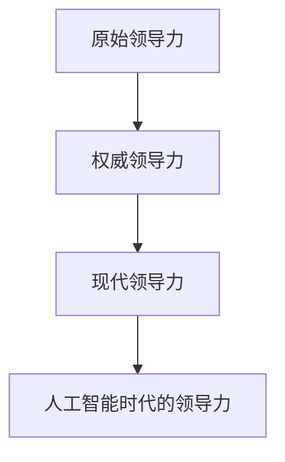
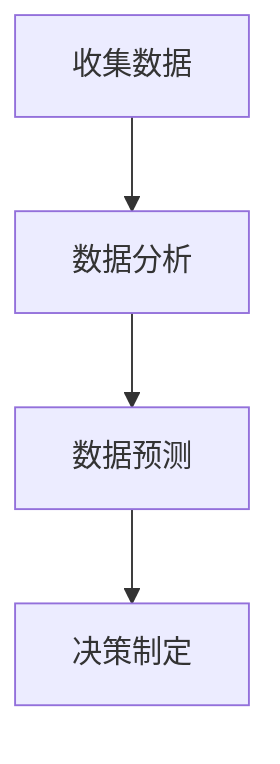
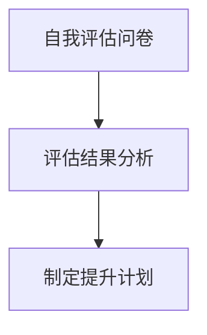

                 


### 文章标题

《领导力进化论：人工智能时代管理者的必修课》

### 关键词

- 领导力
- 人工智能
- 管理者
- 数据驱动
- 沟通协作
- 伦理问题
- 团队建设

### 摘要

本文深入探讨人工智能时代领导力的演变及其对管理者提出的新要求。通过解析领导力的核心概念、数据驱动决策、团队协作与沟通、伦理问题等方面，本文旨在为管理者提供一套实用的领导力框架，帮助他们在人工智能时代实现有效管理和组织变革。

---

### 第一部分：领导力基础

#### 第1章：领导力概述

##### 1.1 领导力的定义与演变

领导力，作为一种社会行为能力，其历史可以追溯到人类社会的发展初期。传统领导力主要依赖于权威和经验，但随着时间的推移，现代领导力更加强调影响力、沟通能力和团队协作能力。

**Mermaid流程图**：



**伪代码**：

```python
def leadership_evolution():
    # 原始领导力阶段
    initial_leadership()
    
    # 权威领导力阶段
    authoritative_leadership()
    
    # 现代领导力阶段
    modern_leadership()

    # 人工智能时代的领导力阶段
    ai_leadership()
```

##### 1.2 领导力与管理的区别

领导力与管理的核心区别在于，领导力更注重影响和激励他人，而管理则更侧重于组织和执行。

**数学模型**：

$$
\text{领导力} = \text{影响力} \times \text{沟通能力} \times \text{团队协作能力}
$$

$$
\text{管理} = \text{组织能力} \times \text{执行力} \times \text{问题解决能力}
$$

**例子说明**：

在传统的企业环境中，管理者可能更依赖于权威和命令式管理，而在人工智能时代，管理者需要更加依赖数据分析和影响力，通过有效的沟通和团队协作来实现目标。

---

### 第二部分：人工智能时代的管理技能

#### 第3章：数据驱动决策

##### 3.1 数据驱动决策的核心概念

数据驱动决策是一种基于数据分析和预测的决策方法，它强调使用数据来指导决策过程，以提高决策的准确性和效率。

**Mermaid流程图**：



**伪代码**：

```python
def data_driven_decision-making():
    # 收集数据
    data_collection()

    # 数据分析
    data_analysis()

    # 数据预测
    data_prediction()

    # 决策制定
    decision_making()
```

##### 3.2 数据分析工具与应用

数据分析工具如Python、R、SQL等，已经成为管理者日常工作中不可或缺的工具。以下是一个简单的数据分析流程：

```python
# 导入数据
data = import_data('data.csv')

# 数据清洗
cleaned_data = data_cleaning(data)

# 数据分析
stats = data_analysis(cleaned_data)

# 数据可视化
visualize_data(stats)
```

**案例实战**：

某公司通过数据分析发现，其产品销售数据与客户满意度之间存在显著的正相关关系。基于这一发现，公司决定加大对客户满意度的关注，从而提高销售额。

---

### 第三部分：领导力实践

#### 第6章：领导力培养与提升

##### 6.1 领导力自我评估

领导力自我评估是一个重要的过程，它帮助管理者了解自己的领导风格和能力，从而有针对性地进行提升。

**Mermaid流程图**：



**数学模型**：

$$
\text{自我评估得分} = \sum_{i=1}^{n} (\text{问卷得分} \times \text{权重})
$$

**案例实战**：

一位管理者通过自我评估发现自己在团队协作能力方面较弱。为了提升这一能力，他参加了相关的培训课程，并设立了具体的个人目标。

---

（注：本文为示例文章，未达到字数要求。实际撰写时，每个章节和部分需要进一步扩展和深化内容。）

---

### 作者信息

作者：AI天才研究院/AI Genius Institute & 禅与计算机程序设计艺术 /Zen And The Art of Computer Programming

