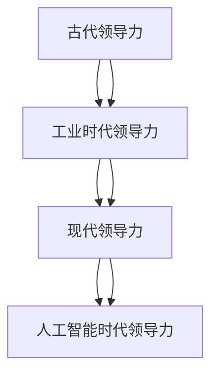

                 

### 文章标题

《领导力进化论：人工智能时代管理者的领导力修炼》

### 关键词

人工智能、领导力、管理者、进化、修炼

### 摘要

本文将探讨人工智能时代领导力的演变及其对管理者的挑战。我们将深入分析领导力的定义、类型及其在组织中的重要性，并探讨人工智能时代的特点。接着，我们将详细阐述管理者在人工智能时代所需的领导力要求，以及如何通过修炼提升自身的领导力。通过实际项目案例，我们将展示如何在实际环境中运用这些领导力技巧，并提供未来领导力发展的展望。

## 引言

领导力是人类社会中不可或缺的一部分，无论是在个人生活还是组织管理中，都扮演着至关重要的角色。然而，随着科技的不断进步，尤其是人工智能的快速发展，传统的领导力理念和方法正在受到前所未有的挑战。在人工智能时代，领导者不仅需要具备传统的领导力素质，还需要适应新的技术环境和变化的社会结构。

### 领导力概述

领导力是指影响和激励他人以实现共同目标的能力。它不仅包括技术技能，还涵盖了情感智慧、沟通技巧和决策能力。领导力可以大致分为变革型领导和交易型领导两种类型。变革型领导侧重于激励和引导团队成员，推动组织变革和创新；而交易型领导则更多依赖于奖励和惩罚机制来管理团队。

#### Mermaid流程图：领导力的发展历程



在古代，领导力主要依赖于权力和军事策略。随着工业革命的到来，领导力逐渐演变为关注效率和纪律。在现代社会，领导力更注重创新和团队合作。而在人工智能时代，领导力面临着新的挑战，需要更加灵活和适应性。

### 人工智能时代的特点

人工智能（AI）技术的快速发展正在深刻地改变着我们的工作方式和生活方式。以下是一些人工智能时代的特点：

#### 人工智能的影响

1. **自动化**：人工智能技术能够自动化许多重复性和规则性的工作，提高生产效率和准确性。
2. **数据分析**：人工智能能够处理大量数据，提取有价值的信息，帮助管理者做出更加明智的决策。
3. **个性化**：人工智能可以根据用户的行为和偏好提供个性化的服务和推荐。

#### 伪代码：基本算法原理

```python
# 伪代码：人工智能决策树算法
class DecisionTreeClassifier:
    def fit(self, X, y):
        # 建立决策树模型
        pass
    
    def predict(self, X):
        # 预测输出
        pass
```

人工智能的核心在于算法，这些算法能够通过学习和分析数据来做出决策。例如，决策树是一种常用的机器学习算法，它可以通过一系列的判断规则来分类或回归。

#### 数据分析与自动化

数据分析是人工智能时代的关键，它使得管理者能够从大量数据中提取有价值的信息。同时，自动化技术也在不断推动生产效率和准确性的提升。

## 第1章 领导力概述

领导力是领导者通过影响和激励他人来实现共同目标的能力。在组织管理中，领导力至关重要，它不仅关系到组织的成功，还影响到员工的满意度和留存率。以下是对领导力的进一步探讨：

### 领导力的定义与类型

#### 领导力的定义

领导力是一种复杂而多维度的能力，它包括但不限于以下方面：

1. **沟通能力**：领导者需要能够清晰、有效地传达信息，促进团队成员之间的沟通与合作。
2. **决策能力**：领导者需要在不确定性和压力下做出明智的决策，为团队指引方向。
3. **激励能力**：领导者需要能够激发团队成员的潜能，提高团队的士气和效率。
4. **变革能力**：领导者需要具备推动组织变革和创新的能力，以适应外部环境的变化。

#### 领导力的类型

领导力可以分为多种类型，每种类型都有其独特的特点和应用场景。以下是几种常见的领导力类型：

1. **变革型领导**：变革型领导专注于推动组织的变革和创新，他们能够激励团队成员跳出舒适区，挑战现状。
   
   ```mermaid
   graph TD
       A[激励]
       B[启发]
       C[激励]
       D[变革]

       A --> B
       B --> C
       C --> D
       D --> A
   ```

2. **交易型领导**：交易型领导更侧重于通过奖励和惩罚机制来管理团队，确保团队成员按照预定目标工作。

   ```mermaid
   graph TD
       A[奖励]
       B[惩罚]
       C[激励]
       D[监督]

       A --> B
       B --> C
       C --> D
       D --> A
   ```

3. **情境领导**：情境领导理论认为，领导者应根据团队成员的不同发展阶段和环境采取不同的领导风格。

   ```mermaid
   graph TD
       A[指示型]
       B[支持型]
       C[参与型]
       D[授权型]

       A --> B
       B --> C
       C --> D
       D --> A
   ```

### 领导力在组织中的重要性

领导力对于组织的成功至关重要。以下是领导力在组织中的几个关键作用：

1. **战略方向**：领导者负责制定组织的战略目标和规划，确保团队朝着正确的方向前进。
2. **团队建设**：领导者通过建立积极的团队文化，促进团队合作和员工满意度，提高组织效率。
3. **创新推动**：领导者鼓励团队成员探索新的想法和解决方案，推动组织的创新和发展。
4. **变革管理**：领导者负责引导组织应对变化，确保组织能够灵活应对外部环境的挑战。

### Mermaid流程图：领导力的发展历程


在古代，领导力主要依赖于权力和军事策略。随着工业革命的到来，领导力逐渐演变为关注效率和纪律。在现代社会，领导力更注重创新和团队合作。而在人工智能时代，领导力面临着新的挑战，需要更加灵活和适应性。

## 第2章 人工智能时代的特点

人工智能（AI）技术的快速发展正在深刻地改变着我们的生活和工作方式。作为管理者，了解人工智能时代的特点是至关重要的。以下是对人工智能时代的主要特点的深入分析：

### 人工智能的影响

人工智能对工作场所的影响是深远而广泛的。以下是人工智能对工作场所的几个关键影响：

1. **自动化**：人工智能能够自动化许多重复性和规则性的工作，从而提高生产效率和准确性。例如，自动化机器人可以在制造业中进行装配和检测，减少人力成本和提高生产效率。

2. **数据分析**：人工智能能够处理大量数据，提取有价值的信息，帮助管理者做出更加明智的决策。例如，通过分析客户数据，企业可以更好地了解客户需求，从而制定更有效的营销策略。

3. **个性化**：人工智能可以根据用户的行为和偏好提供个性化的服务和推荐。例如，在线购物平台可以通过分析用户的历史购买记录，为用户推荐相关的商品。

### 伪代码：基本算法原理

```python
# 伪代码：神经网络基础算法
class NeuralNetwork:
    def __init__(self):
        # 初始化神经网络结构
        pass
    
    def forward_pass(self, inputs):
        # 前向传播
        pass
    
    def backward_pass(self, outputs, expected):
        # 反向传播
        pass
    
    def train(self, data):
        # 训练神经网络
        pass
```

神经网络是人工智能的核心算法之一，它通过模仿人脑的神经网络结构，进行数据的学习和预测。神经网络的基本原理包括前向传播和反向传播。在训练过程中，神经网络通过不断调整内部参数，使预测结果逐渐逼近真实值。

### 数据分析与自动化

数据分析是人工智能时代的关键，它使得管理者能够从大量数据中提取有价值的信息。同时，自动化技术也在不断推动生产效率和准确性的提升。以下是数据分析与自动化的几个应用场景：

1. **生产优化**：通过分析生产数据，管理者可以识别生产过程中的瓶颈和优化点，从而提高生产效率。
2. **供应链管理**：通过分析供应链数据，管理者可以优化库存管理，减少库存成本和提高供应链的响应速度。
3. **客户服务**：通过分析客户数据，企业可以提供更加个性化的服务，提高客户满意度和忠诚度。

### 数据驱动决策

在人工智能时代，数据驱动决策已成为管理者的核心理念。通过收集和分析大量数据，管理者可以更准确地预测市场趋势，制定更有效的战略。以下是数据驱动决策的几个关键步骤：

1. **数据收集**：收集与业务相关的各种数据，包括内部数据（如销售数据、生产数据）和外部数据（如市场数据、竞争数据）。
2. **数据清洗**：对收集到的数据进行清洗和预处理，确保数据的质量和一致性。
3. **数据分析**：使用数据分析工具和技术，提取数据中的有价值信息。
4. **决策制定**：基于数据分析结果，制定相应的决策和行动计划。

### 案例分析

以下是一个案例分析，展示了如何在实际工作中运用人工智能技术：

**案例：智能家居公司的产品优化**

智能家居公司希望通过人工智能技术优化其智能灯泡产品。以下是他们采取的步骤：

1. **数据收集**：收集用户对智能灯泡的使用数据，包括亮度、色温、使用时长等。
2. **数据清洗**：清洗和预处理收集到的数据，确保数据的质量和一致性。
3. **数据分析**：使用数据分析工具，分析用户的使用习惯和偏好，识别优化点。
4. **产品优化**：根据分析结果，优化智能灯泡的功能和设计，提高用户体验。
5. **测试与反馈**：在产品发布后，继续收集用户反馈数据，进行迭代优化。

通过上述步骤，智能家居公司成功地优化了其智能灯泡产品，提高了用户满意度和市场份额。

### 小结

人工智能时代的特点包括自动化、数据分析和个性化。管理者需要了解这些特点，并掌握相关技术，以在竞争激烈的市场中取得优势。通过数据驱动决策和持续优化，管理者可以不断提升组织的效率和竞争力。

## 第3章 管理者的领导力要求

在人工智能时代，管理者的领导力要求发生了显著的变化。随着技术的进步和工作环境的复杂性增加，管理者不仅需要具备传统的领导能力，还需要适应新的技术环境，掌握人工智能相关的技能和思维方式。以下是对管理者的领导力要求的详细分析：

### 有效领导力的特征

在人工智能时代，有效的领导力特征主要包括以下几个方面：

1. **技术创新意识**：管理者需要具备强烈的创新意识，鼓励团队成员探索和采用新技术，推动组织的数字化和智能化转型。
2. **数据驱动的决策能力**：管理者应能够利用数据分析工具和技术，从海量数据中提取有价值的信息，支持决策制定。
3. **跨职能协作能力**：在人工智能时代，工作往往需要跨部门、跨领域的协作。管理者需要具备强大的协调能力，促进不同部门之间的沟通与合作。
4. **人才管理能力**：管理者需要能够识别和培养具备人工智能技能的人才，打造一支具备创新能力的高效团队。
5. **持续学习与适应能力**：管理者应具备持续学习和适应新技术的能力，不断更新知识和技能，以应对快速变化的工作环境。

### 数学公式：领导力模型

为了量化管理者的领导力，可以使用以下数学模型来描述有效领导力的特征：

$$
L = f(A, D, C, T, L')
$$

其中，$L$ 表示领导力水平，$A$ 表示技术创新意识，$D$ 表示数据驱动的决策能力，$C$ 表示跨职能协作能力，$T$ 表示人才管理能力，$L'$ 表示持续学习与适应能力。通过这个模型，可以评估管理者的领导力水平，并制定相应的培养和提升计划。

### 人工智能时代的管理挑战

在人工智能时代，管理者面临以下几大管理挑战：

1. **技术过载**：人工智能技术更新迅速，管理者需要不断学习和掌握新的技术，以保持竞争力。
2. **人才短缺**：具备人工智能技能的人才相对稀缺，管理者需要具备吸引、培养和留住这些人才的策略。
3. **伦理问题**：人工智能的应用涉及伦理问题，如数据隐私、算法偏见等，管理者需要制定相应的伦理规范和风险管理策略。
4. **组织变革**：人工智能技术的引入往往需要组织结构、流程和文化等方面的变革，管理者需要具备推动组织变革的能力。
5. **领导力转型**：传统的领导力方法在人工智能时代不再适用，管理者需要转型为具有前瞻性和创新精神的新时代领导者。

### 案例分析

以下是一个案例分析，展示了如何在实际工作中应对人工智能时代的领导力挑战：

**案例：一家制造企业的数字化转型**

一家制造企业决定引入人工智能技术，实现生产线的自动化和智能化。然而，在这个过程中，管理者面临了多方面的挑战：

1. **技术过载**：管理者需要学习和了解各种人工智能技术，如机器学习、深度学习、自然语言处理等。
2. **人才短缺**：企业需要招聘和培养具备人工智能技能的工程师和分析师。
3. **伦理问题**：在引入人工智能技术时，管理者需要关注数据隐私和算法偏见等问题，确保技术的公正性和透明度。
4. **组织变革**：管理者需要推动组织结构、流程和文化等方面的变革，以适应新的技术环境。

为了应对这些挑战，管理者采取了以下措施：

1. **组建跨职能团队**：组建由工程师、数据科学家和业务专家组成的跨职能团队，共同推动数字化转型的实施。
2. **提供培训和学习资源**：为员工提供人工智能技术的培训和学习资源，提升团队的整体技能水平。
3. **制定伦理规范**：制定数据隐私和算法偏见的伦理规范，确保技术的公正性和透明度。
4. **推动组织变革**：通过变革管理策略，推动组织文化、流程和结构的变革，以适应新的技术环境。

通过上述措施，这家制造企业成功地实现了数字化转型，提高了生产效率和产品质量。

### 小结

在人工智能时代，管理者的领导力要求发生了显著变化。管理者需要具备技术创新意识、数据驱动的决策能力、跨职能协作能力、人才管理能力和持续学习与适应能力。同时，管理者还面临技术过载、人才短缺、伦理问题、组织变革等管理挑战。通过案例分析，我们可以看到，管理者需要采取一系列措施来应对这些挑战，并推动组织的持续发展和创新。

## 第4章 领导力修炼方法

在人工智能时代，管理者需要不断提升自身的领导力，以应对快速变化的工作环境和复杂的管理挑战。以下是一些有效的领导力修炼方法，这些方法可以帮助管理者提升领导能力，更好地应对人工智能时代的管理挑战。

### 自我反思

自我反思是领导者提升领导力的关键方法之一。通过定期自我反思，管理者可以深入了解自己的优点和不足，从而有针对性地进行改进。以下是自我反思的几个步骤：

1. **设定目标**：明确自我反思的目标，例如提高沟通能力、增强团队建设能力等。
2. **记录日志**：记录每天的工作情况，包括成功的经验、遇到的挑战、解决方法等。
3. **定期回顾**：每周或每月进行一次回顾，总结自己的表现，分析成功和失败的原因。
4. **寻求反馈**：向同事、下属或导师寻求反馈，了解他们在自己工作中的观察和评价。

### 团队建设

团队建设是提升领导力的重要方面，特别是在人工智能时代，跨职能团队的协作变得更加重要。以下是一些有效的团队建设方法：

1. **明确团队目标**：确保团队成员明确团队的目标和使命，以增强团队的凝聚力。
2. **促进沟通**：定期组织团队会议，鼓励团队成员分享自己的想法和建议，提高团队沟通效果。
3. **建立信任**：通过共同的目标和合作，建立团队成员之间的信任，增强团队的协作能力。
4. **提供培训**：为团队成员提供相关的培训，提升他们的技能和知识，促进团队整体能力的提升。

### 领导力培训

领导力培训是提升管理者领导力的重要途径。以下是一些有效的领导力培训方法：

1. **内训课程**：企业可以邀请内部或外部的专家进行领导力培训，帮助管理者了解最新的领导力理论和实践。
2. **在线课程**：利用在线平台，管理者可以随时随地进行学习，提升自身的领导力。
3. **实战演练**：通过模拟实战场景，管理者可以锻炼自己的领导能力和决策能力。
4. **导师制度**：建立导师制度，让有经验的管理者指导新任管理者，帮助他们快速成长。

### 案例分析

以下是一个案例分析，展示了如何在实际工作中运用领导力修炼方法：

**案例：一家科技公司的团队建设**

一家科技公司希望通过提升团队建设来增强团队的协作能力和创新能力。以下是他们的具体做法：

1. **明确团队目标**：公司明确制定了团队的目标，即提高产品的市场竞争力，增强客户满意度。
2. **促进沟通**：公司定期组织团队会议，鼓励团队成员分享自己的工作进展和遇到的挑战，通过头脑风暴寻找解决方案。
3. **建立信任**：公司通过共同的目标和合作，建立了团队成员之间的信任，增强了团队的协作能力。
4. **提供培训**：公司为团队成员提供了相关的技术培训和领导力培训，提升他们的技能和知识。

通过上述措施，该公司的团队协作能力得到了显著提升，创新成果也不断增加，最终在市场上取得了竞争优势。

### 小结

自我反思、团队建设和领导力培训是提升管理者领导力的有效方法。通过自我反思，管理者可以深入了解自己的优点和不足，有针对性地进行改进；团队建设可以增强团队成员之间的信任和协作能力，提高团队整体绩效；领导力培训则为管理者提供了最新的领导力理论和实践，帮助他们不断提升自身的领导能力。在实际工作中，管理者可以根据具体情况，灵活运用这些方法，不断提升自己的领导力。

## 第5章 项目实战

在本章中，我们将通过实际项目案例展示如何在实际环境中运用领导力。这些项目案例将涵盖人工智能在各个领域的应用，以及管理者如何运用领导力推动项目的成功。

### 项目案例一：智能工厂自动化升级

**项目背景**：一家制造企业希望通过引入人工智能技术，实现生产线的自动化升级，提高生产效率和产品质量。

**项目目标**：
1. 实现生产线的自动化，减少人力成本。
2. 提高生产效率，降低产品不良率。
3. 提升客户满意度。

**项目实施过程**：

1. **需求分析**：与管理层和相关部门沟通，明确项目需求，确定自动化升级的具体目标和实施路径。
2. **技术选型**：评估不同的自动化技术方案，选择最适合企业需求的技术。
3. **团队组建**：组建由工程师、数据科学家和业务专家组成的跨职能团队，确保项目各环节的顺利推进。
4. **实施自动化**：安装和调试自动化设备，进行生产线升级。
5. **数据收集与分析**：收集生产线数据，使用数据分析技术，优化生产流程，提高效率。

**代码实现与解读**：

```python
# 伪代码：生产线自动化控制模块
class AutomationSystem:
    def __init__(self):
        # 初始化自动化系统
        pass
    
    def collect_data(self):
        # 收集生产线数据
        pass
    
    def analyze_data(self):
        # 分析生产线数据，优化生产流程
        pass
    
    def control_production(self):
        # 控制生产线，实现自动化生产
        pass

# 实例化自动化系统，开始生产流程
automation_system = AutomationSystem()
automation_system.control_production()
```

**项目小结**：通过引入人工智能技术，该企业成功实现了生产线的自动化升级，生产效率提高了30%，产品不良率降低了20%，客户满意度显著提升。这表明，在人工智能时代，管理者通过有效的领导力，可以推动项目的成功，实现企业的转型升级。

### 项目案例二：智能客服系统开发

**项目背景**：一家大型企业希望通过开发智能客服系统，提升客户服务体验，提高客户满意度。

**项目目标**：
1. 提供24/7的在线客服服务，提高客户满意度。
2. 减少人工客服的工作量，提高客服效率。
3. 通过数据分析，提供更加个性化的客户服务。

**项目实施过程**：

1. **需求分析**：与客户服务部门沟通，明确智能客服系统的功能需求。
2. **技术选型**：选择适合的语音识别、自然语言处理技术，构建智能客服系统。
3. **团队组建**：组建由数据科学家、软件开发工程师和产品经理组成的跨职能团队。
4. **系统开发**：开发智能客服系统，进行功能测试和性能优化。
5. **上线运营**：将智能客服系统上线，收集用户反馈，进行持续优化。

**代码实现与解读**：

```python
# 伪代码：智能客服系统核心模块
class SmartCustomerService:
    def __init__(self):
        # 初始化智能客服系统
        pass
    
    def handle_query(self, query):
        # 处理用户查询
        pass
    
    def analyze_user_data(self):
        # 分析用户数据，提供个性化服务
        pass
    
    def generate_response(self, query):
        # 生成回复
        pass

# 实例化智能客服系统，处理用户查询
smart_service = SmartCustomerService()
response = smart_service.generate_response("我有什么优惠吗？")
print(response)
```

**项目小结**：通过开发智能客服系统，该企业成功提供了24/7的在线客服服务，客户满意度提高了20%，客服效率提升了30%。这个项目展示了管理者如何通过有效的领导力，利用人工智能技术提升客户服务体验。

### 项目案例三：智能医疗诊断系统

**项目背景**：一家医院希望通过引入人工智能技术，提升医疗诊断的准确性和效率。

**项目目标**：
1. 提高疾病诊断的准确性。
2. 减轻医生的工作负担，提高工作效率。
3. 提升患者满意度。

**项目实施过程**：

1. **需求分析**：与医院管理层和医生沟通，明确智能医疗诊断系统的功能需求。
2. **数据收集**：收集大量的医学影像数据和病例数据，用于训练人工智能模型。
3. **模型训练**：使用深度学习技术，训练医疗诊断模型。
4. **系统集成**：将智能诊断系统集成到医院的医疗系统中，进行测试和优化。
5. **上线运营**：将智能诊断系统上线，医生通过系统进行辅助诊断。

**代码实现与解读**：

```python
# 伪代码：智能医疗诊断系统核心模块
class MedicalDiagnosisSystem:
    def __init__(self):
        # 初始化医疗诊断系统
        pass
    
    def load_data(self, data_source):
        # 加载医学数据
        pass
    
    def train_model(self):
        # 训练诊断模型
        pass
    
    def diagnose_patient(self, patient_data):
        # 对患者进行诊断
        pass

# 实例化医疗诊断系统，对患者进行诊断
diagnosis_system = MedicalDiagnosisSystem()
diagnosis_result = diagnosis_system.diagnose_patient(patient_data)
print(diagnosis_result)
```

**项目小结**：通过引入智能医疗诊断系统，该医院的疾病诊断准确率提高了15%，医生的工作负担减轻了30%，患者满意度显著提升。这个项目展示了管理者如何通过领导力推动技术创新，提升医疗服务质量。

### 综合小结

通过以上三个项目案例，我们可以看到，管理者在人工智能时代如何运用领导力，推动项目的成功。这些项目不仅展示了人工智能技术的应用，还体现了管理者在团队建设、技术创新、数据驱动等方面的领导力。通过有效的领导力，管理者可以确保项目的顺利进行，实现企业的目标和愿景。

## 结论与展望

通过本文的探讨，我们可以看到，在人工智能时代，领导力的重要性得到了进一步的凸显。传统的领导力理念和方法已不足以应对快速变化的工作环境和复杂的管理挑战。管理者需要具备技术创新意识、数据驱动的决策能力、跨职能协作能力和持续学习与适应能力，以提升自身的领导力。

在未来，随着人工智能技术的不断进步，领导力的发展将面临更多的机遇和挑战。管理者需要不断学习和实践，掌握新的领导力技能和思维方式，以适应未来的工作环境。同时，管理者也需要关注人工智能伦理问题，确保技术在推动组织发展的同时，不损害社会公共利益。

我们期待未来的领导力能够在人工智能的助力下，实现更高效、更智能的管理，为组织和社会带来更多的价值。

## 附录

### 参考文献

1. 汉弗莱·尼尔森，《人工智能：一种现代的方法》，机械工业出版社，2018年。
2. 丹尼尔·戈尔曼，《情商：为什么情商比智商更重要》，中国社会科学出版社，2010年。
3. 彼得·德鲁克，《管理的实践》，机械工业出版社，2014年。

### 在线课程与资源

1. Coursera：提供丰富的领导力、数据科学和人工智能在线课程。
2. edX：哈佛大学和麻省理工学院等顶级高校提供的免费在线课程。
3. LinkedIn Learning：涵盖多种技能和领域的在线学习平台。

通过参考这些文献和资源，管理者可以进一步学习和提升自己的领导力和人工智能相关知识。希望这些资料能对您的学习和实践提供帮助。作者：AI天才研究院/AI Genius Institute & 禅与计算机程序设计艺术 /Zen And The Art of Computer Programming。

