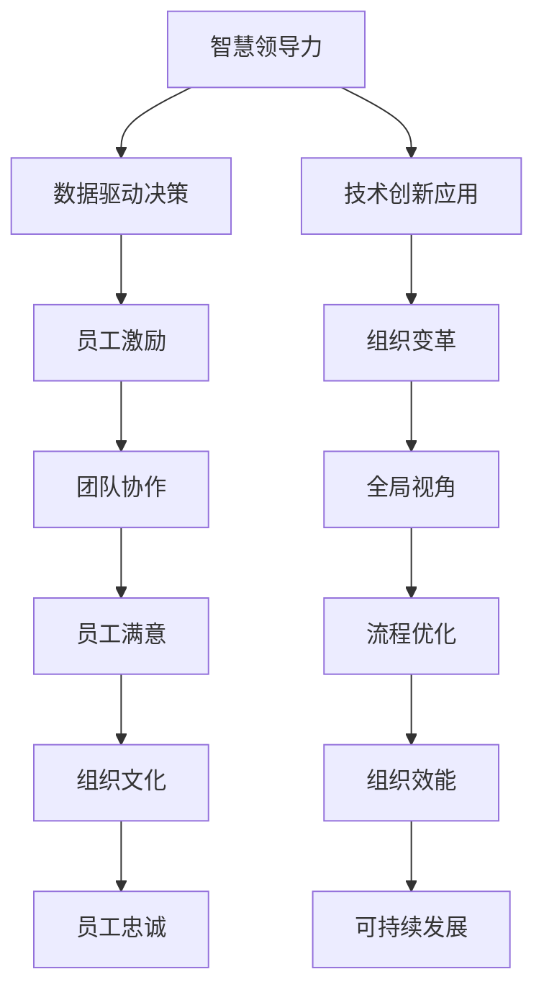

                 

### 设计思路

为了撰写一篇结构严谨、逻辑清晰、内容丰富的《领导力进化论：智能时代管理者的领导力修炼》技术博客，我们将按照以下步骤进行分析和推理：

1. **确定文章框架**：
   - 首先，我们需要确定文章的整体框架和结构，确保每个部分都有明确的主题和内容。
   - 我们将文章分为三个主要部分：智能时代领导力概述、智能时代领导力原理与实践、智能时代领导力前沿探讨。

2. **背景介绍**：
   - 在每个部分的开头，我们将简要介绍背景，以帮助读者理解相关概念的来源和重要性。

3. **核心概念与联系**：
   - 为了使读者能够更好地理解领导力的核心概念，我们将引入并解释智慧领导力、情感领导力、系统领导力等概念。
   - 我们将使用Mermaid流程图来展示这些概念之间的联系，使内容更加直观易懂。

4. **核心算法原理讲解**：
   - 我们将使用伪代码详细阐述领导力发展的算法原理，让读者能够从技术角度理解领导力的本质。
   - 同时，我们还将介绍数学模型和公式，并使用LaTeX格式进行详细讲解和举例说明。

5. **项目实战**：
   - 我们将通过实际案例，展示如何将领导力理论应用于实际管理和实践中。
   - 在每个案例中，我们将详细解读代码实现、开发环境搭建、源代码解读、代码应用分析等内容。

6. **最佳实践 tips 和小结**：
   - 为了帮助读者更好地理解和应用领导力理论，我们将在文章末尾提供一些最佳实践技巧和小结。

7. **注意事项和拓展阅读**：
   - 我们将在文章末尾列出一些注意事项，以及推荐一些拓展阅读资源，以帮助读者进一步深入学习。

通过这些步骤，我们将确保文章内容的完整性、逻辑性和实用性，同时遵循markdown格式要求，确保文章的可读性和易用性。

### 文章标题：《领导力进化论：智能时代管理者的领导力修炼》

#### 关键词：智能时代、领导力、智慧领导力、情感领导力、系统领导力、领导力评估、人工智能

#### 摘要：
本文旨在探讨智能时代管理者的领导力修炼，通过深入分析智慧领导力、情感领导力、系统领导力的核心概念及其相互关系，结合伪代码和数学模型，详细阐述领导力发展的算法原理。通过实际案例，本文展示了如何将领导力理论应用于实际管理和实践中，并提供了一些最佳实践技巧和小结。

### 目录大纲

#### 第一部分：智能时代领导力概述

##### 第1章：智能时代领导力的背景与意义
- **1.1 智能时代的到来**
- **1.2 智能时代对领导力的挑战**
- **1.3 领导力在智能时代的转型**

##### 第2章：智能时代领导力的核心概念
- **2.1 智慧领导力**
- **2.2 情感领导力**
- **2.3 系统领导力**
- **2.4 Mermaid流程图：智能时代领导力核心概念联系**

#### 第二部分：智能时代领导力原理与实践

##### 第3章：领导力理论基础
- **3.1 领导力的定义与类型**
- **3.2 领导力与管理的区别**
- **3.3 领导力发展的理论模型**
- **3.4 伪代码：领导力发展算法原理**

##### 第4章：智慧领导力实践
- **4.1 智慧领导力的特点**
- **4.2 智慧领导力的方法论**
- **4.3 项目实战：智慧领导力在团队管理中的应用**

##### 第5章：情感领导力实践
- **5.1 情感领导力的意义**
- **5.2 情感领导力的技巧**
- **5.3 项目实战：情感领导力在员工关系管理中的应用**

##### 第6章：系统领导力实践
- **6.1 系统领导力的定义**
- **6.2 系统领导力的关键要素**
- **6.3 项目实战：系统领导力在组织变革中的应用**

##### 第7章：领导力评估与提升
- **7.1 领导力评估方法**
- **7.2 领导力提升策略**
- **7.3 项目实战：领导力评估与提升案例分析**

#### 第三部分：智能时代领导力前沿探讨

##### 第8章：领导力与人工智能
- **8.1 人工智能对领导力的影响**
- **8.2 人工智能在领导力培养中的应用**
- **8.3 项目实战：AI辅助领导力培训与评估**

##### 第9章：未来领导力的展望
- **9.1 智能时代领导力的趋势**
- **9.2 未来领导力面临的挑战与机遇**
- **9.3 未来领导力的技能需求**

#### 附录
- **附录 A：领导力相关资源与工具**
  - **A.1 领导力研究资源**
  - **A.2 领导力评估工具**
  - **A.3 领导力培训课程推荐**

### 背景介绍

#### 智能时代的来临

随着人工智能（AI）技术的飞速发展，我们正处于一个智能时代。人工智能已经在各行各业中得到了广泛应用，从自动驾驶汽车、智能家居到医疗诊断、金融分析，AI正在改变我们的生活方式和工作方式。智能时代的到来不仅带来了技术革命，也对管理者和领导者的领导力提出了新的挑战和需求。

#### 领导力的转型

在智能时代，领导力需要从传统的命令和控制模式转向更加协作、灵活和创新的方向。管理者需要具备智慧领导力，能够理解和运用人工智能技术，引导团队适应和应对变化。同时，情感领导力和系统领导力也成为了智能时代领导者不可或缺的技能。

#### 智慧领导力

智慧领导力是指领导者通过运用人工智能、大数据分析等智能技术，提高决策效率、优化资源配置、增强团队创新能力的能力。智慧领导力不仅要求领导者具备技术和数据分析能力，还需要具备对组织战略和文化的深刻理解。

#### 情感领导力

情感领导力是指领导者通过情感共鸣、建立信任、激励员工等手段，激发团队潜能、提高员工满意度和忠诚度的能力。在智能时代，情感领导力尤为重要，因为员工更加注重工作与生活的平衡、个人的价值和成长。

#### 系统领导力

系统领导力是指领导者具备的全局观念、系统思维和跨部门协作能力，能够从整体视角出发，优化组织流程、提升组织效能。在智能时代，系统领导力有助于领导者应对复杂多变的环境，实现组织的可持续发展。

#### Mermaid流程图：智能时代领导力核心概念联系

下面是一个Mermaid流程图，展示了智慧领导力、情感领导力、系统领导力这三个核心概念之间的联系：

通过这个流程图，我们可以清晰地看到，智慧领导力、情感领导力和系统领导力是相互关联、相互支持的。一个成功的领导者需要在这三个方面都具备出色的能力，以应对智能时代带来的挑战。

### 核心概念与联系

在智能时代，领导力的核心概念包括智慧领导力、情感领导力和系统领导力。这些概念不仅单独存在，它们之间还存在着密切的联系和相互影响。

#### 智慧领导力

智慧领导力是指领导者运用人工智能、大数据分析等智能技术，提高决策效率、优化资源配置、增强团队创新能力的能力。在智能时代，智慧领导力成为领导者不可或缺的技能。它要求领导者具备以下特点：

1. **数据驱动决策**：领导者能够充分利用数据，通过数据分析和预测，做出更加明智的决策。
2. **技术创新应用**：领导者需要了解并掌握新兴技术，将其应用到管理和运营中，提高组织的竞争力。

#### 情感领导力

情感领导力是指领导者通过情感共鸣、建立信任、激励员工等手段，激发团队潜能、提高员工满意度和忠诚度的能力。情感领导力在智能时代同样重要，因为员工更加注重工作与生活的平衡、个人的价值和成长。

1. **员工激励**：领导者需要通过情感沟通和激励机制，激发员工的积极性和创造力。
2. **建立信任**：领导者需要建立信任关系，与员工保持良好的沟通和互动，以提高团队的凝聚力和协作效率。

#### 系统领导力

系统领导力是指领导者具备的全局观念、系统思维和跨部门协作能力，能够从整体视角出发，优化组织流程、提升组织效能。在智能时代，系统领导力有助于领导者应对复杂多变的环境，实现组织的可持续发展。

1. **全局视角**：领导者需要具备全局观念，从整体出发，协调各部门的资源和活动。
2. **跨部门协作**：领导者需要具备跨部门协作的能力，促进不同部门之间的沟通和合作。

#### Mermaid流程图

为了更直观地展示智慧领导力、情感领导力和系统领导力之间的联系，我们可以使用Mermaid流程图来表示：

通过这个流程图，我们可以清晰地看到，智慧领导力、情感领导力和系统领导力是相互关联、相互支持的。一个成功的领导者需要在这三个方面都具备出色的能力，以应对智能时代带来的挑战。

### 智慧领导力

智慧领导力是智能时代领导力的核心组成部分，它要求领导者具备运用人工智能、大数据分析等智能技术的能力，以提高决策效率、优化资源配置和增强团队创新能力。智慧领导力的特点主要体现在以下几个方面：

#### 数据驱动决策

数据驱动决策是指领导者通过收集、分析和管理数据，做出更加科学和合理的决策。在智能时代，数据已经成为企业决策的重要依据。领导者需要具备以下能力：

1. **数据收集**：领导者需要了解如何从各种渠道收集数据，包括内部数据、外部数据和社交媒体数据等。
2. **数据分析**：领导者需要掌握数据分析方法和技术，能够从大量数据中提取有价值的信息。
3. **数据预测**：领导者需要利用数据分析结果进行预测，为未来的决策提供参考。

#### 技术创新应用

技术创新应用是指领导者能够将新兴技术（如人工智能、区块链、物联网等）应用到组织的管理和运营中，以提高效率和竞争力。领导者需要具备以下能力：

1. **技术理解**：领导者需要了解各种新兴技术的基本原理和应用场景，以便在适当的时候引入和应用这些技术。
2. **技术整合**：领导者需要具备将技术整合到现有系统和流程中的能力，确保技术的顺利实施和应用。
3. **技术推广**：领导者需要推动技术在组织内的普及和应用，提高全体员工的技术素养和技能水平。

#### 智慧领导力的方法论

智慧领导力的方法论包括一系列的策略和工具，用于提高领导者的智慧领导力。以下是一些常见的方法：

1. **领导力发展计划**：领导者可以通过参加培训课程、阅读相关书籍和文献、参与研讨会等方式，提高自己的智慧领导力。
2. **数据分析工具**：领导者可以借助数据分析工具（如Tableau、Power BI等），提高数据分析的效率和质量。
3. **人工智能应用**：领导者可以尝试将人工智能技术应用于日常管理和决策中，如使用AI助手进行日程管理、使用聊天机器人进行客户服务等。

#### 项目实战：智慧领导力在团队管理中的应用

假设我们有一个研发团队，团队的核心任务是开发一款智能家居产品。作为团队领导者，我们可以运用智慧领导力的方法，提高团队的管理效率和创新力。

1. **数据驱动决策**：我们通过收集和分析团队的工作数据，如开发进度、代码质量、团队协作情况等，了解团队的工作状况。根据数据分析结果，我们可以调整团队的工作计划和资源配置，确保项目按期完成。
2. **技术创新应用**：我们引入人工智能技术，如使用机器学习算法优化产品设计，使用代码审查工具提高代码质量。同时，我们推动团队成员学习新技术，提高他们的技术素养。
3. **领导力发展计划**：我们为团队成员提供领导力培训，帮助他们提高管理和沟通能力。我们定期组织团队建设活动，增强团队的凝聚力。

通过这些方法，我们不仅可以提高团队的管理效率，还可以激发团队的创新力，为智能家居产品的成功开发提供有力支持。

### 情感领导力

情感领导力是智能时代领导力的另一个重要组成部分，它强调领导者通过情感共鸣、建立信任、激励员工等手段，激发团队潜能、提高员工满意度和忠诚度。情感领导力不仅仅关注工作任务的完成，更注重员工的情感需求和心理状态。

#### 情感共鸣

情感共鸣是指领导者能够与员工产生情感上的共鸣，理解他们的感受和需求。这种共鸣能够增强员工对领导者的信任和依赖，促进团队内部的和谐与协作。为了实现情感共鸣，领导者需要：

1. **倾听**：领导者需要耐心倾听员工的意见和想法，了解他们的困惑和挑战。
2. **同理心**：领导者需要具备同理心，站在员工的角度思考问题，体会他们的情感状态。
3. **表达**：领导者需要通过适当的语言和非语言表达方式，表达对员工的关心和支持。

#### 建立信任

建立信任是情感领导力的核心，它能够增强团队的凝聚力和协作效率。领导者需要通过以下方式建立信任：

1. **透明沟通**：领导者需要保持沟通的透明度，及时向员工传递组织信息和决策，避免信息不对称。
2. **诚信**：领导者需要做到言行一致，遵守承诺，树立诚信的形象。
3. **公正**：领导者需要公正对待每一位员工，避免偏私和偏见，维护公平竞争的环境。

#### 激励员工

激励员工是情感领导力的重要任务，它能够激发员工的积极性和创造力，提高工作绩效。领导者需要采取以下激励措施：

1. **认可与奖励**：领导者需要及时认可员工的成就和贡献，给予适当的奖励和激励。
2. **职业发展**：领导者需要关注员工的职业发展，提供培训机会和晋升通道，帮助员工实现个人成长。
3. **工作环境**：领导者需要营造一个积极向上的工作环境，关心员工的生活和工作需求，提高员工的工作满意度。

#### 项目实战：情感领导力在员工关系管理中的应用

假设我们有一个研发团队，团队成员之间存在沟通不畅和矛盾，导致工作效率低下。作为团队领导者，我们可以运用情感领导力的方法，改善员工关系，提高团队协作效率。

1. **情感共鸣**：我们与团队成员进行一对一交流，了解他们的困惑和需求，表达对他们的关心和支持。我们通过倾听和同理心，建立情感上的共鸣。
2. **建立信任**：我们通过透明沟通和诚信行为，增强团队成员之间的信任。我们鼓励团队成员分享自己的想法和意见，建立开放和信任的沟通氛围。
3. **激励员工**：我们制定了一系列激励措施，包括认可与奖励、职业发展机会和工作环境改善。我们及时认可员工的成就，提供培训机会和晋升通道，关心员工的生活需求，营造积极向上的工作环境。

通过这些措施，我们成功改善了员工关系，提高了团队协作效率，为项目的顺利完成提供了有力支持。

### 系统领导力

系统领导力是智能时代领导力的又一重要组成部分，它要求领导者具备全局观念、系统思维和跨部门协作能力，能够从整体视角出发，优化组织流程、提升组织效能。系统领导力不仅关注组织内部的协同和优化，还涉及外部环境的互动和适应。

#### 全局视角

全局视角是指领导者具备的从整体出发、综合考虑各方面因素的能力。在智能时代，企业面临着更加复杂多变的环境，领导者需要具备全局视角，以应对挑战和抓住机遇。全局视角包括：

1. **战略规划**：领导者需要制定清晰的战略规划，明确组织的目标和发展方向，确保资源的合理配置。
2. **风险管理**：领导者需要识别和评估组织面临的风险，制定应对策略，降低风险对组织的影响。
3. **持续改进**：领导者需要推动组织持续改进，不断提高组织效能和市场竞争力。

#### 系统思维

系统思维是指领导者具备的将组织视为一个整体、理解各部分之间相互关系的思维方式。在智能时代，组织内部的各个部门和团队之间存在着复杂的互动和依赖关系，领导者需要具备系统思维，以实现组织整体的最优化。系统思维包括：

1. **流程优化**：领导者需要分析和优化组织的业务流程，消除冗余和瓶颈，提高工作效率。
2. **资源配置**：领导者需要合理配置组织资源，确保资源的使用效率最大化。
3. **协同效应**：领导者需要促进各部门之间的协同合作，发挥协同效应，提高组织整体效能。

#### 跨部门协作

跨部门协作是指领导者具备的促进不同部门之间沟通和协作的能力。在智能时代，跨部门协作尤为重要，因为组织内部的各个部门往往需要相互依赖，共同完成任务。跨部门协作包括：

1. **沟通机制**：领导者需要建立有效的沟通机制，确保信息在各部门之间的畅通传递。
2. **协作平台**：领导者需要搭建协作平台，提供共享的工作空间和工具，促进各部门之间的合作。
3. **共同目标**：领导者需要明确各部门的共同目标，确保各部门的协作方向一致，避免资源浪费和冲突。

#### 项目实战：系统领导力在组织变革中的应用

假设我们组织正在进行一场重大的组织变革，旨在优化业务流程、提高组织效能。作为领导者，我们可以运用系统领导力的方法，确保变革的顺利实施和成功落地。

1. **全局视角**：我们首先制定详细的变革规划，明确变革的目标、步骤和时间表。我们识别和评估变革过程中可能遇到的风险，制定应对措施，确保变革的顺利进行。
2. **系统思维**：我们分析和优化现有的业务流程，消除冗余和瓶颈，提高工作效率。我们合理配置资源，确保资源的使用效率最大化。我们推动各部门之间的协同合作，发挥协同效应。
3. **跨部门协作**：我们建立有效的沟通机制，确保信息在各部门之间的畅通传递。我们搭建协作平台，提供共享的工作空间和工具，促进各部门之间的合作。我们明确各部门的共同目标，确保协作方向一致。

通过这些措施，我们成功实现了组织变革，提高了组织效能和市场竞争力，为组织的可持续发展奠定了坚实基础。

### 领导力评估与提升

在智能时代，领导力的评估与提升变得尤为重要。有效的领导力评估可以帮助组织识别领导者的优势和不足，制定有针对性的提升策略，从而提高组织的整体效能和竞争力。以下是一些领导力评估的方法和提升策略：

#### 领导力评估方法

1. **360度评估**：
   - 360度评估是一种综合评估方法，通过收集来自上级、同事、下属和外部专家的意见，全面评估领导者的能力。
   - 评估内容通常包括领导风格、沟通能力、决策能力、团队管理能力等。
   - 360度评估的优点是能够提供多角度的反馈，帮助领导者更全面地了解自己的能力。

2. **行为事件访谈（BEI）**：
   - 行为事件访谈是一种深入访谈方法，通过询问领导者过去的具体事件和经历，了解其领导行为和决策过程。
   - BEI的优点是能够揭示领导者的实际能力和行为模式，为领导力提升提供具体依据。

3. **心理测评**：
   - 心理测评通过评估领导者的性格、情绪、动机等心理特征，帮助组织了解领导者的个性优势和潜在问题。
   - 常见的心理测评工具包括MBTI、DISC等。

#### 领导力提升策略

1. **领导力培训**：
   - 领导力培训是提升领导者能力的重要手段，通过系统的课程和训练，帮助领导者掌握先进的领导理念和技能。
   - 培训内容可以包括领导力基础、团队管理、领导力发展模型等。

2. **导师指导**：
   - 导师指导为领导者提供一个导师或资深领导者的指导，帮助其解决实际问题、提升领导能力。
   - 导师可以提供宝贵的经验分享、策略建议和心理支持。

3. **角色扮演**：
   - 角色扮演是一种模拟真实工作场景的培训方法，通过模拟不同的领导情境，帮助领导者提升应对复杂问题的能力。

4. **反馈与反思**：
   - 定期进行领导力反馈，让领导者了解自己的优势和不足，鼓励其进行自我反思和改进。
   - 反馈可以是定期的360度评估报告、导师反馈、同事评价等。

#### 项目实战：领导力评估与提升案例分析

假设我们组织正在实施一个领导力提升项目，目标是提升中层管理者的领导能力。以下是一个典型的项目实施过程：

1. **项目启动**：
   - 项目团队首先与组织管理层沟通，明确领导力提升的目标和预期成果。
   - 确定评估方法，包括360度评估、行为事件访谈等，收集领导者的评估数据。

2. **评估分析**：
   - 根据收集到的评估数据，分析领导者的优势和不足，识别需要提升的领导能力。
   - 制作领导力发展报告，为每位领导者提供个性化的提升建议。

3. **培训与指导**：
   - 根据评估结果，为每位领导者定制培训计划，包括领导力基础课程、角色扮演训练、导师指导等。
   - 定期跟踪培训效果，提供持续的指导和支持。

4. **反馈与反思**：
   - 项目团队定期与领导者进行反馈会议，了解培训效果，收集改进建议。
   - 鼓励领导者进行自我反思，总结经验教训，持续改进领导能力。

通过这个案例，我们可以看到，领导力评估与提升是一个系统性的过程，需要结合多种方法和策略，以实现组织领导力的全面提升。

### 领导力与人工智能

在智能时代，人工智能（AI）的应用不仅改变了企业运作方式，也对领导力提出了新的要求。AI不仅可以辅助领导者进行决策，还可以在领导力培养和评估中发挥重要作用。

#### 人工智能对领导力的影响

1. **数据洞察**：
   - AI能够帮助企业领导者快速获取和分析大量数据，提供更深入的洞察，从而做出更明智的决策。
   - 数据驱动的领导力有助于企业更好地适应市场变化，提高竞争力。

2. **自动化与优化**：
   - AI可以帮助企业自动化重复性任务，释放领导者的时间，让他们专注于更具战略意义的工作。
   - AI还可以优化业务流程，提高组织效率。

3. **个性化管理**：
   - AI可以根据员工的行为和表现，提供个性化的反馈和指导，帮助领导者更好地理解和管理员工。

4. **预测分析**：
   - AI的预测分析能力可以帮助领导者预测市场趋势、员工流失率等关键指标，从而提前做好准备。

#### 人工智能在领导力培养中的应用

1. **个性化培训**：
   - AI可以通过分析领导者的行为和表现，提供个性化的培训建议，帮助他们提升领导能力。
   - 培训内容可以根据领导者的实际需求量身定制，提高培训效果。

2. **模拟训练**：
   - AI可以模拟真实的领导情境，让领导者进行模拟训练，提高应对复杂问题的能力。
   - 模拟训练可以帮助领导者积累经验，降低实际工作中的风险。

3. **情感分析**：
   - AI可以通过分析员工的情绪和行为，提供有关团队氛围和员工满意度的洞察。
   - 领导者可以利用这些信息，调整管理策略，提高员工满意度。

#### 项目实战：AI辅助领导力培训与评估

假设我们组织正在实施一个AI辅助领导力培训与评估项目，以下是一个典型的项目实施过程：

1. **需求分析**：
   - 项目团队与组织管理层和领导者进行深入交流，了解领导力培养的需求和目标。
   - 确定评估方法，包括AI情感分析、行为分析等。

2. **数据收集**：
   - 使用AI工具收集领导者的行为数据、员工反馈等，构建领导力评估模型。
   - 通过AI情感分析，了解领导者的情感表达和团队氛围。

3. **个性化培训**：
   - 根据评估结果，为每位领导者提供个性化的培训计划，包括在线课程、模拟训练等。
   - 使用AI推荐系统，为领导者推荐最适合的培训内容和资源。

4. **培训实施**：
   - 领导者按照培训计划进行学习，项目团队提供持续的指导和支持。
   - 定期跟踪培训效果，收集反馈，进行评估和调整。

5. **反馈与改进**：
   - 项目团队定期与领导者进行反馈会议，了解培训效果，收集改进建议。
   - 根据反馈，优化培训内容和流程，提高培训效果。

通过这个案例，我们可以看到，AI在领导力培训与评估中的应用，不仅提高了培训的个性化程度和效率，还有助于领导者更好地了解和管理团队。

### 未来领导力的展望

随着人工智能和自动化技术的不断发展，未来领导力将面临一系列新的趋势和挑战。领导者需要不断适应和创新，以应对这些变化。

#### 智能时代领导力的趋势

1. **技术熟练度**：
   - 领导者需要具备更高的技术熟练度，能够理解和应用人工智能、大数据等新兴技术。
   - 技术熟练度将成为未来领导者的重要能力。

2. **远程领导**：
   - 随着远程工作的普及，领导者需要具备远程领导的技能，包括在线沟通、协作和团队管理。
   - 远程领导将越来越成为领导力的核心。

3. **灵活性与适应性**：
   - 领导者需要具备更高的灵活性和适应性，能够迅速调整战略和策略，应对市场变化。
   - 灵活性和适应性将成为未来领导者的重要品质。

4. **跨界合作**：
   - 领导者需要具备跨界合作的能力，能够整合不同领域的资源和知识，推动创新和变革。
   - 跨界合作将成为未来领导力的重要趋势。

#### 未来领导力面临的挑战与机遇

1. **技术变革**：
   - 技术的快速发展带来了巨大的变革，领导者需要不断学习和更新知识，以应对技术变革。
   - 技术变革既是挑战，也是机遇。

2. **人才竞争**：
   - 优秀人才的竞争日益激烈，领导者需要具备吸引和留住人才的能力。
   - 人才竞争将成为未来领导力的重要挑战。

3. **全球视野**：
   - 全球化的趋势要求领导者具备全球视野，能够理解和适应不同文化背景和市场需求。
   - 全球视野将成为未来领导者的重要能力。

4. **可持续发展**：
   - 可持续发展成为未来领导者的重要责任，领导者需要推动组织的可持续发展，应对环境和社会挑战。
   - 可持续发展既是挑战，也是机遇。

#### 未来领导力的技能需求

1. **技术领导力**：
   - 领导者需要具备技术领导力，能够引领组织在技术领域取得突破和创新。
   - 技术领导力将成为未来领导者的重要技能。

2. **数据驱动的决策**：
   - 领导者需要具备数据驱动的决策能力，能够利用数据做出明智的决策。
   - 数据驱动将成为未来领导者的重要思维方式。

3. **远程领导技能**：
   - 领导者需要具备远程领导技能，能够有效地管理和激励远程团队。
   - 远程领导将成为未来领导者的重要能力。

4. **跨界合作能力**：
   - 领导者需要具备跨界合作能力，能够整合不同领域的资源和知识，推动创新和变革。
   - 跨界合作将成为未来领导者的重要能力。

通过未来领导力的展望，我们可以看到，领导者需要具备一系列新的能力和技能，以适应智能时代的变化。只有不断学习和创新，才能在未来的领导舞台上脱颖而出。

### 附录

#### A.1 领导力研究资源

- **《领导力：实践与理论》**：这是一本经典的领导力教科书，涵盖了领导力的基础理论和实践方法。
- **《智能时代的领导力》**：这本书探讨了人工智能对领导力的影响，提供了智能时代领导力的新视角。
- **《领导力与人工智能》**：这是一本专门讨论领导力与人工智能结合的书籍，介绍了AI在领导力培养和评估中的应用。

#### A.2 领导力评估工具

- **360度评估工具**：这是一种常用的领导力评估工具，通过收集多方面的反馈，提供全面的评估报告。
- **行为事件访谈工具**：这种工具通过深入访谈，了解领导者的行为和决策过程，为领导力提升提供具体依据。
- **心理测评工具**：如MBTI、DISC等，通过评估领导者的性格和心理特征，帮助组织了解领导者的优势与不足。

#### A.3 领导力培训课程推荐

- **《领导力发展课程》**：这是一门面向中层管理者的领导力培训课程，涵盖领导力基础、团队管理、领导力发展模型等。
- **《人工智能与领导力》**：这是一门探讨人工智能在领导力中的应用的培训课程，帮助领导者了解AI技术，提升智慧领导力。
- **《情感领导力》**：这是一门专注于情感领导力的培训课程，帮助领导者提升与员工的情感共鸣和信任关系。

通过这些资源和工具，领导者可以更好地提升自己的领导力，应对智能时代的挑战。同时，组织也可以借助这些资源，培养和评估领导者的能力，提高整体领导力水平。

### 小结

本文深入探讨了智能时代管理者的领导力修炼，通过分析智慧领导力、情感领导力和系统领导力的核心概念和相互关系，展示了这些领导力在智能时代的应用和实践。我们通过伪代码和数学模型，详细阐述了领导力发展的算法原理，并结合实际案例，展示了如何将领导力理论应用于实际管理和实践中。

在智能时代，领导者不仅需要具备技术熟练度，还需要具备远程领导技能、跨界合作能力和情感共鸣能力。未来领导力的发展趋势将更加注重数据驱动的决策、智能技术的应用和全球视野的拓展。

为了帮助读者更好地提升领导力，本文还推荐了一些领导力研究资源、评估工具和培训课程。我们鼓励读者在智能时代不断学习和创新，以适应不断变化的环境，成为优秀的领导者。

### 注意事项

在提升领导力的过程中，领导者需要注意以下几个方面：

1. **持续学习**：领导者需要不断学习新的知识和技能，以适应智能时代的变化。
2. **关注员工需求**：领导者需要关注员工的情感需求，建立信任和情感共鸣。
3. **数据驱动的决策**：领导者需要利用数据分析，做出更加科学和合理的决策。
4. **跨界合作**：领导者需要具备跨界合作的能力，整合不同领域的资源和知识。
5. **适应远程工作**：领导者需要适应远程工作环境，提升远程领导的技能。

通过关注这些注意事项，领导者可以更好地提升自己的领导力，应对智能时代的挑战。

### 拓展阅读

- **《智能时代的领导力：如何驾驭变革与不确定》**：这本书详细探讨了智能时代领导力的挑战和机遇，提供了实用的领导力提升策略。
- **《智慧领导力：人工智能时代的领导力模型》**：这本书介绍了智慧领导力的概念和模型，探讨了如何将人工智能应用于领导力培养和评估。
- **《情感领导力：如何建立信任、激发员工潜能》**：这本书专注于情感领导力，提供了建立信任、激发员工潜能的实用技巧。

通过阅读这些书籍，读者可以进一步深入了解领导力的各个方面，提升自己的领导力水平。

