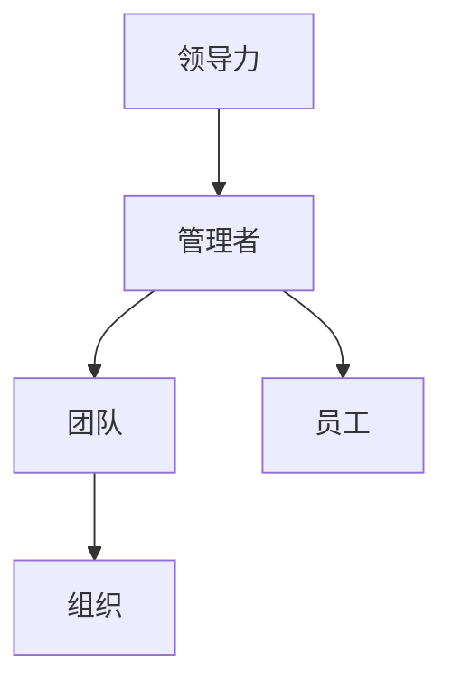

                 

# 文章标题：领导力进化论：智能时代管理者的领导力修炼

> 关键词：智能时代，领导力进化，管理者修炼，组织管理，团队建设

> 摘要：本文探讨了智能时代下领导力的变革与进化，分析了智能时代的特征和管理挑战，阐述了领导力的核心概念与原理，并提供了管理者修炼领导力的实践指南。通过案例分析，本文总结了智能时代领导力的成功实践，最后展望了领导力的未来发展趋势。

## 引言：智能时代的领导力变革

随着人工智能、大数据、云计算等技术的飞速发展，我们正进入一个全新的智能时代。这个时代不仅改变了人们的生活方式，也对管理者的领导力提出了新的要求。传统的领导力模式在智能时代面临巨大的挑战，管理者需要不断进化，以适应这个快速变化的环境。

### 智能时代的特征

智能时代的特征主要体现在以下几个方面：

1. **信息爆炸**：大数据的广泛应用使得信息获取变得更加容易，但同时也带来了信息过载的问题。
2. **自动化与智能化**：人工智能技术的应用使得自动化和智能化成为可能，大量重复性工作被机器取代。
3. **全球化与网络化**：互联网的普及使得全球范围内的协作变得更加便捷，组织边界变得模糊。
4. **快速变化**：技术变革的速度加快，企业需要快速适应市场变化。

### 智能时代的管理挑战

智能时代给管理者带来了以下挑战：

1. **信息过载**：管理者需要从海量信息中提取有价值的信息，进行决策。
2. **自动化与智能化**：如何管理智能化的团队，如何与人工智能协同工作。
3. **全球化与网络化**：如何管理分布在不同地区的团队，如何建立有效的跨文化沟通。
4. **快速变化**：如何快速适应市场变化，如何保持组织的灵活性。

### 领导力的进化趋势

面对智能时代的挑战，领导力也需要进行进化。以下是领导力进化的几个趋势：

1. **从控制到赋能**：管理者不再仅仅控制员工，而是通过赋能员工，激发他们的创造力和主动性。
2. **从指挥到协作**：管理者需要建立协作型团队，鼓励团队成员之间的互动和合作。
3. **从指挥到引导**：管理者需要从命令式管理转变为引导式管理，引导员工实现自我管理和自我提升。
4. **从单一能力到综合能力**：管理者需要具备跨学科的综合能力，包括技术、沟通、创新等。

## 核心概念与联系

领导力的核心概念包括：领导力、管理者、团队、组织等。这些概念之间的关系可以通过以下Mermaid流程图来展示：

在这个关系中，领导力是管理者的核心能力，管理者通过领导力影响团队，团队是组织的基本单元，而组织则是更大的整体。领导力的核心在于如何影响和激发员工，从而实现组织的共同目标。

## 领导力的核心概念与原理

### 领导力的定义与分类

领导力是指领导者通过影响、激励和指导他人来实现共同目标的能力。根据领导力理论，领导力可以分为以下几种类型：

1. **变革型领导力**：领导者通过激发员工的内在动力，推动组织变革和创新发展。
2. **交易型领导力**：领导者通过明确的目标和奖励机制，激励员工完成工作任务。
3. **赋能型领导力**：领导者通过授权和赋能，激发员工的自主性和创造性。
4. **合作型领导力**：领导者通过建立协作型团队，鼓励团队成员之间的互动和合作。

### 领导力模型概述

常见的领导力模型包括：

1. **路径-目标理论**：领导者通过设定清晰的路径和目标，帮助员工实现目标。
2. **领导者参与模型**：领导者通过参与和员工的互动，建立信任和合作关系。
3. **情境领导模型**：领导者根据不同情境和员工的特点，采取不同的领导方式。

### 领导力的心理学基础

领导力的心理学基础包括以下几个方面：

1. **权力与影响力**：领导者需要掌握权力和影响力，以实现领导目标。
2. **领导行为**：领导者的行为对员工产生重要影响，包括激励、沟通、监督等。
3. **领导风格**：领导者的领导风格影响员工的工作态度和行为，包括民主型、专制型、放任型等。

## 智能时代的领导力特征

智能时代的领导力特征主要体现在以下几个方面：

1. **数字化领导力**：领导者需要具备数字化思维和技能，包括数据分析、算法理解等。
2. **敏捷领导力**：领导者需要具备快速响应和适应变化的能力。
3. **创新领导力**：领导者需要鼓励创新，推动组织持续创新。
4. **跨学科领导力**：领导者需要具备跨学科的综合能力，包括技术、管理、心理学等。

## 管理者如何修炼领导力

### 领导者的自我认知与角色定位

管理者需要明确自己的角色和定位，包括：

1. **领导者身份**：管理者需要认识到自己是领导者，承担领导责任。
2. **领导目标**：管理者需要设定明确的领导目标，包括个人目标和组织目标。
3. **领导风格**：管理者需要根据自己的特点和团队需求，选择合适的领导风格。

### 领导者的沟通能力提升

管理者需要提升沟通能力，包括：

1. **有效沟通**：管理者需要掌握有效沟通的技巧，包括倾听、表达、反馈等。
2. **跨文化沟通**：管理者需要具备跨文化沟通的能力，包括跨文化意识和跨文化沟通技巧。
3. **数字化沟通**：管理者需要适应数字化沟通的方式，包括电子邮件、即时通讯、视频会议等。

### 领导者的情绪管理与压力调适

管理者需要学会情绪管理和压力调适，包括：

1. **情绪管理**：管理者需要学会识别和调节自己的情绪，避免负面情绪的影响。
2. **压力管理**：管理者需要学会应对工作压力，包括调整工作节奏、合理安排时间等。
3. **心理调适**：管理者需要学会心理调适的方法，包括冥想、运动、放松等。

### 团队领导力修炼

管理者需要修炼团队领导力，包括：

1. **团队建设**：管理者需要建立高效的团队，包括明确团队目标、建立团队规则、培养团队文化等。
2. **团队冲突管理**：管理者需要学会处理团队冲突，包括识别冲突、解决冲突、预防冲突等。
3. **团队激励**：管理者需要学会激励团队成员，包括设定激励机制、认可员工贡献、提供职业发展机会等。

## 案例分析

### 案例一：科技公司的领导者

科技公司的领导者需要具备以下能力：

1. **技术创新**：领导者需要具备技术创新的能力，推动公司持续创新。
2. **数字化管理**：领导者需要具备数字化管理的能力，包括数据分析、云计算等。
3. **人才吸引与培养**：领导者需要具备人才吸引和培养的能力，建立高效的团队。

案例分析：

某科技公司通过数字化转型，实现了业务增长。该公司领导者通过以下方式提升了领导力：

1. **明确目标**：领导者设定了明确的数字化目标，包括提高生产效率、降低成本、提升客户体验等。
2. **数字化工具应用**：领导者积极应用数字化工具，如数据分析、云计算等，提升管理效率。
3. **人才引进与培养**：领导者通过引进顶尖人才、提供职业发展机会，培养了高效团队。

### 案例二：创业公司的领导力实践

创业公司的领导者需要具备以下能力：

1. **敏捷管理**：领导者需要具备敏捷管理的能力，快速适应市场变化。
2. **资源整合**：领导者需要具备资源整合的能力，有效利用有限资源。
3. **创新精神**：领导者需要具备创新精神，推动公司持续创新。

案例分析：

某创业公司通过敏捷管理，成功应对市场变化。该公司领导者通过以下方式提升了领导力：

1. **敏捷管理**：领导者推行敏捷管理，快速响应市场变化，提高产品迭代速度。
2. **资源整合**：领导者通过整合内外部资源，提高了公司的竞争力。
3. **创新精神**：领导者鼓励员工创新，推动了公司的创新发展。

### 案例三：跨国公司的领导力策略

跨国公司的领导者需要具备以下能力：

1. **跨文化管理**：领导者需要具备跨文化管理的能力，处理不同文化之间的冲突。
2. **全球化视野**：领导者需要具备全球化视野，关注全球市场变化。
3. **战略规划**：领导者需要具备战略规划的能力，制定适合全球市场的战略。

案例分析：

某跨国公司通过跨文化管理，实现了全球业务的成功。该公司领导者通过以下方式提升了领导力：

1. **跨文化管理**：领导者重视跨文化管理，建立了跨文化团队，提高了团队协作效率。
2. **全球化视野**：领导者关注全球市场变化，制定了适合全球市场的战略。
3. **战略规划**：领导者制定了长远的战略规划，确保公司的持续发展。

## 总结与展望

智能时代的领导力面临着新的挑战和机遇。管理者需要不断进化，提升领导力，以适应这个快速变化的环境。未来的领导力发展将呈现出以下趋势：

1. **数字化领导力**：领导者需要具备数字化思维和技能，推动组织的数字化转型。
2. **敏捷领导力**：领导者需要具备快速响应和适应变化的能力，提高组织的敏捷性。
3. **创新领导力**：领导者需要鼓励创新，推动组织持续创新。
4. **跨学科领导力**：领导者需要具备跨学科的综合能力，应对复杂的业务环境。

面对智能时代的挑战，管理者需要不断修炼领导力，以适应这个快速变化的环境。通过自我认知、沟通能力提升、情绪管理与压力调适、团队领导力修炼，管理者可以不断提升自己的领导力，成为智能时代的优秀领导者。

## 附录：领导力评估工具与资源

### 领导力评估模型介绍

1. **360度评估**：通过收集员工、上级、同事和下属的反馈，全面评估领导者的领导力。
2. **行为事件访谈**：通过访谈领导者过去的行为事件，分析其领导风格和能力。
3. **领导力问卷**：通过设计专业的问卷，评估领导者的不同维度领导力。

### 智能时代领导力发展资源推荐

1. **《智能时代领导力》**：介绍了智能时代下领导力的最新理论和实践。
2. **《领导力进化论》**：详细探讨了领导力如何适应智能时代的变化。
3. **在线课程与培训**：如“智能时代领导力课程”、“敏捷领导力实践”等，提供实用的领导力提升方法。

作者：AI天才研究院/AI Genius Institute & 禅与计算机程序设计艺术 /Zen And The Art of Computer Programming

