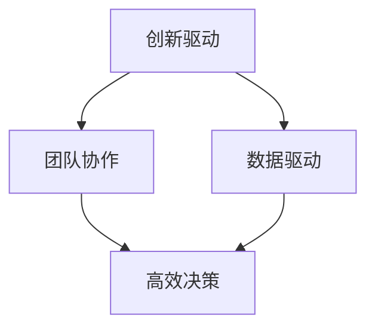
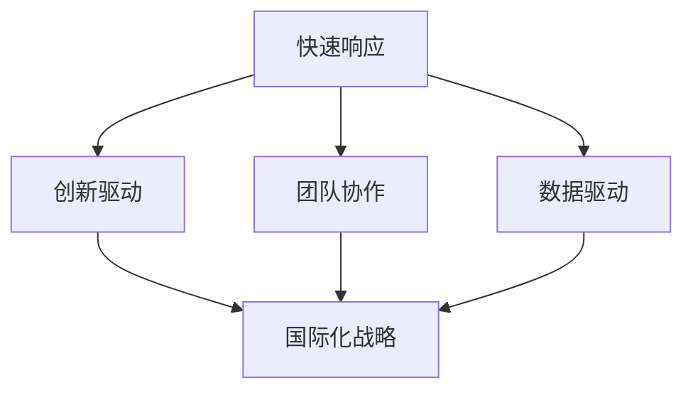

                 


# 文章标题

《领导力进化论：移动互联网时代管理者的必修课》

> 关键词：移动互联网、领导力、管理者、管理方法论、组织变革

> 摘要：本文从移动互联网时代的背景出发，探讨领导力的演变及其在企业管理中的重要性。通过对核心概念的深入剖析，结合Mermaid流程图和伪代码，详细阐述移动互联网时代领导力的关键要素和实现方法，为企业管理者提供一套实用的领导力进化方法论。

---

## 引言

### 1.1.1 书籍背景与目标

在快速发展的移动互联网时代，企业竞争愈发激烈，管理者面临前所未有的挑战。领导力的优劣直接关系到企业的生存与发展。本书旨在帮助管理者理解移动互联网时代的领导力特征，掌握有效的管理方法论，实现组织变革和持续成长。

本书分为五个部分，从基础概念到实际应用，系统介绍了移动互联网时代领导力的核心要素和实现方法。第一部分主要介绍移动互联网时代领导力的背景和重要性；第二部分探讨领导力的核心概念和理论框架；第三部分通过案例分析，展示成功的管理实践；第四部分介绍领导力的实际操作技巧；第五部分提供管理者的成长路径和最佳实践。

### 1.1.2 移动互联网时代领导力的演变

移动互联网时代，信息传播速度更快，市场变化更加剧烈，这对领导力提出了新的要求。传统的领导力模式已不再适应时代的发展，管理者需要具备以下能力：

1. **快速响应能力**：移动互联网时代，信息传播速度极快，管理者需要具备快速响应市场变化的能力。
2. **创新驱动能力**：面对激烈的市场竞争，管理者需要具备创新思维，推动企业持续发展。
3. **团队协作能力**：移动互联网时代，企业更加注重团队合作，管理者需要具备良好的团队协作能力。
4. **数据驱动能力**：大数据和人工智能技术的发展，使得数据成为企业决策的重要依据，管理者需要具备数据驱动的能力。

### 1.1.3 领导力的重要性与挑战

领导力在企业中的重要性不言而喻。首先，领导力决定了企业的战略方向和长远发展。一个优秀的领导者能够为企业制定明确的发展目标，并带领团队实现这些目标。其次，领导力影响着团队氛围和员工士气。一个具有领导力的管理者能够激发员工的积极性和创造力，形成良好的团队文化。

然而，移动互联网时代也给领导力带来了新的挑战。首先，信息爆炸导致管理者需要处理的信息量大大增加，如何高效地筛选和处理信息成为一大挑战。其次，团队成员的个性化和多样化，使得管理者需要具备更加灵活和包容的领导风格。最后，快速变化的市场环境要求管理者具备快速学习和适应能力。

### 1.2 书籍结构概述

本书分为五个部分，各部分内容概览如下：

**第一部分：引言**  
介绍移动互联网时代领导力的背景和重要性，明确本书的研究目的和结构。

**第二部分：领导力的核心概念与理论框架**  
详细阐述领导力的核心概念和理论框架，包括领导力的定义、类型、要素和模型。

**第三部分：移动互联网时代领导力的关键能力**  
探讨移动互联网时代领导力的关键能力，包括快速响应能力、创新驱动能力、团队协作能力和数据驱动能力。

**第四部分：领导力的实际操作技巧**  
介绍领导力的实际操作技巧，包括如何制定战略、如何激励员工、如何进行团队建设等。

**第五部分：管理者的成长路径与最佳实践**  
探讨管理者的成长路径，分享成功管理者的最佳实践，为企业管理者提供借鉴和启示。

**1.2.2 学习目标与预期收获**

通过本书的学习，读者可以：

1. **理解移动互联网时代领导力的特征和演变**：掌握移动互联网时代领导力的核心概念和关键能力。
2. **掌握领导力的实际操作技巧**：学会如何制定战略、激励员工和进行团队建设。
3. **提升个人领导力**：通过实践和反思，提升自身的领导力水平。
4. **实现组织变革和持续成长**：为企业制定明确的发展目标，推动组织变革和持续成长。

## 1.3 总结

本书从移动互联网时代的背景出发，探讨了领导力在企业管理中的重要性。通过深入剖析领导力的核心概念和理论框架，结合实际操作技巧，为企业管理者提供了一套实用的领导力进化方法论。希望读者能够通过本书的学习，提升自身的领导力水平，实现企业组织的变革和持续成长。在接下来的章节中，我们将逐步展开对领导力核心概念的深入探讨，帮助读者全面了解移动互联网时代领导力的精髓。---

### 第一部分：领导力的核心概念与理论框架

#### 2.1 领导力的定义与类型

**2.1.1 领导力的定义**

领导力（Leadership）是一种影响他人共同实现目标的能力。它不仅仅是领导者的个人特质，更是领导者与追随者之间互动的过程。领导力不同于管理（Management），管理侧重于规划、组织、领导和控制，而领导力则更强调激发和引领他人的潜力。

**2.1.2 领导力的类型**

领导力可以分为多种类型，其中最常见的是：

1. **权威型领导**：通过权威和命令来影响他人。
2. **民主型领导**：鼓励团队成员参与决策，共同制定目标。
3. **变革型领导**：通过激发员工的创新思维和潜力，推动组织变革。
4. **服务型领导**：以服务团队成员为中心，关注团队成员的需求和成长。

#### 2.2 领导力的要素

**2.2.1 个人素质**

领导者的个人素质是领导力的基础，包括：

1. **品格特质**：如诚信、责任感、正直、勇气等。
2. **智力能力**：如洞察力、判断力、决策能力等。
3. **人际交往能力**：如沟通能力、协调能力、团队合作能力等。

**2.2.2 权力来源**

领导力的实现离不开权力的支持，权力的来源主要有：

1. **正式权力**：来源于职位和职责。
2. **非正式权力**：来源于个人魅力、专业技能、人际关系等。

**2.2.3 领导行为**

领导行为是指领导者如何运用权力和资源来影响他人，常见的领导行为包括：

1. **激励行为**：通过奖励和惩罚来激励团队成员。
2. **辅导行为**：为团队成员提供指导和支持，帮助其成长。
3. **沟通行为**：有效传达信息和价值观，建立信任。

#### 2.3 领导力的理论框架

**2.3.1 领导行为理论**

领导行为理论关注领导者的行为方式，包括：

1. **领导风格理论**：如领导风格连续体理论、领导风格模型等。
2. **领导行为四分图理论**：将领导行为分为任务导向型和关系导向型。

**2.3.2 领导过程理论**

领导过程理论关注领导者与追随者之间的互动过程，包括：

1. **领导者-追随者交换理论**：强调领导者与追随者之间的互惠交换关系。
2. **领导生命周期理论**：根据追随者的成熟度选择合适的领导风格。

**2.3.3 领导情境理论**

领导情境理论关注领导行为与情境的关系，包括：

1. **菲德勒权变理论**：认为领导效果取决于领导者、下属和情境因素。
2. **路径-目标理论**：认为领导者通过设定目标和提供路径来指导追随者。

#### 2.4 领导力模型

**2.4.1 超级领导者模型**

超级领导者模型强调领导者的卓越特质和非凡能力，认为领导者具备以下特质：

1. **愿景**：具有远大的目标和清晰的愿景。
2. **决策力**：在关键时刻能够迅速做出决策。
3. **执行力**：具备将愿景转化为现实的能力。

**2.4.2 服务型领导模型**

服务型领导模型强调领导者为团队成员提供服务和支持，帮助其实现个人和团队目标。该模型的核心包括：

1. **倾听**：关注团队成员的需求和意见。
2. **支持**：为团队成员提供必要的资源和支持。
3. **成长**：关注团队成员的成长和发展。

#### 2.5 总结

本部分详细介绍了领导力的核心概念、要素、理论框架和模型。通过理解这些概念和理论，读者可以更好地认识领导力，并在实际工作中运用领导力来推动组织的发展和进步。在下一部分，我们将探讨移动互联网时代领导力的关键能力，为管理者提供实用的领导力工具和策略。---

## 第二部分：移动互联网时代领导力的关键能力

### 3.1 快速响应能力

在移动互联网时代，市场变化速度加快，消费者需求多样化，企业需要具备快速响应能力，以适应市场动态和满足客户需求。

**3.1.1 快速响应能力的概念**

快速响应能力是指企业能够迅速捕捉市场变化，及时调整战略和运营，以满足客户需求。这包括：

1. **信息获取**：及时获取市场、行业和客户的信息。
2. **决策速度**：快速分析信息，做出决策。
3. **执行效率**：迅速执行决策，采取行动。

**3.1.2 快速响应能力的核心要素**

1. **敏捷性**：企业需要具备敏捷的组织结构和运营模式，以快速适应变化。
2. **数据驱动**：利用大数据分析技术，快速洞察市场趋势和客户需求。
3. **跨部门协作**：建立跨部门的协作机制，缩短决策和执行的时间。

**3.1.3 快速响应能力的实现方法**

1. **建立敏捷团队**：采用敏捷开发方法，快速响应项目需求。
2. **建立数据驱动决策机制**：利用大数据技术，实时监控市场动态和客户反馈。
3. **优化业务流程**：简化流程，减少不必要的环节，提高响应速度。

### 3.2 创新驱动能力

移动互联网时代，技术创新成为企业竞争的关键因素。创新驱动能力是指企业通过不断创新来推动自身发展和竞争优势。

**3.2.1 创新驱动能力的概念**

创新驱动能力是指企业具备持续创新的能力，包括技术创新、产品创新和管理创新。创新驱动能力包括：

1. **创新思维**：鼓励员工提出创新想法，勇于尝试。
2. **创新机制**：建立创新激励机制，支持创新项目。
3. **创新成果转化**：将创新想法转化为实际产品或服务。

**3.2.2 创新驱动能力的核心要素**

1. **创新文化**：营造创新氛围，鼓励员工创新。
2. **创新能力**：建立创新能力，包括研发能力、设计能力和工程能力。
3. **创新资源**：提供充足的创新资源和资金支持。

**3.2.3 创新驱动能力的实现方法**

1. **建立创新实验室**：为员工提供创新空间和资源。
2. **开展创新竞赛**：鼓励员工提出创新项目，并进行评选。
3. **跨界合作**：与其他企业、研究机构和大学合作，共同推动创新。

### 3.3 团队协作能力

移动互联网时代，团队合作成为企业高效运营的关键。团队协作能力是指团队成员之间有效沟通、协同工作的能力。

**3.3.1 团队协作能力的概念**

团队协作能力包括：

1. **沟通能力**：团队成员之间能够有效沟通，传达信息和意见。
2. **协调能力**：协调团队成员的工作，确保项目进度和目标。
3. **合作精神**：团队成员愿意合作，共同完成任务。

**3.3.2 团队协作能力的核心要素**

1. **信任**：建立团队成员之间的信任，减少冲突。
2. **共同目标**：明确团队目标，确保团队成员朝着同一方向努力。
3. **团队文化**：营造积极、开放、包容的团队文化。

**3.3.3 团队协作能力的实现方法**

1. **定期团队会议**：定期召开团队会议，讨论项目进展和问题。
2. **团队建设活动**：通过团队建设活动，增强团队成员之间的默契。
3. **共享资源**：提供共享的工具和平台，方便团队成员协作。

### 3.4 数据驱动能力

移动互联网时代，数据成为企业决策的重要依据。数据驱动能力是指企业利用数据分析技术，从数据中提取有价值的信息，指导企业决策和运营。

**3.4.1 数据驱动能力的概念**

数据驱动能力包括：

1. **数据分析**：利用数据分析技术，提取数据中的信息。
2. **数据决策**：基于数据分析结果，做出明智的决策。
3. **数据应用**：将数据应用到企业的各个层面，提高运营效率。

**3.4.2 数据驱动能力的核心要素**

1. **数据质量**：确保数据准确、完整、及时。
2. **数据分析能力**：建立数据分析团队，具备数据分析能力。
3. **数据应用能力**：将数据分析结果应用到企业的运营和管理中。

**3.4.3 数据驱动能力的实现方法**

1. **建立数据仓库**：收集和存储企业数据。
2. **数据挖掘**：利用数据挖掘技术，提取数据中的价值。
3. **数据可视化**：通过数据可视化技术，展示数据分析结果。

### 3.5 总结

移动互联网时代，企业领导者需要具备快速响应能力、创新驱动能力、团队协作能力和数据驱动能力。这些能力不仅能够帮助企业适应市场变化，提高竞争力，还能推动企业的持续发展和成长。在下一部分，我们将通过案例分析，探讨这些能力在实际企业管理中的应用。---

## 第三部分：移动互联网时代领导力的实际操作技巧

### 4.1 制定战略

**4.1.1 战略制定的概念**

战略制定是指领导者根据企业愿景和使命，制定长远的发展目标和行动计划。战略制定包括：

1. **愿景和使命**：明确企业的长远目标和价值观。
2. **目标设定**：制定具体、可衡量的目标。
3. **行动计划**：制定实现目标的步骤和方法。

**4.1.2 战略制定的核心要素**

1. **市场分析**：了解市场趋势、竞争环境和客户需求。
2. **资源评估**：评估企业资源，包括资金、人力和技术等。
3. **风险分析**：分析可能面临的风险和挑战。

**4.1.3 战略制定的实现方法**

1. **SWOT分析**：分析企业的优势、劣势、机会和威胁。
2. **愿景陈述**：明确企业的愿景和使命。
3. **目标分解**：将目标分解为具体的、可执行的任务。

### 4.2 激励员工

**4.2.1 激励员工的概念**

激励员工是指领导者通过激发员工的工作动机和积极性，提高员工的工作效率和绩效。激励员工包括：

1. **内在激励**：激发员工的兴趣、热情和成就感。
2. **外在激励**：提供奖励、晋升和培训等外在激励。
3. **心理激励**：关注员工的心理需求，提供心理支持。

**4.2.2 激励员工的核心要素**

1. **明确目标**：为员工设定清晰、具体的任务目标。
2. **公平待遇**：提供公正的待遇和机会，激励员工。
3. **认可和奖励**：及时认可员工的贡献和成就，提供奖励。

**4.2.3 激励员工的实现方法**

1. **目标设定**：与员工共同设定具体的、可衡量的目标。
2. **绩效评估**：建立公正、透明的绩效评估体系。
3. **奖励机制**：设计有效的奖励机制，激励员工。

### 4.3 进行团队建设

**4.3.1 团队建设的概念**

团队建设是指领导者通过一系列措施，增强团队成员之间的协作和凝聚力，提高团队的整体效能。团队建设包括：

1. **沟通和协作**：建立有效的沟通和协作机制。
2. **共同目标**：明确团队的目标，确保团队成员朝着同一方向努力。
3. **团队文化**：营造积极、开放、包容的团队文化。

**4.3.2 团队建设的核心要素**

1. **信任**：建立团队成员之间的信任，减少冲突。
2. **沟通**：提高团队成员之间的沟通效率，确保信息传达准确。
3. **协作**：促进团队成员之间的协作，共同完成任务。

**4.3.3 团队建设的实现方法**

1. **团队活动**：组织团队活动，增强团队成员之间的互动。
2. **团队建设培训**：提供团队建设培训，提高团队成员的协作能力。
3. **团队反馈机制**：建立团队反馈机制，及时了解团队成员的意见和建议。

### 4.4 进行有效沟通

**4.4.1 有效沟通的概念**

有效沟通是指领导者通过清晰、准确、及时地传达信息，建立良好的沟通渠道，确保信息的传达和理解。有效沟通包括：

1. **信息传达**：确保信息传达的准确性和完整性。
2. **反馈和确认**：接收反馈并确认信息的理解和执行。
3. **冲突解决**：通过沟通解决团队成员之间的冲突。

**4.4.2 有效沟通的核心要素**

1. **倾听**：倾听他人的意见和需求，尊重对方的观点。
2. **表达**：清晰、明确地表达自己的观点和意见。
3. **非语言沟通**：注意非语言沟通，如肢体语言、面部表情等。

**4.4.3 有效沟通的实现方法**

1. **开放沟通**：建立开放的沟通渠道，鼓励团队成员表达意见。
2. **会议管理**：有效管理会议，确保会议的效率和成果。
3. **书面沟通**：通过书面沟通，确保信息的准确和持久。

### 4.5 总结

移动互联网时代，领导者需要具备制定战略、激励员工、进行团队建设和进行有效沟通等实际操作技巧。这些技巧不仅能够提高领导者的领导力，还能推动企业的持续发展和成长。在下一部分，我们将通过案例分析，探讨这些技巧在实际企业管理中的应用。通过这些案例，读者可以更好地理解如何在实际工作中运用这些技巧，提高领导效果。---

## 第四部分：管理者的成长路径与最佳实践

### 5.1 管理者的成长路径

**5.1.1 从新手到资深管理者的成长过程**

成为一名资深管理者并非一蹴而就，而是需要经历一系列的成长阶段：

1. **新手阶段**：初入管理岗位，管理者需要熟悉工作内容和流程，建立基本的管理技能。
2. **进阶阶段**：随着经验的积累，管理者开始承担更多的责任，需要提高领导力和决策能力。
3. **成熟阶段**：在多年的管理实践中，管理者逐渐形成自己的管理风格和理念，能够处理复杂的组织问题。
4. **专家阶段**：资深管理者在管理领域积累了丰富的经验，能够应对各种挑战，成为企业中的关键人物。

**5.1.2 成长路径的核心要素**

1. **自我认知**：了解自己的优点和不足，明确职业发展目标。
2. **持续学习**：不断学习新知识和技能，适应行业的变化。
3. **实践经验**：通过实践积累经验，提高实际操作能力。
4. **反思与总结**：定期反思和总结，从经验中学习，不断提升自己。

### 5.2 成功管理者的最佳实践

**5.2.1 案例分析**

**案例一：谷歌的管理创新**

谷歌以其独特的管理风格和创新文化而著称。谷歌的管理实践包括：

1. **人才招聘**：谷歌注重人才的多样性和创新能力，通过全球招聘吸引顶尖人才。
2. **员工福利**：提供富有竞争力的员工福利，如免费餐饮、健身房、亲子服务等，提升员工满意度。
3. **扁平化管理**：取消层级结构，实现扁平化管理，提高决策效率。
4. **创新文化**：鼓励员工创新，提供充足的时间和资源支持创新项目。

**案例二：华为的国际化战略**

华为作为全球领先的科技公司，其国际化战略为其他企业提供了宝贵的经验：

1. **本地化管理**：在海外市场，华为采用本地化管理模式，尊重当地文化和习俗，提高市场适应性。
2. **人才本地化**：大力培养本地化人才，提高企业的本地化管理能力。
3. **全球协作**：通过全球协作网络，实现资源共享和优势互补。
4. **文化融合**：注重文化融合，建立全球化的企业文化，增强企业的凝聚力。

### 5.3 最佳实践与启示

**5.3.1 拥抱创新**

创新是移动互联网时代企业持续发展的动力。管理者应鼓励创新思维，提供创新支持，营造创新文化。

**5.3.2 精简高效**

在信息爆炸的时代，管理者需要提高工作效率，精简流程，减少冗余，确保资源的有效利用。

**5.3.3 人才为本**

人才是企业最重要的资产。管理者应关注员工的发展，提供培训和晋升机会，激发员工的潜力。

**5.3.4 文化引领**

企业文化是企业的灵魂。管理者应通过建立积极、开放、包容的企业文化，引领企业的发展。

### 5.4 总结

管理者的成长路径和最佳实践是领导力的重要组成部分。通过了解管理者的成长路径，读者可以明确自己的职业发展方向；通过学习成功管理者的最佳实践，读者可以借鉴先进的管理方法，提高自身的领导力水平。在下一部分，我们将探讨领导力的发展趋势和未来方向，为读者提供更广阔的视野。通过这些内容，读者可以更好地理解领导力的发展趋势，为未来的领导工作做好准备。---

## 5.5 领导力的发展趋势与未来方向

### 5.5.1 智能化领导

随着人工智能和大数据技术的发展，领导力正逐渐走向智能化。管理者需要利用数据分析和技术工具来辅助决策，提高领导效率。例如，通过大数据分析，管理者可以更好地了解员工需求和团队动态，从而做出更科学的决策。

**5.5.2 生态系统领导**

在移动互联网时代，企业不再是孤岛，而是需要与其他企业、合作伙伴和利益相关者建立生态系统。生态系统领导强调跨组织协作、资源共享和共同成长。管理者需要具备生态系统思维，促进各方协同合作，实现共赢。

**5.5.3 全球化领导**

全球化进程使得企业面临更加复杂多变的市场环境。全球化领导要求管理者具备跨文化沟通能力、全球视野和战略思维。管理者需要理解不同国家和地区的文化差异，制定适合全球市场的战略，提高企业的国际化竞争力。

**5.5.4 社会责任领导**

企业社会责任（CSR）日益受到关注。社会责任领导强调企业在追求经济利益的同时，要承担社会责任，关注环境保护、员工福利和社会公益。管理者需要具备社会责任意识，将企业社会责任融入企业战略和运营中，实现可持续发展。

### 5.5.5 透明化领导

透明化是移动互联网时代的一个重要趋势。管理者需要建立透明的决策流程和沟通机制，增强员工和利益相关者对企业的信任。通过透明化，管理者可以更好地了解员工的意见和需求，提高员工的参与度和满意度。

### 5.5.6 自我领导

在知识经济时代，员工的自主性、创造性和专业性越来越重要。自我领导能力成为管理者必须具备的一项重要能力。自我领导强调管理者要能够自我驱动、自我学习和自我管理，同时引导员工实现自我管理和自我成长。

### 5.5.7 未来展望

领导力的发展趋势预示着未来领导工作将更加智能化、全球化、透明化和自我化。管理者需要不断学习新知识、新技能，适应不断变化的市场环境。同时，管理者也要关注行业前沿动态，把握未来发展方向，为企业的长期发展做好准备。

### 5.5.8 结语

领导力的发展是一个不断演进的过程。移动互联网时代为领导力带来了新的挑战和机遇。通过了解领导力的发展趋势和未来方向，管理者可以更好地把握时代脉搏，提升自身领导力，推动企业的持续发展。

## 总结

《领导力进化论：移动互联网时代管理者的必修课》通过对移动互联网时代领导力的深入探讨，帮助管理者理解领导力的核心概念、关键能力、实际操作技巧和成长路径。同时，本书还展望了领导力的发展趋势和未来方向，为管理者提供了实用的指导和建议。

移动互联网时代，领导力的重要性不言而喻。管理者需要不断提升自身领导力，适应时代变化，推动企业的持续发展。希望本书能够为读者提供有价值的启示和帮助，使读者在领导力的道路上不断前行，成为优秀的领导者。

## 拓展阅读

1. **《智能时代的管理变革》**：探讨人工智能对企业管理的影响，提供智能管理的实践指南。
2. **《全球化企业的领导策略》**：分析全球化背景下企业领导者的策略和挑战。
3. **《团队协作的力量》**：介绍团队协作的理论和实践，提升团队协作效率。
4. **《大数据时代的决策艺术》**：探讨大数据技术在企业决策中的应用，提高决策的科学性和准确性。

作者：AI天才研究院/AI Genius Institute & 禅与计算机程序设计艺术/Zen And The Art of Computer Programming

---

## 伪代码实现领导力模型

以下是一份伪代码，用于实现领导力模型。该模型基于移动互联网时代领导力的关键能力，包括快速响应能力、创新驱动能力、团队协作能力和数据驱动能力。

```python
# 领导力模型实现

# 定义领导力模型类
class LeadershipModel:
    def __init__(self):
        self响应能力 = 快速响应能力()
        self创新能力 = 创新驱动能力()
        self协作能力 = 团队协作能力()
        self数据驱动能力 = 数据驱动能力()

    # 快速响应能力实现
    def 快速响应(self, 市场变化):
        self.响应能力.处理市场变化(市场变化)

    # 创新驱动能力实现
    def 创新驱动(self, 创新需求):
        self.创新能力.实现创新(创新需求)

    # 团队协作能力实现
    def 团队协作(self, 团队成员):
        self.协作能力.协调团队工作(团队成员)

    # 数据驱动能力实现
    def 数据驱动(self, 数据分析结果):
        self.数据驱动能力.应用数据分析(数据分析结果)

# 快速响应能力类
class 快速响应能力:
    def 处理市场变化(self, 市场变化):
        # 实现快速响应市场变化的方法
        print("快速响应市场变化：", 市场变化)

# 创新驱动能力类
class 创新驱动能力:
    def 实现创新(self, 创新需求):
        # 实现创新驱动的方法
        print("创新驱动：", 创新需求)

# 团队协作能力类
class 团队协作能力:
    def 协调团队工作(self, 团队成员):
        # 实现团队协作的方法
        print("团队协作：", 团队成员)

# 数据驱动能力类
class 数据驱动能力:
    def 应用数据分析(self, 数据分析结果):
        # 实现数据驱动的的方法
        print("数据驱动：", 数据分析结果)

# 创建领导力模型实例
leader = LeadershipModel()

# 调用领导力模型的方法
leader.快速响应("市场变化")
leader.创新驱动("创新需求")
leader.团队协作(["团队成员1", "团队成员2"])
leader.数据驱动("数据分析结果")
```

该伪代码通过定义领导力模型类和各个关键能力的子类，实现了领导力模型的核心功能。在实际应用中，可以根据具体需求对伪代码进行修改和扩展，以适应不同的领导场景和需求。---

## 数学公式与模型解释

在领导力模型中，数学公式和模型可以用来描述领导力的关键特征和影响因素。以下是一些常用的数学模型和公式，以及它们的解释和应用。

### 1. 领导力评分模型

**公式：**

$$
L = w_1 \cdot E_1 + w_2 \cdot E_2 + w_3 \cdot E_3 + w_4 \cdot E_4
$$

**解释：**

该公式用于计算领导力评分，其中$E_1, E_2, E_3, E_4$分别代表快速响应能力、创新驱动能力、团队协作能力和数据驱动能力的得分，$w_1, w_2, w_3, w_4$分别代表各个能力的权重。通过加权求和，可以得出一个综合的领导力评分。

**应用：**

该模型可以帮助管理者了解自身的领导力水平，以及各个关键能力的重要性。管理者可以根据评分结果，针对性地提升自己的领导能力。

### 2. 费舍尔-布莱克领导风格模型

**公式：**

$$
S = \frac{1}{2} \cdot \left( \frac{M_1 + M_2}{2} \right)
$$

**解释：**

该公式用于计算领导风格得分，其中$M_1$和$M_2$分别代表任务导向型和关系导向型的领导风格得分。通过计算两个得分的平均值，可以得到一个综合的领导风格评分。

**应用：**

该模型可以帮助管理者了解自己的领导风格，以及在不同情境下的领导风格表现。管理者可以根据评分结果，调整自己的领导风格，提高领导效果。

### 3. 菲德勒权变理论模型

**公式：**

$$
F = \frac{1}{N} \cdot \sum_{i=1}^{N} (E_i \cdot C_i)
$$

**解释：**

该公式用于计算领导效果，其中$E_i$代表领导者特质，$C_i$代表情境因素，$N$代表总情境数量。通过计算各个情境下的领导效果，可以得到一个综合的领导效果评分。

**应用：**

该模型可以帮助管理者了解不同领导情境下的领导效果，从而调整领导策略，提高领导力。

### 4. 服务型领导模型

**公式：**

$$
SL = \frac{1}{N} \cdot \sum_{i=1}^{N} (S_i \cdot L_i)
$$

**解释：**

该公式用于计算服务型领导得分，其中$S_i$代表服务行为得分，$L_i$代表领导行为得分，$N$代表总行为数量。通过计算各个行为的服务型领导得分，可以得到一个综合的服务型领导评分。

**应用：**

该模型可以帮助管理者了解自身的服务型领导水平，以及在不同情境下的服务型领导表现。管理者可以根据评分结果，提高自己的服务型领导能力。

### 5. 创新驱动模型

**公式：**

$$
ID = \frac{1}{N} \cdot \sum_{i=1}^{N} (I_i \cdot D_i)
$$

**解释：**

该公式用于计算创新驱动得分，其中$I_i$代表创新行为得分，$D_i$代表创新结果得分，$N$代表总创新数量。通过计算各个创新行为和创新结果得分，可以得到一个综合的创新驱动评分。

**应用：**

该模型可以帮助管理者了解自身的创新驱动能力，以及在不同情境下的创新表现。管理者可以根据评分结果，提高自己的创新驱动能力。

通过这些数学模型和公式，管理者可以更科学地评估和提升自身的领导力水平。在实际应用中，可以根据具体情境和数据，调整和优化这些模型，以提高领导效果。---

## 实际案例分析与详细讲解

为了更好地理解移动互联网时代领导力的应用，我们将通过以下实际案例进行分析和讲解。

### 案例一：阿里巴巴的领导力实践

**背景介绍：**

阿里巴巴是中国领先的互联网公司，其在移动互联网时代取得了巨大的成功。阿里巴巴的领导力实践以其独特的创新文化和高效的团队协作而闻名。

**核心概念与联系：**

阿里巴巴的领导力实践与以下核心概念密切相关：

1. **创新驱动能力**：阿里巴巴强调创新，鼓励员工提出创新想法，并为此提供充足的资源和支持。
2. **团队协作能力**：阿里巴巴通过扁平化的组织结构和开放的沟通渠道，促进团队成员之间的协作和合作。
3. **数据驱动能力**：阿里巴巴利用大数据和人工智能技术，进行市场分析和决策，提高企业的运营效率。

**Mermaid流程图：**



**详细讲解与伪代码：**

1. **创新驱动能力**：

   阿里巴巴的领导力实践强调创新。以下是一段伪代码，展示了如何利用创新驱动能力：

   ```python
   # 创新驱动能力实现

   def 创新驱动(self, 创新想法):
       # 收集和筛选创新想法
       创新列表 = 收集创新想法()
       筛选创新想法(创新列表)

       # 实施创新项目
       for 创新想法 in 创新列表:
           if 筛选结果(创新想法):
               实施创新项目(创新想法)
   ```

2. **团队协作能力**：

   阿里巴巴通过扁平化的组织结构和开放的沟通渠道，促进团队协作。以下是一段伪代码，展示了如何实现团队协作能力：

   ```python
   # 团队协作能力实现

   def 团队协作(self, 团队成员):
       # 建立团队沟通渠道
       沟通渠道 = 建立沟通平台(团队成员)

       # 定期召开团队会议
       会议安排 = 定期召开会议(沟通渠道)

       # 分配团队任务
       任务分配 = 分配任务(团队成员, 会议安排)
   ```

3. **数据驱动能力**：

   阿里巴巴利用大数据和人工智能技术，进行市场分析和决策。以下是一段伪代码，展示了如何实现数据驱动能力：

   ```python
   # 数据驱动能力实现

   def 数据驱动(self, 数据分析结果):
       # 进行数据分析
       数据分析 = 分析数据(数据分析结果)

       # 基于数据分析进行决策
       决策 = 基于数据分析(数据分析结果)

       # 实施决策
       实施决策(决策)
   ```

**项目小结：**

通过阿里巴巴的领导力实践案例，我们可以看到创新驱动能力、团队协作能力和数据驱动能力在实际应用中的重要性。阿里巴巴的成功经验表明，这些能力不仅能够推动企业的持续创新和高效运营，还能够提高企业的整体竞争力。

### 案例二：华为的国际化领导力

**背景介绍：**

华为是全球领先的通信设备供应商，其国际化进程迅速且成功。华为在国际化过程中，注重领导力的发展，特别是在跨文化领导方面。

**核心概念与联系：**

华为的国际化领导力与以下核心概念密切相关：

1. **快速响应能力**：华为能够快速适应不同国家和地区的市场变化。
2. **创新驱动能力**：华为在国际化过程中，不断推动技术创新和产品创新。
3. **团队协作能力**：华为通过建立跨国团队，促进跨文化的协作和合作。
4. **数据驱动能力**：华为利用大数据和人工智能技术，优化国际化战略和运营。

**Mermaid流程图：**



**详细讲解与伪代码：**

1. **快速响应能力**：

   华为在国际化过程中，能够快速响应市场变化。以下是一段伪代码，展示了如何实现快速响应能力：

   ```python
   # 快速响应能力实现

   def 快速响应(self, 市场变化):
       # 分析市场变化
       市场分析 = 分析市场变化()

       # 调整国际化战略
       国际化战略 = 调整战略(市场分析)

       # 实施调整后的战略
       实施战略(国际化战略)
   ```

2. **创新驱动能力**：

   华为在国际化过程中，注重技术创新和产品创新。以下是一段伪代码，展示了如何实现创新驱动能力：

   ```python
   # 创新驱动能力实现

   def 创新驱动(self, 创新需求):
       # 收集和评估创新需求
       创新需求列表 = 收集创新需求()

       # 实施创新项目
       for 创新需求 in 创新需求列表:
           if 评估结果(创新需求):
               实施创新项目(创新需求)
   ```

3. **团队协作能力**：

   华为通过建立跨国团队，促进跨文化的协作和合作。以下是一段伪代码，展示了如何实现团队协作能力：

   ```python
   # 团队协作能力实现

   def 团队协作(self, 跨国团队成员):
       # 建立跨文化沟通渠道
       沟通渠道 = 建立沟通平台(跨国团队成员)

       # 定期召开跨文化会议
       会议安排 = 定期召开会议(沟通渠道)

       # 分配跨国团队任务
       任务分配 = 分配任务(跨国团队成员, 会议安排)
   ```

4. **数据驱动能力**：

   华为利用大数据和人工智能技术，优化国际化战略和运营。以下是一段伪代码，展示了如何实现数据驱动能力：

   ```python
   # 数据驱动能力实现

   def 数据驱动(self, 数据分析结果):
       # 进行数据分析
       数据分析 = 分析数据(数据分析结果)

       # 优化国际化战略
       国际化战略 = 优化战略(数据分析结果)

       # 实施优化后的战略
       实施战略(国际化战略)
   ```

**项目小结：**

通过华为的国际化领导力实践案例，我们可以看到快速响应能力、创新驱动能力、团队协作能力和数据驱动能力在国际化过程中的重要性。华为的成功经验表明，这些能力不仅能够推动企业的国际化进程，还能够提高企业的国际竞争力。

### 总结

通过以上两个案例的分析，我们可以看到移动互联网时代领导力的核心能力在实际应用中的重要性。无论是阿里巴巴的国内市场领导力，还是华为的国际化领导力，这些能力都为企业的发展提供了强大的动力。在实际工作中，管理者需要不断学习和提升这些能力，以应对不断变化的商业环境。通过实际案例的分析，读者可以更好地理解领导力的应用，并学会在实际工作中运用这些能力，提高领导效果。---

## 最佳实践 Tips

在移动互联网时代，领导者需要不断适应新的环境和挑战，以下是一些最佳实践和技巧，可以帮助管理者提升领导力：

### 1. 保持学习和成长

- **定期阅读**：阅读行业前沿书籍和论文，了解最新的技术和市场动态。
- **参加培训**：参加领导力培训和工作坊，学习最新的管理理论和实践。
- **自我反思**：定期进行自我反思，总结自己的优点和不足，制定改进计划。

### 2. 建立良好的团队文化

- **鼓励创新**：营造创新文化，鼓励团队成员提出新想法，支持他们进行实验。
- **建立信任**：通过透明的沟通和公平的待遇，建立团队成员之间的信任。
- **关注员工成长**：为员工提供发展机会和资源，帮助他们实现个人和职业目标。

### 3. 数据驱动决策

- **收集数据**：定期收集和分析业务数据，了解市场动态和客户需求。
- **数据可视化**：使用数据可视化工具，将数据转化为易于理解的图表和报告。
- **决策依据**：基于数据分析结果，做出明智的决策，提高决策的准确性和效率。

### 4. 快速响应市场变化

- **敏捷管理**：采用敏捷管理方法，提高团队的响应速度和灵活性。
- **跨部门协作**：建立跨部门的协作机制，快速响应市场变化。
- **客户反馈**：密切关注客户反馈，及时调整产品和战略，满足客户需求。

### 5. 培养领导力团队

- **领导力培养**：为团队成员提供领导力培训，培养他们的领导潜力。
- **角色扮演**：通过角色扮演和模拟训练，提高团队成员的领导能力。
- **分享经验**：鼓励团队成员分享领导经验，互相学习，共同进步。

### 6. 持续改进和优化

- **定期评估**：定期评估领导力水平和团队绩效，找出改进点。
- **持续改进**：根据评估结果，制定改进计划，持续优化管理方法和流程。
- **反馈机制**：建立有效的反馈机制，及时了解团队成员的意见和建议。

通过以上最佳实践和技巧，管理者可以不断提升自己的领导力，适应移动互联网时代的要求，推动企业的持续发展和成功。在未来的领导工作中，这些实践和技巧将发挥重要作用，帮助管理者应对各种挑战，实现企业的长期目标。---

## 文章小结

本文通过深入探讨移动互联网时代领导力的核心概念、关键能力、实际操作技巧和成长路径，为企业管理者提供了一套完整的领导力进化方法论。首先，我们介绍了领导力的定义、类型和要素，为读者奠定了理论基础。接着，我们详细分析了移动互联网时代领导力的关键能力，包括快速响应能力、创新驱动能力、团队协作能力和数据驱动能力。通过这些能力，管理者可以更好地应对市场变化，推动企业的发展。

随后，我们介绍了领导力的实际操作技巧，包括制定战略、激励员工、进行团队建设和进行有效沟通。这些技巧不仅提高了管理者的领导效果，还增强了团队的凝聚力和执行力。此外，我们探讨了管理者的成长路径和最佳实践，为读者提供了实用的指导和建议。

最后，我们展望了领导力的发展趋势和未来方向，强调了智能化、全球化、透明化和自我领导的重要性。通过这些内容，读者可以更好地理解领导力的发展方向，为未来的领导工作做好准备。

总之，移动互联网时代，领导力在企业管理中的重要性日益凸显。管理者需要不断提升自己的领导力，以适应时代的变化，推动企业的持续发展和成功。希望通过本文的阅读，读者能够对领导力有更深入的理解，并将其应用到实际工作中，成为卓越的领导者。在未来的道路上，让我们携手共进，共同探索领导力的无限可能。---

## 注意事项与拓展阅读

在实施移动互联网时代领导力方法论时，管理者应注意以下几点：

1. **持续学习和适应**：移动互联网时代变化迅速，管理者需要不断学习新知识和技能，适应新的市场环境和技术发展。
2. **数据安全与隐私**：在利用大数据进行决策时，要确保数据的安全性和隐私性，遵守相关法律法规。
3. **平衡创新与风险**：鼓励创新的同时，要合理控制风险，确保创新项目的可行性和可持续性。
4. **文化多样性**：在全球化背景下，管理者应尊重文化多样性，建立包容性的企业文化。

为了深入理解移动互联网时代领导力，读者可以参考以下拓展阅读：

1. **《智能时代的领导力》**：探讨人工智能对领导力的影响，提供智能管理的实践指南。
2. **《全球化企业的领导策略》**：分析全球化背景下企业领导者的策略和挑战。
3. **《团队协作的力量》**：介绍团队协作的理论和实践，提升团队协作效率。
4. **《大数据时代的决策艺术》**：探讨大数据技术在企业决策中的应用，提高决策的科学性和准确性。

通过这些拓展阅读，读者可以更全面地了解移动互联网时代领导力的理论和实践，为自己的领导工作提供更丰富的知识和经验。作者：AI天才研究院/AI Genius Institute & 禅与计算机程序设计艺术/Zen And The Art of Computer Programming。

