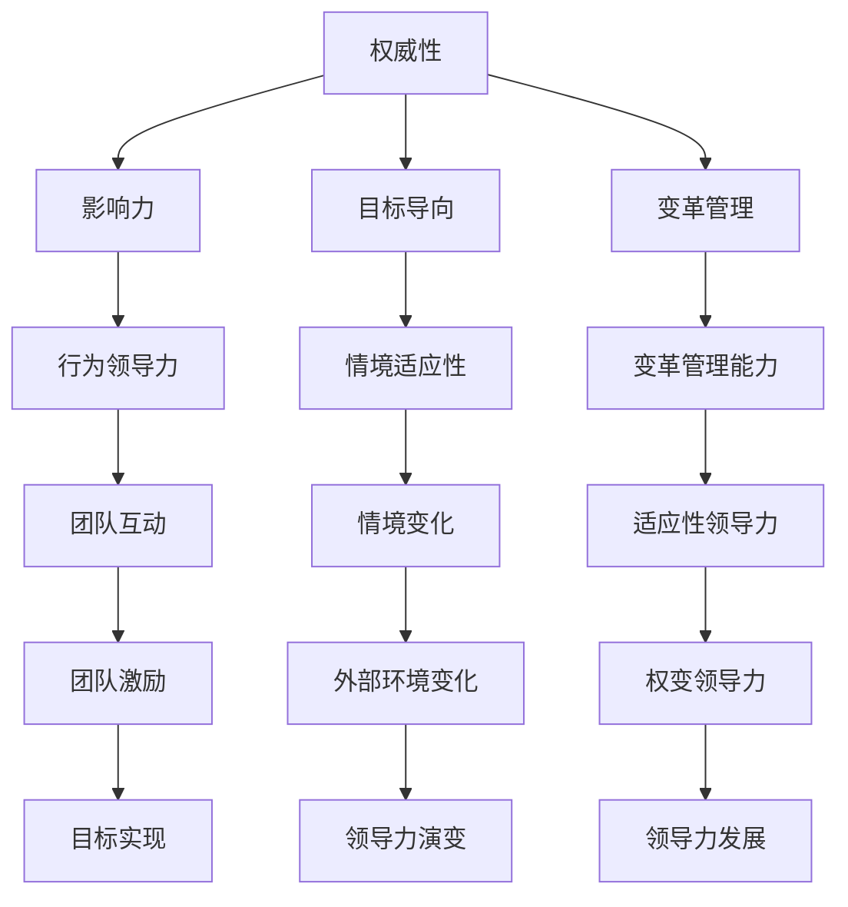
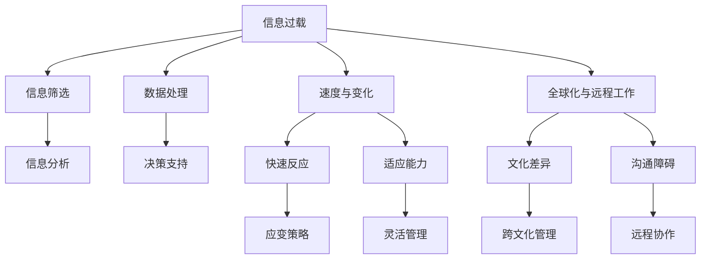
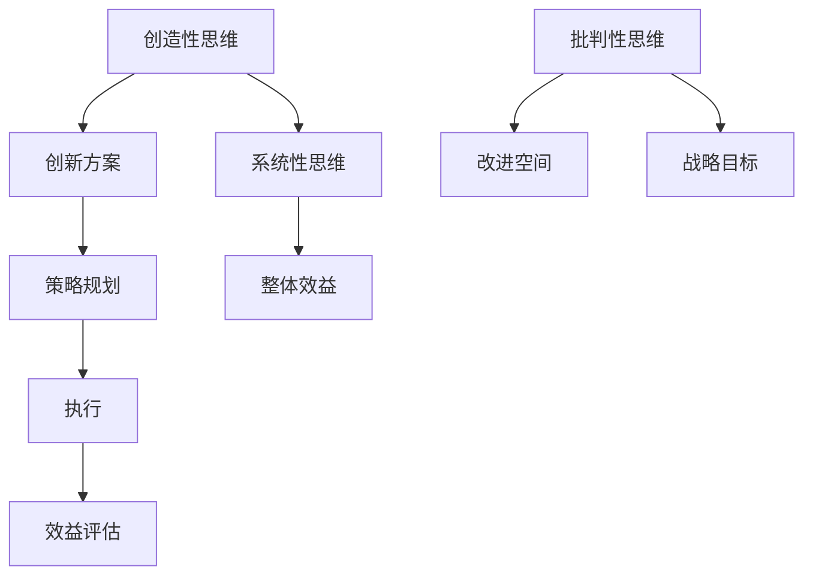
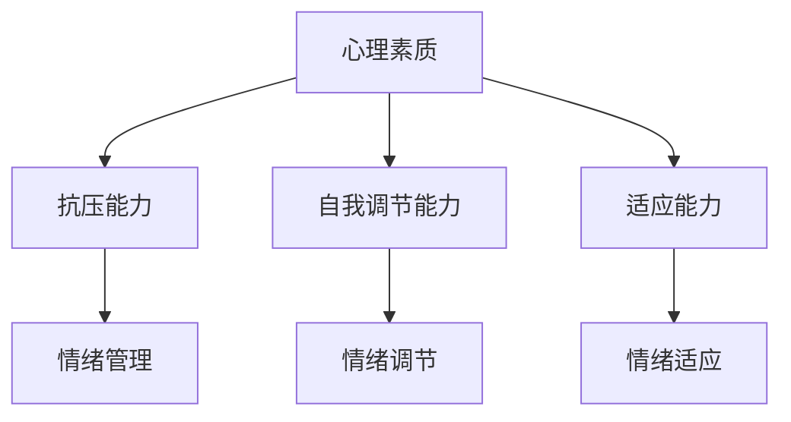
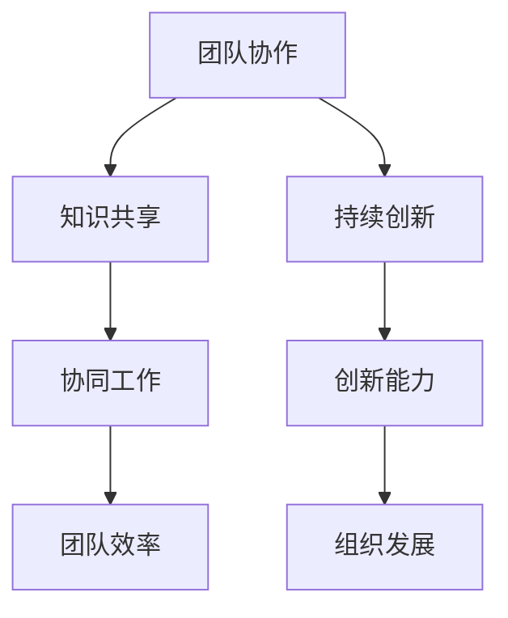
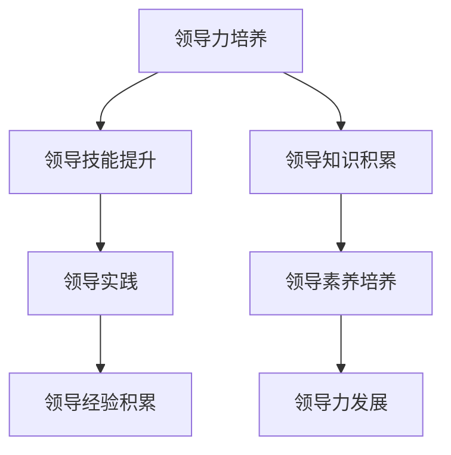
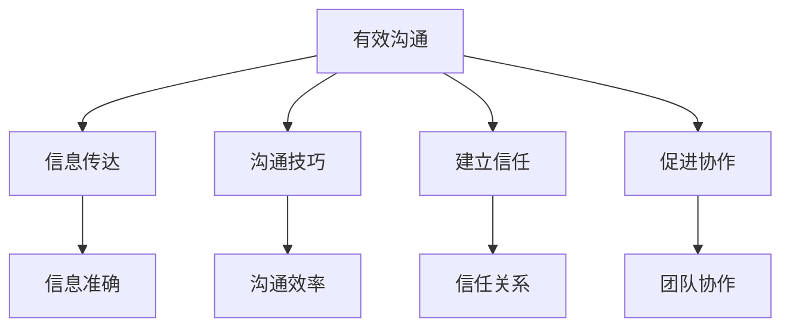
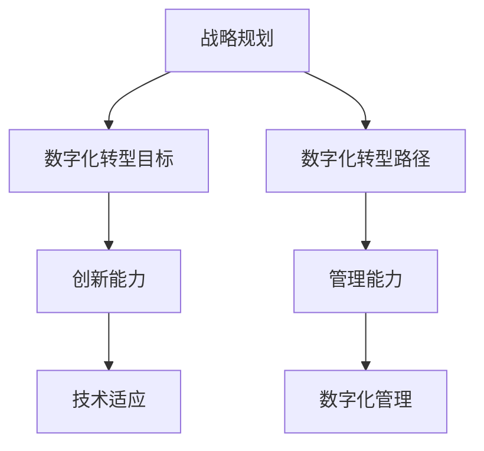
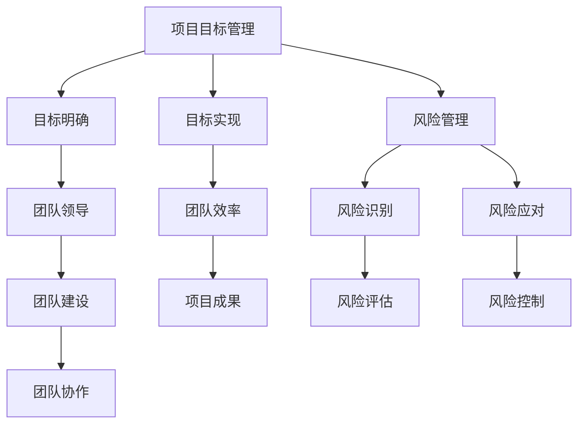
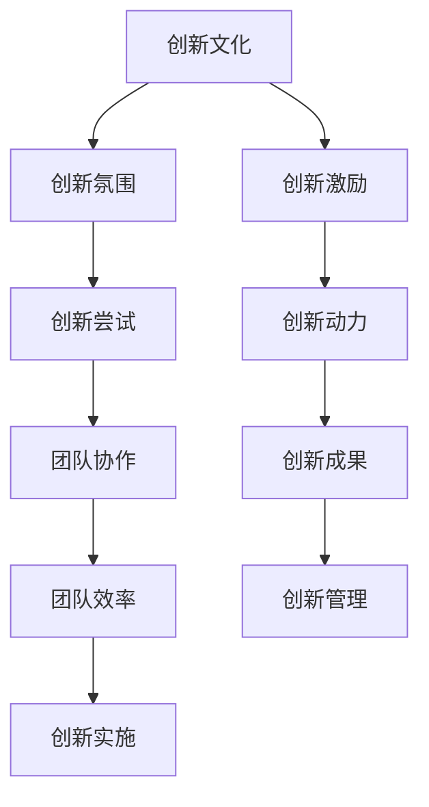

                 

### 引言

#### 书名：《领导力进化论：移动互联网时代管理者的领导力修炼》

在移动互联网迅猛发展的今天，信息传播速度和方式发生了翻天覆地的变化，这对管理者的领导力提出了新的挑战。传统的领导力模型已经无法完全适应这一快速变化的商业环境，管理者需要不断进化，提升自身的领导能力，以应对新时代的机遇与挑战。因此，本书旨在为移动互联网时代的管理者提供一套全面的领导力修炼指南。

本书的撰写目的主要有以下几点：

1. **帮助管理者理解现代领导力的核心概念和框架**：通过对传统和现代领导力模型的对比分析，管理者可以更好地理解领导力的发展历程和演变方向。

2. **探讨移动互联网时代领导力面临的挑战**：信息过载、速度与变化、全球化与远程工作等，都是当前领导者需要面对的新课题。

3. **提供实用的领导力策略和实践方法**：通过深入探讨领导者的思维进化、团队管理、沟通能力等多个方面，帮助管理者提升自身的领导能力。

4. **通过案例分析和实践指南，提升领导力修炼的效果**：结合成功和失败的领导力案例，总结经验教训，为管理者提供具体的实践指导。

总之，本书不仅是一本关于领导力理论的书，更是一本注重实践操作的指南。希望通过本书，能够帮助管理者在移动互联网时代找到属于自己的领导力进化之路。

### 第一部分：领导力核心概念与框架

#### 第1章：领导力：从传统到现代

#### 1.1 领导力的定义与历史演变

**背景介绍**

领导力是一个历史悠久且不断演进的领域。从古至今，不同时代和文化背景下，领导力的概念和内涵都发生了巨大的变化。理解领导力的历史演变，有助于我们更好地把握现代领导力的本质，从而在实践中进行有效的领导。

**核心概念与联系**

领导力的核心概念可以概括为以下几点：

- **权威性**：领导力依赖于领导者的权威，这种权威可以是法律赋予的，也可以是领导者自身的能力和魅力所赋予的。
- **影响力**：领导力不仅仅是权威的体现，更是领导者通过影响他人来实现共同目标的能力。
- **目标导向**：领导力的最终目标是实现组织或团队的愿景和目标。
- **变革管理**：在快速变化的现代社会中，领导力也需要具备变革管理的能力，以适应外部环境的变化。

**领导力的发展阶段**

- **1. 传统领导力时期**：在这个阶段，领导力主要依赖于权威和命令。领导者通过发布指令来控制下属的行为，以达到组织目标。
- **2. 行为领导力时期**：随着管理学的发展，人们开始关注领导者的行为和风格，认为领导力不仅仅是权威的体现，还包括领导者如何与团队成员互动，如何激励团队成员等。
- **3. 权变领导力时期**：权变领导力认为，领导力并不是一成不变的，而是需要根据不同环境和情境进行调整的。这种领导力更强调灵活性、适应性和情境意识。

**核心概念之间的联系架构**



#### 1.2 领导力框架概述

**古典领导力模型**

- **领导特质理论**：这种理论认为，领导者具备某些特定的特质或性格，这些特质使他们在领导岗位上表现出色。例如，自信、正直、决断力等。
- **领导行为理论**：这种理论关注领导者的行为和风格，认为领导力可以通过改变领导行为来提升。例如，民主领导、专制领导、参与式领导等。

**现代领导力模型**

- **情境领导模型**：这种理论认为，领导力需要根据不同的情境和团队成员的需求进行调整。例如，领导者在面对一个经验丰富的团队时，可能会采用放手的领导方式；而在面对一个新手团队时，可能会采用更为指导性的领导方式。
- **变革领导力模型**：这种理论强调，领导力在应对组织变革中的关键作用。领导者需要具备变革管理的能力，能够引导团队适应新的环境和要求。

**领导力模型的应用**

不同的领导力模型在不同的情境和环境中都有其应用价值。例如，领导特质理论适用于稳定和传统的组织环境；领导行为理论适用于需要快速适应变化的组织环境；情境领导模型则适用于需要根据不同情境进行灵活调整的复杂环境。

#### 1.3 领导力模型的应用

**企业案例：**

假设某企业处于快速发展的阶段，面临激烈的竞争和市场变化。在这种情况下，企业领导者可能需要采用情境领导模型，根据不同情境和团队成员的需求，灵活调整领导方式。例如，对于核心技术人员，领导者可能采用放手的领导方式，给予他们更多的自主权；而对于市场部门，领导者可能需要采用更为指导性的领导方式，以确保市场策略的执行。

**总结**

领导力是一个复杂且多维的领域，不同的领导力模型适用于不同的情境和需求。理解这些模型，并根据实际情况进行应用，是提升领导力的关键。

### 第二部分：移动互联网时代的领导力挑战

#### 第2章：移动互联网时代的领导力挑战

**2.1 移动互联网环境下的管理变革**

**背景介绍**

移动互联网的兴起，彻底改变了信息传播和交流的方式，也对管理者和组织的管理方式提出了新的挑战。在这个信息爆炸的时代，管理者需要面对信息过载、速度与变化、全球化与远程工作等一系列问题。

**核心概念与联系**

移动互联网环境下，管理变革的核心概念包括：

- **信息过载**：大量信息的涌入使得管理者难以有效地处理和分析信息，这要求管理者具备更高的信息筛选和处理能力。
- **速度与变化**：移动互联网的快速发展和市场变化，要求管理者具备快速反应和适应变化的能力。
- **全球化与远程工作**：移动互联网的普及，使得组织可以跨越地理限制，全球协作成为可能，但同时也带来了文化差异和沟通障碍。

**核心概念之间的联系架构**



**2.2 管理者角色转变**

**从命令者到赋能者**

在传统的管理模式中，管理者往往扮演着命令者的角色，通过发布指令和控制员工的行为来实现组织目标。然而，在移动互联网环境下，这种管理模式已经不再适用。管理者需要从命令者转变为赋能者，激发员工的自主性和创造力。

- **赋能者的特点**：
  - 授权：给予员工更多的自主权和决策权。
  - 支持：提供必要的资源和支持，帮助员工克服困难。
  - 激励：通过激励措施，激发员工的积极性和潜力。

**从控制者到协作者**

传统的管理者通常通过控制来确保任务的完成，但在移动互联网时代，这种控制式的管理方式已经不再有效。管理者需要转变为协作者，与员工建立合作关系，共同完成组织目标。

- **协作者的特点**：
  - 沟通：通过有效沟通，建立信任和合作关系。
  - 合作：与员工共同解决问题，共同实现目标。
  - 协调：协调团队内部和跨部门之间的合作，确保项目顺利进行。

**2.3 互联网领导力新特点**

**透明度与公信力**

移动互联网的普及，使得信息传播更加迅速和广泛，管理者的一举一动都受到员工的关注和评价。因此，管理者需要具备更高的透明度和公信力，以赢得员工的信任和支持。

- **透明度的要求**：
  - 信息公开：及时公开组织信息，增强员工的知情权。
  - 行为透明：管理者需要做到言行一致，树立良好的榜样。
- **公信力的建立**：
  - 专业能力：通过不断提升自身专业能力，赢得员工的尊重。
  - 道德品质：保持高尚的道德品质，树立良好的形象。

**网络效应与社群管理**

移动互联网的兴起，使得组织内部和外部形成了多个社群。管理者需要掌握网络效应，通过社群管理来提升组织的凝聚力和战斗力。

- **网络效应**：
  - 用户规模：通过扩大用户规模，实现规模效益。
  - 互联互通：建立内部和外部网络的互联互通，实现信息共享和资源整合。
- **社群管理**：
  - 社群文化：建立积极的社群文化，激发员工的积极性和创造力。
  - 社群互动：通过线上和线下活动，增强社群成员之间的互动和联系。

### 第三部分：移动互联网时代的领导力策略与实践

#### 第3章：领导者的思维进化

**3.1 创新思维与战略规划**

**背景介绍**

在移动互联网时代，创新成为企业生存和发展的关键。领导者需要具备创新思维，以应对快速变化的市场环境。创新思维包括多个方面，如创造性思维、批判性思维、系统性思维等。战略规划则是创新思维的重要应用，通过制定明确的战略目标和规划，确保创新能够真正落地。

**核心概念与联系**

创新思维的核心概念包括：

- **创造性思维**：通过创造性的方法，发现新的解决方案或产品。
- **批判性思维**：对现有的观点和方案进行批判性分析，寻找改进的空间。
- **系统性思维**：从整体和系统的角度思考问题，确保创新能够在整体上产生效益。

战略规划的核心概念包括：

- **愿景**：明确组织的长远目标和方向。
- **目标**：将愿景细化为具体的目标和指标。
- **策略**：为实现目标制定具体的行动方案。
- **执行**：确保策略能够得到有效执行。

**核心概念之间的联系架构**



**3.2 领导者的决策力**

**核心算法原理讲解**

领导者的决策力是领导力的重要组成部分。在移动互联网时代，领导者需要具备快速决策的能力，以应对快速变化的市场环境。决策力包括多个方面，如决策模型、决策方法、风险管理等。

**决策模型**

- **理性决策模型**：基于逻辑和数据分析的决策模型，强调决策的合理性和科学性。
- **有限理性决策模型**：考虑到人类认知局限的决策模型，强调决策的可行性和适应性。

**决策方法**

- **数据驱动决策**：基于数据分析的决策方法，通过收集和分析数据，支持决策。
- **经验驱动决策**：基于经验和直觉的决策方法，适用于快速决策和不确定性高的情境。

**风险管理**

- **风险评估**：对潜在风险进行评估和分类，以确定风险的优先级。
- **风险应对策略**：制定应对风险的策略，包括风险规避、风险转移、风险接受等。

**核心算法原理讲解：**

```plaintext
// 理性决策模型
function rationalDecision(problem) {
    data = gatherData(problem);
    analysis = analyzeData(data);
    option = selectBestOption(analysis);
    return option;
}

// 有限理性决策模型
function boundedRationalDecision(problem) {
    data = gatherData(problem);
    analysis = analyzeData(data, true); // 考虑认知局限
    option = selectBestOption(analysis);
    return option;
}

// 数据驱动决策
function dataDrivenDecision(problem) {
    data = gatherData(problem);
    prediction = makePrediction(data);
    option = selectBestOption(prediction);
    return option;
}

// 经验驱动决策
function experienceDrivenDecision(problem) {
    option = selectBestOptionBasedOnExperience(problem);
    return option;
}

// 风险评估
function riskAssessment(problem) {
    risks = identifyRisks(problem);
    riskLevels = assessRisks(risks);
    return riskLevels;
}

// 风险应对策略
function riskMitigation(problem, riskLevels) {
    strategy = selectRiskStrategy(riskLevels);
    implementStrategy(strategy, problem);
    return strategy;
}
```

**3.3 领导者的心理素质与情绪管理**

**背景介绍**

领导者的心理素质和情绪管理对领导力的发挥至关重要。在移动互联网时代，工作压力和不确定性增加，领导者需要具备良好的心理素质，以应对各种挑战和压力。

**核心概念与联系**

领导者的心理素质和情绪管理包括以下几个核心概念：

- **心理素质**：包括抗压能力、自我调节能力、适应能力等。
- **情绪管理**：包括情绪识别、情绪调节、情绪表达等。

**核心概念之间的联系架构**



**核心算法原理讲解**

情绪管理可以看作是一种算法，通过识别、调节和表达情绪，来达到情绪平衡。

```plaintext
// 情绪识别
function emotionRecognition() {
    currentEmotion = detectEmotion();
    return currentEmotion;
}

// 情绪调节
function emotionRegulation(emotion) {
    regulationStrategy = selectRegulationStrategy(emotion);
    applyRegulationStrategy(regulationStrategy, emotion);
    return emotion;
}

// 情绪表达
function emotionExpression(regulatedEmotion) {
    expressionStrategy = selectExpressionStrategy(regulatedEmotion);
    applyExpressionStrategy(expressionStrategy, regulatedEmotion);
    return regulatedEmotion;
}

// 情绪管理算法
function emotionManagement() {
    currentEmotion = emotionRecognition();
    regulatedEmotion = emotionRegulation(currentEmotion);
    expressedEmotion = emotionExpression(regulatedEmotion);
    return expressedEmotion;
}
```

**总结**

领导者的思维进化是移动互联网时代领导力提升的关键。通过培养创新思维、提高决策力和加强心理素质与情绪管理，领导者可以更好地应对时代的变化，实现组织的持续发展。

### 第四部分：团队管理与领导力提升

#### 第4章：团队管理与领导力提升

**4.1 现代团队管理理念**

**背景介绍**

在移动互联网时代，团队管理面临着前所未有的挑战和机遇。现代团队管理理念强调团队协作、知识共享和持续创新。管理者需要从传统的权威式管理转向参与式和赋能式的管理方式。

**核心概念与联系**

现代团队管理理念的核心概念包括：

- **团队协作**：通过协同工作和知识共享，提高团队效率和创新能力。
- **知识共享**：建立共享的知识平台，促进团队内部的知识交流和传递。
- **持续创新**：鼓励团队成员不断探索新的想法和方法，推动组织的持续发展。

**核心概念之间的联系架构**



**团队协作**

团队协作是实现团队目标的关键。在现代团队管理中，协作不仅仅是团队成员之间的互动，还包括与外部合作伙伴的沟通和合作。

- **协作工具**：使用协作工具，如团队聊天软件、项目管理软件等，提高团队协作效率。
- **协作文化**：建立协作文化，鼓励团队成员主动分享知识和经验，形成良好的协作氛围。

**知识共享**

知识共享是团队管理的重要组成部分。通过建立知识共享平台，可以促进团队内部的知识交流和传递。

- **知识管理**：对知识进行系统化管理，确保知识能够被有效利用和传承。
- **知识分享**：鼓励团队成员主动分享知识，形成知识共享的文化。

**持续创新**

持续创新是现代团队管理的核心理念。通过鼓励团队成员探索新的想法和方法，可以推动组织的持续发展。

- **创新机制**：建立创新机制，为团队成员提供创新的空间和支持。
- **创新评估**：对创新项目进行评估，确保创新能够真正落地并产生实际效益。

**4.2 领导力培养与领导力发展**

**背景介绍**

领导力的培养和发展是团队管理的重要组成部分。移动互联网时代，领导力不仅包括传统的领导技能，还需要适应快速变化的市场环境和技术进步。

**核心概念与联系**

领导力培养与发展的核心概念包括：

- **领导力培养**：通过培训和实践，提高领导者的领导技能和知识。
- **领导力发展**：通过持续的实践和反思，不断提升领导者的领导能力和素养。

**核心概念之间的联系架构**



**领导力培养**

领导力培养是领导者成长的基础。通过系统的培训和实践，领导者可以提升自身的领导技能和知识。

- **培训**：通过参加领导力培训课程，学习领导理论和方法。
- **实践**：通过实际工作，将领导理论应用到实践中，不断提升领导能力。

**领导力发展**

领导力发展是领导者的持续成长过程。通过不断的实践和反思，领导者可以不断提升自身的领导能力和素养。

- **反思**：通过定期反思，总结领导经验，发现自身的不足和改进空间。
- **学习**：通过学习新的领导理论和方法，不断提升领导能力。

**4.3 领导者的沟通能力**

**背景介绍**

沟通是领导者的核心能力之一。在移动互联网时代，沟通方式多样，领导者需要具备良好的沟通能力，以有效传达信息、建立信任和促进协作。

**核心概念与联系**

领导者的沟通能力包括以下几个核心概念：

- **有效沟通**：确保信息准确、清晰、及时地传达。
- **建立信任**：通过有效的沟通，建立与团队成员之间的信任关系。
- **促进协作**：通过沟通，促进团队成员之间的协作和合作。

**核心概念之间的联系架构**



**有效沟通**

有效沟通是领导者成功的关键。通过掌握有效的沟通技巧，领导者可以确保信息的准确传达，减少误解和冲突。

- **沟通技巧**：包括倾听、表达、反馈等。
- **沟通策略**：根据不同情境和目标，选择合适的沟通策略。

**建立信任**

建立信任是领导者的重要任务。通过有效的沟通，领导者可以建立与团队成员之间的信任关系，提高团队的凝聚力和协作效率。

- **透明度**：保持信息的透明，增强信任感。
- **一致性**：言行一致，增强信任度。

**促进协作**

通过沟通，领导者可以促进团队成员之间的协作和合作，实现团队目标。

- **共同目标**：明确团队目标，激发团队成员的合作意愿。
- **协作机制**：建立有效的协作机制，促进团队成员之间的沟通和合作。

**总结**

团队管理与领导力提升是移动互联网时代领导者面临的重大挑战。通过培养现代团队管理理念、提升领导力和加强沟通能力，领导者可以更好地应对时代的变革，实现组织的持续发展。

### 第五部分：移动互联网时代的领导力实践

#### 第5章：移动互联网时代的领导力实践

**5.1 企业数字化转型与领导力**

**背景介绍**

随着移动互联网的普及和技术的快速发展，企业数字化转型已成为必然趋势。数字化转型不仅改变了企业的运营模式，也对领导力提出了新的要求。领导者在推动企业数字化转型过程中，需要具备战略眼光、创新能力和管理能力。

**核心概念与联系**

数字化转型与领导力之间的关系可以从以下几个方面来理解：

- **战略规划**：领导者需要制定清晰的数字化转型战略，明确目标和路径。
- **创新能力**：领导者需要具备创新能力，推动企业不断适应和引领技术变革。
- **管理能力**：领导者需要提升管理能力，确保数字化转型顺利实施并取得成效。

**核心概念之间的联系架构**



**战略规划**

战略规划是数字化转型的核心。领导者需要从全局出发，制定清晰的数字化转型目标和路径。

- **目标明确**：明确数字化转型的目标和愿景，如提升效率、优化客户体验等。
- **路径规划**：制定具体的实施路径，包括技术选型、流程优化、组织调整等。

**创新能力**

创新能力是数字化转型的关键。领导者需要不断激发创新思维，推动企业技术创新和管理变革。

- **技术适应**：及时了解和掌握新兴技术，将其应用于企业运营中。
- **文化创新**：鼓励创新文化，激发员工的创新热情和创造力。

**管理能力**

管理能力是确保数字化转型顺利实施的重要保障。领导者需要提升数字化管理能力，推动组织变革。

- **数字化管理**：通过数字化工具和平台，提高管理效率和决策质量。
- **团队建设**：构建适应数字化转型的团队，提升团队整体素质和协作能力。

**案例解析**

以某互联网公司为例，该公司在数字化转型过程中，领导者发挥了关键作用。首先，公司领导者制定了明确的数字化转型战略，明确了目标和路径。其次，领导者积极推动技术创新，引入先进的技术平台和工具，提升了企业的技术竞争力。最后，领导者通过数字化管理，优化了企业运营流程，提高了管理效率。

**5.2 领导力在项目管理中的应用**

**背景介绍**

项目管理是现代企业的重要活动之一。在移动互联网时代，项目管理面临着更加复杂和多变的环境。领导者需要具备项目管理的领导力，以有效应对项目中的各种挑战。

**核心概念与联系**

领导力在项目管理中的应用可以从以下几个方面来理解：

- **项目目标管理**：确保项目目标的明确和实现。
- **团队领导**：建立高效的团队，激发团队成员的潜力和创造力。
- **风险管理**：识别和应对项目中的风险，确保项目顺利推进。
- **沟通协调**：确保项目各方之间的有效沟通和协作。

**核心概念之间的联系架构**



**项目目标管理**

项目目标管理是项目管理的核心。领导者需要确保项目目标的明确和实现。

- **目标明确**：明确项目目标和任务，确保团队成员对项目目标有清晰的认识。
- **目标实现**：制定具体的实现路径和计划，确保项目目标的实现。

**团队领导**

团队领导是项目成功的关键。领导者需要建立高效的团队，激发团队成员的潜力和创造力。

- **团队建设**：通过团队建设活动，提升团队凝聚力和协作能力。
- **团队协作**：通过有效的沟通和协作，确保团队成员能够高效合作。

**风险管理**

风险管理是项目管理的重要组成部分。领导者需要识别和应对项目中的各种风险，确保项目顺利推进。

- **风险识别**：通过风险评估，识别项目中的潜在风险。
- **风险应对**：制定应对策略，确保风险得到有效控制。

**沟通协调**

沟通协调是项目成功的重要保障。领导者需要确保项目各方之间的有效沟通和协作。

- **沟通机制**：建立有效的沟通机制，确保信息及时传达和反馈。
- **协调合作**：通过协调各方资源，确保项目顺利进行。

**案例解析**

以某科技公司的一次重大项目为例，该项目涉及多个部门协作，时间紧、任务重。公司领导者通过明确项目目标，建立高效的团队，积极应对风险，确保了项目的成功实施。首先，领导者明确了项目的目标和任务，制定了详细的计划。其次，领导者通过团队建设活动，提升了团队的凝聚力和协作能力。最后，领导者积极应对风险，通过风险管理和沟通协调，确保了项目的顺利推进。

**5.3 领导力在创新团队管理中的应用**

**背景介绍**

在移动互联网时代，创新成为企业竞争的关键。创新团队管理成为领导者面临的重要课题。领导力在创新团队管理中的应用，对于激发团队创新潜力、推动企业持续发展具有重要意义。

**核心概念与联系**

领导力在创新团队管理中的应用可以从以下几个方面来理解：

- **创新文化**：建立积极创新的文化氛围，鼓励团队成员大胆探索和尝试。
- **创新激励**：通过激励机制，激发团队成员的创新热情和积极性。
- **团队协作**：建立高效的团队协作机制，促进创新成果的产出。
- **创新管理**：通过创新管理，确保创新项目顺利推进并取得实效。

**核心概念之间的联系架构**



**创新文化**

创新文化是创新团队管理的基础。领导者需要建立积极创新的文化氛围，鼓励团队成员大胆探索和尝试。

- **创新氛围**：通过创造一个宽松的环境，鼓励团队成员自由表达和交流创新想法。
- **创新尝试**：鼓励团队成员在创新过程中不怕失败，勇于尝试新的方法和思路。

**创新激励**

创新激励是激发团队成员创新热情和积极性的关键。领导者需要通过激励机制，确保创新成果得到认可和奖励。

- **创新动力**：通过奖励措施，激发团队成员的创新动力，鼓励他们积极参与创新项目。
- **创新成果**：对创新成果进行评估和奖励，确保创新得到充分的认可和支持。

**团队协作**

团队协作是创新团队管理的重要方面。领导者需要建立高效的团队协作机制，促进创新成果的产出。

- **团队效率**：通过优化团队结构和流程，提高团队协作效率，确保创新项目能够顺利推进。
- **团队效率**：通过定期交流和分享，促进团队成员之间的沟通和协作，共同推进创新项目。

**创新管理**

创新管理是确保创新项目顺利推进并取得实效的关键。领导者需要通过创新管理，确保创新项目能够按照计划顺利进行。

- **创新实施**：制定详细的创新实施计划，确保创新项目能够按照预期进行。
- **创新评估**：对创新项目进行定期评估，确保创新成果符合预期，并根据评估结果进行优化和调整。

**案例解析**

以某互联网公司的创新团队为例，该公司通过建立积极创新的文化氛围，设立创新激励机制，建立高效的团队协作机制，确保了创新项目的成功实施。首先，公司领导层建立了创新文化，鼓励团队成员大胆探索和尝试。其次，公司设立了创新激励机制，对创新成果进行奖励，激发了团队成员的创新热情。最后，公司通过定期交流和分享，促进了团队成员之间的沟通和协作，共同推进创新项目。

**总结**

移动互联网时代的领导力实践，是领导者面对时代变革的重要课题。通过数字化转型、项目管理、创新团队管理等实践，领导者可以不断提升自身的领导力，推动企业实现持续发展。

### 第六部分：领导力进化论：案例分析与实践指南

#### 第6章：领导力进化案例分析

**6.1 成功领导力案例研究**

**背景介绍**

在移动互联网时代，成功的领导力案例层出不穷。通过研究这些案例，我们可以更好地理解领导力的本质和应用，从而在实践中学以致用。

**案例选择与解读**

以下选取了两个具有代表性的成功领导力案例进行解读：

**案例一：谷歌（Google）的领导力模式**

谷歌以其独特的领导力模式闻名于世。公司的创始人谢尔盖·布林和拉里·佩奇通过开放的文化、强大的创新能力和高效的团队管理，成功将谷歌打造成全球科技巨头。

- **领导力模式**：谷歌的领导力模式强调创新、自主性和透明度。公司鼓励员工自由探索新的创意，给予他们充分的自主权，并通过透明的沟通机制确保信息的流通。

- **成功经验**：
  - **创新文化**：谷歌通过设立“20%时间”项目，鼓励员工在日常工作外自由探索新的创意，这一举措不仅推动了公司的技术创新，还激发了员工的创造力。
  - **透明沟通**：谷歌建立了高效的沟通机制，包括定期团队会议、内部邮件等，确保员工能够及时了解公司的动态和战略方向。
  - **团队管理**：谷歌注重团队协作，通过扁平化的组织结构，确保团队成员之间能够高效沟通和合作。

**案例二：苹果公司（Apple）的领导风格**

苹果公司以其独特的领导风格和卓越的产品设计而著称。乔布斯作为苹果公司的领导者，以其创新精神和对细节的极致追求，带领苹果公司创造了多个商业奇迹。

- **领导风格**：乔布斯的领导风格强调创新、对细节的关注和对产品质量的执着。他通过强大的愿景和使命感，激发了员工的工作热情和创造力。

- **成功经验**：
  - **创新精神**：乔布斯对创新有着执着的追求，他经常要求团队不断探索新的技术和产品，从而推动苹果公司在技术上的不断突破。
  - **细节管理**：乔布斯对产品的每一个细节都严格把控，从设计到用户体验，确保每一款产品都能达到最高标准。
  - **员工激励**：乔布斯通过激励措施，如高额奖金、股权激励等，激发了员工的工作积极性和创造力。

**案例启示**

通过以上案例，我们可以得到以下启示：

- **创新文化**：建立积极创新的文化氛围，鼓励员工自由探索和尝试，是提升企业竞争力的重要途径。
- **透明沟通**：建立高效的沟通机制，确保信息的流通和团队协作，有助于提高组织效率和决策质量。
- **团队管理**：注重团队协作和员工激励，是确保团队高效运作和实现共同目标的关键。

**6.2 领导力失败案例分析**

**背景介绍**

与成功的领导力案例相比，领导力失败案例同样具有重要研究价值。通过分析这些案例，我们可以了解领导力失效的原因，从而避免在实践中的类似错误。

**案例选择与解读**

以下选取了两个具有代表性的领导力失败案例进行解读：

**案例一：诺基亚的领导力失误**

诺基亚曾是全球手机市场的领导者，但其在移动互联网时代未能及时调整战略，最终被苹果和三星等竞争对手超越。

- **失败原因**：
  - **战略失误**：诺基亚在移动互联网浪潮中未能及时调整战略，继续坚守功能手机市场，未能抓住智能手机市场的发展机遇。
  - **组织僵化**：诺基亚内部组织僵化，决策缓慢，难以适应快速变化的市场环境。
  - **创新能力不足**：诺基亚在技术创新方面滞后，未能及时推出具有竞争力的智能手机产品。

**案例二：雷曼兄弟的领导力崩溃**

雷曼兄弟曾是全球最大的投资银行之一，但在2008年金融危机中因领导力崩溃而破产。

- **失败原因**：
  - **风险管理不足**：雷曼兄弟在金融危机前未能有效管理风险，过度依赖高风险投资策略，导致公司财务状况恶化。
  - **内部沟通不畅**：雷曼兄弟内部沟通不畅，管理层未能及时传达风险信息，导致员工缺乏应对危机的预警。
  - **领导力失效**：雷曼兄弟的领导者未能有效应对危机，缺乏应对突发事件的决策能力和领导力。

**案例启示**

通过以上案例，我们可以得到以下启示：

- **战略调整**：领导者需要具备前瞻性，及时调整战略以适应市场变化，避免陷入战略失误的困境。
- **组织灵活性**：组织需要保持灵活，能够快速响应外部环境的变化，避免因组织僵化而导致的失败。
- **风险管理**：领导者需要高度重视风险管理，制定有效的风险控制策略，确保企业的稳健发展。
- **内部沟通**：建立高效的内部沟通机制，确保信息的畅通和员工之间的协作，有助于提升组织的整体效能。

**6.3 领导力提升策略**

**自我评估与领导力发展计划**

提升领导力并非一蹴而就，需要通过自我评估和发展计划来实现。以下是一些建议：

- **自我评估**：通过自我反思和评估，了解自身的领导力优势和不足。可以借助第三方评估工具或咨询专家进行评估。
- **发展计划**：根据评估结果，制定详细的领导力发展计划，包括学习目标、培训计划、实践机会等。

**实践指导与经验分享**

- **实践机会**：积极参与各种实践机会，如领导力培训课程、管理实践项目等，提升实际操作能力。
- **经验分享**：通过团队分享、研讨会等形式，与他人交流领导力经验和心得，互相学习和启发。

**持续学习与成长**

领导力是一个不断发展和演变的领域，领导者需要保持持续学习的心态，不断更新知识和技能。以下是一些建议：

- **阅读**：阅读相关书籍和文章，了解最新的领导力理论和实践。
- **培训**：参加领导力培训课程，提升专业知识和技能。
- **反思**：定期进行自我反思，总结领导经验，发现自身的不足和改进空间。

**总结**

领导力进化是移动互联网时代领导者面临的重大课题。通过成功和失败的案例分析，我们可以得到宝贵的经验和教训。通过自我评估、实践指导和持续学习，领导者可以不断提升自身的领导力，应对时代的变革，实现组织的持续发展。

### 总结与展望

#### 对全书内容的总结

本书《领导力进化论：移动互联网时代管理者的领导力修炼》旨在为移动互联网时代的管理者提供一套全面的领导力提升指南。全书内容分为三个主要部分：

- **第一部分：领导力核心概念与框架**，涵盖了领导力的定义、历史演变以及不同类型的领导力模型。
- **第二部分：移动互联网时代的领导力挑战**，探讨了移动互联网环境下管理变革、管理者角色转变以及领导力新特点。
- **第三部分：移动互联网时代的领导力策略与实践**，详细介绍了领导者的思维进化、团队管理、领导力培养与提升等方面的策略和实践。

通过这些内容，读者可以全面了解移动互联网时代领导力的本质和关键要素，掌握提升领导力的方法和技巧。

#### 领导力进化的未来趋势

随着移动互联网、人工智能和大数据等技术的不断发展，领导力也将不断进化。以下是一些未来领导力发展的趋势：

- **数据驱动的领导力**：随着数据的不断增长，领导者将更加依赖于数据分析来做出决策，数据驱动的领导力将成为主流。
- **数字化转型领导力**：随着企业数字化转型的深入推进，领导者需要具备数字化管理和数字化转型策略的领导力。
- **跨领域领导力**：全球化和技术进步使得不同领域之间的交叉融合日益增多，领导者需要具备跨领域的领导力，能够处理复杂多变的跨领域问题。
- **个性化领导力**：随着个体化需求的增加，领导者需要更加关注个体差异，采取个性化的领导方式，激发员工的潜力和创造力。

#### 对管理者的寄语

作为移动互联网时代的管理者，您肩负着引领组织应对挑战、实现持续发展的重任。以下是几点建议：

- **持续学习**：时代在变，领导者需要不断学习新知识、新技能，保持与时代同步。
- **关注团队**：关注团队成员的需求和成长，建立积极的团队文化，提升团队凝聚力和协作能力。
- **勇于创新**：勇于尝试新的想法和方法，推动组织的创新和发展。
- **适应变化**：面对快速变化的市场环境，领导者需要具备快速适应和应对变化的能力。

希望您在领导力的修炼道路上，不断成长和进化，带领组织走向更加辉煌的未来。祝您领导力修炼之路一帆风顺！

### 作者信息

作者：AI天才研究院/AI Genius Institute & 禅与计算机程序设计艺术 /Zen And The Art of Computer Programming

感谢您的阅读，希望本书能为您的领导力提升之路提供有价值的指导。愿您在移动互联网时代，成为卓越的领导者，引领组织创造辉煌的未来！

