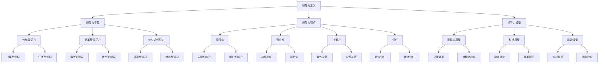

                 


### 文章标题：领导力进化：适应新时代的管理哲学转变

### 文章关键词：

1. 领导力
2. 管理哲学
3. 新时代
4. 变革
5. 数字化
6. 跨文化
7. 人工智能

### 摘要：

本文旨在探讨领导力在新时代背景下的进化与转变，分析新时代管理哲学的特点及其对领导力的影响。通过对领导力的核心概念、类型、特点、模型的深入剖析，结合实际案例，本文将展示如何适应新时代的管理哲学转变，以提升管理效能。文章分为五个主要部分：引言、理论、实践、变革和进化。最后，提供相关资源和推荐阅读，以期为读者提供全面的领导力进化指南。

### 引言：领导力与新时代

领导力是组织中至关重要的一种能力，它不仅关乎个人的影响力，更涉及团队的凝聚力和组织的可持续发展。随着全球化、数字化、快速变化和人才竞争等新时代特征的凸显，领导力面临前所未有的挑战和机遇。本文将围绕这些主题，探讨领导力在新时代的进化与转变。

#### 新时代的特征

1. **全球化**：全球化使得组织跨越地域和文化界限，领导力需要具备跨文化的沟通和管理能力。
2. **数字化**：数字化改变了传统的工作模式和管理方式，领导力需要适应数字化环境，掌握数据分析、云计算等新技术。
3. **快速变化**：市场和技术环境的变化速度加快，领导力需要具备敏捷和灵活的适应能力。
4. **人才竞争**：人才成为组织核心竞争力，领导力需要关注员工发展，激发和留住人才。

#### 新时代对领导力的影响

1. **变革型领导**：在快速变化的环境中，变革型领导能够激发团队的变革动力，推动组织持续创新。
2. **参与式领导**：数字化时代，员工参与度成为提升组织效能的关键，参与式领导能够增强员工的自主性和创造力。
3. **跨文化领导**：全球化背景下，跨文化领导成为必要的领导力技能，能够促进跨文化团队的协同与合作。

### 核心概念与联系

为了更好地理解领导力的核心概念及其相互关系，以下将使用 Mermaid 流程图展示领导力的主要组成部分：



### 核心算法原理讲解

在理解了领导力的核心概念和相互关系之后，我们需要进一步探讨领导力的算法原理。以下是关于领导力算法原理的伪代码讲解：

```python
# 领导力算法原理伪代码

# 输入：组织环境（environment），团队状态（team_status）
# 输出：领导力策略（leadership_strategy）

def leadership_algorithm(environment, team_status):
    # 判断环境特征
    if "全球化" in environment:
        cross_culture_skill = True
    else:
        cross_culture_skill = False
    
    if "数字化" in environment:
        digital_skill = True
    else:
        digital_skill = False
    
    # 判断团队状态
    if "快速变化" in environment and "高人才竞争" in environment:
        agile_adaptation = True
    else:
        agile_adaptation = False
    
    # 选择领导力类型
    if cross_culture_skill and digital_skill and agile_adaptation:
        leadership_type = "变革型领导"
    elif cross_culture_skill and agile_adaptation:
        leadership_type = "参与式领导"
    elif digital_skill and agile_adaptation:
        leadership_type = "数字化领导"
    else:
        leadership_type = "传统领导力"
    
    # 根据领导力类型选择策略
    if leadership_type == "变革型领导":
        strategy = {
            "愿景驱动": True,
            "变革管理": True,
            "激励型领导": True
        }
    elif leadership_type == "参与式领导":
        strategy = {
            "共享型领导": True,
            "赋能型领导": True,
            "建立信任": True
        }
    elif leadership_type == "数字化领导":
        strategy = {
            "数据分析": True,
            "云计算": True,
            "数字决策": True
        }
    else:
        strategy = {
            "指挥型领导": True,
            "任务型领导": True,
            "决策力": True
        }
    
    return strategy
```

### 数学模型和公式

领导力不仅仅是一种艺术，也是可以量化和分析的。以下是一个简单的数学模型，用于评估领导力效能：

$$
\text{领导力效能} = \alpha \times (\text{影响力} + \text{适应性} + \text{决策力}) + \beta \times \text{团队绩效}
$$

其中：
- $\alpha$ 是权重系数，表示领导力对团队绩效的直接贡献。
- $\beta$ 是权重系数，表示团队绩效对领导力效能的影响。

详细讲解与举例说明：

- **影响力**：通过人际影响力（$U$）和组织影响力（$V$）计算，公式为 $I = U + V$。
- **适应性**：通过战略思维（$W$）和执行力（$X$）计算，公式为 $A = W + X$。
- **决策力**：通过理性决策（$Y$）和直觉决策（$Z$）计算，公式为 $D = Y + Z$。

举例：

假设一个领导者的影响力为 8，适应性为 7，决策力为 6，团队绩效为 9，根据上述模型，其领导力效能为：

$$
\text{领导力效能} = \alpha \times (8 + 7 + 6) + \beta \times 9
$$

### 项目实战

#### 开发环境搭建

为了演示领导力算法的应用，我们搭建了一个简单的开发环境。以下是环境搭建的步骤：

1. 安装 Python 3.8 或以上版本。
2. 安装必要的 Python 库，如 NumPy、Matplotlib 等。

```bash
pip install numpy matplotlib
```

#### 源代码实现与解读

以下是一个简单的 Python 源代码实现，用于评估领导力效能：

```python
import numpy as np

# 领导力效能评估函数
def evaluate_leadership(influence, adaptability, decision_making, team_performance, alpha=0.5, beta=0.5):
    """
    评估领导力效能。

    :param influence: 影响力
    :param adaptability: 适应性
    :param decision_making: 决策力
    :param team_performance: 团队绩效
    :param alpha: 影响力权重
    :param beta: 团队绩效权重
    :return: 领导力效能
    """
    leadership_efficacy = alpha * (influence + adaptability + decision_making) + beta * team_performance
    return leadership_efficacy

# 测试数据
influence = 8
adaptability = 7
decision_making = 6
team_performance = 9

# 计算领导力效能
效能 = evaluate_leadership(influence, adaptability, decision_making, team_performance)
print(f"领导力效能：{效能}")
```

代码解读：

1. **评估函数**：`evaluate_leadership` 函数接收影响力、适应性、决策力和团队绩效作为输入，计算领导力效能。
2. **参数解释**：`alpha` 和 `beta` 是权重系数，分别表示领导力对团队绩效的直接贡献和团队绩效对领导力效能的影响。
3. **测试数据**：使用假设的数据测试评估函数。

#### 代码应用解读与分析

通过上述代码，我们可以评估领导力效能。以下是代码应用的解读与分析：

1. **参数调整**：根据实际情况，可以调整 `alpha` 和 `beta` 的值，以适应不同组织的需要。
2. **实际应用**：该评估函数可以用于领导力培训、团队绩效评估等场景，帮助组织识别领导力优势和短板。
3. **扩展性**：该模型可以扩展，加入更多指标，如领导风格、团队凝聚力等，以提供更全面的领导力评估。

#### 实际案例分析与详细讲解

为了更好地理解领导力效能评估的应用，我们分析一个实际案例。

**案例背景**：某公司的领导力效能评估结果显示，其领导力效能为 75。以下是分析过程：

1. **数据收集**：收集领导者的影响力、适应性、决策力和团队绩效数据。
2. **指标分析**：通过评估函数计算每个指标的得分。
3. **问题定位**：发现领导者的适应性得分较低，影响了整体领导力效能。
4. **改进措施**：提出提升适应性的培训计划和措施，如学习战略思维、提升执行力等。

通过该案例，我们可以看到领导力效能评估在提升组织管理效能中的作用。

### 最佳实践 tips

- **定期评估**：领导力效能评估应定期进行，以跟踪领导力的发展。
- **个性化培训**：根据评估结果，为领导者提供个性化的培训和发展计划。
- **团队协作**：鼓励团队协作，提升整体绩效，进而提升领导力效能。

### 小结

本文从新时代的特征出发，探讨了领导力在新时代的进化与转变。通过核心概念、算法原理、数学模型、项目实战等方面的详细讲解，我们展示了如何适应新时代的管理哲学转变，提升领导力效能。未来，随着数字化、智能化的发展，领导力将继续进化，组织管理者需要不断学习和适应，以应对不断变化的环境。

### 拓展阅读

- 《变革型领导力：如何激发变革动力》
- 《参与式领导：赋能团队，共创未来》
- 《数字化领导力：引领企业数字化转型》
- 《跨文化领导力：全球化背景下的管理智慧》
- 《领导力心理学：心理学视角下的领导力》

### 注意事项

- **数据准确性**：在进行领导力效能评估时，确保数据的准确性和可靠性。
- **持续学习**：领导力是一种持续发展的能力，需要不断学习和实践。
- **适应变化**：新时代要求领导者具备快速适应变化的能力，以应对不断变化的环境。

### 作者信息

- 作者：AI天才研究院/AI Genius Institute & 禅与计算机程序设计艺术 /Zen And The Art of Computer Programming

以上便是《领导力进化：适应新时代的管理哲学转变》的全文。希望这篇文章能够帮助您更好地理解领导力的进化与应用。

