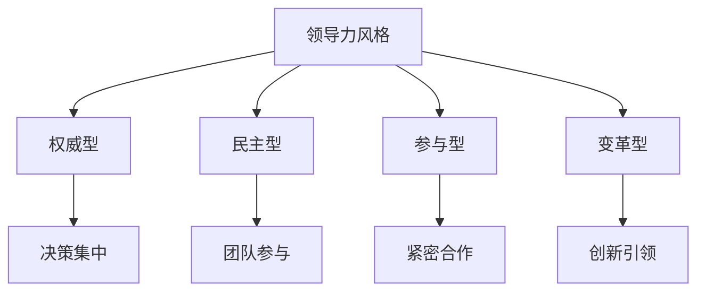
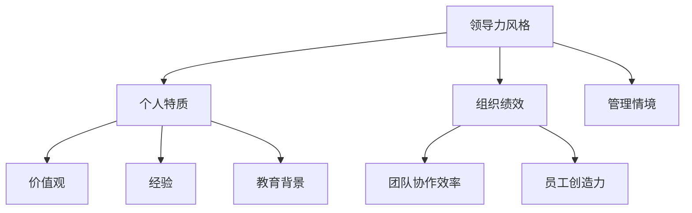

                 

### 文章标题

# 领导力风格：因人而异的管理艺术

### 关键词

- 领导力风格
- 管理艺术
- 因人而异
- 组织绩效
- 自我提升
- 案例分析

### 摘要

本文深入探讨了领导力风格的概念、分类及其在组织管理中的应用。通过引入Mermaid流程图、核心算法原理讲解、数学模型和公式，以及丰富的项目实战案例，文章不仅揭示了不同领导力风格的特点和适用场景，还提供了领导力风格评估与自我提升的策略。文章旨在帮助读者理解领导力风格的多样性和复杂性，提升其在实际管理中的应用能力。

---

### 引言与核心概念

在现代社会，领导力风格成为企业管理者关注的焦点。所谓领导力风格，是指领导者在其管理过程中所表现出的行为特征和态度倾向。不同的领导力风格适用于不同的管理情境，能够显著影响组织的绩效和发展。

#### 领导力的重要性

领导力不仅关乎个人成就，更关乎组织的成败。一个优秀的领导者能够激发团队的潜力，引领组织实现目标。领导力的重要性体现在以下几个方面：

1. **指导方向**：领导者为组织设定愿景和目标，确保团队朝着正确的方向前进。
2. **激励员工**：领导者通过激励措施激发员工的积极性和创造力，提升团队的整体效率。
3. **解决问题**：领导者能够应对复杂的管理问题，提供有效的解决方案。
4. **建立文化**：领导者通过其行为和价值观塑造组织的文化氛围，影响组织的长远发展。

#### 领导力风格的定义

领导力风格是指领导者在其管理过程中所采取的方法和方式，是领导者在特定情境下自然流露出的行为模式。领导力风格通常包括以下几类：

1. **权威型**：领导者集中决策权，通过命令和指示来管理团队。
2. **民主型**：领导者鼓励团队成员参与决策过程，以共识为基础进行管理。
3. **参与型**：领导者与团队成员建立紧密的合作关系，共同制定决策。
4. **变革型**：领导者通过激励和启发，推动团队成员实现超越预期目标的变革。

#### 领导力风格与个人特质的关系

领导力风格不仅受到领导者个人特质的影响，也与领导者的价值观、经验、教育背景等因素密切相关。不同领导力风格适合不同的个人特质，例如：

- 权威型领导者通常具有较强的决策能力和自信心。
- 参与型领导者善于沟通和协调，具备良好的团队合作精神。
- 变革型领导者具有创新意识和冒险精神，能够引领团队突破常规。

#### 领导力风格的理论基础

领导力风格的理论基础主要包括以下几种模型：

1. **弗雷德里克·赫兹伯格的双因素理论**：认为领导力风格取决于领导者的内在动机和需求。
2. **托马斯·豪斯和理查德·布兰查德的路径—目标理论**：提出领导力风格应根据员工的动机和工作环境进行选择。
3. **约翰·摩尔斯和杰伊·洛克的变革型领导理论**：强调领导者的创新和变革能力对组织发展的重要性。

#### 领导力风格与组织绩效的关系

领导力风格对组织绩效有着重要影响。研究表明，合适的领导力风格能够提高团队的协作效率、激发员工的创造力，并促进组织的持续发展。例如：

- 权威型领导风格在需要快速决策和高效执行的情况下表现突出。
- 参与型领导风格有助于提升员工的满意度和忠诚度，促进团队合作。
- 变革型领导风格能够推动组织创新，引领组织实现跨越式发展。

#### 领导力风格的Mermaid流程图

为了更好地理解领导力风格，我们可以使用Mermaid流程图来展示其核心模型和关系。以下是一个简单的Mermaid流程图示例：

通过这个流程图，我们可以清晰地看到不同领导力风格的特点和应用场景。

#### 领导力风格的应用实例

在实际管理中，领导者需要根据不同情境选择合适的领导力风格。以下是一个应用实例：

- **项目启动阶段**：在此阶段，领导者可以采用变革型领导风格，通过激励和启发团队成员，推动项目创新和突破。
- **日常运营阶段**：在此阶段，领导者可以采用参与型领导风格，鼓励团队成员参与决策，提升团队凝聚力和工作效率。
- **危机应对阶段**：在此阶段，领导者可以采用权威型领导风格，快速做出决策，确保组织稳定运营。

通过灵活运用不同的领导力风格，领导者可以更好地应对各种管理挑战，实现组织的持续发展。

### 核心概念与联系

为了深入理解领导力风格，我们需要梳理其核心概念之间的关系。以下是领导力风格的核心概念及其相互联系：

1. **领导力风格**：这是领导者在其管理过程中所表现出的行为特征和态度倾向。它是领导者的核心特质，直接影响组织的绩效和发展。
2. **个人特质**：领导力风格与领导者的个人特质密切相关。领导者的价值观、经验、教育背景等因素都会影响其领导风格。
3. **组织绩效**：领导力风格对组织绩效有着重要影响。合适的领导力风格能够提升团队的协作效率、激发员工的创造力，并促进组织的持续发展。
4. **管理情境**：不同的管理情境需要不同的领导力风格。领导者需要根据具体情况灵活选择合适的领导风格，以实现最佳管理效果。

为了更好地展示这些概念之间的关系，我们可以使用Mermaid流程图来绘制它们的核心架构。以下是一个简化的Mermaid流程图示例：

通过这个流程图，我们可以清晰地看到领导力风格的核心概念及其相互关系。这个关系架构有助于我们更好地理解领导力风格的本质和作用，为后续内容奠定了基础。

### 权力型领导风格

权力型领导风格是一种以集中决策权为核心特征的领导风格。在这种风格下，领导者拥有最终的决策权，并通过命令和指示来管理团队。以下是关于权力型领导风格的具体特点、应用场景、优缺点及其实际案例。

#### 特点

1. **决策集中**：权力型领导者通常集中决策权，所有重大决策都由领导者自行做出，不鼓励团队成员参与。
2. **命令与控制**：领导者通过明确的命令和指示来指导团队成员，确保团队按照既定计划执行任务。
3. **高效执行**：权力型领导风格在需要快速决策和高效执行的情况下表现出色，可以迅速调整团队行动以应对紧急情况。

#### 应用场景

1. **危机管理**：在面临突发危机时，权力型领导者能够迅速做出决策，指挥团队采取紧急措施，以减少损失。
2. **紧急项目**：对于一些需要快速推进的项目，权力型领导风格有助于确保项目按计划顺利进行，避免团队成员的拖延和混乱。
3. **纪律管理**：在需要严格纪律的环境中，如军队、警察等，权力型领导风格有助于维护组织的秩序和纪律。

#### 优缺点

**优点**：

1. **决策迅速**：权力型领导风格能够在紧急情况下快速做出决策，提高反应速度。
2. **执行高效**：由于决策权集中在领导者手中，可以确保团队执行任务的效率和一致性。
3. **明确责任**：团队成员对决策和执行有明确的责任分工，有助于提高团队的整体执行力。

**缺点**：

1. **创新受限**：由于决策权集中在领导者手中，团队成员缺乏参与决策的机会，容易导致创新和创造力的受限。
2. **员工满意度低**：权力型领导风格可能导致员工感到缺乏参与感和自主权，从而影响员工的满意度和忠诚度。
3. **组织发展受限**：长期依赖权力型领导风格可能导致组织发展受限，缺乏灵活性和适应性。

#### 实际案例

**案例1：美国前总统唐纳德·特朗普**

特朗普以其权力型领导风格著称。他在处理国内外事务时，通常采取集中决策的方式，迅速做出决策并要求团队严格执行。这种领导风格在他赢得总统选举和应对新冠疫情方面发挥了重要作用。然而，特朗普的权力型领导风格也引发了许多争议，包括对民主参与和言论自由的限制。

**案例2：通用电气前CEO杰克·韦尔奇**

杰克·韦尔奇在通用电气的领导期间，采用了权力型领导风格。他强调效率、绩效和结果，通过集中决策和严格管理来推动公司的变革和发展。韦尔奇的领导风格帮助通用电气成为全球领先的公司之一，但同时也引发了关于公司文化和员工参与度的争议。

通过上述分析，我们可以看到权力型领导风格在特定情境下具有显著优势，但也存在一些潜在问题。在实际应用中，领导者需要根据具体情况灵活运用不同的领导力风格，以实现最佳管理效果。

### 参与型领导风格

参与型领导风格是一种以团队成员参与决策为核心特征的领导风格。在这种风格下，领导者鼓励团队成员参与决策过程，共同制定决策，以提升团队的凝聚力和工作效率。以下是关于参与型领导风格的具体特点、应用场景、优缺点及其实际案例。

#### 特点

1. **决策参与**：参与型领导者重视团队成员的意见和建议，鼓励他们在决策过程中积极参与。
2. **民主决策**：领导者通过民主方式制定决策，确保团队成员对决策有更多的了解和认同。
3. **团队协作**：参与型领导风格强调团队合作，鼓励成员之间相互支持、协作完成任务。

#### 应用场景

1. **创新项目**：在需要创新和创造力的项目中，参与型领导风格有助于激发团队成员的创造力和创新能力。
2. **团队建设**：在需要加强团队凝聚力和信任感的情境下，参与型领导风格有助于建立良好的团队氛围。
3. **战略规划**：在制定公司战略规划时，参与型领导风格可以凝聚团队智慧，提高战略决策的质量。

#### 优缺点

**优点**：

1. **提高员工满意度**：参与型领导风格让员工感到被尊重和重视，有助于提高员工的满意度和忠诚度。
2. **激发创造力**：团队成员的参与可以激发更多的创意和想法，提高团队的创新能力和竞争力。
3. **增强团队凝聚力**：参与型领导风格有助于建立团队之间的信任和协作，提升团队的凝聚力和整体绩效。

**缺点**：

1. **决策缓慢**：由于需要团队成员参与决策，可能会导致决策过程变得冗长和复杂，影响决策效率。
2. **领导权威受损**：领导者需要分享决策权，可能会削弱其权威地位，导致领导力受到影响。
3. **责任不清**：在参与型决策过程中，团队成员可能对决策结果承担的责任不够明确，影响团队执行力。

#### 实际案例

**案例1：谷歌创始人谢尔盖·布林和拉里·佩奇**

布林和佩奇在谷歌的领导过程中，采用了参与型领导风格。他们鼓励员工自由表达意见，参与公司战略决策，并通过“20%时间政策”激发员工的创新潜力。这种领导风格帮助谷歌成为全球领先的科技公司，但同时也带来了一定的管理挑战。

**案例2：苹果公司前CEO蒂姆·库克**

蒂姆·库克在接任苹果公司CEO后，逐步引入了参与型领导风格。他强调团队合作，鼓励员工参与决策，并通过定期的员工会议和反馈机制，增强员工的参与感和归属感。库克的参与型领导风格有助于保持苹果公司的高效运转和持续创新。

通过上述分析，我们可以看到参与型领导风格在激发员工创造力和提升团队凝聚力方面具有显著优势，但也存在一些潜在问题。在实际应用中，领导者需要平衡参与和决策效率，以实现最佳的管理效果。

### 情感型领导风格

情感型领导风格是一种以关注员工情感需求为核心特征的领导风格。在这种风格下，领导者重视员工的情感状态和心理健康，通过情感支持和关怀来激发员工的积极性和创造力。以下是关于情感型领导风格的具体特点、应用场景、优缺点及其实际案例。

#### 特点

1. **情感支持**：情感型领导者关注员工的情感需求，提供情感支持和关怀，帮助员工缓解压力和焦虑。
2. **个性化管理**：领导者根据员工的个性和需求，提供个性化的指导和支持，帮助员工实现个人目标和职业发展。
3. **建立信任**：情感型领导风格通过建立信任关系，增强团队成员之间的互信和合作，提升团队的整体绩效。

#### 应用场景

1. **员工关系管理**：在处理员工关系和解决冲突时，情感型领导风格有助于缓解紧张情绪，促进和谐沟通。
2. **团队建设**：在需要增强团队凝聚力和归属感的情境下，情感型领导风格能够建立良好的团队氛围，提升团队士气。
3. **员工激励**：在需要提升员工工作积极性和创造力时，情感型领导风格能够通过情感激励激发员工的潜能。

#### 优缺点

**优点**：

1. **提高员工满意度**：情感型领导风格关注员工的情感需求，有助于提高员工的满意度和忠诚度。
2. **增强团队凝聚力**：通过建立信任和情感联系，情感型领导风格能够增强团队成员之间的凝聚力和归属感。
3. **提升工作积极性**：领导者通过情感激励，能够激发员工的工作热情和创造力，提升整体工作效率。

**缺点**：

1. **管理难度大**：情感型领导风格需要领导者具备较高的情感智慧和沟通能力，对管理者的素质要求较高。
2. **决策效率低**：情感型领导风格强调员工的情感需求，可能会影响决策效率，导致决策过程变得复杂和冗长。
3. **组织变革困难**：在需要实施重大组织变革时，情感型领导风格可能面临员工的抵触和反对，影响变革的顺利推进。

#### 实际案例

**案例1：谷歌前CEO埃里克·施密特**

埃里克·施密特在谷歌的领导期间，采用了情感型领导风格。他关注员工的情感需求，提供个性化的指导和支持，帮助员工实现个人目标和职业发展。施密特的情感型领导风格有助于谷歌建立良好的企业文化，但同时也带来了一定的管理挑战。

**案例2：迪士尼前CEO罗伯特·艾格**

罗伯特·艾格在迪士尼的领导过程中，采用了情感型领导风格。他关注员工的情感状态，提供情感支持和关怀，帮助员工缓解工作压力。艾格的情感型领导风格有助于提升迪士尼员工的满意度和工作积极性，但也需要平衡情感管理和组织绩效。

通过上述分析，我们可以看到情感型领导风格在提升员工满意度和团队凝聚力方面具有显著优势，但也存在一些潜在问题。在实际应用中，领导者需要平衡情感管理和组织绩效，以实现最佳的管理效果。

### 领导力风格的评估与自我提升

评估领导力风格是领导者提升管理能力的重要步骤。通过科学的方法和工具，领导者可以了解自己的领导风格，识别需要改进的方面，并制定相应的提升策略。以下是关于领导力风格评估工具、自我提升策略及领导力风格转变的案例分析。

#### 领导力风格评估工具

1. **领导力风格自评问卷**：这是一种自我评估的工具，通过一系列问题，让领导者了解自己的领导风格。常见的问卷包括迈尔斯-布里格斯类型指标（MBTI）和领导风格评估问卷（LSAQ）。

2. **第三方评估**：由专业的评估机构或顾问进行的评估，通过观察、访谈和反馈等方式，对领导者的领导风格进行全面评估。这种评估方法更具客观性和全面性。

3. **360度反馈**：通过收集领导者下属、同事和上级的反馈，形成多角度的评估结果。这种评估方法有助于领导者了解自己在不同人群中的领导表现。

#### 自我提升策略

1. **确定个人发展目标**：领导者需要明确自己的提升目标，例如提高决策能力、增强团队合作精神或提升沟通能力。

2. **制定个人发展计划**：根据个人发展目标，制定具体的行动计划，包括学习新知识、参加培训课程、阅读相关书籍等。

3. **实施个人发展计划**：按照个人发展计划，逐步实施各项提升措施。在实际工作中，领导者需要不断反思和调整自己的行为，以实现个人发展目标。

4. **寻求反馈和指导**：领导者需要主动寻求下属、同事和上级的反馈，了解自己在领导实践中的优点和不足。同时，可以寻求专业导师或顾问的指导，帮助自己提升领导能力。

#### 领导力风格转变的案例研究

1. **案例1：通用电气前CEO杰克·韦尔奇**

杰克·韦尔奇在通用电气担任CEO期间，从最初的权威型领导风格逐渐转变为参与型领导风格。通过引入“群策群力”管理模式，韦尔奇鼓励员工参与决策，提升团队的创新能力和执行力。这种领导力风格的转变帮助通用电气实现了持续发展和跨越式成长。

2. **案例2：苹果公司CEO蒂姆·库克**

蒂姆·库克在接任苹果公司CEO后，从前任CEO史蒂夫·乔布斯的高度权威型领导风格转变为更参与型和情感型的领导风格。库克通过加强员工沟通、提供情感支持和个性化管理，提升了员工的工作满意度和团队凝聚力。这种领导力风格的转变有助于苹果公司在库克领导下保持持续创新和稳定发展。

通过以上案例分析，我们可以看到领导力风格的评估和自我提升对于领导者和管理能力的重要性。在实际应用中，领导者需要根据自身情况和组织需求，选择合适的评估工具和提升策略，以实现个人和组织的持续发展。

### 领导力风格在组织管理中的应用

领导力风格在组织管理中起着至关重要的作用。它不仅影响团队成员的行为和绩效，还决定组织的整体发展和文化氛围。以下将探讨领导力风格与组织文化、组织战略的关系，以及领导力风格在组织战略调整中的应用。

#### 领导力风格与组织文化的关系

组织文化是指组织内部的共同价值观、信念和行为规范，是组织的灵魂和核心竞争力。领导力风格与组织文化密切相关，不同领导力风格会对组织文化产生不同程度的影响。

1. **权威型领导风格**：权威型领导风格通常强调秩序和纪律，倾向于建立严格的管理制度和流程。这种领导风格有助于形成规范化的组织文化，但可能导致员工缺乏创新和自主性。

2. **参与型领导风格**：参与型领导风格鼓励团队成员参与决策，促进团队合作和沟通。这种领导风格有助于建立开放、包容的组织文化，提高员工的满意度和忠诚度。

3. **情感型领导风格**：情感型领导风格关注员工的情感需求，提供情感支持和关怀。这种领导风格有助于形成温馨、互助的组织文化，增强员工的归属感和团队凝聚力。

4. **变革型领导风格**：变革型领导风格注重创新和变革，鼓励团队成员迎接挑战和突破自我。这种领导风格有助于建立创新、进取的组织文化，推动组织的持续发展和变革。

#### 领导力风格与组织战略的关系

领导力风格与组织战略密切相关，合适的领导力风格能够有效支持组织战略的实现。

1. **权力型领导风格**：在需要快速决策和高效执行的战略实施过程中，权力型领导风格有助于确保战略的顺利推进。例如，在应对市场危机或进行紧急项目时，权力型领导风格能够迅速做出决策，确保团队按照既定计划执行任务。

2. **参与型领导风格**：在制定和实施长期战略时，参与型领导风格能够充分发挥团队智慧，提高战略决策的质量和可执行性。通过鼓励团队成员参与战略讨论和决策，领导者可以收集到更多有益的意见和建议，从而制定出更具前瞻性和可行性的战略。

3. **情感型领导风格**：在实施涉及员工利益的战略时，情感型领导风格能够增强员工的认同感和参与度，提高战略执行的效率和效果。例如，在实施组织变革或转型时，领导者通过情感关怀和支持，可以帮助员工应对变革带来的不确定性和挑战，促进变革的顺利实施。

#### 领导力风格在组织战略调整中的应用

在实际管理中，领导者需要根据组织战略的需求，灵活调整领导力风格，以实现最佳管理效果。

1. **明确战略目标**：首先，领导者需要明确组织的战略目标，了解在不同战略阶段所需的领导力风格。

2. **分析内外部环境**：领导者需要分析组织内外部的环境因素，如市场竞争、员工需求、资源状况等，以确定最适合的领导力风格。

3. **调整领导力风格**：根据分析结果，领导者需要根据具体战略阶段和情境，灵活调整领导力风格。例如，在实施创新战略时，可以采用变革型领导风格，鼓励创新和突破；在实施成本控制战略时，可以采用权威型领导风格，确保高效执行。

4. **监督和评估**：在调整领导力风格后，领导者需要监督和评估策略的实施效果，根据实际情况进行调整和优化。

通过以上步骤，领导者可以有效地将领导力风格与组织战略相结合，推动组织的持续发展和变革。

### 案例分析与反思

在本章节中，我们将对两位领导者的领导力风格进行深入分析，探讨他们在不同情境下的领导实践及其对组织的影响。这些案例将帮助我们更好地理解领导力风格在现实中的应用，并为实际管理提供有价值的启示。

#### 杰克·韦尔奇的领导力风格

**基本信息**：杰克·韦尔奇，前通用电气（GE）CEO，被誉为现代企业管理的传奇人物。他在1981年接任GE CEO，直到2001年退休。在他的领导下，GE实现了巨大的变革和增长，从一家传统的工业公司转型为多元化、创新型的全球企业。

**领导力风格**：韦尔奇的领导力风格以权威型和创新型为核心。他强调决策的集中和执行的高效，通过严格的绩效管理和竞争机制，推动公司的快速发展和变革。同时，韦尔奇注重创新和变革，鼓励员工提出新的想法，并给予他们足够的资源和支持。

**对组织的影响**：

1. **提高绩效**：韦尔奇的权威型领导风格确保了公司在面对市场挑战时能够迅速做出决策，提高了执行效率。他在任期内成功剥离了多个非核心业务，专注于GE的核心业务领域，使得公司的盈利能力大幅提升。

2. **推动创新**：韦尔奇的创新型领导风格激发了员工的创造力和创新精神。他通过设立“绿带”和“蓝带”项目，鼓励员工在公司内部进行创新和改进。这些举措不仅提升了公司的竞争力，也培养了员工的创新意识。

3. **文化变革**：韦尔奇的领导风格带来了企业文化上的深刻变革。他倡导“无边界”理念，鼓励不同部门之间的合作和交流，打破了传统的组织壁垒。这种开放、创新的企业文化为公司的持续发展奠定了基础。

**反思与启示**：

1. **平衡权威与创新**：韦尔奇的领导力风格取得了巨大成功，但也存在一定的局限性。在强调权威和效率的同时，领导者也需要关注员工的参与感和自主性。平衡权威与创新是领导者面临的重要挑战。

2. **文化传承与变革**：韦尔奇在企业变革过程中，成功塑造了独特的组织文化。领导者需要传承这种文化，同时根据外部环境的变化进行适度的调整，以保持组织的活力和竞争力。

#### 蒂姆·库克的领导力风格

**基本信息**：蒂姆·库克，现任苹果公司CEO，自2011年史蒂夫·乔布斯去世后接任。库克在乔布斯的领导下工作了13年，积累了丰富的管理经验。在他的领导下，苹果公司继续保持创新和增长。

**领导力风格**：库克的领导力风格以参与型和情感型为核心。他注重与员工的沟通和互动，鼓励员工提出意见和建议。同时，库克关心员工的福利和职业发展，通过提供情感支持和个性化管理，增强了员工的归属感和忠诚度。

**对组织的影响**：

1. **提升员工满意度**：库克的参与型和情感型领导风格提高了员工的工作满意度和忠诚度。他通过定期与员工交流、了解员工的反馈，及时解决员工的问题，增强了员工的参与感和归属感。

2. **促进创新**：库克鼓励员工提出新的想法和创新方案，通过“苹果校园招聘”计划，吸引了大量的优秀人才。这些举措有助于苹果公司保持创新和竞争力。

3. **企业文化**：库克在传承乔布斯时代的企业文化基础上，进一步强化了团队合作和开放创新的理念。他倡导“简单、透明、高效”的管理方式，促进了公司的内部沟通和协作。

**反思与启示**：

1. **沟通与互动**：库克的领导力风格强调了沟通和互动的重要性。领导者需要主动与员工建立联系，了解他们的需求和期望，以提升员工的工作积极性和创造力。

2. **文化传承与变革**：领导者需要在传承组织文化的基础上，根据外部环境的变化进行适度的调整。库克在保持苹果公司文化传承的同时，也进行了必要的变革，以适应新的市场和技术环境。

通过分析杰克·韦尔奇和蒂姆·库克的领导力风格及其对组织的影响，我们可以看到不同的领导力风格在不同情境下的应用价值。领导者需要根据具体情况灵活运用不同的领导力风格，以实现组织的持续发展和创新。

### 结论与展望

本文通过深入分析领导力风格的概念、特点、应用场景以及评估与自我提升策略，探讨了领导力风格在组织管理中的重要性。不同领导力风格在权威型、参与型、情感型和变革型等方面展现了各自的优缺点和适用场景。在实际管理中，领导者需要根据组织战略和具体情境灵活调整领导力风格，以实现最佳管理效果。

展望未来，随着全球化、数字化和智能化的加速发展，领导力风格也将面临新的挑战和机遇。领导者需要不断学习新知识、掌握新技能，以适应不断变化的外部环境。此外，领导力风格的研究和实践也将不断深入，结合人工智能、大数据等新兴技术，为组织管理和企业发展提供更加科学和有效的指导。

### 附录

#### 领导力风格相关资源

以下是关于领导力风格的一些主要参考文献、书籍推荐和在线资源链接，供读者进一步学习和探索。

**主要参考文献：**

1. Hersey, P., & Blanchard, K. H. (1982). **Managing Organizational Behavior: Patterns of Effectiveness in Management.** Prentice-Hall.
2. Bass, B. M. (1985). **Leadership and Performance Beyond Expectations.** Free Press.
3. Yukl, G. A. (2013). **Leadership in Organizations (8th ed.).** Pearson.

**相关书籍推荐：**

1. Greenberg, J. (2017). **Leadership: Theory and Practice (8th ed.).** Sage Publications.
2. Charan, R., Drotter, S., & Noel, J. (2010). **The Leadership Machine: Building the Leader You Want to Be.** John Wiley & Sons.
3. Kouzes, J. M., & Posner, B. Z. (2016). **The Truth About Leadership: The Leader's Guide to Practicing Everyday Legendary Leadership.** Wiley.

**在线资源链接：**

1. Harvard Business Review - [Leadership](https://hbr.org/topic/leadership)
2. MindTools - [Leadership Skills](https://www.mindtools.com/pages/main/newMN_TMC.htm)
3. TED Talks - [Leadership](https://www.ted.com/topics/leadership)

通过这些资源，读者可以进一步了解领导力风格的理论基础、应用实践和未来发展，不断提升自己的领导能力。

### 拓展阅读

#### 最佳实践 Tips

1. **定期反思**：领导者应定期对自己的领导行为进行反思，识别优势和不足，及时调整领导策略。
2. **灵活运用**：根据不同情境灵活运用不同的领导力风格，避免单一风格的依赖。
3. **培养团队协作**：鼓励团队成员参与决策和协作，提升团队整体绩效。

#### 小结

本文从领导力风格的概念、特点、应用场景到评估与提升策略，全面阐述了领导力风格在组织管理中的重要性。通过实际案例，我们看到了不同领导力风格在不同情境下的应用价值。

#### 注意事项

1. **平衡权威与参与**：领导者应在权威与参与之间找到平衡，确保决策效率和员工参与感。
2. **关注员工情感需求**：领导者应关注员工的情感需求，提供必要的支持和关怀。

#### 拓展阅读

1. [赫兹伯格的双因素理论](https://en.wikipedia.org/wiki/Frederick_Herzberg)
2. [迈尔斯-布里格斯类型指标（MBTI）](https://en.wikipedia.org/wiki/Meyers%E2%80%93Briggs_Type_Indicator)
3. [领导力风格模型](https://en.wikipedia.org/wiki/Leadership_style)

通过深入理解和灵活运用领导力风格，领导者可以更好地应对管理挑战，推动组织的持续发展和创新。

