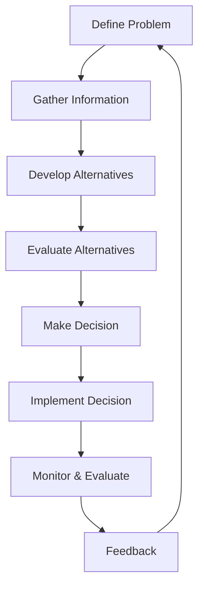
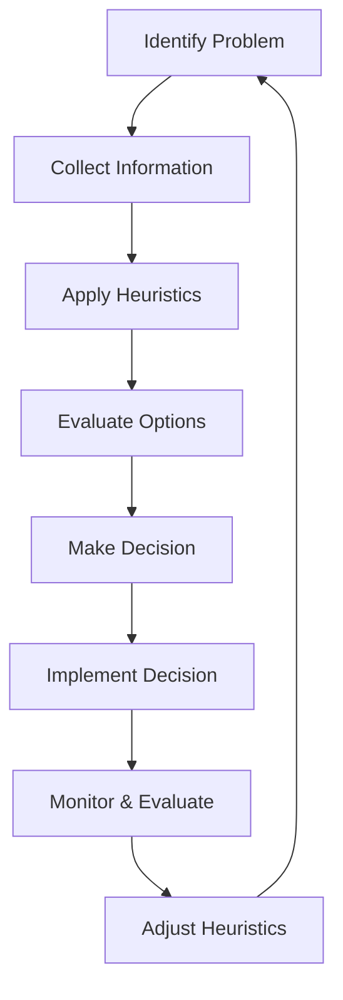
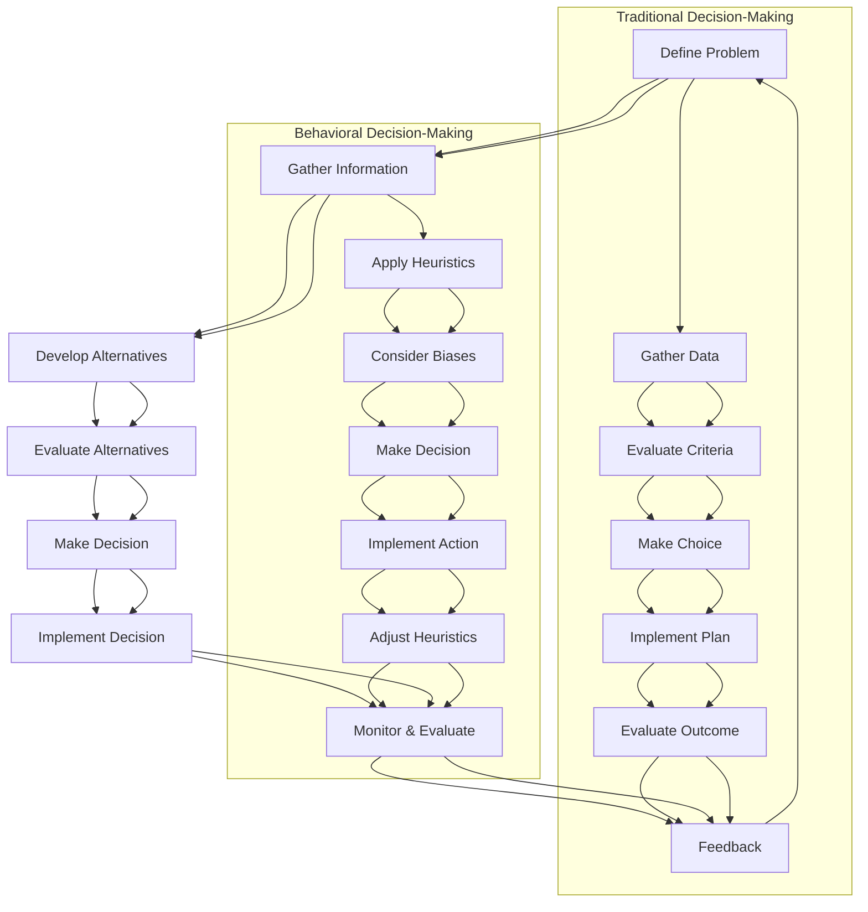

                 

Sure, let's dive into the creation of the article "Leadership Decisions: Making Choices in Critical Moments" using a step-by-step reasoning approach. Here's how we can structure the content:

### Introduction

#### Background
- Discuss the importance of decision-making in leadership roles.
- Highlight the challenges that leaders face when making critical decisions.
- Present the context in which leaders need to make quick and effective decisions.

#### Core Concepts
- Define key terms such as decision-making, leadership, and critical moments.
- Explain the relevance of decision-making in various sectors like business, technology, and healthcare.

#### Importance of the Article
- Outline why understanding and improving decision-making skills is crucial for leaders.
- Introduce the main themes and objectives of the article.

### Decision-Making Theories and Models

#### Traditional vs. Modern Approaches
- Describe traditional decision-making theories such as rational decision-making.
- Introduce modern approaches like behavioral decision-making.

#### Rational Decision-Making
- Define rational decision-making and its components (e.g., decision criteria, alternatives, and outcomes).
- Present a Mermaid flow diagram illustrating the rational decision-making process.

#### Behavioral Decision-Making
- Discuss the influence of psychological factors on decision-making.
- Explain the concept of heuristics and biases.

#### Mermaid Flow Diagram of Decision-Making Process
- Create a Mermaid diagram that visually represents the different stages of decision-making.

### Decision-Making Process and Techniques

#### Problem Identification
- Explain how to recognize and define a problem in a leadership context.
- Discuss the importance of clear problem identification.

#### Information Gathering
- Describe the methods leaders use to gather information (e.g., data analysis, expert consultation, market research).
- Highlight the importance of accurate and relevant information.

#### Option Evaluation
- Present techniques for evaluating options, such as cost-benefit analysis and multi-criteria decision analysis.
- Provide a Mermaid flow diagram for option evaluation.

#### Decision Implementation
- Discuss strategies for implementing decisions effectively.
- Explain the importance of communication and stakeholder involvement.

#### Feedback and Learning
- Explain how feedback can improve decision-making.
- Discuss the concept of continuous learning and improvement.

### Critical Thinking and Problem Solving

#### Developing Critical Thinking Skills
- Outline the key components of critical thinking (e.g., questioning assumptions, evaluating evidence).
- Provide strategies for developing critical thinking skills in leaders.

#### Problem Definition
- Explain how to define problems effectively.
- Discuss the importance of a clear problem statement.

#### Generating Solutions
- Describe techniques for generating potential solutions (e.g., brainstorming, mind mapping).
- Highlight the importance of creativity in problem-solving.

#### Analyzing Solutions
- Present methods for analyzing and comparing solutions (e.g., SWOT analysis, decision trees).
- Provide a Mermaid flow diagram for solution analysis.

#### Implementing Solutions
- Discuss strategies for implementing solutions effectively.
- Highlight the importance of monitoring and adjusting as needed.

#### Case Study: Problem Solving in Practice
- Present a real-world case study that illustrates the application of problem-solving techniques.
- Analyze the case study and discuss the lessons learned.

### Risk Management and Uncertainty

#### Understanding Risk
- Define risk and its components (e.g., probability, impact).
- Explain the different types of risks leaders may face.

#### Assessing and Quantifying Risk
- Describe methods for assessing and quantifying risk (e.g., risk matrices, Monte Carlo simulation).
- Provide a Mermaid flow diagram for risk assessment.

#### Risk Mitigation Strategies
- Discuss strategies for mitigating risk (e.g., risk avoidance, risk reduction, risk transfer).
- Provide a Mermaid flow diagram for risk mitigation.

#### Handling Uncertainty
- Explain how leaders can make decisions in uncertain situations.
- Discuss techniques for dealing with uncertainty (e.g., scenario analysis, decision-making under ambiguity).

#### Decision-Making under Uncertainty
- Present methods for decision-making under uncertainty (e.g., decision analysis, robust decision-making).
- Provide a Mermaid flow diagram for decision-making under uncertainty.

#### Mathematical Model and Formulae
- Introduce mathematical models and formulae for risk analysis and decision-making.
- Provide detailed explanations and examples.

### Ethics and Values in Decision-Making

#### Ethical Principles
- Discuss key ethical principles that leaders should consider when making decisions (e.g., deontological ethics, consequentialism).
- Explain the role of ethics in leadership.

#### Values in Decision-Making
- Highlight the importance of personal and organizational values in decision-making.
- Discuss how values influence decision-making processes.

#### Ethical Dilemmas
- Present examples of ethical dilemmas that leaders may face.
- Discuss strategies for resolving ethical dilemmas.

#### Ethical Leadership
- Explain the concept of ethical leadership.
- Discuss the impact of ethical leadership on organizational culture and decision-making.

### Case Studies and Practical Applications

#### Case Study 1: Crisis Management
- Present a case study involving a critical decision made during a crisis.
- Analyze the decision-making process and the outcomes.

#### Case Study 2: Strategic Planning
- Present a case study involving a strategic decision made by a leader.
- Analyze the decision-making process and the outcomes.

#### Case Study 3: Organizational Change
- Present a case study involving a decision to implement organizational change.
- Analyze the decision-making process and the outcomes.

### Developing Decision-Making Skills

#### Skills and Competencies
- Discuss the key skills and competencies that leaders need to develop for effective decision-making.
- Provide recommendations for developing these skills.

#### Continuous Improvement
- Explain the importance of continuous improvement in decision-making.
- Discuss strategies for continuous learning and improvement.

### Conclusion

#### Summary
- Summarize the main points discussed in the article.

#### Impact on Leadership
- Discuss the impact of effective decision-making on leadership effectiveness and organizational success.

#### Future Directions
- Suggest areas for further research and exploration in the field of leadership decision-making.

### Author Information

- Provide author information as specified.

### References

- List references used in the article.

### Mermaid Diagrams and Code Snippets

- Include all Mermaid diagrams and relevant code snippets within the article.

By following this structured approach, we can ensure that the article is comprehensive, informative, and engaging for readers interested in leadership and decision-making. Each section will be carefully crafted to provide depth and clarity, making it a valuable resource for leaders and aspiring leaders alike.## Introduction

### Background

In the fast-paced and ever-evolving world we live in, the role of leadership has become increasingly complex. Leaders are often required to make critical decisions that can have far-reaching consequences for their organizations, teams, and stakeholders. The ability to make sound, well-informed decisions under pressure is not only a hallmark of effective leadership but also a crucial skill for navigating the myriad challenges that arise in today's dynamic business environment.

The importance of decision-making in leadership cannot be overstated. Leaders are constantly faced with situations that demand quick action and strategic thinking. Whether it's responding to a market shift, managing a crisis, or allocating resources, the decisions leaders make can significantly impact the success of their organizations. In many cases, the difference between success and failure comes down to the quality of the decisions made.

This article aims to delve into the intricacies of leadership decisions, particularly those made in critical moments. It will explore various decision-making theories and models, the process of decision-making, critical thinking and problem-solving techniques, risk management, ethics in decision-making, and practical applications through case studies. By the end of this article, readers will have a comprehensive understanding of the principles and strategies that underpin effective decision-making in leadership roles.

#### Core Concepts

**Decision-Making**: Decision-making is the process of selecting the best course of action among several alternatives to achieve specific objectives. In a leadership context, decision-making involves considering various options, assessing their potential outcomes, and choosing the most appropriate action to take.

**Leadership**: Leadership is the ability of an individual or a group to guide, influence, and motivate others towards achieving common goals. Effective leaders inspire and empower their teams to perform at their best, fostering a culture of collaboration and innovation.

**Critical Moments**: Critical moments refer to situations where timely and effective decision-making is crucial. These moments often involve high stakes, uncertainty, and the potential for significant impact on the organization or its stakeholders.

#### Importance of the Article

Understanding and improving decision-making skills is essential for leaders for several reasons:

1. **Enhancing Leadership Effectiveness**: Effective decision-making is a fundamental aspect of leadership. Leaders who can make sound decisions are more likely to be perceived as effective and capable by their teams and stakeholders.

2. **Navigating Complexity**: Today's business landscape is more complex than ever. Leaders must be able to handle a wide range of challenges, from technological disruptions to economic volatility. Effective decision-making helps leaders navigate these complexities and maintain their organizations' competitive edge.

3. **Ensuring Organizational Success**: The decisions leaders make can significantly impact the success of their organizations. Poor decisions can lead to financial loss, reputational damage, and organizational decline, while good decisions can drive growth, innovation, and success.

4. **Building Trust and Credibility**: Leaders who consistently make well-informed and ethical decisions build trust and credibility with their teams and stakeholders. This trust is crucial for fostering a positive organizational culture and achieving long-term success.

This article will provide readers with a deep understanding of the principles and practices of effective decision-making, equipping them with the knowledge and tools needed to make better decisions in critical moments. By exploring various decision-making theories, models, and practical techniques, readers will gain insights into how to approach decision-making in a structured and systematic way. Whether you are a seasoned leader or aspiring to take on a leadership role, this article will offer valuable guidance for enhancing your decision-making skills and leadership effectiveness.

### Decision-Making Theories and Models

Decision-making is a complex process that has been the subject of extensive research and discussion in various fields, including psychology, economics, and management. Over the years, several theories and models have been proposed to explain how individuals and organizations make decisions. These theories can be broadly categorized into traditional and modern approaches, each offering unique insights into the decision-making process.

#### Traditional vs. Modern Approaches

**Traditional Approaches**

Traditional decision-making theories are rooted in the concept of rationality. One of the most well-known traditional models is the **Rational Decision-Making Model**, which was proposed by Howard Raiffa and James March. This model assumes that decision-makers systematically evaluate all available information, consider all possible alternatives, and select the option that maximizes their utility or satisfaction.

Other traditional models include:

- **Vroom-Yetton Model**: This model provides a decision-making framework that considers the decision-making style of the leader and the complexity of the situation. It suggests different decision-making strategies depending on the level of involvement required from subordinates and the nature of the problem.

- **Multi-Criteria Decision Analysis (MCDA)**: This approach involves evaluating options based on multiple criteria, such as cost, quality, and time. It helps decision-makers compare alternatives in a structured and objective manner.

**Modern Approaches**

Modern decision-making theories focus more on the psychological and social aspects of decision-making. One prominent modern model is **Behavioral Decision-Making**, which was developed to address the shortcomings of traditional rational models. This approach takes into account the cognitive biases and heuristics that affect decision-making.

Other modern models include:

- **Prospect Theory**: Developed by Daniel Kahneman and Amos Tversky, this theory explains how individuals make decisions under uncertainty. It introduces concepts like loss aversion and the probability weighting function, which help explain why people often make irrational decisions.

- **Intuitive Decision-Making**: This model suggests that decision-makers often rely on intuition, rather than systematic analysis, to make decisions. Intuitive decision-making can be particularly effective in high-stress situations where there is limited time to analyze all the available information.

#### Rational Decision-Making

**Rational Decision-Making Model**

The Rational Decision-Making Model is one of the most widely accepted traditional decision-making frameworks. It consists of several sequential steps that guide decision-makers through the process of making a rational decision.

**Steps:**

1. **Defining the Problem**: The first step is to clearly define the problem or opportunity. This involves identifying the decision to be made, the objectives to be achieved, and the constraints that must be considered.

2. **Gathering Information**: In this step, decision-makers collect all relevant information that could influence the decision. This may involve conducting research, consulting experts, and analyzing data.

3. **Developing Alternatives**: Once the information is gathered, decision-makers generate a list of possible alternatives or solutions to the problem. It's important to be creative and consider all possible options, even those that seem unconventional at first glance.

4. **Evaluating Alternatives**: In this step, decision-makers evaluate each alternative based on the defined objectives and constraints. They may use decision criteria such as cost, risk, and feasibility to compare the alternatives.

5. **Making the Decision**: After evaluating the alternatives, decision-makers select the option that best meets the objectives and constraints. It's important to be clear and consistent in this step to avoid ambiguity or confusion.

6. **Implementing the Decision**: Once the decision is made, it needs to be implemented. This involves planning, organizing resources, and communicating the decision to all stakeholders.

7. **Monitoring and Evaluating the Decision**: After the decision is implemented, decision-makers need to monitor the outcomes and evaluate the effectiveness of the decision. This feedback loop helps in learning from the decision and making improvements for future decisions.

**Mermaid Flow Diagram of Rational Decision-Making Process**

#### Behavioral Decision-Making

**Heuristics and Biases**

Behavioral Decision-Making seeks to explain the deviations from rational decision-making observed in real-life situations. This approach considers the role of cognitive biases and heuristics, which are mental shortcuts that simplify the decision-making process but can sometimes lead to irrational decisions.

**Key Concepts:**

- **Heuristics**: Heuristics are rules of thumb or simplified decision-making strategies that help people make quick decisions. Examples include the **availability heuristic** (judging the probability of an event based on how easily examples come to mind) and the **confirmation bias** (favoring information that confirms one's preconceptions).

- **Biases**: Biases are systematic errors in decision-making that can result from cognitive heuristics. Examples include **overconfidence** (underestimating the uncertainty of outcomes) and **anchoring** (relying too heavily on the first piece of information encountered).

**Mermaid Flow Diagram of Behavioral Decision-Making Process**

#### Mermaid Flow Diagram

Below is a combined Mermaid diagram that illustrates both the Rational Decision-Making and Behavioral Decision-Making processes, showing the similarities and differences between the two approaches:

In conclusion, understanding both traditional and modern decision-making theories and models is essential for leaders to make informed and effective decisions. While traditional approaches emphasize rationality and systematic analysis, modern approaches consider the psychological and social factors that influence decision-making. By combining the insights from these different approaches, leaders can develop a more holistic and effective decision-making framework.

### Decision-Making Process and Techniques

Effective decision-making is a critical skill for leaders, and it involves a systematic and well-structured process. This section will delve into the various stages of the decision-making process, from problem identification to feedback and learning, along with the techniques that can be employed at each step.

#### Problem Identification

The first step in the decision-making process is identifying the problem. This involves recognizing a gap between the current state and the desired state or understanding an opportunity that can be leveraged for the organization's benefit.

**Techniques for Problem Identification:**

1. **Root Cause Analysis**: This technique involves digging deep into the underlying causes of a problem, rather than just addressing the symptoms. Tools like the **5 Whys** method can be used to explore the root causes systematically.

2. **SWOT Analysis**: A SWOT (Strengths, Weaknesses, Opportunities, Threats) analysis helps in identifying both internal and external factors that may impact the decision-making process. This analysis provides a comprehensive overview of the current situation.

3. **Fishbone Diagram**: Also known as the **Ishikawa diagram**, this tool helps in identifying the potential causes of a problem by organizing them into categories such as people, processes, materials, machines, and environment.

**Example:**

Suppose a company is facing a decline in sales. Using a SWOT analysis, the team identifies that the weakness is a lack of marketing efforts, while the opportunity lies in expanding into new markets. This sets the stage for further decision-making.

#### Information Gathering

Once the problem is identified, the next step is to gather all relevant information that can help in understanding the problem and generating potential solutions.

**Techniques for Information Gathering:**

1. **Data Analysis**: This involves collecting and analyzing quantitative and qualitative data related to the problem. Tools like spreadsheets, statistical software, and data visualization tools can be used for this purpose.

2. **Expert Consultation**: Seeking advice from experts or subject matter experts can provide valuable insights and different perspectives on the problem. This can be done through interviews, focus groups, or expert panels.

3. **Market Research**: Conducting market research can help in understanding customer needs, market trends, and competitive dynamics. Surveys, interviews, and observations are common methods for collecting market data.

**Example:**

To address the decline in sales, the company may analyze sales data to identify specific products or regions that are underperforming. They may also conduct customer surveys to understand their preferences and expectations.

#### Option Evaluation

After gathering the necessary information, the next step is to evaluate the potential options or solutions to the problem.

**Techniques for Option Evaluation:**

1. **Cost-Benefit Analysis**: This technique involves comparing the costs of implementing a solution against the benefits it is expected to provide. It helps in determining the financial viability of each option.

2. **Multi-Criteria Decision Analysis (MCDA)**: This approach involves evaluating options based on multiple criteria, such as cost, time, quality, and risk. Each criterion is assigned a weight based on its relative importance, and options are scored against each criterion.

3. **Decision Trees**: This graphical representation helps in visualizing the different outcomes of each decision and the probabilities associated with them. It is particularly useful for decisions involving uncertainty and risk.

**Example:**

The company may evaluate three potential solutions for addressing the sales decline: increasing marketing spending, launching a new product line, or entering a new market. Using cost-benefit analysis, they compare the expected return on investment for each option.

#### Decision Implementation

Once a decision has been made, it needs to be implemented effectively. This involves planning, organizing resources, and communicating the decision to all stakeholders.

**Techniques for Decision Implementation:**

1. **Action Planning**: Creating a detailed action plan that outlines the steps to be taken, the resources required, and the timeline for implementation.

2. **Communication Strategy**: Developing a clear and compelling communication plan to ensure that all stakeholders are informed and on board with the decision.

3. **Resource Allocation**: Ensuring that the necessary resources, such as budget, personnel, and technology, are allocated appropriately to support the implementation of the decision.

**Example:**

The company decides to increase marketing spending. They develop an action plan that includes allocating a specific budget, hiring additional marketing staff, and launching targeted advertising campaigns. They also communicate the decision to all employees and stakeholders to ensure buy-in and support.

#### Feedback and Learning

After the decision has been implemented, it is important to monitor the outcomes and gather feedback to evaluate the effectiveness of the decision. This feedback can then be used to make adjustments and improve future decisions.

**Techniques for Feedback and Learning:**

1. **Performance Measurement**: Setting up metrics to track the performance of the decision. This can include financial metrics, customer satisfaction scores, and operational metrics.

2. **Post-Implementation Review**: Conducting a review to assess the outcomes of the decision and identify any areas for improvement. This can involve collecting data, conducting interviews, and analyzing results.

3. **Continuous Improvement**: Using the feedback and lessons learned to make continuous improvements in decision-making processes. This can involve updating policies, refining techniques, and providing additional training.

**Example:**

After implementing the increased marketing spending, the company monitors key performance indicators such as sales growth and customer engagement metrics. They conduct a post-implementation review to assess the effectiveness of the decision and make any necessary adjustments.

By following a systematic decision-making process and employing appropriate techniques at each step, leaders can make more informed and effective decisions. This not only improves the outcomes of individual decisions but also enhances the overall decision-making capability of the organization.

### Critical Thinking and Problem Solving

Critical thinking and problem-solving are foundational skills for effective leadership. They enable leaders to analyze complex situations, identify underlying issues, and develop innovative solutions. This section will delve into the components of critical thinking, the steps involved in problem-solving, and practical strategies for enhancing these skills.

#### Developing Critical Thinking Skills

**Key Components of Critical Thinking:**

1. **Analytical Thinking**: This involves breaking down complex problems into smaller, more manageable parts to understand the relationships and interactions between them.

2. **Synthetic Thinking**: This is the ability to integrate different pieces of information and create new insights or perspectives. It involves seeing the "big picture" and understanding how different elements fit together.

3. **Deductive Reasoning**: This is a type of reasoning that moves from general principles to specific conclusions. It involves applying established theories or principles to a particular situation.

4. **Inductive Reasoning**: This is the reverse of deductive reasoning, moving from specific observations to general conclusions. It involves identifying patterns and trends from data.

5. **Creative Thinking**: This involves generating new ideas and approaches to problems. It's about thinking outside the box and approaching challenges in innovative ways.

**Strategies for Developing Critical Thinking Skills:**

1. **Questioning**: Encourage a culture of questioning within your team. Ask "why" and "how" questions to challenge assumptions and explore underlying causes.

2. **Active Listening**: Pay attention to all perspectives and information. Listen actively to understand, not just to respond.

3. **Reflection**: Take time to reflect on decisions and their outcomes. This helps in learning from past experiences and improving future decision-making.

4. **Perspective Taking**: Try to see things from different angles. Understand the viewpoints of various stakeholders to gain a more comprehensive understanding of the problem.

5. **Mind Mapping**: Use mind mapping techniques to visualize ideas and connections. This helps in organizing thoughts and identifying patterns.

#### Problem Definition

**Steps in Problem Definition:**

1. **Identify the Issue**: Start by clearly defining the problem. Avoid vague or general statements. Be specific about what the problem is and how it affects the organization.

2. **Gather Data**: Collect relevant data to understand the scope and impact of the problem. Use tools like surveys, interviews, and data analysis to gather information.

3. **Analyze Root Causes**: Use techniques like the **5 Whys** or **Fishbone Diagram** to identify the root causes of the problem. Understanding the underlying causes is crucial for developing effective solutions.

4. **Set Objectives**: Define clear objectives for solving the problem. These objectives should be specific, measurable, achievable, relevant, and time-bound (SMART).

**Example:**

A company notices a decline in customer satisfaction. Through surveys and interviews, they gather data indicating that the main issues are long wait times and a lack of product knowledge among customer service representatives. Using the 5 Whys technique, they identify that the root cause is a lack of training and resources for the customer service team.

#### Generating Solutions

**Strategies for Generating Solutions:**

1. **Brainstorming**: Encourage open and creative brainstorming sessions with your team. This can help generate a wide range of potential solutions.

2. **Mind Mapping**: Use mind mapping to visualize ideas and connections. This can help in organizing thoughts and identifying new perspectives.

3. **SWOT Analysis**: Conduct a SWOT (Strengths, Weaknesses, Opportunities, Threats) analysis to identify potential solutions that leverage strengths and opportunities while addressing weaknesses and threats.

**Example:**

To address the root causes identified, the company generates potential solutions such as implementing additional training programs, providing better resources for the customer service team, and launching a customer feedback system to gather real-time insights.

#### Analyzing Solutions

**Steps in Analyzing Solutions:**

1. **Evaluate Pros and Cons**: For each potential solution, list the advantages and disadvantages. Consider factors like cost, feasibility, and potential impact.

2. **Score and Prioritize**: Assign scores to each solution based on how well it addresses the problem and aligns with organizational objectives. Prioritize solutions based on these scores.

3. **Risk Assessment**: Identify potential risks and uncertainties associated with each solution. Assess how these risks can be mitigated or managed.

**Example:**

The company evaluates the potential solutions generated. They score each solution based on its effectiveness in addressing the root causes. They also assess the risks associated with each solution, such as the time and resources required for implementation.

#### Implementing Solutions

**Steps in Implementing Solutions:**

1. **Develop an Action Plan**: Create a detailed action plan that outlines the steps to be taken, the resources required, and the timeline for implementation.

2. **Allocate Resources**: Ensure that the necessary resources, such as budget, personnel, and technology, are allocated appropriately.

3. **Communicate the Plan**: Clearly communicate the action plan to all stakeholders. This helps in gaining their support and buy-in.

4. **Monitor Progress**: Regularly monitor the progress of the implementation plan. This helps in identifying and addressing any issues or setbacks.

**Example:**

The company develops an action plan to implement the selected solution. They allocate a budget for training programs and additional resources for the customer service team. They also communicate the plan to all employees and stakeholders to ensure a smooth implementation.

#### Case Study: Problem Solving in Practice

**Case Study: Improving Employee Engagement**

A large technology company noticed a decline in employee engagement and morale. Through surveys and focus groups, they identified that the main issues were a lack of communication, insufficient feedback mechanisms, and a lack of work-life balance.

**Steps Taken:**

1. **Problem Definition**: The company clearly defined the problem as low employee engagement and morale, caused by communication barriers, lack of feedback, and work-life balance issues.

2. **Generating Solutions**: The company brainstormed potential solutions, including regular team meetings, implementing an employee feedback system, and offering flexible work arrangements.

3. **Analyzing Solutions**: They evaluated each solution based on its potential impact on improving engagement and morale. They also assessed the feasibility and costs associated with each solution.

4. **Implementing Solutions**: The company implemented regular team meetings to foster better communication, launched an employee feedback system to gather and address concerns, and introduced flexible work arrangements to support work-life balance.

5. **Monitoring and Evaluating**: The company monitored the outcomes of these initiatives through employee satisfaction surveys and feedback sessions. They found that employee engagement and morale significantly improved.

**Lessons Learned:**

- Clear and open communication is crucial for addressing engagement issues.
- Regular feedback mechanisms help in identifying and resolving problems.
- Offering flexibility can significantly enhance employee satisfaction and productivity.

In conclusion, developing critical thinking skills and employing effective problem-solving techniques are essential for leaders to navigate complex challenges and drive organizational success. By following a structured approach to problem-solving and leveraging various strategies, leaders can make informed decisions and implement successful solutions.

### Risk Management and Uncertainty

In the realm of leadership, understanding and managing risk is crucial. Risk management involves the process of identifying, assessing, and prioritizing risks to minimize the negative impact on the organization. This section will explore the concepts of risk, uncertainty, and methods for assessing and mitigating risk, providing leaders with the tools to make informed decisions in uncertain situations.

#### Understanding Risk

**Definition of Risk:**

Risk is the potential for an event or condition to occur that could have a negative impact on the organization. It can arise from various sources, including financial uncertainty, legal liability, technological failures, and operational issues.

**Components of Risk:**

1. **Probability**: The likelihood that a specific risk event will occur.
2. **Impact**: The severity of the consequences if the risk event occurs.
3. **Risk Level**: The combination of probability and impact that determines the overall level of risk.

**Types of Risks:**

1. **Financial Risk**: The risk of financial loss due to market fluctuations, credit defaults, or mismanagement of funds.
2. **Operational Risk**: The risk of disruptions in business operations due to failures in processes, systems, or human error.
3. **Legal and Regulatory Risk**: The risk of legal penalties or compliance failures due to non-compliance with laws and regulations.
4. **Reputational Risk**: The risk of damage to the organization's reputation due to negative public perception or scandal.

#### Assessing and Quantifying Risk

**Methods for Assessing Risk:**

1. **Qualitative Assessment**: This involves assessing risk using descriptive methods, such as risk matrices or qualitative risk analysis. It helps in identifying the potential impact and likelihood of risks but does not provide numerical values.

2. **Quantitative Assessment**: This involves using mathematical models and statistical techniques to quantify the impact and likelihood of risks. It provides more precise risk estimates but requires a good understanding of mathematical concepts.

**Tools for Risk Assessment:**

1. **Risk Matrices**: These are used to categorize risks based on their likelihood and impact. They help in prioritizing risks and allocating resources effectively.

2. **Monte Carlo Simulation**: This is a computational technique used to model the probability of different outcomes when multiple variables are at play. It helps in understanding the range of possible outcomes and their probabilities.

3. **Scenario Analysis**: This involves creating and analyzing different scenarios to understand the potential impact of risks. It helps in preparing for various possible outcomes and developing contingency plans.

**Example:**

A company is considering expanding into a new market. They use a risk matrix to assess potential risks, such as market competition, regulatory changes, and economic instability. They also use a Monte Carlo simulation to estimate the probability of achieving their financial targets in the new market.

#### Risk Mitigation Strategies

**Risk Mitigation Strategies:**

1. **Risk Avoidance**: This involves eliminating the risk by not engaging in activities that expose the organization to risk. For example, a company might decide not to enter a highly competitive market if the risk of failure is too high.

2. **Risk Reduction**: This involves reducing the impact or likelihood of risks. Examples include implementing safety protocols, diversifying investments, and training employees on risk management.

3. **Risk Transfer**: This involves transferring the risk to a third party, typically through insurance or outsourcing. For example, a company might purchase insurance to cover potential losses from a natural disaster.

**Example:**

To mitigate the risk of financial loss from a new market expansion, a company might diversify its investments across different regions and industries. They might also implement training programs for their staff to improve their understanding of the new market and its risks.

#### Handling Uncertainty

**Decision-Making Under Uncertainty:**

1. **Decision Analysis**: This involves systematically analyzing different decision alternatives under various uncertain conditions. It helps in understanding the potential outcomes and selecting the best course of action.

2. **Robust Decision-Making**: This approach focuses on finding solutions that perform well under a range of plausible scenarios, rather than relying on a single best-case scenario.

3. **Scenario Planning**: This involves creating and analyzing different scenarios to understand potential future developments and their impact on decision-making. It helps in preparing for various possible outcomes.

**Example:**

A company is planning a major project that involves several uncertain factors, such as market demand and technological advancements. They use decision analysis to evaluate different project scenarios and develop contingency plans to address potential risks.

#### Mathematical Model and Formulae

**Expected Value (EV):** EV is a measure of the central tendency of a random variable. It is calculated as the sum of the products of each possible outcome and its probability.

$$
EV = \sum_{i=1}^{n} (x_i \cdot P(x_i))
$$

where \( x_i \) is the possible outcome and \( P(x_i) \) is the probability of that outcome.

**Value at Risk (VaR):** VaR is a statistical measure of the maximum loss over a specified time period with a given probability level. It is calculated using historical data or simulation methods.

$$
VaR = \alpha \cdot \sqrt{n} \cdot \sigma
$$

where \( \alpha \) is the probability level, \( n \) is the number of periods, and \( \sigma \) is the standard deviation of the returns.

**Conditional Value at Risk (CVaR):** CVaR is the average value of the worst \( (1-\alpha) \) percent of outcomes.

$$
CVaR = \sum_{i=k+1}^{n} (x_i \cdot P(x_i > x_k))
$$

where \( x_k \) is the \( k \)th worst outcome and \( P(x_i > x_k) \) is the probability of an outcome being worse than \( x_k \).

**Example:**

A company is considering investing in a new product line with potential returns of 10%, 15%, and 20% with probabilities of 0.2, 0.5, and 0.3, respectively. The expected value is:

$$
EV = (0.1 \cdot 0.2) + (0.15 \cdot 0.5) + (0.2 \cdot 0.3) = 0.02 + 0.075 + 0.06 = 0.155
$$

Assuming a 95% confidence level, the 95% VaR can be calculated as:

$$
VaR_{0.95} = 0.05 \cdot \sqrt{3} \cdot 0.155 \approx 0.0425
$$

This means that there is a 5% chance of losing more than 4.25% on the investment.

By understanding and applying these mathematical models and formulae, leaders can make more informed decisions and effectively manage risk in uncertain situations.

In conclusion, risk management and understanding uncertainty are critical components of effective decision-making in leadership. By assessing and mitigating risks, and employing robust decision-making techniques, leaders can navigate the complexities of uncertainty and make informed choices that drive organizational success.

### Ethics and Values in Decision-Making

Ethics and values play a crucial role in decision-making, shaping the choices leaders make and the actions they take. In today's complex and fast-paced world, where ethical dilemmas are increasingly common, it is essential for leaders to have a strong ethical foundation and the ability to navigate these challenges effectively.

#### Ethical Principles

**Deontological Ethics**

Deontological ethics, as articulated by philosophers like Immanuel Kant, emphasizes the importance of adhering to moral duties and principles. According to this approach, the rightness or wrongness of an action is determined by its adherence to certain moral rules, regardless of the consequences. For leaders, this means making decisions based on principles such as honesty, integrity, and fairness, even if it may not always be the most expedient choice.

**Consequentialism**

Consequentialism, on the other hand, evaluates the morality of actions based on their outcomes or consequences. Proponents like John Stuart Mill argue that the right action is the one that produces the greatest good for the greatest number of people. This approach requires leaders to consider the long-term impact of their decisions and prioritize the overall well-being of their organization and stakeholders.

**Utilitarianism**

Utilitarianism is a form of consequentialism that focuses on maximizing overall happiness or utility. It suggests that leaders should choose the option that maximizes the sum of happiness or utility for all affected parties. While this can be a powerful framework for decision-making, it can also lead to difficult trade-offs and may overlook the moral rights of individuals.

#### Role of Ethics in Leadership

Ethics in leadership serves as a guiding framework that helps leaders make morally sound decisions. Here are some key roles that ethics plays in leadership:

1. **Establishing Trust**: Leaders who consistently act ethically build trust with their teams and stakeholders. This trust is essential for effective leadership and organizational success.
2. **Fostering a Positive Culture**: An ethical leadership approach promotes a positive organizational culture where integrity, respect, and accountability are valued. This culture fosters employee engagement and innovation.
3. **Attracting and Retaining Talent**: Organizations that prioritize ethics are more likely to attract and retain top talent. Employees are drawn to ethical leaders and workplaces that promote a strong code of ethics.
4. **Reputation Management**: Ethical behavior helps organizations maintain a positive reputation in the marketplace. This reputation can be a significant competitive advantage in attracting customers, partners, and investors.

#### Values in Decision-Making

Values are the core beliefs and principles that drive a leader's actions and decisions. Some key values that can influence decision-making include:

1. **Integrity**: Leaders with strong integrity make decisions that are honest, transparent, and consistent with their moral principles.
2. **Respect**: Respecting others involves valuing their perspectives, opinions, and rights. Leaders who respect their team members are more likely to make inclusive and collaborative decisions.
3. **Accountability**: Leaders who take responsibility for their actions and decisions inspire accountability throughout the organization. This leads to a culture of ownership and mutual responsibility.
4. **Excellence**: Striving for excellence means continuously seeking ways to improve and achieve the highest standards. Leaders with this value prioritize continuous learning and innovation.
5. **Sustainability**: In today's world, sustainability is a key value that leaders must consider. This involves making decisions that balance short-term gains with long-term environmental, social, and economic impacts.

#### Ethical Dilemmas

Ethical dilemmas are situations where a leader must choose between two or more morally acceptable options, each with its own set of consequences. Here are some common types of ethical dilemmas that leaders may face:

1. **Conflicts of Interest**: When a leader's personal interests conflict with the interests of their organization or stakeholders.
2. **Unethical Practices**: When a leader is faced with the choice between engaging in unethical practices or losing out on potential benefits.
3. **Privacy and Confidentiality**: When a leader must balance the need for information sharing with the importance of protecting privacy and confidentiality.
4. **Corporate Social Responsibility**: When a leader must decide how to allocate resources to address social, environmental, and ethical responsibilities.

#### Resolving Ethical Dilemmas

Resolving ethical dilemmas requires careful consideration and a systematic approach. Here are some strategies for resolving ethical dilemmas:

1. **Identify the Dilemma**: Clearly define the ethical dilemma and the different options available.
2. **Analyze the Consequences**: Consider the short-term and long-term consequences of each option.
3. **Consult Others**: Seek advice from trusted colleagues, mentors, or ethics committees. Different perspectives can provide valuable insights.
4. **Reflect and Reframe**: Take time to reflect on the situation and reframe the dilemma in a way that highlights the underlying values and principles.
5. **Make a Decision**: Choose the option that aligns most closely with your ethical principles and values.
6. **Implement and Monitor**: Implement the decision and monitor the outcomes to ensure that the chosen course of action is effective and ethical.

#### Ethical Leadership

Ethical leadership involves consistently demonstrating ethical behavior and setting a positive example for others. Here are some key practices of ethical leadership:

1. **Lead by Example**: Leaders should model the behavior they expect from their team members. By demonstrating integrity, honesty, and respect, leaders inspire others to follow suit.
2. **Promote Ethical Culture**: Establish and promote a culture of ethics within the organization. This includes defining ethical guidelines, providing training, and recognizing ethical behavior.
3. **Encourage Open Dialogue**: Create an environment where team members feel comfortable raising ethical concerns and discussing potential dilemmas.
4. **Make Ethical Decisions**: In high-stakes situations, leaders must be prepared to make tough ethical decisions. By considering the long-term impact and aligning with ethical principles, leaders can navigate complex dilemmas effectively.
5. **Continuous Learning**: Ethical leadership is an ongoing process. Leaders should continuously seek to learn, grow, and adapt their ethical decision-making skills.

In conclusion, ethics and values are integral to effective decision-making and leadership. By understanding and applying ethical principles, values, and strategies for resolving ethical dilemmas, leaders can make morally sound decisions that benefit their organization and stakeholders. Ethical leadership not only drives organizational success but also fosters a positive and sustainable work environment.

### Case Studies and Practical Applications

#### Case Study 1: Crisis Management

**Background:**

A global technology company faced a significant crisis when one of its flagship products was discovered to have a critical flaw that posed serious safety risks to users. The company’s reputation was at stake, and immediate action was required to address the issue and regain customer trust.

**Decision-Making Process:**

1. **Problem Identification**: The company quickly identified the scope of the problem and recognized the potential impact on its brand and market position.

2. **Information Gathering**: The company gathered data from affected users, conducted internal audits, and sought advice from external experts to fully understand the nature of the flaw and its implications.

3. **Option Evaluation**: The company considered several options, including a full product recall, a software patch to fix the issue, and enhanced user education on safe usage.

4. **Decision Implementation**: The company opted for a full product recall and developed a detailed implementation plan, including communication strategies, resource allocation, and timelines.

5. **Feedback and Learning**: After the recall, the company monitored the impact on customer satisfaction and the effectiveness of the solution. They also conducted a thorough post-incident analysis to learn from the crisis and improve their crisis management processes.

**Outcomes:**

The recall was successfully executed, and the flaw was fixed promptly. Customer trust was gradually restored through transparent communication and ongoing support. The company also implemented new quality assurance processes and employee training programs to prevent similar issues in the future.

**Lessons Learned:**

- Transparent and timely communication is crucial during a crisis.
- Thorough risk assessment and rapid response are essential for minimizing damage.
- Continuous learning and improvement are vital for crisis management preparedness.

#### Case Study 2: Strategic Planning

**Background:**

A mid-sized manufacturing company was facing declining sales and increasing competition. The leadership team needed to develop a strategic plan to rejuvenate the business and maintain market competitiveness.

**Decision-Making Process:**

1. **Problem Identification**: The company identified the decline in sales as a critical issue, which required a strategic overhaul to address.

2. **Information Gathering**: The company conducted market research, analyzed financial data, and assessed the competitive landscape to understand the root causes of the decline.

3. **Option Evaluation**: The team evaluated various strategic options, such as expanding product lines, entering new markets, and improving operational efficiency.

4. **Decision Implementation**: The company decided to focus on product innovation and entering new markets. This involved investing in research and development, marketing campaigns, and strategic partnerships.

5. **Feedback and Learning**: The company continuously monitored the effectiveness of the strategic plan through key performance indicators (KPIs) and regular reviews. They adjusted their approach based on feedback and market conditions.

**Outcomes:**

The strategic plan led to a significant increase in product innovation and market penetration. Sales began to rebound, and the company established a stronger presence in new markets. The improved efficiency also reduced costs, contributing to overall profitability.

**Lessons Learned:**

- Understanding market dynamics and customer needs is essential for strategic planning.
- Flexibility and adaptability are crucial for adjusting to changing market conditions.
- Investment in research and development can drive long-term growth and competitiveness.

#### Case Study 3: Organizational Change

**Background:**

A large financial services company needed to adapt to regulatory changes and technological advancements. The leadership team decided to implement significant organizational changes to ensure compliance and enhance operational efficiency.

**Decision-Making Process:**

1. **Problem Identification**: The company recognized the need for organizational changes to align with new regulatory requirements and leverage technological advancements.

2. **Information Gathering**: The company collected data on regulatory changes, assessed the company's current processes and systems, and engaged with industry experts to understand best practices.

3. **Option Evaluation**: The team evaluated different organizational structures, technology investments, and change management strategies to determine the most effective approach.

4. **Decision Implementation**: The company implemented a new organizational structure, invested in advanced technology solutions, and launched a comprehensive change management program.

5. **Feedback and Learning**: The company continuously monitored the impact of the changes on operational efficiency and regulatory compliance. They also collected feedback from employees to refine their approach.

**Outcomes:**

The organizational changes led to improved compliance with regulatory requirements and increased operational efficiency. The company also achieved better alignment with technological trends, enhancing its competitive position in the market.

**Lessons Learned:**

- Comprehensive planning and stakeholder engagement are essential for successful organizational change.
- Investing in technology and training can drive long-term efficiency gains.
- Effective change management is critical for ensuring smooth transitions and employee buy-in.

In conclusion, these case studies illustrate the importance of structured decision-making processes in addressing complex challenges. By following a systematic approach, leaders can navigate high-stakes situations, drive organizational success, and learn from each experience to continuously improve decision-making capabilities.

### Developing Decision-Making Skills

Effective decision-making is a critical competency for leaders, as it can significantly impact the success and sustainability of an organization. Developing strong decision-making skills requires a combination of knowledge, practice, and continuous learning. Here are some key strategies to help leaders enhance their decision-making capabilities:

#### Continuous Learning

**1. Stay Informed:**
Leaders must stay up-to-date with industry trends, technological advancements, and market dynamics. Subscribing to relevant publications, attending conferences, and participating in professional development programs can help broaden one's knowledge base.

**2. Read Widely:**
Reading books and articles on decision-making, leadership, and related fields can provide valuable insights and perspectives. Classic texts such as "The Art of Thinking Clearly" by Rolf Dobelli and "Thinking, Fast and Slow" by Daniel Kahneman are excellent resources for understanding cognitive biases and improving decision-making.

**3. Seek Feedback:**
Constructive feedback from peers, mentors, and subordinates can help identify areas for improvement. Leaders should actively seek feedback and use it to refine their decision-making approaches.

#### Practical Application

**1. Engage in Simulations:**
Participating in decision-making simulations and scenario-based exercises can provide a safe environment to practice and test decision-making skills without real-world consequences. These exercises can help leaders understand the implications of their choices and improve their ability to think critically under pressure.

**2. Take Calculated Risks:**
While it's important to avoid unnecessary risks, taking calculated risks in a controlled manner can help leaders build confidence and gain valuable experience. By setting clear objectives and learning from the outcomes, leaders can refine their decision-making processes.

**3. Learn from Experience:**
Every decision, whether successful or not, provides an opportunity to learn. Reflecting on past decisions, identifying what worked well and what didn't, and understanding the underlying reasons can help leaders develop more effective decision-making strategies.

#### Developing Decision-Making Skills

**1. Develop a Decision-Making Framework:**
Creating a structured decision-making framework can help leaders approach decisions systematically. This framework should include steps such as problem identification, information gathering, option evaluation, and decision implementation.

**2. Improve Analytical Skills:**
Enhancing analytical skills through problem-solving exercises and data analysis can improve the quality of decisions. Leaders should focus on developing skills such as critical thinking, statistical analysis, and quantitative reasoning.

**3. Enhance Emotional Intelligence:**
Emotional intelligence (EI) plays a crucial role in decision-making. Leaders with high EI are better at managing their emotions and understanding the emotions of others, which can lead to more balanced and empathetic decisions.

#### Continuous Improvement

**1. Foster a Culture of Learning:**
Leaders can encourage a culture of continuous learning within their organizations by promoting a growth mindset, recognizing and rewarding innovative thinking, and supporting professional development initiatives.

**2. Encourage Diverse Perspectives:**
Incorporating diverse perspectives in the decision-making process can lead to more comprehensive and innovative solutions. Leaders should actively seek input from team members with different backgrounds and expertise.

**3. Reflect and Adapt:**
Regularly reflecting on decision-making processes and outcomes can help leaders identify strengths and areas for improvement. By adapting and refining their approaches based on feedback and experience, leaders can continuously improve their decision-making skills.

In conclusion, developing decision-making skills is an ongoing process that requires commitment and effort. By embracing a growth mindset, leveraging practical tools and techniques, and fostering a culture of continuous learning, leaders can enhance their decision-making capabilities and drive organizational success.

### Conclusion

Effective decision-making is a cornerstone of strong leadership and organizational success. This article has explored the various dimensions of leadership decisions, from understanding decision-making theories and processes to critical thinking, risk management, and ethical considerations. We have highlighted the importance of structured approaches, continuous learning, and practical application in developing decision-making skills. By mastering these principles, leaders can navigate the complexities of today's dynamic business environment and make informed, strategic decisions that drive their organizations forward.

The insights and strategies discussed in this article provide a comprehensive framework for improving decision-making capabilities. However, it is important to recognize that decision-making is an ongoing journey. Leaders should continually seek to refine their skills, stay informed about emerging trends, and foster a culture of learning within their organizations.

As we look to the future, the landscape of leadership and decision-making will continue to evolve, influenced by technological advancements, global challenges, and changing societal expectations. Leaders must be adaptable and proactive in their approach, leveraging innovative tools and methodologies to enhance their decision-making processes.

In closing, we encourage readers to apply the concepts and techniques discussed in this article to their own leadership roles. By doing so, you will not only enhance your decision-making skills but also contribute to the overall success and resilience of your organization. Embrace the challenge, learn from every experience, and continuously strive to make better decisions in critical moments. Your leadership and your organization will benefit from this unwavering commitment to excellence.

### Author Information

**AI天才研究院 (AI Genius Institute)**: AI天才研究院是一家专注于人工智能研究和应用的高科技创新机构，致力于推动人工智能技术的创新和发展，为全球企业提供先进的人工智能解决方案和咨询服务。

**《禅与计算机程序设计艺术》（Zen And The Art of Computer Programming）**: 作者是一位在计算机科学和人工智能领域享有盛誉的专家，其著作《禅与计算机程序设计艺术》被广泛认为是计算机科学领域的经典之作，对编程理念和程序设计思维有着深远的影响。

### References

1. **Kahneman, D., & Tversky, A. (1979). *Prospect Theory: An Analysis of Decision under Risk*. Econometrica, 47(2), 263-292.**
2. **Raiffa, H. (1968). *Decision Analysis: Introductory Reading in Decision Analysis*. Addison-Wesley.**
3. **Vroom, V. H., & Yetton, P. W. (1973). *Leadership and Decision Making*. Pittsburg: University of Pittsburgh Press.**
4. **March, J. G., & Simon, H. A. (1958). *Organizations*. John Wiley & Sons.**
5. **Dobelli, R. (2013). *The Art of Thinking Clearly*. Penguin Random House.**
6. **Kahneman, D. (2011). *Thinking, Fast and Slow*. Farrar, Straus and Giroux.**
7. **Mill, J. S. (1863). *Utilitarianism*. Longman, Brown, Green, and Longmans.**

### Mermaid Diagrams and Code Snippets

Here are the Mermaid diagrams and code snippets referenced throughout the article:

**Rational Decision-Making Process:**

**Behavioral Decision-Making Process:**

**Combined Mermaid Diagram:**

These diagrams and code snippets provide visual and textual representations of the key concepts and processes discussed in the article, enhancing the reader's understanding and engagement with the content.

