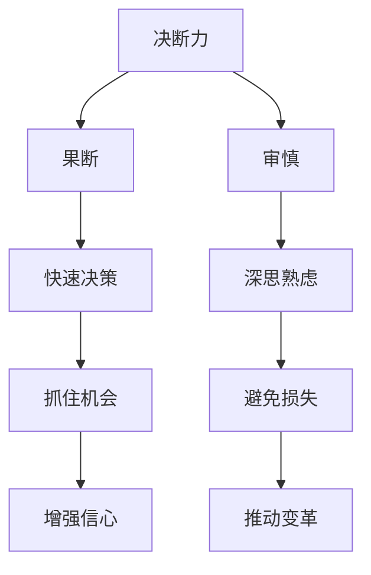
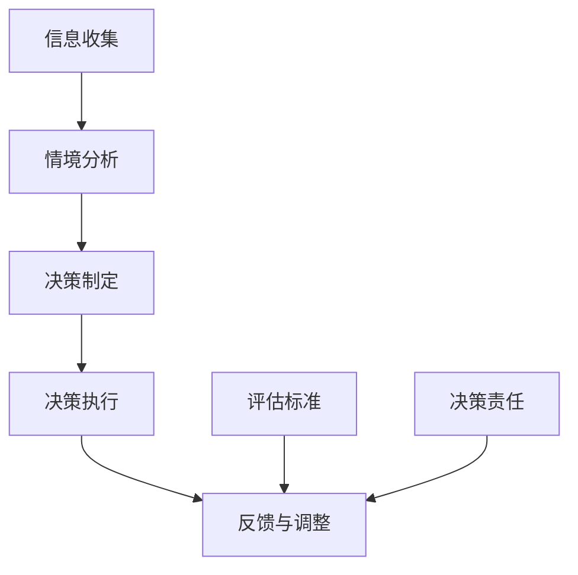

                 

# 文章标题：领导者的决断力：果断与审慎的平衡

关键词：领导者，决断力，果断，审慎，平衡，决策模型，案例分析，个人提升策略，组织与团队层面，跨文化决策，未来趋势

摘要：
在现代企业环境中，领导者的决断力对于组织的发展和成功至关重要。本文将深入探讨领导者如何平衡果断与审慎，提升自己的决断力。通过定义决断力的核心概念，分析果断与审慎的关系，引入理论框架和模型，提供决策案例分析，以及个人提升策略，本文旨在为领导者提供实用的指导，以增强他们在决策过程中的果断与审慎能力。

---

### 设计《领导者的决断力：果断与审慎的平衡》的目录大纲

为了撰写一篇逻辑清晰、结构紧凑、简单易懂的技术博客文章，我们需要设计一个符合要求的目录大纲。以下是本文的目录大纲结构：

#### 第1章：核心概念与联系
1.1 决断力：概念与特征
1.2 果断与审慎的关系
1.3 决断力的重要性

#### 第2章：理论框架与模型
2.1 决断力模型
2.2 果断与审慎的平衡模型

#### 第3章：决策案例分析
3.1 案例研究一：成功运用决断力的案例
3.2 案例研究二：果断与审慎失衡的案例

#### 第4章：个人提升策略
4.1 自我评估与改进
4.2 果断与审慎的实践技巧

#### 第5章：组织与团队层面
5.1 决策框架的建立
5.2 团队决断力的提升

#### 第6章：跨文化决策
6.1 跨文化背景下的决断力
6.2 跨文化决策策略

#### 第7章：未来趋势与展望
7.1 决断力发展的未来趋势
7.2 领导者的角色转变
7.3 结论

### 第1章：核心概念与联系

#### 1.1 决断力：概念与特征
决断力是指领导者在面对不确定性和复杂性时，能够迅速、合理地做出决策的能力。决断力不仅仅是对快速决策的追求，更包括对决策质量和后果的预期。以下是决断力的几个关键特征：

1. **敏捷性**：能够在短时间内收集信息、分析情况和制定决策。
2. **准确性**：决策应当基于可靠的信息和分析，确保决策的准确性。
3. **预见性**：领导者需要具备预见潜在问题和机会的能力。
4. **适应性**：能够根据新信息和环境变化调整决策。

#### 1.2 果断与审慎的关系
果断与审慎是领导决断力中的两个重要维度。果断强调快速行动和勇于承担责任，而审慎则强调深思熟虑和风险控制。

- **果断**：决策迅速，行动有力，不拖延。果断的领导者能够抓住机会，推动团队迅速前进。
- **审慎**：决策前仔细考虑各种可能的结果和风险，避免因冲动而造成损失。

尽管果断与审慎看似对立，但在实际决策过程中，二者需要相互平衡。过度果断可能导致决策失误，而过度审慎可能导致错失机会。

#### 1.3 决断力的重要性
决断力是领导者成功的关键因素之一。它不仅影响决策的质量，还影响领导者的信誉和影响力。以下是决断力的重要性：

- **提高决策效率**：有效的决断力能够快速识别问题，并制定解决方案。
- **增强团队信心**：领导者果断而合理的决策能够增强团队成员的信心和归属感。
- **推动组织发展**：决断力是推动组织变革和创新的重要动力。

#### 核心概念与联系流程图



### 第2章：理论框架与模型

#### 2.1 决断力模型
为了更好地理解和提升决断力，我们可以引入一个决断力模型，该模型包括以下五个要素：

1. **信息收集**：决断力始于信息收集。领导者需要及时获取与决策相关的信息。
2. **情境分析**：在收集到足够的信息后，领导者需要对情境进行分析，识别关键问题和潜在机会。
3. **决策制定**：在分析的基础上，领导者需要制定决策。决策应考虑多种可能性和风险。
4. **决策执行**：决策制定后，领导者需要确保决策能够得到有效执行。
5. **反馈与调整**：执行过程中，领导者需要不断收集反馈，并根据反馈调整决策。

#### 伪代码：决断力模型

```python
def decision_making_process():
    # 1. 信息收集
    information = collect_information()

    # 2. 情境分析
    analysis = analyze_situation(information)

    # 3. 决策制定
    decision = make_decision(analysis)

    # 4. 决策执行
    execute_decision(decision)

    # 5. 反馈与调整
    feedback = collect_feedback()
    adjust_decision(decision, feedback)

# 伪代码解释
# collect_information(): 收集与决策相关的信息
# analyze_situation(information): 分析情境，识别问题和机会
# make_decision(analysis): 制定决策，考虑多种可能性和风险
# execute_decision(decision): 确保决策得到有效执行
# collect_feedback(): 收集执行过程中的反馈
# adjust_decision(decision, feedback): 根据反馈调整决策
```

#### 2.2 果断与审慎的平衡模型
果断与审慎的平衡是一个动态过程，需要领导者根据具体情境调整二者之间的关系。以下是平衡模型的组成部分：

1. **情境感知**：领导者需要敏锐地感知情境变化，识别决策时机。
2. **果断度评估**：根据情境感知，评估决策果断度，确保果断而不盲目。
3. **审慎度评估**：同样根据情境感知，评估决策审慎度，确保深思熟虑而不拖延。
4. **调整策略**：领导者需要根据果断度和审慎度的评估结果，调整决策策略，实现平衡。

#### 伪代码：果断与审慎的平衡模型

```python
def balanced_decision-making():
    # 1. 情境感知
    context = perceive_context()

    # 2. 果断度评估
    decisiveness = assess_decisiveness(context)

    # 3. 审慎度评估
    prudence = assess_prudence(context)

    # 4. 调整策略
    if decisiveness > threshold and prudence < threshold:
        # 果断为主
        decision = make_decision_with_high_decisiveness()
    elif decisiveness < threshold and prudence > threshold:
        # 审慎为主
        decision = make_decision_with_high_prudence()
    else:
        # 平衡策略
        decision = make_balanced_decision()

# 伪代码解释
# perceive_context(): 感知情境变化
# assess_decisiveness(context): 评估决策果断度
# assess_prudence(context): 评估决策审慎度
# make_decision_with_high_decisiveness(): 果断型决策
# make_decision_with_high_prudence(): 审慎型决策
# make_balanced_decision(): 平衡型决策
```

通过上述理论框架和模型，领导者可以更系统地提升自己的决断力，实现果断与审慎的平衡。

### 第3章：决策案例分析

为了更好地理解如何在实际情境中运用果断与审慎的平衡，我们通过两个决策案例分析来进行深入探讨。

#### 3.1 案例研究一：成功运用决断力的案例

**案例背景**：
某科技公司在2020年初面临一个重要决策：是否投入大量资金开发一款创新型移动应用。市场调研显示，这款应用有巨大的市场潜力，但也存在较大风险。

**决策过程分析**：
- **果断行动**：公司领导层在分析市场调研数据后，迅速做出决策，决定投入大量资金进行开发。他们意识到，虽然风险较大，但如果不抓住这一市场机会，竞争对手可能会先他们一步。
- **审慎思考**：在做出决策前，领导层详细分析了潜在风险，并制定了风险控制措施，如市场推广策略、备用资金计划等。此外，他们还邀请了外部专家进行评估，以确保决策的准确性。

**成功因素分析**：
- **信息收集**：领导层在决策过程中收集了全面的市场信息和风险分析报告。
- **情境分析**：领导层对市场机会和潜在风险进行了全面分析，确保决策的准确性。
- **果断行动**：领导层在审慎思考的基础上，果断采取了行动，抓住了市场机会。
- **反馈调整**：在执行过程中，领导层持续收集市场反馈，并根据反馈调整了营销策略，以确保成功。

#### 3.2 案例研究二：果断与审慎失衡的案例

**案例背景**：
某电商公司在2019年面临一个决策：是否加入新推出的社交电商平台。公司领导层在讨论过程中，表现出明显的果断与审慎失衡。

**决策过程分析**：
- **果断行动**：一名高管在讨论中迅速提出加入社交电商平台的建议，并得到了其他高管的认同。决策过程非常迅速，没有充分分析市场风险。
- **审慎思考**：尽管其他高管在决策过程中表现出了审慎态度，但他们的意见未能得到充分重视。

**失败原因分析**：
- **信息收集不足**：领导层在决策过程中未能充分收集市场信息和风险评估数据。
- **情境分析缺失**：领导层在决策过程中未能进行全面情境分析，导致对潜在风险和机会的判断不准确。
- **果断过度**：领导层在决策过程中过于追求果断，忽视了审慎思考的重要性。
- **反馈缺乏**：在决策执行过程中，领导层未能持续收集市场反馈，导致后续调整不及时。

### 第4章：个人提升策略

为了提升领导者的决断力，实现果断与审慎的平衡，以下策略和建议可以帮助领导者：

#### 4.1 自我评估与改进

**自我评估步骤**：
1. **反思决策过程**：回顾过去的重要决策，分析成功与失败的原因。
2. **收集反馈**：主动寻求团队成员和同事的反馈，了解他们在决策过程中的观察和评价。
3. **制定改进计划**：根据评估结果，制定具体的改进计划，如加强信息收集、改进情境分析等。

**改进策略**：
1. **培养敏锐的情境感知**：通过持续关注市场动态、技术趋势等，提升对决策情境的感知能力。
2. **加强信息收集与分析**：建立完善的信息收集和分析体系，确保决策基于可靠的数据和逻辑。
3. **培养决策思维模式**：通过阅读相关书籍、参加培训课程等，学习并实践有效的决策思维模式。

#### 4.2 果敢行动的技巧

1. **明确目标与优先级**：在决策过程中，明确目标并设定优先级，确保行动聚焦于最重要的目标。
2. **简化决策过程**：避免过度复杂化决策过程，简化决策模型，以减少决策时间。
3. **信任直觉**：在关键时刻，信任自己的直觉和经验，但也要结合逻辑分析。

#### 4.3 审慎思考的策略

1. **风险评估**：在做出决策前，对潜在风险进行详细评估，制定风险控制措施。
2. **听取不同意见**：鼓励团队成员和同事表达不同意见，以获得更全面的视角。
3. **充分准备**：在决策前，充分准备相关信息和分析，确保决策的准确性。

#### 4.4 平衡果断与审慎的训练方法

1. **模拟决策训练**：通过模拟真实的决策情境，进行实际操作训练，提高决断力。
2. **情境角色扮演**：通过角色扮演，模拟不同情境下的决策过程，锻炼果断与审慎的平衡能力。
3. **反思与总结**：在每次决策后，及时反思和总结，学习经验教训。

### 第5章：组织与团队层面

在组织层面，领导者需要建立一套有效的决策框架，以提高团队的整体决断力。

#### 5.1 决策框架的建立

**建立决策框架的步骤**：
1. **明确决策目标**：确保决策框架能够支持组织的目标和愿景。
2. **确定决策流程**：制定明确的决策流程，包括信息收集、情境分析、决策制定、执行和反馈等环节。
3. **分配决策责任**：明确各个层级和团队成员在决策过程中的角色和责任。
4. **制定评估标准**：制定决策质量和效果的评估标准，确保决策的可衡量性。

**决策框架的设计**：



#### 5.2 提升团队决断力的策略

1. **培养团队协作能力**：通过团队建设活动和协作工具，提高团队成员之间的沟通和协作能力。
2. **鼓励创新思维**：创造一个开放和创新的环境，鼓励团队成员提出新的想法和解决方案。
3. **提供培训与发展机会**：为团队成员提供决策相关的培训和发展机会，提升他们的决断力。
4. **建立反馈机制**：建立有效的反馈机制，确保团队成员能够及时了解决策的结果和反馈，持续改进。

### 第6章：跨文化决策

在全球化背景下，领导者需要在不同文化背景下运用决断力，处理文化差异带来的挑战。

#### 6.1 跨文化背景下的决断力

**文化差异对决策的影响**：
1. **决策风格差异**：不同文化背景下，领导者的决策风格可能存在显著差异。例如，一些文化强调集体决策，而另一些文化则更倾向于个人决策。
2. **风险偏好差异**：不同文化对风险的容忍度不同，这会影响决策的果断性和审慎性。
3. **沟通方式差异**：文化差异可能导致沟通障碍，影响信息的传递和决策的制定。

**决断力的重要性**：
在跨文化决策中，决断力尤为重要。领导者需要快速适应不同文化背景，准确评估风险和机会，并做出合理的决策。

#### 6.2 跨文化决策策略

**文化适应性策略**：
1. **了解文化差异**：领导者需要了解不同文化的价值观、行为规范和沟通方式，以减少文化冲突。
2. **建立信任关系**：在跨文化团队中，建立信任关系是关键。通过倾听、尊重和理解，建立互信基础。
3. **灵活调整决策策略**：根据文化差异，灵活调整决策策略，确保决策的可行性和有效性。

**跨文化团队建设**：
1. **文化培训**：为团队成员提供文化培训，帮助他们了解和适应不同文化。
2. **团队协作平台**：建立有效的团队协作平台，促进团队成员之间的沟通和合作。
3. **文化融合**：鼓励团队成员分享各自的文化经验和观点，促进文化的融合。

**跨文化冲突管理**：
1. **识别冲突原因**：领导者需要识别冲突的根本原因，如文化差异、价值观冲突等。
2. **沟通与调解**：通过沟通和调解，解决文化冲突，确保团队的稳定和和谐。
3. **建立冲突解决机制**：建立有效的冲突解决机制，确保冲突得到及时解决。

### 第7章：未来趋势与展望

#### 7.1 决断力发展的未来趋势

**人工智能与决断力**：
随着人工智能技术的发展，领导者可以借助智能算法和数据分析工具，提高决断力。人工智能可以辅助领导者进行信息收集、情境分析和决策制定，减少人为错误和偏见。

**数据驱动决策**：
在未来，数据驱动决策将成为主流。领导者需要具备数据分析能力，利用大数据和人工智能技术，做出更准确、更快速的决策。

**领导力模型的演变**：
未来的领导力模型将更加注重适应性、创新能力和跨文化领导力。领导者需要不断提升自身能力，以适应不断变化的市场环境。

#### 7.2 领导者的角色转变

**新时代领导者的角色**：
在新时代，领导者需要扮演多重角色，如战略家、创新者和变革推动者。他们需要具备全球视野，能够引领团队实现可持续发展。

**领导力教育的未来**：
未来的领导力教育将更加注重实践性和跨学科学习。通过案例研究、模拟训练和实践项目，培养领导者的实际操作能力。

**个人发展建议**：
1. **持续学习**：领导者需要不断学习新知识、新技能，保持自身竞争力。
2. **培养团队合作能力**：通过团队合作，提升团队的决断力和创新能力。
3. **关注员工发展**：关注员工的发展需求，提供培训和发展机会，激发员工的潜力。

### 结论

本文通过定义决断力、分析果断与审慎的关系、引入理论框架和模型、提供决策案例分析以及个人提升策略，旨在帮助领导者提升决断力，实现果断与审慎的平衡。在未来的发展中，领导者需要不断适应新的市场环境和技术变革，提升自身的领导力和决断力，以推动组织的发展和成功。

---

**作者：AI天才研究院/AI Genius Institute & 禅与计算机程序设计艺术 /Zen And The Art of Computer Programming**

