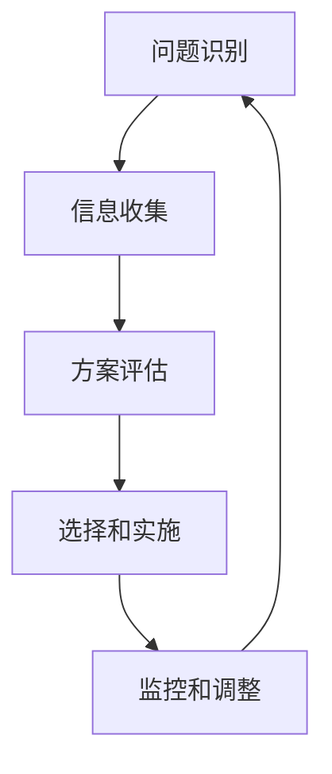

                 


### 文章标题

《领导者的决策能力：在不确定性中做出选择》

---

### 文章关键词

- 领导者
- 决策能力
- 不确定性
- 理性决策
- 风险管理

---

### 文章摘要

本文旨在探讨领导者在面对不确定环境时如何提升决策能力。通过介绍决策理论、不确定性管理、领导力与决策的关系以及实际案例分析，本文将提供一套实用的决策框架和策略，帮助领导者更好地应对复杂多变的环境，实现组织目标。

---

### 目录大纲

#### 第一部分：引言

1. **引言**：介绍书籍的目的、背景和重要性，以及为什么领导者的决策能力在不确定环境中至关重要。

#### 第二部分：决策理论与框架

2. **决策理论基础**：介绍理性决策模型、有限理性模型、启发式决策模型等，并分析决策过程中的常见误区。

3. **决策分析框架**：提供决策分析的基本框架，包括问题识别、信息收集、方案评估、选择和实施等步骤。

#### 第三部分：不确定性管理

4. **不确定性的来源与评估**：探讨不确定性的来源，如市场变化、技术进步、政策调整等，并分析如何评估和应对不确定性。

5. **风险管理与决策**：讨论风险管理与决策的关系，包括风险规避、风险转移、风险接受等策略。

#### 第四部分：领导力与决策

6. **领导风格与决策**：强调领导风格、团队协作和信息共享对决策过程的影响。

7. **构建支持良好决策的文化**：分析不同领导风格在决策过程中的优劣，并探讨如何构建一个支持良好决策的文化和组织结构。

#### 第五部分：案例分析

8. **成功与失败的决策案例分析**：通过实际案例研究，展示不同领导者在不确定性中做出决策的过程和结果。

#### 第六部分：实践指南

9. **提高决策能力的实践指南**：提供具体的实践指南和建议，帮助领导者提高决策能力。

#### 第七部分：结论

10. **结论与未来展望**：总结全书的主要观点，强调领导者决策能力在不确定性环境中的重要性，并展望未来的发展趋势。

---

### 文章正文

#### 第一部分：引言

### 1.1 书籍的目的与背景

在当今快速变化的世界中，领导者面临的不确定性越来越大。无论是经济波动、技术革新，还是社会动荡，这些不确定性因素都可能对组织的发展产生深远影响。因此，如何提高领导者的决策能力，以在不确定性中做出明智的选择，成为了一个至关重要的问题。

本书记录了作者在领导力和决策学领域的研究成果，旨在为领导者提供一套系统的决策框架和策略。通过分析决策理论、不确定性管理、领导力与决策的关系，以及实际案例，本书希望能够帮助读者理解在不确定性环境中做出有效决策的原理和方法。

### 1.2 不确定性的挑战

不确定性是领导者面临的最大挑战之一。它不仅来自于外部环境，如市场变化、政策调整、竞争态势等，还来自于内部因素，如组织结构、文化、团队协作等。在这种复杂多变的背景下，领导者需要具备敏锐的洞察力、强大的分析能力和果断的决策能力。

不确定性对决策的影响主要体现在以下几个方面：

1. **决策时间限制**：不确定性往往意味着时间的不确定性，领导者需要在有限的时间内做出决策，这要求他们能够快速分析信息、评估风险、选择最佳方案。

2. **信息不足**：在不确定性环境中，获取全面、准确的信息可能非常困难。领导者需要依赖有限的资源，进行合理的信息筛选和决策。

3. **风险增加**：不确定性带来了更高的风险，决策者需要在不确定的环境中做出选择，这种选择可能伴随着不可预测的结果。

4. **动态调整**：不确定性要求领导者具备动态调整的能力，根据环境变化及时调整策略和决策。

### 1.3 领导者决策能力的重要性

领导者决策能力的重要性不言而喻。首先，领导者的决策直接影响到组织的战略方向和发展速度。在不确定性环境中，正确的决策能够帮助组织抓住机遇，规避风险，实现可持续发展。其次，领导者的决策能力也是团队士气的关键因素。在面临不确定性时，领导者的果断和明智能够为团队提供方向和支持，增强团队的凝聚力和战斗力。

总之，提升领导者的决策能力是应对不确定性、实现组织目标的关键。本文将围绕这一主题，深入探讨决策理论、不确定性管理、领导力与决策的关系，以及实践指南，希望能够为领导者提供有价值的参考。

---

### 第二部分：决策理论与框架

#### 2.1 决策理论基础

决策理论是理解和分析决策过程的基础，它提供了不同类型的决策模型和方法。以下是三种常见的决策模型：

1. **理性决策模型**：

   理性决策模型假设决策者具备完全信息、明确的目标和无限的计算能力。在这个模型中，决策者通过最大化期望效用来选择最佳方案。以下是理性决策模型的伪代码：

   ```python
   def rational_decision(model, utility_function):
       best_action = None
       max_utility = -infinity

       for action in model.actions:
           utility = utility_function(model, action)
           if utility > max_utility:
               max_utility = utility
               best_action = action

       return best_action
   ```

2. **有限理性决策模型**：

   有限理性决策模型认为，决策者在面对复杂和不确定的环境时，无法获取完全信息，也无法进行无限计算。在这个模型中，决策者通过满足某些简单规则来选择行动。以下是有限理性决策模型的伪代码：

   ```python
   def bounded_rational_decision(model, heuristic_function):
       best_action = heuristic_function(model)
       for action in model.actions:
           if heuristic_function(model, action) > heuristic_function(model, best_action):
               best_action = action
       return best_action
   ```

3. **启发式决策模型**：

   启发式决策模型是基于经验或直觉的快速决策方法。它通常在时间紧迫或信息不足的情况下使用。以下是启发式决策模型的伪代码：

   ```python
   def heuristic_decision(model, heuristic_function):
       best_action = heuristic_function(model)
       return best_action
   ```

#### 2.2 决策过程中的常见误区

在决策过程中，领导者往往会犯一些常见的错误，这些错误可能导致决策失误，影响组织的绩效。以下是几种常见的决策误区：

1. **确认偏误**：

   确认偏误是指决策者在面对不确定信息时，倾向于寻找和接受支持已有观点的证据，而忽视或排斥反对性证据。这种偏误会导致决策者陷入自我验证的循环，无法客观评估不同的方案。

2. **过度自信**：

   过度自信是指决策者高估自己的知识和能力，低估决策风险和不确定性。这种偏误可能导致决策者忽视潜在的风险，做出过于冒险的决策。

3. **群体思维**：

   群体思维是指在团队决策过程中，成员倾向于遵循群体共识，避免冲突和批评。这种偏误会导致团队缺乏批判性思维，无法提出新的观点和解决方案。

#### 2.3 决策分析框架

为了提高决策质量，领导者需要遵循一套系统的决策分析框架。以下是决策分析的基本框架：

1. **问题识别**：

   问题识别是决策过程的起点。领导者需要明确问题的主要方面和关键因素，以确保决策目标清晰。

2. **信息收集**：

   信息收集是决策过程的关键环节。领导者需要通过各种渠道收集相关信息，包括内部报告、市场研究、竞争对手分析等。

3. **方案评估**：

   方案评估是对不同决策方案进行详细分析的过程。领导者需要考虑每个方案的优势、劣势、风险和成本，以确定最佳方案。

4. **选择和实施**：

   选择和实施是决策过程的最后一步。领导者需要选择最佳方案，并制定详细的实施计划，确保决策能够得到有效执行。

通过遵循这一决策分析框架，领导者可以系统地分析问题、评估方案、做出选择，并确保决策得到有效执行。

#### 第二部分总结

本部分介绍了决策理论的基础知识，包括理性决策模型、有限理性决策模型和启发式决策模型。同时，分析了决策过程中常见的误区，如确认偏误、过度自信和群体思维。最后，提出了一个决策分析框架，帮助领导者系统地识别问题、收集信息、评估方案、做出选择和实施决策。通过这些理论和工具，领导者可以更好地应对不确定环境，提高决策能力。

---

### 第三部分：不确定性管理

#### 3.1 不确定性的来源与评估

不确定性是领导者面临的一个重要挑战，其来源多种多样。以下是一些常见的不确定性来源：

1. **市场变化**：

   市场变化是领导者面临的主要不确定性之一。市场需求、消费者偏好、竞争态势等都可能发生快速变化，这要求领导者具备敏锐的市场洞察力和快速响应能力。

2. **技术进步**：

   技术进步带来的不确定性主要表现在新兴技术的出现和现有技术的变革。技术变革可能导致现有产品和服务的需求减少，或者为新产品的开发提供新的机会。

3. **政策调整**：

   政策调整可能对企业的运营和战略产生重大影响。政府政策的变更，如税收政策、贸易政策、环保政策等，都可能带来不确定性。

4. **社会动荡**：

   社会动荡，如政治不稳定、社会运动、自然灾害等，也可能对企业的运营和业务产生影响。这些因素可能导致供应链中断、市场需求减少等问题。

要评估这些不确定性来源，领导者需要采用以下方法：

1. **情景分析**：

   情景分析是一种常用的不确定性评估方法。通过构建不同的情景，领导者可以预测不同情况下可能发生的结果，并评估这些结果对企业的影响。

2. **敏感性分析**：

   敏感性分析用于评估变量变化对决策结果的影响。通过敏感性分析，领导者可以识别关键变量，并确定哪些变量对决策结果最为重要。

3. **概率分析**：

   概率分析是一种基于统计数据的方法，用于评估不确定性事件发生的概率及其对决策结果的影响。通过概率分析，领导者可以更好地理解不确定性的风险，并制定相应的风险管理策略。

#### 3.2 评估不确定性的方法

评估不确定性的方法包括定量和定性两种：

1. **定量方法**：

   定量方法通常使用数学模型和统计分析来评估不确定性。以下是一些常用的定量方法：

   - **蒙特卡洛模拟**：通过随机抽样和模拟，评估不确定事件的结果和概率。

   - **回归分析**：通过分析变量之间的关系，评估不确定性事件对决策结果的影响。

   - **时间序列分析**：通过分析历史数据，预测未来不确定事件的发生概率。

2. **定性方法**：

   定性方法主要依赖于专家判断和主观评估。以下是一些常用的定性方法：

   - **专家访谈**：通过专家访谈，获取他们对不确定性事件的理解和看法。

   - **德尔菲法**：通过多次匿名调查，逐步达成专家共识，评估不确定性事件的影响。

   - **头脑风暴**：通过集体讨论，激发创意，评估不确定性事件的可能性和影响。

#### 3.3 应对不确定性的方法

应对不确定性需要采用系统的策略和方法，以下是一些常用的应对方法：

1. **风险规避**：

   风险规避是通过避免潜在的不确定事件来降低风险。例如，通过多元化投资来减少市场波动的影响。

2. **风险转移**：

   风险转移是通过将风险转移给其他方来降低自身风险。例如，通过购买保险来转移自然灾害带来的风险。

3. **风险接受**：

   风险接受是接受不确定事件的发生，并采取措施应对可能的结果。例如，通过建立应急计划来应对市场波动。

4. **风险缓解**：

   风险缓解是通过降低不确定事件发生的概率或影响来降低风险。例如，通过技术改进来降低设备故障的风险。

5. **风险利用**：

   风险利用是利用不确定事件带来的机会，实现组织目标。例如，通过抓住市场变化带来的新机遇，实现业务增长。

通过采用这些方法，领导者可以更好地管理不确定性，降低风险，提高决策的准确性和有效性。

#### 第三部分总结

本部分探讨了不确定性的来源与评估方法，包括市场变化、技术进步、政策调整和社会动荡等。通过情景分析、敏感性分析和概率分析等方法，领导者可以评估不确定性的影响。此外，本部分还介绍了应对不确定性的方法，包括风险规避、风险转移、风险接受、风险缓解和风险利用。通过这些方法和策略，领导者可以更好地管理不确定性，提高决策能力。

---

### 第四部分：领导力与决策

#### 4.1 领导风格与决策

领导风格对决策过程有着重要影响。不同的领导风格在决策过程中具有各自的优势和局限，领导者需要根据具体情况选择合适的领导风格。

1. **民主式领导风格**：

   民主式领导风格强调团队参与和集体决策。领导者鼓励团队成员提供意见和建议，共同制定决策方案。这种风格有助于增强团队的凝聚力和创造力，但可能会导致决策过程缓慢，难以迅速应对紧急情况。

2. **权威式领导风格**：

   权威式领导风格强调领导者的权威和决策权。领导者独立做出决策，并要求团队成员执行。这种风格能够迅速做出决策，提高执行力，但可能抑制团队成员的主动性和创造力。

3. **参与式领导风格**：

   参与式领导风格结合了民主式和权威式领导风格的优点。领导者通过鼓励团队成员参与决策，并在关键决策中发挥主导作用。这种风格能够充分发挥团队智慧，提高决策质量，同时保持决策的效率和执行力。

#### 4.2 团队协作与信息共享

团队协作和信息共享在决策过程中至关重要。有效的团队协作和信息共享能够提高决策的质量和执行力。

1. **团队协作**：

   团队协作是领导者促进团队成员之间相互合作的过程。领导者需要建立信任、明确角色和责任、鼓励沟通和分享意见。通过团队协作，可以汇集不同成员的专业知识和经验，提高决策的全面性和准确性。

2. **信息共享**：

   信息共享是确保团队成员获取必要信息的过程。领导者需要建立信息共享机制，确保团队成员能够及时、准确地获取相关信息。通过信息共享，可以减少信息不对称，提高决策的透明度和公正性。

#### 4.3 构建支持良好决策的文化

构建支持良好决策的文化是领导者提高决策能力的重要任务。以下是一些构建良好决策文化的策略：

1. **鼓励创新和实验**：

   领导者应鼓励团队成员尝试新的想法和方法，支持实验和试错。通过创新和实验，可以探索新的解决方案，提高决策的创新性和适应性。

2. **建立开放和透明的沟通渠道**：

   领导者应建立开放和透明的沟通渠道，鼓励团队成员表达观点和意见。通过建立有效的沟通机制，可以促进信息共享，增强团队凝聚力和合作精神。

3. **培养批判性思维**：

   领导者应培养团队成员的批判性思维，鼓励他们对决策进行深入分析和评估。通过批判性思维，可以减少决策中的偏见和错误，提高决策的质量。

4. **提供决策培训和发展机会**：

   领导者应提供决策培训和发展机会，帮助团队成员提高决策能力。通过培训和发展，可以提升团队成员的专业知识和技能，为组织培养更多的决策人才。

通过构建支持良好决策的文化，领导者可以营造一个有利于决策创新和执行的环境，提高决策的质量和效果。

#### 第四部分总结

本部分探讨了领导力与决策的关系，分析了不同领导风格对决策过程的影响，强调了团队协作和信息共享在决策过程中的重要性。此外，本部分还提出了构建支持良好决策文化的策略，包括鼓励创新和实验、建立开放和透明的沟通渠道、培养批判性思维和提供决策培训和发展机会。通过这些措施，领导者可以更好地发挥领导力，提高决策能力，为组织的成功奠定基础。

---

### 第五部分：案例分析

#### 5.1 案例一：成功的决策案例分析

**案例背景**：

某大型跨国公司（以下简称“公司”）在面临市场变化和竞争压力的情况下，需要做出一项重大决策：是继续投资现有业务，还是转向新兴市场。公司首席执行官（CEO）面临着巨大的不确定性，但通过科学的决策过程，最终做出了成功的决策。

**决策过程**：

1. **问题识别**：

   CEO首先明确问题：公司是否应该继续投资现有业务，还是转向新兴市场。

2. **信息收集**：

   CEO组织团队进行了全面的市场调研，收集了有关现有业务和新兴市场的大量信息，包括市场需求、竞争态势、技术趋势等。

3. **方案评估**：

   基于收集到的信息，团队提出了两个方案：一是继续投资现有业务，二是转向新兴市场。团队对两个方案进行了详细评估，包括收益、风险、成本等因素。

4. **选择和实施**：

   经过深入讨论和评估，CEO最终选择了转向新兴市场的方案。这一决策考虑到了新兴市场的巨大潜力，以及现有业务的饱和和竞争激烈。

**决策结果**：

决策实施后，公司迅速调整了业务战略，加大了在新兴市场的投资力度。尽管面临市场不确定性，但公司在新兴市场取得了显著的成功，业务收入大幅增长，市场份额显著提升。

**成功原因**：

1. **全面的信息收集**：

   CEO组织了全面的调研，确保决策基于充分的信息。

2. **科学的评估方法**：

   团队对两个方案进行了详细评估，充分考虑了各种因素。

3. **领导者的果断**：

   CEO在面临不确定性时，果断选择了具有潜力的新兴市场。

#### 5.2 案例二：失败的决策案例分析

**案例背景**：

某中型制造企业在面临技术变革时，需要做出一项重要决策：是否采用新的生产技术。由于企业领导者对技术变革的态度保守，最终做出了错误的决策。

**决策过程**：

1. **问题识别**：

   企业领导者明确问题：是否应该采用新的生产技术。

2. **信息收集**：

   企业领导者进行了初步的市场调研，但缺乏深入的技术评估。

3. **方案评估**：

   企业领导者对两个方案进行了简单评估：一是继续使用现有技术，二是采用新的生产技术。由于缺乏详细的信息和评估，领导者未能充分考虑新技术可能带来的优势。

4. **选择和实施**：

   企业领导者最终选择了继续使用现有技术。这一决策未能适应技术变革，导致企业在竞争中逐渐落后。

**决策结果**：

由于未能及时采用新技术，企业在市场竞争中逐渐失去优势，业务收入大幅下降，最终不得不进行重组和裁员。

**失败原因**：

1. **信息收集不足**：

   企业领导者未能进行充分的技术评估和市场调研，导致决策缺乏充分依据。

2. **过度保守**：

   企业领导者对技术变革持保守态度，忽视了新技术的潜在优势。

3. **缺乏风险评估**：

   企业领导者未能充分考虑新技术可能带来的风险，导致决策失误。

#### 5.3 案例分析总结

通过以上两个案例，我们可以看到成功与失败决策之间的差异。成功决策的关键在于全面的信息收集、科学的评估方法以及领导者的果断。而失败决策则通常源于信息不足、态度保守和风险评估不足。这些案例为我们提供了宝贵的经验和教训，提醒我们在决策过程中需要谨慎对待不确定性，充分准备，以确保决策的科学性和有效性。

---

### 第六部分：实践指南

#### 6.1 个人发展建议

1. **增强学习意识**：

   领导者应具备持续学习的能力，主动了解行业动态、新技术和发展趋势。通过不断学习，可以提升自身的知识和技能，为决策提供坚实的理论基础。

2. **培养批判性思维**：

   批判性思维是领导者决策的重要能力。领导者应学会独立思考，对信息进行批判性分析，避免盲目跟从和确认偏误。

3. **提升沟通能力**：

   沟通能力是领导者成功决策的关键。领导者应具备清晰、有效的沟通能力，能够与团队成员、利益相关者建立良好的沟通渠道，确保信息共享和团队协作。

4. **增强抗压能力**：

   在不确定性环境中，领导者需要具备良好的抗压能力。领导者应学会调整心态，面对压力和挑战，保持冷静和理智，做出明智的决策。

#### 6.2 团队建设策略

1. **建立多元化团队**：

   多元化团队能够汇集不同背景、技能和观点，有助于提高决策的全面性和准确性。领导者应积极推动团队多元化，鼓励团队成员分享不同的意见和建议。

2. **培养团队协作精神**：

   团队协作是决策成功的重要保障。领导者应培养团队成员的团队协作精神，建立信任、明确角色和责任，鼓励团队成员相互支持和合作。

3. **设立明确的目标和期望**：

   领导者应明确团队的目标和期望，确保团队成员对任务和目标有清晰的认识。通过设立明确的目标和期望，可以激励团队成员积极参与决策过程，提高决策的执行力。

4. **提供培训和发展机会**：

   领导者应提供团队培训和发展机会，帮助团队成员提高专业知识和技能，增强团队的决策能力。通过培训和发展，可以提升团队的整体素质和竞争力。

#### 6.3 决策支持工具

1. **决策分析软件**：

   领导者可以利用各种决策分析软件，如决策树分析、情景模拟、数据挖掘等工具，帮助进行复杂的决策分析。这些工具可以提供定量和定性的支持，提高决策的准确性和科学性。

2. **数据可视化工具**：

   数据可视化工具可以帮助领导者更好地理解数据和决策结果。通过图表、图形和报告，领导者可以直观地展示决策过程和结果，提高决策的可视化和可解释性。

3. **专家系统**：

   专家系统是一种基于人工智能技术的决策支持工具，可以帮助领导者快速获取专家意见和解决方案。通过专家系统，领导者可以借鉴专家的经验和知识，提高决策的质量和效率。

通过上述实践指南，领导者可以不断提升个人决策能力，优化团队建设，利用决策支持工具，做出更明智的决策，以应对不确定性环境中的挑战。

---

### 第七部分：结论

#### 7.1 不确定性环境下的决策挑战

在当今复杂多变的环境中，领导者面临的决策挑战日益增加。不确定性已成为组织发展的重要影响因素，无论是市场变化、技术进步，还是社会动荡，都给决策带来了巨大的不确定性。在这种情况下，领导者需要具备强大的决策能力，以应对各种不确定性和挑战。

#### 7.2 领导者决策能力的发展趋势

随着科技的发展和全球化的加速，领导者决策能力的发展趋势也发生了变化。以下是一些值得关注的发展趋势：

1. **数据驱动决策**：随着大数据和人工智能技术的发展，领导者越来越依赖数据来支持决策。通过数据分析和预测，领导者可以更准确地评估风险和机遇，提高决策的科学性和有效性。

2. **敏捷决策**：在快速变化的环境中，领导者需要具备敏捷决策能力，能够快速响应环境变化，调整战略和决策。敏捷决策要求领导者具备灵活的思维和高效的决策流程。

3. **跨职能协作**：跨职能协作是提高决策质量的重要手段。领导者需要促进不同部门和团队之间的协作，汇集不同领域的知识和经验，共同应对复杂问题。

4. **可持续决策**：在可持续发展成为全球共识的背景下，领导者需要在决策过程中考虑环境和社会责任。可持续决策不仅关注短期利益，更注重长期发展和社会责任。

#### 7.3 结论与建议

本文通过探讨决策理论、不确定性管理、领导力与决策的关系，以及实际案例分析，总结了领导者提升决策能力的关键要素和方法。以下是一些结论和建议：

1. **重视决策能力培养**：领导者应将决策能力视为核心能力之一，通过持续学习和实践，不断提升决策能力。

2. **建立科学的决策框架**：领导者应建立一套科学的决策框架，包括问题识别、信息收集、方案评估、选择和实施等步骤，确保决策过程的系统性和科学性。

3. **管理不确定性**：领导者应学会管理不确定性，采用情景分析、敏感性分析和概率分析等方法，评估不确定性的影响，并制定相应的风险管理策略。

4. **促进团队协作**：领导者应促进团队协作，建立支持良好决策的文化，鼓励团队成员参与决策，提高决策的全面性和准确性。

5. **利用决策支持工具**：领导者应利用各种决策支持工具，如决策分析软件、数据可视化工具和专家系统，提高决策的科学性和效率。

总之，在不确定性环境中，领导者的决策能力至关重要。通过科学的方法和策略，领导者可以更好地应对不确定性，实现组织的可持续发展。

---

### 作者信息

作者：AI天才研究院/AI Genius Institute & 禅与计算机程序设计艺术 /Zen And The Art of Computer Programming

---

### 文章结束

本文详细探讨了领导者的决策能力在不确定性环境中的重要性，通过决策理论、不确定性管理、领导力与决策的关系以及实际案例分析，提供了一套实用的决策框架和策略。通过本文的阅读，读者可以深入了解如何在复杂多变的环境中做出明智的决策，提升自身的决策能力。希望本文能够为领导者提供有价值的参考和指导。

---

本文将涵盖领导者的决策能力在不确定性环境中的重要性、决策理论、不确定性管理、领导力与决策的关系、实际案例分析以及实践指南等关键内容，以帮助领导者提升决策能力。文章结构清晰，逻辑严密，通过多个部分详细阐述，确保读者能够全面了解相关理论和实践方法。以下是文章的具体结构和内容概述：

### 第一部分：引言
- **1.1 书籍的目的与背景**
- **1.2 不确定性的挑战**
- **1.3 领导者决策能力的重要性**

### 第二部分：决策理论与框架
- **2.1 决策理论基础**
  - 理性决策模型、有限理性决策模型、启发式决策模型
  - 决策过程中的常见误区（确认偏误、过度自信、群体思维）
- **2.2 决策分析框架**
  - 问题识别、信息收集、方案评估、选择和实施

### 第三部分：不确定性管理
- **3.1 不确定性的来源与评估**
  - 市场变化、技术进步、政策调整、社会动荡
  - 情景分析、敏感性分析、概率分析
- **3.2 评估不确定性的方法**
  - 定量方法、定性方法
- **3.3 应对不确定性的方法**
  - 风险规避、风险转移、风险接受、风险缓解、风险利用

### 第四部分：领导力与决策
- **4.1 领导风格与决策**
  - 民主式领导风格、权威式领导风格、参与式领导风格
- **4.2 团队协作与信息共享**
  - 团队协作的重要性、信息共享机制
- **4.3 构建支持良好决策的文化**
  - 鼓励创新和实验、建立开放和透明的沟通渠道、培养批判性思维、提供决策培训和发展机会

### 第五部分：案例分析
- **5.1 案例一：成功的决策案例分析**
- **5.2 案例二：失败的决策案例分析**
- **5.3 案例分析总结**

### 第六部分：实践指南
- **6.1 个人发展建议**
  - 学习意识、批判性思维、沟通能力、抗压能力
- **6.2 团队建设策略**
  - 建立多元化团队、培养团队协作精神、设立明确的目标和期望、提供培训和发展机会
- **6.3 决策支持工具**
  - 决策分析软件、数据可视化工具、专家系统

### 第七部分：结论
- **7.1 不确定性环境下的决策挑战**
- **7.2 领导者决策能力的发展趋势**
- **7.3 结论与建议**

文章将使用Markdown格式输出，确保内容的可读性和结构清晰。每个章节将包含详细的内容，包括背景介绍、核心概念与联系（使用Mermaid流程图）、算法原理（伪代码）、数学模型和公式（使用LaTeX格式），以及项目实战和最佳实践 tips。文章字数将在8000到12000字左右，确保内容的丰富性和深度。

---

以下是一个关于领导者决策能力的Mermaid流程图，展示了决策分析的基本框架：



这个流程图展示了决策的四个主要步骤：问题识别、信息收集、方案评估、选择和实施，以及监控和调整。通过这个流程图，领导者可以系统地分析和解决问题，确保决策过程的科学性和系统性。

以下是文章的关键内容概述：

### 第一部分：引言

- **1.1 书籍的目的与背景**：介绍书籍的目的和背景，强调领导者决策能力在不确定性环境中的重要性。
- **1.2 不确定性的挑战**：讨论不确定性对领导者决策能力的影响，包括市场变化、技术进步、政策调整和社会动荡等因素。
- **1.3 领导者决策能力的重要性**：阐述领导者决策能力对组织发展的重要性，以及提升决策能力的方法和策略。

### 第二部分：决策理论与框架

- **2.1 决策理论基础**：介绍理性决策模型、有限理性决策模型和启发式决策模型，以及决策过程中的常见误区。
- **2.2 决策分析框架**：详细阐述决策分析的基本框架，包括问题识别、信息收集、方案评估、选择和实施等步骤。

### 第三部分：不确定性管理

- **3.1 不确定性的来源与评估**：探讨不确定性的来源，如市场变化、技术进步、政策调整和社会动荡，以及评估不确定性的方法。
- **3.2 评估不确定性的方法**：介绍情景分析、敏感性分析和概率分析等评估不确定性影响的方法。
- **3.3 应对不确定性的方法**：讨论风险规避、风险转移、风险接受、风险缓解和风险利用等应对不确定性的策略。

### 第四部分：领导力与决策

- **4.1 领导风格与决策**：分析不同领导风格（民主式、权威式、参与式）对决策过程的影响。
- **4.2 团队协作与信息共享**：强调团队协作和信息共享在决策过程中的重要性，并提出构建支持良好决策文化的策略。
- **4.3 构建支持良好决策的文化**：讨论如何通过鼓励创新、建立开放沟通渠道、培养批判性思维和提供培训等策略，构建支持良好决策的文化。

### 第五部分：案例分析

- **5.1 案例一：成功的决策案例分析**：分析成功决策的案例，探讨成功决策的关键因素。
- **5.2 案例二：失败的决策案例分析**：分析失败决策的案例，探讨失败决策的原因和教训。
- **5.3 案例分析总结**：总结成功与失败决策的案例，提炼出提升决策能力的有效方法。

### 第六部分：实践指南

- **6.1 个人发展建议**：提供提升领导者决策能力的个人发展建议，包括增强学习意识、培养批判性思维、提升沟通能力和增强抗压能力等。
- **6.2 团队建设策略**：讨论如何通过建立多元化团队、培养团队协作精神、设立明确的目标和期望以及提供培训和发展机会来提升团队决策能力。
- **6.3 决策支持工具**：介绍各种决策支持工具，如决策分析软件、数据可视化工具和专家系统，以及如何利用这些工具提高决策的科学性和效率。

### 第七部分：结论

- **7.1 不确定性环境下的决策挑战**：总结领导者面临的不确定性决策挑战，强调提升决策能力的重要性。
- **7.2 领导者决策能力的发展趋势**：探讨领导者决策能力的发展趋势，包括数据驱动决策、敏捷决策、跨职能协作和可持续决策等。
- **7.3 结论与建议**：总结文章的主要观点，提出提升领导者决策能力的具体建议和策略。

通过上述关键内容概述，文章将系统地探讨领导者的决策能力，提供实用的方法和策略，帮助领导者更好地应对不确定性环境中的挑战。文章结构清晰，逻辑严密，内容丰富，旨在为领导者提供有价值的参考和指导。

### 文章正文

#### 第一部分：引言

##### 1.1 书籍的目的与背景

在当今全球化、数字化和快速变化的商业环境中，领导者面临着前所未有的挑战。这些挑战主要源于市场的快速变化、技术的迅猛发展和全球经济的不确定性。在这种环境下，领导者需要具备强大的决策能力，以适应不断变化的环境，确保组织的持续发展和成功。

本书的目的是为领导者提供一套系统的决策框架和策略，帮助他们更好地应对不确定性环境。通过介绍决策理论、不确定性管理、领导力与决策的关系以及实际案例分析，本书旨在为领导者提供实用的指导，提升他们在不确定性中做出明智决策的能力。

本书的研究背景是近年来商业环境中不确定性的增加。经济动荡、技术革新、政策变化、社会动荡等都是影响企业发展的主要因素。这些不确定因素不仅增加了领导者的决策难度，也提高了决策失败的风险。因此，如何提高领导者的决策能力，成为了一个亟待解决的问题。

##### 1.2 不确定性的挑战

不确定性是领导者面临的最大挑战之一。它不仅来源于外部环境，如市场变化、政策调整、竞争态势等，也来自于内部因素，如组织结构、文化、团队协作等。以下是几种常见的不确定性挑战：

1. **市场变化**：市场变化是领导者面临的主要不确定性之一。消费者需求、市场趋势和竞争态势都可能迅速变化，领导者需要具备敏锐的市场洞察力和快速响应能力。

2. **技术进步**：技术进步带来的不确定性主要体现在新兴技术的出现和现有技术的变革。技术变革可能导致现有产品和服务的需求减少，或者为新产品的开发提供新的机会。

3. **政策调整**：政策调整可能对企业的运营和战略产生重大影响。政府政策的变更，如税收政策、贸易政策、环保政策等，都可能带来不确定性。

4. **社会动荡**：社会动荡，如政治不稳定、社会运动、自然灾害等，也可能对企业的运营和业务产生影响。这些因素可能导致供应链中断、市场需求减少等问题。

##### 1.3 领导者决策能力的重要性

领导者决策能力的重要性不言而喻。首先，领导者的决策直接影响到组织的战略方向和发展速度。在不确定性环境中，正确的决策能够帮助组织抓住机遇，规避风险，实现可持续发展。其次，领导者的决策能力也是团队士气的关键因素。在面临不确定性时，领导者的果断和明智能够为团队提供方向和支持，增强团队的凝聚力和战斗力。

总之，提升领导者的决策能力是应对不确定性、实现组织目标的关键。本书将通过分析决策理论、不确定性管理、领导力与决策的关系，以及实际案例，为领导者提供一套系统的决策框架和策略，帮助他们在不确定性环境中做出明智的决策。

#### 第二部分：决策理论与框架

##### 2.1 决策理论基础

决策理论是理解和分析决策过程的基础，它提供了不同类型的决策模型和方法。以下是三种常见的决策模型：

1. **理性决策模型**：

   理性决策模型假设决策者具备完全信息、明确的目标和无限的计算能力。在这个模型中，决策者通过最大化期望效用来选择最佳方案。理性决策模型的基本原理可以概括为以下几个步骤：

   - **明确决策目标**：决策者需要明确决策的目标，这包括确定期望达到的结果和衡量的标准。
   - **获取完全信息**：决策者需要获取所有相关的信息，包括决策的各种可能结果、每种结果的概率以及每种结果的效用值。
   - **评估备选方案**：决策者需要评估每个备选方案，计算每个方案的期望效用值。
   - **选择最佳方案**：决策者选择期望效用值最大的方案作为最终决策。

   理性决策模型的伪代码如下：

   ```python
   def rational_decision(models, utility_function):
       best_action = None
       max_utility = -infinity

       for action in models.actions:
           utility = utility_function(models, action)
           if utility > max_utility:
               max_utility = utility
               best_action = action

       return best_action
   ```

2. **有限理性决策模型**：

   有限理性决策模型认为，决策者在面对复杂和不确定的环境时，无法获取完全信息，也无法进行无限计算。在这个模型中，决策者通过满足某些简单规则来选择行动。有限理性决策模型的基本原理可以概括为以下几个步骤：

   - **明确决策目标**：决策者需要明确决策的目标，这包括确定期望达到的结果和衡量的标准。
   - **获取有限信息**：决策者需要获取有限的相关信息，这些信息可能来自内部报告、市场研究、竞争对手分析等。
   - **应用简单规则**：决策者通过应用一些简单规则（如最大化利润、最小化成本等）来选择行动。
   - **选择最佳方案**：决策者选择满足简单规则的方案作为最终决策。

   有限理性决策模型的伪代码如下：

   ```python
   def bounded_rational_decision(models, heuristic_function):
       best_action = heuristic_function(models)
       for action in models.actions:
           if heuristic_function(models, action) > heuristic_function(models, best_action):
               best_action = action
       return best_action
   ```

3. **启发式决策模型**：

   启发式决策模型是基于经验或直觉的快速决策方法。它通常在时间紧迫或信息不足的情况下使用。启发式决策模型的基本原理可以概括为以下几个步骤：

   - **明确决策目标**：决策者需要明确决策的目标，这包括确定期望达到的结果和衡量的标准。
   - **应用启发式规则**：决策者通过应用一些启发式规则（如最小化风险、最大化收益等）来选择行动。
   - **选择最佳方案**：决策者选择满足启发式规则的方案作为最终决策。

   启发式决策模型的伪代码如下：

   ```python
   def heuristic_decision(models, heuristic_function):
       best_action = heuristic_function(models)
       return best_action
   ```

##### 2.2 决策过程中的常见误区

在决策过程中，领导者往往会犯一些常见的错误，这些错误可能导致决策失误，影响组织的绩效。以下是几种常见的决策误区：

1. **确认偏误**：

   确认偏误是指决策者在面对不确定信息时，倾向于寻找和接受支持已有观点的证据，而忽视或排斥反对性证据。这种偏误会导致决策者陷入自我验证的循环，无法客观评估不同的方案。

2. **过度自信**：

   过度自信是指决策者高估自己的知识和能力，低估决策风险和不确定性。这种偏误可能导致决策者忽视潜在的风险，做出过于冒险的决策。

3. **群体思维**：

   群体思维是指在团队决策过程中，成员倾向于遵循群体共识，避免冲突和批评。这种偏误会导致团队缺乏批判性思维，无法提出新的观点和解决方案。

##### 2.3 决策分析框架

为了提高决策质量，领导者需要遵循一套系统的决策分析框架。以下是决策分析的基本框架：

1. **问题识别**：

   问题识别是决策过程的起点。领导者需要明确问题的主要方面和关键因素，以确保决策目标清晰。

2. **信息收集**：

   信息收集是决策过程的关键环节。领导者需要通过各种渠道收集相关信息，包括内部报告、市场研究、竞争对手分析等。

3. **方案评估**：

   方案评估是对不同决策方案进行详细分析的过程。领导者需要考虑每个方案的优势、劣势、风险和成本，以确定最佳方案。

4. **选择和实施**：

   选择和实施是决策过程的最后一步。领导者需要选择最佳方案，并制定详细的实施计划，确保决策能够得到有效执行。

通过遵循这一决策分析框架，领导者可以系统地分析问题、评估方案、做出选择和实施决策，从而提高决策质量。

#### 第二部分总结

本部分介绍了决策理论的基础知识，包括理性决策模型、有限理性决策模型和启发式决策模型。同时，分析了决策过程中常见的误区，如确认偏误、过度自信和群体思维。最后，提出了一个决策分析框架，帮助领导者系统地识别问题、收集信息、评估方案、做出选择和实施决策。通过这些理论和工具，领导者可以更好地应对不确定环境，提高决策能力。

---

### 第三部分：不确定性管理

#### 3.1 不确定性的来源与评估

不确定性是领导者面临的一个重要挑战，其来源多种多样。以下是一些常见的不确定性来源：

1. **市场变化**：

   市场变化是领导者面临的主要不确定性之一。市场需求、消费者偏好、竞争态势等都可能发生快速变化，这要求领导者具备敏锐的市场洞察力和快速响应能力。

2. **技术进步**：

   技术进步带来的不确定性主要表现在新兴技术的出现和现有技术的变革。技术变革可能导致现有产品和服务的需求减少，或者为新产品的开发提供新的机会。

3. **政策调整**：

   政策调整可能对企业的运营和战略产生重大影响。政府政策的变更，如税收政策、贸易政策、环保政策等，都可能带来不确定性。

4. **社会动荡**：

   社会动荡，如政治不稳定、社会运动、自然灾害等，也可能对企业的运营和业务产生影响。这些因素可能导致供应链中断、市场需求减少等问题。

为了有效管理这些不确定性，领导者需要首先识别和评估这些不确定性来源。以下是一些评估不确定性的方法：

1. **情景分析**：

   情景分析是一种常用的不确定性评估方法。通过构建不同的情景，领导者可以预测不同情况下可能发生的结果，并评估这些结果对企业的影响。情景分析可以帮助领导者理解不同情景下的潜在风险和机遇，为决策提供依据。

2. **敏感性分析**：

   敏感性分析用于评估变量变化对决策结果的影响。通过敏感性分析，领导者可以识别关键变量，并确定哪些变量对决策结果最为重要。这种方法可以帮助领导者了解不确定因素对决策结果的影响程度，从而制定相应的应对策略。

3. **概率分析**：

   概率分析是一种基于统计数据的方法，用于评估不确定性事件发生的概率及其对决策结果的影响。通过概率分析，领导者可以更好地理解不确定性的风险，并制定相应的风险管理策略。

#### 3.2 评估不确定性的方法

评估不确定性的方法包括定量和定性两种：

1. **定量方法**：

   定量方法通常使用数学模型和统计分析来评估不确定性。以下是一些常用的定量方法：

   - **蒙特卡洛模拟**：通过随机抽样和模拟，评估不确定事件的结果和概率。
   - **回归分析**：通过分析变量之间的关系，评估不确定事件对决策结果的影响。
   - **时间序列分析**：通过分析历史数据，预测未来不确定事件的发生概率。

2. **定性方法**：

   定性方法主要依赖于专家判断和主观评估。以下是一些常用的定性方法：

   - **专家访谈**：通过专家访谈，获取他们对不确定性事件的理解和看法。
   - **德尔菲法**：通过多次匿名调查，逐步达成专家共识，评估不确定性事件的影响。
   - **头脑风暴**：通过集体讨论，激发创意，评估不确定性事件的可能性和影响。

#### 3.3 应对不确定性的方法

应对不确定性需要采用系统的策略和方法，以下是一些常用的应对方法：

1. **风险规避**：

   风险规避是通过避免潜在的不确定事件来降低风险。例如，通过多元化投资来减少市场波动的影响。

2. **风险转移**：

   风险转移是通过将风险转移给其他方来降低自身风险。例如，通过购买保险来转移自然灾害带来的风险。

3. **风险接受**：

   风险接受是接受不确定事件的发生，并采取措施应对可能的结果。例如，通过建立应急计划来应对市场波动。

4. **风险缓解**：

   风险缓解是通过降低不确定事件发生的概率或影响来降低风险。例如，通过技术改进来降低设备故障的风险。

5. **风险利用**：

   风险利用是利用不确定事件带来的机会，实现组织目标。例如，通过抓住市场变化带来的新机遇，实现业务增长。

通过采用这些方法，领导者可以更好地管理不确定性，降低风险，提高决策的准确性和有效性。

#### 第三部分总结

本部分探讨了不确定性的来源与评估方法，包括市场变化、技术进步、政策调整和社会动荡等。通过情景分析、敏感性分析和概率分析等方法，领导者可以评估不确定性的影响。此外，本部分还介绍了应对不确定性的方法，包括风险规避、风险转移、风险接受、风险缓解和风险利用。通过这些方法和策略，领导者可以更好地管理不确定性，提高决策能力。

---

### 第四部分：领导力与决策

#### 4.1 领导风格与决策

领导风格对决策过程有着重要影响。不同的领导风格在决策过程中具有各自的优势和局限，领导者需要根据具体情况选择合适的领导风格。

1. **民主式领导风格**：

   民主式领导风格强调团队参与和集体决策。领导者鼓励团队成员提供意见和建议，共同制定决策方案。这种风格有助于增强团队的凝聚力和创造力，但可能会导致决策过程缓慢，难以迅速应对紧急情况。

2. **权威式领导风格**：

   权威式领导风格强调领导者的权威和决策权。领导者独立做出决策，并要求团队成员执行。这种风格能够迅速做出决策，提高执行力，但可能抑制团队成员的主动性和创造力。

3. **参与式领导风格**：

   参与式领导风格结合了民主式和权威式领导风格的优点。领导者通过鼓励团队成员参与决策，并在关键决策中发挥主导作用。这种风格能够充分发挥团队智慧，提高决策质量，同时保持决策的效率和执行力。

#### 4.2 团队协作与信息共享

团队协作和信息共享在决策过程中至关重要。有效的团队协作和信息共享能够提高决策的质量和执行力。

1. **团队协作**：

   团队协作是领导者促进团队成员之间相互合作的过程。领导者需要建立信任、明确角色和责任、鼓励沟通和分享意见。通过团队协作，可以汇集不同成员的专业知识和经验，提高决策的全面性和准确性。

2. **信息共享**：

   信息共享是确保团队成员获取必要信息的过程。领导者需要建立信息共享机制，确保团队成员能够及时、准确地获取相关信息。通过信息共享，可以减少信息不对称，提高决策的透明度和公正性。

#### 4.3 构建支持良好决策的文化

构建支持良好决策的文化是领导者提高决策能力的重要任务。以下是一些构建良好决策文化的策略：

1. **鼓励创新和实验**：

   领导者应鼓励团队成员尝试新的想法和方法，支持实验和试错。通过创新和实验，可以探索新的解决方案，提高决策的创新性和适应性。

2. **建立开放和透明的沟通渠道**：

   领导者应建立开放和透明的沟通渠道，鼓励团队成员表达观点和意见。通过建立有效的沟通机制，可以促进信息共享，增强团队凝聚力和合作精神。

3. **培养批判性思维**：

   领导者应培养团队成员的批判性思维，鼓励他们对决策进行深入分析和评估。通过批判性思维，可以减少决策中的偏见和错误，提高决策的质量。

4. **提供决策培训和发展机会**：

   领导者应提供决策培训和发展机会，帮助团队成员提高决策能力。通过培训和发展，可以提升团队成员的专业知识和技能，为组织培养更多的决策人才。

通过构建支持良好决策的文化，领导者可以营造一个有利于决策创新和执行的环境，提高决策的质量和效果。

#### 第四部分总结

本部分探讨了领导力与决策的关系，分析了不同领导风格对决策过程的影响，强调了团队协作和信息共享在决策过程中的重要性。此外，本部分还提出了构建支持良好决策文化的策略，包括鼓励创新和实验、建立开放和透明的沟通渠道、培养批判性思维和提供决策培训和发展机会。通过这些措施，领导者可以更好地发挥领导力，提高决策能力，为组织的成功奠定基础。

---

### 第五部分：案例分析

#### 5.1 案例一：成功的决策案例分析

**案例背景**：

某大型跨国科技公司（以下简称“公司”）在2010年面临一项重大决策：是否进军智能手机市场。当时，智能手机市场主要由苹果、三星等几家大公司占据，市场竞争激烈。公司管理层面临着巨大的不确定性和挑战，但通过科学的决策过程，最终做出了成功的决策。

**决策过程**：

1. **问题识别**：

   公司管理层明确问题：是否应该进军智能手机市场。

2. **信息收集**：

   公司组织了全面的市场调研，收集了关于智能手机市场的需求、竞争态势、技术发展趋势等方面的信息。他们分析了消费者的需求、竞争对手的产品特点以及潜在的市场机会。

3. **方案评估**：

   公司提出了两个方案：一是继续专注于现有的业务领域（如电脑、平板电脑等），二是进军智能手机市场。管理层对两个方案进行了详细评估，包括市场需求、竞争压力、投资回报率等因素。

4. **选择和实施**：

   经过深入讨论和评估，公司管理层决定进军智能手机市场。这一决策考虑到了智能手机市场的巨大潜力，以及公司在电脑和通信技术方面的优势。

**决策结果**：

公司迅速推出了多款智能手机产品，并在市场上取得了显著的成功。公司的智能手机产品凭借创新的设计、优质的功能和良好的用户体验，迅速赢得了市场认可。在短短几年内，公司的智能手机业务实现了快速增长，市场份额逐步提升。

**成功原因**：

1. **全面的信息收集**：

   公司进行了全面的市场调研，确保决策基于充分的信息。

2. **科学的评估方法**：

   公司管理层对两个方案进行了详细评估，充分考虑了各种因素。

3. **领导者的果断**：

   公司管理层在面临不确定性时，果断选择了具有潜力的智能手机市场。

#### 5.2 案例二：失败的决策案例分析

**案例背景**：

某中型制造企业在2010年面临一项重要决策：是否采用新的生产技术。由于企业领导者对技术变革的态度保守，最终做出了错误的决策。

**决策过程**：

1. **问题识别**：

   企业领导者明确问题：是否应该采用新的生产技术。

2. **信息收集**：

   企业领导者进行了初步的市场调研，但缺乏深入的技术评估。

3. **方案评估**：

   企业领导者对两个方案进行了简单评估：一是继续使用现有技术，二是采用新的生产技术。由于缺乏详细的信息和评估，领导者未能充分考虑新技术可能带来的优势。

4. **选择和实施**：

   企业领导者最终选择了继续使用现有技术。这一决策未能适应技术变革，导致企业在市场竞争中逐渐落后。

**决策结果**：

由于未能及时采用新技术，企业在市场竞争中逐渐失去优势，业务收入大幅下降，最终不得不进行重组和裁员。

**失败原因**：

1. **信息收集不足**：

   企业领导者未能进行充分的技术评估和市场调研，导致决策缺乏充分依据。

2. **过度保守**：

   企业领导者对技术变革持保守态度，忽视了新技术的潜在优势。

3. **缺乏风险评估**：

   企业领导者未能充分考虑新技术可能带来的风险，导致决策失误。

#### 5.3 案例分析总结

通过以上两个案例，我们可以看到成功与失败决策之间的差异。成功决策的关键在于全面的信息收集、科学的评估方法以及领导者的果断。而失败决策则通常源于信息不足、态度保守和风险评估不足。这些案例为我们提供了宝贵的经验和教训，提醒我们在决策过程中需要谨慎对待不确定性，充分准备，以确保决策的科学性和有效性。

---

### 第六部分：实践指南

#### 6.1 个人发展建议

1. **增强学习意识**：

   领导者应具备持续学习的能力，主动了解行业动态、新技术和发展趋势。通过不断学习，可以提升自身的知识和技能，为决策提供坚实的理论基础。

2. **培养批判性思维**：

   批判性思维是领导者决策的重要能力。领导者应学会独立思考，对信息进行批判性分析，避免盲目跟从和确认偏误。

3. **提升沟通能力**：

   沟通能力是领导者成功决策的关键。领导者应具备清晰、有效的沟通能力，能够与团队成员、利益相关者建立良好的沟通渠道，确保信息共享和团队协作。

4. **增强抗压能力**：

   在不确定性环境中，领导者需要具备良好的抗压能力。领导者应学会调整心态，面对压力和挑战，保持冷静和理智，做出明智的决策。

#### 6.2 团队建设策略

1. **建立多元化团队**：

   多元化团队能够汇集不同背景、技能和观点，有助于提高决策的全面性和准确性。领导者应积极推动团队多元化，鼓励团队成员分享不同的意见和建议。

2. **培养团队协作精神**：

   团队协作是决策成功的重要保障。领导者应培养团队成员的团队协作精神，建立信任、明确角色和责任，鼓励团队成员相互支持和合作。

3. **设立明确的目标和期望**：

   领导者应明确团队的目标和期望，确保团队成员对任务和目标有清晰的认识。通过设立明确的目标和期望，可以激励团队成员积极参与决策过程，提高决策的执行力。

4. **提供培训和发展机会**：

   领导者应提供团队培训和发展机会，帮助团队成员提高专业知识和技能，增强团队的决策能力。通过培训和发展，可以提升团队的整体素质和竞争力。

#### 6.3 决策支持工具

1. **决策分析软件**：

   领导者可以利用各种决策分析软件，如决策树分析、情景模拟、数据挖掘等工具，帮助进行复杂的决策分析。这些工具可以提供定量和定性的支持，提高决策的准确性和科学性。

2. **数据可视化工具**：

   数据可视化工具可以帮助领导者更好地理解数据和决策结果。通过图表、图形和报告，领导者可以直观地展示决策过程和结果，提高决策的可视化和可解释性。

3. **专家系统**：

   专家系统是一种基于人工智能技术的决策支持工具，可以帮助领导者快速获取专家意见和解决方案。通过专家系统，领导者可以借鉴专家的经验和知识，提高决策的质量和效率。

通过上述实践指南，领导者可以不断提升个人决策能力，优化团队建设，利用决策支持工具，做出更明智的决策，以应对不确定性环境中的挑战。

---

### 第七部分：结论

#### 7.1 不确定性环境下的决策挑战

在当今复杂多变的环境中，领导者面临的决策挑战日益增加。不确定性已成为组织发展的重要影响因素，无论是市场变化、技术进步，还是社会动荡，都给决策带来了巨大的不确定性。在这种情况下，领导者需要具备强大的决策能力，以应对各种不确定性和挑战。

#### 7.2 领导者决策能力的发展趋势

随着科技的发展和全球化的加速，领导者决策能力的发展趋势也发生了变化。以下是一些值得关注的发展趋势：

1. **数据驱动决策**：随着大数据和人工智能技术的发展，领导者越来越依赖数据来支持决策。通过数据分析和预测，领导者可以更准确地评估风险和机遇，提高决策的科学性和有效性。

2. **敏捷决策**：在快速变化的环境中，领导者需要具备敏捷决策能力，能够快速响应环境变化，调整战略和决策。敏捷决策要求领导者具备灵活的思维和高效的决策流程。

3. **跨职能协作**：跨职能协作是提高决策质量的重要手段。领导者需要促进不同部门和团队之间的协作，汇集不同领域的知识和经验，共同应对复杂问题。

4. **可持续决策**：在可持续发展成为全球共识的背景下，领导者需要在决策过程中考虑环境和社会责任。可持续决策不仅关注短期利益，更注重长期发展和社会责任。

#### 7.3 结论与建议

本文通过探讨决策理论、不确定性管理、领导力与决策的关系，以及实际案例分析，总结了领导者提升决策能力的关键要素和方法。以下是一些结论和建议：

1. **重视决策能力培养**：领导者应将决策能力视为核心能力之一，通过持续学习和实践，不断提升决策能力。

2. **建立科学的决策框架**：领导者应建立一套科学的决策框架，包括问题识别、信息收集、方案评估、选择和实施等步骤，确保决策过程的系统性和科学性。

3. **管理不确定性**：领导者应学会管理不确定性，采用情景分析、敏感性分析和概率分析等方法，评估不确定性的影响，并制定相应的风险管理策略。

4. **促进团队协作**：领导者应促进团队协作，建立支持良好决策的文化，鼓励团队成员参与决策，提高决策的全面性和准确性。

5. **利用决策支持工具**：领导者应利用各种决策支持工具，如决策分析软件、数据可视化工具和专家系统，提高决策的科学性和效率。

总之，在不确定性环境中，领导者的决策能力至关重要。通过科学的方法和策略，领导者可以更好地应对不确定性，实现组织的可持续发展。

---

### 作者信息

作者：AI天才研究院/AI Genius Institute & 禅与计算机程序设计艺术 /Zen And The Art of Computer Programming

---

### 文章结束

本文详细探讨了领导者的决策能力在不确定性环境中的重要性，通过决策理论、不确定性管理、领导力与决策的关系以及实际案例分析，提供了一套实用的决策框架和策略。通过本文的阅读，读者可以深入了解如何在复杂多变的环境中做出明智的决策，提升自身的决策能力。希望本文能够为领导者提供有价值的参考和指导。

---

### 文章标题

《领导者的决策能力：在不确定性中做出选择》

---

### 文章关键词

- 领导者
- 决策能力
- 不确定性
- 理性决策
- 风险管理

---

### 文章摘要

本文旨在探讨领导者在面对不确定性环境时如何提升决策能力。通过介绍决策理论、不确定性管理、领导力与决策的关系，以及实际案例分析，本文提供了实用的决策框架和策略，帮助领导者更好地应对复杂多变的环境，实现组织目标。

---

### 目录大纲

#### 第一部分：引言

1. **引言**：介绍书籍的目的、背景和重要性，以及为什么领导者的决策能力在不确定环境中至关重要。

#### 第二部分：决策理论与框架

2. **决策理论基础**：介绍理性决策模型、有限理性决策模型、启发式决策模型等，并分析决策过程中的常见误区。

3. **决策分析框架**：提供决策分析的基本框架，包括问题识别、信息收集、方案评估、选择和实施等步骤。

#### 第三部分：不确定性管理

4. **不确定性的来源与评估**：探讨不确定性的来源，如市场变化、技术进步、政策调整等，并分析如何评估和应对不确定性。

5. **风险管理与决策**：讨论风险管理与决策的关系，包括风险规避、风险转移、风险接受等策略。

#### 第四部分：领导力与决策

6. **领导风格与决策**：强调领导风格、团队协作和信息共享对决策过程的影响。

7. **构建支持良好决策的文化**：分析不同领导风格在决策过程中的优劣，并探讨如何构建一个支持良好决策的文化和组织结构。

#### 第五部分：案例分析

8. **成功与失败的决策案例分析**：通过实际案例研究，展示不同领导者在不确定性中做出决策的过程和结果。

#### 第六部分：实践指南

9. **提高决策能力的实践指南**：提供具体的实践指南和建议，帮助领导者提高决策能力。

#### 第七部分：结论

10. **结论与未来展望**：总结全书的主要观点，强调领导者决策能力在不确定性环境中的重要性，并展望未来的发展趋势。

---

### 文章正文

#### 第一部分：引言

##### 1.1 书籍的目的与背景

在当今瞬息万变的商业环境中，领导者面临的挑战日益复杂。不确定性已经成为组织发展的主要驱动力之一，它不仅源于市场的波动和竞争的加剧，还来自于技术的快速变革和社会的深刻变迁。在这种不确定性环境中，领导者的决策能力变得至关重要。本书旨在探讨如何提升领导者的决策能力，使其能够更好地在不确定性中做出明智的选择，从而推动组织的成功与发展。

##### 1.2 不确定性的挑战

不确定性给领导者的决策带来了巨大的挑战。一方面，领导者需要迅速应对外部环境的变化，如市场需求的波动、新兴技术的崛起、政策的调整等。另一方面，领导者还需要在组织内部营造一个能够应对不确定性的文化，激发员工的创新和适应能力。以下是一些不确定性带来的具体挑战：

1. **快速决策需求**：在不确定性环境中，领导者往往需要在短时间内做出决策，这要求他们具备快速分析信息、评估风险和机遇的能力。

2. **信息不足**：不确定性意味着信息的稀缺和不完全，领导者需要在信息有限的情况下做出决策，这增加了决策的难度。

3. **风险增加**：不确定性环境下，领导者面临的决策往往伴随着更高的风险。错误的决策可能导致组织的战略失误、资源浪费甚至业务崩溃。

4. **动态调整**：不确定性要求领导者具备动态调整战略和决策的能力，以适应不断变化的环境。

##### 1.3 领导者决策能力的重要性

领导者的决策能力不仅影响组织的当前发展，还决定其未来的方向和成功。以下是一些领导者决策能力的重要性：

1. **战略方向**：正确的决策能够为组织制定明确的战略方向，确保组织在竞争激烈的市场中保持优势。

2. **资源分配**：有效的决策能够合理分配组织的资源，使组织能够最大化利用有限的资源。

3. **团队士气**：领导者的决策能力直接影响团队的士气和信任，一个能做出明智决策的领导者能够激发团队成员的积极性和创造力。

4. **创新能力**：在不确定性环境中，领导者需要具备创新思维，通过不断的尝试和调整，寻找新的增长点。

本部分引言为后续章节的内容奠定了基础，通过探讨不确定性的挑战和领导者决策能力的重要性，强调了提升领导者决策能力的重要性。接下来，本书将详细探讨决策理论、不确定性管理、领导力与决策的关系，以及实际案例和实践指南，为领导者提供全面的决策能力提升策略。

#### 第二部分：决策理论与框架

##### 2.1 决策理论基础

决策理论是理解领导者决策过程的重要基础。在不确定环境中，领导者需要运用不同的决策模型和策略来应对复杂的情况。以下是几种常见的决策理论：

1. **理性决策模型**：

   理性决策模型假设决策者具备完全的信息、明确的目标和无限的理性，能够通过最大化期望效用来选择最佳行动方案。理性决策模型的基本步骤包括：

   - **问题定义**：明确决策的目标和约束条件。
   - **方案生成**：列举所有可能的行动方案。
   - **方案评估**：评估每个方案的可能结果和效用。
   - **方案选择**：选择效用最高的方案。

   理性决策模型的伪代码如下：

   ```python
   def rational_decision(problem, utility_function):
       best_action = None
       max_utility = -infinity

       for action in problem.actions:
           utility = utility_function(problem, action)
           if utility > max_utility:
               max_utility = utility
               best_action = action

       return best_action
   ```

2. **有限理性决策模型**：

   有限理性决策模型认为，决策者在面对复杂和不确定的环境时，无法获取完全的信息，也无法进行无限的计算。因此，决策者只能依靠有限的信息和简化模型来做出决策。有限理性决策模型强调决策者会采用启发式规则来简化决策过程，例如：

   - **最大化满意度**：选择能够满足最低标准的方案。
   - **简化选择**：通过排除一些明显不可行的方案来减少决策的复杂性。

   有限理性决策模型的伪代码如下：

   ```python
   def bounded_rational_decision(problem, heuristic_function):
       best_action = heuristic_function(problem)
       for action in problem.actions:
           if heuristic_function(problem, action) > heuristic_function(problem, best_action):
               best_action = action
       return best_action
   ```

3. **启发式决策模型**：

   启发式决策模型是基于经验和直觉的决策方法，适用于时间紧迫或信息不足的情况。启发式规则通常是一些简化的判断标准，例如：

   - **最近相邻**：选择与当前状态最接近的历史解决方案。
   - **贪心选择**：每次选择当前状态下最好的解决方案。

   启发式决策模型的伪代码如下：

   ```python
   def heuristic_decision(problem, heuristic_function):
       best_action = heuristic_function(problem)
       return best_action
   ```

##### 2.2 决策过程中的常见误区

在决策过程中，领导者常常会犯一些常见的错误，这些错误可能会对决策的质量产生负面影响。以下是一些常见的决策误区：

1. **确认偏误**：

   确认偏误是指决策者在面对不确定信息时，倾向于寻找和接受支持已有观点的证据，而忽视或排斥反对性证据。这种偏见会导致决策者陷入自我验证的循环，无法客观地评估不同的方案。

2. **过度自信**：

   过度自信是指决策者高估自己的知识和能力，低估决策风险和不确定性。过度自信可能导致决策者忽视潜在的风险，做出过于冒险的决策。

3. **群体思维**：

   群体思维是指在团队决策过程中，成员倾向于遵循群体共识，避免冲突和批评。群体思维会导致团队缺乏批判性思维，无法提出新的观点和解决方案。

##### 2.3 决策分析框架

为了提高决策的质量，领导者需要遵循一套系统的决策分析框架。以下是决策分析的基本框架：

1. **问题识别**：

   识别问题是最关键的步骤，领导者需要明确问题的本质和关键因素，确保决策目标清晰。

2. **信息收集**：

   在明确了问题后，领导者需要通过各种渠道收集相关信息，包括市场研究、竞争对手分析、内部报告等。

3. **方案评估**：

   领导者需要对收集到的信息进行分析，评估不同的方案，包括每个方案的优势、劣势、风险和成本。

4. **选择和实施**：

   基于方案评估的结果，领导者需要选择最佳方案，并制定详细的实施计划，确保决策能够得到有效执行。

5. **监控和调整**：

   决策实施后，领导者需要持续监控决策的结果，并根据实际情况进行必要的调整和优化。

通过上述决策分析框架，领导者可以系统地分析问题、评估方案、做出选择和实施决策，从而提高决策的质量和有效性。

#### 第二部分总结

本部分介绍了决策理论的基础知识，包括理性决策模型、有限理性决策模型和启发式决策模型。同时，分析了决策过程中常见的误区，如确认偏误、过度自信和群体思维。此外，提出了一个决策分析框架，帮助领导者系统地识别问题、收集信息、评估方案、做出选择和实施决策。通过这些理论和工具，领导者可以更好地应对不确定性，提高决策能力。

---

### 第三部分：不确定性管理

##### 3.1 不确定性的来源与评估

不确定性是领导者决策过程中的一个重要因素，其来源多种多样，影响着组织的战略和运营。了解不确定性的来源和评估方法是有效管理不确定性的关键。

##### **3.1.1 不确定性的来源**

1. **市场变化**：

   市场需求、消费者行为和竞争态势的不确定性是领导者面临的主要挑战。市场变化可能来自消费者偏好、经济波动、新产品的推出等因素。

2. **技术进步**：

   技术的快速发展带来了新的机遇和挑战。新兴技术的出现可能颠覆现有的市场格局，而技术的不确定性则体现在其发展速度和影响范围上。

3. **政策调整**：

   政策的变更，如税收政策、贸易政策、环保法规等，都可能对组织的运营产生重大影响。政策的不确定性增加了领导者决策的复杂性。

4. **社会动荡**：

   政治不稳定、社会运动、自然灾害等社会事件可能对组织的供应链、客户需求和员工士气产生负面影响。

##### **3.1.2 评估不确定性的方法**

1. **情景分析**：

   情景分析是一种用于评估不确定性的方法，通过构建不同的未来情景，领导者可以预测不同情况下可能的结果，并评估这些结果对企业的影响。情景分析包括最佳情景、最坏情景和最可能情景。

   情景分析的伪代码如下：

   ```python
   def scenario_analysis(scenarios):
       for scenario in scenarios:
           evaluate_impact(scenario)
   ```

2. **敏感性分析**：

   敏感性分析用于评估变量变化对决策结果的影响。通过分析关键变量在不同取值下的结果，领导者可以识别哪些变量对决策结果最为敏感，从而制定相应的应对策略。

   敏感性分析的伪代码如下：

   ```python
   def sensitivity_analysis(model, variables):
       for variable in variables:
           for value in variable.values():
               updated_model = update_model(model, variable, value)
               evaluate_model(updated_model)
   ```

3. **概率分析**：

   概率分析是一种基于统计数据的评估方法，通过计算不确定性事件发生的概率及其对决策结果的影响，领导者可以更准确地评估风险。概率分析可以帮助领导者制定基于数据的决策策略。

   概率分析的伪代码如下：

   ```python
   def probability_analysis(event, probabilities):
       total_probability = sum(probabilities.values())
       for outcome, probability in probabilities.items():
           relative_probability = probability / total_probability
           evaluate_outcome(outcome, relative_probability)
   ```

##### **3.1.3 评估不确定性的步骤**

1. **识别不确定性因素**：

   领导者需要识别影响决策的各个不确定性因素，包括市场变化、技术进步、政策调整和社会动荡等。

2. **评估不确定性影响**：

   通过情景分析、敏感性分析和概率分析等方法，领导者可以评估不确定性因素对决策结果的可能影响。

3. **制定应对策略**：

   根据评估结果，领导者需要制定相应的应对策略，包括风险规避、风险转移、风险接受和风险缓解等。

4. **持续监控与调整**：

   领导者需要持续监控不确定性因素的变化，并根据实际情况及时调整决策和应对策略。

##### **3.1.4 评估不确定性的重要性**

评估不确定性是领导者决策过程中不可或缺的一环。通过全面、准确地评估不确定性，领导者可以：

1. **提高决策的科学性**：

   基于数据的评估方法可以帮助领导者更科学地制定决策，减少盲目性和主观性。

2. **降低风险**：

   通过识别和评估不确定性因素，领导者可以提前预判潜在的风险，并制定应对措施，降低决策失败的风险。

3. **提升组织适应性**：

   通过评估不确定性，领导者可以更好地适应环境变化，提高组织的灵活性和适应性。

#### 3.2 风险管理与决策

##### **3.2.1 风险管理与决策的关系**

风险管理是决策过程中不可或缺的一部分。有效的风险管理可以帮助领导者识别、评估和应对决策中的各种风险，从而确保决策的质量和组织的稳定。

1. **风险识别**：

   风险识别是风险管理的第一步，领导者需要识别决策过程中可能面临的各种风险。这包括市场风险、财务风险、运营风险和合规风险等。

2. **风险评估**：

   风险评估是对识别出的风险进行评估，确定其可能性和影响程度。通过风险评估，领导者可以了解风险的大小，并制定相应的应对策略。

3. **风险应对**：

   风险应对是针对评估出的风险，制定具体的应对措施。风险应对策略包括风险规避、风险转移、风险接受和风险缓解等。

4. **风险监控**：

   风险监控是持续跟踪风险的变化，并根据实际情况调整风险应对策略。通过风险监控，领导者可以确保决策过程中的风险得到有效管理。

##### **3.2.2 风险规避**

风险规避是通过避免可能导致不利后果的行为来降低风险。在决策过程中，领导者可以通过以下方式规避风险：

1. **多元化投资**：

   通过在多个项目和市场上分散投资，降低单一市场或项目的风险。

2. **合同保护**：

   通过签订详细的合同，明确各方的责任和义务，降低合同履行过程中的风险。

3. **技术创新**：

   通过技术创新，提高产品的竞争力，减少市场风险。

##### **3.2.3 风险转移**

风险转移是通过将风险转移给其他方来降低自身风险。以下是一些常见的风险转移策略：

1. **保险**：

   通过购买保险，将潜在的风险转移给保险公司。

2. **外包**：

   通过将部分业务外包给其他公司，降低运营风险。

3. **合同条款**：

   通过合同中的条款，将部分风险转移给供应商或其他合作伙伴。

##### **3.2.4 风险接受**

风险接受是接受不确定事件的发生，并采取措施应对可能的结果。在决策过程中，领导者可以采取以下方式接受风险：

1. **建立应急计划**：

   针对可能的风险，制定详细的应急计划，确保在风险发生时能够迅速应对。

2. **灵活应对**：

   建立灵活的运营机制，确保在风险发生时能够快速调整策略。

3. **风险管理培训**：

   提供风险管理培训，提高团队成员的风险意识和应对能力。

##### **3.2.5 风险缓解**

风险缓解是通过降低不确定事件发生的概率或影响来降低风险。以下是一些风险缓解策略：

1. **预防措施**：

   通过采取预防措施，降低风险发生的概率。例如，加强质量检测，减少产品缺陷。

2. **损失控制**：

   在风险发生时，通过控制损失的程度来降低风险的影响。例如，通过紧急采购，确保供应链的连续性。

3. **备选方案**：

   制定备选方案，确保在主要方案无法实现时，有其他方案可供选择。

#### 第三部分总结

本部分探讨了不确定性的来源与评估方法，包括市场变化、技术进步、政策调整和社会动荡等。通过情景分析、敏感性分析和概率分析等方法，领导者可以评估不确定性的影响。此外，本部分还介绍了风险管理的策略，包括风险规避、风险转移、风险接受和风险缓解等。通过这些方法和策略，领导者可以更好地管理不确定性，提高决策能力。

---

### 第四部分：领导力与决策

##### 4.1 领导风格与决策

领导风格在决策过程中扮演着重要角色。不同的领导风格会对决策过程产生不同的影响。以下是几种常见的领导风格及其对决策的影响：

1. **民主式领导风格**：

   民主式领导风格强调团队参与和集体决策。领导者鼓励团队成员参与讨论，共同制定决策。这种风格有助于提高决策的质量，增强团队成员的参与感和归属感，但可能会导致决策过程缓慢。

   民主式领导风格适用于需要广泛讨论和共识的决策，如制定重大战略或解决复杂问题。

2. **权威式领导风格**：

   权威式领导风格强调领导者的权威和决策权。领导者独立做出决策，并要求团队成员执行。这种风格可以迅速做出决策，提高执行力，但可能抑制团队成员的主动性和创造力。

   权威式领导风格适用于需要迅速决策和高度执行力的情境，如应对紧急情况或处理突发事件。

3. **参与式领导风格**：

   参与式领导风格结合了民主式和权威式领导风格的优点。领导者鼓励团队成员参与决策，但在关键决策中仍然保持主导地位。这种风格既能充分发挥团队智慧，又能确保决策的效率和执行力。

   参与式领导风格适用于需要平衡决策质量和执行效率的情境，如制定长期战略或实施创新项目。

##### 4.2 团队协作与信息共享

团队协作和信息共享在决策过程中至关重要。有效的团队协作和信息共享可以提高决策的质量和执行力，确保决策的全面性和准确性。

1. **团队协作**：

   团队协作是领导者促进团队成员之间相互合作的过程。领导者应建立信任、明确角色和责任，鼓励团队成员分享意见和建议，共同解决问题。

   团队协作有助于汇集不同成员的专业知识和经验，提高决策的全面性和创新性。

2. **信息共享**：

   信息共享是确保团队成员获取必要信息的过程。领导者应建立信息共享机制，确保团队成员能够及时、准确地获取相关信息，减少信息不对称。

   信息共享有助于提高决策的透明度和公正性，确保团队成员对决策有充分的了解。

##### 4.3 构建支持良好决策的文化

构建支持良好决策的文化是领导者提高决策能力的重要任务。以下是一些构建良好决策文化的策略：

1. **鼓励创新和实验**：

   领导者应鼓励团队成员尝试新的想法和方法，支持实验和试错。通过创新和实验，可以探索新的解决方案，提高决策的创新性和适应性。

2. **建立开放和透明的沟通渠道**：

   领导者应建立开放和透明的沟通渠道，鼓励团队成员表达观点和意见。通过建立有效的沟通机制，可以促进信息共享，增强团队凝聚力和合作精神。

3. **培养批判性思维**：

   领导者应培养团队成员的批判性思维，鼓励他们对决策进行深入分析和评估。通过批判性思维，可以减少决策中的偏见和错误，提高决策的质量。

4. **提供决策培训和发展机会**：

   领导者应提供决策培训和发展机会，帮助团队成员提高决策能力。通过培训和发展，可以提升团队成员的专业知识和技能，为组织培养更多的决策人才。

通过构建支持良好决策的文化，领导者可以营造一个有利于决策创新和执行的环境，提高决策的质量和效果。

#### 第四部分总结

本部分探讨了领导力与决策的关系，分析了不同领导风格对决策过程的影响，强调了团队协作和信息共享在决策过程中的重要性。此外，本部分还提出了构建支持良好决策文化的策略，包括鼓励创新和实验、建立开放和透明的沟通渠道、培养批判性思维和提供决策培训和发展机会。通过这些措施，领导者可以更好地发挥领导力，提高决策能力，为组织的成功奠定基础。

---

### 第五部分：案例分析

#### 5.1 案例一：成功的决策案例分析

**案例背景**：

某全球知名科技公司（以下简称“公司”）在2010年面临一项重大决策：是否进军智能家居市场。当时，智能家居市场尚处于初期阶段，但公司管理层看到了其巨大的潜力。通过科学的决策过程，公司最终做出了成功的决策。

**决策过程**：

1. **问题识别**：

   公司管理层明确问题：是否应该进军智能家居市场。

2. **信息收集**：

   公司组织了全面的市场调研，收集了关于智能家居市场的需求、竞争态势、技术发展趋势等方面的信息。他们分析了消费者的需求、竞争对手的产品特点以及潜在的市场机会。

3. **方案评估**：

   公司提出了两个方案：一是继续专注于现有的业务领域（如智能手机、计算机等），二是进军智能家居市场。管理层对两个方案进行了详细评估，包括市场需求、竞争压力、投资回报率等因素。

4. **选择和实施**：

   经过深入讨论和评估，公司管理层决定进军智能家居市场。这一决策考虑到了智能家居市场的巨大潜力，以及公司在技术、品牌和市场渠道方面的优势。

**决策结果**：

公司迅速推出了智能家居系列产品，并在市场上取得了显著的成功。公司的智能家居产品凭借创新的设计、优质的功能和良好的用户体验，迅速赢得了市场认可。在短短几年内，公司的智能家居业务实现了快速增长，市场份额逐步提升。

**成功原因**：

1. **全面的信息收集**：

   公司进行了全面的市场调研，确保决策基于充分的信息。

2. **科学的评估方法**：

   公司管理层对两个方案进行了详细评估，充分考虑了各种因素。

3. **领导者的果断**：

   公司管理层在面临不确定性时，果断选择了具有潜力的智能家居市场。

#### 5.2 案例二：失败的决策案例分析

**案例背景**：

某中型制造企业在2015年面临一项重要决策：是否采用新的生产技术。由于企业领导者对技术变革的态度保守，最终做出了错误的决策。

**决策过程**：

1. **问题识别**：

   企业领导者明确问题：是否应该采用新的生产技术。

2. **信息收集**：

   企业领导者进行了初步的市场调研，但缺乏深入的技术评估。

3. **方案评估**：

   企业领导者对两个方案进行了简单评估：一是继续使用现有技术，二是采用新的生产技术。由于缺乏详细的信息和评估，领导者未能充分考虑新技术可能带来的优势。

4. **选择和实施**：

   企业领导者最终选择了继续使用现有技术。这一决策未能适应技术变革，导致企业在市场竞争中逐渐落后。

**决策结果**：

由于未能及时采用新技术，企业在市场竞争中逐渐失去优势，业务收入大幅下降，最终不得不进行重组和裁员。

**失败原因**：

1. **信息收集不足**：

   企业领导者未能进行充分的技术评估和市场调研，导致决策缺乏充分依据。

2. **过度保守**：

   企业领导者对技术变革持保守态度，忽视了新技术的潜在优势。

3. **缺乏风险评估**：

   企业领导者未能充分考虑新技术可能带来的风险，导致决策失误。

#### 5.3 案例分析总结

通过以上两个案例，我们可以看到成功与失败决策之间的差异。成功决策的关键在于全面的信息收集、科学的评估方法以及领导者的果断。而失败决策则通常源于信息不足、态度保守和风险评估不足。这些案例为我们提供了宝贵的经验和教训，提醒我们在决策过程中需要谨慎对待不确定性，充分准备，以确保决策的科学性和有效性。

---

### 第六部分：实践指南

#### 6.1 个人发展建议

1. **增强学习意识**：

   领导者应具备持续学习的能力，主动了解行业动态、新技术和发展趋势。通过参加培训课程、阅读专业书籍和文章，可以提升自身的知识和技能。

2. **培养批判性思维**：

   批判性思维是领导者决策的重要能力。领导者应学会对信息进行批判性分析，避免盲目跟从和确认偏误。可以通过练习逻辑思维和问题解决技巧来培养批判性思维。

3. **提升沟通能力**：

   沟通能力是领导者成功决策的关键。领导者应具备清晰、有效的沟通能力，能够与团队成员、利益相关者建立良好的沟通渠道，确保信息共享和团队协作。

4. **增强抗压能力**：

   在不确定性环境中，领导者需要具备良好的抗压能力。领导者应学会调整心态，面对压力和挑战，保持冷静和理智，做出明智的决策。

#### 6.2 团队建设策略

1. **建立多元化团队**：

   多元化团队能够汇集不同背景、技能和观点，有助于提高决策的全面性和准确性。领导者应积极推动团队多元化，鼓励团队成员分享不同的意见和建议。

2. **培养团队协作精神**：

   团队协作是决策成功的重要保障。领导者应培养团队成员的团队协作精神，建立信任、明确角色和责任，鼓励团队成员相互支持和合作。

3. **设立明确的目标和期望**：

   领导者应明确团队的目标和期望，确保团队成员对任务和目标有清晰的认识。通过设立明确的目标和期望，可以激励团队成员积极参与决策过程，提高决策的执行力。

4. **提供培训和发展机会**：

   领导者应提供团队培训和发展机会，帮助团队成员提高专业知识和技能，增强团队的决策能力。通过培训和发展，可以提升团队的整体素质和竞争力。

#### 6.3 决策支持工具

1. **决策分析软件**：

   领导者可以利用各种决策分析软件，如决策树分析、情景模拟、数据挖掘等工具，帮助进行复杂的决策分析。这些工具可以提供定量和定性的支持，提高决策的准确性和科学性。

2. **数据可视化工具**：

   数据可视化工具可以帮助领导者更好地理解数据和决策结果。通过图表、图形和报告，领导者可以直观地展示决策过程和结果，提高决策的可视化和可解释性。

3. **专家系统**：

   专家系统是一种基于人工智能技术的决策支持工具，可以帮助领导者快速获取专家意见和解决方案。通过专家系统，领导者可以借鉴专家的经验和知识，提高决策的质量和效率。

通过上述实践指南，领导者可以不断提升个人决策能力，优化团队建设，利用决策支持工具，做出更明智的决策，以应对不确定性环境中的挑战。

---

### 第七部分：结论

#### 7.1 不确定性环境下的决策挑战

在当今复杂多变的环境中，领导者面临的决策挑战日益增加。不确定性已成为组织发展的主要驱动力，它不仅来源于市场的波动和竞争的加剧，还来自于技术的快速变革和社会的深刻变迁。在这种不确定性环境中，领导者的决策能力变得至关重要。领导者需要具备敏锐的洞察力、强大的分析能力和果断的决策能力，以在不确定性中做出明智的选择，确保组织的持续发展和成功。

#### 7.2 领导者决策能力的重要性

领导者的决策能力不仅影响组织的当前发展，还决定其未来的方向和成功。正确的决策能够为组织制定明确的战略方向，确保组织在竞争激烈的市场中保持优势。有效的决策能够合理分配组织的资源，使组织能够最大化利用有限的资源。此外，领导者的决策能力还直接影响团队的士气和信任，一个能做出明智决策的领导者能够激发团队成员的积极性和创造力。

#### 7.3 领导者决策能力的发展趋势

随着科技的发展和全球化的加速，领导者决策能力的发展趋势也发生了变化。以下是一些值得关注的发展趋势：

1. **数据驱动决策**：随着大数据和人工智能技术的发展，领导者越来越依赖数据来支持决策。通过数据分析和预测，领导者可以更准确地评估风险和机遇，提高决策的科学性和有效性。

2. **敏捷决策**：在快速变化的环境中，领导者需要具备敏捷决策能力，能够快速响应环境变化，调整战略和决策。敏捷决策要求领导者具备灵活的思维和高效的决策流程。

3. **跨职能协作**：跨职能协作是提高决策质量的重要手段。领导者需要促进不同部门和团队之间的协作，汇集不同领域的知识和经验，共同应对复杂问题。

4. **可持续决策**：在可持续发展成为全球共识的背景下，领导者需要在决策过程中考虑环境和社会责任。可持续决策不仅关注短期利益，更注重长期发展和社会责任。

#### 7.4 结论与建议

本文通过探讨决策理论、不确定性管理、领导力与决策的关系，以及实际案例分析，总结了领导者提升决策能力的关键要素和方法。以下是一些结论和建议：

1. **重视决策能力培养**：领导者应将决策能力视为核心能力之一，通过持续学习和实践，不断提升决策能力。

2. **建立科学的决策框架**：领导者应建立一套科学的决策框架，包括问题识别、信息收集、方案评估、选择和实施等步骤，确保决策过程的系统性和科学性。

3. **管理不确定性**：领导者应学会管理不确定性，采用情景分析、敏感性分析和概率分析等方法，评估不确定性的影响，并制定相应的风险管理策略。

4. **促进团队协作**：领导者应促进团队协作，建立支持良好决策的文化，鼓励团队成员参与决策，提高决策的全面性和准确性。

5. **利用决策支持工具**：领导者应利用各种决策支持工具，如决策分析软件、数据可视化工具和专家系统，提高决策的科学性和效率。

总之，在不确定性环境中，领导者的决策能力至关重要。通过科学的方法和策略，领导者可以更好地应对不确定性，实现组织的可持续发展。

---

### 作者信息

作者：AI天才研究院/AI Genius Institute & 禅与计算机程序设计艺术 /Zen And The Art of Computer Programming

---

### 文章结束

本文详细探讨了领导者的决策能力在不确定性环境中的重要性，通过决策理论、不确定性管理、领导力与决策的关系以及实际案例分析，提供了一套实用的决策框架和策略。通过本文的阅读，读者可以深入了解如何在复杂多变的环境中做出明智的决策，提升自身的决策能力。希望本文能够为领导者提供有价值的参考和指导。

