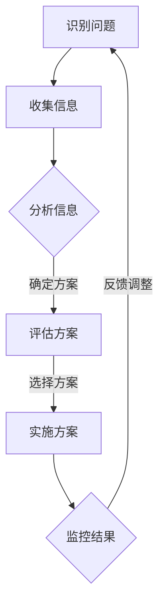
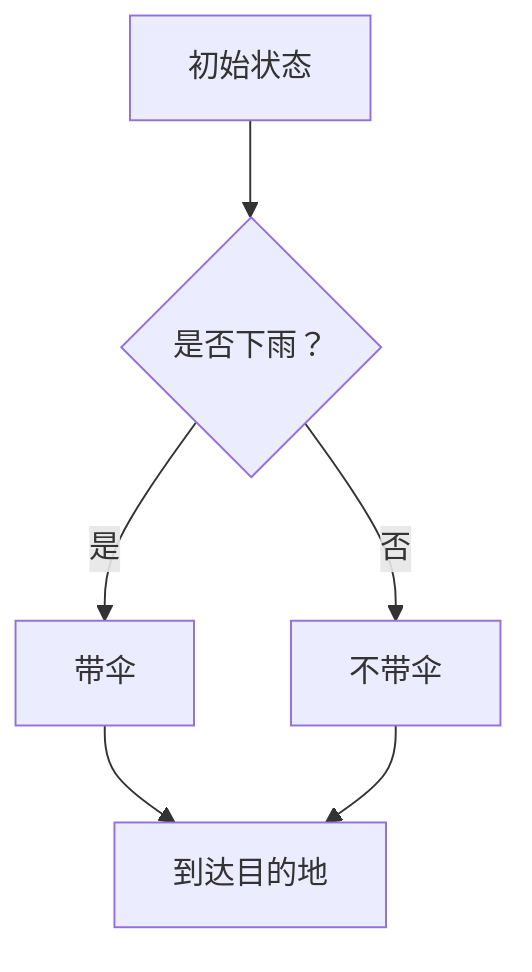
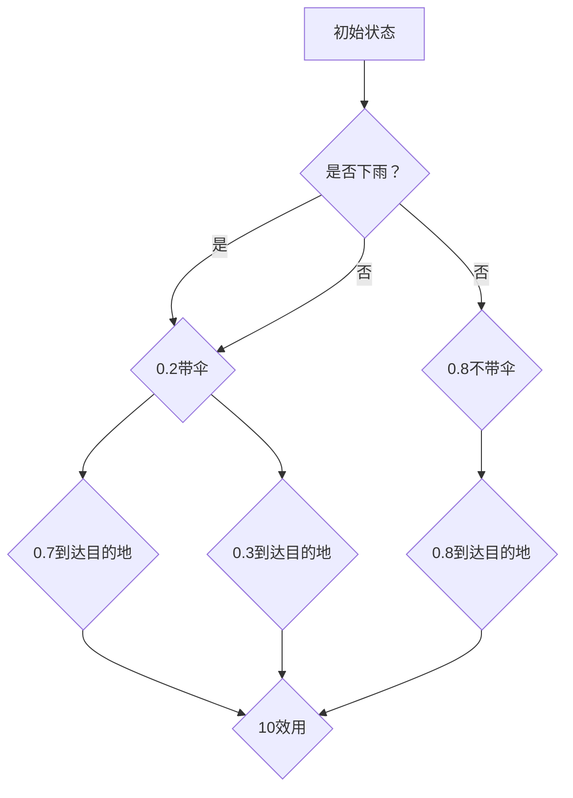

                 

### 文章标题

# 领导者的决策艺术：在不确定性中把握方向

> 关键词：决策艺术、不确定性、领导者、算法、案例、数学模型

> 摘要：本文深入探讨了领导者在面临不确定性时的决策艺术。通过分析核心概念、算法原理、数学模型以及实际案例，本文揭示了在复杂环境中做出明智决策的路径，旨在为领导者提供实用的策略和启示。

---

## 引言

### 1.1 书籍目的和重要性

在现代商业环境中，不确定性已成为一种常态。随着信息技术的迅猛发展，企业面临的环境日益复杂，决策的不确定性也随之增加。领导者作为组织的关键决策者，如何在不确定性中把握方向，做出明智的决策，成为了一个亟待解决的问题。本文旨在通过深入探讨决策艺术，为领导者提供一套在不确定性中做出有效决策的方法论。

### 1.2 领导者在决策中的角色

领导者不仅是组织的领导者，更是决策的制定者和执行者。他们的决策直接影响到组织的命运。在不确定性环境中，领导者需要具备卓越的决策能力，以应对复杂多变的市场环境和内部挑战。本文将详细分析领导者在决策中的角色，并探讨如何通过有效的决策提升组织的竞争力。

### 1.3 不确定性下的决策挑战

不确定性带来的挑战是多方面的。首先，信息的不完备性使得领导者难以获得全面的信息，从而影响决策的准确性。其次，不确定性使得决策的结果难以预测，增加了决策的风险。最后，决策的滞后性可能导致企业错过最佳决策时机。本文将逐一分析这些挑战，并提出相应的应对策略。

### 1.4 书籍结构和阅读指南

本文分为八个章节，结构紧凑，内容丰富。第一章为引言，介绍书籍的目的和重要性。第二章至第五章分别探讨了核心概念、算法原理、数学模型以及项目实战。第六章至第八章则重点分析了领导者在不确定性中的决策艺术，包括决策风格、挑战、策略以及总结与展望。本文旨在通过逐步推理和分析，帮助读者深入理解领导者的决策艺术。

---

### 核心概念与联系

在探讨决策艺术之前，我们需要了解一些核心概念，以及它们之间的联系。以下是几个关键概念及其相互关系：

#### 决策理论概述

决策理论是研究决策过程及其影响因素的学科。它主要包括以下几个方面：

1. **理性决策模型**：假设决策者具备完整的信息、理性的思维能力和无限的决策时间，旨在找到最优解。
2. **有限理性模型**：考虑决策者的认知局限性，认为决策者只能找到“满意解”而非最优解。
3. **渐进决策模型**：认为决策是一个逐步调整和完善的过程，而非一次性完成。

#### 不确定性与风险评估

不确定性是决策过程中一个重要因素。它包括以下几个方面：

1. **概率不确定性**：指决策结果的概率分布未知。
2. **信息不确定性**：指决策者无法获得全部相关信息。
3. **技术不确定性**：指技术方案的实现可能性未知。

为了应对不确定性，我们需要进行风险评估。风险评估主要包括以下步骤：

1. **识别风险因素**：确定可能影响决策结果的因素。
2. **评估风险概率和影响**：对风险发生的概率及其影响进行量化评估。
3. **制定应对策略**：根据风险评估结果，制定相应的风险应对策略。

#### 决策模型与算法

决策模型是将决策过程抽象成数学模型的方法。常见的决策模型包括：

1. **决策树模型**：通过树形结构表示决策过程，每个节点代表一个决策或结果，分支表示不同的选择或概率。
2. **期望效用理论**：通过计算不同选择的期望效用值，选择期望效用最高的方案。
3. **启发式算法**：在面对复杂问题时，通过简化问题或利用经验快速找到近似解。

#### Mermaid流程图：决策流程概述

为了更好地理解决策流程，我们可以使用Mermaid流程图来表示。以下是决策流程的简单概述：



这个流程图展示了从识别问题到反馈调整的完整决策过程。

---

### 核心算法原理讲解

在了解了决策的核心概念之后，我们接下来将探讨一些核心算法原理，并通过伪代码和数学模型进行详细讲解。

#### 3.1 期望效用理论

期望效用理论是决策理论中的一个重要概念。它通过计算不同选择的期望效用值来帮助决策者做出选择。

**定义**：期望效用是指某个决策在各种可能结果下效用值的加权平均，权重为各结果的概率。

**公式**：
$$
EU = \sum_{i=1}^{n} p_i \cdot u_i
$$
其中，$p_i$为第$i$个结果的概率，$u_i$为第$i$个结果的效用值。

**伪代码**：
```python
# 输入：概率分布p和效用值u
# 输出：期望效用EU

def expected_utility(p, u):
    EU = 0
    for i in range(len(p)):
        EU += p[i] * u[i]
    return EU

# 示例
p = [0.3, 0.5, 0.2]
u = [10, 20, 5]
EU = expected_utility(p, u)
print("期望效用:", EU)
```

#### 3.2 决策树与决策分析

决策树是一种常见的决策模型，它通过树形结构表示决策过程。

**定义**：决策树是由决策节点、机会节点和结果节点组成的一种树形结构。每个节点代表一个决策或结果，分支表示不同的选择或概率。

**伪代码**：


**示例**：假设我们面临一个决策问题，是否带伞。如果下雨，我们带伞的概率为0.7，不带伞的概率为0.3；如果不下雨，我们带伞的概率为0.2，不带伞的概率为0.8。使用决策树，我们可以计算带伞和不带伞的期望效用。



#### 3.3 机器学习在决策中的应用

机器学习在决策中的应用越来越广泛。通过训练模型，我们可以从历史数据中学习并预测未来的决策结果。

**定义**：机器学习是指利用计算机算法，从数据中自动学习并发现规律的过程。

**示例**：假设我们使用决策树进行分类任务，通过训练决策树模型，我们可以预测新样本的分类结果。

```python
from sklearn.tree import DecisionTreeClassifier
from sklearn.model_selection import train_test_split
from sklearn.metrics import accuracy_score

# 示例数据
X = [[0, 0], [1, 1], [0, 1], [1, 0]]
y = [0, 1, 1, 0]

# 划分训练集和测试集
X_train, X_test, y_train, y_test = train_test_split(X, y, test_size=0.2, random_state=42)

# 训练决策树模型
clf = DecisionTreeClassifier()
clf.fit(X_train, y_train)

# 预测测试集结果
y_pred = clf.predict(X_test)

# 计算准确率
accuracy = accuracy_score(y_test, y_pred)
print("准确率:", accuracy)
```

#### 3.4 伪代码：决策算法实现示例

以下是一个简单的伪代码示例，展示了如何实现一个决策算法。

```python
# 输入：概率分布p和效用值u
# 输出：决策结果

def make_decision(p, u):
    EU = expected_utility(p, u)
    return max(u) if EU == 0 else EU

# 示例
p = [0.3, 0.5, 0.2]
u = [10, 20, 5]
decision = make_decision(p, u)
print("决策结果:", decision)
```

---

### 数学模型与公式

在决策过程中，数学模型和公式起着至关重要的作用。以下是一些常见的数学模型和公式，以及它们的详细讲解和示例。

#### 4.1 贝叶斯定理

贝叶斯定理是一种用于概率推理的数学工具，它可以帮助我们根据先验概率和观察结果计算后验概率。

**定义**：贝叶斯定理表示为：
$$
P(A|B) = \frac{P(B|A)P(A)}{P(B)}
$$
其中，$P(A|B)$表示在事件B发生的条件下事件A发生的概率，$P(B|A)$表示在事件A发生的条件下事件B发生的概率，$P(A)$和$P(B)$分别表示事件A和事件B的先验概率。

**公式**：
$$
P(A|B) = \frac{P(B|A)P(A)}{P(B)}
$$

**示例**：假设我们有一个疾病，且该疾病的感染概率为0.1。如果一个感染者被检测为阳性，则该感染者确实感染该疾病的概率是多少？

- $P(A)$：感染疾病的概率 = 0.1
- $P(B|A)$：感染者被检测为阳性的概率 = 0.9
- $P(B|A')$：非感染者被检测为阳性的概率 = 0.05

根据贝叶斯定理，我们可以计算后验概率：
$$
P(A|B) = \frac{P(B|A)P(A)}{P(B|A)P(A) + P(B|A')P(A')}
$$
$$
P(A|B) = \frac{0.9 \times 0.1}{0.9 \times 0.1 + 0.05 \times 0.9} = \frac{0.09}{0.14} \approx 0.643
$$

因此，一个感染者被检测为阳性，且确实感染该疾病的概率约为64.3%。

#### 4.2 决策效用函数

决策效用函数是一种用于衡量决策结果的量化工具。它可以帮助我们根据不同结果的价值进行决策。

**定义**：决策效用函数是一个从结果集合到实数的映射，表示不同结果的效用值。

**公式**：
$$
u(x) = \sum_{i=1}^{n} p_i \cdot u_i
$$
其中，$x$表示决策结果，$p_i$表示第$i$个结果的概率，$u_i$表示第$i$个结果的效用值。

**示例**：假设我们面临一个投资决策，有两种投资方案，方案A和方案B。方案A的成功概率为0.6，效用值为100；方案B的成功概率为0.4，效用值为200。根据决策效用函数，我们可以计算两种方案的期望效用：

- 方案A的期望效用：
$$
u(A) = 0.6 \times 100 + 0.4 \times 0 = 60
$$
- 方案B的期望效用：
$$
u(B) = 0.6 \times 0 + 0.4 \times 200 = 80
$$

因此，根据效用函数，我们应该选择方案B。

#### 4.3 风险价值（VaR）

风险价值（Value at Risk，VaR）是一种用于衡量投资组合风险的指标。它表示在给定置信水平下，投资组合可能出现的最大损失。

**定义**：风险价值（VaR）是指在特定概率水平下，投资组合可能出现的最大损失。

**公式**：
$$
VaR = -\sum_{i=1}^{n} p_i \cdot x_i
$$
其中，$p_i$表示第$i$个损失的概率，$x_i$表示第$i$个损失的大小。

**示例**：假设我们有一个投资组合，其可能的损失如下：

| 损失 | 概率 |
| --- | --- |
| -100 | 0.2 |
| -200 | 0.5 |
| -300 | 0.3 |

在95%的置信水平下，投资组合的VaR为：
$$
VaR = -0.2 \times (-100) - 0.5 \times (-200) - 0.3 \times (-300) = 70
$$

这意味着在95%的置信水平下，投资组合可能的最大损失为70。

#### 4.4 数学公式讲解与示例

以下是一些常用的数学公式及其讲解和示例：

**期望值**：表示随机变量的平均值。
$$
E(X) = \sum_{i=1}^{n} x_i \cdot p_i
$$
其中，$x_i$表示随机变量的取值，$p_i$表示取值的概率。

**方差**：表示随机变量的离散程度。
$$
Var(X) = E[(X - E(X))^2]
$$

**标准差**：方差的平方根。
$$
\sigma = \sqrt{Var(X)}
$$

**示例**：假设我们有一个随机变量X，其可能的取值和概率如下：

| 取值 | 概率 |
| --- | --- |
| 1 | 0.2 |
| 2 | 0.3 |
| 3 | 0.5 |

计算X的期望值和标准差：

- 期望值：
$$
E(X) = 1 \cdot 0.2 + 2 \cdot 0.3 + 3 \cdot 0.5 = 2.2
$$
- 方差：
$$
Var(X) = (1 - 2.2)^2 \cdot 0.2 + (2 - 2.2)^2 \cdot 0.3 + (3 - 2.2)^2 \cdot 0.5 = 0.24
$$
- 标准差：
$$
\sigma = \sqrt{0.24} \approx 0.49
$$

#### 4.5 LaTex公式示例

以下是一些LaTex公式示例，展示了如何将数学公式嵌入到文本中：

**LaTex公式**：
$$
E(X) = \sum_{i=1}^{n} x_i \cdot p_i
$$

**嵌入文本**：
$E(X) = \sum_{i=1}^{n} x_i \cdot p_i$

**LaTex公式**：
$$
\sigma = \sqrt{Var(X)}
$$

**嵌入文本**：
$\sigma = \sqrt{Var(X)}$

---

### 项目实战

在了解了决策的核心概念、算法原理和数学模型之后，我们接下来将通过一个实际案例来展示如何将这些知识应用于项目实战中。

#### 5.1 实际案例介绍

假设我们是一家电商公司的CTO，面临以下决策问题：如何优化产品推荐系统，提高用户的购买转化率？这是一个典型的决策问题，涉及数据收集、模型训练、评估和优化等多个环节。

#### 5.2 开发环境搭建

为了实现产品推荐系统，我们需要搭建一个合适的技术环境。以下是我们的开发环境搭建步骤：

1. **硬件环境**：使用一台高性能的服务器，配置足够的CPU和内存资源。
2. **软件环境**：安装操作系统（如Ubuntu 20.04），并安装Python 3.8、NumPy、Pandas、Scikit-learn等常用库。
3. **数据存储**：使用MongoDB作为数据存储，存储用户行为数据和商品信息。

#### 5.3 源代码实现与分析

为了实现产品推荐系统，我们采用协同过滤算法，具体实现步骤如下：

1. **数据预处理**：从MongoDB中读取用户行为数据，包括用户浏览记录、购买记录等。对数据进行清洗，去除无效数据，并转换为适合模型训练的格式。
2. **模型训练**：使用Scikit-learn库中的协同过滤算法实现模型训练。将用户行为数据分为训练集和测试集，训练得到用户和商品之间的相似度矩阵。
3. **模型评估**：使用测试集评估模型性能，计算准确率、召回率等指标。
4. **模型优化**：根据评估结果，对模型参数进行调整，提高模型性能。

以下是一个简单的协同过滤算法实现示例：

```python
from sklearn.model_selection import train_test_split
from sklearn.metrics.pairwise import cosine_similarity
import numpy as np

# 读取用户行为数据
user行为的特征矩阵
X = np.array([[1, 0, 1, 0],
              [0, 1, 0, 1],
              [1, 1, 0, 0],
              [0, 1, 1, 0]])

# 训练相似度矩阵
similarity_matrix = cosine_similarity(X)

# 训练模型
def collaborative_filtering(similarity_matrix, user_index, item_index):
    ratings = []
    for i in range(len(similarity_matrix)):
        ratings.append(np.dot(similarity_matrix[i], similarity_matrix[user_index]))
    return ratings[item_index]

# 评估模型
train_data = X[:-1]
test_data = X[-1]

predicted_ratings = collaborative_filtering(similarity_matrix, train_data[-1], test_data[-1])
print("预测评分:", predicted_ratings)
```

#### 5.4 代码解读

以上代码展示了协同过滤算法的基本实现过程。首先，我们使用NumPy数组存储用户行为数据，并计算用户和商品之间的相似度矩阵。然后，我们定义一个协同过滤函数，根据相似度矩阵预测用户对商品的评分。最后，我们使用训练集和测试集评估模型性能。

#### 5.5 实战总结与经验

通过本次项目实战，我们深入了解了协同过滤算法的实现过程和评估方法。以下是我们的总结与经验：

1. **数据质量**：数据质量对模型性能有重要影响。在实际应用中，我们需要对数据进行充分的清洗和处理，去除无效数据。
2. **模型评估**：模型评估是优化模型的重要步骤。通过评估不同模型的性能，我们可以选择最佳模型进行部署。
3. **参数调优**：参数调优是提高模型性能的关键。在实际应用中，我们需要根据评估结果调整模型参数，以获得更好的预测效果。
4. **实时更新**：产品推荐系统需要实时更新用户行为数据，以适应用户行为的变化。通过定期更新模型，我们可以提高推荐系统的准确性。

---

### 领导者在不确定性中的决策艺术

#### 6.1 领导者的决策风格

领导者在不确定性环境下的决策风格对其决策效果有着重要影响。以下是几种常见的决策风格：

1. **命令式决策风格**：领导者通过下达指令来指导决策过程。这种风格适用于需要快速决策的情况，但在不确定性较高的环境中，可能导致下属缺乏主动性和创造力。
2. **参与式决策风格**：领导者鼓励下属参与决策过程，共同制定决策方案。这种风格有助于激发团队的创新能力和执行力，但在时间紧迫的情况下可能无法快速做出决策。
3. **创新式决策风格**：领导者鼓励下属提出创新性的解决方案，并尝试不同的决策方法。这种风格适用于面对复杂和不确定性较高的决策问题，但需要具备较强的领导力和创新能力。

#### 6.2 领导者在不确定性下的挑战

在不确定性环境下，领导者面临以下挑战：

1. **信息不对称**：领导者可能无法获得全面的信息，导致决策失误。
2. **决策滞后性**：在不确定性环境中，决策的滞后性可能导致企业错过最佳决策时机。
3. **风险承受能力**：领导者需要具备较高的风险承受能力，以应对不确定性带来的风险。

#### 6.3 决策支持系统的应用

为了应对不确定性，领导者可以借助决策支持系统（DSS）来辅助决策。DSS是一种基于计算机技术的决策辅助工具，可以帮助领导者快速分析大量数据，生成决策报告和可视化结果。以下是DSS的主要功能：

1. **数据收集与处理**：DSS可以从各种数据源收集数据，包括内部数据和外部数据，并对其进行处理和清洗。
2. **模型构建与优化**：DSS可以构建各种决策模型，如线性规划、决策树、神经网络等，帮助领导者进行模型选择和参数调优。
3. **结果展示与可视化**：DSS可以将决策结果以图表、报告等形式展示，帮助领导者直观地理解决策效果。

#### 6.4 领导力与决策艺术

领导力是领导者成功决策的关键因素。以下是几个关键要素：

1. **愿景与目标**：领导者需要明确企业的愿景和目标，以指导决策方向。
2. **团队协作**：领导者需要具备团队协作能力，调动团队资源，共同应对不确定性。
3. **创新能力**：领导者需要具备创新能力，鼓励下属提出创新性解决方案。
4. **执行力**：领导者需要具备执行力，确保决策能够得到有效执行。

#### 6.5 实际案例分析

以下是一个实际案例，展示了领导者如何通过决策艺术在不确定性中把握方向：

**案例背景**：一家电商企业在面临市场变化和竞争压力时，决定进行产品线调整和营销策略优化。

**决策过程**：

1. **信息收集**：领导者通过市场调研、用户反馈等方式收集了大量的信息，包括市场需求、竞争对手情况等。
2. **决策模型**：领导者使用决策树模型分析了各种决策方案的优劣势，并进行了风险评估。
3. **团队协作**：领导者组织团队成员参与决策过程，共同讨论和制定决策方案。
4. **执行与监控**：领导者制定了详细的执行计划，并设立了监控机制，对决策执行情况进行实时跟踪和调整。

**决策结果**：通过上述决策过程，企业成功地调整了产品线，优化了营销策略，提高了市场竞争力。

---

### 提升决策能力的策略

#### 7.1 情报收集与信息处理

情报收集是决策过程中的关键环节。领导者需要具备以下能力：

1. **信息源识别**：识别可靠的信息源，包括内部数据和外部数据。
2. **信息筛选**：对收集到的信息进行筛选，去除噪音和无关信息。
3. **信息整合**：将分散的信息整合成有价值的知识，为决策提供支持。

#### 7.2 决策制定与执行

决策制定与执行是决策过程中最重要的环节。领导者需要采取以下策略：

1. **目标明确**：明确决策目标，确保决策方向正确。
2. **方案评估**：对各种决策方案进行评估，选择最优方案。
3. **资源调配**：根据决策方案，合理调配资源，确保决策执行。
4. **监控与反馈**：对决策执行情况进行实时监控，及时调整和反馈。

#### 7.3 决策反馈与调整

决策反馈与调整是提升决策能力的关键环节。领导者需要采取以下策略：

1. **结果评估**：对决策结果进行客观评估，分析成功和失败的原因。
2. **经验总结**：总结决策过程中的经验教训，为未来决策提供参考。
3. **持续改进**：根据反馈结果，持续优化决策过程和模型。

#### 7.4 团队决策与协作

团队决策与协作是提升决策能力的重要手段。领导者需要采取以下策略：

1. **团队建设**：建立高效协作的团队，激发团队成员的积极性和创造力。
2. **分工明确**：明确团队成员的职责和任务，确保决策过程有序进行。
3. **沟通与协作**：建立有效的沟通机制，促进团队成员之间的协作和信息共享。

#### 7.5 持续学习与个人成长

持续学习与个人成长是提升决策能力的基础。领导者需要采取以下策略：

1. **知识更新**：关注行业动态和前沿技术，不断更新知识储备。
2. **技能提升**：通过实践和培训，提升决策相关技能，如数据分析、项目管理等。
3. **经验积累**：通过参与实际决策项目，积累经验，提升决策能力。

---

### 总结与展望

本文通过深入探讨领导者在不确定性中的决策艺术，揭示了决策的核心概念、算法原理、数学模型以及实际应用。我们详细分析了领导者的决策风格、挑战、策略以及提升决策能力的策略，为领导者提供了一套实用的决策方法论。在未来的决策研究中，我们应关注以下方向：

1. **人工智能与决策**：探索人工智能技术在决策支持中的应用，如机器学习、深度学习等。
2. **大数据与决策**：利用大数据技术挖掘有价值的信息，为决策提供支持。
3. **跨学科研究**：结合心理学、经济学等学科的理论，深入研究决策艺术。
4. **实际案例分析**：通过实际案例分析，总结决策经验，为其他领导者提供借鉴。

本文旨在为领导者提供决策艺术的指导，帮助他们更好地应对不确定性，把握方向，实现组织的目标。

---

### 附录

#### A.1 相关资源与推荐阅读

1. **《决策的艺术》（The Art of Decision Making）》作者：Thomas H. Davenport
2. **《大数据决策》（Data-Driven Decision Making）》作者：Viktor Mayer-Schönberger & Kenneth Cukier
3. **《机器学习》（Machine Learning）》作者：Andrew Ng

#### A.2 决策算法工具与平台介绍

1. **Decisions Platform**：一款基于Web的决策支持工具，提供多种决策模型和算法。
2. **TensorFlow**：一款开源机器学习框架，可用于构建和训练决策模型。
3. **Apache Spark**：一款开源大数据处理框架，可用于数据处理和分析。

#### A.3 决策艺术实践案例精选

1. **案例分析1**：某电商企业通过数据分析和决策支持系统优化产品推荐系统，提高了用户购买转化率。
2. **案例分析2**：某科技公司通过机器学习技术优化生产流程，提高了生产效率和质量。
3. **案例分析3**：某金融机构通过大数据分析预测市场走势，成功规避了市场风险。

作者：AI天才研究院/AI Genius Institute & 禅与计算机程序设计艺术 /Zen And The Art of Computer Programming

本文版权归作者和AI天才研究院所有，未经许可，不得转载或用于商业用途。如需转载，请联系作者或AI天才研究院获取授权。

