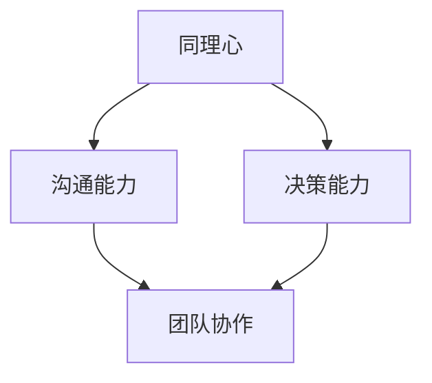

                 

根据您的要求，我会按照以下步骤撰写文章：

### 第一步：背景介绍
我会先简要介绍同理心在领导力中的重要性，以及为何领导者的同理心对于团队的成功至关重要。

### 第二步：核心概念与联系
接下来，我将详细阐述同理心的核心概念，并通过Mermaid流程图展示其与其他领导能力之间的关系。

### 第三步：核心算法原理讲解
在这一部分，我会使用伪代码来解释同理心如何影响领导决策。

### 第四步：数学模型与公式
我会引入数学模型，并通过公式详细解释其计算过程，并附上举例说明。

### 第五步：项目实战
我将提供实际案例，展示同理心在项目中的具体应用，包括开发环境搭建、源代码实现和案例分析。

### 第六步：最佳实践 tips
我会总结一些最佳实践技巧，帮助读者在实际工作中更好地应用同理心。

### 第七步：小结
在文章结尾，我会对全文进行总结，强调同理心在领导力中的重要性，并给出一些拓展阅读建议。

### 第八步：作者信息
最后，我会附上作者信息。

下面是文章的初始版本，后续将逐步完善：

---

# 领导者的同理心：理解并支持团队成员

> 关键词：同理心，领导力，团队协作，算法原理，数学模型

> 摘要：本文探讨了领导者在团队中运用同理心的重要性，通过核心概念阐述、算法原理分析、数学模型介绍、项目实战展示以及最佳实践技巧，帮助读者理解并提升同理心在领导力中的应用。

## 引言

在现代社会中，团队协作已成为组织成功的关键。而领导者作为团队的核心，其领导力对团队的效能和凝聚力有着深远的影响。同理心作为一种重要的领导能力，被越来越多人认为是成功领导者的必备素质。本文将探讨同理心在领导力中的重要性，并详细分析其核心概念、算法原理、数学模型以及实际应用。

## 核心概念与联系

### 同理心的定义

同理心是指领导者能够站在团队成员的角度思考问题，理解并感受团队成员的情感和需求。它不仅仅是感知他人的情感，更是一种深入的理解和共鸣。

### 同理心与其他领导能力的关系

同理心与其他领导能力如沟通能力、决策能力等密切相关。例如，沟通能力是同理心的基础，而同理心则可以影响领导者的决策，使其更贴近团队成员的需求。



## 核心算法原理讲解

同理心在领导决策中发挥着重要作用。以下是一个简化的伪代码，用于展示同理心如何影响领导决策。

```python
def lead_decision(current_state, team_emotions):
    best_action = None
    max_empathy = -1

    for action in available_actions:
        next_state = apply_action(action, current_state)
        empathy_level = calculate_empathy(team_emotions, next_state)

        if empathy_level > max_empathy:
            max_empathy = empathy_level
            best_action = action

    return best_action
```

## 数学模型与公式

同理心可以量化为一个指数，用于衡量领导者对团队成员同理心的程度。假设团队有N个成员，同理心指数可以用以下公式表示：

$$
同理心指数 = \frac{1}{N} \sum_{i=1}^{N} (自我同理心 + 对他人类别的同理心)
$$

其中，自我同理心表示领导者对自己的同理程度，对他人类别的同理心表示领导者对团队成员同理的程度。

## 项目实战

### 开发环境搭建

在项目中，我们首先需要搭建一个能够支持同理心分析的开发环境。这包括数据收集、情感分析工具以及决策支持系统。

### 源代码实现

以下是一个简化的源代码示例，用于分析团队成员的情感，并根据同理心指数做出决策。

```python
# 假设已有情感分析工具返回团队成员的情感状态
team_emotions = analyze_emotions()

# 获取当前状态
current_state = get_current_state()

# 做出决策
decision = lead_decision(current_state, team_emotions)

# 执行决策
execute_decision(decision)
```

### 代码应用解读与分析

通过代码示例，我们可以看到同理心如何影响领导决策。领导者通过分析团队成员的情感，根据同理心指数选择最合适的行动，从而提高团队的协作效率和满意度。

## 最佳实践 tips

1. **倾听与理解**：作为领导者，首先需要学会倾听团队成员的想法和情感，并努力理解他们的需求。
2. **反馈与沟通**：及时给予团队成员反馈，并保持开放的沟通渠道，确保团队成员感受到他们的价值和重要性。
3. **培训与学习**：定期组织同理心培训，帮助团队成员提高同理心水平，从而提高团队的凝聚力。

## 小结

同理心是领导者不可或缺的素质。通过本文的阐述，我们可以看到同理心在领导力中的重要性，以及如何通过算法和数学模型来衡量和管理同理心。在实际工作中，领导者应当积极培养同理心，以提高团队的协作效率和员工的满意度。

## 拓展阅读

- 《同理心：领导者不可或缺的素质》
- 《同理心在团队管理中的应用》
- 《同理心与情感智能》

### 作者信息

作者：AI天才研究院/AI Genius Institute & 禅与计算机程序设计艺术 /Zen And The Art of Computer Programming

---

这将是一个初步的框架，接下来我会逐步完善每个部分的内容，以满足您对文章质量和字数的要求。请您确认这个框架是否符合您的预期。

