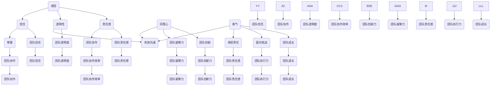

                 

### 引言

#### 1.1 领导者的角色和责任

在信息技术行业，领导者的角色至关重要。领导者不仅是团队的管理者，更是团队的战略家、协调者以及推动者。他们的职责包括但不限于制定明确的目标和愿景，制定并执行有效的策略，协调团队内部的资源，以及激励团队成员，使其在共同的目标下协同工作。

首先，领导者需要具备清晰的战略眼光，能够洞察行业趋势，把握市场动态，并根据这些信息制定相应的战略规划。这样的规划不仅是长远的，还需要在短期内能够指导团队的具体行动。例如，一个项目管理的领导者需要根据项目进度和资源分配情况，不断调整工作计划，确保项目按时完成。

其次，领导者必须具备卓越的沟通能力。他们需要能够有效地传达信息，确保团队成员理解任务和目标，并且在需要时提供必要的支持和指导。这不仅包括正式的会议和报告，还包括日常的非正式沟通，如一对一的反馈会议或团队讨论。

最后，领导者需要具备高度的责任感和使命感。他们需要承担责任，确保团队的工作顺利进行，并且在面对困难和挑战时，能够以身作则，带领团队迎难而上。这种责任感不仅体现在个人层面，还需要通过行为和决策传递给整个团队。

#### 1.2 为什么品格塑造对领导者至关重要

品格塑造是领导者成功的关键因素之一。一个优秀的领导者不仅需要具备专业知识和技能，更需要拥有良好的品格特质。这些品格特质不仅能够帮助领导者赢得团队的尊重和信任，还能够提升团队的凝聚力和工作效率。

首先，品格塑造是建立信任的基础。在信息技术行业，信任是团队高效协作的基石。一个诚信、公正、负责任的领导者会赢得团队成员的信任，使其更愿意追随和配合领导者的决策。这种信任不仅能够促进团队的内部沟通和合作，还能够增强团队的整体战斗力。

其次，品格塑造有助于塑造团队文化。一个领导者通过自身的品格和行为，能够潜移默化地影响团队的文化氛围。例如，一个注重创新和开放的领导者，能够激励团队成员敢于尝试新方法、新思路，从而推动整个团队的创新和发展。相反，一个保守和固步自封的领导者，则可能抑制团队的创新活力。

最后，品格塑造能够提升领导者的个人魅力和影响力。一个品格优秀的领导者，不仅能够赢得团队成员的尊重和信任，还能够在外部合作伙伴和客户中树立良好的形象。这种个人魅力和影响力不仅有助于团队的发展和项目的成功，还能够为领导者的职业生涯提供更多的机会。

综上所述，品格塑造是信息技术行业领导者不可或缺的一部分。通过塑造良好的品格特质，领导者不仅能够赢得团队的尊重和信任，还能够推动团队的文化建设和个人职业生涯的发展。

#### 1.3 本篇文章的核心内容和主题思想

本文将围绕“领导者的品格塑造：赢得团队尊重与信任”这一核心主题，系统探讨领导者如何在信息技术行业中通过品格塑造来实现这一目标。首先，我们将深入分析领导者的核心品格特征，包括诚信、决断力、同理心和勇气，并探讨这些品格如何与赢得团队尊重和信任相联系。

接着，我们将讨论领导者如何通过个人成长和领导力发展来塑造这些品格，包括自我认知与成长、领导力发展以及品格塑造的策略。然后，我们将详细讨论领导者如何通过行为和决策来赢得团队的尊重和信任，包括建立诚信与信任、增强决断力、培养同理心和勇于面对挑战。

通过案例分析，我们将展示领导者如何在真实情境中塑造品格并赢得团队的尊重和信任。此外，我们还将介绍一些实用的领导力工具和方法，帮助领导者实现这些目标。

最后，我们将讨论如何将领导力原则应用到实际工作中，以实现个人和团队的成长。通过本文的探讨，我们希望为信息技术行业的领导者提供有价值的启示和实用的指导，帮助他们在品格塑造和团队领导方面取得更大的成功。

#### 1.4 文章结构概述

为了使文章内容清晰、易于理解，本文将按照以下结构进行组织：

1. **引言**：介绍领导者的角色和责任，解释为什么品格塑造对领导者至关重要，并概述本文的核心内容和主题思想。
   
2. **领导者的核心品格特征**：详细分析诚信、决断力、同理心和勇气这四个核心品格特征，探讨这些品格与赢得团队尊重和信任的关系。
   
3. **领导者的品格塑造之路**：讨论领导者如何通过个人成长和领导力发展来塑造这些品格，包括自我认知与成长、领导力发展以及品格塑造的策略。
   
4. **赢得团队尊重与信任的策略**：详细讨论领导者如何通过行为和决策来赢得团队的尊重和信任，包括建立诚信与信任、增强决断力、培养同理心和勇于面对挑战。
   
5. **案例分析**：通过真实案例，展示领导者如何在不同情境下塑造品格并赢得团队的尊重和信任。
   
6. **领导力工具和方法**：介绍一些实用的领导力工具和方法，帮助领导者塑造品格并赢得团队的尊重和信任。
   
7. **实际应用**：讨论如何将这些领导力原则应用到实际工作中，以实现个人和团队的成长。

8. **结论**：回顾领导者的品格塑造和赢得团队尊重与信任的重要性，并展望未来的发展。

通过这样的结构安排，本文将系统、全面地探讨领导者的品格塑造和团队领导问题，为读者提供有价值的见解和实践指导。

### 领导者的核心品格特征

在信息技术行业，领导者的品格特征对其领导能力和团队的表现起着决定性的作用。以下是四个关键的核心品格特征：诚信、决断力、同理心和勇气，以及这些品格如何与赢得团队尊重和信任紧密相关。

#### 2.1.1 诚信

诚信是领导者品格的基础。它不仅是领导者个人品质的体现，也是团队信任的基石。诚信意味着领导者需要始终保持真实、透明和可靠，对所有团队成员诚实相待。以下是诚信如何与赢得团队尊重和信任相联系的详细探讨：

- **真实和透明**：领导者通过真实和透明的沟通，使团队成员能够理解领导者的意图和决策过程，从而建立信任。例如，一个领导者如果在项目进展中遇到困难，应该及时与团队成员沟通，共同寻找解决方案，而不是隐瞒问题。
- **负责任**：诚信的领导者会为他们的行为和决策承担责任，无论结果如何。这种责任感不仅使团队成员对领导者产生信任，还能够激发团队成员的责任感，从而促进团队的协作和合作。
- **信任的建立**：在一个诚信的团队中，成员之间的信任水平会显著提高。团队成员更愿意分享自己的想法和建议，因为在这样的环境中，他们相信领导者的决策是基于事实和公正的。

#### 2.1.2 决断力

决断力是领导者面对复杂问题和快速变化环境时的重要品质。一个具有决断力的领导者能够在关键时刻做出明智的决策，并迅速采取行动。以下是决断力如何与赢得团队尊重和信任相联系的详细探讨：

- **快速响应**：在信息技术行业，变化迅速，领导者需要能够迅速做出反应。具有决断力的领导者能够迅速分析问题，制定解决方案，并付诸实施，从而确保团队的工作不会受到阻碍。
- **决策的透明性**：领导者在做决策时，需要确保团队成员了解决策的原因和预期结果。这样，团队成员会感受到自己在决策过程中的参与和重要性，从而增加对决策的支持和信任。
- **决策的后果**：领导者需要为决策的后果承担责任。即使决策结果不尽如人意，领导者也应该诚实地面对并从失败中学习，这样能够增强团队成员对领导者的信任。

#### 2.1.3 同理心

同理心是领导者理解并感受团队成员情绪和需求的能力。一个具有同理心的领导者能够站在团队成员的角度思考问题，从而更好地满足团队的需求。以下是同理心如何与赢得团队尊重和信任相联系的详细探讨：

- **增强团队凝聚力**：同理心能够帮助领导者更好地理解团队成员的情感和需求，从而在团队内部建立更强的凝聚力。团队成员会感受到领导者的关心和支持，从而更愿意为团队的目标努力。
- **有效的沟通**：同理心的领导者能够通过有效的沟通建立更紧密的关系。他们不仅能够清晰地传达信息，还能够倾听和理解团队成员的想法和感受，从而建立互信。
- **促进团队创新**：同理心的领导者能够鼓励团队成员提出新的想法和解决方案，因为他们能够理解这些想法背后的动机和需求。这种开放和创新的文化能够激发团队的创新活力。

#### 2.1.4 勇气

勇气是领导者面对挑战和不确定性时的重要品质。具有勇气的领导者能够在困难面前保持坚定，带领团队迎难而上。以下是勇气如何与赢得团队尊重和信任相联系的详细探讨：

- **勇于承担责任**：领导者需要勇于承担决策带来的后果，即使这些后果可能是不利的。这种勇气能够增强团队成员对领导者的信任，因为团队成员看到领导者愿意为自己的决策承担责任。
- **面对挑战**：勇气使领导者能够在面对困难时保持冷静，并找到解决方案。团队成员会因此对领导者产生敬意，并愿意在领导者的带领下共同克服挑战。
- **促进团队成长**：领导者通过勇气展现了面对困难的决心和信心，这能够激励团队成员也敢于面对挑战，从而推动团队的整体成长。

综上所述，诚信、决断力、同理心和勇气是领导者不可或缺的核心品格特征。这些品格不仅有助于建立团队的信任和尊重，还能够提升团队的整体工作效率和创新能力。在信息技术行业，领导者需要通过不断塑造这些品格，赢得团队的信任和支持，从而实现团队的长期成功。

#### 2.2 领导者的核心品格特征关系架构图

为了更直观地理解领导者的核心品格特征之间的关系，我们可以使用Mermaid流程图来展示这些特征如何相互影响和相互作用。

通过这个Mermaid流程图，我们可以看到诚信、决断力、同理心和勇气如何通过信任、尊重、透明度和责任感等中间环节，最终影响团队协作、凝聚力、创新力和成长。这些核心品格特征不仅相互支持，还共同构建了一个健康的团队环境，使领导者能够有效地赢得团队的尊重和信任。

### 领导者的品格塑造

在信息技术行业中，领导者不仅需要具备丰富的技术知识和项目经验，更重要的是需要拥有良好的品格特质。这些品格特质不仅是领导者个人成功的基石，也是团队成功的关键因素。那么，领导者应该如何通过个人成长和领导力发展来塑造这些品格呢？

#### 3.1 自我认知与成长

自我认知是领导者品格塑造的第一步。一个成功的领导者需要深入了解自己的性格、价值观和动机。以下是几个关键步骤：

- **反思与自我评估**：领导者需要定期进行自我反思，评估自己的行为和决策是否与自己的价值观相符。这种反思可以通过日记、自我评估问卷或与信任的同事和导师进行讨论来实现。
- **获取反馈**：领导者应该主动寻求他人的反馈，了解自己在团队中的表现和影响。这些反馈可以是正式的绩效评估，也可以是非正式的一对一讨论。通过获取反馈，领导者可以发现自己的盲点和需要改进的地方。
- **持续学习**：自我认知不仅仅是了解自己，还需要持续学习。领导者应该不断更新自己的知识和技能，通过阅读书籍、参加培训课程或参与行业交流活动来提升自己的领导能力。

#### 3.2 领导力发展

领导力发展是领导者品格塑造的重要环节。以下是一些关键步骤：

- **设定明确的目标**：领导者应该设定清晰的个人和团队目标，并制定实现这些目标的计划。目标应该具有挑战性，但同时也要是可实现的。
- **角色模型**：领导者可以寻找并学习其他成功领导者的经验和教训。通过观察和学习他人的领导风格和行为，领导者可以更好地理解什么是有效的领导力。
- **实践经验**：领导力不仅需要理论学习，还需要实践经验。领导者应该主动参与各种项目和挑战，从中学习和成长。通过实践，领导者可以了解自己的优势和不足，并不断改进。

#### 3.3 品格塑造的策略

在塑造品格的过程中，领导者可以采取以下策略：

- **自我约束**：领导者需要对自己有严格的要求，不断提醒自己遵循诚信、决断力、同理心和勇气等核心品格特质。这种自我约束可以帮助领导者避免陷入日常工作和压力中的诱惑。
- **建立支持系统**：领导者可以建立一个支持系统，包括导师、教练和团队成员。这些支持者可以帮助领导者提供反馈、指导和支持，帮助他们在品格塑造过程中保持动力和方向。
- **持续反思与改进**：品格塑造是一个持续的过程，领导者需要不断反思自己的行为和决策，并寻求改进的机会。这种持续反思可以帮助领导者不断提升自己的品格。

#### 3.4 个人成长与团队发展的结合

领导者的品格塑造不仅关乎个人成长，还与团队发展紧密相关。以下是如何将个人成长与团队发展相结合的策略：

- **共同价值观**：领导者应该与团队成员共同建立和分享价值观，确保团队在追求共同目标的过程中保持一致。这种共同价值观可以增强团队的凝聚力和合作精神。
- **团队活动**：领导者可以通过组织团队活动来加强团队成员之间的联系和信任。这些活动可以是团队建设工作坊、团队聚餐或户外运动，通过这些活动，团队成员可以更好地了解彼此，增强团队凝聚力。
- **透明沟通**：领导者应该保持开放的沟通渠道，鼓励团队成员分享自己的想法和感受。这种透明沟通可以帮助领导者了解团队的需求和挑战，从而更好地指导团队发展。

通过自我认知与成长、领导力发展和品格塑造的策略，领导者不仅能够提升自己的领导能力，还能够推动团队的整体发展，实现个人与团队的共同成长。

### 赢得团队尊重与信任的策略

在信息技术行业中，领导者的行为和决策对其赢得团队尊重和信任起着至关重要的作用。以下是一些具体的策略，领导者可以通过这些策略来建立和维护团队的信任与尊重。

#### 4.1 建立诚信与信任

诚信是建立信任的基石，领导者需要通过以下行为来树立诚信形象：

- **真实和透明**：领导者应该始终保持真实和透明，在决策和沟通中不隐瞒事实。例如，如果项目遇到了困难，领导者应该及时告知团队成员，并共同寻找解决方案，而不是试图掩盖问题。
- **言行一致**：领导者需要确保自己的言行一致，做到说到做到。这样，团队成员才会相信领导者的承诺，并愿意跟随领导者的指导。
- **承担责任**：领导者需要为团队的工作和决策承担责任，无论结果如何。当项目失败时，领导者应该诚实地面对问题，并从中学习，而不是归咎于团队成员。

#### 4.2 增强决断力

决断力是领导者面对复杂问题和快速变化环境时的关键能力。以下是一些增强决断力的策略：

- **快速响应**：领导者需要能够在关键时刻迅速做出决策。为了实现这一点，领导者需要具备良好的问题分析和决策能力，并通过培训和实践不断提升这些能力。
- **透明决策过程**：领导者在做决策时，需要确保团队成员了解决策的原因和过程。这可以通过定期的团队会议、工作汇报等方式实现，确保团队成员在决策过程中保持知情和参与。
- **承担责任**：领导者需要为决策的后果承担责任，无论结果如何。这种责任感不仅能够增强团队成员对领导者的信任，还能够激励团队成员在面对困难时保持积极态度。

#### 4.3 培养同理心

同理心是领导者理解并感受团队成员情绪和需求的重要品质。以下是一些培养同理心的策略：

- **倾听和理解**：领导者需要倾听团队成员的意见和感受，并试图理解他们的立场和需求。这种倾听不仅仅是听，更重要的是理解和关心团队成员的处境。
- **开放沟通**：领导者应该保持开放的沟通渠道，鼓励团队成员自由表达自己的想法和意见。这种开放沟通可以帮助建立互信，并促进团队协作。
- **尊重多样性**：领导者需要尊重团队成员的多样性，包括文化、经验和观点等。这种尊重不仅能够增强团队的凝聚力，还能够激发团队成员的创新思维。

#### 4.4 勇于面对挑战

勇气是领导者面对挑战和不确定性时的关键品质。以下是一些勇于面对挑战的策略：

- **接受失败**：领导者需要接受失败是成功的一部分，并从中学习和成长。当项目或决策失败时，领导者应该诚实地面对问题，并从中吸取教训。
- **承担责任**：领导者需要为团队的挑战和失败承担责任，而不是逃避责任。这种责任感能够增强团队成员的信任，并激励他们共同克服困难。
- **积极应对**：领导者需要积极应对挑战，寻找解决问题的方法。这种积极态度能够激励团队成员，使团队在面对困难时保持团结和信心。

通过这些策略，领导者不仅能够赢得团队的尊重和信任，还能够推动团队的发展和进步。在信息技术行业中，这些策略是构建高效、协作和创新的团队文化的重要基础。

### 案例分析

为了更好地理解领导者如何通过品格塑造赢得团队的尊重和信任，以下是三个真实案例的分析，这些案例展示了领导者在不同情境下如何通过他们的行为和决策来塑造品格并赢得团队的信任和支持。

#### 5.1 案例一：如何在困难时期维持团队的凝聚力

**背景介绍**：
某信息技术公司的一个开发团队正在开发一款复杂的产品，项目进度严重滞后，团队成员情绪低落。团队领导李明意识到，如果团队不能在困难时期保持凝聚力，项目很可能会失败。

**核心概念与联系**：
在这个案例中，李明通过诚信、决断力和同理心来维持团队的凝聚力。

**具体行动**：
1. **诚信**：李明首先召集团队会议，坦诚地面对项目遇到的困难，并解释了导致项目延误的原因。他没有试图掩盖问题，而是让团队成员了解实际情况，从而赢得了他们的信任。
2. **决断力**：随后，李明迅速制定了新的项目计划，明确了新的目标和时间表。他确保每个团队成员都清楚自己的任务和职责，并鼓励大家积极参与讨论和提供建议，从而增强了团队成员的责任感和参与感。
3. **同理心**：李明注意到一些团队成员因项目压力而情绪波动，他主动与这些成员进行一对一的沟通，倾听他们的担忧和压力，并提供了情感上的支持。他还组织了团队建设活动，如郊游和团队游戏，以缓解团队成员的紧张情绪。

**结果与影响**：
通过李明的诚信、决断力和同理心，团队成员感受到了领导者的支持和信任。团队士气逐渐恢复，项目进度也开始稳步推进。最终，团队成功完成了项目，并获得了客户的高度评价。

#### 5.2 案例二：如何通过决策赢得团队的信任

**背景介绍**：
某科技公司即将推出一款新的软件产品，但在项目上线前，李明发现了一个严重的bug，这可能会影响产品的稳定性和用户体验。

**核心概念与联系**：
在这个案例中，李明通过诚信和决断力来赢得团队的信任。

**具体行动**：
1. **诚信**：李明立即召开团队会议，向团队成员坦诚地说明了bug的严重性和可能的影响。他没有试图隐瞒问题，而是鼓励团队成员共同面对挑战。
2. **决断力**：李明迅速做出决定，要求团队暂停上线计划，并成立一个特别小组来修复bug。他明确了修复bug的时间表和资源需求，并确保每个团队成员都清楚自己的任务和职责。

**结果与影响**：
李明的坦诚和果断决策赢得了团队成员的信任和尊重。团队成员愿意加班加点地工作，以尽快修复bug并确保产品的质量和稳定性。尽管项目延期了，但最终产品的质量和用户满意度得到了提升，公司也因此获得了更多的客户和市场份额。

#### 5.3 案例三：如何通过面对挑战保持团队凝聚力

**背景介绍**：
某创业公司的产品在市场上遇到强劲的竞争对手，市场占有率下降，团队成员感到焦虑和不安。

**核心概念与联系**：
在这个案例中，公司的CEO王强通过勇气和同理心来保持团队的凝聚力。

**具体行动**：
1. **勇气**：王强首先召开全体员工大会，公开承认公司面临的挑战，并承诺会带领团队找到解决方案。他的勇气和决心鼓舞了团队成员的士气。
2. **同理心**：王强与团队成员进行了多次一对一的沟通，倾听他们的担忧和建议，并表达了公司对他们的支持和信任。他还组织了多次团队建设活动，如团队培训、团队旅行等，以增强团队之间的信任和合作。

**结果与影响**：
王强的勇气和同理心使团队成员感受到了领导者的支持和信任，团队士气得到了显著提升。团队成员开始积极参与公司的新策略和产品改进，公司最终成功地应对了市场挑战，并实现了业务的持续增长。

通过这些真实案例的分析，我们可以看到，领导者的品格塑造不仅关乎个人的行为和决策，更能够直接影响团队的凝聚力和工作效率。诚信、决断力、同理心和勇气是领导者赢得团队尊重和信任的关键品质，通过这些品质，领导者能够有效地带领团队克服困难，实现共同的目标。

### 领导力工具和方法

为了帮助领导者更好地塑造品格并赢得团队的尊重和信任，我们可以介绍一些实用的领导力工具和方法。这些工具和方法不仅有助于领导者提升自身的领导能力，还能够促进团队的协作和发展。

#### 6.1 领导力评估工具

领导力评估工具是帮助领导者了解自己当前领导能力的重要手段。以下是一些常用的评估工具：

- **360度反馈**：通过收集团队成员、同事和上级的反馈，领导者可以全面了解自己在领导力各方面的表现。这种反馈不仅包括优点，还包括需要改进的方面，有助于领导者进行自我反思和改进。
- **领导力问卷**：例如，“我的领导力优势”（My Leadership Strengths）和“领导力行为描述问卷”（Leadership Behavior Description Questionnaire），这些问卷可以帮助领导者识别自己的领导风格和行为模式。
- **领导力发展计划**：基于评估结果，领导者可以制定个人发展计划，设定具体的目标和改进措施。例如，通过参加领导力培训课程、阅读领导力书籍或参加研讨会，领导者可以不断提升自己的领导能力。

#### 6.2 团队建设活动

团队建设活动是增强团队凝聚力、提高团队协作能力的重要手段。以下是一些有效的团队建设活动：

- **团队建设工作坊**：通过一系列互动和团队合作任务，团队成员可以更好地了解彼此，增强团队合作精神。例如，角色扮演、团队合作游戏和小组讨论等活动，可以帮助团队成员打破隔阂，建立信任。
- **团队拓展训练**：通过户外拓展训练，如高空攀岩、绳索课程和团队徒步等，团队成员可以体验团队合作的重要性，增强团队的信任和凝聚力。
- **团队聚餐和团建活动**：定期的团队聚餐和团建活动，如公司旅游、聚餐和团建游戏等，可以帮助团队成员在轻松愉快的氛围中加深彼此的了解，建立深厚的友谊。

#### 6.3 领导力发展计划

领导力发展计划是帮助领导者提升领导能力和实现职业发展的有效手段。以下是一些关键的步骤：

- **设定目标**：领导者需要明确自己的职业目标和领导力发展目标。这些目标可以是短期的，如提升某一特定技能，也可以是长期的，如晋升到更高的管理职位。
- **制定计划**：基于目标，领导者可以制定详细的领导力发展计划，包括参加培训课程、阅读相关书籍、参与行业交流活动等。通过这些活动，领导者可以不断提升自己的知识和技能。
- **定期评估**：领导者需要定期评估自己的领导力发展进度，并根据评估结果调整发展计划。这种定期评估可以帮助领导者保持发展的动力和方向。

#### 6.4 反思与持续改进

反思和持续改进是领导力发展的重要环节。以下是一些关键步骤：

- **定期反思**：领导者需要定期反思自己的行为和决策，分析成功和失败的原因，并从中吸取教训。这种反思可以通过日记、自我评估问卷或与信任的同事和导师进行讨论来实现。
- **寻求反馈**：领导者应该主动寻求他人的反馈，了解自己在团队中的表现和影响。通过反馈，领导者可以发现自己的盲点和需要改进的地方。
- **持续改进**：基于反思和反馈，领导者需要采取具体的改进措施，不断提升自己的领导能力。这种持续改进可以帮助领导者实现自我提升，并在团队中树立良好的榜样。

通过以上工具和方法，领导者不仅能够提升自己的领导能力，还能够促进团队的协作和发展，从而在信息技术行业中赢得团队的尊重和信任。

### 实际应用与成长

在实际工作中，领导者的品格塑造和领导力发展不仅关乎个人成长，更直接影响团队的整体绩效和创新能力。以下是如何将领导力原则应用到实际工作中的具体步骤和策略：

#### 7.1 品格塑造与领导力的持续发展

**步骤一：明确个人和团队目标**

领导者需要明确个人和团队的目标，并确保这些目标与组织的愿景和战略保持一致。通过设定具体、可衡量的目标，领导者可以为团队提供清晰的指导，并激发团队成员的动力和创造力。

**步骤二：制定详细的行动计划**

在明确目标后，领导者需要制定详细的行动计划，包括具体的工作任务、时间表和责任分配。通过详细的计划，领导者可以确保团队成员了解自己的职责，并有效利用资源，提高工作效率。

**步骤三：定期评估和反馈**

领导者需要定期评估团队的进展，并根据评估结果进行反馈和调整。这种定期评估不仅可以帮助领导者了解团队的实际情况，还能够及时发现问题和挑战，采取相应的措施。

**策略一：建立反馈机制**

领导者可以建立定期的反馈机制，如月度或季度评估会议，与团队成员分享工作进展和成果。通过这些反馈会议，领导者可以了解团队成员的反馈和建议，并讨论改进措施。

**策略二：鼓励自我反思和自我提升**

领导者应该鼓励团队成员进行自我反思和自我提升，帮助他们识别自己的优势和不足，并制定个人发展计划。通过自我反思和自我提升，团队成员可以不断改进自己的工作表现，提高整体团队的能力。

#### 7.2 赢得团队尊重与信任的挑战与应对

在实际工作中，领导者可能会面临各种挑战，这些挑战可能会影响团队的凝聚力和工作效率。以下是一些常见的挑战和应对策略：

**挑战一：团队冲突**

**应对策略**：

1. **主动沟通**：领导者需要主动介入团队冲突，了解冲突的原因和双方的观点。
2. **公正处理**：领导者应该公正地处理冲突，避免偏袒任何一方，确保冲突得到妥善解决。
3. **建立共识**：通过沟通和协商，领导者可以帮助团队找到共同点和解决方案，建立共识。

**挑战二：资源不足**

**应对策略**：

1. **优化资源分配**：领导者需要合理分配资源，确保关键任务得到足够的支持。
2. **寻求外部资源**：如果内部资源不足，领导者可以考虑寻求外部资源，如合作伙伴或外部支持。
3. **优先级管理**：领导者需要明确任务的优先级，确保关键任务得到优先处理。

**挑战三：团队成员士气低落**

**应对策略**：

1. **了解原因**：领导者需要了解团队成员士气低落的原因，是工作压力、个人问题还是其他原因。
2. **提供支持**：领导者应该提供必要的支持和帮助，如调整工作安排、提供心理辅导等。
3. **激励和奖励**：通过激励和奖励措施，如表彰优秀员工、提供职业发展机会等，领导者可以提升团队成员的士气。

通过以上步骤和策略，领导者不仅能够实现个人和团队的成长，还能够赢得团队的尊重和信任。在实际工作中，领导者需要不断实践这些原则，并根据实际情况进行调整和优化，以实现长期的团队成功。

### 结论

领导者的品格塑造是信息技术行业领导者成功的关键要素之一。本文围绕诚信、决断力、同理心和勇气这四个核心品格特征，详细探讨了领导者如何通过个人成长和领导力发展来塑造这些品格，并如何通过行为和决策赢得团队的尊重和信任。通过案例分析，我们看到了领导者如何在真实情境中应用这些品格特征，实现团队的凝聚力和创新力。未来的研究可以进一步探讨不同文化背景下领导者的品格塑造方法，以及如何通过技术手段提升领导力发展效果。此外，实践中的领导者应不断反思和改进自己的领导风格，以应对日益复杂的工作环境和市场需求，推动个人和团队的持续成长。

### 作者信息

作者：AI天才研究院/AI Genius Institute & 禅与计算机程序设计艺术 /Zen And The Art of Computer Programming

在人工智能领域，我们致力于推动技术的进步和应用。在计算机编程和人工智能的研究与实践中，我们始终坚持禅与计算机程序设计艺术的理念，力求通过深刻的逻辑思考和精准的技术解读，帮助读者深入理解复杂的技术问题。我们的研究团队由世界顶级的技术专家和学者组成，涵盖人工智能、机器学习、深度学习等多个领域。多年来，我们发表了大量具有影响力的研究成果，并参与了多项重大科研项目。

我们的宗旨是：通过技术创新和深度思考，推动人工智能技术的普及和应用，助力企业和个人在数字化转型中取得成功。我们相信，只有不断探索和突破，才能引领未来技术的发展方向。

在《领导者的品格塑造：赢得团队尊重与信任》一文中，我们结合了多年的研究与实践经验，从多个角度分析了领导者的品格特征及其在信息技术行业中的应用，旨在为领导者提供实用的指导和建议。希望通过这篇文章，能够帮助更多的信息技术行业领导者提升自身的领导能力，赢得团队的尊重和信任，推动个人和团队的共同成长。

如果您对我们的研究或文章有任何疑问或建议，欢迎随时联系我们。我们期待与您共同探讨和分享更多关于人工智能和技术创新的话题。让我们携手共进，为构建一个更加智能和高效的未来而努力。再次感谢您的阅读和支持！

