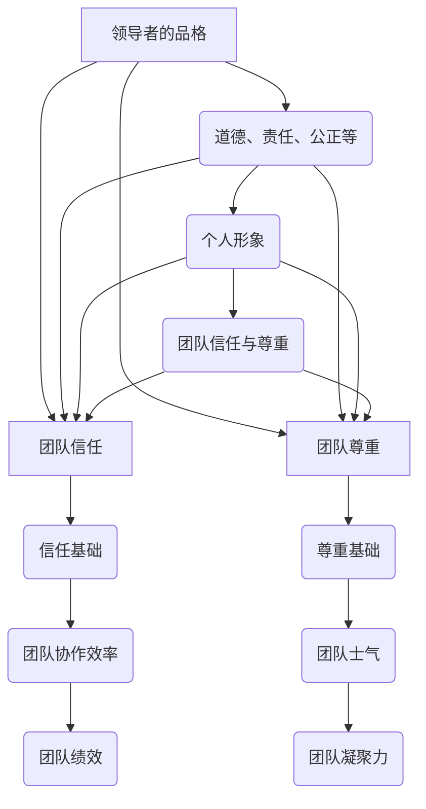

                 

### 《领导者的品格塑造：赢得团队尊重与信任》文章摘要

在信息技术飞速发展的时代，领导者的品格对于团队的成功和组织的成长至关重要。本文将深入探讨领导者的品格塑造，特别是如何赢得团队的尊重与信任。首先，我们将定义领导者的品格，并阐述其重要性。接着，本文将分析塑造品格的关键因素，如自我认知、价值观和行为准则。随后，我们将探讨赢得团队尊重与信任的策略，包括建立信任的基础和提升团队凝聚力的方法。文章还将详细讨论领导者的自我提升和实践方法，并通过实际案例展示品格塑造的效果。最后，本文将总结最佳实践，并提供拓展阅读资源，以帮助领导者更好地塑造品格，赢得团队的尊重与信任。

### 背景介绍

在当今信息化时代，技术更新换代的速度越来越快，企业面临着前所未有的竞争压力。作为组织的核心，领导者不仅需要具备卓越的技术能力，更需要在品格上展现出卓越的领导力。领导者的品格，是指他们在道德、行为和态度上的优秀品质，包括诚信、责任、公正、同情心、自律等。这些品格不仅影响着领导者的个人形象，更直接决定了团队的工作氛围、士气和绩效。

领导者的品格对团队和组织的影响是深远而持久的。首先，品格优秀的领导者能够赢得团队成员的信任和尊重，建立起稳定的团队关系。信任是团队协作的基石，没有信任，团队就无法高效地运作。其次，领导者的品格对团队成员的行为有着潜移默化的影响。一个品格高尚的领导者会以身作则，激励团队成员追求卓越，形成积极向上的企业文化。此外，领导者的品格还影响着团队的凝聚力和创新能力。在一个充满信任和尊重的团队中，成员们更愿意分享知识、合作解决问题，从而推动组织的创新和发展。

然而，现实中许多领导者并未意识到品格塑造的重要性，他们过于关注技术和管理技能的提升，而忽视了品格的培养。这导致了一些领导者在面对复杂局面时，无法做出正确的决策，甚至出现道德失范的行为。因此，本文旨在通过深入探讨领导者的品格塑造，帮助领导者认识到品格的重要性，并提供实用的策略和实践方法，以赢得团队的尊重与信任。

### 核心概念与联系：领导者的品格、团队信任与尊重的Mermaid流程图

为了更好地理解领导者的品格、团队信任与尊重之间的关系，我们可以使用Mermaid流程图来表示这些核心概念及其相互之间的联系。

在这个流程图中，我们首先定义了领导者的品格（A），它包括了道德、责任、公正等核心要素（B），这些要素决定了领导者的个人形象（C），进而影响到团队信任与尊重（D）。团队信任（E）建立在信任基础（F）上，它直接影响到团队的协作效率（G）和绩效（H）。团队尊重（I）则建立在尊重基础（J）上，对团队士气（K）和凝聚力（L）产生积极影响。

通过这个流程图，我们可以清晰地看到领导者的品格如何通过团队信任与尊重这两个环节，最终影响到团队的整体绩效和凝聚力。这一流程图为我们提供了理解领导者品格塑造的重要性的直观工具，也为后续章节的讨论奠定了基础。

### 领导者的品格定义

领导者的品格，是指他们在道德、行为和态度上的优秀品质，这些品质不仅决定了领导者的个人形象，更直接影响到团队的信任与尊重。首先，我们来详细定义这些核心品格。

#### 道德

道德是领导者品格的核心要素之一。它包括正直、诚实、透明等品质。一个道德高尚的领导者会坚守原则，不妥协于短期的利益，而是考虑长期的影响。例如，他们在面对诱惑时，会选择正直的行动，而不是为了个人利益而损害团队的利益。

#### 责任

责任是指领导者对团队、公司和社会所承担的义务。一个负责任的领导者不仅关注团队的工作目标和业绩，还会关心团队成员的个人成长和福祉。他们勇于承担错误带来的后果，并从错误中学习，以防止类似问题再次发生。例如，在项目失败时，一个负责任的领导者会主动承担责任，并与团队成员一起寻找改进的方法。

#### 公正

公正是指领导者对待团队成员时，能够公平、无偏私地做出决策。公正不仅体现在对待团队成员的机会和资源分配上，还体现在对待不同意见和冲突的处理上。一个公正的领导者能够建立团队的信任，使团队成员感到被尊重和公平对待。

#### 同情心

同情心是指领导者对团队成员情感和需求的关注。一个有同情心的领导者会倾听团队成员的困扰和需求，并提供支持和帮助。他们能够理解团队成员的困境，并在必要时提供帮助。例如，当团队成员遇到个人问题时，一个有同情心的领导者会主动关心，并提供帮助，以减轻团队成员的负担。

#### 自律

自律是指领导者自我管理和控制的能力。一个自律的领导者能够坚持自己的目标和原则，即使在面对困难和诱惑时也不动摇。他们有良好的时间管理能力，能够合理安排工作和生活，保持高效的工作状态。

#### 诚实

诚实是指领导者言行一致，不说谎、不欺骗。一个诚实的领导者会以真诚的态度对待团队成员，建立起透明和开放的工作环境。他们不会为了个人利益而隐瞒真相，而是勇于承认错误并寻求解决方案。

#### 爱与关怀

爱与关怀是指领导者对团队成员的关爱和关心。一个有爱与关怀的领导者会关注团队成员的身心健康，提供情感支持，并创造一个温馨、和谐的工作环境。他们会在团队成员需要帮助时伸出援手，与团队成员建立深厚的情感联系。

这些品格共同构成了领导者的人格魅力，使得他们能够在团队中建立信任和尊重。通过这些品格，领导者不仅能够提高团队的工作效率和绩效，还能促进团队成员的个人成长和发展。因此，领导者需要不断提升自己的品格，以赢得团队的信任和尊重。

### 领导者品格的重要性

领导者品格的重要性在于，它们不仅影响着领导者的个人形象，更直接关系到团队的工作氛围、士气和绩效。以下将详细阐述领导者品格对团队建设的积极影响。

#### 增强团队凝聚力

一个品格高尚的领导者能够通过自己的言行树立榜样，增强团队的凝聚力。团队成员看到领导者的正直、公正和责任，会感到被尊重和信任，从而更加愿意与团队共同奋斗。例如，当领导者表现出对团队成员的关心和关怀时，团队成员会感到自己是团队中重要的一部分，从而更加投入工作，形成强大的团队凝聚力。

#### 提高团队士气

领导者品格的积极影响还体现在提高团队士气上。品格优秀的领导者会以鼓励和认可的方式激励团队成员，使他们感到自己的工作得到了重视和认可。这种正面的激励会增强团队成员的自信心和积极性，使他们在面对困难和挑战时更加坚定。例如，当领导者对团队成员的进步和成就表示赞赏时，团队成员会感到自己的努力得到了回报，从而更加愿意为公司的发展贡献力量。

#### 促进团队协作

领导者品格还直接影响团队的协作效果。一个品格优秀的领导者会以身作则，通过公正、透明的行为赢得团队成员的信任，从而促进团队成员之间的协作。团队成员相信领导者的决策是基于公正和公平的原则，会更容易接受和执行这些决策。例如，当领导者能够公正地处理团队成员之间的冲突时，团队成员会更加信任领导者，从而更愿意在团队中合作，共同解决问题。

#### 提升团队绩效

领导者品格的提升能够显著提升团队的整体绩效。品格优秀的领导者能够制定明确的目标和策略，并通过自己的行为激励团队成员去实现这些目标。此外，领导者品格的提升还能够减少团队内部的矛盾和冲突，使团队成员更加专注于工作，从而提高工作效率和绩效。例如，当一个领导者表现出对团队成员的关怀和支持时，团队成员会更加愿意为公司的发展贡献自己的力量，从而推动团队整体绩效的提升。

#### 塑造组织文化

领导者品格对组织文化的塑造起着关键作用。一个品格高尚的领导者会通过自己的行为和决策，传递出一种积极向上的文化价值观。这种文化价值观不仅影响着团队成员的行为，还会影响整个组织的氛围和氛围。例如，当领导者强调诚信和责任时，团队成员会逐渐形成以诚信和责任为核心的行为准则，从而塑造出一种正直、透明、积极向上的组织文化。

#### 培养领导者潜力

领导者品格的提升不仅对当前团队的建设有积极影响，还能为组织的未来发展培养更多的领导者潜力。一个品格优秀的领导者能够通过自身的榜样作用，激发团队成员的领导潜力，使他们在实际工作中逐渐成长为未来的领导者。例如，当一个领导者能够公正、透明地处理团队事务时，团队成员会感到自己有机会参与到团队决策中，从而激发他们的领导潜力。

总之，领导者品格的提升对团队建设具有深远的影响。通过增强团队凝聚力、提高团队士气、促进团队协作、提升团队绩效、塑造组织文化和培养领导者潜力，领导者品格为团队的持续发展和组织的成功奠定了坚实的基础。

### 塑造品格的关键因素

要塑造优秀的领导者品格，关键因素包括自我认知、价值观和行为准则。以下将详细讨论这些因素，并提供实用的策略和实践方法。

#### 自我认知

自我认知是指领导者对自己性格、能力和弱点的深刻理解。它是品格塑造的基石，因为只有了解自己，才能有针对性地提升和改进。以下是一些提升自我认知的策略：

1. **定期自我反思**：领导者应定期花时间反思自己的行为和决策，思考哪些是有效的，哪些需要改进。这可以通过写日记、参加反思会议或进行心理辅导等方式实现。
2. **寻求反馈**：领导者应主动寻求来自团队成员、同事和上级的反馈，了解他们在工作中的观察和评价。这些反馈可以帮助领导者更全面地了解自己的表现。
3. **360度反馈**：通过360度反馈机制，领导者可以获得来自不同角度的反馈，从而更全面地了解自己的优点和不足。
4. **心理测评**：领导者可以参加一些专业的心理测评，如MBTI（性格类型指标）或DISC（行为风格指标），以了解自己的性格特点和优缺点。

#### 价值观

价值观是领导者行为的指南，它决定了领导者如何处理工作和人际关系。以下是一些塑造和坚持价值观的策略：

1. **明确核心价值观**：领导者应明确自己的核心价值观，并将其作为日常决策和行为的标准。例如，诚信、责任、公正、透明等。
2. **树立榜样**：领导者应以身作则，通过自己的行为展示核心价值观。这样，团队成员才会相信并效仿这些价值观。
3. **价值观沟通**：领导者应与团队成员沟通价值观，解释其重要性和适用性。这有助于团队成员理解和认同这些价值观。
4. **价值观整合**：领导者应确保价值观与组织文化和战略目标一致，并将其融入组织的日常运作中。

#### 行为准则

行为准则是领导者行为的规范，它明确了在什么情况下应该做什么，不应该做什么。以下是一些制定和实践行为准则的策略：

1. **制定明确的行为准则**：领导者应制定具体、明确的行为准则，使其易于理解和执行。例如，关于保密、公平竞争、客户服务等。
2. **培训和实践**：领导者应定期对团队成员进行行为准则的培训，并提供实践机会，使团队成员在实际工作中应用这些准则。
3. **监督和评估**：领导者应监督团队成员的行为，并定期评估行为准则的执行情况。对于违反准则的行为，应给予适当的惩罚和纠正。
4. **持续改进**：领导者应根据实际情况和反馈，持续改进行为准则，确保其与组织的需要保持一致。

通过自我认知、价值观和行为准则的塑造和实践，领导者可以逐步提升自己的品格，赢得团队的尊重与信任。以下是一个实际案例：

**案例**：某科技公司的CEO，张先生，通过定期自我反思和寻求反馈，不断了解自己的优点和不足。他明确了公司的核心价值观，如诚信、创新和客户至上，并通过实际行动展示这些价值观。他制定了详细的行为准则，包括诚信守则、客户服务标准和团队合作规范，并定期对员工进行培训和实践。此外，他还建立了反馈机制，鼓励员工提出建议和反馈。通过这些措施，张先生成功塑造了公司的积极文化，提升了团队的凝聚力和绩效，赢得了员工的尊重和信任。

### 赢得团队尊重与信任的策略

赢得团队的尊重与信任是领导者成功的关键。以下将详细探讨一些策略，帮助领导者建立信任、赢得尊重，并保持团队的凝聚力。

#### 1. 建立透明和开放的工作环境

透明和开放的工作环境是建立信任的基础。领导者应主动与团队成员沟通，分享公司战略、目标和进展情况，使团队成员感到被重视和参与其中。以下是一些具体的实践方法：

- **定期会议**：定期召开团队会议，讨论项目进展、问题和解决方案。确保每个成员都有机会发言和提出建议。
- **透明报告**：通过邮件、内部网站或团队协作工具，定期发布项目报告和进展更新，确保信息的及时传达和共享。
- **开放沟通**：鼓励团队成员之间的开放沟通，允许他们表达不同的观点和意见，以促进团队的多样性和创新。

#### 2. 培养良好的沟通习惯

有效的沟通是建立信任和尊重的关键。领导者应确保与团队成员保持良好的沟通，并倾听他们的意见和建议。以下是一些培养良好沟通习惯的策略：

- **主动倾听**：在沟通中，领导者应主动倾听团队成员的意见，避免打断或忽视他们的发言。这有助于建立信任，并使团队成员感到被尊重。
- **明确表达**：领导者应确保自己的表达清晰、明确，避免产生误解或歧义。在必要时，可以借助图表、数据或案例来支持自己的观点。
- **非语言沟通**：领导者应注重非语言沟通，如面部表情、肢体语言和语调。这些非语言因素会影响沟通的效果，因此领导者应确保它们传达出正确的信息。

#### 3. 建立积极的反馈机制

积极的反馈机制有助于团队的发展和成长。领导者应定期给予团队成员反馈，认可他们的成就，并提供改进的建议。以下是一些建立积极反馈机制的方法：

- **即时反馈**：在团队成员完成任务或提出创意时，领导者应即时给予反馈，认可他们的努力和成就。这有助于增强团队成员的自信心和积极性。
- **定期评估**：领导者应定期对团队成员的工作进行评估，提供详细的反馈和改进建议。这有助于团队成员了解自己的表现，并找到提升的方法。
- **多角度反馈**：领导者可以邀请团队成员之间互相给予反馈，以获得更全面的评价。这种方法有助于增强团队成员之间的信任和合作。

#### 4. 尊重和关心团队成员

领导者应尊重和关心团队成员，了解他们的需求和困境，并提供必要的支持。以下是一些具体的实践方法：

- **个性化关怀**：领导者应根据团队成员的个人特点和需求，提供个性化的关怀和支持。例如，对于有家庭责任的员工，可以提供灵活的工作安排。
- **倾听和关注**：领导者应主动倾听团队成员的意见和需求，关注他们的成长和发展。这有助于建立深厚的人际关系，增强团队的凝聚力。
- **提供资源**：领导者应确保团队成员获得所需的资源和支持，以帮助他们完成工作。例如，提供培训机会、工具和设备等。

#### 5. 建立明确的期望和目标

领导者应与团队成员建立明确的期望和目标，确保每个人都知道自己的职责和任务。以下是一些建立明确期望和目标的方法：

- **清晰传达**：领导者应清晰传达项目的目标、任务和期望，确保团队成员理解并认同这些目标。
- **明确责任**：领导者应明确团队成员的责任和角色，确保每个成员都清楚自己的任务和责任。
- **定期跟进**：领导者应定期跟进项目的进展，确保团队成员按时完成任务，并解决问题和挑战。

#### 6. 建立有效的冲突解决机制

冲突是团队中不可避免的现象。领导者应建立有效的冲突解决机制，及时解决冲突，以保持团队的和谐与稳定。以下是一些建立有效冲突解决机制的方法：

- **积极应对**：领导者应积极应对冲突，避免忽视或拖延。及时处理冲突有助于减少负面影响，保护团队的士气和凝聚力。
- **公正处理**：领导者应公正处理冲突，确保每个成员都有公平的机会表达自己的观点，并给予公正的评价。
- **寻求共识**：领导者应寻求共识，通过协商和谈判解决冲突，使团队成员达成共同的理解和解决方案。

通过以上策略，领导者可以逐步建立信任和尊重，增强团队的凝聚力，推动团队的发展和成功。

### 领导者的自我提升

领导者的自我提升是塑造优秀品格和赢得团队信任与尊重的关键环节。以下将详细探讨自我提升的方法，包括自我反思、持续学习和培养情商。

#### 自我反思

自我反思是领导者自我提升的重要方法。通过反思，领导者可以深入理解自己的行为、决策和影响，从而发现自身的优点和不足，并有针对性地进行改进。

1. **定期反思**：领导者应定期花时间反思自己的工作表现，包括成功的经验、失败的原因、决策的依据等。这可以通过写反思日志、参加反思会议或与导师进行反思对话来实现。

2. **记录反馈**：领导者应记录团队成员、同事和上级的反馈，分析这些反馈中的共性和个性，找出自己需要改进的地方。

3. **反思与行动**：在反思过程中，领导者应将发现的问题转化为具体的行动计划，并定期评估这些行动的效果，确保持续改进。

#### 持续学习

持续学习是领导者自我提升的另一个重要方面。在快速变化的技术和社会环境中，领导者需要不断学习新知识、新技能，以适应不断变化的环境。

1. **学习新技术**：领导者应关注行业趋势和技术发展，主动学习新技术和工具，以提高自己的技术水平和决策能力。

2. **阅读和培训**：领导者应定期阅读专业书籍和文章，参加线上或线下的培训课程，扩展自己的知识面和视野。

3. **跨部门交流**：领导者应积极参与跨部门的交流和学习，了解不同部门的工作内容和挑战，从而提高自己的全局观和综合能力。

#### 培养情商

情商（Emotional Intelligence，简称EQ）是指领导者理解和管理自己及他人情感的能力。高情商的领导者能够更好地处理人际关系，建立信任和尊重，从而提高团队的凝聚力和绩效。

1. **自我认知**：领导者应了解自己的情感状态，认识到情感如何影响自己的决策和行为。

2. **情感管理**：领导者应学会管理和调节自己的情绪，避免情绪波动对工作和决策产生负面影响。

3. **同理心**：领导者应培养同理心，理解和关心团队成员的情感需求，提供必要的支持和帮助。

4. **沟通能力**：领导者应提高自己的沟通能力，包括倾听、表达和反馈技巧，以确保信息传达的准确性和有效性。

#### 实践案例

以下是某公司CEO王女士的自我提升实践案例：

1. **定期反思**：王女士每周花两个小时进行自我反思，记录自己的工作表现、成功和失败的原因，以及需要改进的地方。

2. **持续学习**：王女士每天阅读一篇行业相关的文章或书籍，并定期参加领导力培训课程，提高自己的管理能力和决策水平。

3. **培养情商**：王女士通过参加情商培训课程，学习了如何更好地理解和管理自己的情绪，以及如何建立和维护良好的人际关系。

通过这些自我提升的方法，王女士不仅提高了自己的领导能力，还赢得了团队成员的尊重和信任，有效提升了团队的凝聚力和绩效。

### 领导者的实践方法

在塑造品格的过程中，领导者需要将理论知识转化为实际行动，通过具体的方法来提升自身和团队的品格。以下将详细讨论领导者如何通过自律、沟通能力和解决冲突策略来实践这些方法。

#### 自律

自律是领导者品格的重要组成部分，它体现了领导者对自己行为和情绪的控制能力。以下是领导者提升自律的几种方法：

1. **时间管理**：领导者应制定合理的时间管理计划，确保工作与生活平衡。使用日程表、时间追踪工具等工具，合理安排每天的工作时间，确保高效完成任务。

2. **目标设定**：领导者应设定明确的个人和团队目标，并制定实现这些目标的步骤。定期评估进度，调整计划，确保目标达成。

3. **自我监控**：领导者应定期自我监控行为和情绪，发现并纠正不良习惯。可以通过写日记、进行自我反思或寻求他人反馈来实现自我监控。

#### 沟通能力

沟通能力是领导者成功的关键，它直接影响到团队的工作效率和成员的满意度。以下是一些提升沟通能力的方法：

1. **倾听**：领导者应学会倾听，不仅要听对方说什么，更要理解对方的情感和需求。通过积极的倾听，领导者可以更好地理解团队成员，建立信任。

2. **表达**：领导者应提高表达技巧，确保自己的表达清晰、明确，避免产生误解。在表达时，领导者应注重非语言沟通，如面部表情、肢体语言和语调，以增强沟通效果。

3. **反馈**：领导者应定期给予团队成员反馈，认可他们的成就，并提供改进的建议。反馈应具体、有建设性，帮助团队成员了解自己的表现和改进的方向。

#### 解决冲突策略

冲突是团队中不可避免的现象，领导者需要具备解决冲突的能力，以维护团队的和谐与稳定。以下是几种解决冲突的策略：

1. **主动应对**：领导者应主动应对冲突，避免忽视或拖延。及时处理冲突可以减少负面影响，保护团队的士气和凝聚力。

2. **公正处理**：领导者应公正处理冲突，确保每个成员都有公平的机会表达自己的观点，并给予公正的评价。在处理冲突时，领导者应保持冷静，避免情绪化。

3. **寻求共识**：领导者应寻求共识，通过协商和谈判解决冲突，使团队成员达成共同的理解和解决方案。在寻求共识的过程中，领导者应尊重每个成员的意见，寻找折中的方案。

4. **预防冲突**：领导者应通过建立明确的规则和沟通渠道，预防冲突的发生。这包括制定团队准则、建立透明和开放的工作环境，以及鼓励团队成员之间的开放沟通。

通过自律、沟通能力和解决冲突策略的实践，领导者可以不断提升自身的品格，赢得团队的尊重和信任，从而推动团队的发展和成功。

### 品格塑造的案例分析

为了更好地理解领导者品格塑造的重要性，我们可以通过几个成功的案例分析，了解领导者如何在实践中塑造品格，赢得团队的尊重和信任。

#### 案例一：杰克·韦尔奇（Jack Welch）

杰克·韦尔奇是通用电气（General Electric）的前CEO，被誉为“世纪CEO”。他以其独特的领导风格和卓越的品格塑造能力，在通用电气创造了巨大的成功。

**品格特征：**
- **正直和透明**：韦尔奇始终坚持正直和透明的原则，在处理公司和员工的问题时，从不隐瞒真相。
- **激励和赋能**：他鼓励员工勇于创新，并为员工提供成长和发展的机会。
- **关注结果和目标**：韦尔奇强调结果导向，鼓励员工追求卓越，为实现公司目标而努力。

**具体实践：**
- **公开会议**：韦尔奇经常召开公开会议，与员工面对面交流，听取他们的意见和建议。这种开放和透明的沟通方式，使员工感到被尊重和信任。
- **激励计划**：他推出了“通用电气领导力发展计划”，为员工提供培训和发展机会，激励员工不断提升自己。
- **目标导向**：韦尔奇在公司内部推行“目标管理”（Management by Objectives，MBO），确保每个员工都明确自己的目标，并为此努力。

**效果分析：**
通过这些实践，韦尔奇成功地塑造了一种积极向上的企业文化，使通用电气成为全球最具竞争力的企业之一。员工们对他充满信任和尊重，愿意为公司的发展贡献力量。

#### 案例二：玛丽·巴雷特（Mary Barra）

玛丽·巴雷特是通用汽车（General Motors）的首席执行官，她以其卓越的领导才能和品格塑造能力，带领通用汽车走出困境。

**品格特征：**
- **坚韧和决心**：巴雷特在面对困难和挑战时，始终保持坚韧和决心，不轻易放弃。
- **透明和诚信**：她在处理公司事务时，始终坚持透明和诚信的原则，赢得了员工的信任。
- **关注员工**：她关心员工的发展和生活，致力于创造一个公平和包容的工作环境。

**具体实践：**
- **公开对话**：巴雷特经常与员工进行公开对话，了解他们的意见和建议，使员工感到自己的声音被听到。
- **员工赋能**：她推行“员工赋能计划”，鼓励员工参与决策，提高他们的参与感和责任感。
- **诚信管理**：她在处理公司危机时，始终保持透明和诚信，赢得了员工的信任。

**效果分析：**
通过这些实践，巴雷特成功地重塑了通用汽车的声誉，提升了员工的士气和凝聚力。员工们对她充满信任和尊重，认为她是一个值得信赖的领导者。

#### 案例三：约翰·布兰查德（John Blanchard）

约翰·布兰查德是微软（Microsoft）的资深领导力顾问，他在领导力培训和发展方面有着丰富的经验。

**品格特征：**
- **同理心**：布兰查德具有强烈的同理心，能够理解员工的需求和困扰，提供必要的支持和帮助。
- **激励和赋能**：他擅长激励员工，使员工感到自己的工作有价值和意义。
- **持续学习**：他强调持续学习的重要性，鼓励员工不断提升自己的技能和知识。

**具体实践：**
- **培训和发展**：布兰查德为员工提供丰富的培训和发展机会，帮助他们提升技能和知识。
- **一对一辅导**：他定期与员工进行一对一辅导，了解他们的职业发展和需求，提供个性化的支持和建议。
- **激励演讲**：他经常为员工举办激励演讲，激发员工的积极性和创造力。

**效果分析：**
通过这些实践，布兰查德成功地帮助微软培养了一批高素质的领导者，提升了公司的整体竞争力。员工们对他充满信任和尊重，认为他是一个杰出的导师和领导者。

通过以上案例，我们可以看到，成功的领导者都具备高尚的品格，并通过实际行动赢得了团队的尊重和信任。他们的经验表明，品格塑造不仅是领导者个人成长的重要途径，也是团队成功的关键因素。

### 成功领导者的品格魅力：马云的领导风格、乔布斯的品格魅力与惠特曼的管理智慧

在商业历史上，许多成功领导者以其卓越的品格和独特的领导风格影响了整个行业。以下是三位杰出领导者——马云、乔布斯和惠特曼——的品格魅力及其管理智慧的解析。

#### 马云的领导风格

马云，作为中国电商巨头阿里巴巴的创始人，以其独特的人格魅力和领导风格赢得了全球商业界的尊重。他的领导风格主要体现在以下几个方面：

1. **愿景与激情**：马云具有强大的愿景和激情，他能够激励团队成员追随他的梦想。他经常在公开场合分享自己的愿景，使团队成员感到自己的工作不仅仅是一份职业，更是一种使命。

2. **创新与变革**：马云勇于创新，不断推动公司进行变革。他坚信只有不断创新，才能在激烈的市场竞争中保持领先地位。他鼓励团队成员提出新的想法和创意，并在公司内部推行“双创”文化。

3. **文化传承**：马云非常重视企业文化，他强调价值观和信仰的重要性。他在公司内部推行“客户第一、员工第二、股东第三”的理念，使团队成员明白公司的核心价值观，并以此指导自己的行为。

4. **同理心**：马云具有深厚的同理心，他能够理解员工的需求和困扰，并提供必要的支持和帮助。他经常与员工进行一对一的交流，了解他们的想法和需求，从而建立深厚的信任关系。

#### 乔布斯的品格魅力

史蒂夫·乔布斯，苹果公司的联合创始人，以其独特的品格魅力和领导风格，带领苹果公司实现了多次变革和突破。他的品格魅力主要体现在以下几个方面：

1. **专注与创新**：乔布斯对产品的专注和创新精神无人能敌。他坚信只有做到极致，才能在竞争激烈的市场中脱颖而出。他要求团队成员不断追求卓越，不断创新，以满足用户的需求。

2. **激情与执行力**：乔布斯具有强烈的激情和执行力，他能够激发团队成员的热情，并推动他们实现目标。他经常亲自参与产品设计和开发，确保每个细节都达到他的高标准。

3. **领导力**：乔布斯是一位杰出的领导者，他能够通过自己的榜样作用，影响和激励团队成员。他坚信领导者的责任是打造一个高效、有创造力的团队，并为此不懈努力。

4. **价值观**：乔布斯非常重视价值观的传递，他强调产品的设计和创新应体现道德和伦理标准。他在公司内部推行“用户至上”的理念，使团队成员始终以用户的需求为导向。

#### 惠特曼的管理智慧

卢Ann惠特曼，惠普公司的前CEO，以其卓越的管理智慧和管理能力，带领公司实现了多次转型和突破。她的管理智慧主要体现在以下几个方面：

1. **战略规划**：惠特曼是一位出色的战略家，她能够为公司制定清晰的战略规划，并确保公司资源得到有效配置。她通过明确的战略目标，指导公司的运营和发展。

2. **团队建设**：惠特曼非常重视团队建设，她致力于打造一个高效、有凝聚力的团队。她鼓励团队成员之间的合作和沟通，提高团队的整体执行力。

3. **企业文化**：惠特曼强调企业文化的建设，她认为企业文化是公司长期发展的基石。她在公司内部推行“开放、透明、尊重”的文化，使员工感受到公司的关爱和重视。

4. **领导力**：惠特曼是一位具有强大领导力的领导者，她能够通过自己的榜样作用，影响和激励团队成员。她注重团队成员的个人成长和发展，为他们提供广阔的发展空间。

通过分析马云、乔布斯和惠特曼的领导风格和管理智慧，我们可以看到，成功领导者的品格魅力和管理能力对于团队和组织的成功至关重要。他们的经验表明，领导者不仅需要具备卓越的技术能力和管理能力，更需要具备高尚的品格和独特的领导风格，以赢得团队的尊重和信任。

### 附录：领导者的品格塑造资源与工具

为了帮助领导者更好地塑造品格，赢得团队的尊重与信任，以下是几本推荐的书籍、在线资源和培训课程。

#### 推荐书籍

1. **《领导者的品质》（Leadership and Self-Deception）** - 罗伯特·弗里特（Robert Frisch）
   - 本书通过寓言故事的形式，探讨了领导者的自我认知和品格塑造的重要性。

2. **《品格的力量》（The Power of Character）** - 詹姆斯·凯利（James Kouzes）和巴里·波斯纳（Barry Posner）
   - 本书详细阐述了领导者的品格对团队和组织成功的影响，并提供了一系列实用的策略。

3. **《领导者的资质》（The Qualities of a Leader）** - 约翰·梅尔瑟（John M. Mercer）
   - 本书分析了领导者的品格特质，以及如何通过自我提升和实践来培养这些特质。

#### 在线资源

1. **哈佛商业评论（Harvard Business Review）** - https://hbr.org
   - 哈佛商业评论提供大量的领导力文章和案例研究，帮助领导者提升管理技能和品格。

2. **LinkedIn Learning** - https://www.linkedin.com/learning
   - LinkedIn Learning提供丰富的领导力课程，涵盖自我认知、沟通技巧、团队建设等多个方面。

3. **Coursera** - https://www.coursera.org
   - Coursera提供由世界顶级大学和机构提供的免费或付费领导力课程，适合不同层次的领导者。

#### 培训课程

1. **领导力发展课程（Leadership Development Program）** - 沃顿商学院（Wharton School）
   - 沃顿商学院的领导力发展课程提供深入的学习和实践机会，帮助领导者提升管理技能和品格。

2. **通用电气领导力发展中心（General Electric Leadership Development Center）** - https://www.geleadershipcenter.com
   - 通用电气领导力发展中心提供一系列的领导力培训课程，包括自我认知、沟通技巧、团队建设等。

3. **谷歌领导力发展项目（Google Leadership Development Program）** - https://careers.google.com
   - 谷歌的领导力发展项目旨在培养员工的领导力和影响力，帮助他们成为优秀的领导者。

通过利用这些书籍、在线资源和培训课程，领导者可以不断提升自己的品格，赢得团队的尊重与信任，为组织的发展贡献力量。

### 文章小结

本文深入探讨了领导者的品格塑造，特别是如何赢得团队的尊重与信任。首先，我们定义了领导者的品格，包括道德、责任、公正、同情心、自律、诚实和爱与关怀等核心要素。接着，我们分析了领导者品格对团队和组织的重要性，并通过具体案例展示了品格塑造的积极影响。文章还详细讨论了塑造品格的关键因素，如自我认知、价值观和行为准则，并提供了具体的实践方法。此外，我们探讨了赢得团队尊重与信任的策略，包括建立透明和开放的工作环境、培养良好的沟通习惯、建立积极的反馈机制、尊重和关心团队成员、建立明确的期望和目标、以及有效的冲突解决机制。最后，文章总结了成功领导者的品格魅力，并推荐了一些实用的书籍、在线资源和培训课程。

### 最佳实践 tips

为了在实际工作中更好地塑造品格、赢得团队的尊重与信任，以下是几条最佳实践建议：

1. **坚持自我反思**：定期进行自我反思，识别自己的优点和不足，并制定改进计划。

2. **以身作则**：通过自己的行为树立榜样，让团队成员看到品格的重要性。

3. **建立透明和开放的工作环境**：鼓励团队成员参与决策，分享公司战略和目标，确保信息的及时传达。

4. **培养良好的沟通习惯**：倾听团队成员的意见，清晰表达自己的观点，确保沟通的准确性和有效性。

5. **关注团队成员的发展**：为团队成员提供培训和发展机会，关心他们的个人成长和职业发展。

6. **公正处理冲突**：及时、公正地处理团队内部的冲突，确保每个成员都有公平的机会表达自己的观点。

7. **建立积极的反馈机制**：定期给予团队成员反馈，认可他们的成就，并提供改进的建议。

通过遵循这些最佳实践，领导者可以不断提升自身的品格，赢得团队的尊重与信任，推动团队和组织的发展。

### 注意事项

在塑造品格和赢得团队尊重与信任的过程中，领导者需要注意以下几点：

1. **避免过度自我批评**：虽然自我反思很重要，但过度自我批评可能导致自卑和消极情绪，影响领导者的决策和行为。

2. **尊重团队成员的差异**：在团队中，每个成员都有不同的背景、经验和观点。领导者应尊重这些差异，避免因个人偏见而导致不公平待遇。

3. **平衡工作与生活**：领导者应在工作中保持高效，但也要注意保持健康的生活方式，避免因工作压力而影响身心健康。

4. **避免情绪化决策**：在处理团队事务时，领导者应保持冷静和理性，避免因情绪波动而做出错误的决策。

5. **持续学习与进步**：领导者应不断学习新知识和技能，以适应快速变化的环境，同时保持谦逊和开放的心态。

通过注意这些事项，领导者可以更好地塑造品格，赢得团队的尊重与信任，为团队和组织的发展贡献力量。

### 拓展阅读

为了进一步探讨领导者的品格塑造，以下是几篇相关的高质量文章和书籍推荐：

1. **《领导者的影响力：品格、策略与实践》（Leadership Influence: Character, Strategies, and Practice）** - 作者：史蒂文·布朗（Steven Brown）
   - 本书详细探讨了领导者的品格塑造和影响力，提供了实用的策略和实践方法。

2. **《品格领导力：如何塑造领导者的品格，赢得团队的尊重与信任》（Character-Based Leadership: How to Build Character, Gain Respect, and Win Trust as a Leader）** - 作者：威廉·乔治（William George）
   - 本书深入分析了品格领导力的本质，并通过案例研究展示了如何塑造优秀的品格，赢得团队的信任。

3. **《领导者的品格：道德、责任与勇气》（The Leader’s Character: Moral Courage, Responsibility, and Moral Courage）** - 作者：詹姆斯·凯利（James Kouzes）和巴里·波斯纳（Barry Posner）
   - 本书详细阐述了领导者的品格要素，包括道德、责任和勇气，并提供了实用的培养方法。

4. **《领导力的本质：品格与关系的力量》（The Essence of Leadership: The Power of Character and Relationships）** - 作者：安妮·麦格雷戈（Anne McGreggor）
   - 本书探讨了领导力的本质，强调品格和关系的重要性，为领导者提供了深刻的洞察和实用的指导。

通过阅读这些文章和书籍，领导者可以进一步深入了解品格塑造的原理和实践，提升自身的领导力，赢得团队的尊重与信任。

