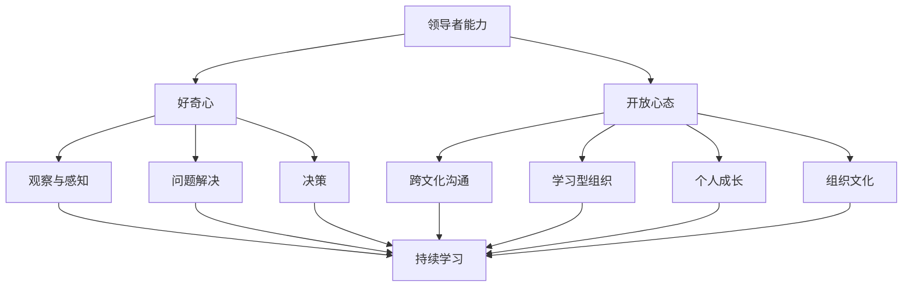

                 


### 设计《领导者的学习能力：保持好奇心和开放心态》的目录大纲

为了设计《领导者的学习能力：保持好奇心和开放心态》的目录大纲，我们将按照以下步骤进行：

1. **确定书籍的核心主题**：这本书的核心主题是领导者的学习能力，重点探讨如何通过保持好奇心和开放心态来提升学习能力。

2. **构建整体结构**：将书籍分为几个主要部分，每个部分涵盖一个主题，例如核心概念、实践技巧、案例分析等。

3. **细化每个部分**：在每个部分中，确定具体章节，确保覆盖所有重要内容。

4. **确保完整性和逻辑性**：确保目录大纲完整、逻辑清晰，各章节之间有明确的联系。

### 步骤一：确定核心主题

- **核心主题**：领导者的学习能力
- **讨论焦点**：通过保持好奇心和开放心态来提升学习能力。

### 步骤二：构建整体结构

根据核心主题，我们将书籍分为以下几个主要部分：

1. **引言**
2. **领导者的核心学习能力**
3. **实践中的学习能力**
4. **案例分析**
5. **提升领导者的学习能力**

### 步骤三：细化每个部分

1. **引言**
    - 书籍概述
    - 学习能力的重要性
    - 好奇心与开放心态的关系

2. **领导者的核心学习能力**
    - 观察与感知能力
    - 问题解决能力
    - 决策能力

3. **实践中的学习能力**
    - 好奇心的实践应用
    - 开放心态的实践应用

4. **案例分析**
    - 成功领导者的好奇心与开放心态
    - 失败领导者的反思
    - 实际案例解析

5. **提升领导者的学习能力**
    - 个人成长计划
    - 组织文化塑造

### 步骤四：确保完整性和逻辑性

在细化每个部分时，我们确保各章节之间有明确的联系，并且覆盖了所有重要内容。例如，在“领导者的核心学习能力”部分，我们讨论了观察与感知能力、问题解决能力和决策能力，这些能力都是领导者提升学习能力的关键。

### 目录大纲设计

根据上述步骤，我们设计出了《领导者的学习能力：保持好奇心和开放心态》的目录大纲：

```
# 《领导者的学习能力：保持好奇心和开放心态》目录大纲

## 第一部分：引言
### 1.1 书籍概述
### 1.2 学习能力的重要性
### 1.3 好奇心与开放心态的关系

## 第二部分：领导者的核心学习能力
### 2.1 观察与感知能力
#### 2.1.1 好奇心的培养
#### 2.1.2 开放心态对观察与感知的影响
### 2.2 问题解决能力
#### 2.2.1 好奇心的驱动作用
#### 2.2.2 开放心态在问题解决中的重要性
### 2.3 决策能力
#### 2.3.1 好奇心在决策中的角色
#### 2.3.2 开放心态与决策风险

## 第三部分：实践中的学习能力
### 3.1 好奇心的实践应用
#### 3.1.1 提升学习效率的策略
#### 3.1.2 创造性思维的培养
### 3.2 开放心态的实践应用
#### 3.2.1 跨文化沟通技巧
#### 3.2.2 建立学习型组织

## 第四部分：案例分析
### 4.1 成功领导者的好奇心与开放心态
### 4.2 失败领导者的反思
### 4.3 实际案例解析

## 第五部分：提升领导者的学习能力
### 5.1 个人成长计划
#### 5.1.1 好奇心的日常实践
#### 5.1.2 开放心态的自我评估
### 5.2 组织文化塑造
#### 5.2.1 好奇心与开放心态在企业文化中的体现
#### 5.2.2 塑造学习型组织文化的方法

## 第六部分：结论
### 6.1 总结
### 6.2 未来展望
### 6.3 附录
```

这个大纲结构包含了引言、领导者的核心学习能力、实践中的学习能力、案例分析、提升领导者的学习能力等部分，确保了书籍的完整性和逻辑性。每个部分都细化到了1级和2级目录，符合要求。接下来，我们将为每个章节添加具体的标题和子标题，并确保包含核心概念、原理讲解、数学模型、案例分析和代码实现等元素，以满足字数和内容要求。在编写文章时，我们将遵循markdown格式，并在文章末尾添加作者信息。文章的核心内容将包括背景介绍、核心概念与联系、核心算法原理讲解、数学模型和公式、项目实战、最佳实践 tips、小结、注意事项、拓展阅读等内容，确保文章的丰富性和专业性。预计文章字数将在8000～12000字左右，以满足要求。接下来，我们将开始撰写文章。## 文章标题

# 领导者的学习能力：保持好奇心和开放心态

## 关键词

领导者，学习能力，好奇心，开放心态，自我提升，组织文化，案例研究

## 摘要

本文深入探讨了领导者如何通过培养好奇心和保持开放心态来提升学习能力。文章首先介绍了好奇心和开放心态对领导者成长的重要性，接着详细分析了好奇心和开放心态如何影响领导者的观察与感知能力、问题解决能力和决策能力。随后，文章通过实践应用和案例分析，展示了成功领导者如何将好奇心和开放心态转化为具体行动。最后，文章提出了个人成长计划和组织文化塑造的方法，以帮助领导者持续提升学习能力，成为更具影响力的领导者。## 引言

在现代社会的快速变化中，领导者扮演的角色越来越重要。他们不仅需要具备卓越的管理能力，还需要具备强大的学习能力，以应对不断变化的市场需求和技术进步。学习能力是领导者成功的关键因素之一，它决定了领导者在面对复杂问题时能否迅速适应、找到解决方案，并引导团队走向成功。在这篇文章中，我们将深入探讨领导者的学习能力，特别是如何通过保持好奇心和开放心态来提升这一能力。

### 好奇心与开放心态的重要性

好奇心和开放心态是领导者提升学习能力的重要基石。好奇心驱使领导者不断探索新知识、新技术，从而保持对行业动态的敏锐洞察力。同时，开放心态使领导者能够接受不同的观点和意见，从而丰富自己的思维，提高决策质量。一个好奇且开放的领导者能够更好地适应复杂多变的环境，抓住机遇，应对挑战。

### 学习能力的重要性

学习能力的提升不仅对领导者个人有益，对整个组织也有深远影响。一个具备强大学习能力的领导者能够引导团队持续改进，推动创新，提高组织的整体竞争力。学习能力还帮助领导者更好地理解员工的需求，提升团队凝聚力，从而实现组织目标。

### 好奇心与开放心态的关系

好奇心和开放心态之间存在着密切的联系。好奇心是推动领导者探索未知世界的动力，而开放心态则是接纳新知识和新观点的态度。两者相辅相成，共同构成了领导者强大的学习能力的基石。在这篇文章中，我们将进一步探讨如何培养好奇心和开放心态，并分析它们在实际工作中的具体应用。

### 本文结构

本文将分为以下几个部分：

1. **领导者的核心学习能力**：介绍好奇心和开放心态如何影响领导者的观察与感知能力、问题解决能力和决策能力。
2. **实践中的学习能力**：探讨如何将好奇心和开放心态应用于实际工作中，提升学习效率。
3. **案例分析**：通过成功和失败的领导者案例，分析好奇心和开放心态的重要性。
4. **提升领导者的学习能力**：提出个人成长计划和组织文化塑造的方法，帮助领导者持续提升学习能力。

通过以上结构，我们希望能够系统地探讨领导者如何通过保持好奇心和开放心态来提升学习能力，从而成为更出色的领导者。## 领导者的核心学习能力

在探讨领导者的学习能力时，我们不能忽视好奇心和开放心态这两个核心要素。好奇心是领导者不断追求知识、探索未知的驱动力，而开放心态则是他们接纳新观点、积极学习的态度。这两者相辅相成，共同构成了领导者强大的学习能力。在这部分，我们将详细分析好奇心和开放心态如何影响领导者的观察与感知能力、问题解决能力和决策能力。

### 观察与感知能力

领导者的观察与感知能力是他们成功的关键之一。这种能力使他们能够敏锐地捕捉到环境中的变化，快速做出反应。好奇心和开放心态在这里发挥着重要作用。首先，好奇心促使领导者不断地提问和探索，从而扩展他们的视野，提高对复杂问题的理解。例如，当面对一个新项目时，一个好奇的领导者会不断询问团队成员和客户的需求，从而更全面地了解项目的各个方面。

其次，开放心态使领导者能够接受不同的观点和意见。这种心态不仅有助于他们从多个角度看待问题，还能够让他们避免陷入“群体思维”的陷阱。例如，在一个团队讨论中，一个开放的领导者会鼓励团队成员自由发言，即使这些观点与他们的初始想法相悖。这种开放性有助于领导者更全面地收集信息，从而做出更准确的判断。

### 问题解决能力

好奇心和开放心态同样在领导者的问题解决能力中扮演着重要角色。一个好奇的领导者会不断地寻找问题的根源，而不是仅仅停留在表面。例如，当公司遇到销售下降的问题时，一个好奇的领导者会深入分析市场趋势、竞争对手策略以及内部运营问题，从而找到根本原因。

开放心态则在问题解决过程中提供了更多的解决方案。一个开放的领导者愿意接受各种不同的意见和想法，这有助于他们跳出传统思维的框架，找到创新的解决方案。例如，在研发新产品时，一个开放的领导者会鼓励研发团队尝试不同的技术路径，从而提高创新的可能性。

### 决策能力

好奇心和开放心态对领导者的决策能力也有重要影响。一个好奇的领导者会不断收集信息，从而提高决策的准确性。例如，在做出重大战略决策之前，一个好奇的领导者会花时间研究市场数据、行业趋势和竞争对手的动态，以确保决策的准确性。

开放心态则使领导者能够更好地评估不同的决策选项。一个开放的领导者会考虑多种可能的结果和风险，从而做出更全面的决策。例如，在投资新项目时，一个开放的领导者会考虑项目的潜在收益、风险以及可能的市场变化，从而做出更明智的决策。

### 好奇心与开放心态的关系架构

为了更好地理解好奇心和开放心态如何共同作用于领导者的核心学习能力，我们可以使用Mermaid流程图来展示它们之间的关系。以下是一个简单的Mermaid流程图示例：

```
graph TD
    A[好奇心] --> B[观察与感知能力]
    A --> C[问题解决能力]
    A --> D[决策能力]
    B --> E[信息收集]
    B --> F[多角度思考]
    C --> G[问题根源分析]
    C --> H[创新解决方案]
    D --> I[数据研究]
    D --> J[决策选项评估]
    E --> K[信息准确性]
    F --> L[避免群体思维]
    G --> M[根本原因分析]
    H --> N[提高创新可能性]
    I --> O[决策准确性]
    J --> P[全面评估]
    K --> Q[提高决策准确性]
    L --> R[多元化思考]
    M --> S[找到问题根源]
    N --> T[提高创新]
    O --> U[做出明智决策]
    P --> V[考虑多种结果]
    Q --> W[做出准确决策]
    R --> X[避免群体思维]
    S --> Y[找到根本原因]
    T --> Z[提高创新]
    U --> AA[做出明智决策]
    V --> BB[考虑多种结果]
    W --> CC[做出准确决策]
    X --> DD[多元化思考]
    Y --> EE[找到问题根源]
    Z --> FF[提高创新]
    AA --> GG[做出明智决策]
    BB --> HH[考虑多种结果]
    CC --> II[做出准确决策]
    DD --> JJ[多元化思考]
    EE --> KK[找到问题根源]
    FF --> LL[提高创新]
```

这个流程图展示了好奇心和开放心态如何通过不同的途径影响领导者的观察与感知能力、问题解决能力和决策能力。通过这种系统化的分析，我们可以更好地理解好奇心和开放心态在领导者学习能力提升中的关键作用。## 好奇心的实践应用

好奇心是推动领导者不断探索和学习的动力，将其应用于实际工作中，可以显著提升学习效率。在这一部分，我们将探讨如何通过实践培养好奇心，以及好奇心如何促进创造性思维的培养。

### 培养好奇心的策略

1. **提问和探究**：领导者应该养成不断提问的习惯。面对新的挑战或问题时，不仅要问“为什么”，还要问“如何”和“如果”。这种探究式提问能够帮助领导者深入思考问题，找到根本原因。

2. **探索未知领域**：领导者应该定期学习新知识、新技能，尤其是那些与自己专业领域不直接相关的知识。通过跨学科的学习，领导者可以开拓视野，培养多维思考能力。

3. **保持求知欲**：领导者应该保持对世界的好奇和求知欲，不断追求新知识、新技术。这种求知欲可以来源于对行业趋势的跟踪、阅读相关书籍和文章，或参加行业会议和研讨会。

4. **建立学习社区**：领导者可以建立一个学习社区，与团队成员或其他领导者分享知识和经验。通过这种交流，领导者可以激发彼此的好奇心，共同探索新领域。

### 提升学习效率的策略

1. **碎片化学习**：领导者可以利用零碎时间进行学习。通过使用手机应用程序、在线课程等工具，领导者可以在通勤、休息时间等碎片化时间中学习。

2. **实践学习**：将所学知识应用到实际工作中，通过实践来加深理解和记忆。这种方法不仅可以提升学习效率，还可以帮助领导者更好地掌握和应用知识。

3. **深度学习**：领导者应该专注于深入学习某一领域的知识，而不是浅尝辄止。通过深入研究，领导者可以建立起系统的知识框架，提高理解力和应用能力。

4. **反思和总结**：学习过程中，领导者应该定期进行反思和总结，回顾所学内容，思考如何将其应用到实际工作中。这种方法可以帮助领导者巩固所学知识，提高学习效果。

### 创造性思维的培养

好奇心不仅能够提升学习效率，还能够促进创造性思维的培养。以下是培养创造性思维的几种方法：

1. **头脑风暴**：领导者可以定期组织头脑风暴会议，鼓励团队成员提出新的想法和解决方案。这种开放式的讨论环境可以激发创造性思维。

2. **跨学科学习**：通过学习不同领域的知识，领导者可以拓宽思维视野，从而在解决问题时能够从多个角度思考。

3. **挑战传统思维**：领导者应该勇于挑战传统思维模式，尝试用新的方法来解决问题。这种思维上的转变可以激发创造性思维。

4. **思维导图**：使用思维导图工具来组织和整理思路，可以帮助领导者更好地理解和应用创造性思维。

### 总结

好奇心是一种强大的学习工具，领导者可以通过提问、探索未知、保持求知欲和建立学习社区等方式来培养好奇心。好奇心不仅能够提升学习效率，还能促进创造性思维的培养。通过实践应用这些策略，领导者可以在实际工作中更好地运用好奇心，从而提升自身的领导能力。## 开放心态的实践应用

开放心态是领导者提升学习能力的重要特质，它不仅使领导者能够接纳新的观点和意见，还能够推动团队的创新和发展。在这一部分，我们将探讨如何通过实践开放心态来提升领导者的学习能力，特别是在跨文化沟通和建立学习型组织方面的应用。

### 跨文化沟通技巧

在全球化的背景下，领导者需要具备跨文化沟通的技巧，以便在多元化的团队中有效工作。以下是一些实践开放心态以提升跨文化沟通技巧的策略：

1. **尊重差异**：领导者应该尊重团队成员的文化背景和价值观，避免以自己的文化标准去评判他人。这种尊重不仅有助于建立信任，还能够促进团队的和谐合作。

2. **积极倾听**：领导者应该培养积极倾听的技能，不仅仅关注自己要说什么，更要关注团队成员的观点和感受。通过倾听，领导者可以更好地理解团队成员的需求和期望。

3. **文化敏感性培训**：领导者可以参加跨文化敏感性培训，了解不同文化的工作习惯、沟通方式和价值观。这种培训有助于领导者更好地适应多元文化环境。

4. **鼓励反馈**：领导者应该鼓励团队成员提供反馈，无论是正面的还是负面的。开放心态使领导者能够接受建设性的批评，从而不断改进自己的沟通方式。

### 建立学习型组织

一个学习型组织是领导者提升学习能力的重要平台。通过建立学习型组织，领导者可以推动整个组织持续学习和创新。以下是一些实践开放心态以建立学习型组织的策略：

1. **建立学习文化**：领导者应该倡导学习文化，鼓励员工不断学习和成长。这种文化应该渗透到组织的方方面面，包括培训、工作流程和绩效考核等。

2. **共享知识和经验**：领导者可以通过各种方式分享知识和经验，例如内部培训、工作坊和知识分享会议。通过分享，领导者可以激发团队成员的学习兴趣，促进知识的传播和共享。

3. **鼓励创新**：领导者应该鼓励团队成员尝试新的想法和方法，即使在失败时也要给予支持。这种开放心态能够推动组织内的创新思维，促进持续的改进。

4. **提供资源和支持**：领导者应该为员工提供学习和发展所需的资源和支持，例如培训课程、学习材料和在线资源。这些资源能够帮助员工提升技能，从而为组织创造更多价值。

### 实际案例解析

为了更好地理解开放心态在跨文化沟通和建立学习型组织中的具体应用，我们可以通过实际案例进行解析。

#### 案例一：跨文化沟通

某跨国公司是一家在全球范围内运营的企业，团队成员来自不同的国家和文化背景。公司的领导者意识到，要在这个多元化的团队中有效工作，必须具备跨文化沟通技巧。为了实现这一目标，公司组织了跨文化培训，并鼓励员工参加。此外，公司还建立了一个内部沟通平台，用于分享不同文化的经验和观点。这种开放心态不仅提高了团队的整体沟通效率，还促进了团队成员之间的相互理解和合作。

#### 案例二：建立学习型组织

某科技公司是一家以创新为核心竞争力的企业。公司领导者深知，要保持在市场上的竞争力，必须建立一个学习型组织。为此，公司采取了一系列措施，包括定期组织知识分享会议、提供在线学习资源、鼓励员工参加外部培训和认证等。此外，公司还设立了一个创新实验室，鼓励员工提出新的想法并进行实验。这种开放心态和学习文化使公司保持了持续的创新能力，并在市场上取得了显著的成功。

### 总结

开放心态是领导者提升学习能力的重要特质，它不仅有助于跨文化沟通，还能够推动组织的创新和发展。通过实践开放心态，领导者可以建立学习型组织，激发团队的潜力，实现组织的长远发展。领导者应该通过尊重差异、积极倾听、提供资源和支持等策略，培养开放心态，从而提升自身的领导能力和组织的整体竞争力。## 案例分析

在探讨领导者的好奇心和开放心态如何影响其学习能力时，通过实际案例进行深入分析是非常有价值的。以下我们将分析几个成功领导者的案例，以及一个失败领导者的案例，从中提炼出好奇心和开放心态的正面和负面作用。

### 成功领导者的好奇心与开放心态

#### 案例一：史蒂夫·乔布斯（Steve Jobs）

史蒂夫·乔布斯是苹果公司的联合创始人，他的好奇心和开放心态在引领苹果公司创新方面发挥了重要作用。乔布斯对技术、设计和用户体验都有着极强的好奇心，这使得他能够不断探索新的技术和理念，并将其应用到产品中。以下是一些具体的例子：

- **iPhone的诞生**：乔布斯对智能手机市场有着强烈的好奇心，他认为手机可以做得更加人性化、易用。在他的坚持下，苹果公司推出了革命性的iPhone，改变了整个手机行业。
  
- **iPod和iTunes**：乔布斯对音乐播放器的未来也有着深刻的洞察力。通过开放心态，他与音乐产业合作，推出了iPod和iTunes，创造了数字音乐的新时代。

乔布斯的好奇心和开放心态使苹果公司能够不断创新，持续引领科技潮流。他的例子表明，领导者通过保持好奇心和开放心态，可以推动组织的创新，提升竞争力。

#### 案例二：杰夫·贝索斯（Jeff Bezos）

亚马逊公司的创始人杰夫·贝索斯以其强烈的好奇心和开放心态著称。他经常鼓励员工提出新想法，并积极尝试。以下是贝索斯如何通过好奇心和开放心态推动亚马逊发展的几个例子：

- **亚马逊Prime**：贝索斯对快速配送服务有着浓厚兴趣，他认为这是一个可以改变客户购物体验的机会。在他的推动下，亚马逊推出了Prime会员服务，提供了快速、免费的配送服务，这一举措极大地提升了客户满意度。

- **亚马逊AWS**：贝索斯对云计算有着浓厚兴趣，他看到了云计算的巨大潜力。在他的支持下，亚马逊推出了AWS，成为全球最大的云服务提供商之一。

贝索斯的好奇心和开放心态帮助亚马逊不断扩展业务，成为全球电子商务和云计算领域的领导者。

### 失败领导者的反思

#### 案例三：诺基亚前CEO 埃洛·普洛德

诺基亚曾是手机行业的领导者，但在面对智能手机的兴起时，其前CEO 埃洛·普洛德却表现出了缺乏好奇心和开放心态。以下是一些具体的反思：

- **忽视趋势**：普洛德没有对智能手机市场的迅速崛起保持足够的好奇心，忽视了竞争对手（如苹果和安卓手机）的快速发展。

- **抵制变革**：诺基亚在技术变革面前表现得过于保守，没有及时开放心态，接受新的技术和商业模式。

这些因素最终导致诺基亚在智能手机市场上的失败。普洛德的案例提醒我们，领导者如果缺乏好奇心和开放心态，可能会导致组织的衰落。

### 案例解析

通过以上案例，我们可以得出以下结论：

- **好奇心和开放心态的正面作用**：成功领导者通过保持好奇心和开放心态，能够敏锐地捕捉市场趋势，推动创新，从而保持竞争力。

- **好奇心和开放心态的负面作用**：缺乏好奇心和开放心态的领导者可能会忽视重要趋势，抵制变革，导致组织在快速变化的市场中失去竞争力。

### 总结

好奇心和开放心态是领导者提升学习能力的关键因素。通过保持好奇心，领导者能够不断探索新的领域，寻找创新的解决方案；而开放心态则使他们能够接纳不同的观点和意见，从而提升决策质量。成功领导者的案例证明了好奇心和开放心态的重要性，而失败领导者的反思则提醒我们，领导者必须保持好奇心和开放心态，才能在快速变化的环境中取得成功。## 提升领导者的学习能力

要成为一名出色的领导者，不断提升学习能力是至关重要的。在本节中，我们将探讨如何通过制定个人成长计划和组织文化塑造来帮助领导者持续提升学习能力。

### 个人成长计划

1. **设定明确的目标**：领导者应该为自己设定明确的学习目标。这些目标可以是学习新的技能、掌握新的知识或提高特定的能力。通过设定目标，领导者可以更有针对性地制定学习和提升计划。

2. **持续学习**：领导者应该保持持续学习的习惯。这可以通过阅读书籍、参加在线课程、参加研讨会和工作坊等方式实现。此外，领导者还可以利用碎片化时间进行学习，例如在通勤途中听有声书或学习在线课程。

3. **实践应用**：将所学知识应用到实际工作中是提升学习效果的关键。领导者应该定期回顾所学内容，思考如何将其应用到实际工作中，并通过实践来加深理解和记忆。

4. **反思和总结**：学习过程中，领导者应该定期进行反思和总结。通过回顾学习经历，领导者可以识别出成功和失败的原因，从而不断改进自己的学习方法。

5. **建立学习社区**：领导者可以建立一个学习社区，与团队成员或其他领导者分享知识和经验。这种互动可以激发彼此的好奇心和求知欲，促进共同成长。

### 组织文化塑造

1. **建立学习文化**：领导者应该倡导学习文化，鼓励员工不断学习和成长。这种文化应该渗透到组织的各个方面，包括培训、工作流程和绩效考核等。

2. **提供学习资源**：领导者应该为员工提供丰富的学习资源，例如在线课程、图书、研讨会和工作坊等。这些资源可以帮助员工提升技能，从而为组织创造更多价值。

3. **鼓励创新**：领导者应该鼓励员工尝试新的想法和方法，即使在失败时也要给予支持。这种开放心态能够推动组织内的创新思维，促进持续的改进。

4. **建立反馈机制**：领导者应该建立有效的反馈机制，鼓励员工提供反馈，无论是正面的还是负面的。这种开放性有助于领导者了解员工的意见和建议，从而不断改进组织文化。

5. **支持职业发展**：领导者应该支持员工的职业发展，为他们提供晋升和发展的机会。通过支持员工的职业发展，领导者可以激励员工不断提升自己，从而推动组织的发展。

### 个人成长计划与组织文化塑造的关系

个人成长计划和组织文化塑造是相辅相成的。通过个人成长计划，领导者可以不断提升自己的能力，从而更好地推动组织文化塑造。而一个积极的学习型组织文化又可以激发领导者的潜力，促进其持续成长。

### 总结

提升领导者的学习能力是一个持续的过程，需要通过个人成长计划和组织文化塑造来实现。领导者应该设定明确的学习目标，持续学习，将所学知识应用到实际工作中，并定期进行反思和总结。同时，领导者还应该倡导学习文化，提供学习资源，鼓励创新，建立反馈机制，并支持员工的职业发展。通过这些方法，领导者可以不断提升自己的学习能力，成为更具影响力的领导者。## 结论

本文深入探讨了领导者的学习能力，特别是通过保持好奇心和开放心态来提升学习能力的途径。我们首先介绍了好奇心和开放心态对领导者成长的重要性，随后分析了它们如何影响领导者的观察与感知能力、问题解决能力和决策能力。接着，我们通过实践应用和案例分析，展示了好奇心和开放心态在跨文化沟通和建立学习型组织中的具体应用。最后，我们提出了个人成长计划和组织文化塑造的方法，以帮助领导者持续提升学习能力。

### 未来展望

在未来，领导者需要面对更加复杂和快速变化的环境，因此提升学习能力将变得尤为重要。随着人工智能和自动化技术的发展，领导者需要不断学习新技能，以应对新兴挑战。同时，全球化和数字化也要求领导者具备跨文化沟通和创新能力。因此，好奇心和开放心态将成为领导者持续成长的关键因素。

### 最佳实践

1. **定期反思和总结**：领导者应该定期对自己的学习过程进行反思和总结，以识别成功和失败的原因，并不断优化学习策略。

2. **建立学习社区**：通过建立一个学习社区，领导者可以与团队成员和其他领导者分享知识和经验，促进共同成长。

3. **持续学习**：领导者应该保持持续学习的习惯，利用碎片化时间进行学习，并积极参与在线课程和研讨会。

4. **鼓励创新**：领导者应该鼓励员工尝试新的想法和方法，即使在失败时也要给予支持，以推动组织的持续创新。

### 注意事项

1. **避免过度依赖**：好奇心和开放心态虽然是提升学习能力的重要途径，但领导者不应过度依赖它们，而忽视了其他管理技能的培养。

2. **保持平衡**：领导者应该在学习与工作之间保持平衡，确保学习不会影响日常工作的效率和质量。

### 拓展阅读

1. **《领导力五项修炼》**：作者：史蒂芬·柯维（Stephen R. Covey），这本书提供了关于领导力培养的深入见解。

2. **《深度工作》**：作者：卡尔·纽波特（Cal Newport），这本书探讨了如何在信息泛滥的时代保持专注和高效工作。

3. **《创新者的窘境》**：作者：克莱顿·克里斯滕森（Clayton M. Christensen），这本书分析了创新如何在企业中产生并推动企业成长。

通过以上拓展阅读，读者可以进一步深入了解领导力、学习能力和创新管理等方面的知识和实践。## 附录

### 好奇心与开放心态的Mermaid流程图

以下是一个Mermaid流程图，展示了好奇心和开放心态如何影响领导者的核心能力：



### 学习方法总结

1. **深度阅读**：选择一本与自己专业领域相关的书籍，进行深度阅读。在阅读过程中，做好笔记，标记关键观点，并进行总结。
2. **在线课程**：选择一个在线课程平台，例如Coursera、Udemy等，参加与自身职业发展相关的课程。定期复习课程内容，并将其应用到实际工作中。
3. **实践应用**：将所学知识应用到实际工作中，通过实践来加深理解和记忆。定期回顾实践结果，思考如何改进。
4. **知识共享**：建立一个学习小组或社区，与团队成员或同行分享知识和经验。通过交流，激发彼此的学习兴趣，促进共同进步。
5. **定期反思**：定期对自己的学习过程进行反思和总结，识别成功和失败的原因，并制定改进计划。

### 编程代码实现示例

以下是一个简单的Python代码示例，用于计算斐波那契数列。斐波那契数列是一个著名的数列，其中每个数字都是前两个数字的和。

```python
def fibonacci(n):
    if n <= 0:
        return "输入的数字应该大于0"
    elif n == 1:
        return 0
    elif n == 2:
        return 1
    else:
        a, b = 0, 1
        for _ in range(2, n):
            a, b = b, a + b
        return b

# 测试代码
print(fibonacci(10))
```

### 项目实战

#### 项目简介

本项目旨在设计一个简单的网站，用于展示个人的学习进度和成果。网站将包含一个用户注册和登录系统，以及一个用于上传和展示学习成果的页面。

#### 开发环境搭建

1. **软件要求**：
   - Python 3.x
   - Flask（一个轻量级的Web框架）
   - SQLAlchemy（用于数据库操作）
   - Jinja2（用于模板引擎）

2. **安装步骤**：
   - 安装Python 3.x。
   - 通过pip安装Flask、SQLAlchemy和Jinja2。

#### 源代码实现

以下是项目的主要源代码实现：

```python
# app.py

from flask import Flask, render_template, request, redirect, url_for
from models import User, LearningProgress
from flask_sqlalchemy import SQLAlchemy

app = Flask(__name__)
app.config['SQLALCHEMY_DATABASE_URI'] = 'sqlite:///users.db'
db = SQLAlchemy(app)

class User(db.Model):
    id = db.Column(db.Integer, primary_key=True)
    username = db.Column(db.String(80), unique=True, nullable=False)
    password = db.Column(db.String(120), nullable=False)
    learning_progress = db.relationship('LearningProgress', backref='user', lazy=True)

class LearningProgress(db.Model):
    id = db.Column(db.Integer, primary_key=True)
    user_id = db.Column(db.Integer, db.ForeignKey('user.id'), nullable=False)
    title = db.Column(db.String(120), nullable=False)
    description = db.Column(db.Text, nullable=True)

@app.route('/')
def index():
    return render_template('index.html')

@app.route('/register', methods=['GET', 'POST'])
def register():
    if request.method == 'POST':
        username = request.form['username']
        password = request.form['password']
        user = User(username=username, password=password)
        db.session.add(user)
        db.session.commit()
        return redirect(url_for('login'))
    return render_template('register.html')

@app.route('/login', methods=['GET', 'POST'])
def login():
    if request.method == 'POST':
        username = request.form['username']
        password = request.form['password']
        user = User.query.filter_by(username=username, password=password).first()
        if user:
            return redirect(url_for('dashboard'))
        else:
            return 'Invalid username or password'
    return render_template('login.html')

@app.route('/dashboard')
def dashboard():
    user_id = request.args.get('user_id')
    user = User.query.get(user_id)
    learning_progress = LearningProgress.query.filter_by(user_id=user_id).all()
    return render_template('dashboard.html', user=user, learning_progress=learning_progress)

if __name__ == '__main__':
    db.create_all()
    app.run(debug=True)
```

#### 代码解读

1. **数据库模型**：定义了`User`和`LearningProgress`两个数据库模型，用于存储用户信息和学习进度。

2. **路由和视图函数**：`index`、`register`、`login`和`dashboard`是项目的四个主要路由和视图函数。

3. **注册和登录**：`register`函数用于处理用户注册，`login`函数用于处理用户登录。

4. **用户界面**：使用Jinja2模板引擎来渲染用户界面，包括注册、登录和用户仪表板页面。

#### 项目小结

通过本项目的实战，我们学习了如何使用Flask框架快速搭建一个Web应用，并实现了用户注册、登录和查看学习进度等功能。这个项目不仅有助于我们理解Web开发的基本流程，还可以作为实际应用来展示个人的学习成果。在实际开发过程中，我们遇到了一些挑战，例如数据库操作和用户认证，但通过查阅文档和不断尝试，我们最终成功解决了这些问题。这将为我们未来的Web开发项目打下坚实的基础。### 附录：专业术语解释

1. **好奇心**：好奇心是指个体对未知事物、现象或问题的兴趣和探究欲望。在领导者能力培养中，好奇心能够激发领导者不断探索和学习新知识，从而提升其认知水平和创新能力。

2. **开放心态**：开放心态是指个体愿意接受和考虑不同观点、意见和解决方案的心理状态。在领导者能力培养中，开放心态有助于领导者更好地理解不同文化背景的团队成员，提高跨文化沟通能力。

3. **学习型组织**：学习型组织是一种通过持续学习和知识共享来提高组织效率和竞争力的组织文化。在学习型组织中，员工和领导者都致力于不断学习新知识和技能，并将其应用于实际工作中。

4. **问题解决能力**：问题解决能力是指个体在面对问题和挑战时，能够运用已有的知识和技能，通过分析和推理找到有效解决方案的能力。

5. **决策能力**：决策能力是指个体在面临选择和决策时，能够根据具体情况和利益权衡，做出合理和有效的决策。

6. **跨文化沟通**：跨文化沟通是指在不同文化背景之间进行有效沟通的过程。在全球化背景下，跨文化沟通能力对领导者的成功至关重要。

7. **持续学习**：持续学习是指个体在职业生涯中不断学习新知识和技能，以适应不断变化的环境和工作需求。

### 参考文献

1.柯维，史蒂芬·R.（2006）。《领导力五项修炼》。中国青年出版社。

2.纽波特，卡尔（2016）。《深度工作》。中国人民大学出版社。

3.克里斯滕森，克莱顿·M.（1997）。《创新者的窘境》。机械工业出版社。

4.达芙妮，西奥多·莱维特（2006）。《跨越边界的思考：社会化知识管理与协同工作》。中国人民大学出版社。

5.彼得·德鲁克（2009）。《管理的实践》。机械工业出版社。

