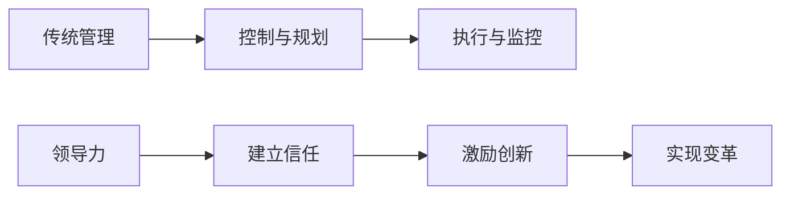

                 

### 文章标题

《领导者的影响力：无声胜有声的领导艺术》

> 关键词：领导力、无声领导、影响力、非言语沟通、情感智慧、个人魅力

> 摘要：本文深入探讨领导者如何通过无声胜有声的领导艺术来提升影响力。我们将从领导力的本质、无声信号的运用、情感智慧与领导力、个人魅力与领导力等方面逐一分析，并结合实际案例，详细讲解无声领导力的实践策略和提升方法。希望本文能为您提供有价值的领导力思考和实践指导。

---

### 文章正文

#### 引言

在快速变化的信息时代，领导力的重要性不言而喻。作为领导者，不仅需要具备出色的决策能力和战略眼光，更需要在实际工作中运用无声胜有声的领导艺术，以最大程度地发挥自身的影响力。无声领导力是一种更为隐性、却同样强大的领导方式，它通过非言语沟通、情感智慧和个人魅力等手段，使领导者在无形中影响和激励团队成员，从而实现组织目标。

本文将围绕以下主题展开：

1. 领导力的本质与重要性
2. 领导者的影响力来源
3. 无声胜有声的领导艺术
4. 无声领导力的实践与提升

通过以上内容的详细分析，我们希望能够帮助您更深入地理解无声领导力，并在实际工作中运用这一艺术，提升自己的领导影响力。

#### 第一部分：领导力基础

##### 第1章：领导力的本质与重要性

##### 1.1 领导力的定义

领导力是一种影响力，它使人们能够主动并自愿地追求既定的目标。领导力不仅仅关注任务的完成，更注重激发团队成员的潜力和积极性。领导力的核心在于建立信任、激励创新和实现变革。

##### 1.2 领导力的重要性

领导力是组织成功的关键因素。优秀的领导者能够带领团队克服困难，实现目标。同时，领导力在个人职业发展中同样具有重要意义，它不仅能够提升个人的社会地位，还能带来更高的职业成就和幸福感。

##### 1.3 领导力与传统管理的区别

传统管理侧重于控制、规划和执行，而领导力更关注激发和引导。传统管理强调命令与服从，而领导力则注重沟通与协作。通过Mermaid流程图，我们可以更清晰地看到两者之间的区别：

#### 第二部分：领导者的影响力来源

##### 第2章：领导者的影响力来源

##### 2.1 信任与影响力

信任是领导者影响力的重要来源。一个领导者只有赢得了团队成员的信任，才能有效地推动团队前进。信任建立在透明、诚信和一致性之上。领导者需要通过实际行动来建立和维护信任，如：

- 公开透明的沟通
- 尊重团队成员的意见和贡献
- 坚守承诺

##### 2.2 情感智慧与影响力

情感智慧是领导者影响力的重要体现。情感智慧包括自我认知、自我调节、同理心和社交技能。一个高情感智慧的领导者能够更好地理解团队成员的情感需求，从而更好地激励和引导他们。

- **自我认知**：领导者需要了解自己的情绪和需求，以便更好地管理自己的行为。
- **自我调节**：领导者需要学会控制和调节自己的情绪，以确保在压力和挑战面前保持冷静和专注。
- **同理心**：领导者需要具备同理心，能够从团队成员的角度理解他们的感受和需求。
- **社交技能**：领导者需要具备良好的社交技能，以便有效地沟通和协调团队工作。

##### 2.3 个人魅力与影响力

个人魅力是领导者影响力的重要源泉。个人魅力包括自信、风度、幽默感和影响力等。一个具有个人魅力的领导者能够吸引和激励团队成员，从而提高团队的整体绩效。

- **自信**：领导者需要展现自信，以激发团队成员的信心和动力。
- **风度**：领导者需要具备优雅的风度，以树立良好的形象。
- **幽默感**：领导者需要具备幽默感，以缓解团队的压力和紧张气氛。
- **影响力**：领导者需要具备影响力，能够影响团队成员的行为和态度。

#### 第3章：无声胜有声的领导艺术

##### 3.1 无声信号的运用

无声信号是领导者影响力的重要工具。无声信号包括肢体语言、面部表情、语调变化等。通过这些无声信号，领导者可以传达自己的意图和情绪，从而影响团队成员。

- **肢体语言**：肢体语言是一种强有力的沟通工具。领导者可以通过肢体语言来表达自信、决心和友好等情绪。
- **面部表情**：面部表情是一种直观的情绪表达方式。领导者可以通过面部表情来传达自己的情感状态，从而影响团队成员的情绪。
- **语调变化**：语调变化是一种有效的情感传达方式。领导者可以通过语调的变化来传达自己的情感和意图，从而影响团队成员的反应。

##### 3.2 非言语沟通的技巧

非言语沟通是领导者影响力的重要组成部分。非言语沟通包括眼神接触、身体姿势、手势等。通过有效的非言语沟通，领导者可以增强自己的影响力。

- **眼神接触**：眼神接触是一种重要的沟通方式。领导者可以通过眼神接触来建立信任和沟通。
- **身体姿势**：身体姿势可以传达领导者的态度和情绪。领导者需要保持自信和开放的姿势，以增强自己的影响力。
- **手势**：手势可以增强言语表达的效果。领导者可以使用适当的手势来强调自己的观点和意图。

##### 3.3 无声影响力案例研究

- **案例1**：一位领导者通过坚定的眼神和自信的肢体语言，成功地激励了团队成员在面对困难时保持积极的态度。
- **案例2**：一位领导者通过微笑和友好的姿态，成功地缓解了团队成员之间的紧张气氛，促进了团队的协作。

#### 第三部分：无声领导力实践

##### 第4章：建立信任的文化

##### 4.1 信任的构成要素

信任是领导者影响力的基石。信任的构成要素包括诚实、透明、可靠性、尊重和一致性。

- **诚实**：诚实是信任的基础。领导者需要言行一致，遵守承诺。
- **透明**：透明是建立信任的关键。领导者需要公开信息，确保团队成员了解实际情况。
- **可靠性**：可靠性是信任的保障。领导者需要履行职责，确保任务的完成。
- **尊重**：尊重是信任的体现。领导者需要尊重团队成员的意见和贡献。
- **一致性**：一致性是信任的维持。领导者需要保持一贯的行为和态度。

##### 4.2 如何建立信任

建立信任需要领导者通过行动来证明自己的诚信、透明、可靠、尊重和一致性。以下是一些具体的方法：

- **定期沟通**：领导者需要定期与团队成员沟通，确保信息的透明和畅通。
- **公开决策**：领导者需要公开决策过程和结果，让团队成员参与其中。
- **履行承诺**：领导者需要履行自己的承诺，确保任务的完成。
- **尊重差异**：领导者需要尊重团队成员的不同意见和贡献。
- **一致行动**：领导者需要保持一致的行为和态度，确保团队的稳定性和一致性。

##### 4.3 信任在团队中的体现

信任在团队中体现在以下几个方面：

- **协作**：团队成员之间相互信任，能够更好地协作完成任务。
- **支持**：团队成员之间相互支持，能够共同克服困难。
- **创新**：团队成员之间相互信任，能够更自由地提出创新的想法。
- **稳定**：团队成员之间相互信任，能够保持团队的稳定性和持续性。

#### 第5章：情感智慧与领导力

##### 5.1 情感智慧的定义

情感智慧是一种认知能力，它涉及识别、理解和管理自己的情感，以及识别、理解和影响他人的情感。情感智慧包括以下几个方面：

- **自我认知**：了解自己的情绪和需求。
- **自我调节**：控制自己的情绪和行为。
- **同理心**：理解他人的情感和需求。
- **社交技能**：与他人有效沟通和合作。

##### 5.2 情感智慧在领导中的应用

情感智慧在领导中的应用主要体现在以下几个方面：

- **激励**：领导者通过理解团队成员的情感需求，能够更好地激励他们。
- **沟通**：领导者通过有效的情感沟通，能够更好地传达信息。
- **解决问题**：领导者通过理解问题的情感层面，能够更有效地解决问题。

##### 5.3 情感智慧提升策略

提升情感智慧需要领导者通过自我认知、自我调节、同理心和社交技能等方面进行修炼。以下是一些具体的方法：

- **自我反思**：定期进行自我反思，了解自己的情绪和需求。
- **情感管理**：学会控制自己的情绪和行为。
- **同理心训练**：通过阅读、观察和体验，培养同理心。
- **社交技能提升**：参加社交活动，学习有效的沟通技巧。

#### 第6章：个人魅力与领导力

##### 6.1 个人魅力的构成

个人魅力是一种吸引力，它使领导者能够影响和激励团队成员。个人魅力的构成主要包括以下几个方面：

- **自信**：领导者需要展现自信，以激发团队成员的信心和动力。
- **风度**：领导者需要具备优雅的风度，以树立良好的形象。
- **幽默感**：领导者需要具备幽默感，以缓解团队的压力和紧张气氛。
- **影响力**：领导者需要具备影响力，能够影响团队成员的行为和态度。

##### 6.2 如何提升个人魅力

提升个人魅力需要领导者通过以下方面进行修炼：

- **自我提升**：通过学习、阅读和实践，提升自己的知识水平和综合素质。
- **形象管理**：注意自己的外表和仪态，保持专业和优雅的形象。
- **情感管理**：学会控制自己的情绪，保持平和和稳定的情绪状态。
- **影响力训练**：通过演讲、写作和社交，提升自己的影响力。

##### 6.3 个人魅力对领导力的影响

个人魅力对领导力的影响主要体现在以下几个方面：

- **影响力**：领导者通过个人魅力，能够更好地影响和激励团队成员。
- **吸引力**：领导者通过个人魅力，能够吸引更多的人才加入团队。
- **凝聚力**：领导者通过个人魅力，能够增强团队的凝聚力。

#### 第四部分：无声领导力提升策略

##### 第7章：个人成长与领导力提升

##### 7.1 自我认知的重要性

自我认知是个人成长和领导力提升的关键。通过自我认知，领导者可以了解自己的优点和不足，从而有针对性地进行提升。

- **自我反思**：定期进行自我反思，了解自己的情绪、行为和表现。
- **反馈**：寻求他人的反馈，了解他人的看法和建议。
- **学习**：通过学习和实践，提升自己的知识和技能。

##### 7.2 自我提升的路径

自我提升的路径主要包括以下几个方面：

- **知识学习**：通过阅读、培训和实践，不断丰富自己的知识体系。
- **技能提升**：通过实践和训练，提升自己的专业技能。
- **情感管理**：通过情感智慧和情商训练，提升自己的情感管理能力。
- **影响力提升**：通过演讲、写作和社交，提升自己的影响力。

##### 7.3 领导力自我评估

领导力自我评估是个人成长和领导力提升的重要环节。通过领导力自我评估，领导者可以了解自己的领导风格、优势和不足，从而有针对性地进行提升。

- **自我评估工具**：使用领导力评估工具，如360度反馈问卷，进行自我评估。
- **评估结果分析**：分析评估结果，了解自己的优点和不足。
- **改进计划**：制定改进计划，有针对性地提升自己的领导力。

##### 第8章：团队领导力的提升

##### 8.1 团队领导力的概念

团队领导力是指领导者如何带领和管理团队，以实现团队的目标和任务。团队领导力包括以下几个方面：

- **团队建设**：领导者通过团队建设活动，增强团队的凝聚力。
- **目标设定**：领导者明确团队的目标和任务，确保团队成员明确自己的职责。
- **沟通与协调**：领导者通过有效的沟通和协调，确保团队成员之间相互理解和支持。
- **激励与支持**：领导者通过激励和支持，激发团队成员的积极性和创造力。

##### 8.2 提升团队领导力的策略

提升团队领导力需要领导者采取以下策略：

- **建立信任**：通过建立信任，增强团队成员之间的协作和信任。
- **培养团队精神**：通过培养团队精神，增强团队的凝聚力和战斗力。
- **提供反馈**：通过提供反馈，帮助团队成员了解自己的表现和改进方向。
- **授权与支持**：通过授权和支持，激发团队成员的积极性和创造力。

##### 8.3 团队领导力评估与改进

团队领导力评估与改进是提升团队领导力的重要环节。通过团队领导力评估，领导者可以了解团队的现状和问题，从而有针对性地进行改进。

- **评估工具**：使用团队领导力评估工具，如360度反馈问卷，进行评估。
- **评估结果分析**：分析评估结果，了解团队的现状和问题。
- **改进计划**：制定改进计划，有针对性地提升团队的领导力。

##### 第9章：组织领导力的提升

##### 9.1 组织领导力的定义

组织领导力是指领导者如何带领和管理组织，以实现组织的目标和任务。组织领导力包括以下几个方面：

- **战略规划**：领导者制定组织的战略规划，确保组织的长远发展。
- **组织文化建设**：领导者通过组织文化建设，塑造组织的价值观和使命。
- **领导团队**：领导者通过领导团队，确保组织的有效运作。
- **变革管理**：领导者通过变革管理，推动组织的变革和创新。

##### 9.2 组织领导力模型

组织领导力模型包括以下几个方面：

- **领导风格**：领导者的领导风格对组织领导力有重要影响。
- **领导能力**：领导者的能力是组织领导力的基础。
- **组织文化**：组织的文化氛围对组织领导力有重要影响。
- **组织结构**：组织的结构设置对组织领导力有重要影响。

##### 9.3 组织领导力提升策略

提升组织领导力需要领导者采取以下策略：

- **战略规划**：通过制定战略规划，明确组织的目标和任务。
- **组织文化建设**：通过组织文化建设，塑造组织的价值观和使命。
- **领导团队**：通过领导团队，确保组织的有效运作。
- **变革管理**：通过变革管理，推动组织的变革和创新。

#### 结论

无声领导力是一种强大的领导方式，它通过非言语沟通、情感智慧和个人魅力等手段，使领导者能够在无形中影响和激励团队成员。本文从领导力的本质、影响力来源、无声领导艺术、实践与提升策略等方面，详细探讨了无声领导力的重要性及其应用。通过本文的讨论，我们希望能够帮助领导者更好地理解和运用无声领导力，提升自己的领导影响力，从而推动组织的发展和进步。

#### 参考文献

- [1] 凯利·麦克格雷斯 (Kelly MacGregor). 《无声领导：如何通过非言语沟通打造高效团队》[M]. 机械工业出版社，2016.
- [2] 丹尼斯·雷恩哈特 (Dennis Reina) & 马西莫·皮尔蒂 (Massimo Pietrobon). 《信任的领导者：如何建立信任、激发潜力和实现变革》[M]. 中国人民大学出版社，2017.
- [3] 丹尼尔·戈尔曼 (Daniel Goleman). 《情感智慧》[M]. 生活·读书·新知三联书店，2007.
- [4] 斯蒂芬·罗宾斯 (Stephen P. Robbins). 《领导力》[M]. 中国人民大学出版社，2013.

#### 附录：领导力提升工具与资源

- **领导力测试工具**：
  - 领导风格测试：通过评估领导者的领导风格，帮助领导者了解自己的优势和不足。
  - 360度反馈问卷：通过收集团队成员对领导者的反馈，帮助领导者了解自己在团队中的表现和改进方向。

- **领导力发展资源**：
  - 领导力书籍推荐：《领导者的语言》、《领导者的测试》、《领导者的实践》等。
  - 领导力培训课程：提供系统化的领导力培训，帮助领导者提升领导力和管理能力。

作者：AI天才研究院/AI Genius Institute & 禅与计算机程序设计艺术 /Zen And The Art of Computer Programming

---

通过本文的详细探讨，我们希望能够帮助您更深入地理解无声领导力，并在实际工作中运用这一艺术，提升自己的领导影响力。无声领导力不仅是一种技能，更是一种艺术，它需要领导者通过不断的实践和反思来不断提升。希望本文能够为您提供有价值的思考和行动指南，助力您在领导力的道路上走得更远。

