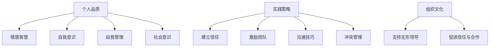

                 

## 文章标题：领导者的影响力：无形中的领导艺术

> 关键词：领导力、无形领导、个人品质、组织文化、发展提升

在信息技术飞速发展的今天，领导力的作用愈发凸显。一个有效的领导者不仅需要具备出色的技术和管理能力，还需要掌握无形中的领导艺术。本文将深入探讨领导者的影响力，特别是那些看不见、摸不着的领导力因素，如何在实际工作中发挥作用。

### 摘要

本文旨在揭示领导者如何通过无形中的领导艺术来影响他人，实现有效领导。文章首先介绍了领导力的本质和类型，然后探讨了无形领导力的核心概念与联系，以及其在个人品质、实践策略和组织中的应用。接着，文章关注领导力的发展与提升，最后总结无形领导力的未来挑战与机遇，为领导者提供实用的指导和建议。

### 第1章 引言：理解无形领导力

领导力，简而言之，是指影响和激励他人一起实现共同目标的能力。它不仅仅是管理职位的人的特权，而是每个人在工作和生活中都可能需要的能力。领导力的类型多种多样，有权力型、任务型、关系型等。而无形领导力，则是一种通过非直接方式来影响他人、实现领导目标的领导艺术。

无形领导力之所以重要，是因为它在现代社会中具有独特的优势。首先，无形领导力能够建立起深厚的人际关系网络，这对于团队合作和创新至关重要。其次，无形领导力能够激发员工的内在动力，提高工作满意度和绩效。最后，无形领导力有助于构建积极的组织文化，增强组织的凝聚力和竞争力。

在当今信息时代，领导者面临的挑战日益复杂。技术变革、市场变化、员工多样性等问题，都要求领导者具备更高的领导艺术。无形领导力正是应对这些挑战的关键所在，它不仅能够帮助领导者更好地应对外部环境的变化，还能够提升内部团队的协作和创新能力。

### 第2章 核心概念与联系

无形领导力的核心概念包括个人品质、实践策略和组织文化。这些概念相互联系，共同构成了无形领导力的框架。

首先，个人品质是无形领导力的基础。一个优秀的领导者需要具备一系列的品质，如情感智慧、自我意识、自我管理、社会意识等。这些品质不仅决定了领导者的行为方式，还影响了其与团队成员的关系。

其次，实践策略是无形领导力的具体应用。领导者需要通过建立信任、激励团队、沟通技巧、冲突管理等方式来实践无形领导力。这些策略在不同的情境下可能会有所不同，但核心目标是一致的，即实现团队的高效协作和创新。

最后，组织文化是无形领导力的外部环境。一个积极向上的组织文化能够支持无形领导力的发挥，促进团队成员之间的信任和合作。相反，一个消极的组织文化可能会阻碍无形领导力的实现。

以下是一个核心概念与联系的Mermaid流程图：



### 第3章 无形领导艺术：个人品质

个人品质是无形领导力的基石。一个领导者如果没有良好的个人品质，就难以赢得团队成员的信任和支持。以下将详细探讨情感智慧、自我意识、自我管理、社会意识和创造力这五个关键品质。

#### 3.1 情感智慧

情感智慧是指领导者识别、理解和管理自己及他人情绪的能力。它包括自我情感管理、同理心、情感交流和情绪调节等。一个具备高情感智慧的领导者能够更好地理解团队成员的情绪和需求，从而更好地激励和引导团队。

**伪代码示例：**

```python
def emotional_intelligence(self):
    # 理解和管理自己情绪
    self.control_emojis()
    # 理解和同理他人情绪
    self.empathize_colleagues()
    # 有效沟通和表达情绪
    self communicate_emotions()
```

#### 3.2 自我意识

自我意识是指领导者对自己的认知，包括自己的优点、缺点、价值观和信念。一个具备高自我意识的领导者能够更好地认识自己的行为和决策对团队成员的影响，从而做出更明智的决策。

**伪代码示例：**

```python
def self_awareness(self):
    # 识别自己的优点和缺点
    self.identify_strengths_and_weaknesses()
    # 理解自己的价值观和信念
    self.understand_values_and_beliefs()
```

#### 3.3 自我管理

自我管理是指领导者控制自己的行为和情绪，以达到更好的工作效果。它包括时间管理、目标设定、压力管理和自我激励等。

**伪代码示例：**

```python
def self_management(self):
    # 时间管理和目标设定
    self.time_management_and_goal_setting()
    # 压力管理和自我激励
    self.stress_management_and_motivation()
```

#### 3.4 社会意识

社会意识是指领导者对周围社会环境和社会关系的认知。一个具备高社会意识的领导者能够更好地理解社会趋势、文化差异和团队成员的社会背景，从而更有效地领导团队。

**伪代码示例：**

```python
def social_awareness(self):
    # 理解社会趋势和文化差异
    self.understand_social_trends_and_cultural_differences()
    # 维护良好的人际关系
    self维持良好人际关系()
```

#### 3.5 创造力

创造力是指领导者产生新想法、新方法和新解决方案的能力。在创新驱动的社会中，创造力成为领导者不可或缺的品质。一个具备高创造力的领导者能够推动团队不断进步，保持竞争优势。

**伪代码示例：**

```python
def creativity(self):
    # 发掘新想法和新方法
    self.discover_new_ideas_and_methods()
    # 推动创新实践
    self.promote_innovation_practice()
```

### 第4章 无形领导艺术：实践策略

无形领导艺术的具体实践策略包括建立信任、激励团队、沟通技巧、跨文化领导和冲突管理。以下将详细探讨这些策略及其在实践中的应用。

#### 4.1 建立信任

建立信任是无形领导力的核心。一个领导者需要通过透明沟通、诚实和一致的行为来建立信任。以下是一个建立信任的策略示例：

**伪代码示例：**

```python
def build_trust(self):
    # 透明沟通
    self.clear_communication()
    # 诚实和一致
    self.honesty_and_consistency()
```

#### 4.2 激励团队

激励团队是领导者的重要任务。一个领导者需要了解团队成员的需求，并通过认可、奖励和挑战来激励团队。以下是一个激励团队的策略示例：

**伪代码示例：**

```python
def motivate_team(self):
    # 了解团队成员需求
    self.understand_team_members_needs()
    # 认可和奖励
    self.recognition_and_reward()
    # 挑战和成长机会
    self.challenges_and_growth_opportunities()
```

#### 4.3 沟通技巧

有效的沟通技巧是无形领导力的重要组成部分。一个领导者需要通过倾听、表达和反馈来提升沟通效果。以下是一个沟通技巧的示例：

**伪代码示例：**

```python
def communication_skills(self):
    # 倾听
    self.active_listening()
    # 表达
    self.clear_expression()
    # 反馈
    self.provide_feedback()
```

#### 4.4 跨文化领导

在全球化背景下，跨文化领导变得尤为重要。一个领导者需要了解不同文化的差异，并通过尊重、包容和适应来领导多元文化团队。以下是一个跨文化领导的策略示例：

**伪代码示例：**

```python
def cross-cultural_leadership(self):
    # 了解文化差异
    self.understand_cultural_differences()
    # 尊重和包容
    self.respect_and_inclusiveness()
    # 适应和调整
    self.adaptation_and_adjustment()
```

#### 4.5 冲突管理

冲突是任何团队都不可避免的现象。一个领导者需要通过理解、解决和预防来管理冲突。以下是一个冲突管理的策略示例：

**伪代码示例：**

```python
def conflict_management(self):
    # 理解冲突原因
    self.understand_conflict_reasons()
    # 解决冲突
    self.resolve_conflicts()
    # 预防冲突
    self.prevent_conflicts()
```

### 第5章 无形领导艺术在组织中的应用

无形领导艺术不仅适用于个人，更能在组织中发挥巨大作用。以下将探讨无形领导力在组织文化、组织变革、危机管理和跨国团队管理中的应用。

#### 5.1 无形领导力与组织文化

组织文化是组织的灵魂，无形领导力对组织文化的影响至关重要。一个领导者需要通过价值观的传递、文化仪式的建立和维护来塑造积极的组织文化。以下是一个组织文化的策略示例：

**伪代码示例：**

```python
def organizational_culture(self):
    # 传递核心价值观
    self.disseminate_core_values()
    # 建立文化仪式
    self.create_cultural_rituals()
    # 维护和更新文化
    self.maintain_and_update_culture()
```

#### 5.2 领导者在组织变革中的作用

组织变革是企业发展的重要环节，领导者在这一过程中扮演着关键角色。一个领导者需要通过愿景的传递、员工的参与和变革的推动来实现组织变革。以下是一个组织变革的策略示例：

**伪代码示例：**

```python
def organizational_change(self):
    # 传递变革愿景
    self communicate_change_vision()
    # 员工参与
    self.engage_employees()
    # 推动变革
    self.drive_change()
```

#### 5.3 领导力在危机管理中的应用

危机管理是领导者必须面对的挑战之一。一个领导者需要通过冷静分析、快速决策和有效沟通来应对危机。以下是一个危机管理的策略示例：

**伪代码示例：**

```python
def crisis_management(self):
    # 冷静分析
    self.cal

