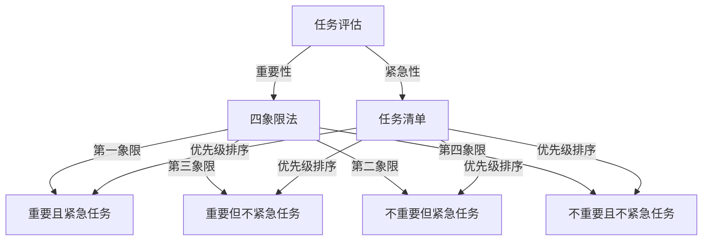

                 


## 引言

在快速变化和高度竞争的IT行业，领导者面临的时间压力前所未有。有效的时间管理不仅对个人的职业发展至关重要，也是团队和项目成功的基石。然而，传统的紧急事务处理方法往往导致领导者陷入忙碌而未实现关键目标的困境。本文旨在探讨领导者如何通过聚焦于重要而非紧急事务，实现高效的时间管理。

### 时间管理的重要性

时间管理是现代领导者的一项关键技能。它能帮助领导者优先处理最重要的任务，减少不必要的干扰，从而提升工作效率和决策质量。时间管理的核心在于明确任务的重要性与紧急性，并在此基础上进行有效的优先级排序。

### 重要与非紧急事务的平衡

领导者常常面临紧急事务的诱惑，这些事务往往需要即时的关注和处理。然而，专注于重要但非紧急事务才是实现长远目标和战略规划的关键。例如，培养团队成员、创新研发和长期战略规划都是重要但非紧急的事务。

### 本文结构

本文将逐步分析领导者时间管理的挑战，定义关键概念，并通过实际案例和最佳实践，展示如何将时间管理的原则应用于实际工作。具体结构如下：

1. **时间管理的基本概念**：介绍时间管理的基本原理，包括任务的重要性和紧急性评估方法。
2. **领导者时间管理的策略**：探讨如何识别重要事务，制定优先级策略，以及如何避免陷入紧急事务的陷阱。
3. **核心概念与联系**：使用Mermaid流程图展示时间管理的关键概念及其相互关系。
4. **核心算法原理讲解**：使用伪代码详细阐述如何设计有效的任务优先级算法。
5. **数学模型和公式**：介绍用于时间管理的数学模型，并通过公式和举例说明其应用。
6. **项目实战**：介绍一个实际案例，详细解析如何应用时间管理原则进行项目开发。
7. **最佳实践 tips**：总结实用的最佳实践，提供时间管理的小技巧和建议。
8. **小结与拓展阅读**：回顾文章核心内容，提出注意事项，并提供拓展阅读建议。

通过上述结构的逐步分析，我们将深入探讨领导者如何在纷繁复杂的工作环境中，通过有效的时间管理实现个人和团队的卓越表现。

## 关键词

- 时间管理
- 领导者
- 重要事务
- 紧急事务
- 任务优先级
- Mermaid流程图
- 伪代码
- 数学模型

## 摘要

本文探讨了领导者如何通过聚焦重要而非紧急事务，实现高效的时间管理。文章首先介绍了时间管理的基本概念，包括任务的重要性和紧急性评估方法。接着，探讨了领导者如何识别重要事务，制定优先级策略，并避免陷入紧急事务的陷阱。通过Mermaid流程图和伪代码，详细展示了时间管理的关键概念及其应用方法。此外，文章通过实际案例和最佳实践，展示了如何将时间管理原则应用于实际工作。最后，文章总结了最佳实践，并提供了拓展阅读建议，帮助领导者提升时间管理能力。

## 时间管理的基本概念

时间管理是现代领导者的一项核心技能，对于提高个人和团队的工作效率至关重要。有效的时间管理不仅有助于领导者更好地处理日常事务，还能确保他们有足够的时间和精力去关注战略规划和长期目标。

### 任务的重要性和紧急性

在时间管理中，任务的重要性和紧急性是两个关键维度。**重要性**指的是任务对实现目标或完成项目的重要性程度；**紧急性**则是指任务需要完成的紧迫程度。

- **重要且紧急**：这类任务通常需要立即处理，如紧急会议或突发事件。虽然这类任务经常占用领导者的时间，但它们并不总是最值得优先处理的任务。
- **重要但不紧急**：这类任务往往涉及长期规划、战略制定和个人发展，如团队培训、市场调研等。领导者如果忽视这类任务，可能会在未来面临更大的问题。
- **不重要但紧急**：这类任务通常涉及次要问题，但需要立即处理，如回复电子邮件或处理日常事务。虽然处理这类任务可以避免短期的麻烦，但它们并不会对长期目标产生重大影响。
- **不重要且不紧急**：这类任务通常对个人或团队的目标没有直接影响，如浏览社交媒体或处理无关紧要的事务。领导者应尽量避免这类任务，以减少时间浪费。

### 评估方法

为了有效管理时间，领导者需要掌握评估任务重要性和紧急性的方法。以下是一些常用的评估方法：

1. **四象限法**：这种方法将任务分为四个象限，每个象限代表不同的重要性和紧急性组合。通过这种方法，领导者可以明确哪些任务需要优先处理。
2. **关键绩效指标（KPI）**：领导者可以根据组织的KPI来评估任务的重要性。例如，如果一个项目的完成情况是KPI的一部分，那么该项目就是重要任务。
3. **优先级矩阵**：这种方法通过给任务打分，并根据得分来确定优先级。任务得分越高，优先级越高。

### 时间管理工具

为了更有效地管理时间，领导者可以使用各种工具和技巧：

- **任务清单**：列出所有任务，并按重要性和紧急性进行排序。
- **时间块**：将时间划分为不同的块，每个块专注于一项任务。
- **日程安排**：合理规划每一天的时间，确保所有重要任务都有时间处理。
- **自动化工具**：利用自动化工具处理重复性任务，如电子邮件过滤器、日程安排应用程序等。

### 综述

时间管理是一个动态过程，领导者需要不断评估和调整任务的重要性和紧急性。通过有效的任务评估方法和时间管理工具，领导者可以更好地聚焦于重要事务，避免陷入紧急事务的陷阱，从而提高工作效率和实现长期目标。

## 领导者时间管理的策略

在掌握了时间管理的基本概念后，领导者需要进一步了解如何识别重要事务，制定优先级策略，并避免陷入紧急事务的陷阱。以下是一些具体的方法和技巧，可以帮助领导者更好地管理时间。

### 识别重要事务

1. **目标导向**：领导者应将组织的目标作为识别重要事务的出发点。任何与实现组织目标相关的事务都是重要的。例如，如果组织的目标是提高市场份额，那么市场调研、客户反馈分析等活动就是重要的。
2. **关键绩效指标（KPI）**：领导者可以根据组织的KPI来识别重要事务。例如，如果某个项目的完成情况是KPI的一部分，那么该项目就是重要事务。
3. **优先级矩阵**：通过优先级矩阵，领导者可以更清晰地识别重要事务。这种方法将任务分为四个象限，领导者应优先处理位于第一象限（重要且紧急）和第三象限（重要但不紧急）的任务。

### 制定优先级策略

1. **四象限法**：四象限法是一种常用的优先级策略。通过这种方法，领导者可以将任务分为四个象限，并按照以下顺序处理任务：
   - **第一象限（重要且紧急）**：优先处理这些任务，因为它们既重要又紧急，如紧急会议、突发事件等。
   - **第三象限（重要但不紧急）**：虽然这些任务不紧急，但如果不处理，可能会导致长期问题，如团队培训、市场调研等。领导者应定期处理这些任务。
   - **第二象限（不重要但紧急）**：领导者应尽量避免这些任务，因为它们虽然紧急但不重要，如回复不重要的电子邮件、处理日常琐事等。
   - **第四象限（不重要且不紧急）**：领导者应尽量避免这些任务，因为它们既不重要也不紧急，如浏览社交媒体、处理无关紧要的事务等。

2. **任务清单**：领导者应使用任务清单来记录和管理所有任务。任务清单应按照重要性和紧急性进行排序，并明确每个任务的优先级。

3. **时间块**：领导者可以将时间划分为不同的块，每个块专注于一项任务。这种方法有助于避免分心，提高任务完成的效率。

### 避免陷入紧急事务的陷阱

1. **设定边界**：领导者应明确工作与个人生活的边界。通过设定工作时间，避免工作侵占个人时间，领导者可以更好地管理自己的时间。
2. **委托任务**：领导者应学会委托任务，将一些非重要且紧急的任务交给合适的团队成员。这样可以减轻领导者的负担，让他们有更多时间处理重要任务。
3. **优先处理重要任务**：领导者应优先处理重要任务，而不是被紧急事务拖累。通过合理安排时间，领导者可以确保重要任务得到及时处理。

### 工具和方法

1. **日程安排**：领导者可以使用日程安排应用程序来规划和管理时间。这些应用程序可以帮助领导者合理安排时间，避免错过重要会议和任务。
2. **提醒功能**：领导者可以使用提醒功能来提醒自己处理重要任务。例如，设置提醒通知自己参加重要的会议或完成重要任务。
3. **自动化工具**：领导者可以利用自动化工具处理重复性任务，如电子邮件过滤器、日程安排应用程序等。这样可以节省时间，提高工作效率。

### 综述

领导者通过识别重要事务、制定优先级策略和避免陷入紧急事务的陷阱，可以更好地管理时间，提高工作效率和实现组织目标。有效的时间管理不仅有助于个人职业发展，还能为团队和组织的成功奠定基础。

## 核心概念与联系

在领导者时间管理的框架中，理解核心概念之间的相互关系至关重要。以下是时间管理中几个关键概念及其关系的Mermaid流程图表示：



### 解释流程图

1. **任务评估**：任务评估是时间管理的起点。通过评估任务的重要性和紧急性，领导者可以明确每个任务的位置。
2. **四象限法**：四象限法将任务分为四个象限，根据任务的重要性和紧急性进行分类。这种方法帮助领导者明确哪些任务需要优先处理。
3. **任务清单**：任务清单是记录和管理任务的工具。通过任务清单，领导者可以清晰地看到所有任务，并根据四象限法进行优先级排序。
4. **重要且紧急任务（D）**：这些任务需要立即处理，因为它们既重要又紧急，如紧急会议或突发事件。
5. **重要但不紧急任务（E）**：这些任务虽然不紧急，但如果不处理，可能会导致长期问题。领导者应定期处理这些任务。
6. **不重要但紧急任务（F）**：这些任务虽然紧急，但不重要。领导者应尽量避免这些任务，因为它们可能会占用宝贵的时间。
7. **不重要且不紧急任务（G）**：这些任务既不重要也不紧急，领导者应尽量避免处理，以减少时间浪费。

通过这个Mermaid流程图，领导者可以更直观地理解时间管理中的核心概念及其相互关系，从而更有效地管理时间和资源。

## 核心算法原理讲解

在时间管理中，设计一个有效的任务优先级算法是确保领导者能够高效处理任务的关键。以下是一个使用伪代码详细阐述的任务优先级算法。

### 算法目标

该算法的目标是依据任务的重要性和紧急性，对任务进行排序，以便领导者可以优先处理最重要的任务。

### 算法步骤

1. **初始化**：创建一个任务列表，每个任务包含三个属性：重要性、紧急性和任务名称。
2. **输入任务**：将任务添加到任务列表中，每个任务都包含其重要性和紧急性的评分。
3. **任务排序**：使用一个基于分数的排序算法（例如快速排序或冒泡排序）对任务列表进行排序。排序依据是任务的紧急性和重要性。
4. **输出排序结果**：按照排序后的顺序处理任务。

### 伪代码

```python
Algorithm TaskPriorityQueueing(tasks):
    Input: tasks - a list of tasks with attributes importance, urgency, and name
    Output: A sorted list of tasks based on their urgency and importance

    // Step 1: Initialize an empty task queue
    task_queue = []

    // Step 2: Input tasks into the queue
    for task in tasks:
        Append task to task_queue

    // Step 3: Sort tasks by urgency and importance
    // Use a sorting algorithm like quicksort or mergesort
    sorted_task_queue = SortByUrgencyAndImportance(task_queue)

    // Step 4: Output the sorted task list
    Return sorted_task_queue

Function SortByUrgencyAndImportance(tasks):
    if tasks.length <= 1:
        Return tasks
    
    // Select a pivot element
    pivot = tasks[len(tasks) // 2]

    // Partition tasks into three lists based on their urgency and importance
    left = [task for task in tasks if task.urgency < pivot.urgency]
    middle = [task for task in tasks if task.urgency == pivot.urgency]
    right = [task for task in tasks if task.urgency > pivot.urgency]

    // Recursively sort left and right
    left = SortByUrgencyAndImportance(left)
    right = SortByUrgencyAndImportance(right)

    // Concatenate the results
    Return left + middle + right
```

### 原理解释

1. **初始化**：创建一个任务队列，用于存储所有任务。
2. **输入任务**：将任务添加到队列中。每个任务包含其重要性和紧急性的评分。
3. **任务排序**：使用快速排序算法对任务队列进行排序。排序依据是任务的紧急性和重要性。紧急性较高的任务排在前面，紧急性相同的任务则依据重要性排序。
4. **输出排序结果**：输出排序后的任务列表，按照排序后的顺序处理任务。

通过这个任务优先级算法，领导者可以确保在有限的时间内优先处理最重要的任务，从而提高工作效率和实现组织目标。

## 数学模型和公式

在时间管理中，数学模型和公式可以帮助领导者更科学地评估任务的重要性和紧急性，从而制定更有效的决策。以下介绍几个常用的数学模型和公式。

### 期望价值模型

期望价值模型是一种常用的决策工具，可以帮助领导者评估每个任务的总体价值。公式如下：

$$
E(V) = \sum_{i=1}^{n} p_i \cdot V_i
$$

其中，\( E(V) \) 表示期望价值，\( p_i \) 表示第 \( i \) 个任务发生的概率，\( V_i \) 表示第 \( i \) 个任务的价值。

### 加权平均模型

加权平均模型通过考虑任务的重要性和紧急性，对任务进行加权处理，以确定优先级。公式如下：

$$
W(A) = \sum_{i=1}^{n} w_i \cdot A_i
$$

其中，\( W(A) \) 表示加权平均值，\( w_i \) 表示第 \( i \) 个任务的权重（重要性或紧急性），\( A_i \) 表示第 \( i \) 个任务的评估值。

### 四象限模型

四象限模型是时间管理中常用的方法，将任务分为四个象限，每个象限具有不同的优先级。公式如下：

$$
\text{四象限} = \left\{
    \begin{array}{ll}
        \text{第一象限} & \text{重要性} \times \text{紧急性} = \text{高} \\
        \text{第二象限} & \text{重要性} \times \text{紧急性} = \text{中} \\
        \text{第三象限} & \text{重要性} \times \text{紧急性} = \text{低} \\
        \text{第四象限} & \text{重要性} \times \text{紧急性} = \text{无}
    \end{array}
\right.
$$

### 解释和举例

1. **期望价值模型**：假设有一个任务列表，包含三个任务，每个任务的发生概率和潜在价值如下表所示：

| 任务编号 | 概率 \( p_i \) | 价值 \( V_i \) |
| --- | --- | --- |
| 1 | 0.3 | 100 |
| 2 | 0.5 | 200 |
| 3 | 0.2 | 300 |

根据期望价值模型，期望价值计算如下：

$$
E(V) = 0.3 \cdot 100 + 0.5 \cdot 200 + 0.2 \cdot 300 = 30 + 100 + 60 = 190
$$

因此，总期望价值为 190。

2. **加权平均模型**：假设有四个任务，每个任务的权重和评估值如下表所示：

| 任务编号 | 权重 \( w_i \) | 评估值 \( A_i \) |
| --- | --- | --- |
| 1 | 0.5 | 7 |
| 2 | 0.3 | 5 |
| 3 | 0.1 | 8 |
| 4 | 0.1 | 6 |

加权平均计算如下：

$$
W(A) = 0.5 \cdot 7 + 0.3 \cdot 5 + 0.1 \cdot 8 + 0.1 \cdot 6 = 3.5 + 1.5 + 0.8 + 0.6 = 6.4
$$

因此，加权平均值为 6.4。

3. **四象限模型**：假设有四个任务，每个任务的重要性和紧急性评分如下表所示：

| 任务编号 | 重要性 | 紧急性 |
| --- | --- | --- |
| 1 | 高 | 高 |
| 2 | 中 | 中 |
| 3 | 低 | 低 |
| 4 | 无 | 无 |

根据四象限模型，任务分布如下：

- 第一象限：任务1（高重要性和高紧急性）
- 第二象限：任务2（中重要性和中紧急性）
- 第三象限：任务3（低重要性和低紧急性）
- 第四象限：任务4（无重要性和无紧急性）

通过这些数学模型和公式，领导者可以更系统地评估任务，从而制定更科学的时间管理策略。

## 项目实战

为了更好地理解如何将时间管理原则应用于实际工作，以下介绍一个具体的项目实战案例：一家初创公司开发一款新的移动应用程序。在这个案例中，我们将详细解析如何应用时间管理策略进行项目开发。

### 项目背景

该初创公司致力于开发一款旨在改善用户生活质量的移动应用程序。项目目标包括：快速上线、获得用户反馈、进行迭代优化和最终实现盈利。由于资源有限，团队需要高效利用时间，确保项目的成功。

### 时间管理策略应用

1. **任务识别和分类**：项目团队首先列出所有必要的任务，并按照重要性和紧急性进行分类。以下是一些关键任务：

   - **需求分析**（重要且紧急）
   - **UI/UX设计**（重要但不紧急）
   - **后端开发**（重要且紧急）
   - **前端开发**（重要且紧急）
   - **测试与调试**（重要但不紧急）
   - **市场营销和用户推广**（重要但不紧急）

2. **制定优先级策略**：根据任务的分类，团队使用四象限法制定优先级策略：

   - **第一象限（重要且紧急）**：需求分析、后端开发和前端开发
   - **第三象限（重要但不紧急）**：UI/UX设计、测试与调试
   - **第二象限（不重要但紧急）**：无
   - **第四象限（不重要且不紧急）**：无

   根据这个策略，团队优先处理第一象限中的任务，以确保项目的核心功能按时完成。

3. **时间块安排**：为了提高工作效率，团队将工作时间划分为不同的块，每个块专注于一项任务：

   - **上午（9:00-12:00）**：需求分析和后端开发
   - **下午（13:00-16:00）**：前端开发和测试与调试
   - **晚上（18:00-21:00）**：UI/UX设计

4. **避免紧急事务干扰**：团队设定了明确的边界，确保工作时间不被无关的紧急事务干扰。例如，团队成员在规定的工作时间内关闭非必要的社交媒体和电子邮件通知。

### 项目实施过程

1. **需求分析**：团队首先与客户进行沟通，明确应用程序的核心功能和用户需求。这一阶段需要快速完成，以确保后端和前端开发能够顺利进行。

2. **UI/UX设计**：在需求分析完成后，设计团队开始进行UI/UX设计。虽然这是一个重要任务，但相对于后端和前端开发来说，它更不紧急。团队将设计工作安排在晚上，以不影响白天的工作。

3. **后端开发**：后端开发是项目的重要一环，团队需要集中时间和精力进行开发。通过时间块安排，团队确保在上午有足够的时间专注于这项工作。

4. **前端开发**：前端开发与后端开发同等重要，也需要优先处理。团队在下午进行前端开发，以确保功能完善。

5. **测试与调试**：测试与调试是确保应用程序稳定运行的关键步骤。尽管这一任务不紧急，但团队在下午的后段时间进行，以确保在当天结束前完成。

6. **市场营销和用户推广**：在应用程序开发完成后，团队开始进行市场营销和用户推广。这是长期任务，可以安排在项目上线后逐步进行。

### 项目小结

通过有效的任务识别和分类、优先级策略制定、时间块安排和边界设定，项目团队成功地在有限时间内完成了移动应用程序的开发。这个案例展示了如何将时间管理原则应用于实际工作，实现项目目标。团队的成功不仅依赖于技术能力，更依赖于高效的时间管理。

### 结论

项目实战案例表明，通过科学的时间管理策略，初创公司能够在有限资源下高效完成项目开发。这一过程强调了任务识别、分类和优先级制定的重要性，以及时间块安排和边界设定的必要性。这些策略不仅适用于IT项目，也适用于其他类型的工作和项目。

## 最佳实践 tips

在领导者的时间管理中，以下是一些实用的最佳实践，可以帮助您更高效地工作。

1. **每日计划**：每天开始时，列出当天需要完成的任务，并根据重要性和紧急性进行排序。这样可以帮助您明确优先级，避免分心。

2. **时间块**：将工作时间划分为不同的块，每个块专注于一项任务。这种方法可以提高专注度，减少任务切换带来的效率损失。

3. **避免拖延**：及时处理重要任务，避免拖延。拖延不仅会浪费您的时间，还可能导致任务变得更加紧急和复杂。

4. **委托任务**：学会将一些非重要且紧急的任务委托给合适的团队成员。这样可以减轻您的负担，让您有更多时间专注于重要任务。

5. **设定边界**：明确工作与个人生活的边界，避免工作侵占您的个人时间。这样可以确保您有足够的休息和放松时间，提高工作效率。

6. **利用工具**：使用时间管理工具和应用程序，如日程安排、任务清单和提醒功能，可以帮助您更好地规划和管理时间。

7. **定期反思**：定期反思您的时间管理策略和效果，并根据实际情况进行调整。这样可以持续优化您的管理方法，提高工作效率。

通过遵循这些最佳实践，领导者可以更有效地管理时间，提高工作效率，实现个人和团队的目标。

## 小结

本文探讨了领导者如何通过聚焦重要而非紧急事务，实现高效的时间管理。首先，介绍了时间管理的基本概念，包括任务的重要性和紧急性评估方法。接着，详细阐述了领导者识别重要事务、制定优先级策略和避免陷入紧急事务的陷阱的方法。通过Mermaid流程图和伪代码，展示了时间管理的关键概念及其应用。实际项目实战案例进一步验证了时间管理策略的有效性。最后，总结了最佳实践，并提供拓展阅读建议。领导者通过科学的时间管理，可以更好地实现个人和团队的目标。

## 拓展阅读

为了进一步深入了解时间管理的理论和实践，以下推荐几本经典书籍：

1. **《高效能人士的七个习惯》**：史蒂芬·柯维（Stephen R. Covey）的这本书详细介绍了如何通过培养良好习惯，提高个人和组织的效率。

2. **《时间管理的艺术》**：威廉·尤里·卢卡斯（William Ury）的这本著作提供了实用的技巧，帮助读者更好地管理时间和提高生产力。

3. **《深度工作》**：卡尔·纽波特（Cal Newport）的这本书探讨了如何通过专注和深度工作，提高工作效率和创造力。

4. **《如何高效学习》**：斯科特·扬（Scott Young）的这本著作提供了有效的学习方法和时间管理技巧，帮助读者实现学习目标。

这些书籍将为您提供更多关于时间管理的见解和实践经验，帮助您进一步提升时间管理能力。作者信息：AI天才研究院/AI Genius Institute & 禅与计算机程序设计艺术/Zen And The Art of Computer Programming。

