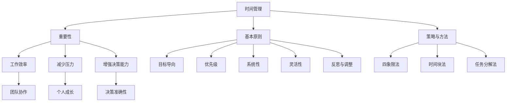
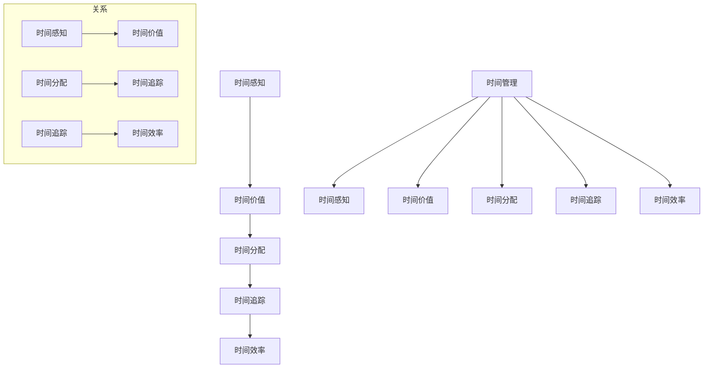

                 


### 第1章: 核心概念与联系

本章将探讨时间管理在领导者工作中的重要性，介绍时间管理的基本概念、基本原则、策略与方法，以及时间管理在实际工作中的应用。

#### 1.1 时间管理理论概述

时间管理是指通过规划和控制时间，以提高工作效率和生活质量的一种方法。对于领导者而言，时间管理尤为重要。高效的时间管理可以帮助领导者更好地安排工作，提高工作效率，减少压力，从而更好地服务于团队和组织。

##### 1.1.1 时间管理的基本概念

时间管理的基本概念包括以下几个方面：

1. **时间管理的重要性**：时间管理对于领导者来说至关重要。一方面，良好的时间管理可以提高工作效率，确保任务按时完成；另一方面，合理的时间管理可以减少工作压力，提高生活质量。
2. **时间管理的基本原则**：时间管理有以下几个基本原则：
   - **目标导向原则**：设定明确的目标，将时间分配给能够帮助实现目标的工作。
   - **优先级原则**：根据任务的重要性和紧急程度，合理分配时间和精力。
   - **系统性原则**：建立一个系统化的时间管理框架，包括日程安排、任务列表等。
   - **灵活性原则**：在时间管理中保持一定的灵活性，以应对突发状况。
   - **反思与调整原则**：定期反思时间管理的效果，根据实际情况进行调整。

##### 1.1.2 时间管理的基本原则

时间管理有以下几个基本原则：

1. **目标导向原则**：设定明确的目标，将时间分配给能够帮助实现目标的工作。
2. **优先级原则**：根据任务的重要性和紧急程度，合理分配时间和精力。
3. **系统性原则**：建立一个系统化的时间管理框架，包括日程安排、任务列表等。
4. **灵活性原则**：在时间管理中保持一定的灵活性，以应对突发状况。
5. **反思与调整原则**：定期反思时间管理的效果，根据实际情况进行调整。

##### 1.1.3 时间管理策略与方法

时间管理有很多经典的方法，如：

1. **四象限法**：将任务分为重要且紧急、重要但不紧急、不重要但紧急、不重要且不紧急四类，优先处理重要任务。
2. **时间块法**：将时间划分为若干块，每块用于处理特定类型的任务，提高工作效率。
3. **任务分解法**：将复杂任务分解为多个小任务，逐一完成。

##### 1.1.4 时间管理工具与技术

现代时间管理工具和技术的应用，可以大大提高领导者的时间管理效率。常见的工具和技术包括：

1. **日程管理工具**：如Google日历、Outlook等，可以帮助领导者更好地安排日程。
2. **任务管理工具**：如Trello、Asana等，可以协助领导者管理任务。
3. **时间追踪工具**：如Toggl、RescueTime等，可以帮助领导者分析时间使用情况，优化时间管理。

#### 1.2 时间管理在实际工作中的应用

时间管理在实际工作中有着广泛的应用，以下是几个关键方面：

##### 1.2.1 领导者个人时间管理

领导者需要通过时间管理来提高个人工作效率，从而更好地服务于团队和组织。具体方法包括：

1. **制定个人工作计划**：明确每天、每周、每月的工作任务，确保工作有序进行。
2. **有效利用碎片时间**：在等待、通勤等碎片时间里处理一些简单任务，提高时间利用率。
3. **培养时间敏感度**：时刻关注时间的流逝，避免拖延和浪费时间。

##### 1.2.2 团队时间管理

领导者还需要关注团队的时间管理，通过有效的团队时间管理，提高团队整体的工作效率和协作能力。具体方法包括：

1. **明确团队目标**：确保团队成员了解团队的目标和任务，从而更好地安排时间和精力。
2. **制定团队日程**：合理安排团队会议、任务分配、项目进度跟踪等，确保团队工作有序进行。
3. **培养团队协作精神**：鼓励团队成员相互支持、协作，共同完成工作任务。

### 第2章: 时间管理心理学

时间管理不仅仅是技术层面的技能，还涉及到心理学层面。本章将探讨时间感知与时间管理心理，以及时间管理与情绪管理、行为习惯的关系。

#### 2.1 时间感知与时间管理心理

时间感知是指个体对时间的感受和认识，它受到多种因素的影响，如个人性格、情境等。时间管理心理则是指个体在时间管理过程中所表现出的心理状态和行为。

##### 2.1.1 时间感知的心理学原理

时间感知的心理学原理主要包括以下几个方面：

1. **主观时间**：主观时间是指个体对时间的感受，它受到个体心理状态、情绪、兴趣等因素的影响。
2. **时间弹性**：时间弹性是指个体对时间安排的灵活程度，时间弹性越好，时间管理效果越好。
3. **时间认知**：时间认知是指个体对时间的认识和理解，包括时间观念、时间意识等。

##### 2.1.2 时间管理心理的误区

领导者常常会陷入一些时间管理心理误区，如完美主义、拖延症等，这些误区会影响时间管理的效果。以下是一些常见的时间管理心理误区：

1. **完美主义**：追求完美会导致过度投入时间和精力，影响其他任务的完成。
2. **拖延症**：拖延会导致任务积压，增加工作压力。
3. **时间误判**：对时间的判断不准确，导致任务无法按时完成。

##### 2.1.3 时间管理心理的优化策略

通过理解时间管理心理学，领导者可以更好地优化自己的时间管理行为，提高时间管理效率。以下是一些优化时间管理心理的策略：

1. **设定明确的目标**：明确的目标有助于提高时间管理效率。
2. **提高时间意识**：时刻关注时间的流逝，避免拖延。
3. **合理分配时间**：根据任务的重要性和紧急程度，合理分配时间。

#### 2.2 时间管理与情绪管理

时间管理与情绪管理密切相关，良好的时间管理可以帮助领导者更好地管理情绪，提高工作效率。

##### 2.2.1 时间管理与情绪的关系

时间管理与情绪管理的关系主要体现在以下几个方面：

1. **情绪对时间管理的影响**：情绪会影响个体的时间感知和行为，如焦虑、压力等负面情绪会降低时间管理效率。
2. **时间管理对情绪的影响**：良好的时间管理可以减少压力，提高情绪稳定性。

##### 2.2.2 情绪管理的方法

领导者可以通过以下方法来管理自己的情绪：

1. **情绪认知**：了解自己的情绪，接受情绪的存在。
2. **情绪调节**：采取适当的措施调节情绪，如深呼吸、放松等。
3. **情绪应对**：面对负面情绪时，采取积极的应对策略。

#### 2.3 时间管理与行为习惯

行为习惯对时间管理有着重要的影响，良好的行为习惯可以帮助领导者更好地管理时间。

##### 2.3.1 行为习惯与时间管理的关系

行为习惯与时间管理的关系主要体现在以下几个方面：

1. **习惯对时间管理的影响**：良好的行为习惯有助于提高时间管理效率，如规律作息、合理分配时间等。
2. **时间管理对行为习惯的影响**：通过良好的时间管理，可以培养良好的行为习惯，如高效工作、合理安排休息等。

##### 2.3.2 培养良好的时间管理习惯

领导者可以通过以下方法培养良好的时间管理习惯：

1. **制定明确的计划**：制定具体、可行的计划，有助于更好地管理时间。
2. **坚持执行**：养成良好的执行习惯，确保计划能够得到有效执行。
3. **定期反思**：定期反思时间管理的效果，根据实际情况进行调整。

### 第3章: 时间管理工具与技巧

本章将介绍时间管理的工具与技巧，帮助领导者更高效地管理时间。

#### 3.1 时间管理工具

时间管理工具可以帮助领导者更好地安排日程、管理任务和分析时间使用情况。以下是一些常用的时间管理工具：

##### 3.1.1 日程管理工具

日程管理工具可以帮助领导者更好地安排日程，确保工作和生活有序进行。常用的日程管理工具有：

1. **Google日历**：Google日历是一款功能强大的日程管理工具，支持多设备同步，便于领导者随时查看日程安排。
2. **Outlook**：Outlook是Microsoft Office套件中的一款日程管理工具，适用于Windows操作系统，支持邮件、日历和任务管理。

##### 3.1.2 任务管理工具

任务管理工具可以帮助领导者更好地管理任务，确保任务按时完成。常用的任务管理工具有：

1. **Trello**：Trello是一款基于看板（Kanban）方法的任务管理工具，适用于团队协作和任务跟踪。
2. **Asana**：Asana是一款功能强大的任务管理工具，支持项目进度跟踪、任务分配和协作。

##### 3.1.3 时间追踪工具

时间追踪工具可以帮助领导者分析时间使用情况，优化时间管理。常用的时间追踪工具有：

1. **Toggl**：Toggl是一款简单易用的在线时间追踪工具，适用于个人和时间管理。
2. **RescueTime**：RescueTime是一款功能强大的时间追踪工具，可以监控设备使用情况，提供详细的时间报告。

#### 3.2 时间管理技巧

除了使用时间管理工具，领导者还可以通过以下技巧提高时间管理效率：

##### 3.2.1 目标设定

设定明确的目标是提高时间管理效率的关键。以下是一些目标设定的技巧：

1. **SMART原则**：目标要具备明确性（Specific）、可衡量性（Measurable）、可实现性（Achievable）、相关性（Relevant）和时限性（Time-bound）。
2. **分解目标**：将大目标分解为小目标，逐一实现，有助于提高时间管理效率。

##### 3.2.2 优先级排序

合理分配时间和精力，根据任务的重要性和紧急程度进行排序。以下是一些优先级排序的技巧：

1. **四象限法**：将任务分为重要且紧急、重要但不紧急、不重要但紧急、不重要且不紧急四类，优先处理重要任务。
2. **紧急-重要矩阵**：将任务分为紧急和重要两个维度，根据任务的位置进行排序，确保先处理重要紧急任务。

##### 3.2.3 碎片时间利用

合理利用碎片时间可以提高时间利用率。以下是一些利用碎片时间的技巧：

1. **计划碎片时间**：在碎片时间前规划要完成的任务，提高时间利用效率。
2. **处理简单任务**：在碎片时间里处理一些简单任务，如回复邮件、整理文件等。

### 总结

时间管理是领导者工作中至关重要的一环，高效的 时间管理能力可以帮助领导者更加合理地安排工作，提高工作效率，减少压力。通过了解时间管理的基本概念、基本原则、策略与方法，以及时间管理心理学和行为习惯，领导者可以更好地优化自己的时间管理行为，提高时间管理效率。此外，使用合适的时间管理工具和技巧，领导者可以更高效地管理时间，实现个人和团队的共同发展。

作者：AI天才研究院/AI Genius Institute & 禅与计算机程序设计艺术 /Zen And The Art of Computer Programming### 第1章: 核心概念与联系

时间管理作为领导者的核心技能之一，直接影响着团队效率和整体绩效。高效的时间管理不仅能提升个人和专业形象，更能为团队和组织创造显著的价值。本章将深入探讨时间管理的核心概念，包括其理论基础、基本原则和方法，并分析其在领导者日常工作和团队管理中的应用。

#### 1.1 时间管理理论概述

时间管理理论主要关注如何优化时间分配，提高工作效率。对于领导者而言，时间管理不仅关乎个人生产力，更关系到团队协作和整体战略的实现。

##### 1.1.1 时间管理的重要性

领导者面临着多重任务和压力，高效的时间管理是确保这些任务按时完成的关键。以下为时间管理的重要性：

1. **提高工作效率**：合理的时间管理能够帮助领导者集中精力处理关键任务，从而提高工作效率。
2. **减少压力**：有效的时间管理有助于减轻工作压力，使领导者有更多时间进行放松和充电。
3. **增强决策能力**：通过合理安排时间，领导者可以更从容地进行决策，减少冲动决策的可能性。

##### 1.1.2 时间管理的基本原则

时间管理应遵循以下基本原则：

1. **目标导向原则**：设定明确的目标，将时间分配给有助于实现目标的任务。
2. **优先级原则**：根据任务的重要性和紧急程度，优先处理重要且紧急的任务。
3. **系统性原则**：建立系统化的时间管理框架，包括日程安排、任务列表等。
4. **灵活性原则**：在时间管理中保持灵活性，以应对突发状况。
5. **反思与调整原则**：定期反思时间管理效果，根据实际情况进行调整。

##### 1.1.3 时间管理策略与方法

领导者可运用多种策略和方法进行时间管理：

1. **四象限法**：将任务分为重要且紧急、重要但不紧急、不重要但紧急、不重要且不紧急四类，优先处理重要任务。
2. **时间块法**：将时间划分为若干块，每块用于处理特定类型的任务，提高工作效率。
3. **任务分解法**：将复杂任务分解为多个小任务，逐一完成。

#### 1.2 时间管理在实际工作中的应用

时间管理在领导者实际工作中有着广泛的应用，以下为关键方面：

##### 1.2.1 领导者个人时间管理

领导者需要通过时间管理来提高个人工作效率，具体方法包括：

1. **制定个人工作计划**：明确每天、每周、每月的工作任务，确保工作有序进行。
2. **有效利用碎片时间**：在等待、通勤等碎片时间里处理一些简单任务，提高时间利用率。
3. **培养时间敏感度**：时刻关注时间的流逝，避免拖延和浪费时间。

##### 1.2.2 团队时间管理

领导者还需要关注团队的时间管理，通过以下方法提高团队整体的工作效率和协作能力：

1. **明确团队目标**：确保团队成员了解团队的目标和任务，从而更好地安排时间和精力。
2. **制定团队日程**：合理安排团队会议、任务分配、项目进度跟踪等，确保团队工作有序进行。
3. **培养团队协作精神**：鼓励团队成员相互支持、协作，共同完成工作任务。

#### 1.3 时间管理理论之间的关系架构

为了更清晰地理解时间管理理论之间的关系，我们可以使用Mermaid流程图来展示其架构：



通过这个流程图，我们可以直观地看到时间管理理论之间的相互关系，以及它们如何共同作用于领导者的工作效率和团队协作。

本章为理解时间管理的核心概念和实际应用奠定了基础。在接下来的章节中，我们将进一步探讨时间管理心理学、时间管理与情绪管理、时间管理与行为习惯，以及时间管理工具与技巧，帮助领导者更全面地掌握时间管理艺术。

---

### 1.1.1 时间管理的基本概念

时间管理是一个复杂且多层次的领域，它涉及到个人、团队和组织多个层面的时间规划和控制。理解时间管理的基本概念是掌握时间管理技能的第一步。以下是时间管理的基本概念及其重要性。

#### 时间管理的重要性

时间管理的重要性主要体现在以下几个方面：

1. **提高工作效率**：时间管理能够帮助领导者更有效地安排工作，将精力集中在重要任务上，从而提高工作效率。
2. **减少工作压力**：通过合理安排时间，领导者可以避免过度劳累，减少工作压力，保持良好的工作状态。
3. **增强决策能力**：合理的时间管理有助于领导者更从容地进行决策，减少因时间紧迫而做出的冲动决策。
4. **提升个人和团队效能**：有效的时间管理不仅提升个人生产力，也能提高团队协作效率和整体绩效。

#### 时间管理的基本概念

时间管理的基本概念包括以下几个方面：

1. **时间感知**：时间感知是指个体对时间的感受和认识，包括对时间的流逝、时间的价值和时间的紧急性的感知。时间感知受到多种因素的影响，如个人性格、工作压力、生活情境等。
2. **时间价值**：时间价值是指时间对个体或组织的重要性。时间是有限的资源，如何有效利用时间，实现个人和组织的价值最大化，是时间管理的核心问题。
3. **时间分配**：时间分配是指将时间合理分配给不同的任务和活动。时间分配的合理性直接影响到工作效率和生活质量。
4. **时间追踪**：时间追踪是指记录和分析时间使用情况，以优化时间管理。时间追踪工具可以帮助领导者了解时间的实际使用情况，发现时间浪费的环节。
5. **时间效率**：时间效率是指单位时间内完成的工作量。提高时间效率是时间管理的目标之一。

#### 时间管理的基本概念之间的关系

时间管理的基本概念之间存在着紧密的联系：

1. **时间感知与时间价值**：时间感知会影响个体对时间价值的认识。如果个体能够正确感知时间，他们将更重视时间的价值，从而更有效地管理时间。
2. **时间分配与时间追踪**：时间分配是时间管理的基础，而时间追踪则是优化时间分配的重要手段。通过时间追踪，领导者可以了解时间分配的效果，并做出相应的调整。
3. **时间效率与时间管理**：时间效率是时间管理的最终目标。通过合理的时间感知、分配和追踪，领导者可以不断提高时间效率，实现个人和组织的目标。

为了更清晰地展示时间管理基本概念之间的关系，我们可以使用Mermaid流程图来表示：



通过上述流程图，我们可以直观地看到时间管理各个基本概念之间的相互关系。理解这些关系有助于领导者更系统地应用时间管理理论，提高个人和团队的工作效率。

#### 1.1.1.1 时间管理的重要性

时间管理在领导者工作中具有至关重要的作用，它不仅是提高工作效率的关键手段，也是实现组织目标的重要保障。以下是时间管理重要性的详细解析：

1. **提高工作效率**：高效的时间管理可以帮助领导者更好地安排工作，确保关键任务优先处理。通过优化时间分配，领导者可以最大限度地利用有限的时间资源，提高工作效率。例如，一位领导者如果能够合理规划日程，将时间集中在最重要的任务上，那么他就有更多的时间和精力去处理那些能够带来最大价值的工作。

2. **减少工作压力**：良好的时间管理能够帮助领导者避免因时间紧迫而带来的焦虑和压力。通过合理分配时间和任务，领导者可以减少加班和疲劳，从而保持身心健康。例如，通过提前规划并设定明确的优先级，领导者可以避免在最后一刻匆忙完成任务，减少因紧急情况而产生的压力。

3. **增强决策能力**：时间管理有助于领导者更从容地做出决策。通过合理安排时间，领导者可以避免因时间紧迫而做出的冲动决策，从而提高决策的质量。例如，在紧急情况下，领导者可以预留出时间进行深思熟虑，确保决策的合理性和可行性。

4. **提升个人和团队效能**：时间管理不仅对个人有益，也对团队和组织效能有显著影响。通过有效的时间管理，领导者可以确保团队工作有序进行，提高团队协作效率。例如，通过制定明确的任务分配和进度跟踪机制，领导者可以确保团队成员能够按时完成任务，从而提高整体项目的成功率。

为了更直观地展示时间管理的重要性，我们可以使用伪代码来描述一个简单的时间管理过程：

```python
# 时间管理伪代码示例

# 设定目标
set_goal("提高工作效率")

# 分配任务
assign_tasks([
    "审核报告",
    "召开团队会议",
    "处理客户反馈"
])

# 设置优先级
set_priority([
    "审核报告", # 高优先级
    "召开团队会议", # 中等优先级
    "处理客户反馈" # 低优先级
])

# 安排时间
schedule_time([
    "审核报告": 2小时,
    "召开团队会议": 1小时,
    "处理客户反馈": 30分钟
])

# 执行任务
execute_tasks()

# 反思与调整
reflect_on_performance()
adjust_time_management_plan()
```

通过上述伪代码，我们可以看到时间管理的过程包括设定目标、分配任务、设置优先级、安排时间、执行任务和反思与调整。这一过程不仅帮助领导者提高工作效率，还能确保工作有序进行，从而实现组织目标。

总之，时间管理在领导者工作中具有不可替代的重要性。通过合理规划和有效执行，领导者可以最大限度地发挥时间价值，提高个人和团队的效能，为组织的发展贡献力量。

#### 1.1.2 时间管理的基本原则

时间管理不仅是技术层面的技能，更是一种思维方式和生活习惯。为了确保时间管理能够持续有效地进行，领导者需要遵循一系列基本原则。以下是时间管理的基本原则及其具体内容和应用场景：

##### 1.1.2.1 目标导向原则

目标导向原则强调设定明确的目标，并将时间分配给有助于实现目标的工作。这一原则的核心在于确保时间和精力的投入能够产生最大的回报。

**具体内容**：
- **设定具体目标**：目标需要明确、可衡量，遵循SMART原则（具体、可衡量、可实现、相关、时限）。
- **目标分解**：将大目标分解为小目标，逐步实现。

**应用场景**：
- **项目规划**：在启动项目前，领导者应明确项目目标，并将目标分解为可执行的任务。
- **个人发展**：设定个人职业发展目标，如学习新技能、提升领导力等，并制定具体的行动计划。

##### 1.1.2.2 优先级原则

优先级原则是根据任务的重要性和紧急程度来分配时间和精力。领导者需要明确哪些任务是最重要的，哪些是紧急的，并优先处理这些任务。

**具体内容**：
- **四象限法**：将任务分为四个象限，分别代表重要且紧急、重要但不紧急、不重要但紧急、不重要且不紧急的任务，优先处理重要且紧急的任务。
- **紧急-重要矩阵**：使用紧急-重要矩阵来评估任务，确保优先处理重要紧急的任务。

**应用场景**：
- **日常任务管理**：领导者需要每天评估任务的重要性和紧急程度，优先处理重要紧急的任务。
- **危机管理**：在应对突发事件时，领导者应首先处理那些对组织影响最大、最紧急的问题。

##### 1.1.2.3 系统性原则

系统性原则强调建立一个系统化的时间管理框架，包括日程安排、任务列表、时间追踪等，以确保时间管理的有序和高效。

**具体内容**：
- **日程安排**：制定详细的日程安排，包括会议、任务、休息时间等。
- **任务列表**：创建任务列表，将任务按照优先级和时间要求进行分类和排序。
- **时间追踪**：使用时间追踪工具记录时间使用情况，以便进行反思和调整。

**应用场景**：
- **团队管理**：领导者可以为团队成员制定详细的日程安排，确保团队工作有序进行。
- **个人规划**：通过建立个人任务列表和时间追踪机制，领导者可以更好地管理个人时间。

##### 1.1.2.4 灵活性原则

灵活性原则强调在时间管理中保持灵活性，以应对突发状况和变化。领导者需要能够灵活调整计划，以适应不可预见的情况。

**具体内容**：
- **预留缓冲时间**：在日程安排中预留一定的缓冲时间，以应对突发事件。
- **适应变化**：在面对变化时，领导者应能够迅速调整计划，确保任务按时完成。

**应用场景**：
- **项目管理**：在项目执行过程中，领导者应预留一定的时间缓冲，以应对项目中的不确定性。
- **日常管理**：领导者应保持对日常工作的灵活性，及时调整日程安排以应对突发任务。

##### 1.1.2.5 反思与调整原则

反思与调整原则强调定期反思时间管理的效果，并根据实际情况进行调整。这一原则有助于持续优化时间管理，提高工作效率。

**具体内容**：
- **定期反思**：定期回顾时间管理的效果，分析哪些方法有效，哪些需要改进。
- **调整计划**：根据反思结果，调整时间管理计划，以更好地适应工作需求。

**应用场景**：
- **年度回顾**：在每年年底，领导者应进行时间管理回顾，总结一年的工作，找出改进点。
- **项目总结**：在项目完成后，领导者应进行时间管理总结，分析项目中的时间管理经验，为未来的项目提供参考。

#### 1.1.2.6 实际应用案例分析

为了更好地理解这些基本原则的应用，我们可以通过一个实际案例进行分析。

**案例背景**：
某公司项目经理李明负责一个重要项目的执行，项目时间紧、任务重。为了确保项目成功，李明需要高效管理时间和资源。

**解决方案**：
1. **目标导向原则**：李明首先明确项目目标，并将其分解为多个具体任务，如“完成需求分析”、“设计解决方案”、“开发功能模块”等。
2. **优先级原则**：李明使用四象限法评估每个任务的紧急程度和重要性，将“设计解决方案”和“开发功能模块”列为重要紧急任务，优先处理。
3. **系统性原则**：李明制定了详细的日程安排，包括每日的任务列表和时间追踪计划，确保项目工作有序进行。
4. **灵活性原则**：李明在日程中预留了缓冲时间，以应对可能出现的突发任务。
5. **反思与调整原则**：每周，李明会回顾时间管理效果，根据实际情况调整日程安排和任务分配。

**结果**：
通过这些基本原则的应用，李明成功提高了项目工作效率，确保了项目按时完成，同时减少了工作压力，得到了团队和上级的认可。

#### 1.1.3 时间管理策略与方法

在了解了时间管理的基本原则后，领导者还需要掌握具体的时间管理策略与方法，这些策略与方法可以帮助他们在实际工作中更加高效地利用时间。以下是一些常见的时间管理策略与方法：

##### 1.1.3.1 经典时间管理方法

**四象限法**

四象限法是一种常用的任务分类和优先级排序方法，它将任务分为四个象限：

1. **第一象限（重要且紧急）**：优先处理这些任务，因为它们对当前工作影响最大。
2. **第二象限（重要但不紧急）**：这些任务虽然不紧急，但非常重要，需要提前规划和处理。
3. **第三象限（不重要但紧急）**：这些任务可能需要立即处理，但它们的重要性不高，可以适当推迟。
4. **第四象限（不重要且不紧急）**：这些任务可以推迟或委托给他人处理。

**时间块法**

时间块法是一种将时间划分为固定时间块，并用于特定任务的方法。这种方法有助于提高专注度和工作效率。具体步骤如下：

1. **确定任务类型**：将任务分为不同类型，如“沟通”、“思考”、“执行”等。
2. **分配时间块**：为每种类型的任务分配一定的时间块，例如，“思考时间块”、“执行时间块”等。
3. **专注执行**：在分配的时间块内，专注于完成特定类型的任务，避免分心。

**任务分解法**

任务分解法是一种将复杂任务分解为多个小任务的方法，有助于降低任务的复杂度，提高可执行性。具体步骤如下：

1. **明确任务目标**：确定任务的整体目标。
2. **分解任务**：将任务分解为若干个子任务，每个子任务都是具体、可操作的。
3. **分配时间**：为每个子任务分配时间，确保每个子任务都能在规定时间内完成。

##### 1.1.3.2 现代时间管理工具与技术

**日程管理工具**

日程管理工具可以帮助领导者更好地安排日程和任务，常见的工具包括：

1. **Google日历**：Google日历是一款功能强大的日程管理工具，支持多设备同步，方便领导者随时查看日程安排。
2. **Outlook**：Outlook是Microsoft Office套件中的一款日程管理工具，适用于Windows操作系统，支持邮件、日历和任务管理。

**任务管理工具**

任务管理工具可以帮助领导者管理任务和项目，常见的工具包括：

1. **Trello**：Trello是一款基于看板（Kanban）方法的任务管理工具，适用于团队协作和任务跟踪。
2. **Asana**：Asana是一款功能强大的任务管理工具，支持项目进度跟踪、任务分配和协作。

**时间追踪工具**

时间追踪工具可以帮助领导者分析时间使用情况，常见的工具包括：

1. **Toggl**：Toggl是一款简单易用的在线时间追踪工具，适用于个人和时间管理。
2. **RescueTime**：RescueTime是一款功能强大的时间追踪工具，可以监控设备使用情况，提供详细的时间报告。

#### 1.1.3.3 实际应用案例

**案例背景**：
某公司市场营销部门经理王丽负责多个市场活动的策划和执行。由于任务繁重，她需要高效地管理时间和资源。

**解决方案**：

1. **使用四象限法**：王丽将所有任务分为四个象限，优先处理重要紧急的任务，如“市场调研报告”，并将其安排在每周的第一天完成。
2. **应用时间块法**：王丽将每天的工作时间分为“沟通时间块”、“策划时间块”、“执行时间块”，确保每个时间段专注于特定类型的任务。
3. **使用任务分解法**：王丽将大型市场活动分解为多个子任务，如“活动策划”、“预算编制”、“宣传推广”等，并为每个子任务分配时间。
4. **利用日程管理工具**：王丽使用Google日历安排日程，将每个任务的时间、地点和参与人员都详细记录。
5. **使用任务管理工具**：王丽使用Trello管理任务和项目，确保每个团队成员都能看到任务的进展情况。

**结果**：

通过上述策略和方法的应用，王丽成功提高了工作效率，确保了市场活动的顺利开展，同时减轻了工作压力。

总之，时间管理策略与方法是领导者实现高效工作的关键。通过灵活应用这些策略和方法，领导者可以更好地管理时间和资源，提升个人和团队的效能。

#### 1.1.4 时间管理工具与技术

现代科技的发展为时间管理提供了丰富的工具和技术，这些工具不仅可以帮助领导者更好地安排时间，还能提高工作效率。以下介绍几种常见的时间管理工具和技术。

##### 1.1.4.1 日程管理工具

日程管理工具是帮助领导者安排日常事务、确保工作和生活有序进行的关键工具。以下是一些流行的日程管理工具：

1. **Google日历**：Google日历是Google提供的免费日程管理服务，支持多设备同步，方便领导者随时随地查看日程安排。它具有强大的日历共享功能，适用于团队协作。

   **示例功能**：
   - **日历共享**：与其他人共享日历，方便团队协作。
   - **提醒功能**：设置事件提醒，避免错过重要任务。
   - **日历视图**：提供日、周、月等多种视图，方便查看和调整日程。

2. **Outlook**：Outlook是Microsoft Office套件中的一款日程管理工具，适用于Windows操作系统。它集成了邮件、日历和任务管理功能，方便领导者进行综合管理。

   **示例功能**：
   - **邮件和日历集成**：在查看邮件的同时，可以查看相关日程安排。
   - **任务管理**：创建和管理任务，确保任务按时完成。
   - **共享日程**：与其他人共享日程，便于协调工作安排。

##### 1.1.4.2 任务管理工具

任务管理工具可以帮助领导者更有效地管理任务和项目，确保工作按时完成。以下是一些流行的任务管理工具：

1. **Trello**：Trello是一款基于看板（Kanban）方法的任务管理工具，适用于团队协作和任务跟踪。它通过直观的看板和卡片系统，帮助领导者清晰地了解任务状态。

   **示例功能**：
   - **看板视图**：通过看板视图，领导者可以直观地了解任务进度。
   - **卡片系统**：每个任务都是一个卡片，可以添加描述、标签、评论等。
   - **任务分配**：将任务分配给团队成员，跟踪任务执行情况。

2. **Asana**：Asana是一款功能强大的任务管理工具，支持项目进度跟踪、任务分配和协作。它提供了多种视图，如列表视图、看板视图、甘特图等，方便领导者进行任务管理。

   **示例功能**：
   - **多视图**：提供不同的视图，方便领导者选择最适合的管理方式。
   - **任务分配**：将任务分配给团队成员，并设置截止日期。
   - **项目跟踪**：实时跟踪项目进度，确保项目按时完成。

##### 1.1.4.3 时间追踪工具

时间追踪工具可以帮助领导者分析时间使用情况，优化时间管理。以下是一些流行的时间追踪工具：

1. **Toggl**：Toggl是一款简单易用的在线时间追踪工具，适用于个人和时间管理。它可以帮助领导者记录工作时间，生成详细的时间报告。

   **示例功能**：
   - **时间记录**：记录每天的工作时间，生成详细的时间报告。
   - **团队时间追踪**：追踪团队成员的工作时间，了解团队的工作负荷。
   - **时间报告**：生成可视化时间报告，帮助领导者分析时间使用情况。

2. **RescueTime**：RescueTime是一款功能强大的时间追踪工具，可以监控设备使用情况，提供详细的时间报告。它可以帮助领导者了解时间浪费的环节，优化时间管理。

   **示例功能**：
   - **设备监控**：监控电脑和手机的使用情况，提供详细的时间报告。
   - **时间分析**：分析时间使用情况，找出时间浪费的环节。
   - **提醒功能**：设置提醒，帮助领导者避免长时间使用不必要的应用。

#### 1.1.4.4 实际应用案例分析

**案例背景**：
某公司项目经理张华负责多个项目的执行和管理，他需要高效地管理时间和资源。

**解决方案**：

1. **使用Google日历**：张华使用Google日历安排项目会议和任务，确保日程有序进行。他设置了邮件提醒，避免错过重要会议。

2. **使用Trello**：张华使用Trello管理项目任务，将任务分解为多个子任务，并为每个子任务设置截止日期。他通过看板视图，清晰地了解任务进度。

3. **使用Toggl**：张华使用Toggl记录每天的工作时间，生成详细的时间报告。通过时间报告，他发现自己在社交媒体上的时间花费过多，因此调整了时间管理策略。

**结果**：

通过使用这些时间管理工具，张华成功提高了工作效率，确保了项目按时完成。同时，他通过时间报告优化了个人时间管理，减少了时间浪费。

总之，时间管理工具和技术为领导者提供了强大的支持，通过合理应用这些工具，领导者可以更好地管理时间和资源，提升个人和团队的效能。

#### 1.2 时间管理在实际工作中的应用

时间管理不仅是理论，更是实践。领导者需要在实际工作中运用时间管理策略，以提高个人和团队的工作效率。以下是时间管理在实际工作中的一些应用方法。

##### 1.2.1 领导者个人时间管理

领导者个人时间管理的核心在于合理安排每天的工作任务，提高工作效率。以下是一些具体的方法：

1. **制定个人工作计划**：领导者应每天、每周、每月制定工作计划，明确当天、本周和本月需要完成的任务。这样可以确保工作有序进行，避免任务积压。

2. **使用日程管理工具**：领导者可以使用Google日历、Outlook等日程管理工具来安排日程，确保任务按时完成。通过设置提醒功能，可以避免错过重要会议和任务。

3. **有效利用碎片时间**：领导者可以利用碎片时间完成一些简单的任务，如阅读、回邮件等。例如，在通勤途中可以阅读相关资料，利用等待的时间处理一些简单的事务。

4. **培养时间敏感度**：领导者应时刻关注时间的流逝，避免拖延。通过设定具体的时间目标，领导者可以更加高效地完成工作。

##### 1.2.2 团队时间管理

领导者还需要关注团队的时间管理，通过以下方法提高团队整体的工作效率和协作能力：

1. **明确团队目标**：领导者应确保团队成员了解团队的目标和任务，从而更好地安排时间和精力。通过定期的团队会议，领导者可以与团队成员共同讨论目标，确保团队目标的明确性和一致性。

2. **制定团队日程**：领导者应制定详细的团队日程，包括会议、任务分配、项目进度跟踪等。通过合理安排团队会议和任务，确保团队工作有序进行。

3. **培养团队协作精神**：领导者应鼓励团队成员相互支持、协作，共同完成工作任务。通过团队合作，可以充分发挥每个人的优势，提高整体工作效率。

4. **使用团队协作工具**：领导者可以使用Trello、Asana等团队协作工具来管理任务和项目。这些工具可以帮助领导者清晰地了解任务分配和进度，确保团队协作高效。

##### 1.2.3 时间管理案例分析

以下是一个关于时间管理在实际工作中的应用案例：

**案例背景**：
某公司的项目经理李明负责一个大型项目，该项目涉及多个部门协作，任务繁重且时间紧迫。

**解决方案**：

1. **制定个人工作计划**：李明每天制定详细的工作计划，明确当天需要完成的任务，并设置优先级。他确保在每天早上检查计划，并在晚上回顾当天的工作进展。

2. **使用日程管理工具**：李明使用Google日历安排项目会议和任务，确保日程有序进行。他设置了邮件提醒，避免错过重要会议和任务。

3. **明确团队目标**：李明在项目启动会上明确了团队的目标和任务，确保团队成员了解项目的整体进度和要求。

4. **制定团队日程**：李明制定了详细的团队日程，包括每周的团队会议、任务分配和项目进度跟踪。通过团队会议，他确保团队成员了解项目的最新进展和各自的任务。

5. **使用团队协作工具**：李明使用Trello来管理项目任务，将任务分解为多个子任务，并为每个子任务设置截止日期。通过Trello，他可以清晰地了解每个任务的进展情况，并实时与团队成员沟通。

**结果**：

通过上述时间管理方法的应用，李明成功提高了个人和团队的工作效率，确保项目按时完成。团队成员之间的协作也变得更加顺畅，项目的整体质量得到了保障。

总之，时间管理在实际工作中至关重要。通过合理的计划、有效的工具和团队协作，领导者可以更好地管理时间和资源，提高个人和团队的效能。

### 第2章: 时间管理心理学

时间管理不仅仅是技术和工具的应用，更是一种涉及心理学的行为习惯。本章将探讨时间管理心理学的基本概念，包括时间感知、时间管理心理误区以及优化时间管理心理的策略。

#### 2.1 时间感知与时间管理心理

时间感知是指个体对时间的感受和认知，它受到多种因素的影响，如个人性格、情境、情绪等。时间管理心理则是指个体在时间管理过程中所表现出的心理状态和行为。

##### 2.1.1 时间感知的心理学原理

时间感知的心理学原理主要包括以下几个方面的内容：

1. **主观时间**：主观时间是指个体对时间的感受，它受到个体心理状态、情绪、兴趣等因素的影响。例如，当个体处于兴奋或焦虑状态时，时间的感知会变得相对较短。

2. **时间弹性**：时间弹性是指个体对时间安排的灵活程度，时间弹性越好，时间管理效果越好。例如，一个具有良好时间弹性的领导者能够在面对突发状况时迅速调整日程，确保任务按时完成。

3. **时间认知**：时间认知是指个体对时间的认识和理解，包括时间观念、时间意识等。例如，一个具有高度时间认知的领导者会明白时间的重要性，并在日常生活中注重时间管理。

##### 2.1.2 时间管理心理的误区

领导者常常会陷入一些时间管理心理误区，这些误区会影响时间管理的效果。以下是一些常见的时间管理心理误区：

1. **完美主义**：追求完美会导致过度投入时间和精力，从而影响其他任务的完成。例如，一个追求完美的领导者可能会在一份报告上花费过多时间，导致其他任务积压。

2. **拖延症**：拖延会导致任务积压，增加工作压力。例如，一个有拖延症的领导者可能会将任务拖延到最后一刻，导致工作效率下降。

3. **时间误判**：对时间的判断不准确，导致任务无法按时完成。例如，一个时间误判的领导者可能会低估完成某个任务所需的时间，导致任务延迟。

##### 2.1.3 时间管理心理的优化策略

通过理解时间管理心理学，领导者可以更好地优化自己的时间管理行为，提高时间管理效率。以下是一些优化时间管理心理的策略：

1. **设定明确的目标**：明确的目标有助于提高时间管理效率。例如，一个领导者可以通过设定具体的、可实现的目标，来更好地安排时间和精力。

2. **提高时间意识**：时刻关注时间的流逝，避免拖延。例如，一个领导者可以通过设置定时提醒、使用时间管理工具等方式，来提高时间意识。

3. **合理分配时间**：根据任务的重要性和紧急程度，合理分配时间。例如，一个领导者可以通过使用四象限法或紧急-重要矩阵，来合理分配时间和精力。

#### 2.2 时间管理与情绪管理

时间管理与情绪管理密切相关，良好的时间管理可以帮助领导者更好地管理情绪，提高工作效率。

##### 2.2.1 时间管理与情绪的关系

时间管理与情绪管理之间的关系主要体现在以下几个方面：

1. **情绪对时间管理的影响**：情绪会影响个体的时间感知和行为。例如，焦虑和压力会导致时间感知变短，增加时间管理难度。

2. **时间管理对情绪的影响**：良好的时间管理可以减少压力，提高情绪稳定性。例如，通过合理安排时间和任务，领导者可以避免过度劳累，保持良好的心理状态。

##### 2.2.2 情绪管理的方法

领导者可以通过以下方法来管理自己的情绪：

1. **情绪认知**：了解自己的情绪，接受情绪的存在。例如，通过自我反思和情绪日志，领导者可以更好地了解自己的情绪变化。

2. **情绪调节**：采取适当的措施调节情绪。例如，通过深呼吸、放松技巧、运动等方式，领导者可以缓解压力和焦虑。

3. **情绪应对**：面对负面情绪时，采取积极的应对策略。例如，通过制定应对计划、寻求支持、调整思维方式等方式，领导者可以更好地应对挑战。

#### 2.3 时间管理与行为习惯

行为习惯对时间管理有着重要的影响，良好的行为习惯可以帮助领导者更好地管理时间。

##### 2.3.1 行为习惯与时间管理的关系

行为习惯与时间管理的关系主要体现在以下几个方面：

1. **习惯对时间管理的影响**：良好的行为习惯有助于提高时间管理效率。例如，定期制定计划、合理利用碎片时间、保持工作环境整洁等，都是良好的时间管理习惯。

2. **时间管理对行为习惯的影响**：通过良好的时间管理，领导者可以培养良好的行为习惯。例如，通过合理安排时间，领导者可以养成良好的作息习惯，提高工作效率。

##### 2.3.2 培养良好的时间管理习惯

领导者可以通过以下方法培养良好的时间管理习惯：

1. **制定明确的计划**：制定具体、可行的计划，有助于更好地管理时间。例如，领导者可以每天制定工作计划，明确当天需要完成的任务。

2. **坚持执行**：养成良好的执行习惯，确保计划能够得到有效执行。例如，领导者可以设置定期检查，确保计划按计划进行。

3. **定期反思**：定期反思时间管理的效果，根据实际情况进行调整。例如，领导者可以每周反思自己的时间管理情况，找出改进点。

#### 2.4 时间管理心理学案例分析

以下是一个关于时间管理心理学在实际工作中的案例分析：

**案例背景**：
某公司的项目经理王先生在项目管理中遇到了时间管理方面的挑战，他经常感到时间不够用，任务完成质量下降。

**解决方案**：

1. **情绪管理**：王先生通过学习情绪管理技巧，如深呼吸、放松技巧等，缓解了工作压力。他学会了在面对压力时保持冷静，从而更好地管理时间。

2. **时间感知优化**：王先生通过了解时间感知心理学原理，学会了设定明确的目标和优先级，合理安排时间和任务。他不再拖延任务，确保任务按时完成。

3. **行为习惯培养**：王先生通过制定明确的计划，坚持执行，并定期反思时间管理效果，逐步养成了良好的时间管理习惯。他的工作效率得到了显著提高。

**结果**：

通过情绪管理、时间感知优化和行为习惯培养，王先生成功克服了时间管理方面的挑战，项目进度得到了保障，工作质量也得到了提升。

总之，时间管理心理学为领导者提供了一种全面的时间管理方法。通过理解时间感知、情绪管理和行为习惯，领导者可以更好地优化自己的时间管理行为，提高工作效率，实现个人和团队的目标。

### 第3章: 时间管理工具与技巧

在现代工作环境中，时间管理工具和技巧的运用已经成为领导者提高效率的关键。本章将介绍几种常见的时间管理工具，并探讨如何通过有效的技巧来提升时间管理能力。

#### 3.1 时间管理工具

时间管理工具可以帮助领导者更好地安排时间、追踪进度和优化工作流程。以下是一些常用的工具：

##### 3.1.1 日程管理工具

日程管理工具是帮助领导者组织和优化日常活动的关键工具。以下是一些流行的日程管理工具：

1. **Google日历**：Google日历是一款功能强大的在线日程管理工具，它支持多设备同步、事件提醒和共享日历功能，适用于个人和团队使用。

   **功能特点**：
   - **多设备同步**：可以在手机、电脑和手表等设备上查看日程。
   - **事件提醒**：可以设置提醒，避免错过重要事件。
   - **共享日历**：可以与其他人共享日程，方便团队协作。

2. **Outlook**：Outlook是Microsoft Office套件的一部分，提供全面的日程管理功能，适用于Windows操作系统。

   **功能特点**：
   - **集成邮件**：可以查看邮件的同时查看相关日程。
   - **任务管理**：可以创建和管理任务，跟踪工作进度。
   - **日历视图**：提供多种视图（日、周、月等），方便查看日程安排。

##### 3.1.2 任务管理工具

任务管理工具可以帮助领导者更有效地分配和管理任务。以下是一些流行的任务管理工具：

1. **Trello**：Trello是一款基于看板（Kanban）方法的任务管理工具，它通过直观的卡片和列表系统，帮助团队协作和任务跟踪。

   **功能特点**：
   - **看板视图**：通过卡片和列表系统，直观地展示任务进度。
   - **任务分配**：可以分配任务给团队成员，并跟踪任务状态。
   - **提醒功能**：可以设置提醒，确保任务按时完成。

2. **Asana**：Asana是一款功能强大的任务管理工具，支持项目进度跟踪、任务分配和协作。

   **功能特点**：
   - **多种视图**：提供列表视图、看板视图、甘特图等，方便领导者选择最适合的管理方式。
   - **任务分配**：可以分配任务给团队成员，并设置截止日期。
   - **报告功能**：可以生成项目进度报告，帮助领导者了解任务状态。

##### 3.1.3 时间追踪工具

时间追踪工具可以帮助领导者了解时间使用情况，优化工作流程。以下是一些流行的时间追踪工具：

1. **Toggl**：Toggl是一款简单易用的在线时间追踪工具，适用于个人和时间管理。

   **功能特点**：
   - **时间记录**：可以记录每天的工作时间，生成详细的时间报告。
   - **团队时间追踪**：可以追踪团队成员的工作时间，了解团队的工作负荷。
   - **报告功能**：可以生成可视化时间报告，帮助领导者分析时间使用情况。

2. **RescueTime**：RescueTime是一款功能强大的时间追踪工具，可以监控设备使用情况，提供详细的时间报告。

   **功能特点**：
   - **设备监控**：可以监控电脑和手机的使用情况，生成详细的时间报告。
   - **时间分析**：可以分析时间使用情况，找出时间浪费的环节。
   - **提醒功能**：可以设置提醒，帮助领导者避免长时间使用不必要的应用。

#### 3.2 时间管理技巧

除了使用时间管理工具，领导者还可以通过以下技巧提高时间管理能力：

##### 3.2.1 目标设定技巧

设定明确的目标是有效时间管理的第一步。以下是一些目标设定的技巧：

1. **SMART目标**：确保目标具备明确性（Specific）、可衡量性（Measurable）、可实现性（Achievable）、相关性（Relevant）和时限性（Time-bound）。

   **示例**：将“提高项目效率”改为“在三个月内将项目完成时间缩短10%”。

2. **分解目标**：将大目标分解为小目标，逐一实现。这样可以使目标更加具体，也更容易管理。

   **示例**：将“提升团队效率”分解为“每周举行一次团队会议”、“每天为团队成员分配明确任务”等。

##### 3.2.2 优先级排序技巧

合理分配时间和精力，根据任务的重要性和紧急程度进行排序。以下是一些优先级排序的技巧：

1. **四象限法**：将任务分为四个象限，分别代表重要且紧急、重要但不紧急、不重要但紧急、不重要且不紧急的任务，优先处理重要紧急的任务。

   **示例**：首先处理重要紧急的任务，如紧急客户需求，然后处理重要但不紧急的任务，如项目规划。

2. **紧急-重要矩阵**：将任务分为紧急和重要两个维度，根据任务的位置进行排序，确保先处理重要紧急任务。

   **示例**：先处理位于第一象限的任务（重要且紧急），再处理第二象限的任务（重要但不紧急）。

##### 3.2.3 碎片时间利用技巧

合理利用碎片时间可以提高时间利用率。以下是一些利用碎片时间的技巧：

1. **任务清单**：在碎片时间前规划要完成的任务，提高时间利用效率。

   **示例**：在等待会议开始的时候，可以查看任务清单，处理一些简单的邮件或文件。

2. **处理简单任务**：在碎片时间里处理一些简单任务，如回复邮件、整理文件等。

   **示例**：在通勤途中，可以阅读电子邮件或处理一些不需要深入思考的任务。

##### 3.2.4 时间块技巧

时间块是一种将时间划分为若干块，每块用于处理特定类型的任务的方法。以下是一些时间块技巧：

1. **确定任务类型**：将任务分为不同类型，如“沟通”、“思考”、“执行”等。

   **示例**：将每天的工作时间分为“沟通时间块”、“思考时间块”、“执行时间块”。

2. **专注执行**：在分配的时间块内，专注于完成特定类型的任务，避免分心。

   **示例**：在一个“思考时间块”内，只专注于思考任务，避免同时处理多个任务。

#### 3.3 实际应用案例分析

以下是一个关于时间管理工具和技巧在实际工作中的案例分析：

**案例背景**：
某公司市场营销经理李女士负责多个市场活动策划和执行，工作繁忙，经常感到时间不够用。

**解决方案**：

1. **使用日程管理工具**：李女士使用Google日历安排日程，将每天的工作任务和会议时间都记录在日程中，并通过设置提醒功能避免错过重要事件。

2. **使用任务管理工具**：李女士使用Trello管理任务，将市场活动分解为多个子任务，并为每个子任务设置截止日期。她通过看板视图清晰地了解任务进度，并实时与团队成员沟通。

3. **目标设定技巧**：李女士将大目标分解为小目标，如“提高品牌知名度”分解为“每周发布一篇市场分析报告”、“每月举办一次线上活动”等，确保目标具体、可衡量。

4. **优先级排序技巧**：李女士使用四象限法评估任务，优先处理重要紧急的任务，如“紧急客户需求”，然后处理重要但不紧急的任务，如“市场调研报告”。

5. **碎片时间利用技巧**：李女士在等待会议、通勤等碎片时间里处理一些简单任务，如回复邮件、整理文件等。

**结果**：

通过上述时间管理工具和技巧的应用，李女士成功提高了工作效率，确保了市场活动的顺利开展。同时，她通过合理利用碎片时间和优先级排序，减轻了工作压力，保持了良好的工作状态。

总之，时间管理工具和技巧对于领导者来说至关重要。通过合理运用这些工具和技巧，领导者可以更高效地管理时间，提高个人和团队的效能。

### 总结

本章深入探讨了时间管理的核心概念、基本原则、策略与方法，以及时间管理工具和技巧。通过理解时间管理的重要性，领导者能够更有效地安排时间、提高工作效率。同时，掌握时间管理的基本原则，如目标导向、优先级排序、系统性和灵活性，可以帮助领导者更好地应对工作挑战。此外，通过运用现代时间管理工具和技巧，领导者可以进一步提升时间管理能力。

时间管理不仅是一种技术，更是一种生活方式。领导者需要持续优化自己的时间管理行为，培养良好的行为习惯，以实现个人和团队的目标。通过合理的时间管理和情绪管理，领导者可以更好地应对工作中的压力和挑战，提升领导力。

在未来的工作中，领导者应不断反思和调整时间管理策略，根据实际情况进行调整。同时，积极探索和应用新的时间管理工具和技术，以适应不断变化的工作环境。通过持续的努力和实践，领导者将能够更高效地管理时间和资源，推动个人和团队不断向前发展。

---

### 关键词

- 时间管理
- 领导者
- 高效能
- 目标导向
- 优先级排序
- 系统性
- 灵活性
- 反思与调整
- 时间感知
- 情绪管理
- 行为习惯
- 工具与技巧
- 日程管理
- 任务管理
- 时间追踪
- 碎片时间利用
- 时间块法
-SMART目标

### 摘要

时间管理是领导者工作中至关重要的一环。本章深入探讨了时间管理的核心概念，包括时间管理的重要性、基本原则、策略与方法，以及实际工作中的应用。通过理解时间管理理论，领导者能够更有效地安排时间、提高工作效率。同时，本章介绍了多种时间管理工具和技巧，如日程管理工具、任务管理工具和碎片时间利用技巧，帮助领导者更高效地管理时间和资源。通过持续优化时间管理行为，领导者可以提升个人和团队的效能，实现组织目标。

