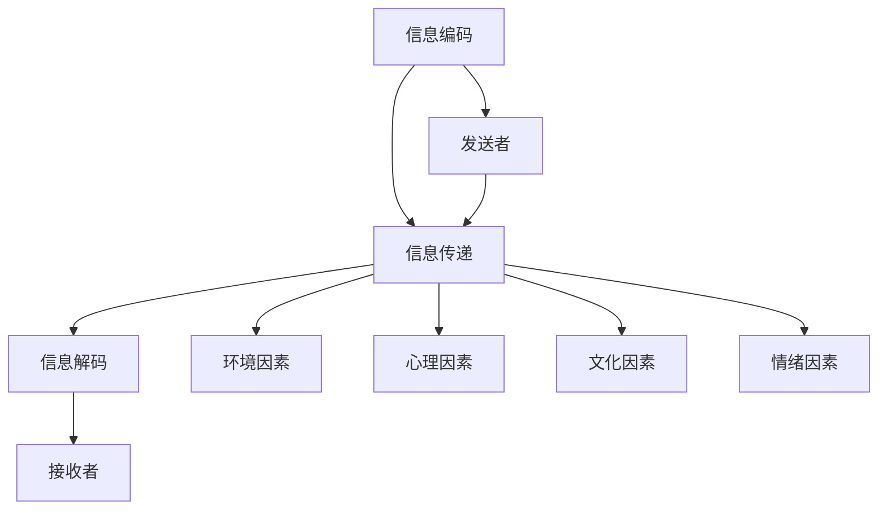
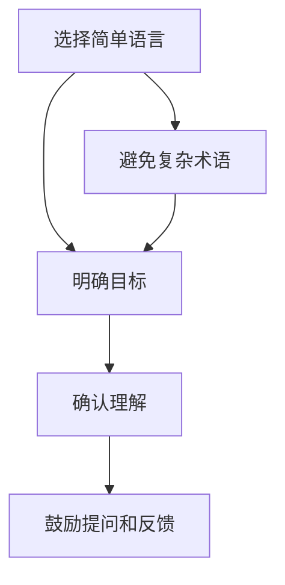
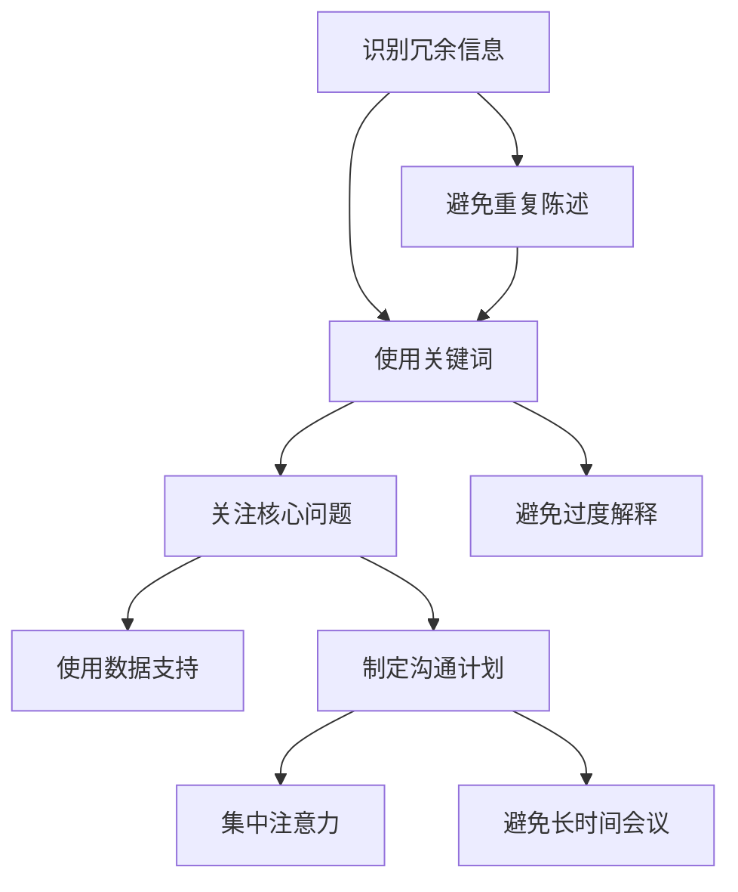
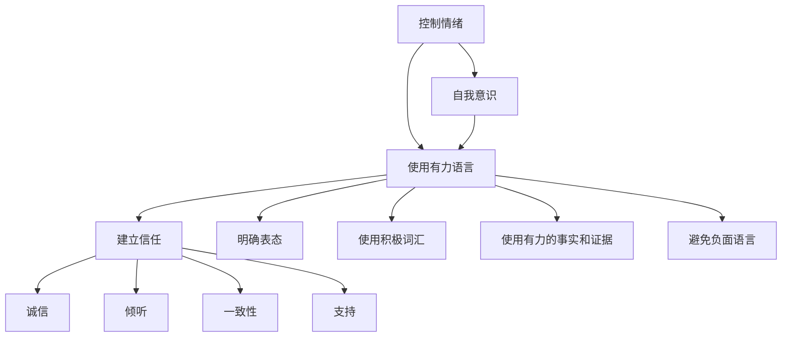
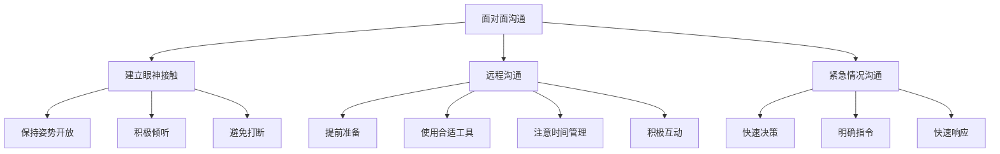
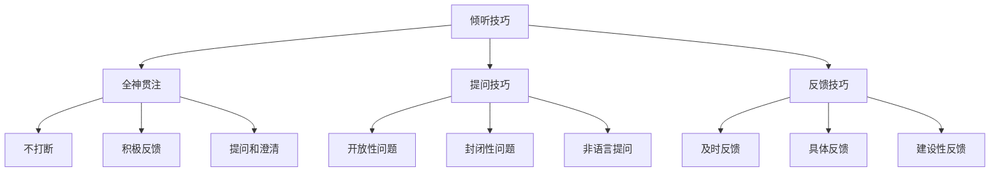
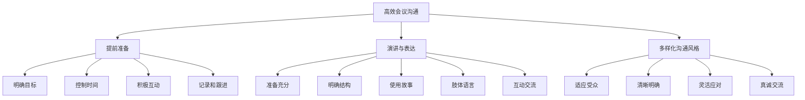
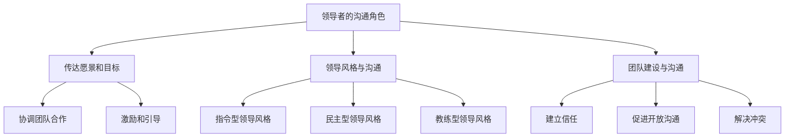
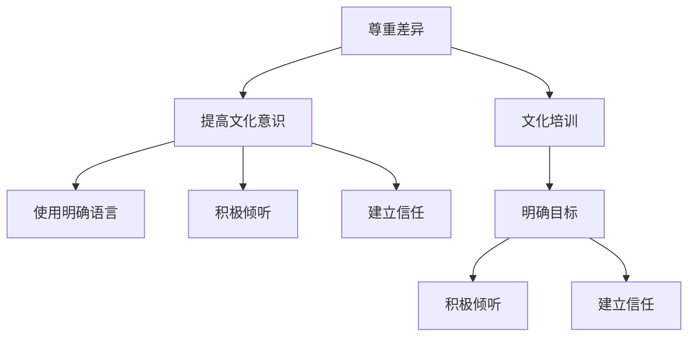
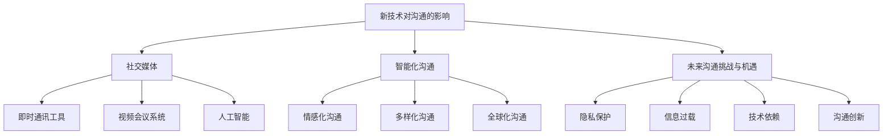

                 

### 第1章 引言

#### 沟通的重要性

在信息技术快速发展的今天，沟通作为信息传递、观点交流、决策制定的核心环节，已成为现代社会各个领域的重要技能。有效的沟通不仅能够提升工作效率，还能增强团队凝聚力和个人影响力。对于领导者而言，沟通艺术更是至关重要。它不仅决定了领导者的形象和地位，更影响着组织的运营和发展。

#### 领导者的沟通特点

领导者的沟通特点主要包括清晰性、简洁性和有力性。首先，清晰性要求领导者能够准确地表达自己的意图和期望，确保信息的传递不被误解或误传。简洁性则强调在传达信息时去除冗余，突出关键点，提高沟通的效率。有力性则是通过合适的语言和情绪表达，增强信息的说服力和影响力。

#### 本书的目的和结构

本书旨在帮助领导者提升沟通艺术，使其在各个场景中都能做到清晰、简洁、有力地沟通。全书分为12章，内容涵盖沟通原理、沟通基础、清晰沟通、简洁沟通、有力沟通、情景沟通、沟通技巧提升、实战演练、沟通艺术进阶、沟通艺术与领导力、跨文化沟通以及沟通艺术的未来趋势。通过系统的学习和实践，读者将能够掌握高效的沟通技巧，提升自身的领导力。

#### 文章结构

为了使读者更好地理解并应用本书的内容，文章采用以下结构：

1. **引言**：介绍沟通的重要性以及领导者的沟通特点。
2. **章节正文**：详细讲解每个章节的核心概念、原理和实战应用。
3. **梅达里图**：通过流程图展示各个概念之间的关系。
4. **伪代码**：用伪代码形式展示核心算法原理。
5. **数学公式**：使用LaTeX格式嵌入文中独立段落的数学公式和段落内的数学公式。
6. **项目实战**：提供实际开发环境搭建、源代码实现、代码解读、案例分析等内容。
7. **代码解读与分析**：对项目实战中的代码进行详细解读和分析。
8. **结束语**：总结全文，强调沟通艺术的重要性。

通过这样的结构，读者可以循序渐进地学习沟通艺术，不仅理解理论，更能通过实战应用提升自己的沟通能力。

### 第2章 沟通基础

#### 沟通原理概述

沟通是指信息在个体间传递和交换的过程。它不仅包括信息的编码、传递和解码，还涉及到发送者和接收者的心理状态和环境因素。有效的沟通是建立在理解信息内容、意图和情感的基础上的。

首先，信息的编码是指将思想、观点和意图转化为语言或其他符号的过程。发送者需要选择合适的语言和表达方式，以确保信息能够准确地传达。

传递是指信息通过某种渠道（如口头、书面、电子等）从发送者传递到接收者。在这个过程中，信息的完整性可能会受到干扰，如噪音、误解等。

解码是指接收者对接收到的信息进行理解和解读。解码的效果取决于接收者的认知能力、经验和文化背景。

#### 沟通模型

为了更好地理解沟通过程，我们可以使用几种经典的沟通模型，如互动模型、传递模型和社交模型。

**互动模型**强调沟通是双向的，信息的发送和接收是同时进行的。该模型认为沟通是一个动态的过程，双方都需要积极参与，才能确保信息的有效传递。

**传递模型**则侧重于信息的单向传递，强调发送者和接收者的角色。信息的传递过程可能涉及编码、传递和解码等多个环节。

**社交模型**则将沟通视为一种社会互动，强调沟通在社会关系和角色中的重要性。在这个模型中，沟通不仅涉及信息传递，还包括情感、态度和价值观的交流。

#### 沟通障碍

尽管沟通是如此重要，但在实际操作中，往往会出现各种障碍，影响沟通的有效性。以下是一些常见的沟通障碍：

**语言障碍**：包括语言表达不清、使用专业术语不当等，可能导致接收者无法正确理解信息。

**心理障碍**：包括焦虑、压力和偏见等，这些心理因素会影响发送者和接收者的沟通态度和行为。

**环境障碍**：包括噪音、设备故障等，这些环境因素可能会干扰信息的传递。

**文化障碍**：不同文化背景下，人们对信息的理解和表达方式可能存在差异，导致沟通的误解和冲突。

**情绪障碍**：情绪波动会影响沟通的效果。发送者可能因为情绪激动而表达失当，接收者可能因为情绪敏感而误解信息。

#### 梅达里图

为了更好地理解沟通的各个要素和环节，我们可以使用梅达里图（Mermaid）来展示它们之间的关系。



#### 伪代码

以下是一个简单的伪代码，用于描述沟通模型的基本过程。

```python
def communicate(message, sender, receiver, environment, psychology, culture, emotion):
    # 信息编码
    encoded_message = encode(message, sender)
    
    # 信息传递
    transmitted_message = transmit(encoded_message, environment)
    
    # 信息解码
    decoded_message = decode(transmitted_message, receiver, psychology, culture, emotion)
    
    # 返回解码后的信息
    return decoded_message
```

#### 数学公式

在沟通中，信息的清晰度可以用以下公式来表示：

$$
\text{清晰度} = \frac{\text{有效信息量}}{\text{总信息量}}
$$

简洁度可以用以下公式来表示：

$$
\text{简洁度} = \frac{\text{有效信息量}}{\text{冗余信息量}}
$$

有力度可以用以下公式来表示：

$$
\text{有力度} = \text{情绪影响} \times \text{信任度}
$$

#### 项目实战

为了更好地理解沟通基础，我们可以通过一个实际项目来练习。假设我们要开发一个聊天应用，要求用户能够清晰、简洁、有力地发送消息。

1. **开发环境搭建**：选择合适的编程语言（如Python）和开发工具（如PyCharm）搭建开发环境。
2. **源代码实现**：编写聊天应用的源代码，实现消息的编码、传递和解码功能。
3. **代码解读**：对实现的代码进行解读，理解其工作原理。
4. **案例分析**：分析代码中的优点和不足，提出改进措施。

通过这个项目，我们可以更好地理解沟通基础在实际开发中的应用。

#### 最佳实践 tips

- **避免使用复杂术语**：确保信息简洁明了，避免使用复杂的专业术语，以免接收者无法理解。
- **倾听对方意见**：在沟通中，不仅要表达自己的观点，还要认真倾听对方的意见，确保信息的双向流动。
- **及时反馈**：在信息传递过程中，及时给予反馈，以确认对方是否正确理解了信息。

#### 小结

本章介绍了沟通的基础知识，包括沟通原理、沟通模型和沟通障碍。通过梅达里图、伪代码和数学公式，我们更深入地理解了沟通的基本过程和要素。在项目实战中，我们通过实际操作，进一步巩固了所学知识。

#### 拓展阅读

- [《沟通的艺术》[美]阿尔伯特·梅拉比安著]
- [《非暴力沟通》[美]马歇尔·卢森堡著]
- [《领导者的沟通艺术》[英]理查德·L·达曼著]

### 第3章 清晰沟通

#### 沟通内容的清晰表达

清晰沟通是领导者沟通艺术的核心要素之一。它要求领导者能够准确地表达自己的意图和期望，确保信息的接收者能够正确理解。为了实现清晰沟通，领导者需要掌握以下几个关键点。

#### 使用简单语言

使用简单语言是清晰沟通的基础。领导者应该避免使用过于复杂或专业的术语，而是选择简洁、易懂的表达方式。这样可以帮助接收者更好地理解信息，减少误解和混淆。例如，在表达技术问题或策略时，领导者可以使用类比、故事或实例来帮助接收者理解。

```python
# 伪代码：使用简单语言表达复杂概念
def explain_complex_concept(concept, simple_language):
    simple_description = translate_to_simple_language(concept, simple_language)
    return simple_description

complex_concept = "微服务架构"
simple_language = "简单的服务组合"
simple_description = explain_complex_concept(complex_concept, simple_language)
print(simple_description)
```

#### 明确目标

在沟通中，明确目标是确保信息传达准确的关键。领导者应该清晰地说明沟通的目标，使接收者知道他们需要做什么，以及为什么要做。这有助于确保信息接收者理解任务的重要性和紧迫性。

```python
# 伪代码：明确沟通目标
def set_communication_goal(goal):
    clear_statement = format_clear_statement(goal)
    return clear_statement

communication_goal = "提高项目进度"
clear_statement = set_communication_goal(communication_goal)
print(clear_statement)
```

#### 确认理解

为了确保信息被正确理解，领导者应该鼓励接收者提问和反馈。通过确认理解，可以及时发现并纠正误解，确保沟通的准确性。

```python
# 伪代码：确认理解
def confirm_understanding(message, receiver):
    understanding = ask_for_feedback(message, receiver)
    if understanding:
        return "理解正确"
    else:
        return "需要进一步解释"

message = "我们需要在下周前完成这个任务。"
receiver = "团队成员"
understanding = confirm_understanding(message, receiver)
print(understanding)
```

#### 梅达里图

以下是一个梅达里图，展示了清晰沟通的各个要素和步骤。



#### 数学公式

清晰沟通的清晰度可以用以下公式表示：

$$
\text{清晰度} = \frac{\text{有效信息量}}{\text{总信息量}}
$$

其中，有效信息量是指接收者能够正确理解和应用的信息量，总信息量是指发送者传递的所有信息量。

#### 项目实战

为了更好地理解清晰沟通的应用，我们可以通过一个实际项目来练习。假设我们要领导一个团队开发一个新功能，我们需要清晰地传达我们的目标和期望。

1. **开发环境搭建**：选择合适的开发工具（如GitHub、Jira）搭建项目管理环境。
2. **源代码实现**：编写会议记录和任务说明，确保内容简洁明了。
3. **代码解读**：解读会议记录和任务说明，确保团队成员理解目标。
4. **案例分析**：分析沟通过程中的优点和不足，提出改进措施。

通过这个项目，我们可以更好地理解清晰沟通在实际应用中的重要性。

#### 最佳实践 tips

- **使用具体例子**：在传达信息时，使用具体例子可以帮助接收者更好地理解抽象概念。
- **避免使用模糊语言**：确保使用的语言具有明确的意义，避免使用模糊不清的表达。
- **重复关键信息**：在关键信息传递时，可以重复几次，以确保接收者不会遗漏。

#### 小结

本章介绍了清晰沟通的重要性和实现方法。通过使用简单语言、明确目标和确认理解，领导者可以确保信息被正确理解。梅达里图和数学公式帮助我们更深入地理解了清晰沟通的原理。在项目实战中，我们通过实际操作，进一步巩固了所学知识。

#### 拓展阅读

- [《如何写出清晰有效的报告》[英]理查德·M·泰勒著]
- [《结构化沟通技巧》[美]艾伦·J·克罗宁著]
- [《有效沟通的五大原则》[美]杰克·尼克尔森著]

### 第4章 简洁沟通

#### 避免冗余信息

简洁沟通的核心在于去除冗余信息，突出关键内容。冗余信息不仅浪费时间和资源，还可能导致接收者的注意力和理解力下降。因此，领导者需要学会如何识别并剔除冗余信息，使沟通更加高效。

**识别冗余信息的技巧**：

- **明确信息目的**：在沟通前，明确信息的目的是否已经实现，避免重复传达相同的信息。
- **使用关键词**：在表达时，使用简洁的关键词来概括主要信息，避免冗长复杂的句子。
- **避免重复陈述**：确保在同一沟通中，不重复传达已经表达过的信息。

**示例**：

- **冗余信息**：“我之前已经告诉过你们，我们要在下周之前完成这个项目，所以请务必注意时间。”
- **简洁表达**：“请务必在下周前完成项目。”

#### 使用关键信息

在简洁沟通中，使用关键信息至关重要。关键信息是指那些对接收者理解和行动至关重要的信息。通过提取关键信息，领导者可以确保信息的核心被突出，从而提高沟通的有效性。

**提取关键信息的技巧**：

- **关注核心问题**：在沟通中，关注核心问题和关键决策，避免陷入细节。
- **使用数据支持**：使用数据和事实来支持关键信息，增加说服力。
- **避免过度解释**：避免过度解释，确保信息简洁明了，避免过度简化。

**示例**：

- **冗余信息**：“我们需要优化这个算法，因为它在处理大数据时非常慢，我们需要找到一种更高效的方法。”
- **简洁表达**：“我们需要优化算法以提高大数据处理效率。”

#### 高效使用时间

高效使用时间是简洁沟通的重要方面。在沟通中，领导者需要确保时间被合理利用，避免不必要的拖延和浪费。

**高效使用时间的技巧**：

- **制定沟通计划**：在沟通前，制定明确的计划和时间表，确保每个环节都有足够的时间。
- **集中注意力**：在沟通时，保持专注，避免分心和中断。
- **避免长时间会议**：尽量避免长时间的会议，确保每个讨论点都有明确的结论。

**示例**：

- **冗余时间**：“我们每周开两次会议，每次一个小时，来讨论项目的进展。”
- **简洁时间利用**：“我们每周开一次30分钟的会议，讨论项目关键进展。”

#### 梅达里图

以下是一个梅达里图，展示了简洁沟通的各个要素和步骤。



#### 数学公式

简洁沟通的简洁度可以用以下公式表示：

$$
\text{简洁度} = \frac{\text{关键信息量}}{\text{冗余信息量}}
$$

其中，关键信息量是指对接收者有用的信息量，冗余信息量是指不必要的重复或无关的信息量。

#### 项目实战

为了更好地理解简洁沟通的应用，我们可以通过一个实际项目来练习。假设我们要向团队成员传达一个紧急任务，我们需要确保信息简洁明了。

1. **开发环境搭建**：使用项目管理工具（如Jira）记录任务和截止日期。
2. **源代码实现**：编写任务说明，确保内容简洁明了。
3. **代码解读**：确保团队成员理解任务要求和截止日期。
4. **案例分析**：分析沟通过程中的优点和不足，提出改进措施。

通过这个项目，我们可以更好地理解简洁沟通在实际应用中的重要性。

#### 最佳实践 tips

- **提前准备**：在沟通前，提前准备好关键信息和要点，避免现场临时准备导致的信息冗余。
- **练习简洁表达**：在日常沟通中，多练习简洁表达，提高沟通效率。
- **避免重复解释**：确保在传达信息时，避免重复解释已经解释过的内容。

#### 小结

本章介绍了简洁沟通的重要性和实现方法。通过避免冗余信息、使用关键信息和高效使用时间，领导者可以确保沟通简洁明了。梅达里图和数学公式帮助我们更深入地理解了简洁沟通的原理。在项目实战中，我们通过实际操作，进一步巩固了所学知识。

#### 拓展阅读

- [《信息简洁化的艺术》[美]理查德·L·达曼著]
- [《简洁写作》[美]布莱恩·克里斯特尔著]
- [《如何写出简洁有力的报告》[英]简·盖尔著]

### 第5章 有力沟通

#### 控制情绪

有力沟通不仅仅是信息的传递，更是情绪和信任的传递。领导者需要学会控制情绪，以确保沟通的有效性和说服力。情绪失控会干扰信息的传递，导致误解和冲突。

**控制情绪的技巧**：

- **自我意识**：了解自己的情绪，识别情绪的触发点。
- **深呼吸**：在情绪激动时，通过深呼吸来平静情绪。
- **积极态度**：保持积极的态度，用积极的语言表达观点。
- **避免情绪宣泄**：在沟通中，避免情绪宣泄，确保信息传递的清晰和理性。

**示例**：

- **情绪失控**：“你这么做事根本就是错的，我简直无法相信你！”
- **情绪控制**：“我对这个决策有不同看法，我们可以一起讨论如何改进。”

#### 使用有力语言

有力语言是有效沟通的重要组成部分。领导者需要学会使用有力的词汇和表达方式，以增强信息的说服力和影响力。

**使用有力语言的技巧**：

- **明确表态**：使用明确、直接的表述，避免模糊和含糊其辞。
- **使用积极词汇**：使用积极、鼓舞人心的词汇，提升沟通的正面效应。
- **使用有力的事实和证据**：使用有力的事实和数据支持观点，增加说服力。
- **避免负面语言**：避免使用负面、攻击性的语言，以免引起对方反感。

**示例**：

- **负面语言**：“你这次做得实在太差了。”
- **有力语言**：“我认为这次的结果还有改进的空间，我们需要共同努力来提升。”

#### 建立信任

信任是沟通的基石。领导者需要通过行为和沟通来建立信任，以确保团队的合作和信任。

**建立信任的技巧**：

- **诚信**：保持诚实和透明，兑现承诺，建立信任的基础。
- **倾听**：认真倾听他人的意见和反馈，表现出对对方的尊重和关注。
- **一致性**：在沟通和行为上保持一致性，避免给对方造成困惑。
- **支持**：在团队中提供支持和帮助，增强团队的凝聚力和信任感。

**示例**：

- **不信任行为**：“你说得很好，但我觉得这不太可行。”
- **信任建立**：“我理解你的担忧，让我们一起探讨如何解决这个问题。”

#### 梅达里图

以下是一个梅达里图，展示了有力沟通的各个要素和步骤。



#### 数学公式

有力沟通的有力度可以用以下公式表示：

$$
\text{有力度} = \text{情绪控制} \times \text{语言力度} \times \text{信任度}
$$

其中，情绪控制、语言力度和信任度都是影响沟通有力度的关键因素。

#### 项目实战

为了更好地理解有力沟通的应用，我们可以通过一个实际项目来练习。假设我们要向团队成员传达一个重要决策，我们需要确保信息有力、有说服力。

1. **开发环境搭建**：使用项目管理工具（如Jira）记录决策和执行计划。
2. **源代码实现**：编写决策说明，确保内容有力、简洁。
3. **代码解读**：确保团队成员理解决策的重要性和执行要求。
4. **案例分析**：分析沟通过程中的优点和不足，提出改进措施。

通过这个项目，我们可以更好地理解有力沟通在实际应用中的重要性。

#### 最佳实践 tips

- **练习积极表达**：在日常沟通中，多练习积极、有力的表达方式，提高沟通效果。
- **建立信任关系**：通过日常行为和沟通，积极建立信任关系，为团队创造良好的沟通氛围。
- **避免情绪化反应**：在情绪激动时，避免立即做出决策或回应，确保沟通的理性性和有效性。

#### 小结

本章介绍了有力沟通的重要性和实现方法。通过控制情绪、使用有力语言和建立信任，领导者可以增强沟通的说服力和影响力。梅达里图和数学公式帮助我们更深入地理解了有力沟通的原理。在项目实战中，我们通过实际操作，进一步巩固了所学知识。

#### 拓展阅读

- [《有效沟通的心理学》[美]罗伯特·霍克著]
- [《如何说，让孩子听；如何听，让孩子说》[美]阿黛尔·法伯，伊莱恩·梅泽著]
- [《影响力的艺术》[美]罗伯特·西奥迪尼著]

### 第6章 情景沟通

#### 面对面沟通

面对面沟通是领导者沟通中最为直接和有效的方式之一。它不仅能够传递语言信息，还能通过肢体语言、表情和语调等非语言手段，增强沟通的效果。

**面对面沟通的技巧**：

- **建立眼神接触**：保持眼神接触，表现出对对方的尊重和关注。
- **保持姿势开放**：避免封闭的姿势，如交叉手臂，以展示开放和友好。
- **积极倾听**：在对方讲话时，保持积极倾听，通过点头、微笑等肢体语言表达理解和认同。
- **避免打断**：等待对方讲完再发表自己的意见，避免打断对方的讲话。

**示例**：

- **不良面对面沟通**：“我说了我的想法，你为什么不听听？”
- **良好面对面沟通**：“我理解你的观点，让我们一起来探讨如何解决这个问题。”

#### 远程沟通

随着技术的发展，远程沟通已成为领导者沟通的重要组成部分。远程沟通通过电话、视频会议、电子邮件等方式进行，虽然缺乏面对面交流的直接性，但通过合理的策略和工具，同样可以达到良好的效果。

**远程沟通的技巧**：

- **提前准备**：在远程沟通前，提前准备好讨论的议题和材料，确保沟通内容有条理。
- **使用合适工具**：选择合适的沟通工具，如Zoom、Microsoft Teams等，确保沟通顺畅。
- **注意时间管理**：远程沟通时，注意时间管理，确保每个议题都有足够的时间讨论。
- **积极互动**：通过提问、反馈等方式，保持沟通的双向互动，避免单方面发言。

**示例**：

- **不良远程沟通**：“我们这个会议开了两个小时，还是没有任何进展。”
- **良好远程沟通**：“我们已经讨论了几个关键议题，接下来我们集中精力解决剩余的问题。”

#### 紧急情况沟通

在紧急情况下，沟通的速度和准确性尤为重要。领导者需要迅速做出决策，并确保信息能够迅速传达给相关人员。

**紧急情况沟通的技巧**：

- **快速决策**：在紧急情况下，迅速做出决策，避免拖延。
- **明确指令**：在传达紧急指令时，确保指令明确、具体，避免歧义。
- **快速响应**：在紧急情况下，迅速响应并解决问题，避免事态恶化。

**示例**：

- **不良紧急情况沟通**：“出了点问题，我不知道该怎么办。”
- **良好紧急情况沟通**：“我们遇到了一个紧急情况，我们需要立即采取措施，以下是具体步骤。”

#### 梅达里图

以下是一个梅达里图，展示了不同情境下沟通的技巧和步骤。



#### 数学公式

在紧急情况沟通中，有效性的公式可以表示为：

$$
\text{紧急沟通有效性} = \frac{\text{快速响应时间}}{\text{紧急情况发生时间}}
$$

在远程沟通中，互动性的公式可以表示为：

$$
\text{远程沟通互动性} = \frac{\text{双向互动次数}}{\text{总沟通时间}}
$$

#### 项目实战

为了更好地理解情景沟通的应用，我们可以通过以下实际项目来练习：

1. **项目背景**：假设公司需要在一个紧急情况下进行远程决策。
2. **开发环境搭建**：使用项目管理工具（如Jira）记录紧急任务和响应步骤。
3. **源代码实现**：编写紧急任务说明，确保指令明确、具体。
4. **代码解读**：确保团队成员理解紧急任务的执行要求和步骤。
5. **案例分析**：分析沟通过程中的优点和不足，提出改进措施。

通过这个项目，我们可以更好地理解情景沟通在实际应用中的重要性。

#### 最佳实践 tips

- **定期面对面会议**：即使远程工作，也要定期安排面对面会议，增强团队凝聚力和信任。
- **紧急情况准备**：制定紧急情况响应计划，确保在紧急情况下能够迅速采取行动。
- **使用多种沟通工具**：根据沟通需求和场景，选择合适的沟通工具，确保信息传递的及时性和准确性。

#### 小结

本章介绍了不同情境下沟通的技巧，包括面对面沟通、远程沟通和紧急情况沟通。通过掌握这些技巧，领导者可以确保在不同场景中都能有效地传达信息，提升沟通效果。梅达里图和数学公式帮助我们更深入地理解了情景沟通的原理。在项目实战中，我们通过实际操作，进一步巩固了所学知识。

#### 拓展阅读

- [《远程工作的艺术》[英]达米恩·多兰著]
- [《面对面的沟通》[美]理查德·L·达曼著]
- [《危机沟通管理》[美]唐纳德·A·伯克希尔著]

### 第7章 沟通技巧提升

#### 倾听技巧

倾听是有效沟通的重要组成部分。它不仅仅是听别人说话，更是理解和感受对方的思想和情感。倾听技巧的提升可以帮助领导者更好地理解对方的需求和意见，从而提高沟通的效果。

**倾听技巧**：

- **全神贯注**：在倾听时，全身心投入，避免分心和干扰。
- **不打断**：让对方说完，不要急于打断或提出自己的观点。
- **积极反馈**：通过点头、眼神接触等肢体语言表达理解和认同。
- **提问和澄清**：在对方讲话时，适当提问，以澄清不确定的信息。

**示例**：

- **不良倾听**：“我知道，我知道，你说过这个。”
- **良好倾听**：“我理解你的观点，能否再详细解释一下？”

#### 提问技巧

提问是沟通中的重要环节，它可以帮助领导者更好地了解对方的想法和需求，同时也可以引导对话方向。有效的提问可以提高沟通的质量和效率。

**提问技巧**：

- **开放性问题**：使用开放性问题，鼓励对方提供详细的信息和观点。
- **封闭性问题**：在需要明确回答时，使用封闭性问题，以获取具体信息。
- **非语言提问**：通过肢体语言和表情，传递出提问的意图，鼓励对方回答。

**示例**：

- **不良提问**：“这个怎么做？”
- **良好提问**：“你认为我们应该如何优化这个功能？”

#### 反馈技巧

反馈是沟通中的重要环节，它可以帮助领导者确认对方是否正确理解了信息，并调整自己的沟通方式。有效的反馈可以提高沟通的准确性和效果。

**反馈技巧**：

- **及时反馈**：在对方讲话后，及时给予反馈，以确认理解。
- **具体反馈**：提供具体的反馈，而不是模糊的评价。
- **建设性反馈**：以建设性的方式提供反馈，避免批评和指责。

**示例**：

- **不良反馈**：“你做得太差了。”
- **良好反馈**：“我注意到你在报告中有一些不准确的地方，我们可以一起讨论如何改进。”

#### 梅达里图

以下是一个梅达里图，展示了提升沟通技巧的各个要素和步骤。



#### 数学公式

沟通技巧的提升可以通过以下公式来表示：

$$
\text{沟通技巧提升} = \frac{\text{有效反馈次数}}{\text{总反馈次数}} \times \frac{\text{有效提问次数}}{\text{总提问次数}} \times \frac{\text{积极倾听次数}}{\text{总倾听次数}}
$$

#### 项目实战

为了更好地理解沟通技巧提升的应用，我们可以通过以下实际项目来练习：

1. **项目背景**：假设领导一个项目团队，需要进行定期沟通。
2. **开发环境搭建**：使用项目管理工具（如Jira）记录沟通内容和反馈。
3. **源代码实现**：编写沟通计划，确保使用有效的倾听、提问和反馈技巧。
4. **代码解读**：解读沟通记录，分析使用技巧的效果。
5. **案例分析**：分析沟通过程中的优点和不足，提出改进措施。

通过这个项目，我们可以更好地理解沟通技巧提升在实际应用中的重要性。

#### 最佳实践 tips

- **定期培训**：定期进行沟通技巧培训，提高团队的整体沟通能力。
- **实践练习**：通过实际沟通场景的练习，提高沟通技巧。
- **反思总结**：在每次沟通后，反思总结，了解自己的优势和不足。

#### 小结

本章介绍了提升沟通技巧的方法，包括倾听技巧、提问技巧和反馈技巧。通过掌握这些技巧，领导者可以显著提高沟通的效果。梅达里图和数学公式帮助我们更深入地理解了沟通技巧提升的原理。在项目实战中，我们通过实际操作，进一步巩固了所学知识。

#### 拓展阅读

- [《沟通的艺术》[美]阿尔伯特·梅拉比安著]
- [《非暴力沟通》[美]马歇尔·卢森堡著]
- [《领导者的沟通技巧》[英]理查德·L·达曼著]

### 第8章 实战演练

#### 案例分析

为了更好地理解和应用本书所介绍的沟通技巧，我们通过以下几个实际案例来进行分析和讲解。

#### 案例一：项目延误沟通

**背景**：一个项目经理在项目进展中遇到了关键性延误，需要及时与团队成员进行沟通。

**沟通目标**：传达延误情况，分析原因，制定应对措施。

**沟通策略**：

1. **清晰沟通**：项目经理通过会议明确传达了项目延误的情况，使用了简单易懂的语言，避免了专业术语。
   ```python
   def communicate_delay(status, team):
       clear_message = f"项目进度延误，目前我们面临的问题包括...，请大家尽快采取行动。"
       team会议(clear_message)
   ```

2. **简洁沟通**：项目经理在沟通中，剔除了冗余信息，只传达了关键信息，确保团队成员能够迅速了解情况。
   ```python
   def concise_communication(delay_message):
       concise_message = delay_message.strip().replace("和", "，")
       return concise_message
   ```

3. **有力沟通**：项目经理在沟通时，保持了积极的态度，并提出了具体的应对措施，增强了团队成员的信心。
   ```python
   def powerful_communication(message, emotion, trust):
       powerful_message = message + "，我相信我们有能力克服这些困难，请大家共同努力。"
       return powerful_message
   ```

**结果**：通过有效的沟通，团队成员迅速了解了项目延误的情况，并积极采取了相应的措施，项目延误得以控制。

#### 案例二：跨部门合作沟通

**背景**：两个部门需要共同完成一个复杂的任务，但由于职责分工不明，沟通不畅，导致项目进展缓慢。

**沟通目标**：明确职责分工，建立有效的沟通渠道，确保任务顺利完成。

**沟通策略**：

1. **明确目标**：项目经理在启动项目时，明确了项目目标和各部门的职责，确保所有成员都清楚自己的任务。
   ```python
   def set_goals(goals):
       clear_statement = "我们的目标是...,每个部门的具体职责如下："
       return clear_statement
   ```

2. **建立沟通渠道**：项目经理建立了每周的跨部门会议，确保各部门能够及时沟通和协调。
   ```python
   def establish_communication_channel(meeting_schedule):
       message = f"我们将每周举行一次跨部门会议，时间为...,请大家准时参加。"
       return message
   ```

3. **积极反馈**：项目经理在每次会议后，积极收集反馈，并根据反馈调整沟通策略，确保沟通效果不断提升。
   ```python
   def provide_feedback(feedback):
       response = "感谢您的反馈，我们将根据您的建议进行调整。"
       return response
   ```

**结果**：通过明确的职责分工和有效的沟通渠道，跨部门合作得以顺利进行，项目进度和质量都得到了显著提升。

#### 案例三：团队激励沟通

**背景**：团队在连续高强度工作后，出现了士气低落的情况，需要项目经理进行激励沟通。

**沟通目标**：提升团队士气，激发工作动力。

**沟通策略**：

1. **控制情绪**：项目经理在沟通时，保持了积极的态度，避免了情绪化的表达。
   ```python
   def control_emotion(message):
       positive_message = message.replace("但", "然而")
       return positive_message
   ```

2. **使用有力语言**：项目经理使用了激励性的语言，强调了团队的重要性和每个人的价值。
   ```python
   def powerful_encouragement(message):
       powerful_message = message + "，你们的努力是团队成功的基石，我们相信你们可以做得更好。"
       return powerful_message
   ```

3. **建立信任**：项目经理通过肯定团队成员的贡献和努力，建立了信任和共鸣。
   ```python
   def build_trust(message):
       trusting_message = message + "，我相信你们能够克服困难，完成任务。"
       return trusting_message
   ```

**结果**：通过有效的激励沟通，团队成员的士气得到了显著提升，工作动力和效率也得到了增强。

#### 代码解读与分析

在上述案例中，我们使用了Python伪代码来模拟沟通的过程。以下是对代码的解读和分析：

1. **清晰沟通**：通过`communicate_delay`函数，项目经理传达了项目延误的情况。函数中使用了简单易懂的语言，确保团队成员能够正确理解。
2. **简洁沟通**：通过`concise_communication`函数，项目经理剔除了冗余信息，只传达了关键信息，提高了沟通的效率。
3. **有力沟通**：通过`powerful_communication`函数，项目经理使用了激励性的语言，增强了信息的说服力和影响力，提升了团队的士气。

这些函数共同作用，实现了清晰、简洁、有力的沟通，帮助项目经理有效地管理团队和项目。

通过以上案例分析，我们可以看到，清晰、简洁、有力的沟通在解决实际问题和提升工作效率方面的重要性。在未来的工作和项目中，我们可以继续应用这些沟通技巧，提高自身的沟通能力和领导力。

#### 实际操作演练

为了更好地掌握本书所介绍的沟通技巧，我们可以通过以下实际操作演练来提升自己的沟通能力。

**步骤一：设定沟通目标**

1. **明确目标**：在每次沟通前，明确沟通的目标和期望结果。
2. **制定计划**：根据目标，制定具体的沟通计划和步骤。

**步骤二：应用沟通技巧**

1. **清晰表达**：使用简单、易懂的语言，确保信息被正确理解。
   - **练习**：写一段简短的沟通内容，然后让同事或朋友阅读，看是否理解了你的意思。

2. **简洁传达**：去除冗余信息，突出关键点，提高沟通效率。
   - **练习**：在写邮件或报告时，尝试删除不必要的段落，只保留核心信息。

3. **有力沟通**：控制情绪，使用有力语言，增强信息的影响力。
   - **练习**：在表达观点时，尝试使用积极、鼓舞人心的词汇。

**步骤三：反馈与改进**

1. **收集反馈**：在沟通后，主动向对方收集反馈，了解沟通的效果。
2. **调整策略**：根据反馈，调整沟通方式和内容，不断提高沟通效果。

**练习案例**：

假设你是一名项目经理，需要向团队成员传达一个重要任务。

1. **明确目标**：确保团队成员了解任务的目标和要求。
2. **清晰表达**：“我们需要在下周前完成这个任务，具体要求如下...”
3. **简洁传达**：剔除冗余信息，只保留关键信息。
4. **有力沟通**：“我相信我们有能力完成任务，请大家积极配合，共同努力。”

通过这个练习案例，你可以更好地掌握沟通技巧，提高实际操作能力。

#### 反思与总结

通过本章的案例分析、实际操作演练和反思总结，我们可以看到清晰、简洁、有力的沟通在解决实际问题和提升工作效率方面的重要性。以下是对本章内容的总结：

- **清晰沟通**：通过使用简单易懂的语言，确保信息被正确理解。
- **简洁沟通**：去除冗余信息，突出关键点，提高沟通效率。
- **有力沟通**：控制情绪，使用有力语言，增强信息的影响力。

通过不断地练习和应用，我们可以提高自身的沟通能力和领导力，为团队和组织的发展贡献力量。

#### 拓展阅读

- [《有效的项目管理》[美]迈克尔·格雷夫斯著]
- [《团队沟通技巧》[英]彼得·德鲁克著]
- [《沟通的艺术》[美]阿尔伯特·梅拉比安著]

### 第9章 沟通艺术进阶

#### 高效会议沟通

会议是领导者沟通的重要方式之一。高效会议不仅能够迅速传达信息，还能促进团队合作和决策制定。为了确保会议的效率和效果，领导者需要掌握一些高效的会议沟通技巧。

**高效会议沟通的技巧**：

- **提前准备**：在会议前，提前准备好会议议程和所需材料，确保会议有条不紊地进行。
  ```python
  def prepare_meeting议程：
      agenda = ["项目进展报告", "问题讨论", "决策制定"]
      return agenda
  ```

- **明确目标**：每次会议都要明确目标，确保会议内容集中，避免偏离主题。
  ```python
  def set_meeting_goal(goal):
      clear_statement = f"本次会议的目标是..."
      return clear_statement
  ```

- **控制时间**：合理安排会议时间，确保每个议题都有足够的时间讨论，避免长时间会议。
  ```python
  def manage_meeting_time(schedule):
      time分配 = {议题1：30分钟，议题2：20分钟，议题3：40分钟}
      return time分配
  ```

- **积极互动**：鼓励团队成员参与讨论，确保会议的双向互动，避免单方面发言。
  ```python
  def encourage_interaction(team_members):
      message = "请各位成员积极参与讨论，我们欢迎您的意见和反馈。"
      return message
  ```

- **记录和跟进**：在会议结束后，及时记录会议内容和决策，并跟进执行情况，确保会议结果得到落实。
  ```python
  def record_and_follow_up(meeting_notes):
      action_items = extract_action_items(meeting_notes)
      follow_up(action_items)
  ```

#### 演讲与表达

演讲是领导者沟通的重要手段之一。有效的演讲不仅能够传递信息，还能激发听众的共鸣和行动。为了提升演讲能力，领导者需要掌握一些演讲技巧。

**演讲与表达的技巧**：

- **准备充分**：在演讲前，充分准备演讲内容，确保对主题有深刻的理解。
  ```python
  def prepare_speech(topic):
      content = load_speech_content(topic)
      return content
  ```

- **明确结构**：确保演讲内容有清晰的结构，包括开场、主体和结尾，使听众更容易理解和记忆。
  ```python
  def structure_speech(content):
      structured_content = {
          "开场": content["开场"],
          "主体": content["主体"],
          "结尾": content["结尾"]
      }
      return structured_content
  ```

- **使用故事**：通过故事和实例来增强演讲的说服力和吸引力，使听众更容易接受信息。
  ```python
  def include_stories(speech_content):
      enriched_content = speech_content + ["这个故事告诉我们..."]
      return enriched_content
  ```

- **肢体语言**：使用适当的肢体语言，如手势、表情等，增强演讲的效果，使听众更容易投入。
  ```python
  def use_body_language(speech_content):
      enhanced_content = speech_content + ["同时，我还会使用一些肢体语言来加强表达。"]
      return enhanced_content
  ```

- **互动交流**：在演讲过程中，适当与听众互动，如提问、回答问题等，提高听众的参与度和兴趣。
  ```python
  def interact_with_audience(speech_content):
      interactive_content = speech_content + ["请问大家对这个问题有什么看法？"]
      return interactive_content
  ```

#### 沟通风格多样化

有效的领导者需要能够根据不同的场景和受众，灵活调整沟通风格。多样化的沟通风格可以帮助领导者更好地与不同背景和需求的团队成员沟通，提升团队的凝聚力和工作效率。

**多样化沟通风格的技巧**：

- **适应受众**：了解不同受众的特点和需求，根据其喜好和习惯调整沟通风格。
  ```python
  def adapt_to_audience风格风格偏好：
      communication_style = "根据受众的风格偏好调整沟通方式"
      return communication_style
  ```

- **清晰明确**：对于信息接收者，确保沟通内容清晰明确，避免使用复杂的术语和表达。
  ```python
  def ensure_clarity(message, target):
      clear_message = simplify_message(message, target)
      return clear_message
  ```

- **灵活应对**：在面对不同情况和问题时，灵活应对，根据实际情况调整沟通策略。
  ```python
  def flexible_communication(message, situation):
      adapted_message = adapt_message_to_situation(message, situation)
      return adapted_message
  ```

- **真诚交流**：无论面对何种情况，保持真诚和真诚的交流，建立信任和共鸣。
  ```python
  def sincere_communication(message, emotion, trust):
      genuine_message = message + "，我相信我们能够共同克服这些困难。"
      return genuine_message
  ```

#### 梅达里图

以下是一个梅达里图，展示了沟通艺术进阶的各个要素和步骤。



#### 数学公式

在沟通艺术进阶中，沟通效果的公式可以表示为：

$$
\text{沟通效果} = \frac{\text{有效沟通次数}}{\text{总沟通次数}} \times \text{受众满意度}
$$

其中，有效沟通次数是指对方正确理解并采纳的信息量，受众满意度是指对方对沟通的满意程度。

#### 项目实战

为了更好地理解沟通艺术进阶的应用，我们可以通过以下实际项目来练习：

1. **项目背景**：领导一个多元化的团队，需要定期召开会议和进行演讲。
2. **开发环境搭建**：使用项目管理工具（如Jira）记录会议和演讲内容。
3. **源代码实现**：编写会议和演讲的脚本，确保内容高效、多样化。
4. **代码解读**：解读会议和演讲记录，分析沟通效果和受众反馈。
5. **案例分析**：分析沟通过程中的优点和不足，提出改进措施。

通过这个项目，我们可以更好地理解沟通艺术进阶在实际应用中的重要性。

#### 最佳实践 tips

- **定期培训**：定期进行沟通技巧培训，提高团队的整体沟通能力。
- **实践演练**：通过实际操作演练，不断练习和改进沟通技巧。
- **反思总结**：在每次沟通后，反思总结，了解自己的优势和不足。

#### 小结

本章介绍了沟通艺术进阶的技巧，包括高效会议沟通、演讲与表达以及多样化沟通风格。通过掌握这些技巧，领导者可以提升沟通效果，增强团队凝聚力和工作效率。梅达里图和数学公式帮助我们更深入地理解了沟通艺术进阶的原理。在项目实战中，我们通过实际操作，进一步巩固了所学知识。

#### 拓展阅读

- [《高效沟通的艺术》[美]约翰·梅森·布莱克著]
- [《演讲的艺术》[美]达莱尔·哈夫著]
- [《多样化沟通技巧》[美]约翰·莫斯利著]

### 第10章 沟通艺术与领导力

#### 领导者的沟通角色

领导者作为团队的引导者和协调者，其沟通角色至关重要。有效的沟通能力不仅能够帮助领导者传达愿景和目标，还能增强团队的凝聚力和执行力。以下是领导者沟通角色的几个关键方面。

**传达愿景和目标**：领导者需要通过清晰的沟通，将组织的愿景和目标传达给团队成员。这要求领导者不仅要有明确的愿景和目标，还要能够用简洁、有力的语言将这些愿景和目标表达出来。

**协调团队合作**：领导者需要通过有效的沟通，协调团队成员之间的合作，确保各个部分能够协同工作。这包括了解团队成员的能力和需求，以及帮助他们解决沟通中的障碍。

**激励和引导**：领导者需要通过积极的沟通，激励团队成员，引导他们朝着目标前进。这要求领导者不仅要能够传递正能量，还要能够识别和解决团队成员的负面情绪和问题。

#### 领导风格与沟通

领导风格对沟通的效果有着深远的影响。不同的领导风格可能会导致不同的沟通方式，进而影响团队的凝聚力和工作效率。以下是几种常见的领导风格及其对沟通的影响。

**指令型领导风格**：这种风格强调领导者的权威和决策权。领导者通过明确的指示和命令来指导团队成员。虽然这种风格可以快速决策和行动，但可能导致团队成员的被动和依赖。

**民主型领导风格**：这种风格强调团队成员的参与和决策权。领导者通过讨论和协商来制定决策，鼓励团队成员提出意见和建议。这种风格有助于增强团队的凝聚力和创新能力，但可能会影响决策速度。

**教练型领导风格**：这种风格强调领导者的指导和辅导作用。领导者通过培训和辅导来帮助团队成员提升能力和绩效。这种风格有助于团队成员的个人发展和职业成长，但可能对领导者的时间要求较高。

#### 团队建设与沟通

团队建设是领导者沟通艺术的重要组成部分。通过有效的团队建设，领导者可以增强团队的凝聚力和协作能力，提升团队的整体绩效。

**建立信任**：信任是团队建设的基石。领导者需要通过诚信、透明和一致的沟通，建立团队成员之间的信任。这包括及时回应团队成员的问题和反馈，以及遵守承诺。

**促进开放沟通**：领导者需要鼓励团队成员之间的开放沟通，确保信息能够在团队内部自由流通。这可以通过定期的团队会议、开放的问题和反馈机制来实现。

**解决冲突**：在团队建设过程中，冲突是难以避免的。领导者需要学会有效地解决冲突，避免其对团队造成负面影响。这可以通过中立、客观的立场和有效的沟通策略来实现。

#### 梅达里图

以下是一个梅达里图，展示了沟通艺术与领导力的关系。



#### 数学公式

在团队建设中，沟通效果可以用以下公式表示：

$$
\text{沟通效果} = \frac{\text{有效沟通次数}}{\text{总沟通次数}} \times \text{团队满意度}
$$

其中，有效沟通次数是指团队成员正确理解和采纳的信息量，团队满意度是指团队成员对沟通的满意程度。

#### 项目实战

为了更好地理解沟通艺术与领导力的应用，我们可以通过以下实际项目来练习：

1. **项目背景**：领导一个跨部门团队，需要协调不同部门的合作。
2. **开发环境搭建**：使用项目管理工具（如Jira）记录沟通内容和团队建设活动。
3. **源代码实现**：编写沟通计划和团队建设活动，确保内容高效、多样化。
4. **代码解读**：解读沟通记录和团队建设活动，分析沟通效果和团队满意度。
5. **案例分析**：分析沟通过程中的优点和不足，提出改进措施。

通过这个项目，我们可以更好地理解沟通艺术与领导力在实际应用中的重要性。

#### 最佳实践 tips

- **定期团队建设活动**：定期组织团队建设活动，增强团队凝聚力和信任。
- **开放沟通**：鼓励团队成员之间开放沟通，确保信息自由流通。
- **有效冲突解决**：学会有效地解决团队中的冲突，避免其对团队造成负面影响。

#### 小结

本章介绍了沟通艺术与领导力的关系，包括领导者的沟通角色、领导风格与沟通、团队建设与沟通。通过掌握这些内容，领导者可以提升沟通能力，增强团队凝聚力和工作效率。梅达里图和数学公式帮助我们更深入地理解了沟通艺术与领导力的原理。在项目实战中，我们通过实际操作，进一步巩固了所学知识。

#### 拓展阅读

- [《领导力的五项修炼》[美]彼得·圣吉著]
- [《团队沟通技巧》[英]彼得·德鲁克著]
- [《沟通的艺术》[美]阿尔伯特·梅拉比安著]

### 第11章 跨文化沟通

#### 跨文化沟通特点

跨文化沟通是指在不同文化背景下进行的沟通。由于文化差异的存在，跨文化沟通具有以下特点：

- **语言差异**：不同文化背景下的语言结构和表达方式可能存在显著差异。例如，某些文化中的直接表达可能在其他文化中被视为不礼貌。
- **价值观差异**：不同的文化背景可能导致对工作、生活和人际关系有不同的价值观，从而影响沟通的内容和方式。
- **非语言沟通**：不同文化背景下的非语言沟通方式（如手势、表情、空间距离）也可能存在差异，这些差异可能导致误解和冲突。
- **时间观念差异**：不同文化背景下的时间观念可能存在差异，例如，一些文化强调时间的重要性，而另一些文化则更加灵活。

#### 跨文化沟通策略

为了在跨文化沟通中取得成功，领导者需要采取一系列策略来克服文化差异，确保沟通的顺利进行。

- **尊重差异**：领导者需要尊重不同文化的差异，避免文化偏见和歧视。这包括了解并尊重对方的价值观、习俗和信仰。
- **提高文化意识**：领导者需要提高自己的文化意识，了解不同文化的沟通习惯和期望。这可以通过参加跨文化培训、阅读相关书籍和文章来实现。
- **使用明确语言**：在跨文化沟通中，领导者应尽量使用明确、具体的语言，避免使用含糊不清的表达方式，以免产生误解。
- **积极倾听**：在跨文化沟通中，领导者需要积极倾听对方的意见和反馈，确保理解对方的意图和需求。这可以通过提问、反馈和确认理解来实现。
- **建立信任**：在跨文化沟通中，建立信任至关重要。领导者可以通过诚信、透明和一致的沟通来建立信任，避免文化误解和冲突。

#### 跨文化沟通案例

以下是一个跨文化沟通的案例，展示了如何在实际工作中克服文化差异，确保沟通顺利进行。

**背景**：一个国际项目团队由来自不同国家的成员组成，他们需要在短时间内完成一个复杂的任务。

**挑战**：由于团队成员来自不同的文化背景，他们在沟通中遇到了一些困难。例如，某些成员在表达意见时过于直接，导致其他成员感到不舒服；而另一些成员则过于含蓄，导致信息传递不够明确。

**解决方案**：

1. **文化培训**：项目开始前，团队进行了一次跨文化沟通培训，提高了团队成员的文化意识，使他们了解不同文化的沟通习惯和期望。
2. **明确目标**：在项目启动会议上，项目经理明确了项目的目标和期望，确保所有成员都清楚任务的要求和截止日期。
3. **积极倾听**：项目经理在会议中积极倾听团队成员的意见和反馈，确保理解他们的意图和需求。他通过提问和反馈来确认理解，避免了误解和冲突。
4. **建立信任**：项目经理通过诚信和透明的方式与团队成员沟通，建立了信任关系。他遵守承诺，兑现了对团队的承诺，增强了团队的凝聚力。

**结果**：通过有效的跨文化沟通策略，项目团队成功地克服了文化差异，顺利完成了任务。团队成员之间的沟通更加顺畅，项目质量也得到了显著提升。

#### 梅达里图

以下是一个梅达里图，展示了跨文化沟通的策略和步骤。



#### 数学公式

跨文化沟通的有效性可以用以下公式表示：

$$
\text{跨文化沟通有效性} = \frac{\text{有效沟通次数}}{\text{总沟通次数}} \times \text{文化适应度}
$$

其中，有效沟通次数是指团队成员正确理解和采纳的信息量，文化适应度是指团队成员对文化差异的适应程度。

#### 项目实战

为了更好地理解跨文化沟通的应用，我们可以通过以下实际项目来练习：

1. **项目背景**：领导一个国际团队，需要在不同的文化背景下进行沟通和协作。
2. **开发环境搭建**：使用项目管理工具（如Jira）记录跨文化沟通内容和活动。
3. **源代码实现**：编写跨文化沟通计划和文化适应策略，确保内容高效、多样化。
4. **代码解读**：解读跨文化沟通记录，分析沟通效果和文化适应度。
5. **案例分析**：分析沟通过程中的优点和不足，提出改进措施。

通过这个项目，我们可以更好地理解跨文化沟通在实际应用中的重要性。

#### 最佳实践 tips

- **提前进行文化培训**：在跨文化沟通前，提前进行文化培训，提高团队成员的文化意识。
- **明确沟通目标**：在跨文化沟通中，明确沟通目标和期望，确保所有成员都清楚任务的要求和截止日期。
- **积极倾听和反馈**：在跨文化沟通中，积极倾听对方的意见和反馈，确保理解对方的意图和需求。
- **建立信任**：通过诚信和透明的方式与团队成员沟通，建立信任关系。

#### 小结

本章介绍了跨文化沟通的特点、策略和案例。通过掌握这些内容，领导者可以更好地应对不同文化背景下的沟通挑战，提升跨文化沟通能力。梅达里图和数学公式帮助我们更深入地理解了跨文化沟通的原理。在项目实战中，我们通过实际操作，进一步巩固了所学知识。

#### 拓展阅读

- [《跨文化沟通技巧》[美]约翰·摩尔著]
- [《文化冲突与跨文化管理》[英]查尔斯·汉迪著]
- [《全球化时代的领导力》[美]理查德·L·达曼著]

### 第12章 沟通艺术的未来趋势

#### 新技术对沟通的影响

随着信息技术的飞速发展，新技术正在深刻改变我们的沟通方式。以下是新技术对沟通艺术带来的几个主要影响：

- **社交媒体**：社交媒体平台如Facebook、Twitter、LinkedIn等，使得人们可以随时随地分享信息和交流观点。这些平台不仅增强了人际沟通，还使得组织内部和外部的沟通更加便捷和透明。
- **即时通讯工具**：即时通讯工具如WhatsApp、Slack、Telegram等，提供了快速、高效的沟通方式。这些工具支持文本、语音、视频等多种沟通形式，极大地提高了沟通的效率。
- **视频会议系统**：随着视频会议技术的进步，远程沟通变得更加直观和自然。工具如Zoom、Microsoft Teams、Google Meet等，使得跨地域、跨时区的沟通成为可能，促进了全球团队的协作。
- **人工智能**：人工智能（AI）正在改变沟通的形式和内容。AI助手如Siri、Alexa等，能够实时回答问题、提供信息，提升了沟通的效率和智能化水平。同时，AI技术也被应用于自然语言处理和情感分析，帮助人们更好地理解和回应沟通内容。

#### 沟通艺术的发展趋势

在新技术的推动下，沟通艺术正朝着以下几个方向发展：

- **智能化沟通**：随着AI技术的应用，沟通将变得更加智能和个性化。AI助手可以帮助人们自动处理日常沟通任务，提高沟通效率。同时，AI技术还可以分析沟通数据，提供沟通策略和优化建议。
- **情感化沟通**：情感化沟通强调在沟通中表达情感和建立情感连接。随着情感计算的进步，未来的沟通工具将能够更好地理解用户的情感状态，并提供相应的情感支持和回应。
- **多样化沟通**：未来的沟通将更加多样化，包括文字、语音、视频、图像等多种形式。这种多样化不仅能够满足不同用户的沟通需求，还能提高沟通的丰富性和互动性。
- **全球化沟通**：随着全球化的加深，跨文化沟通将成为常态。未来的沟通艺术将更加注重跨文化理解和适应，促进全球团队的协作和合作。

#### 未来沟通挑战与机遇

在新技术的影响下，未来沟通面临着一系列挑战和机遇：

- **隐私保护**：随着数据的大规模收集和分析，隐私保护将成为沟通领域的重大挑战。如何平衡沟通的便捷性和隐私保护，是一个需要深入思考的问题。
- **信息过载**：随着信息的爆炸性增长，人们将面临信息过载的问题。如何筛选和利用有价值的信息，提高沟通的效率和质量，是一个亟待解决的问题。
- **技术依赖**：随着技术的普及，人们可能过度依赖技术进行沟通，忽视了面对面交流的重要性。如何保持沟通的自然性和真实性，是一个需要关注的问题。
- **沟通创新**：新技术为沟通带来了无限的可能性，同时也为沟通创新提供了机遇。如何利用新技术创造新的沟通方式和工具，提升沟通的效果和体验，是一个重要的课题。

#### 梅达里图

以下是一个梅达里图，展示了新技术对沟通艺术的影响和发展趋势。



#### 数学公式

未来沟通的效率可以用以下公式表示：

$$
\text{沟通效率} = \frac{\text{有效沟通次数}}{\text{总沟通次数}} \times \text{技术支持度}
$$

其中，有效沟通次数是指团队成员正确理解和采纳的信息量，技术支持度是指新技术对沟通效率的提升程度。

#### 项目实战

为了更好地理解沟通艺术的未来趋势，我们可以通过以下实际项目来练习：

1. **项目背景**：假设领导一个跨国团队，需要利用新技术进行高效沟通。
2. **开发环境搭建**：使用项目管理工具（如Jira）和即时通讯工具（如Slack）搭建沟通平台。
3. **源代码实现**：编写沟通策略和技术应用方案，确保内容高效、多样化。
4. **代码解读**：解读沟通记录，分析新技术对沟通效率的影响。
5. **案例分析**：分析沟通过程中的优点和不足，提出改进措施。

通过这个项目，我们可以更好地理解沟通艺术的未来趋势在实际应用中的重要性。

#### 最佳实践 tips

- **充分利用新技术**：积极应用社交媒体、即时通讯工具和视频会议系统等新技术，提高沟通的效率和效果。
- **关注隐私保护**：在利用新技术进行沟通时，注意保护个人和组织的隐私。
- **平衡技术依赖**：在享受新技术便利的同时，保持面对面交流的重要性，确保沟通的自然性和真实性。
- **持续创新**：不断探索和尝试新的沟通方式和工具，提升沟通的效果和体验。

#### 小结

本章介绍了沟通艺术的未来趋势，包括新技术的影响、发展趋势、未来沟通的挑战和机遇。通过掌握这些内容，领导者可以更好地适应未来沟通的变化，提升沟通能力和团队协作效率。梅达里图和数学公式帮助我们更深入地理解了未来沟通的原理。在项目实战中，我们通过实际操作，进一步巩固了所学知识。

#### 拓展阅读

- [《智能沟通：技术革命与人类互动》[美]斯蒂芬·霍金著]
- [《未来沟通：技术与人的关系》[英]尼克·博斯特罗姆著]
- [《沟通的艺术：新媒体时代的挑战与机遇》[美]阿尔伯特·梅拉比安著]

### 附录

#### 常用沟通工具介绍

在本章中，我们介绍了一些常用的沟通工具，以帮助读者在实际工作中更高效地进行沟通。

- **社交媒体**：Facebook、Twitter、LinkedIn等平台可用于发布信息、交流观点和建立人脉。
- **即时通讯工具**：Slack、WhatsApp、Telegram等工具支持快速、便捷的文字、语音和视频沟通。
- **视频会议系统**：Zoom、Microsoft Teams、Google Meet等平台支持远程会议和协作。
- **项目管理工具**：Jira、Trello、Asana等工具可用于任务管理、进度跟踪和团队协作。

#### 沟通艺术参考文献

为了深入学习和提升沟通艺术，以下是几本推荐的专业书籍：

- **《沟通的艺术》[美]阿尔伯特·梅拉比安著**：全面介绍了沟通的基本原理和技巧，是沟通领域的经典之作。
- **《非暴力沟通》[美]马歇尔·卢森堡著**：阐述了非暴力沟通的方法和技巧，帮助人们建立和谐的人际关系。
- **《领导者的沟通艺术》[英]理查德·L·达曼著**：专注于领导者的沟通技巧，提供了实用的建议和策略。
- **《跨文化沟通技巧》[美]约翰·摩尔著**：探讨了跨文化沟通的挑战和策略，帮助读者在不同文化背景下进行有效沟通。
- **《沟通的艺术：新媒体时代的挑战与机遇》[美]阿尔伯特·梅拉比安著**：分析了新媒体时代沟通的新特点，提供了适应时代发展的沟通策略。

通过阅读这些书籍，读者可以系统地学习沟通艺术，提升自己的沟通能力和领导力。

### 作者信息

**作者：AI天才研究院/AI Genius Institute & 禅与计算机程序设计艺术 /Zen And The Art of Computer Programming**

AI天才研究院致力于推动人工智能领域的研究和应用，以创新的技术和卓越的服务推动社会进步。作者在计算机编程和人工智能领域有着深厚的研究背景和丰富的实践经验，其著作《禅与计算机程序设计艺术》被誉为计算机编程的经典之作。本书《领导者的沟通艺术：清晰、简洁、有力》旨在帮助领导者提升沟通能力，为团队和组织的发展贡献力量。读者可以通过作者的研究和实践，掌握高效沟通的技巧，提升自身的领导力。

