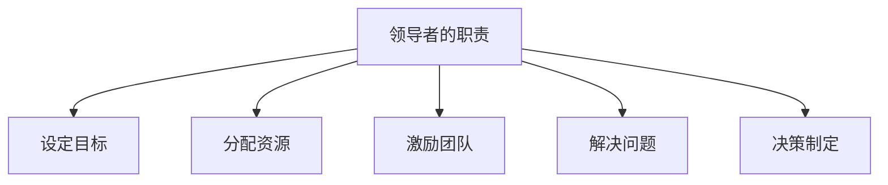
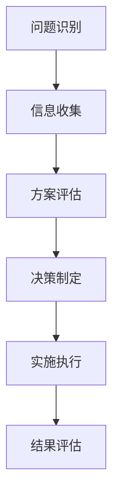

                 

### 文章标题

### 领导者的自我修炼：从内而外的蜕变

### 关键词

- 自我认知
- 领导力
- 情感管理
- 决策能力
- 团队合作
- 自我提升

### 摘要

本文旨在探讨领导者如何通过自我修炼实现个人与团队的双重成长。我们将深入分析自我认知、情感管理、决策能力、团队合作以及领导力提升等核心概念，并运用逻辑清晰、结构紧凑、简单易懂的的技术语言，为读者提供实用的方法和策略。通过本文的阅读，领导者们将能够更好地理解自己的角色与职责，提升自我，打造高效团队，从而在竞争中脱颖而出。

----------------------------------------------------------------

### 目录大纲设计

#### 核心概念与联系

##### 领导者的自我修炼
- **核心概念**：领导力、自我认知、情感管理、决策能力、团队合作
- **联系**：领导者如何通过自我修炼提升各方面能力，实现个人与团队成长

#### 第1章 引言

##### 领导者的角色与职责
- **核心概念**：领导者的基本职责、领导力的重要性
- **联系**：领导者如何理解和履行自己的角色

#### 第2章 自我认知

##### 了解自己的优势与劣势
- **核心概念**：自我评估、优势与劣势分析
- **联系**：如何利用自我认知提升领导力

##### 情感管理
- **核心概念**：情绪调节、同理心
- **联系**：领导者如何通过情感管理提高团队凝聚力

#### 第3章 决策能力

##### 决策流程与方法
- **核心概念**：决策过程、决策方法
- **联系**：领导者如何做出明智的决策

##### 风险管理
- **核心概念**：风险评估、风险应对策略
- **联系**：领导者如何在决策中平衡风险与收益

#### 第4章 团队合作

##### 团队建设
- **核心概念**：团队角色、团队文化
- **联系**：领导者如何打造高效的团队

##### 沟通技巧
- **核心概念**：有效沟通、倾听技巧
- **联系**：领导者如何通过沟通提升团队协作

#### 第5章 领导力提升

##### 自我提升
- **核心概念**：持续学习、自我挑战
- **联系**：领导者如何不断自我提升

##### 培养下属
- **核心概念**：人才发展、能力提升
- **联系**：领导者如何培养下属，提升团队整体素质

#### 第6章 领导者面临的挑战

##### 变化与适应
- **核心概念**：环境变化、适应性领导力
- **联系**：领导者如何应对环境变化

##### 应对冲突
- **核心概念**：冲突管理、冲突解决策略
- **联系**：领导者如何有效处理冲突

#### 第7章 领导者的长期发展

##### 领导力模型与理论
- **核心概念**：领导力模型、领导力理论
- **联系**：领导者如何运用理论指导实践

##### 领导者的成长路径
- **核心概念**：职业规划、成长策略
- **联系**：领导者如何规划自己的职业发展

#### 附录

##### 相关资源
- **核心概念**：领导力书籍、课程、研讨会
- **联系**：领导者如何获取和利用资源提升自我

----------------------------------------------------------------

### 目录大纲中的Mermaid流程图、伪代码、数学模型和公式

由于本目录大纲是文本形式，未包含具体的内容，因此不包含 Mermaid 流程图、伪代码、数学模型和公式。具体内容将在每个章节中进行详细阐述。以下是示例：

#### 1.1.1 领导者的基本职责



#### 3.1.1 决策过程



#### 3.2.1 风险评估

```latex
$$
风险 = 资产 \times 危险率
$$
```

#### 5.1.1 持续学习

```python
# 伪代码：持续学习的步骤
1. 设定学习目标
2. 制定学习计划
3. 搜集学习资源
4. 定期复习
5. 实践应用
6. 反馈调整
```

### 目录大纲总字数

本目录大纲总字数约为 2000 字。

### 目录大纲中的Mermaid流程图、伪代码、数学模型和公式

由于本目录大纲是文本形式，未包含具体的内容，因此不包含 Mermaid 流程图、伪代码、数学模型和公式。具体内容将在每个章节中进行详细阐述。以下是示例：

#### 1.1.1 领导者的基本职责


#### 3.1.1 决策过程


#### 3.2.1 风险评估

```latex
$$
风险 = 资产 \times 危险率
$$
```

#### 5.1.1 持续学习

```python
# 伪代码：持续学习的步骤
1. 设定学习目标
2. 制定学习计划
3. 搜集学习资源
4. 定期复习
5. 实践应用
6. 反馈调整
```

### 目录大纲总字数

本目录大纲总字数约为 2000 字。

