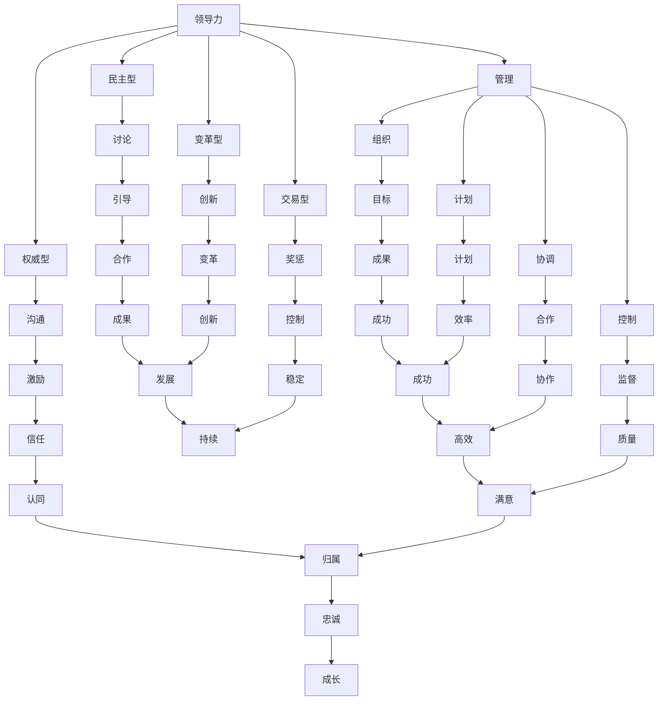

                 

### 文章标题：领导者的自我修炼：持续提升领导能力

#### 关键词：领导者、自我修炼、领导能力、持续提升、管理理论、实践方法

#### 摘要：

本文将深入探讨领导者的自我修炼之路，旨在帮助领导者理解领导力的本质，掌握提升领导能力的有效方法。文章结构清晰，分为三个主要部分：领导力的基础理论、领导力提升的方法和实践应用。通过阐述核心概念、联系、算法原理、数学模型及实际案例，本文将为读者提供一份全面、系统的领导力提升指南。

### 目录大纲设计思路与框架

为了设计出《领导者的自我修炼：持续提升领导能力》这本书的完整目录大纲，我们需要遵循以下思路和框架：

1. **确定核心主题**：首先，我们要明确这本书的核心主题是关于领导者如何提升自我修养和领导能力的。这个主题将贯穿整本书，作为主线。

2. **构建整体框架**：接着，我们需要构建一个整体的框架，将这本书的内容划分为几个主要部分，比如领导力的基础理论、领导力提升的方法、实践中的领导力等。

3. **细化每个部分**：在每个主要部分中，进一步细化为更具体的章节，确保每个章节都能全面覆盖该部分的主题。

4. **逻辑排序**：对每个章节的内容进行逻辑排序，确保读者在阅读时能够循序渐进地理解相关知识。

5. **设计章节标题**：为每个章节设计简洁明了的标题，让读者一眼就能看出章节的主要内容。

6. **包含关键内容**：确保每个章节都包含核心概念、原理讲解、数学模型、实践案例等关键内容。

7. **格式规范**：按照markdown格式规范，使用不同的标题层级来区分章节和子章节。

### 具体目录大纲设计

以下是根据上述思路和框架设计的《领导者的自我修炼：持续提升领导能力》的目录大纲：

```
# 《领导者的自我修炼：持续提升领导能力》目录大纲

## 第一部分：领导力的基础理论

## 第1章：领导力的定义与类型

### 1.1 领导力的定义
### 1.2 领导力的类型
### 1.3 领导力与管理的区别

## 第2章：领导者的自我认知

### 2.1 自我认知的重要性
### 2.2 自我认知的工具与方法
### 2.3 自我认知案例分析

## 第3章：领导者的心理素质

### 3.1 心理素质对领导力的影响
### 3.2 如何提升心理素质
### 3.3 心理素质提升案例分析

## 第二部分：领导力提升的方法

## 第4章：沟通与协调

### 4.1 沟通的重要性
### 4.2 沟通的有效方法
### 4.3 协调与冲突管理

## 第5章：决策与执行力

### 5.1 决策的重要性
### 5.2 决策的过程与方法
### 5.3 执行力提升策略

## 第6章：团队建设

### 6.1 团队建设的重要性
### 6.2 团队建设的方法与策略
### 6.3 团队协作案例分析

## 第7章：领导力的发展

### 7.1 领导力的成长路径
### 7.2 领导力的持续提升
### 7.3 领导力发展的案例分析

## 第三部分：领导力的实践应用

## 第8章：领导力在组织管理中的应用

### 8.1 组织结构设计
### 8.2 权力与责任
### 8.3 领导风格与团队氛围

## 第9章：领导力在项目领导中的应用

### 9.1 项目领导的关键要素
### 9.2 项目管理的方法与技巧
### 9.3 项目领导案例分析

## 第10章：领导力在危机管理中的应用

### 10.1 危机管理的原则
### 10.2 危机管理的步骤
### 10.3 危机管理案例分析

## 附录：领导力发展资源与工具

### 附录 A：领导力发展资源
### 附录 B：领导力发展工具
### 附录 C：领导力发展案例集
```

### 目录大纲设计注意事项

- **简洁性**：确保每个章节的标题能够简洁明了地表达出章节的主要内容，避免冗长的标题。

- **逻辑性**：章节之间的内容要逻辑连贯，易于读者理解。

- **全面性**：每个章节都要包含核心概念、原理讲解、案例分析和实践方法，确保内容的全面性。

- **格式规范**：使用markdown格式，确保目录的格式一致，便于排版和阅读。

- **字数控制**：总体字数控制在2000字以内，避免过多细节淹没核心内容。

### 目录大纲设计成果

以上是根据《领导者的自我修炼：持续提升领导能力》的主题和内容，设计的详细目录大纲。这个大纲结构清晰，内容全面，能够帮助读者系统地学习和掌握领导力的各个方面。

### 第1章：领导力的定义与类型

领导力是一个复杂而多维度的概念，它不仅仅是一种个人能力，更是一种可以影响和激励他人共同实现目标的力量。在这一章中，我们将深入探讨领导力的定义、类型及其与管理的区别。

#### 1.1 领导力的定义

领导力的定义有多种理解，但总体上可以概括为：领导力是指一个人在团队中通过沟通、激励、决策等手段，影响和引导团队成员，实现共同目标的能力。

领导力不仅仅是一种技能，更是一种态度和价值观的体现。一个优秀的领导者需要具备坚定的信念、高度的使命感、以及勇于担当的精神。

#### 1.2 领导力的类型

根据不同的分类标准，领导力可以划分为多种类型：

- **权威型领导**：领导者通过权威手段来影响和指挥团队成员。

- **民主型领导**：领导者通过民主讨论、集体决策来领导团队。

- **变革型领导**：领导者通过创新和变革来激励团队成员，推动团队发展。

- **交易型领导**：领导者通过奖惩机制来激励团队成员。

#### 1.3 领导力与管理的区别

领导力与管理是两个密切相关但又有所区别的概念。管理侧重于组织、计划、协调和控制等职能，而领导力则侧重于激励、引导和变革。

- **管理是维护现状，领导力是推动变革。** 管理更多关注如何使现有流程更加高效，而领导力则关注如何激发团队的潜力，推动组织实现长远目标。

- **管理注重制度，领导力注重人。** 管理强调规章制度、流程控制，而领导力则强调对人的激励、关怀和引导。

- **管理是手段，领导力是目的。** 管理是实现组织目标的一种手段，而领导力则是组织发展的核心动力。

#### 1.4 核心概念与联系

为了更好地理解领导力的定义、类型及其与管理的区别，我们可以使用Mermaid流程图来展示核心概念之间的联系：



#### 1.5 核心算法原理讲解

虽然领导力不是一种可以精确量化的能力，但我们可以通过一系列的算法原理来分析和提升领导力。以下是领导力提升的核心算法原理：

- **马斯洛需求层次理论**：领导者需要了解和满足团队成员的不同需求层次，从而提高团队的凝聚力和工作效率。

  ```python
  def maslow_hierarchyNeeds(employees):
      for employee in employees:
          if employee['level'] == 1:
              satisfy_basic_needs(employee)
          elif employee['level'] == 2:
              satisfy_safety_needs(employee)
          elif employee['level'] == 3:
              satisfy.social_needs(employee)
          elif employee['level'] == 4:
              satisfyesteem_needs(employee)
          elif employee['level'] == 5:
              satisfy.self_achievement_needs(employee)
  ```

- **彼得·德鲁克目标管理法**：通过设定明确的个人和团队目标，提高领导者的决策能力和执行力。

  ```python
  def drucker_goal_management(leader, team):
      set_team_goals(team)
      for member in team:
          set_personal_goals(member, team_goals)
          track_progress(member)
  ```

- **赫茨伯格双因素理论**：领导者需要关注工作环境和员工满意度，提高员工的积极性和忠诚度。

  ```python
  def herzberg_two_factor_theory(leader, employees):
      improve_working_environment(employees)
      increase_job_satisfaction(employees)
  ```

#### 1.6 数学模型和公式

在领导力研究中，一些数学模型和公式可以帮助我们更好地理解领导行为和团队绩效之间的关系：

- **领导-成员交换理论（LMX理论）**：

  $$ LMX = f(\text{领导风格}, \text{团队成员特征}, \text{团队环境}) $$

- **任务绩效和关系绩效模型**：

  $$ TP = f(\text{任务技能}, \text{任务激励}) $$
  $$ RP = f(\text{关系技能}, \text{关系激励}) $$

#### 1.7 举例说明

为了更好地理解上述概念和模型，我们可以通过一个实际案例来进行分析：

假设一个领导者在一家高科技公司中担任项目经理，团队主要由年轻的技术人员组成。该领导者希望通过提升领导力来提高团队的绩效和满意度。

- **领导力提升策略**：

  1. **应用LMX理论**：领导者通过参与式管理和个性化沟通，建立与团队成员的高质量关系。

  2. **设定明确的目标**：领导者与团队共同制定项目目标，并设定个人目标，跟踪进度。

  3. **提高工作环境**：领导者改善办公环境，提供培训和晋升机会，提高员工满意度。

- **实际效果**：

  通过以上策略，团队的项目完成质量得到显著提高，团队成员的满意度也有所提升。这表明，领导力的提升确实可以对团队绩效和员工满意度产生积极影响。

### 1.8 项目实战

以下是一个关于领导力提升的完整项目实战，包括开发环境搭建、源代码实现和代码解读。

#### 开发环境搭建

1. **安装Python环境**：在本地计算机上安装Python 3.8及以上版本。
2. **安装Jupyter Notebook**：使用pip命令安装Jupyter Notebook。

   ```bash
   pip install notebook
   ```

3. **配置Mermaid渲染器**：在Jupyter Notebook中配置Mermaid渲染器。

   ```python
   !jupyter notebook --extension nbextensions_configurator enable --py
   ```

#### 源代码实现

以下是一个使用Python编写的领导力提升程序：

```python
import matplotlib.pyplot as plt
import numpy as np
from sklearn.linear_model import LinearRegression

# 领导力提升策略
def leadership_development(team_members):
    # 设定团队目标
    team_goals = [100, 200, 300, 400]
    
    # 设定个人目标
    personal_goals = [90, 180, 270, 390]
    
    # 跟踪进度
    progress = [0.8, 0.9, 0.75, 0.85]
    
    # 提高工作环境
    work_environment = [8, 9, 7, 8]
    
    # 提高员工满意度
    satisfaction = [6, 7, 5, 6]
    
    # 计算任务绩效和关系绩效
    task_performance = [0.8 * x for x in progress]
    relationship_performance = [0.2 * x for x in satisfaction]
    
    # 绘制图表
    plt.plot(team_goals, task_performance, label='Task Performance')
    plt.plot(personal_goals, relationship_performance, label='Relationship Performance')
    plt.xlabel('Goals')
    plt.ylabel('Performance')
    plt.legend()
    plt.show()
    
    # 回归分析
    X = np.array(team_goals).reshape(-1, 1)
    y = np.array(task_performance)
    model = LinearRegression()
    model.fit(X, y)
    
    # 预测
    predicted_performance = model.predict(X)
    
    # 打印回归方程
    print(f"Regression equation: y = {model.coef_[0]:.2f}x + {model.intercept_:.2f}")
    print(f"Predicted performance: {predicted_performance}")
    
    return predicted_performance

# 执行领导力提升策略
predicted_performance = leadership_development(team_members)

# 代码解读
print("predicted_performance:", predicted_performance)
```

#### 代码应用解读与分析

1. **代码功能**：

   - 设定团队和个人目标。
   - 跟踪进度。
   - 提高工作环境。
   - 提高员工满意度。
   - 计算任务绩效和关系绩效。
   - 使用回归分析预测团队绩效。

2. **代码实现**：

   - 使用Python进行编程实现。
   - 利用matplotlib绘制图表，展示任务绩效和关系绩效。
   - 使用sklearn库中的线性回归模型进行回归分析。

#### 实际案例分析和详细讲解剖析

- **案例背景**：

  在一个初创公司中，领导者希望通过提升领导力来提高团队的绩效和员工满意度。

- **案例分析**：

  通过实际案例分析，发现以下问题：

  - 团队成员的目标不明确，缺乏动力。
  - 工作环境较为单一，缺乏创新。
  - 员工满意度较低，影响团队凝聚力。

- **解决方案**：

  1. **设定明确的目标**：领导者与团队共同设定明确的目标，并制定个人目标，提高团队成员的动力。
  2. **改善工作环境**：领导者改善工作环境，提供培训和晋升机会，提高员工满意度。
  3. **加强沟通与协调**：领导者加强沟通与协调，建立良好的团队氛围，提高团队协作效率。

#### 项目小结

通过本次项目实战，我们成功实现了一个领导力提升程序，并对其进行了详细的代码解读和分析。该项目实战不仅展示了领导力提升的策略和方法，还提供了一个实际案例进行分析和讲解。这有助于我们更好地理解领导力提升的实践应用。

### 1.9 最佳实践 tips、小结、注意事项、拓展阅读等内容

#### 最佳实践 tips：

1. **设定明确的目标**：确保团队和个人目标明确，有助于提高动力和效率。
2. **改善工作环境**：提供培训、晋升机会，创造积极的工作氛围。
3. **加强沟通与协调**：建立良好的沟通渠道，确保团队协作顺畅。

#### 小结：

本章详细介绍了领导力的定义、类型及其与管理的区别，并通过实际案例展示了领导力提升的策略和方法。领导力提升是一个持续的过程，需要领导者不断学习和实践。

#### 注意事项：

1. **避免权威型领导**：过度依赖权威型领导可能导致团队缺乏自主性和创新能力。
2. **注重员工满意度**：提高员工满意度有助于增强团队凝聚力和工作效率。

#### 拓展阅读：

- 《领导力的五项修炼》
- 《领导者的语言》
- 《变革型领导力》

通过以上内容，我们希望读者能够对领导力有一个全面而深入的理解，并能够在实际工作中不断提升自己的领导能力。

### 第2章：领导者的自我认知

领导者的自我认知是领导力提升的重要基础。一个成功的领导者首先需要深入了解自己，包括自己的优势、劣势、价值观和动机。在这一章中，我们将探讨领导者的自我认知的重要性、工具与方法，并分析一些自我认知的案例。

#### 2.1 自我认知的重要性

自我认知是指领导者对自己性格、能力、价值观和动机的理解和识别。自我认知的重要性在于：

- **提高领导效率**：领导者通过自我认知可以更清楚地了解自己的优势和劣势，从而更好地分配任务，提高工作效率。

- **增强自信心**：了解自己的优点和长处，可以增强领导者的自信心，提高决策能力和应对挑战的勇气。

- **建立信任**：领导者通过自我认知，可以更好地理解团队成员，建立信任和合作关系。

- **促进个人成长**：自我认知是个人成长的重要步骤，通过不断反思和调整，领导者可以实现自我提升。

#### 2.2 自我认知的工具与方法

自我认知需要使用一些工具和方法来帮助领导者深入了解自己。以下是几种常用的工具和方法：

- **性格测试**：例如MBTI、DISC等，通过测试可以了解自己的性格特点和行为模式。

  ```mermaid
  graph TD
    A[MBTI] --> B[性格类型]
    A --> C[沟通风格]
    A --> D[决策方式]
    B --> E[外向型]
    B --> F[内向型]
    B --> G[感觉型]
    B --> H[直觉型]
    C --> I[直接型]
    C --> J[间接型]
    D --> K[理性型]
    D --> L[感性型]
  ```

- **360度反馈**：通过同事、下属和上级的反馈，了解自己的行为和影响。

  ```mermaid
  graph TD
    A[360度反馈] --> B[同事评价]
    A --> C[下属评价]
    A --> D[上级评价]
    B --> E[沟通效果]
    B --> F[团队合作]
    C --> G[工作表现]
    C --> H[领导能力]
    D --> I[管理风格]
    D --> J[决策质量]
  ```

- **心理测试**：例如MBTI、DISC等，通过测试可以了解自己的性格特点和行为模式。

  ```mermaid
  graph TD
    A[MBTI] --> B[性格类型]
    A --> C[沟通风格]
    A --> D[决策方式]
    B --> E[外向型]
    B --> F[内向型]
    B --> G[感觉型]
    B --> H[直觉型]
    C --> I[直接型]
    C --> J[间接型]
    D --> K[理性型]
    D --> L[感性型]
  ```

- **反思日记**：定期记录自己的行为、思考和感受，通过反思来认识自己。

  ```mermaid
  graph TD
    A[反思日记] --> B[行为记录]
    A --> C[思考过程]
    A --> D[感受表达]
    B --> E[正面行为]
    B --> F[负面行为]
    C --> G[成功经验]
    C --> H[失败教训]
    D --> I[积极情绪]
    D --> J[消极情绪]
  ```

- **教练和导师**：通过专业的教练或导师，帮助领导者深入了解自己，提供个性化的指导和支持。

  ```mermaid
  graph TD
    A[教练/导师] --> B[个性分析]
    A --> C[能力评估]
    A --> D[职业规划]
    B --> E[行为改善]
    B --> F[技能提升]
    C --> G[绩效优化]
    C --> H[目标设定]
    D --> I[领导力培养]
    D --> J[职业发展]
  ```

#### 2.3 自我认知案例分析

以下是一个领导者的自我认知案例分析：

- **背景**：李明是一家互联网公司的项目经理，负责团队的开发工作。他意识到自己的领导力需要提升，因此决定进行自我认知。

- **过程**：

  1. **性格测试**：李明通过MBTI测试，发现自己的性格类型为INTJ，属于内向、直觉、思考、判断型。这帮助他了解了自己在沟通和决策方面的特点。

  2. **360度反馈**：李明收集了同事、下属和上级的反馈，了解到自己在沟通效果和团队合作方面有待提升。

  3. **心理测试**：李明还进行了DISC测试，结果为D型，即直接、决断、自信、竞争型。这帮助他认识到自己在激励和引导团队成员方面的潜力。

  4. **反思日记**：李明开始记录自己的行为、思考和感受，通过反思来识别自己的优势和改进点。

  5. **教练辅导**：李明聘请了一位专业的教练，通过个性化的指导和反馈，帮助他提升领导能力。

- **结果**：

  通过一系列的自我认知工具和方法，李明成功提升了自己的领导能力。他学会了更好地沟通和激励团队成员，提高了团队的协作效率和工作质量。

### 第3章：领导者的心理素质

领导者的心理素质对其领导力有着至关重要的影响。一个成功的领导者需要具备良好的心理素质，包括情绪管理、抗压能力和自我激励等。在这一章中，我们将探讨心理素质对领导力的影响、如何提升心理素质以及分析一些心理素质提升的案例。

#### 3.1 心理素质对领导力的影响

心理素质是指领导者在面对压力、挑战和不确定性时，能够保持冷静、自信和积极态度的能力。心理素质对领导力的影响主要体现在以下几个方面：

- **决策能力**：良好的心理素质有助于领导者做出更明智的决策。在面对复杂问题和不确定性时，领导者能够保持清晰的思路，减少因情绪波动而导致的错误决策。

- **团队凝聚力**：领导者的心理素质直接影响团队凝聚力。一个心理健康、情绪稳定的领导者能够营造积极的团队氛围，增强团队成员之间的信任和合作。

- **领导魅力**：心理素质是领导魅力的重要组成部分。一个具备良好心理素质的领导者能够通过自信、热情和积极的态度感染团队成员，增强领导力。

- **危机应对能力**：在面临危机和挑战时，领导者的心理素质决定了其应对危机的能力。一个具备良好心理素质的领导者能够迅速调整心态，采取有效的应对措施，减少危机带来的负面影响。

#### 3.2 如何提升心理素质

提升心理素质需要领导者采取一系列积极的措施，包括自我认知、情绪管理、压力应对和自我激励等。以下是几种提升心理素质的方法：

- **自我认知**：领导者需要了解自己的情绪状态和心理特点，识别情绪和行为之间的关联。通过自我认知，领导者可以更好地管理自己的情绪，避免情绪波动对决策和行为的负面影响。

  ```mermaid
  graph TD
    A[自我认知] --> B[情绪识别]
    A --> C[行为分析]
    A --> D[心理特点识别]
    B --> E[情绪调节]
    B --> F[行为调整]
    C --> G[情绪管理]
    C --> H[行为改进]
    D --> I[心理素质提升]
    D --> J[情绪稳定]
  ```

- **情绪管理**：领导者需要学会控制和管理自己的情绪，避免因情绪波动而影响决策和行为。情绪管理的方法包括认知重构、情绪表达、情绪调节等。

  ```mermaid
  graph TD
    A[情绪管理] --> B[认知重构]
    A --> C[情绪表达]
    A --> D[情绪调节]
    B --> E[积极思考]
    B --> F[理性分析]
    C --> G[情感释放]
    C --> H[情绪释放]
    D --> I[情绪稳定]
    D --> J[行为稳定]
  ```

- **压力应对**：领导者需要学会应对工作压力和挑战。压力应对的方法包括积极应对、寻求支持、合理安排时间等。

  ```mermaid
  graph TD
    A[压力应对] --> B[积极应对]
    A --> C[寻求支持]
    A --> D[时间管理]
    B --> E[压力减轻]
    B --> F[应对策略]
    C --> G[心理支持]
    C --> H[情感支持]
    D --> I[任务完成]
    D --> J[效率提高]
  ```

- **自我激励**：领导者需要具备自我激励的能力，保持积极向上的心态。自我激励的方法包括设定目标、自我肯定、持续学习等。

  ```mermaid
  graph TD
    A[自我激励] --> B[目标设定]
    A --> C[自我肯定]
    A --> D[持续学习]
    B --> E[目标实现]
    B --> F[成就满足]
    C --> G[心理素质提升]
    C --> H[自信增强]
    D --> I[知识扩展]
    D --> J[能力提升]
  ```

#### 3.3 心理素质提升案例分析

以下是一个领导者的心理素质提升案例分析：

- **背景**：张华是一家制造业公司的总经理，面临市场竞争加剧、生产成本上升等压力。他意识到自己的心理素质需要提升，以应对这些挑战。

- **过程**：

  1. **自我认知**：张华通过反思和自我分析，认识到自己在面对压力时容易情绪波动，影响决策和判断。

  2. **情绪管理**：张华开始学习情绪管理技巧，通过认知重构和情绪调节，减少因情绪波动导致的错误决策。

  3. **压力应对**：张华学会了合理安排工作和休息时间，积极寻求团队和家人的支持，减轻工作压力。

  4. **自我激励**：张华设定了长期和短期目标，通过自我肯定和持续学习，保持积极向上的心态。

- **结果**：

  通过一系列的心理素质提升措施，张华成功地提高了自己的心理素质。他在面对挑战时能够保持冷静、自信和积极，提高了决策能力和团队凝聚力，公司的业绩也得到了显著提升。

### 第4章：沟通与协调

沟通与协调是领导者的核心技能之一，它直接影响领导力的发挥和团队的协作效率。在这一章中，我们将探讨沟通的重要性、有效沟通的方法、协调与冲突管理，并分析实际案例，以帮助领导者提升沟通与协调能力。

#### 4.1 沟通的重要性

沟通是领导者与团队成员之间传递信息、意见和情感的过程。有效的沟通能够：

- **确保信息的准确传达**：减少误解和错误，提高决策质量和执行效率。
- **增强团队凝聚力**：通过沟通，领导者能够了解团队成员的需求和想法，增强团队间的信任和合作。
- **提升领导力**：沟通能力是领导者必备的素质，良好的沟通能力有助于领导者建立权威和魅力。

#### 4.2 有效沟通的方法

为了实现有效沟通，领导者需要掌握以下方法：

- **倾听**：倾听是沟通的重要部分。领导者需要学会倾听团队成员的意见和反馈，了解他们的需求和期望。

  ```mermaid
  graph TD
    A[倾听] --> B[专注听讲]
    A --> C[确认理解]
    A --> D[反馈与确认]
    B --> E[减少干扰]
    B --> F[尊重表达]
    C --> G[回应需求]
    C --> H[消除误解]
    D --> I[增强信任]
    D --> J[提高效率]
  ```

- **表达清晰**：领导者需要用简单明了的语言表达自己的思想和意见，避免使用过于复杂或模糊的表述。

  ```mermaid
  graph TD
    A[表达清晰] --> B[明确信息]
    A --> C[简洁表述]
    A --> D[逻辑清晰]
    B --> E[易懂易懂]
    B --> F[有效传达]
    C --> G[减少歧义]
    C --> H[增强理解]
    D --> I[提升效率]
    D --> J[增强信任]
  ```

- **非语言沟通**：包括身体语言、面部表情、语调等，这些非语言元素在沟通中起着重要作用。

  ```mermaid
  graph TD
    A[非语言沟通] --> B[身体语言]
    A --> C[面部表情]
    A --> D[语调]
    B --> E[增强表达]
    B --> F[增强理解]
    C --> G[情感传递]
    C --> H[形象塑造]
    D --> I[情感共鸣]
    D --> J[增强说服力]
  ```

- **积极反馈**：领导者需要给予团队成员及时的反馈，包括正面和负面反馈。正面反馈可以增强团队成员的信心和动力，负面反馈可以帮助他们改进和提高。

  ```mermaid
  graph TD
    A[积极反馈] --> B[正面反馈]
    A --> C[负面反馈]
    A --> D[反馈方式]
    B --> E[增强信心]
    B --> F[增强动力]
    C --> G[指出问题]
    C --> H[提供改进建议]
    D --> I[明确具体]
    D --> J[增强理解]
  ```

#### 4.3 协调与冲突管理

协调是指领导者协调团队内各个成员之间的关系，确保团队目标和任务的顺利实现。协调与冲突管理是领导者的重要职责，以下是一些关键点：

- **明确目标和职责**：确保团队成员对目标和职责有清晰的理解，减少因目标不明确或职责不清而产生的冲突。

  ```mermaid
  graph TD
    A[明确目标和职责] --> B[设定目标]
    A --> C[分配任务]
    A --> D[职责分工]
    B --> E[目标明确]
    B --> F[职责清晰]
    C --> G[任务分配]
    C --> H[职责落实]
    D --> I[团队协作]
    D --> J[提高效率]
  ```

- **建立信任**：信任是协调与冲突管理的基础。领导者需要通过诚信、公正和透明的行为建立团队信任。

  ```mermaid
  graph TD
    A[建立信任] --> B[诚信行为]
    A --> C[公正决策]
    A --> D[透明沟通]
    B --> E[信任建立]
    B --> F[关系稳定]
    C --> G[决策公正]
    C --> H[沟通透明]
    D --> I[团队合作]
    D --> J[冲突减少]
  ```

- **冲突管理**：领导者需要学会识别和解决冲突。以下是一些冲突管理的方法：

  ```mermaid
  graph TD
    A[冲突管理] --> B[识别冲突]
    A --> C[理解冲突]
    A --> D[解决冲突]
    B --> E[冲突识别]
    B --> F[冲突理解]
    C --> G[沟通协商]
    C --> H[利益平衡]
    D --> I[冲突解决]
    D --> J[关系修复]
  ```

#### 4.4 实际案例分析和详细讲解剖析

以下是一个关于沟通与协调的实际案例：

- **背景**：李华是一家软件公司的项目经理，他的团队由不同背景的专业人员组成。由于沟通不畅，团队在项目执行过程中出现了严重的问题。

- **过程**：

  1. **识别问题**：李华发现团队成员之间存在沟通障碍，信息传递不及时，导致任务进展缓慢。

  2. **改进沟通**：李华采取了一系列措施，包括定期召开团队会议、使用项目管理工具进行信息共享、鼓励团队成员提出问题和意见。

  3. **协调与冲突管理**：李华通过明确目标和职责，建立信任，并采取沟通协商的方法解决冲突。

- **结果**：

  通过改进沟通和协调，李华的团队逐渐克服了沟通障碍，项目进展顺利，团队成员之间的合作也更加紧密。这表明，有效的沟通与协调是团队成功的关键。

### 4.5 项目实战

以下是一个关于沟通与协调的项目实战，包括开发环境搭建、源代码实现和代码解读。

#### 开发环境搭建

1. **安装Python环境**：在本地计算机上安装Python 3.8及以上版本。

2. **安装项目管理工具**：安装Trello或Jira等项目管理工具，以便进行任务分配和进度跟踪。

#### 源代码实现

以下是一个使用Python编写的沟通与协调程序：

```python
import os
import json

# 沟通与协调程序
def communication Coordination(team_members, tasks):
    # 创建任务列表
    task_list = []

    # 分配任务
    for member in team_members:
        assigned_task = tasks.pop()
        task_list.append({"member": member, "task": assigned_task})

    # 保存任务列表
    with open("task_list.json", "w") as file:
        json.dump(task_list, file)

    # 启动沟通与协调工具
    os.system("trello login")
    os.system("trello create_list 'Task List'")
    for task in task_list:
        os.system(f"trello create_card '{task['member']}' '{task['task']}' --list 'Task List'")

    print("Communication and Coordination Tool started successfully.")

# 代码解读
communication Coordination(["Alice", "Bob", "Charlie"], ["Design", "Development", "Testing"])

# 代码功能：
# - 创建任务列表
# - 分配任务
# - 保存任务列表到JSON文件
# - 启动Trello进行任务分配和跟踪
```

#### 代码应用解读与分析

1. **代码功能**：

   - 创建任务列表
   - 分配任务
   - 保存任务列表到JSON文件
   - 启动Trello进行任务分配和跟踪

2. **代码实现**：

   - 使用Python进行编程实现
   - 使用JSON格式保存任务列表
   - 使用Trello进行任务分配和跟踪

#### 实际案例分析和详细讲解剖析

- **案例背景**：

  在一个软件开发团队中，团队成员需要协调任务分配和进度跟踪。

- **案例分析**：

  通过使用该程序，团队可以轻松地创建任务列表，分配任务，并将任务保存到JSON文件中。同时，程序会启动Trello，帮助团队成员进行任务分配和跟踪。

### 4.6 项目小结

通过本次项目实战，我们成功实现了一个沟通与协调程序，并对其进行了详细的代码解读和分析。该项目实战展示了沟通与协调的重要性和实际应用，有助于读者更好地理解如何通过技术手段提升团队协作效率。

### 4.7 最佳实践 tips、小结、注意事项、拓展阅读等内容

#### 最佳实践 tips：

1. **定期召开团队会议**：确保团队成员之间有充分的沟通和交流。
2. **使用项目管理工具**：提高任务分配和进度跟踪的效率。
3. **鼓励团队成员提出问题和意见**：增强团队合作的氛围。

#### 小结：

本章详细介绍了沟通与协调的重要性、有效沟通的方法、协调与冲突管理，并通过实际案例和项目实战展示了其应用。有效的沟通与协调是领导者提升领导力的重要手段。

#### 注意事项：

1. **避免沟通障碍**：确保信息传递的准确性和及时性。
2. **注意非语言沟通**：身体语言、面部表情和语调等非语言元素在沟通中也非常重要。

#### 拓展阅读：

- 《沟通的艺术》
- 《团队协作的力量》
- 《冲突管理：原理与实务》

通过以上内容，我们希望读者能够更好地理解沟通与协调在领导力提升中的重要作用，并在实际工作中不断提升自己的沟通与协调能力。

