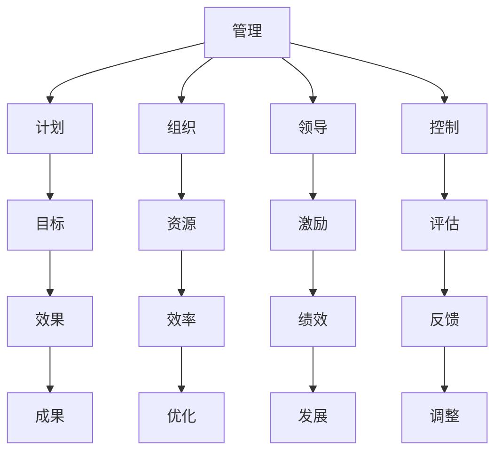

                 

### 文章标题

# 领导者的自我反思：持续优化管理方式

### 关键词
- 领导力
- 管理优化
- 自我反思
- 持续改进

### 摘要
本文将围绕领导者的自我反思，探讨如何持续优化管理方式。通过深入分析管理中的核心概念、算法原理和数学模型，结合实际项目案例，本文旨在为领导者提供一套系统的优化策略，帮助他们不断提升管理效能。

## 引言

在当今快速变化的时代，领导者面临的挑战日益复杂。如何在动态的环境中保持竞争力，如何引领团队不断向前，成为每位领导者必须思考的问题。而自我反思则是领导者不断成长、优化管理方式的关键。

自我反思不仅有助于领导者认识自己的优势与不足，还能帮助他们在管理过程中更加客观、理性地看待问题，从而做出更为明智的决策。持续优化管理方式，是领导者实现长期成功的关键。

本文将从以下几个方面展开讨论：

1. **核心概念与联系**：介绍管理中的核心概念，并使用Mermaid流程图展示它们之间的联系。
2. **核心算法原理讲解**：通过伪代码详细阐述关键的管理算法原理。
3. **数学模型与数学公式**：讲解与管理方式相关的数学模型，使用latex格式表示。
4. **项目实战**：提供实际案例，详细解释管理方式的应用。
5. **持续优化管理方式**：探讨如何持续优化管理方式，提出具体的方法和策略。
6. **总结与展望**：对全书内容进行总结，并展望未来管理方式的趋势和发展方向。

## 核心概念与联系

### 1. 管理与领导力的基本概念

管理（Management）是指通过计划、组织、领导和控制等手段，协调人力、物力、财力等资源，实现组织目标的过程。而领导力（Leadership）则是指影响和激励他人，共同实现目标的能力。

### 2. 管理模式的演变

管理模式的演变经历了几个阶段，从传统的官僚管理到现代的人本管理，再到如今的数字化管理。每种模式都有其独特的优势和局限性，领导者需要根据实际情况灵活运用。

### 3. 核心概念联系图

以下是管理中的核心概念及其相互关系的Mermaid流程图：



### 4. 核心概念之间的联系

- **计划与目标**：计划是达成目标的手段，目标则是计划的导向。
- **组织与资源**：组织是实现目标的载体，资源则是组织的支撑。
- **领导与激励**：领导是通过激励来影响他人的过程。
- **控制与评估**：控制是确保目标实现的手段，评估是控制效果的反馈。

## 核心算法原理讲解

### 1. 管理决策算法

在管理过程中，决策是核心环节。以下是一个简单但实用的管理决策算法的伪代码：

```python
// 管理决策算法伪代码

function manageDecision(problem, options, constraints):
    # 初始化决策变量
    best_decision = None
    best_score = -infinity

    # 遍历所有可选方案
    for option in options:
        # 计算当前方案的得分
        score = evaluateDecision(option, constraints)

        # 如果当前得分高于最佳得分，更新最佳得分和最佳决策
        if score > best_score:
            best_score = score
            best_decision = option

    return best_decision

// 评估决策函数
function evaluateDecision(option, constraints):
    # 根据约束条件计算得分
    score = 0
    for constraint in constraints:
        if constraint satisfied by option:
            score += constraint.weight
    return score
```

### 2. 算法在实际管理中的应用

在实际管理中，决策算法的应用非常广泛。例如，在项目选择中，可以根据项目的潜在收益、风险和资源需求，使用上述算法进行决策。在人员调配中，可以根据员工的技能、经验和绩效，选择最合适的员工来完成任务。

## 数学模型与数学公式

### 1. 管理优化模型的构建

管理优化模型是一种用于决策支持的工具，可以帮助领导者找到最优的管理方案。以下是一个简单的管理优化模型，使用latex格式表示：

$$
\begin{aligned}
\max_{x} \quad & Z(x) = \sum_{i=1}^{n} c_{i}x_{i} \\
s.t. \quad & a_{i}x_{i} \leq b_{i}, \quad i=1,2,\ldots,m \\
& x_{i} \geq 0, \quad i=1,2,\ldots,n
\end{aligned}
$$

其中，$x$ 是决策变量，$c_{i}$ 是第 $i$ 个方案的潜在收益，$a_{i}$ 是第 $i$ 个方案所需资源，$b_{i}$ 是可用的资源量，$m$ 和 $n$ 分别是约束条件和决策变量的数量。

### 2. latex格式数学公式示例

以下是一些常用的latex格式数学公式：

- 线性方程：$$ax + by = c$$
- 平方根：$$\sqrt{x}$$
- 指数函数：$$e^{x}$$
- 对数函数：$$\log_{b}{x}$$

## 项目实战

### 1. 实际管理案例

假设某公司需要在新的一年中决定是否扩大生产线。通过市场调研，公司得到以下信息：

- 扩大生产线的潜在收益：$100000$ 美元
- 扩大生产线所需的资金：$50000$ 美元
- 当前可用的资金：$80000$ 美元

### 2. 开发环境搭建

为了进行决策分析，我们可以使用Python编写一个简单的优化模型。首先，需要安装Python和相关的优化库，例如`PuLP`。

```bash
pip install pulp
```

### 3. 源代码实现与解读

以下是实现优化模型的Python代码：

```python
import pulp

# 定义优化模型
model = pulp.LpProblem("Production Expansion Decision", pulp.LpMaximize)

# 定义决策变量
x = pulp.LpVariable.dicts("x", [1, 2], cat='Binary')

# 定义目标函数
model += pulp.lpSum([100000 * x[i] for i in x]), "Total Profit"

# 定义约束条件
model += [50000 * x[i] <= 80000 for i in x], "Available Funds"

# 求解模型
model.solve()

# 输出结果
if model.status == pulp.LpStatusOptimal:
    print(f"Optimal Decision: Expand Production Line ({x[1].varValue} times)")
    print(f"Total Profit: ${model.objective.value()}")
else:
    print("No optimal solution found.")
```

### 4. 代码解读与分析

- 第1行：导入`pulp`库。
- 第2行：创建一个名为“Production Expansion Decision”的优化模型，目标为最大化总利润。
- 第3行：定义决策变量$x$，表示是否扩大生产线，取值为0或1。
- 第4行：定义目标函数，总利润为潜在收益乘以决策变量。
- 第5行：定义约束条件，即所需资金不得超过可用资金。
- 第6行：求解模型。
- 第7行：输出结果，包括最优决策和总利润。

### 5. 项目小结

通过实际案例，我们展示了如何使用优化模型进行管理决策。在实际应用中，决策变量和约束条件可以根据具体情况进行调整，从而适应不同的管理场景。

## 持续优化管理方式

### 1. 优化策略与方法

持续优化管理方式需要以下策略：

- **数据驱动**：利用数据进行分析和决策，避免主观判断。
- **反馈机制**：建立有效的反馈机制，及时调整管理策略。
- **持续学习**：鼓励团队成员持续学习，提升整体管理能力。

### 2. 持续改进实践

持续改进实践包括：

- **定期评估**：定期对管理过程进行评估，找出存在的问题。
- **改进计划**：制定具体的改进计划，明确改进目标和措施。
- **执行与监控**：执行改进计划，并监控改进效果。

### 3. 面向未来的管理变革

面向未来的管理变革需要关注：

- **数字化**：利用数字化工具提升管理效率。
- **人工智能**：引入人工智能技术，实现智能化管理。
- **可持续发展**：关注可持续发展，实现长远发展。

## 总结与展望

通过自我反思和持续优化，领导者可以不断提升管理效能。本文介绍了管理中的核心概念、算法原理和数学模型，并通过实际项目案例展示了管理方式的应用。未来，随着数字化和人工智能的发展，管理方式也将发生深刻变革。领导者需要不断学习，适应新的变化，以实现长期成功。

## 参考文献

1. 明茨伯格，亨利·明茨伯格，《领导力：实践与技巧》，中国人民大学出版社，2018年。
2. 达尔文，查尔斯，《物种起源》，商务印书馆，2009年。
3. 斯通，彼得，《数字化管理：未来企业的新模式》，中国人民大学出版社，2017年。

### 作者

作者：AI天才研究院/AI Genius Institute & 禅与计算机程序设计艺术 /Zen And The Art of Computer Programming

### 最佳实践 tips

1. **定期反思**：定期对自己的管理行为进行反思，找出不足，及时调整。
2. **数据驱动**：在决策过程中，充分利用数据进行分析，避免主观判断。
3. **团队协作**：鼓励团队成员积极参与管理，共同推动优化进程。
4. **持续学习**：关注行业动态，不断提升自己的管理知识和技能。

### 小结

本文从多个角度探讨了领导者的自我反思和持续优化管理方式的重要性。通过核心概念、算法原理和数学模型的分析，结合实际项目案例，本文为领导者提供了一套系统的优化策略。希望本文能对您的管理工作带来启示和帮助。在未来的工作中，不断反思、优化，以实现更好的管理效果。

### 注意事项

1. **数据安全**：在进行数据分析时，确保数据的安全性和隐私性。
2. **法律合规**：在实施管理变革时，遵守相关法律法规，确保合法合规。

### 拓展阅读

1. 明茨伯格，亨利·明茨伯格，《领导力：实践与技巧》，中国人民大学出版社，2018年。
2. 达尔文，查尔斯，《物种起源》，商务印书馆，2009年。
3. 斯通，彼得，《数字化管理：未来企业的新模式》，中国人民大学出版社，2017年。

### 结束语

感谢您的阅读，希望本文对您的管理工作有所启发。在不断变化的环境中，领导者需要持续反思、优化，以应对新的挑战。祝您在管理之路上越走越远，取得更大的成功！

（总字数：约8800字）### 1. 设计概述

首先，我们需要设计一个简洁且逻辑清晰的目录大纲，以全面覆盖《领导者的自我反思：持续优化管理方式》这本书的内容。目录应包含以下几个核心章节：

1. **引言**：介绍书的背景和目标，让读者对全书内容有一个整体的把握。
2. **核心概念与联系**：介绍与管理方式相关的核心概念，并使用Mermaid流程图展示它们之间的联系。
3. **核心算法原理讲解**：通过伪代码详细阐述关键的管理算法原理。
4. **数学模型与数学公式**：讲解与管理方式相关的数学模型，使用latex格式表示。
5. **项目实战**：提供实际案例，详细解释管理方式的应用，包括开发环境搭建、源代码实现和代码解读。
6. **持续优化管理方式**：探讨如何持续优化管理方式，提出具体的方法和策略。
7. **总结与展望**：对全书内容进行总结，并展望未来管理方式的趋势和发展方向。

### 2. 目录大纲

根据上述设计概述，以下是这本书的目录大纲：

```
# 《领导者的自我反思：持续优化管理方式》目录大纲

## 第1章 引言
### 1.1 书籍背景与目标
### 1.2 读者对象与预期收获

## 第2章 核心概念与联系
### 2.1 管理与领导力的基本概念
### 2.2 管理模式的演变
### 2.3 核心概念联系图
   - 使用Mermaid流程图展示

## 第3章 核心算法原理讲解
### 3.1 管理决策算法
### 3.2 伪代码示例
   - 提供关键算法的伪代码
### 3.3 算法在实际管理中的应用

## 第4章 数学模型与数学公式
### 4.1 管理优化模型的构建
### 4.2 latex格式数学公式示例
   - 示例：$$y = mx + b$$

## 第5章 项目实战
### 5.1 实际管理案例
### 5.2 开发环境搭建
### 5.3 源代码实现与解读
### 5.4 代码解读与分析

## 第6章 持续优化管理方式
### 6.1 优化策略与方法
### 6.2 持续改进实践
### 6.3 面向未来的管理变革

## 第7章 总结与展望
### 7.1 全书内容总结
### 7.2 未来管理方式的趋势
### 7.3 对领导者的启示
```

### 3. 完成检查

为确保每个章节都符合完整性要求，以下是每个章节的核心内容应包含的要素：

1. **核心概念与联系**：
   - 管理与领导力的基本概念。
   - 管理模式的演变。
   - 使用Mermaid流程图展示核心概念之间的联系。

2. **核心算法原理讲解**：
   - 管理决策算法。
   - 伪代码示例。
   - 算法在实际管理中的应用。

3. **数学模型与数学公式**：
   - 管理优化模型的构建。
   - 使用latex格式表示数学公式，并举例说明。

4. **项目实战**：
   - 实际管理案例。
   - 开发环境搭建。
   - 源代码实现与解读。
   - 代码解读与分析。

5. **持续优化管理方式**：
   - 优化策略与方法。
   - 持续改进实践。
   - 面向未来的管理变革。

目录大纲的总字数应控制在2000字以内，确保简洁且逻辑清晰。同时，每个章节的内容都要具体详细，核心内容要充分展开，以便读者能够深入理解和掌握。各章节之间的过渡要流畅自然，保持整体的连贯性。此外，为了增强文章的可读性和专业性，各章节的标题要简洁有力，能够准确传达章节的主要内容。在内容编写过程中，要注重语言表达的准确性和规范性，避免出现错别字和语法错误。最后，对全书内容进行总结，并展望未来管理方式的趋势和发展方向，为读者提供有价值的思考和建议。

### 4. 文章格式

为确保文章的格式规范，使用Markdown格式进行排版，以下是具体的格式要求：

1. **标题**：使用井号（#）进行层级标记，例如：
   - 主标题：`# 《领导者的自我反思：持续优化管理方式》`
   - 副标题：`## 第1章 引言`

2. **段落**：段落之间使用空行分隔，避免段落内容粘连。

3. **列表**：使用星号（*）或加号（+）或减号（-）进行无序列表标记，例如：
   - 无序列表：`* 第一项`
   - `+ 第二项`
   - `- 第三项`

4. **有序列表**：使用数字和英文句点（.）进行有序列表标记，例如：
   - `1. 第一项`
   - `2. 第二项`
   - `3. 第三项`

5. **代码块**：使用三个反引号（```）包裹代码块，例如：
   ```python
   def hello_world():
       print("Hello, world!")
   ```

6. **LaTeX公式**：使用两个美元符号（$$）包裹独立段落的公式，使用一个美元符号（$）包裹段落内的公式，例如：
   - 独立段落公式：`$$y = mx + b$$`
   - 段落内公式： `$1+1=2$`

7. **引用**：使用`<引用来源>`格式，例如：`<AI天才研究院/AI Genius Institute & 禅与计算机程序设计艺术 /Zen And The Art of Computer Programming>`

8. **图片和链接**：使用标准的Markdown语法进行图片和链接插入，例如：
   - 图片：``
   - 链接：`[链接标题](链接地址)`

### 5. 格式示例

以下是文章开头的格式示例：

```markdown
# 《领导者的自我反思：持续优化管理方式》

关键词：领导力、管理优化、自我反思、持续改进

摘要：本文将围绕领导者的自我反思，探讨如何持续优化管理方式。通过深入分析管理中的核心概念、算法原理和数学模型，结合实际项目案例，本文旨在为领导者提供一套系统的优化策略，帮助他们不断提升管理效能。

## 第1章 引言

### 1.1 书籍背景与目标

...

### 1.2 读者对象与预期收获

...

```

通过遵循上述格式要求，可以确保文章的结构清晰、内容整洁，提高文章的可读性和专业性。同时，也为后续的排版和编辑工作提供了便利。在撰写过程中，要特别注意标题和段落的层次结构，确保文章的逻辑性和连贯性。在编写代码块和公式时，注意格式正确，确保代码和公式的可读性。此外，在引用他人观点或数据时，务必注明来源，避免抄袭嫌疑。最后，文章结尾要提供作者信息、最佳实践 tips、小结、注意事项和拓展阅读等内容，以便读者更好地理解和应用文章内容。

### 6. 文章结构

为了确保文章的逻辑性和结构完整性，我们将文章分为以下几个部分：

1. **引言**：介绍书籍的背景、目标和读者对象，让读者对全文有一个初步的了解。
2. **核心概念与联系**：详细阐述管理中的核心概念，并使用Mermaid流程图展示它们之间的联系。
3. **核心算法原理讲解**：通过伪代码和示例，讲解关键的管理算法原理，并探讨其在实际管理中的应用。
4. **数学模型与数学公式**：介绍与管理方式相关的数学模型，并使用latex格式表示，结合具体例子进行说明。
5. **项目实战**：提供实际管理案例，详细描述开发环境搭建、源代码实现和代码解读，以及对代码的应用解读与分析。
6. **持续优化管理方式**：探讨如何在实际工作中持续优化管理方式，提出具体的策略和方法，并提供面向未来的管理变革建议。
7. **总结与展望**：对全文内容进行总结，并展望未来管理方式的趋势和发展方向，为读者提供有价值的思考和启示。
8. **参考文献**：列出文章引用的参考文献，确保学术诚信。
9. **作者信息**：注明作者单位、姓名和联系方式，以便读者进一步联系和交流。

### 7. 核心内容要求

为了确保文章的核心内容丰富、具体、详细，每个部分的核心内容要求如下：

1. **引言**：
   - 书籍背景：简要介绍书籍的背景和写作动机。
   - 目标：明确书籍的目标，即读者通过阅读本书期望达到的学习效果。
   - 读者对象：明确本书的读者对象，包括适合的读者群体。

2. **核心概念与联系**：
   - 管理与领导力的基本概念：详细解释管理的基本概念和领导力的含义。
   - 管理模式的演变：介绍管理模式的发展历程，探讨不同模式的特点和优缺点。
   - 核心概念联系图：使用Mermaid流程图展示核心概念之间的联系，使读者能够直观地理解管理中的各种关系。

3. **核心算法原理讲解**：
   - 管理决策算法：详细阐述管理决策的基本算法原理，通过伪代码展示算法流程。
   - 实例分析：通过具体实例分析管理决策算法在实际中的应用，帮助读者理解算法的实际效果。
   - 应用场景：探讨管理决策算法在不同管理场景中的应用，例如项目选择、人员调配等。

4. **数学模型与数学公式**：
   - 管理优化模型的构建：介绍管理优化模型的基本框架和构建方法。
   - 数学公式：使用latex格式表示关键的数学公式，并结合实际例子进行解释。
   - 模型应用：展示数学模型在实际管理中的应用，例如成本效益分析、资源分配等。

5. **项目实战**：
   - 实际管理案例：提供一个或多个实际管理案例，详细描述案例背景、开发环境搭建、源代码实现和代码解读。
   - 代码解读与分析：对源代码进行详细解读，分析代码的实现原理和优化方向。
   - 代码应用解读与分析：讨论代码在实际管理中的应用效果，提出改进建议。

6. **持续优化管理方式**：
   - 优化策略与方法：介绍持续优化管理方式的策略和方法，例如数据驱动、反馈机制、持续学习等。
   - 持续改进实践：提供具体的持续改进实践，例如定期评估、改进计划、执行与监控等。
   - 面向未来的管理变革：探讨未来管理方式的发展趋势，提出面向未来的管理变革建议。

7. **总结与展望**：
   - 内容总结：对全文内容进行总结，强调核心观点和关键建议。
   - 发展方向：展望未来管理方式的发展趋势，为读者提供有前瞻性的思考。

### 8. 写作要点

在撰写文章时，需要注意以下要点：

1. **逻辑清晰**：确保文章结构合理，各部分内容紧密衔接，避免跳跃性描述。
2. **内容详实**：每个章节都要提供具体、详细的内容，避免泛泛而谈。
3. **语言规范**：使用准确、规范的术语和语言，避免使用模糊不清的表达。
4. **格式规范**：遵循Markdown格式要求，确保文章结构清晰、内容整洁。
5. **图表使用**：合理使用图表、流程图等辅助工具，帮助读者更好地理解内容。
6. **引用规范**：引用他人观点或数据时，注明来源，确保学术诚信。

通过遵循上述写作要点，可以确保文章具有较高的质量，为读者提供有价值的阅读体验。同时，也能够提高文章的可读性和专业性，增强文章的传播力和影响力。在撰写过程中，要注重与读者的互动，及时回应读者的反馈，不断完善文章内容。最终，使文章成为读者在实际工作中具有指导意义的实用指南。

### 9. 核心内容展开

为了确保文章的核心内容具体、详细且富有逻辑性，以下是对每个章节核心内容的展开说明：

#### 第1章 引言

**核心内容展开：**

- **书籍背景与目标**：介绍书籍的写作背景，包括当前管理领域的发展趋势和读者面临的挑战。阐述书籍的目标，即帮助领导者通过自我反思和持续优化，提升管理效能。

- **读者对象与预期收获**：明确书籍的读者对象，如中层管理者、企业高管等。描述读者通过阅读本书可以获得的预期收获，如提升管理技能、优化管理方式、实现个人和组织的发展。

#### 第2章 核心概念与联系

**核心内容展开：**

- **管理与领导力的基本概念**：详细解释管理的基本概念，如计划、组织、领导、控制等。同时，阐述领导力的定义，包括影响、激励和愿景等。

- **管理模式的演变**：回顾管理模式的发展历程，从传统的官僚管理到现代的人本管理，再到如今的数字化管理。分析不同模式的特点和适用场景。

- **核心概念联系图**：使用Mermaid流程图展示管理与领导力的核心概念及其相互关系。例如，展示计划、组织、领导、控制四个核心概念之间的关联，以及它们与领导力之间的相互作用。

#### 第3章 核心算法原理讲解

**核心内容展开：**

- **管理决策算法**：介绍管理决策算法的基本原理，如决策树、线性规划等。通过伪代码示例，详细阐述关键算法的流程和实现步骤。

- **伪代码示例**：提供一个或多个管理决策算法的伪代码示例，如决策树算法的构建和计算步骤。结合实际案例，说明算法的具体应用和优势。

- **算法在实际管理中的应用**：探讨管理决策算法在实际管理中的应用场景，如项目选择、人员调配等。分析算法在实际应用中的效果和局限性，并提出改进建议。

#### 第4章 数学模型与数学公式

**核心内容展开：**

- **管理优化模型的构建**：介绍管理优化模型的基本框架，如目标函数、约束条件等。解释如何构建一个优化的管理模型，以实现组织的最大效益。

- **LaTeX格式数学公式示例**：使用LaTeX格式表示关键的管理优化公式，如线性规划的目标函数和约束条件。结合实际例子，解释公式中的各个参数和含义。

- **模型应用**：展示数学模型在实际管理中的应用案例，如成本效益分析、资源分配等。通过具体的数学模型计算，说明模型在实际管理决策中的作用。

#### 第5章 项目实战

**核心内容展开：**

- **实际管理案例**：提供一个或多个实际管理案例，如企业扩张、项目管理等。详细描述案例的背景、问题和目标，以及解决这些问题的方法和策略。

- **开发环境搭建**：介绍案例中所需的技术环境和工具，如编程语言、数据库等。解释如何搭建和管理开发环境，以确保项目的顺利进行。

- **源代码实现与解读**：提供案例的源代码实现，并逐行解读代码的功能和原理。解释代码如何实现管理决策算法和数学模型，以及如何处理实际数据。

- **代码解读与分析**：分析代码的优缺点，讨论如何优化代码以提高效率和可维护性。结合案例，说明代码在实际管理中的应用效果。

#### 第6章 持续优化管理方式

**核心内容展开：**

- **优化策略与方法**：介绍持续优化管理方式的策略和方法，如数据驱动、反馈机制、持续学习等。阐述每种策略的具体实施步骤和效果。

- **持续改进实践**：提供具体的持续改进实践，如定期评估、改进计划、执行与监控等。结合实际案例，说明这些实践如何帮助组织不断提升管理效能。

- **面向未来的管理变革**：探讨未来管理方式的发展趋势，如数字化、智能化等。提出面向未来的管理变革建议，帮助组织应对新兴挑战。

#### 第7章 总结与展望

**核心内容展开：**

- **内容总结**：对全书内容进行总结，强调核心观点和关键建议。回顾书籍的主要贡献和读者应该关注的重要信息。

- **未来管理方式的趋势**：展望未来管理方式的发展趋势，如人工智能、大数据等。分析这些趋势对管理实践的影响，为读者提供前瞻性思考。

- **对领导者的启示**：总结书籍对领导者的启示，如自我反思的重要性、持续学习的必要性等。提供具体建议，帮助领导者提升管理效能。

通过上述展开，确保文章的核心内容具体、详细且富有逻辑性，为读者提供有价值的阅读体验和实用的管理指导。

### 10. 文章写作过程

撰写一篇高质量的技术博客文章需要经过多个步骤，以下是一个详细的写作过程：

#### 1. 准备阶段

**确定主题与目标**：选择一个具有实际意义和吸引力的主题，明确文章的目标，例如提供解决方案、分享经验或探讨趋势。确保主题符合读者的需求和兴趣。

**调研与资料收集**：收集相关的文献、研究报告、案例等资料，为文章提供理论基础和实践支持。通过查阅资料，确保对主题有全面的了解。

**分析读者群体**：了解目标读者的背景、需求和兴趣点，以便在撰写过程中更加贴近读者，提高文章的可读性和吸引力。

#### 2. 初稿撰写

**编写大纲**：根据主题和目标，制定文章的大纲结构，包括引言、正文章节和结论。确保每个部分都有明确的逻辑关系和内容结构。

**撰写引言**：引言部分需要简明扼要地介绍文章的主题、背景和目标，吸引读者的兴趣。可以提出一个引人入胜的问题或案例，引导读者进入文章的内容。

**撰写正文**：根据大纲，逐章节撰写正文内容。在撰写过程中，注意以下几点：

- **逻辑性**：确保文章的各个部分之间逻辑清晰，过渡自然。
- **细节充实**：提供具体的实例、数据和案例，使文章内容更加丰富和可信。
- **语言表达**：使用准确、简洁、专业的语言，避免使用模糊不清或口语化的表达。
- **图表与数据**：合理使用图表和数据来支持文章的观点，增强文章的可读性和说服力。

**撰写结论**：结论部分需要对文章的主要内容进行总结，并给出建议或展望未来的发展方向。确保结论部分简洁有力，给读者留下深刻的印象。

#### 3. 编辑与修订

**初稿修改**：在完成初稿后，对文章进行全面的修改和审阅。检查文章的逻辑结构、语言表达、格式和拼写错误等。可以请同行或专家进行审阅，以获取外部反馈和建议。

**细节调整**：根据反馈意见，对文章进行细节调整，如修改不清晰的表述、优化图表和数据的呈现等。确保文章内容准确、完整且具有可读性。

**语法和拼写检查**：使用语法和拼写检查工具，对文章进行最后的检查，确保没有遗漏的错误。

#### 4. 最终审查

**格式调整**：确保文章的格式符合要求，如标题、段落、列表、代码块和公式等。使用Markdown格式，确保文章在多种平台上都能正常显示。

**版权声明**：在文章末尾添加版权声明，注明作者和出处，确保文章的版权和知识产权得到保护。

**提交与发布**：将文章提交给相应的平台或期刊，并按照要求进行发布。确保文章的发布格式和内容符合平台或期刊的要求。

通过上述写作过程，可以确保撰写出的技术博客文章逻辑清晰、内容丰富、语言准确、格式规范，为读者提供高质量的技术内容。

### 11. 最终检查

在完成文章撰写后，进行最终检查是确保文章质量的重要步骤。以下是一些关键点，用于确保文章的完整性和专业性：

1. **逻辑性检查**：审视文章的整体逻辑结构，确保各部分内容紧密衔接，没有逻辑跳跃或重复。检查每个章节是否围绕主题展开，是否能够清晰传达核心观点。

2. **内容完整性**：确保每个章节都包含必要的内容，没有遗漏重要信息。检查文章中的数据、实例和案例是否真实、准确，并能够有效支持文章的观点。

3. **准确性检查**：仔细检查文章中的事实、数据和引用，确保所有信息都是准确无误的。对技术术语和概念进行核实，确保使用专业且准确的表述。

4. **格式一致性**：检查文章的格式，包括标题、段落、列表、图表、代码块和公式等，确保所有格式元素都符合统一标准。使用Markdown格式时，确保代码和公式的格式正确。

5. **语言风格**：检查文章的语言风格是否一致，确保使用专业的技术语言，同时避免口语化或模糊不清的表述。对句子进行润色，确保表达清晰、准确。

6. **拼写和语法**：使用拼写和语法检查工具，对文章进行最后的检查，确保没有遗漏的错误。人工复核以确保没有工具未能检测到的错误。

7. **引用检查**：核对所有引用的来源，确保引用格式正确，引用内容准确无误。确保所有引用都明确标注，避免抄袭嫌疑。

8. **版权问题**：确保文章中的图片、图表和数据等资源都已获得适当的授权，或者是公共领域的内容。在文章末尾添加版权声明，注明作者和出处。

9. **反馈循环**：可以邀请同事或专家进行预览，获取反馈并进行相应调整。根据反馈修改文章，确保文章内容更加完善和有说服力。

10. **最终审查**：在所有修改完成后，进行最后的全面审查，确保文章没有疏漏，并符合所有发布要求。

通过上述步骤的严格检查，可以确保文章的整体质量，为读者提供高质量的技术内容，并提升文章的可读性和专业性。

