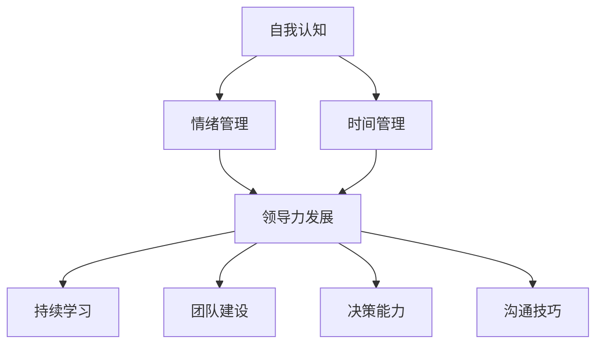
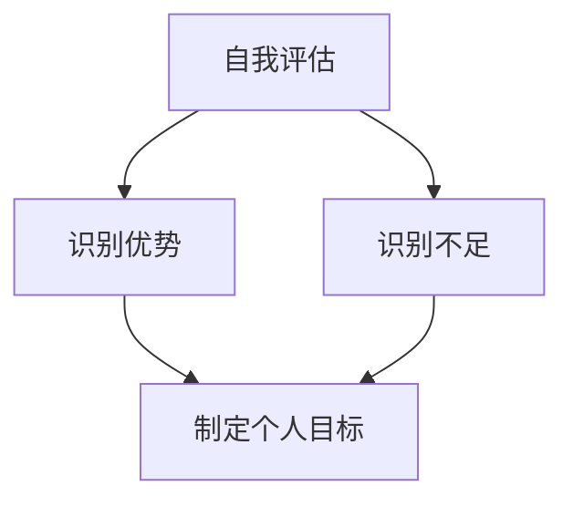
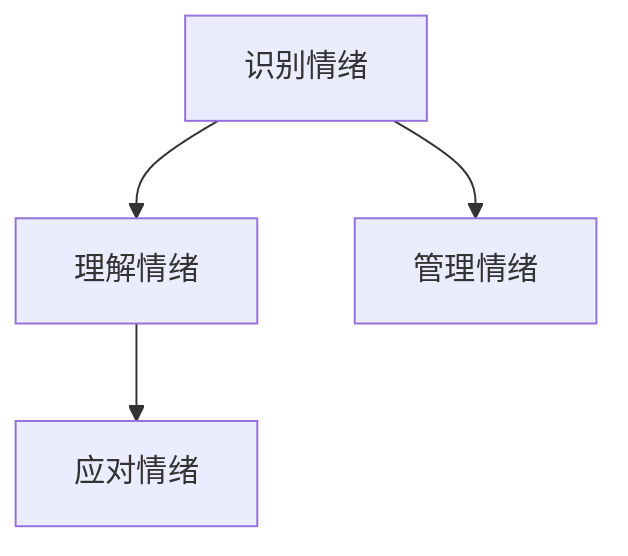
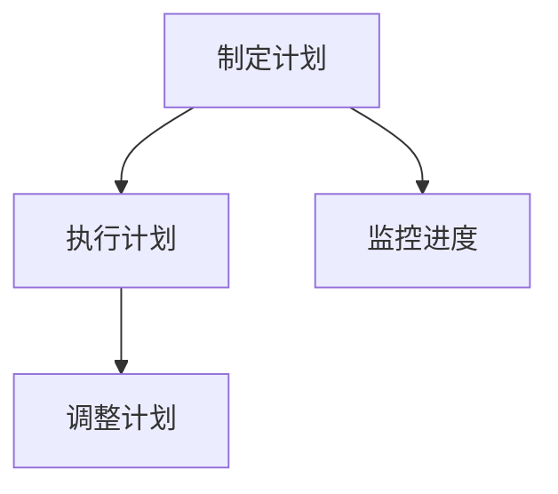
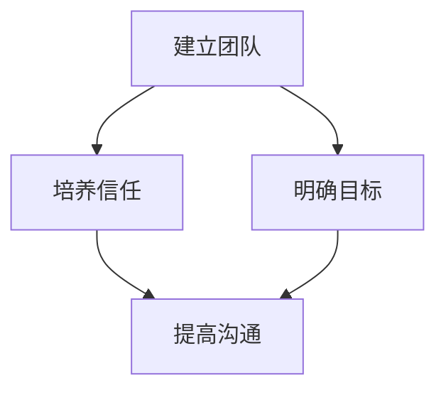
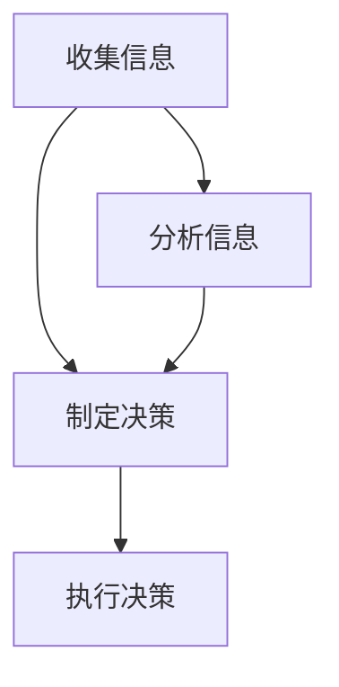
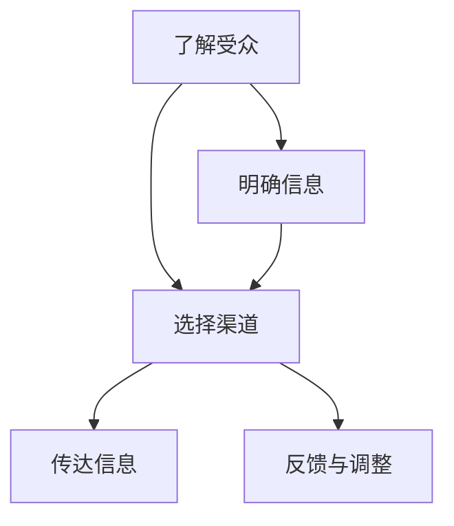
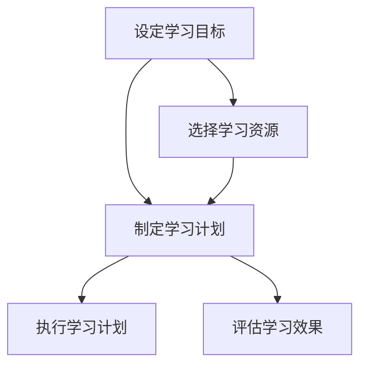

                 

好的，下面我们将按照逻辑清晰的步骤来撰写《领导者的自我成长：持续学习与进步》的技术博客文章。

### 文章标题：领导者的自我成长：持续学习与进步

#### 关键词：领导者、自我成长、持续学习、进步、个人发展、领导力

#### 摘要：
在技术快速迭代和业务环境不断变化的今天，领导者如何实现自我成长，保持持续学习与进步，成为组织成功的核心驱动因素。本文将探讨领导者如何通过自我认知、情绪管理、时间管理、团队建设、决策能力、沟通技巧等个人成长和领导力发展方面，以及通过有效的持续学习方法，实现自我提升和领导力成长。

### 引言

#### 背景介绍
随着全球化和数字化的深入发展，企业面临的竞争环境和市场变化日益加剧。在这种情况下，领导者需要具备持续学习与进步的能力，以适应不断变化的环境，推动组织创新和持续发展。本文旨在为领导者提供一套系统的自我成长方法和工具，帮助他们在个人和领导力方面实现持续进步。

#### 核心概念与联系
为了更好地理解领导者的自我成长，我们可以使用Mermaid流程图来展示核心概念之间的关系：



### 第一部分：个人成长

#### 第1章：自我认知与成长

##### 核心概念与联系
自我认知是领导者成长的基石。通过自我认知，领导者可以识别自己的优势与不足，制定个人成长计划。以下是一个简单的自我认知流程图：



##### 核心算法原理讲解
自我评估可以通过以下步骤进行：

```
函数 自我评估():
    收集自我评估数据（如工作表现、技能水平、健康状态等）
    分析数据，识别优势和不足
    根据优势和不足，制定个人成长计划
    返回个人成长计划
```

##### 数学模型和公式
为了更具体地分析自我评估数据，我们可以使用以下数学模型：

$$
满意度 = \frac{优势得分}{总得分}
$$

其中，优势得分是根据自我评估数据计算出的总分，总得分是所有评估项目的得分之和。

##### 举例说明
假设一个领导者的自我评估数据如下：

| 项目 | 得分 |
| ---- | ---- |
| 工作表现 | 8 |
| 技能水平 | 6 |
| 健康状态 | 7 |

那么，领导者的满意度计算如下：

$$
满意度 = \frac{8 + 6 + 7}{3} = \frac{21}{3} = 7
$$

这意味着领导者在自我评估中的满意度为7分（满分10分），需要关注提升技能水平和健康状态。

##### 项目实战
为了更好地实施自我评估，领导者可以采用以下步骤：

1. **选择评估工具**：如360度评估、行为事件访谈（BEI）等。
2. **收集评估数据**：通过问卷、面谈等方式收集评估数据。
3. **分析数据并制定个人成长计划**：根据评估结果，制定具体的个人成长计划。
4. **执行个人成长计划**：持续跟踪个人成长计划的执行情况，并根据反馈进行调整。

##### 最佳实践 tips
- **定期进行自我评估**：至少每年一次。
- **寻求外部反馈**：通过同事、下属和上级的反馈，更全面地了解自己。

#### 第2章：情绪管理与情绪智商

##### 核心概念与联系
情绪管理是领导者自我成长的重要部分。通过情绪管理，领导者可以更好地应对压力和挫折，提高领导力。以下是一个情绪管理的流程图：



##### 核心算法原理讲解
情绪管理可以通过以下步骤进行：

```
函数 情绪管理():
    识别情绪（如焦虑、愤怒、沮丧等）
    理解情绪（如识别情绪来源、影响等）
    管理情绪（如通过放松、冥想等方式缓解情绪）
    应对情绪（如调整行为、沟通方式等）
```

##### 数学模型和公式
为了更科学地管理情绪，我们可以使用情绪评分模型：

$$
情绪评分 = \frac{积极情绪得分}{总得分}
$$

其中，积极情绪得分是根据自我评估数据计算出的总分，总得分是所有评估项目的得分之和。

##### 举例说明
假设一个领导者的情绪评估数据如下：

| 项目 | 得分 |
| ---- | ---- |
| 积极情绪 | 8 |
| 消极情绪 | 3 |

那么，领导者的情绪评分计算如下：

$$
情绪评分 = \frac{8}{8 + 3} = \frac{8}{11} \approx 0.73
$$

这意味着领导者在情绪管理中的情绪评分为73%，需要进一步关注如何提升积极情绪。

##### 项目实战
为了更好地管理情绪，领导者可以采取以下步骤：

1. **学习情绪管理技巧**：如情绪调节技巧、情绪识别技巧等。
2. **练习情绪调节**：通过冥想、深呼吸等方法，提高情绪调节能力。
3. **定期进行情绪评估**：通过自我评估和外部反馈，了解情绪管理状况。

##### 最佳实践 tips
- **保持积极心态**：积极心态有助于提高情绪评分。
- **学会放松**：定期进行放松练习，如瑜伽、冥想等。

#### 第3章：时间管理与效率提升

##### 核心概念与联系
时间管理是领导者提高工作效率的关键。通过有效的时间管理，领导者可以更好地分配时间，提高工作效率，实现个人和团队的成长。以下是一个时间管理的流程图：



##### 核心算法原理讲解
时间管理可以通过以下步骤进行：

```
函数 时间管理():
    制定计划（如工作计划、日程安排等）
    执行计划（如按照计划完成工作任务）
    监控进度（如定期检查计划执行情况）
    调整计划（如根据实际情况调整计划）
```

##### 数学模型和公式
为了更科学地管理时间，我们可以使用以下数学模型：

$$
时间效率 = \frac{完成的工作量}{总工作时间}
$$

其中，完成的工作量是根据工作目标和实际完成情况计算出的总量，总工作时间是完成这些工作所需的总时间。

##### 举例说明
假设一个领导者在一个月内完成的工作量是80小时，总工作时间是160小时，那么他的时间效率计算如下：

$$
时间效率 = \frac{80}{160} = 0.5
$$

这意味着领导者在时间管理中的效率为50%，需要进一步优化时间分配。

##### 项目实战
为了提高时间管理效率，领导者可以采取以下步骤：

1. **制定明确的工作计划**：明确工作目标、任务和优先级。
2. **执行计划并监控进度**：按照计划执行任务，并定期检查进度。
3. **根据实际情况调整计划**：如果遇到突发情况，及时调整计划。

##### 最佳实践 tips
- **设定明确的优先级**：将任务按照重要性和紧急性进行排序。
- **避免多任务处理**：专注于一项任务，直到完成。

### 第二部分：领导力发展

#### 第4章：团队建设与领导风格

##### 核心概念与联系
团队建设是领导力发展的重要组成部分。一个高效的团队可以更好地实现组织目标。以下是一个团队建设的流程图：



##### 核心算法原理讲解
团队建设可以通过以下步骤进行：

```
函数 团队建设():
    建立团队（如选择团队成员、明确团队目标等）
    培养信任（如通过团队合作、开放沟通等方式建立信任）
    明确目标（如制定团队目标和计划）
    提高沟通（如通过会议、反馈等方式提高沟通效率）
```

##### 数学模型和公式
为了评估团队建设的效果，我们可以使用以下数学模型：

$$
团队效能 = \frac{团队目标完成度}{总目标完成度}
$$

其中，团队目标完成度是根据团队实际完成情况计算出的总量，总目标完成度是整个组织实际完成目标的总量。

##### 举例说明
假设一个团队在一个季度内完成了90%的目标，组织整体完成了80%的目标，那么团队的效能计算如下：

$$
团队效能 = \frac{90}{80} = 1.125
$$

这意味着团队在团队建设中的效能为1.125，说明团队表现优于组织平均水平。

##### 项目实战
为了提高团队建设效果，领导者可以采取以下步骤：

1. **建立明确的团队目标**：确保团队成员明确团队的目标和期望。
2. **培养信任和开放沟通**：通过团队合作和定期反馈，建立信任和沟通渠道。
3. **定期评估团队效能**：通过团队效能评估，了解团队建设的效果。

##### 最佳实践 tips
- **鼓励团队合作**：通过团队合作，提高团队凝聚力和工作效率。
- **提供培训和指导**：为团队成员提供培训和发展机会，帮助他们提高技能和知识。

#### 第5章：决策能力与策略规划

##### 核心概念与联系
决策能力是领导者的重要素质。通过有效的决策，领导者可以更好地应对挑战和机遇。以下是一个决策流程图：



##### 核心算法原理讲解
决策能力可以通过以下步骤进行：

```
函数 决策():
    收集信息（如市场调研、竞争分析等）
    分析信息（如识别问题、分析风险等）
    制定决策（如选择最佳方案、制定执行计划等）
    执行决策（如按照决策执行计划实施）
```

##### 数学模型和公式
为了更科学地制定决策，我们可以使用以下数学模型：

$$
决策风险 = \frac{潜在风险}{潜在收益}
$$

其中，潜在风险是根据决策方案分析出的总风险，潜在收益是根据决策方案分析出的总收益。

##### 举例说明
假设一个领导者有两个决策方案：

| 方案 | 潜在风险 | 潜在收益 |
| ---- | ---- | ---- |
| A | 100 | 500 |
| B | 200 | 700 |

那么，两个决策方案的风险收益计算如下：

$$
方案A：决策风险 = \frac{100}{500} = 0.2
$$

$$
方案B：决策风险 = \frac{200}{700} = 0.2857
$$

这意味着方案A的决策风险较低，领导者可以选择方案A。

##### 项目实战
为了提高决策能力，领导者可以采取以下步骤：

1. **收集全面的信息**：通过市场调研、竞争分析等方式，收集全面的信息。
2. **分析信息，评估风险与收益**：根据收集到的信息，分析不同决策方案的风险与收益。
3. **制定决策**：选择最佳方案，并制定详细的执行计划。
4. **执行决策**：按照执行计划实施决策。

##### 最佳实践 tips
- **避免冲动决策**：在制定决策前，充分评估各种风险与收益。
- **寻求多方意见**：在决策过程中，多听取不同意见，提高决策的全面性。

#### 第6章：沟通技巧与影响力

##### 核心概念与联系
沟通技巧是领导者影响力和领导力的关键。有效的沟通可以更好地传达信息、建立信任和推动团队协作。以下是一个沟通流程图：



##### 核心算法原理讲解
沟通技巧可以通过以下步骤进行：

```
函数 沟通():
    了解受众（如了解受众的需求、背景等）
    明确信息（如明确要传达的内容和目的）
    选择渠道（如选择合适的沟通方式，如面对面沟通、邮件沟通等）
    传达信息（如按照既定计划传达信息）
    反馈与调整（如根据反馈调整沟通方式）
```

##### 数学模型和公式
为了评估沟通效果，我们可以使用以下数学模型：

$$
沟通效果 = \frac{有效沟通次数}{总沟通次数}
$$

其中，有效沟通次数是根据沟通目标和实际完成情况计算出的总量，总沟通次数是沟通的总次数。

##### 举例说明
假设一个领导者在一个季度内进行了100次沟通，其中有80次是有效的，那么沟通效果计算如下：

$$
沟通效果 = \frac{80}{100} = 0.8
$$

这意味着领导者在沟通中的效果为80%，需要进一步提高沟通技巧。

##### 项目实战
为了提高沟通技巧，领导者可以采取以下步骤：

1. **了解受众**：通过调查、访谈等方式，了解受众的需求和背景。
2. **明确信息**：确保要传达的信息清晰、明确，避免歧义。
3. **选择渠道**：根据沟通内容的重要性和紧急性，选择合适的沟通方式。
4. **传达信息**：按照既定计划传达信息，并关注受众的反应。
5. **反馈与调整**：根据反馈，及时调整沟通策略。

##### 最佳实践 tips
- **倾听**：有效沟通的一半是倾听，确保了解受众的需求和意见。
- **简洁**：清晰简洁的表达有助于提高沟通效果。

### 第三部分：持续学习的方法和工具

#### 第7章：持续学习的理念与实践

##### 核心概念与联系
持续学习是领导者自我成长的重要途径。通过持续学习，领导者可以不断更新知识、提高技能，适应不断变化的环境。以下是一个持续学习流程图：



##### 核心算法原理讲解
持续学习可以通过以下步骤进行：

```
函数 持续学习():
    设定学习目标（如提高技能、扩展知识等）
    选择学习资源（如在线课程、书籍、研讨会等）
    制定学习计划（如制定学习时间表、学习任务等）
    执行学习计划（如按照计划进行学习）
    评估学习效果（如通过测试、实践等方式评估学习效果）
```

##### 数学模型和公式
为了评估持续学习的效果，我们可以使用以下数学模型：

$$
学习效果 = \frac{掌握的知识和技能}{总学习资源}
$$

其中，掌握的知识和技能是根据学习目标和实际掌握情况计算出的总量，总学习资源是根据学习计划计算出的总学习资源。

##### 举例说明
假设一个领导者在一个季度内学习了10门课程，其中8门课程学得很好，2门课程学得一般，那么他的学习效果计算如下：

$$
学习效果 = \frac{8}{10} = 0.8
$$

这意味着领导者在持续学习中的效果为80%，需要进一步提高学习效率。

##### 项目实战
为了提高持续学习效果，领导者可以采取以下步骤：

1. **设定明确的学习目标**：确保学习目标清晰、具体。
2. **选择优质的学习资源**：通过评估、推荐等方式，选择优质的学习资源。
3. **制定详细的

