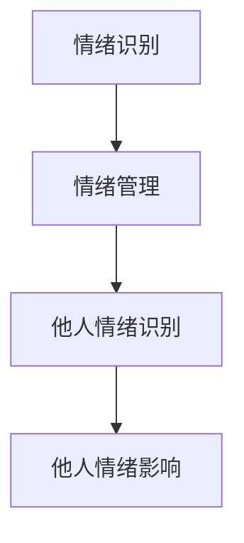

                 


# 领导者的自我管理：平衡工作与生活

> 关键词：领导力、自我管理、工作与生活平衡、时间管理、情绪管理、决策制定

> 摘要：本文深入探讨了领导者的自我管理艺术，特别是如何在繁忙的工作中实现工作与生活的平衡。通过详细的案例分析和技术解释，本文为领导者提供了一系列实用的策略和技巧，以提升个人管理能力和团队效能。

## 引言

### 1.1 自我管理的必要性

在信息技术领域，领导者的自我管理是一项至关重要的技能。它不仅关乎个人的职业发展，更直接影响团队的整体表现。自我管理包括时间管理、情绪管理和决策制定等多个方面，这些因素共同构成了领导者的核心竞争力。

**时间管理**

时间管理是自我管理的基石。它涉及到如何有效地规划时间、分配任务以及提高工作效率。在信息技术领域，时间管理的挑战尤为突出，因为项目往往具有严格的截止日期和高频度的需求变更。

**情绪管理**

情绪管理是领导者维持心理健康和团队稳定的关键。情绪智力（Emotional Intelligence, EI）是领导力的关键组成部分，它帮助领导者识别、理解和管理自己的情绪，以及识别和影响他人的情绪。

**决策制定**

在信息技术领域，决策制定尤为关键。领导者需要做出快速而明智的决策，同时考虑到项目的长期目标和团队的利益。有效的决策模型和风险评估方法是领导者成功的关键。

### 1.2 工作与生活平衡的重要性

工作与生活平衡是现代领导者面临的另一个重大挑战。随着工作压力的不断增加，领导者需要学会在忙碌的工作中找到生活的乐趣，以保持身心健康。

**身心健康**

长期的职业压力会导致身心健康问题，如焦虑、抑郁和慢性疲劳。因此，保持工作与生活的平衡对于领导者的长期健康至关重要。

**家庭与职业发展**

工作与生活平衡不仅关乎个人的身心健康，也影响到家庭和职业发展。一个成功的领导者需要平衡个人与家庭的需求，以确保两者都能得到充分发展。

### 1.3 领导力的自我管理

领导力的自我管理是领导者成功的关键。自我管理不仅关乎个人能力的提升，还涉及到如何有效地管理团队和提升团队绩效。

**领导风格**

领导风格对团队的表现有着深远的影响。领导者需要根据不同的情境选择合适的领导风格，如情境领导理论（Hersey and Blanchard's Situational Leadership Theory）所阐述的。

**团队建设**

团队建设是领导力的核心。一个成功的领导者需要建立高效的团队，这包括明确团队目标、促进团队合作和解决团队冲突。

**沟通技巧**

沟通技巧是领导者成功的关键之一。有效的沟通可以帮助领导者更好地传达信息、激励团队和解决冲突。

## 自我管理的基础

### 2.1 时间管理

**制定日程规划**

时间管理的第一步是制定日程规划。领导者可以使用 Gantt 图来安排日常工作，确保任务按时完成。例如：

```mermaid
graph TD
A[项目1]((2023-04-01, 2023-04-03))
B[项目2]((2023-04-04, 2023-04-06))
C[项目3]((2023-04-07, 2023-04-09))
A --> B
B --> C
```

**提高效率的方法**

提高效率是时间管理的核心。以下是一个简单的效率计算公式：

$$ 效率 = \frac{完成的工作量}{总时间} $$

例如，如果每天工作8小时，目标完成4个项目，则效率为：

$$ 效率 = \frac{4}{8} = 0.5 $$

**设定目标和优先级**

为了提高效率，领导者需要设定明确的目标和优先级。以下是一个目标设定的伪代码：

```python
def set_goals(goals_list, priority_list):
    for goal in goals_list:
        if goal in priority_list:
            print("Set goal:", goal)
```

### 2.2 情绪管理

**认识和管理情绪**

情绪管理是领导者自我管理的重要组成部分。领导者需要学会识别和管理自己的情绪，以及识别和影响他人的情绪。例如：



**减压策略**

减压策略是情绪管理的重要部分。以下是一个简单的减压策略：

1. **定期休息**：每天安排一定的时间进行放松和休息。
2. **运动**：定期进行体育锻炼，如跑步、瑜伽或健身房锻炼。
3. **冥想**：通过冥想和深呼吸来缓解压力。

**提升抗压能力**

提升抗压能力是情绪管理的关键。以下是一个简单的抗压能力提升策略：

1. **建立支持系统**：与家人、朋友或同事建立良好的支持关系。
2. **学习应对策略**：学习有效的应对策略，如积极思考、问题解决和情绪调节。

### 2.3 决策制定

**决策模型**

决策模型是决策制定的基础。以下是一个简单的决策模型：

1. **问题识别**：明确需要解决的问题。
2. **方案评估**：评估不同的解决方案。
3. **风险分析**：分析潜在的风险。
4. **决策执行**：执行最佳方案。

**风险评估**

风险评估是决策制定的关键步骤。以下是一个简单的风险评估伪代码：

```python
def risk_analysis(risks_list):
    for risk in risks_list:
        if risk.is_high():
            print("High risk:", risk)
```

**决策执行**

决策执行是决策制定的最后一步。以下是一个简单的决策执行伪代码：

```python
def execute_decision(decision):
    if decision.is_approved():
        print("Decision executed:", decision)
    else:
        print("Decision rejected:", decision)
```

## 工作与生活的平衡

### 3.1 建立健康的作息时间

**工作时间优化**

优化工作时间是建立健康作息时间的关键。以下是一个工作时间优化的方案：

1. **固定工作时间**：每天设定固定的工作时间，避免工作时间的随意性。
2. **避免疲劳工作**：合理安排工作任务，避免连续长时间工作。
3. **高效利用时间**：在工作时间内集中精力完成任务，避免分心。

**家庭生活安排**

家庭生活安排是工作与生活平衡的重要组成部分。以下是一个家庭生活安排的方案：

1. **定期家庭聚会**：每周安排家庭聚会，加强家庭成员之间的沟通。
2. **家庭责任分配**：明确家庭责任，确保家庭事务得到妥善处理。
3. **家庭活动规划**：规划家庭活动，如旅行、看电影或参加社区活动。

**休闲时间利用**

休闲时间是工作与生活平衡的重要部分。以下是一个休闲时间利用的方案：

1. **兴趣爱好培养**：培养个人兴趣爱好，如阅读、绘画或音乐。
2. **社交活动参与**：积极参与社交活动，如朋友聚会或社区活动。
3. **健康生活倡导**：倡导健康生活方式，如定期锻炼和健康饮食。

### 3.2 优化工作环境

**空间布局**

优化工作环境的空间布局是提高工作效率的关键。以下是一个优化工作环境空间布局的方案：

1. **工作区布置**：合理布置工作区，确保工作环境整洁、舒适。
2. **设备配置**：配置高效的工作设备，如高性能计算机和高效的网络连接。
3. **团队协作**：建立良好的团队协作空间，促进团队成员之间的沟通和合作。

**工作设备利用**

高效利用工作设备是提高工作效率的关键。以下是一个工作设备利用的方案：

1. **软件工具使用**：熟练使用各种软件工具，如项目管理软件、代码编辑器和文档处理软件。
2. **硬件设备维护**：定期维护硬件设备，确保设备的正常运行。
3. **信息管理**：建立有效的信息管理机制，确保信息快速获取和共享。

**团队协作促进**

促进团队协作是提高团队效能的关键。以下是一个促进团队协作的方案：

1. **定期会议**：定期召开团队会议，讨论项目进展和问题。
2. **沟通渠道**：建立有效的沟通渠道，如即时通讯工具和邮件列表。
3. **团队建设活动**：组织团队建设活动，增强团队成员之间的信任和合作。

### 3.3 寻找生活的乐趣

**个人兴趣培养**

培养个人兴趣是寻找生活乐趣的重要途径。以下是一个培养个人兴趣的方案：

1. **兴趣探索**：尝试不同的兴趣爱好，找到适合自己的领域。
2. **定期练习**：定期练习兴趣爱好，提高技能水平。
3. **分享经验**：与其他人分享兴趣爱好，建立社交网络。

**社交活动参与**

参与社交活动是建立社交网络和寻找生活乐趣的重要途径。以下是一个参与社交活动的方案：

1. **活动组织**：组织或参与社交活动，如聚会、讲座或社区活动。
2. **网络社交**：利用社交媒体和网络平台，拓展社交圈。
3. **文化交流**：参与文化交流活动，如艺术展览、音乐会或书籍分享会。

**健康生活倡导**

倡导健康生活是保持身心健康的重要措施。以下是一个倡导健康生活的方案：

1. **健康饮食**：遵循健康饮食原则，多吃蔬菜、水果和全谷物。
2. **定期锻炼**：定期进行体育锻炼，如跑步、游泳或健身。
3. **心理健康**：关注心理健康，学会应对压力和情绪问题。

## 领导力的提升

### 4.1 领导风格

**情境领导理论**

情境领导理论（Hersey and Blanchard's Situational Leadership Theory）是理解领导风格的重要理论。以下是一个情境领导理论的简要解释：

1. **情境识别**：领导者需要识别团队成员的成熟度水平。
2. **领导风格选择**：根据团队成员的成熟度水平选择合适的领导风格。
3. **领导风格应用**：将选定的领导风格应用于实际工作中。

**案例分析**

以下是一个情境领导理论的案例分析：

**案例**：一个团队在项目初期表现出色，但在项目中期遇到了困难。

**分析**：
- **情境识别**：团队成员在项目初期表现出高成熟度，但在项目中期表现出低成熟度。
- **领导风格选择**：领导者选择了高支持、低指导的领导风格。
- **领导风格应用**：领导者积极支持团队成员，鼓励他们自主解决问题，同时提供必要的资源和支持。

### 4.2 团队建设

**团队合作原则**

团队合作原则是团队建设的基础。以下是一个团队合作原则的简要解释：

1. **共同目标**：团队成员需要明确共同的目标，并为此努力。
2. **相互信任**：团队成员需要建立相互信任的关系，以实现共同目标。
3. **有效沟通**：团队成员需要保持有效沟通，分享信息并解决冲突。

**团队冲突解决**

团队冲突解决是团队建设的关键。以下是一个团队冲突解决的简要解释：

1. **识别冲突**：领导者需要识别团队中的冲突，并理解冲突的原因。
2. **解决冲突**：领导者需要采取适当的措施解决冲突，如协商、调解或调整团队结构。
3. **冲突预防**：领导者需要采取预防措施，以减少冲突的发生，如明确角色和责任、建立有效的沟通机制。

**团队激励策略**

团队激励策略是提升团队绩效的关键。以下是一个团队激励策略的简要解释：

1. **目标激励**：设定明确的团队目标，激发团队成员的动力。
2. **认可激励**：对团队成员的成就和贡献给予认可，增强团队凝聚力。
3. **奖励激励**：提供适当的奖励，如奖金、晋升或荣誉，以激励团队成员。

### 4.3 沟通技巧

**有效沟通的要素**

有效沟通的要素是沟通技巧的核心。以下是一个有效沟通要素的简要解释：

1. **清晰表达**：确保信息传达清晰、准确。
2. **倾听理解**：倾听他人的意见和需求，理解对方的观点。
3. **反馈机制**：建立有效的反馈机制，确保信息传递的准确性和及时性。

**演讲与表达**

演讲与表达是领导者沟通技巧的重要组成部分。以下是一个演讲与表达技巧的简要解释：

1. **内容准备**：确保演讲内容充实、有条理。
2. **表达技巧**：使用适当的语言和肢体语言，增强演讲的影响力。
3. **互动参与**：鼓励听众参与，提高演讲的互动性和吸引力。

**非言语沟通**

非言语沟通是沟通技巧的重要补充。以下是一个非言语沟通技巧的简要解释：

1. **肢体语言**：使用恰当的肢体语言，如眼神接触、微笑和手势，以增强沟通效果。
2. **面部表情**：保持积极的面部表情，以传达自信和友善。
3. **环境布局**：合理安排会议或演讲的环境，以创造良好的沟通氛围。

## 项目实战

### 5.1 实际案例分析

**领导者个人管理案例**

以下是一个领导者个人管理案例：

**案例**：一位IT公司的CEO，由于工作繁忙，经常加班，导致家庭生活受到影响。

**分析**：
- **问题识别**：工作与家庭生活的平衡问题。
- **解决方案**：设定固定的工作时间，确保家庭时间不受干扰。
- **实施效果**：通过设定固定的工作时间，CEO能够更好地管理时间和家庭生活，提高了工作效率和家庭生活质量。

**企业平衡工作与生活的策略**

以下是一个企业平衡工作与生活的策略案例：

**案例**：一家科技公司推出了一项名为“家庭优先”的计划，旨在帮助员工平衡工作和生活。

**分析**：
- **措施**：提供灵活的工作安排、远程工作机会和员工辅导服务。
- **实施效果**：通过这些措施，员工的工作压力得到了缓解，家庭生活质量也得到了提升。

### 5.2 实际操作指南

**工作日程规划**

以下是一个工作日程规划的指南：

1. **制定日程计划**：每天早上制定日程计划，明确当天的任务和目标。
2. **优先级排序**：根据任务的紧急程度和重要性进行排序。
3. **时间分配**：为每个任务分配适当的时间，并留出缓冲时间以应对突发情况。

**情绪管理实践**

以下是一个情绪管理实践的指南：

1. **情绪识别**：学会识别和管理自己的情绪，如焦虑、愤怒和沮丧。
2. **情绪调节**：使用深呼吸、冥想和运动等技巧来调节情绪。
3. **情绪分享**：与家人、朋友或同事分享情绪，寻求支持和理解。

**领导力提升策略**

以下是一个领导力提升策略的指南：

1. **自我反思**：定期进行自我反思，识别自己的优势和不足。
2. **学习新知**：通过阅读、参加培训和与同行交流来不断学习新知。
3. **实践应用**：将所学知识应用到实际工作中，提升领导力。

## 结论

### 6.1 自我管理的重要性

自我管理是领导者成功的关键。通过时间管理、情绪管理和决策制定，领导者能够更好地管理自己，提高工作效率，实现工作与生活的平衡。

### 6.2 工作与生活平衡的必要性

工作与生活平衡对领导者的身心健康和职业发展至关重要。一个成功的领导者需要学会在忙碌的工作中找到生活的乐趣，保持身心健康。

### 6.3 领导力的持续提升

领导力不是一成不变的，而是一个持续提升的过程。通过学习和实践，领导者能够不断提升自己的能力，成为更有效的领导者。

### 作者

**作者：AI天才研究院/AI Genius Institute & 禅与计算机程序设计艺术 /Zen And The Art of Computer Programming**

