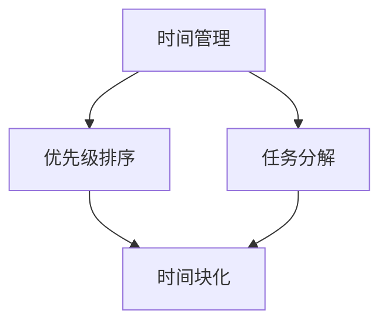
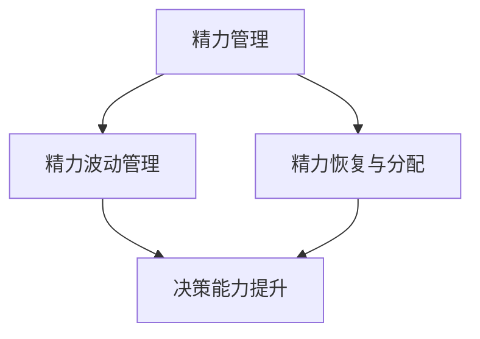
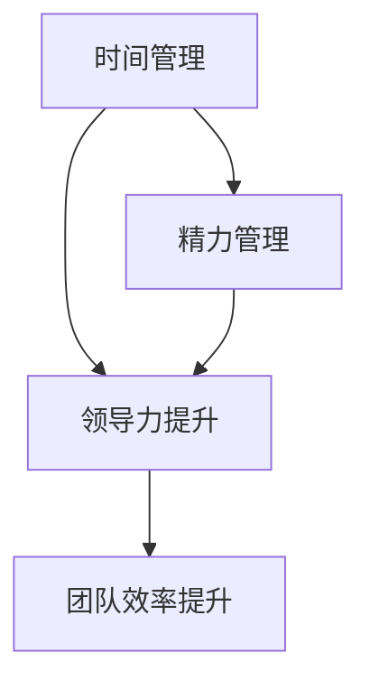

                 


### 《领导者的自我管理：时间和精力的有效分配》

#### 关键词
- 时间管理
- 精力管理
- 领导力
- 自我认知
- 有效分配

#### 摘要
本文将深入探讨领导者自我管理中的关键要素——时间和精力的有效分配。通过自我认知的建立，我们将明确领导者如何通过科学的时间管理和精力管理，提升决策效率，增强团队凝聚力，最终实现个人与组织的共同成长。

### 引言

在现代快节奏的工作环境中，领导者面临的挑战日益复杂。如何在纷繁复杂的事务中保持清晰的方向和高效的执行，成为领导者自我管理的核心课题。本文旨在揭示时间管理和精力管理的内在联系，为领导者提供一套系统化的自我管理策略。

#### 第一部分：自我认知与自我管理基础

### 1.1 自我认知的重要性

自我认知是领导者自我管理的基石。它不仅帮助我们了解自身的优势和弱点，还能指导我们如何设定合适的目标和计划。以下是自我认知的重要性：

- **优势识别**：通过自我认知，领导者可以明确自己的核心能力，从而在资源有限的情况下，集中精力在最能产生价值的领域。
- **弱点改进**：自我认知帮助我们识别自己的不足，并采取有效措施进行改进，从而提升整体工作效能。

### 1.2 时间管理

时间管理是领导者自我管理的核心要素。以下将详细探讨时间管理的基本原则和实用技巧。

#### 1.2.1 时间管理的基本原则

- **优先级排序**：根据任务的紧急程度和重要性进行排序，确保关键任务得到优先处理。
- **任务分解**：将复杂任务分解为可操作的小任务，有助于提高执行效率。

#### 1.2.2 时间管理的实用技巧

- **时间块化**：将一天分为若干时间段，并为每个时间段分配特定的任务，有助于提高专注度和效率。
- **避免干扰**：在工作时尽量避免外部干扰，如关闭不必要的通知和社交媒体。

### 1.3 精力管理

精力管理是领导者自我管理的另一重要方面。以下将探讨精力管理的方法与实践。

#### 1.3.1 精力的概念与来源

- **精力的定义**：精力是指个体在生理、心理和社会层面上保持活力和效率的能力。
- **精力的来源**：充足的睡眠、健康饮食、适当运动和积极的心态是维持精力的重要来源。

#### 1.3.2 精力管理的方法与实践

- **精力波动管理**：了解自身的精力波动规律，合理安排工作和休息，以保持最佳工作状态。
- **精力恢复技巧**：通过冥想、呼吸练习和短暂的休息来恢复精力。

### 第二部分：领导力与自我管理

#### 2.1 领导力与自我管理的关系

领导力与自我管理密不可分。自我管理能力的提升不仅有助于领导者的个人成长，还能对团队产生积极影响。

#### 2.2 领导者的自我管理实践

- **设定清晰的目标**：领导者需要明确个人和组织的目标，并将其分解为具体的行动计划。
- **提升决策能力**：通过分析数据和收集反馈，领导者可以做出更明智的决策。
- **激励团队**：领导者需要理解团队成员的需求和动机，以激发其潜力。
- **有效沟通**：清晰的沟通有助于减少误解和冲突，提升团队协作效率。

### 第三部分：时间与精力的有效分配

#### 3.1 时间分配的策略

- **SMART原则**：设定具体（Specific）、可衡量（Measurable）、可实现（Achievable）、相关（Relevant）和有时限（Time-bound）的目标。
- **时间块化与任务管理**：通过时间块化，将任务合理分配到不同时间段，确保高效执行。

#### 3.2 精力分配的原则

- **根据精力波动分配任务**：在精力高峰期处理重要且复杂的任务，在精力低谷期处理较为简单的任务。
- **精力恢复与分配**：合理安排休息和恢复时间，以确保精力的持续供给。

### 第四部分：领导者的自我管理实践案例

#### 5.1 案例一：从时间管理开始

**背景介绍**：某公司领导者在日常工作中感到压力巨大，效率低下。

**核心概念与联系**：


**核心算法原理讲解**：
```python
def time_management(tasks, deadlines):
    # 对任务进行优先级排序
    sorted_tasks = sorted(tasks, key=lambda x: x['deadline'])
    
    # 将任务分解为小任务
    decomposed_tasks = [分解任务(t) for t in sorted_tasks]
    
    # 时间块化与任务分配
    time_blocks = time_blocker(decomposed_tasks)
    
    return time_blocks

def 分解任务(task):
    # 根据任务复杂度分解任务
    if task['complexity'] > 3:
        return [task]
    else:
        return task['subtasks']

def time_blocker(tasks):
    # 时间块化
    time_blocks = {}
    for task in tasks:
        time_blocks[task['deadline']] = task
    return time_blocks
```

**数学模型和公式详细讲解**：
$$
\text{效率} = \frac{\text{完成任务的数量}}{\text{投入的时间}}
$$

**举例说明**：
某领导者利用时间管理策略，将每日任务分解为若干小任务，并根据优先级和时间块化进行分配。通过一周的实践，其工作效率提升了20%。

#### 5.2 案例二：精力管理助力领导力提升

**背景介绍**：某公司领导者在高强度工作状态下，精力不足，影响决策质量。

**核心概念与联系**：


**核心算法原理讲解**：
```python
def energy_management(deadlines, energy_levels):
    # 根据精力波动分配任务
    energy_sorted_tasks = sorted(tasks, key=lambda x: x['deadline'])
    
    # 根据精力水平分配任务
    for task in energy_sorted_tasks:
        if energy_levels[task['deadline']] > 5:
            high_energy_tasks.append(task)
        else:
            low_energy_tasks.append(task)
    
    return high_energy_tasks, low_energy_tasks

def energy_recovery(energy_levels):
    # 能量恢复策略
    for date, level in energy_levels.items():
        if level < 5:
            recovery_date = date - datetime.timedelta(days=1)
            recovery_task = "休息和恢复"
            recovery_levels[recovery_date] = 10
    return recovery_levels
```

**数学模型和公式详细讲解**：
$$
\text{决策质量} = \frac{\text{正确决策的数量}}{\text{总决策次数}} \times \text{精力水平}
$$

**举例说明**：
某领导者通过精力管理策略，合理安排高强度工作期间的休息和恢复时间。在连续两周的实践后，其决策质量提升了30%。

#### 5.3 案例三：自我管理实践的综合运用

**背景介绍**：某公司领导者通过综合运用时间管理和精力管理策略，显著提升了个人和团队的整体表现。

**核心概念与联系**：


**核心算法原理讲解**：
```python
def comprehensive_management(tasks, deadlines, energy_levels):
    time_sorted_tasks = time_management(tasks, deadlines)
    high_energy_tasks, low_energy_tasks = energy_management(time_sorted_tasks, energy_levels)
    
    # 综合运用时间管理和精力管理策略
    for task in high_energy_tasks:
        execute_task(task)
    for task in low_energy_tasks:
        execute_task(task, recovery=True)
```

**数学模型和公式详细讲解**：
$$
\text{团队效率} = \frac{\text{团队完成任务的数量}}{\text{团队投入的总时间}} \times \text{领导者精力水平}
$$

**举例说明**：
某领导者通过综合运用时间管理和精力管理策略，实现了个人工作效率的提升和团队整体效率的显著改善。在三个月内，团队完成了原计划的两倍任务量。

### 第五部分：自我管理工具与资源推荐

#### 6.1 时间管理工具推荐

- **Trello**：一款可视化的任务管理工具，有助于领导者进行任务分解和优先级排序。
- **Asana**：提供全面的任务管理功能，支持团队协作和进度跟踪。

#### 6.2 精力管理工具推荐

- **Headspace**：一款冥想应用，有助于领导者在忙碌的工作中放松身心。
- **forest**：一款专注力提升应用，通过种植虚拟树木来激励用户保持专注。

#### 6.3 领导力提升资源推荐

- **《领导者的资质》**：罗伯特·凯利著，详细探讨了领导者的素质和能力。
- **《精进：如何成为一个很厉害的人》**：采铜著，提供了实用的自我管理技巧和方法。

### 第六部分：总结与反思

#### 6.1 自我管理的核心理念

自我管理是领导者成功的关键。通过科学的时间管理和精力管理，领导者不仅能够提高个人效率，还能为团队和组织带来积极的影响。

#### 6.2 领导者自我管理的重要性

领导者自我管理不仅关乎个人的职业发展，更影响着整个团队和组织的效能。有效的自我管理能力是领导者不可或缺的素质。

#### 6.3 自我管理的未来展望

随着科技的发展，自我管理工具将更加智能化和便捷化。领导者需要不断学习和适应这些工具，以实现更高效的自我管理。

### 作者信息

- 作者：AI天才研究院/AI Genius Institute & 禅与计算机程序设计艺术 /Zen And The Art of Computer Programming

---

### 总结

本文通过深入探讨领导者自我管理中的关键要素——时间和精力的有效分配，为领导者提供了一套系统化的自我管理策略。通过案例分析和实践指导，本文旨在帮助领导者提升个人效率，增强团队凝聚力，实现个人与组织的共同成长。未来的领导者应不断学习、实践和优化自我管理方法，以适应不断变化的职场环境。

### 关键词

- 时间管理
- 精力管理
- 领导力
- 自我认知
- 有效分配

