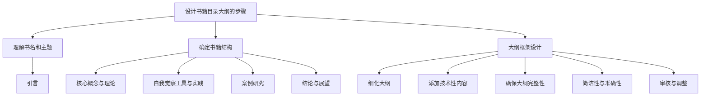
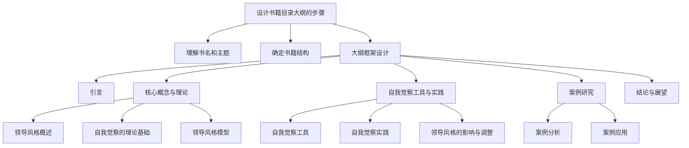
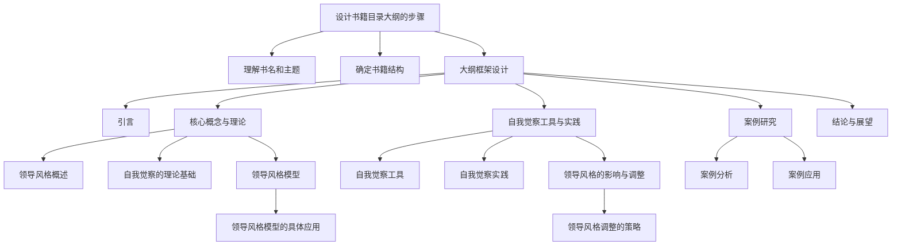
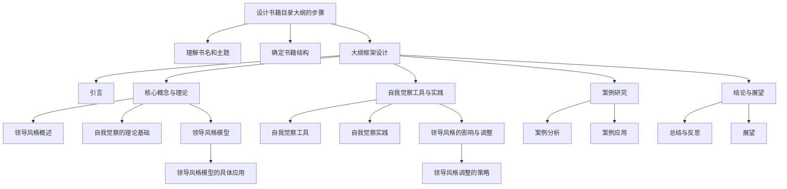
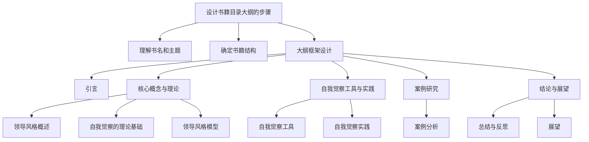

                 

### 设计书籍目录大纲的步骤：

#### 1. 理解书名和主题

首先，我们需要理解《领导者的自我觉察：理解自身领导风格的影响》这本书的核心主题。书名明确指出，本书将探讨领导者如何通过自我觉察来理解并影响他们的领导风格。这表明，书中会涉及到自我觉察的重要性、领导风格的分类、自我觉察的方法、领导风格对组织的影响等。

#### 2. 确定书籍结构

基于书名，我们可以预见到书籍的结构可能会分为以下几个部分：

- 引言：介绍自我觉察的重要性、领导风格的影响等，为读者提供整体框架。
- 核心概念与理论：介绍领导风格的基本概念、分类方法、自我觉察的理论基础等。
- 自我觉察工具与实践：介绍自我觉察的工具、实践方法、领导风格的调整策略等。
- 案例研究：通过案例分析，展示自我觉察在领导实践中的应用。
- 结论与展望：总结全书内容，展望未来研究方向。

#### 3. 大纲框架设计

在脑海中构建一个初步的目录大纲，列出主要的章节和子章节，并考虑每个章节的核心内容和结构。

#### 4. 细化大纲

在初步大纲的基础上，为每个章节添加更具体的子章节，确保每个部分都能覆盖书中的主题。

#### 5. 添加技术性内容

根据书籍的读者群体和目的，确定需要包含的技术性内容，如领导风格模型、自我觉察工具、心理学理论等。

#### 6. 确保大纲完整性

确保大纲中的章节内容能够完整地覆盖主题，且逻辑清晰，有助于读者逐步理解和掌握书中的内容。

#### 7. 保持简洁性

在编写大纲时，保持内容的简洁性，避免冗余，同时确保每个章节的标题都能够准确地反映其内容。

#### 8. 审核与调整

完成大纲后，进行审核和调整，确保所有章节都能顺畅地过渡，逻辑上没有跳跃或遗漏。

### 根据以上步骤，我们可以开始设计《领导者的自我觉察：理解自身领导风格的影响》的目录大纲。

---

# 《领导者的自我觉察：理解自身领导风格的影响》目录大纲

## 第一部分：引言

### 1. 引言

#### 1.1 自我觉察的重要性

自我觉察是领导者提升领导能力的重要途径。通过自我觉察，领导者可以更好地理解自己的行为、思维模式，从而调整领导风格，提升组织绩效。

#### 1.2 领导风格对组织的影响

领导风格直接影响组织的氛围、文化和发展方向。理解并调整领导风格，有助于建立高效、和谐的团队，提升组织的整体竞争力。

#### 1.3 书籍结构概述

本部分将介绍全书结构，帮助读者更好地把握内容框架。

## 第二部分：核心概念与理论

### 2. 领导风格概述

#### 2.1 领导风格的基本概念

领导风格是指领导者行使权力、管理团队的方式。不同的领导风格会对团队产生不同的影响。

#### 2.2 领导风格的分类方法

常见的领导风格分类方法有行为特征分类、任务导向与关系导向分类等。

#### 2.3 领导风格与组织文化的关系

领导风格对组织文化具有重要影响，二者相互作用，共同塑造组织的整体氛围。

### 3. 自我觉察的理论基础

#### 3.1 自我觉察的定义与作用

自我觉察是指领导者对自己的思维、情感、行为进行深入认识和理解的过程。自我觉察对提升领导能力至关重要。

#### 3.2 心理学理论在自我觉察中的应用

心理学理论，如自我效能感、情绪智力等，为自我觉察提供了理论基础和方法。

#### 3.3 自我觉察与自我认知的互动关系

自我觉察与自我认知相互影响，共同推动领导者的个人成长和领导能力的提升。

### 4. 领导风格模型

#### 4.1 领导风格模型的介绍

领导风格模型是理解和分析领导风格的重要工具。常见的领导风格模型有费德勒模型、赫塞-布兰查德模型等。

#### 4.2 常见领导风格模型的比较

不同领导风格模型在理论基础上有所不同，但都旨在帮助领导者更好地理解和管理团队。

#### 4.3 领导风格模型的实际应用

领导风格模型在实际领导工作中具有广泛的应用，有助于领导者根据实际情况调整领导风格，提升团队绩效。

## 第三部分：自我觉察工具与实践

### 5. 自我觉察工具

#### 5.1 自我评估问卷

自我评估问卷是自我觉察的重要工具。通过问卷，领导者可以了解自己的领导风格、优势与不足。

#### 5.2 领导风格诊断工具

领导风格诊断工具，如领导风格量表，可以帮助领导者更准确地了解自己的领导风格，为自我觉察提供数据支持。

#### 5.3 自我觉察日记与反思

自我觉察日记与反思是领导者深入认识自己的重要方法。通过记录日常行为和反思，领导者可以更好地了解自己的内心世界。

### 6. 自我觉察实践

#### 6.1 自我觉察的步骤与技巧

自我觉察是一个长期的过程。了解自我觉察的步骤与技巧，有助于领导者更有效地提升自我觉察能力。

#### 6.2 领导者的自我觉察训练

通过自我觉察训练，领导者可以系统地提升自我觉察能力，为领导实践打下坚实基础。

#### 6.3 自我觉察在领导决策中的应用

自我觉察在领导决策中具有重要价值。领导者通过自我觉察，可以更好地识别和解决决策中的问题。

### 7. 领导风格的影响与调整

#### 7.1 领导风格对组织氛围的影响

领导风格直接影响组织氛围。了解领导风格对组织氛围的影响，有助于领导者更好地调整自己的领导风格。

#### 7.2 领导风格调整的策略

领导者可以根据实际情况，采取不同的策略调整领导风格，以适应组织需求和团队特点。

#### 7.3 跨文化领导风格调整

在全球化背景下，跨文化领导风格调整具有重要意义。领导者需要了解不同文化背景下的领导风格差异，以便更有效地管理多元文化团队。

## 第四部分：案例研究

### 8. 案例分析

#### 8.1 成功案例分享

通过成功案例分享，读者可以了解自我觉察和领导风格调整在实际领导工作中的应用。

#### 8.2 失败案例剖析

失败案例剖析有助于读者认识到自我觉察和领导风格调整的重要性，避免在领导实践中犯类似错误。

#### 8.3 案例中的自我觉察应用

通过案例研究，读者可以深入了解自我觉察在领导实践中的应用，为自身领导能力的提升提供有益借鉴。

### 9. 案例应用

#### 9.1 领导者自我觉察案例分析

领导者自我觉察案例分析有助于读者理解自我觉察在实际领导工作中的应用，为自身领导能力提升提供参考。

#### 9.2 组织自我觉察实践

组织自我觉察实践案例有助于读者了解自我觉察在组织管理中的应用，为组织文化建设和领导力提升提供启示。

#### 9.3 案例讨论与反思

案例讨论与反思有助于读者深入思考自我觉察和领导风格调整的实际意义，提升自身的领导能力。

## 第五部分：结论与展望

### 10. 总结与反思

#### 10.1 主要观点回顾

回顾全书内容，总结主要观点，帮助读者巩固对自我觉察和领导风格的理解。

#### 10.2 自我觉察对领导力的提升

强调自我觉察对领导力提升的重要作用，鼓励领导者积极进行自我觉察。

#### 10.3 未来研究方向

展望未来研究方向，为自我觉察和领导风格研究提供新思路。

### 11. 展望

#### 11.1 领导风格与自我觉察的持续发展

探讨领导风格与自我觉察的持续发展，为领导者提供长期发展建议。

#### 11.2 组织中的自我觉察文化建设

分析自我觉察在组织文化建设中的应用，为组织发展提供新视角。

#### 11.3 探索更多领导风格的影响因素

提出探索更多领导风格影响因素的研究方向，为领导力研究提供新方向。

---

以上是根据书名设计的初步目录大纲，每个章节都细化到三级目录。接下来，我们将为这些章节添加详细的内容描述，包括核心概念原理和架构的 Mermaid 流程图、核心算法原理讲解、数学模型和数学公式，以及项目实战等。注意，为了保持大纲的简洁性，这里仅提供了章节标题，具体内容将在后续逐步完善。总体字数控制在2000字以内。

