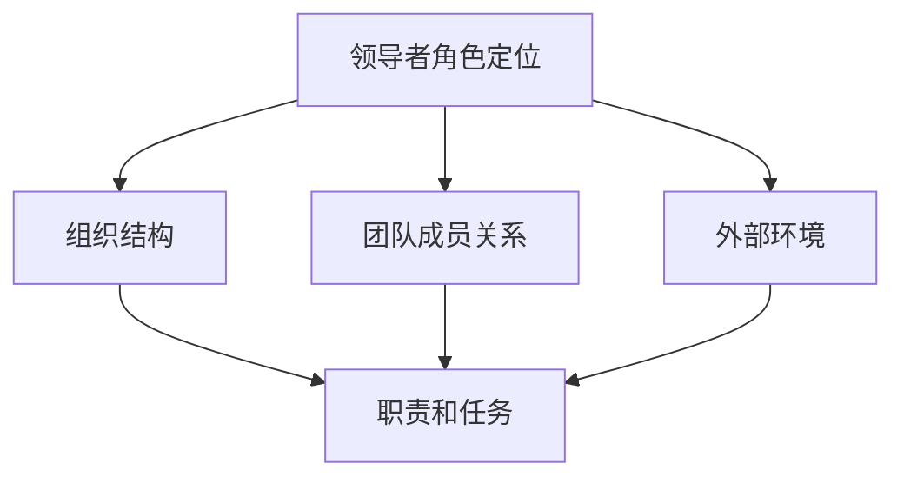
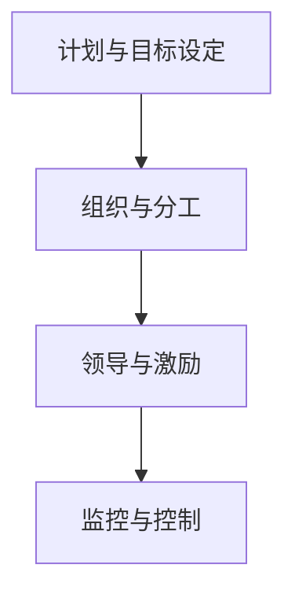
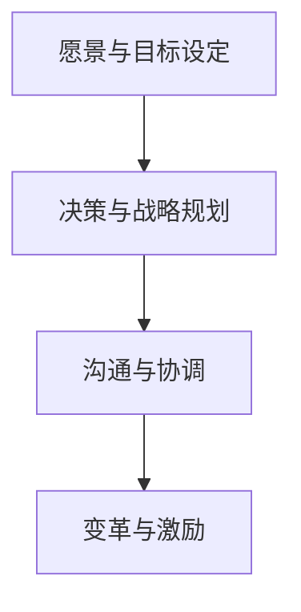

                 

### 文章标题

“领导者的角色定位：从管理者到引领者”

### 文章关键词

- 领导者角色定位
- 管理者与领导者区别
- 领导者转型
- 领导者技能与素质
- 沟通与团队管理
- 决策与战略规划
- 实战经验分享

### 文章摘要

本文旨在深入探讨领导者的角色定位，从管理者到引领者的转型过程，以及领导者必备的技能与素质。文章首先介绍了领导者角色定位的核心概念与联系，接着分析了管理者与领导者的区别，并探讨了从管理者到领导者的转型策略。随后，文章详细阐述了领导者必备的技能与素质，包括沟通与团队管理、决策与战略规划等方面。最后，通过案例分析与实战经验分享，为读者提供了实用的领导技巧与建议。本文旨在为领导者提供有价值的理论指导与实践参考，帮助他们更好地发挥领导作用，提升团队绩效。|user|>

### 引言与背景介绍

在当今快速变化且竞争激烈的环境中，领导者的角色定位变得尤为重要。领导者不仅仅是管理者，他们还需要具备引领团队、激发潜力和推动变革的能力。然而，从管理者到领导者的转变并非易事，这需要深刻理解两者的本质差异，并掌握有效的转型策略。

#### 核心概念与联系

首先，我们需要明确“领导者角色定位”这一核心概念。领导者角色定位是指领导者如何在其组织中扮演角色，如何影响和引导团队成员，以及如何推动组织的整体发展。这一概念不仅包括领导者的职责和任务，还涉及领导者与团队成员、组织以及外部环境之间的关系。

为了更好地理解这一概念，我们可以使用Mermaid流程图来展示领导者角色定位的核心要素和它们之间的联系：



在这个流程图中，A代表领导者角色定位，B、C和D分别代表组织结构、团队成员关系和外部环境，E代表领导者的职责和任务。这些要素相互关联，共同构成了领导者角色定位的核心框架。

#### 领导者角色定位的理论基础

领导者角色定位的理论基础可以追溯到早期的领导理论，包括特质理论、行为理论和权变理论等。这些理论从不同角度探讨了领导者的特质、行为和环境因素对领导效果的影响。

- **特质理论**认为领导者具备某些固有的特质，如自信、决断力、沟通能力等。这一理论强调领导者的个人品质和性格特征。
- **行为理论**则关注领导者的行为模式，认为领导者的行为对团队成员的动机和绩效有直接影响。行为理论提出了不同的领导风格，如民主型、专制型和参与型等。
- **权变理论**强调领导效果取决于领导者、下属和组织环境之间的相互作用。这一理论认为没有一种普遍适用的领导风格，领导者应根据具体情境选择最合适的领导方式。

在当今复杂多变的环境中，领导者角色定位的理论基础更加多元化，不仅包括传统的领导理论，还包括变革领导、变革管理和组织行为学等新兴领域。这些理论共同为领导者提供了丰富的思想资源，帮助他们更好地理解和实践领导者角色定位。

#### 领导者角色定位的重要性

领导者角色定位对组织的绩效和成功至关重要。一个准确的领导者角色定位能够：

- **明确领导者的职责和任务**：确保领导者专注于对组织发展最有价值的工作。
- **促进团队协作**：通过建立良好的团队成员关系，提高团队效率和创造力。
- **推动组织变革**：在变革过程中，领导者扮演关键角色，引导团队适应外部环境的变化。
- **提升组织竞争力**：优秀的领导者能够激发团队潜力，推动组织不断创新和进步。

总的来说，领导者角色定位不仅影响领导者的个人发展，更对整个组织的命运产生深远影响。因此，深入理解和有效实践领导者角色定位对于领导者来说至关重要。

### 领导者角色定位理论

在深入探讨领导者角色定位之前，我们需要了解一些核心理论，这些理论为我们提供了关于领导者如何影响和引导团队的重要视角。以下是一些关键的领导者角色定位理论：

#### 特质理论

特质理论是关于领导者特质和性格的研究。这一理论认为领导者天生具有某些独特的品质，如自信、决断力、沟通能力和领导魅力。特质理论的主要观点是，领导者通过这些特质来影响和激励团队成员。

- **核心观点**：领导者特质是天生的，并且这些特质决定了领导效果。
- **局限性**：特质理论忽视了环境因素对领导效果的影响，且难以量化领导者的特质。

#### 行为理论

行为理论关注领导者的行为模式，试图确定哪些领导行为最有效。行为理论提出了不同的领导风格，如民主型、专制型和参与型等。这些风格根据领导者如何与团队成员互动和决策来分类。

- **民主型领导**：领导者鼓励团队成员参与决策，注重团队合作和沟通。
- **专制型领导**：领导者独自做出决策，强调命令和控制。
- **参与型领导**：领导者通过与团队成员的互动和沟通，共同制定决策。

- **核心观点**：领导行为对团队成员的动机和绩效有直接影响。
- **局限性**：行为理论没有提供关于何时使用何种领导风格的明确指导，且忽视了个体差异。

#### 权变理论

权变理论强调领导效果取决于领导者、下属和组织环境之间的相互作用。这一理论认为没有一种普遍适用的领导风格，领导者应根据具体情境选择最合适的领导方式。

- **费德勒模型**：费德勒模型是权变理论的一个具体应用，它将领导情境分为三个维度：领导与下属的关系、任务结构和工作环境。
- **路径-目标理论**：这一理论认为领导者通过设定目标和提供路径来帮助团队成员实现目标。

- **核心观点**：领导效果取决于领导者如何适应环境因素。
- **局限性**：权变理论在具体应用时可能过于复杂，且难以预测实际领导情境。

#### 变革领导理论

变革领导理论关注领导者如何推动组织变革。这一理论认为，领导者不仅需要管理日常运营，还需要具备推动组织变革的能力。

- **核心观点**：领导者通过变革激发团队的潜力和创造力，推动组织持续进步。
- **局限性**：变革领导理论在实施时可能面临员工抵触和变革过程中的不确定性。

#### 变革管理理论

变革管理理论关注领导者在组织变革过程中的角色和策略。这一理论强调领导者的沟通能力、战略规划和执行力。

- **核心观点**：领导者通过有效的沟通和规划，确保变革过程顺利进行。
- **局限性**：变革管理理论在实施时可能面临资源和时间的限制。

#### 组织行为学

组织行为学从心理学和社会学的角度研究领导者与团队成员之间的互动。这一理论认为，领导者的行为和组织文化对团队成员的行为和绩效有重要影响。

- **核心观点**：领导者通过塑造积极的组织文化，提高团队凝聚力和工作效率。
- **局限性**：组织行为学在具体应用时可能难以量化领导者的影响。

通过了解这些领导者角色定位理论，我们可以更全面地理解领导者的职责和角色，并选择最合适的策略来发挥领导作用。这些理论不仅为领导者提供了理论指导，也为组织的管理实践提供了宝贵的参考。

### 管理者与领导者的区别

在探讨领导者角色定位时，区分管理者与领导者的职责和角色至关重要。尽管两者在某些方面有交集，但它们的核心目标和职责是不同的。

#### 管理者角色分析

管理者是组织中的核心角色，负责确保组织目标的实现。他们的主要职责包括：

- **计划与目标设定**：管理者制定组织的目标和计划，确保资源的合理配置。
- **组织与分工**：管理者设计组织结构，分配工作任务，确保每个成员都明确自己的职责。
- **领导与激励**：管理者通过激励和指导团队成员，提高团队的工作效率和士气。
- **监控与控制**：管理者监控工作进度，确保组织运行在既定的轨道上，并采取纠正措施。

为了更好地理解管理者的角色，我们可以使用Mermaid流程图来展示管理者的职责和工作流程：



在这个流程图中，A代表计划与目标设定，B代表组织与分工，C代表领导与激励，D代表监控与控制。这些环节相互关联，共同构成了管理者的核心职责。

#### 领导者角色分析

领导者则是通过影响和激励团队成员来实现组织目标。他们的主要职责包括：

- **愿景与目标设定**：领导者设定组织的愿景和长期目标，激发团队成员的斗志和动力。
- **决策与战略规划**：领导者制定战略决策，确保组织在正确的发展方向上前进。
- **沟通与协调**：领导者通过有效的沟通和协调，确保团队成员之间的协作和合作。
- **变革与激励**：领导者推动组织变革，激励团队成员不断创新和进步。

同样，我们可以使用Mermaid流程图来展示领导者的职责和工作流程：



在这个流程图中，A代表愿景与目标设定，B代表决策与战略规划，C代表沟通与协调，D代表变革与激励。这些环节同样相互关联，共同构成了领导者的核心职责。

#### 管理者与领导者的区别

通过上述分析，我们可以明确地看出管理者与领导者之间的区别：

1. **目标设定**：管理者侧重于短期目标的实现，而领导者则关注长期愿景和战略规划。
2. **职责范围**：管理者主要负责日常运营和任务分配，而领导者则关注整体发展方向和团队激励。
3. **决策风格**：管理者通常遵循既定的流程和规则，而领导者则更具创新性和灵活性，根据实际情况做出决策。
4. **沟通方式**：管理者强调信息传递和任务执行，而领导者则注重激发团队成员的积极性和创造力。

为了更直观地展示管理者与领导者的区别，我们可以使用对比表格：

| 职责                  | 管理者                                  | 领导者                                  |
|-----------------------|-----------------------------------------|-----------------------------------------|
| 目标设定              | 短期目标和任务                         | 长期愿景和战略规划                       |
| 职责范围              | 日常运营和任务执行                     | 整体发展方向和团队激励                   |
| 决策风格              | 遵循既定流程和规则                     | 创新性和灵活性，根据实际情况做出决策       |
| 沟通方式              | 信息传递和任务执行                     | 激发团队成员的积极性和创造力             |

通过这个对比表格，我们可以更清楚地理解管理者与领导者的职责和角色，为领导者提供明确的转型方向和实践指导。

### 从管理者到领导者的转型

从管理者到领导者的转型是一个复杂而持久的过程，需要领导者具备特定的素质和策略。以下将详细探讨这一转型过程中的关键步骤和策略。

#### 转型前的准备

1. **自我评估与反思**：领导者需要首先评估自己的能力和素质，了解自己的优势和不足。这可以通过360度反馈、心理测评等方式实现。通过自我反思，领导者可以明确自己的转型方向和目标。
2. **建立愿景和目标**：领导者需要明确组织的愿景和长期目标，并将其与个人目标相结合。这有助于激发领导者的动力，为转型提供明确的方向。
3. **学习领导理论**：了解领导理论有助于领导者更好地理解领导行为和影响力。领导者可以通过阅读相关书籍、参加培训课程和研讨会来提升自己的理论水平。

#### 转型的过程与策略

1. **增强沟通能力**：有效的沟通是领导者成功的关键。领导者需要通过多种沟通方式，如一对一交流、团队会议和书面沟通，确保信息传达的准确性和及时性。
2. **培养变革领导力**：领导者需要具备推动组织变革的能力。这包括识别变革的时机、制定变革策略和应对变革过程中的阻力。通过实际案例分析和模拟演练，领导者可以提升自己的变革领导力。
3. **建立团队信任**：信任是领导者与团队成员之间的重要纽带。领导者需要通过开放和透明的沟通、尊重和认可团队成员的贡献来建立信任。这有助于提升团队凝聚力和工作效率。
4. **培养创新能力**：领导者需要鼓励团队成员创新思维，推动组织不断创新。通过设置创新目标和提供创新资源，领导者可以激发团队的创造力。
5. **持续学习和自我提升**：领导者的转型是一个持续的过程，需要不断学习和自我提升。领导者可以通过阅读最新的领导力研究、参加行业会议和交流研讨会来保持自己的竞争力。

#### 案例分享

1. **约翰·多尔的转型**：约翰·多尔曾是微软的CEO，他在从管理者到领导者的转型中取得了显著成功。他通过明确组织的愿景和目标，增强了沟通能力，培养团队信任和创新能力，成功推动了微软的变革和持续发展。
2. **安迪·格鲁夫的领导力**：安迪·格鲁夫是英特尔的前CEO，他在转型过程中通过强大的变革领导力和创新精神，带领英特尔成为全球半导体行业的领导者。

这些案例表明，从管理者到领导者的转型是一个系统性工程，需要领导者具备坚定的信念、持续的学习和勇于变革的精神。通过有效的准备和策略，领导者可以成功地实现转型，提升组织的整体绩效。

### 领导者必备的技能与素质

领导者要想成功发挥其作用，不仅需要具备明确的目标和战略，还需要具备一系列关键技能和素质。以下将详细探讨领导者必备的核心技能和个人素质，并提供具体方法和技巧。

#### 领导者技能分析

1. **沟通能力**：沟通能力是领导者最重要的技能之一。有效的沟通不仅能确保信息传达的准确性，还能激发团队成员的积极性和创造力。领导者可以通过以下方法提升沟通能力：
   - **积极倾听**：倾听是沟通的基础。领导者需要学会倾听团队成员的想法和反馈，理解他们的立场和需求。
   - **清晰表达**：领导者需要具备清晰、简洁的表达能力，确保信息传达的准确性。通过使用简单明了的语言和图表，领导者可以更好地传达复杂信息。
   - **反馈与认可**：领导者需要给予团队成员及时的反馈和认可，鼓励他们改进和进步。

2. **决策能力**：领导者经常需要在不同情境下做出决策。有效的决策能力可以帮助领导者迅速应对挑战，抓住机遇。以下是一些提升决策能力的技巧：
   - **信息收集**：在做出决策前，领导者需要收集充分的信息，了解问题的各个方面。
   - **风险评估**：领导者需要评估决策的潜在风险，并制定相应的应对策略。
   - **快速决策**：在紧急情况下，领导者需要具备快速决策的能力，以应对突发情况。

3. **创新能力**：创新能力是领导者推动组织持续发展的重要驱动力。以下是一些提升创新能力的技巧：
   - **鼓励思维多样性**：领导者需要鼓励团队成员提出不同的观点和想法，创造一个开放的创新环境。
   - **跨部门合作**：通过跨部门合作，领导者可以汇集不同领域的知识和经验，激发创新的火花。
   - **资源分配**：领导者需要为创新项目提供必要的资源和支持，确保创新项目的顺利进行。

4. **变革领导力**：在快速变化的环境中，领导者需要具备推动组织变革的能力。以下是一些提升变革领导力的技巧：
   - **明确变革目标**：领导者需要明确变革的目标和愿景，确保团队成员理解变革的意义和重要性。
   - **有效沟通**：通过有效沟通，领导者可以消除团队成员的疑虑和抵触情绪，确保变革的顺利进行。
   - **激励与支持**：领导者需要通过激励和认可，鼓励团队成员积极参与变革，并提供必要的支持。

#### 领导者素质分析

1. **道德品质**：领导者的道德品质对其领导效果至关重要。以下是一些关键的道德品质：
   - **诚实与透明**：领导者需要诚实守信，公开透明地处理组织事务，树立良好的榜样。
   - **正直与公正**：领导者需要秉持正直和公正的原则，确保组织内部的公平和正义。

2. **自信与决心**：领导者需要具备自信和决心，坚定地追求目标，克服困难和挑战。以下是一些提升自信和决心的技巧：
   - **积极心态**：领导者需要保持积极的心态，面对挑战和失败时保持乐观和坚定。
   - **设定明确目标**：通过设定明确的目标，领导者可以更好地规划行动，增强自信心。

3. **同理心与关怀**：领导者需要具备同理心和关怀，关注团队成员的需求和感受，建立良好的人际关系。以下是一些提升同理心和关怀的技巧：
   - **倾听与理解**：领导者需要倾听团队成员的想法和感受，理解他们的立场和需求。
   - **尊重与认可**：领导者需要尊重团队成员的个人差异和贡献，给予他们充分的认可和肯定。

4. **灵活性与适应力**：在快速变化的环境中，领导者需要具备灵活性和适应力，快速应对变化和挑战。以下是一些提升灵活性和适应力的技巧：
   - **持续学习**：领导者需要持续学习新知识和技能，保持思维的开放性和灵活性。
   - **勇于尝试**：领导者需要勇于尝试新方法和策略，敢于面对失败和挑战。

通过以上分析，我们可以看到，领导者不仅需要具备一系列关键技能，还需要具备良好的个人素质。这些技能和素质相辅相成，共同构成了领导者成功的关键因素。领导者可以通过不断学习和实践，提升自己的领导能力和素质，为组织的发展贡献自己的力量。

### 领导者的沟通与团队管理

有效的沟通和团队管理是领导者成功的关键。通过有效的沟通，领导者可以确保团队成员理解组织的愿景和目标，并激发他们的积极性和创造力。而团队管理则涉及到如何激励和协调团队成员，以实现组织的目标。

#### 沟通在领导中的重要性

沟通在领导中的重要性不可忽视。有效的沟通可以：

- **确保信息传达的准确性**：通过清晰、简洁的沟通，领导者可以确保信息传达的准确性，减少误解和冲突。
- **激发团队成员的积极性**：领导者通过积极向上的沟通，可以激发团队成员的工作热情和创造力。
- **建立信任**：透明、开放和诚实的沟通有助于建立领导者与团队成员之间的信任，提高团队凝聚力和合作效率。
- **促进创新和变革**：领导者通过有效的沟通，可以推动团队成员参与创新和变革过程，共同面对挑战。

#### 团队管理策略

团队管理策略包括以下几个方面：

1. **明确目标和角色**：领导者需要为团队成员明确目标和工作角色，确保每个成员都清楚自己的职责和任务。
2. **激励和认可**：领导者需要通过激励和认可，鼓励团队成员努力工作，提高工作效率和质量。
3. **建立有效的沟通渠道**：领导者需要建立多种沟通渠道，如定期会议、一对一交流和书面沟通，确保团队成员之间的信息流通。
4. **培养团队合作精神**：领导者需要通过团队活动和合作项目，培养团队成员之间的团队合作精神，提高团队协作效率。
5. **提供反馈和支持**：领导者需要及时给予团队成员反馈和支持，帮助他们改进工作，并解决遇到的问题。

#### 有效的沟通技巧

以下是一些提升沟通效果的技巧：

- **倾听**：领导者需要学会倾听，尊重团队成员的意见和反馈，理解他们的立场和需求。
- **清晰表达**：领导者需要使用简单明了的语言，确保信息传达的准确性，避免使用专业术语和复杂句子。
- **开放和透明**：领导者需要保持开放和透明的沟通态度，及时向团队成员传达组织的动态和决策。
- **使用多种沟通方式**：领导者需要根据不同情境选择适当的沟通方式，如面对面交流、电话沟通和电子邮件等。

#### 团队管理技巧

以下是一些有效的团队管理技巧：

- **建立信任**：领导者需要通过诚实、透明和负责任的行为，建立与团队成员之间的信任关系。
- **培养团队文化**：领导者需要培养积极向上的团队文化，鼓励团队成员相互支持、合作和分享。
- **激励和认可**：领导者需要通过激励和认可，鼓励团队成员努力工作，提高工作效率和质量。
- **解决冲突**：领导者需要及时解决团队内部的冲突，维护团队的和谐与稳定。

通过有效的沟通和团队管理，领导者可以确保团队成员理解组织的愿景和目标，提高团队的协作效率和创造力，从而实现组织的整体目标。

### 领导者的决策与战略规划

在组织中，领导者的决策与战略规划能力至关重要。这不仅仅关乎日常运营的顺利执行，更是决定组织长远发展的重要环节。有效的决策与战略规划可以帮助领导者把握机遇、应对挑战，确保组织的持续进步和竞争力。

#### 决策过程分析

领导者的决策过程可以分为以下几个阶段：

1. **问题识别**：领导者需要首先识别问题或机遇，明确问题的本质和关键点。这可以通过数据收集、市场分析、团队讨论等方式实现。

2. **信息收集**：在识别问题后，领导者需要收集相关信息，包括市场趋势、竞争对手情况、内部资源等。这些信息将帮助领导者更好地理解问题的背景和影响因素。

3. **方案生成**：基于收集到的信息，领导者需要生成多个可能的解决方案。这一过程可以采用头脑风暴、SWOT分析（优势、劣势、机会、威胁）等方法，确保方案的全覆盖性和创新性。

4. **方案评估**：领导者需要评估每个方案的优缺点、风险和成本，选择最优方案。评估过程中可以采用决策矩阵、成本效益分析等方法，确保决策的科学性和合理性。

5. **执行和监控**：在确定方案后，领导者需要制定详细的执行计划，并监控执行过程。通过定期检查和反馈，领导者可以及时调整方案，确保目标的实现。

#### 战略规划的方法与工具

战略规划是领导者的一项重要任务，它涉及到组织的长期发展方向和目标。以下是一些常用的战略规划方法与工具：

1. **SWOT分析**：SWOT分析是战略规划中最常用的工具之一。通过分析组织的优势（Strengths）、劣势（Weaknesses）、机会（Opportunities）和威胁（Threats），领导者可以明确组织的现状和未来发展方向。

2. **愿景和使命陈述**：愿景和使命是组织发展的基石。领导者需要明确组织的长远目标和核心价值观，并将其转化为具体的愿景和使命陈述。这有助于统一团队成员的思想和行动，为组织的未来发展提供明确的方向。

3. **平衡计分卡（Balanced Scorecard）**：平衡计分卡是一种综合性的战略管理工具，它从财务、客户、内部流程、学习与成长四个维度评估组织的绩效。通过平衡计分卡，领导者可以全面了解组织的运作情况，并制定相应的改进措施。

4. **战略地图**：战略地图是一种图形化的工具，用于展示组织的战略目标和关键绩效指标（KPI）。通过战略地图，领导者可以清晰地看到组织的发展路径和关键节点，确保战略规划的有序实施。

#### 伪代码说明

为了更好地理解决策与战略规划的过程，我们可以使用伪代码来描述这些步骤：

```plaintext
Function DecisionMakingProcess(problem):
    1. IdentifyProblem(problem)
    2. CollectInformation()
    3. GenerateSolutions()
    4. EvaluateSolutions()
    5. SelectBestSolution()
    6. ExecuteAndMonitor()
    Return selectedSolution

Function StrategicPlanning():
    1. PerformSWOTAnalysis()
    2. DefineVisionAndMission()
    3. DevelopBalancedScorecard()
    4. CreateStrategicMap()
    5. MonitorAndAdjust()
    Return strategicPlan
```

在这个伪代码中，`DecisionMakingProcess`函数描述了决策过程的各个阶段，而`StrategicPlanning`函数则描述了战略规划的核心步骤。通过这些步骤和工具，领导者可以更系统地制定决策和战略规划，确保组织的持续发展和成功。

### 案例分析与实战经验分享

在探讨领导者角色定位的过程中，通过具体案例和实战经验的学习，可以更直观地理解领导者如何在实际工作中运用相关理论，发挥领导作用。以下将介绍几个不同领域中的成功领导者案例，分析他们的领导策略和经验，以及从中可以汲取的教训。

#### 案例一：苹果公司的史蒂夫·乔布斯

**背景介绍**：史蒂夫·乔布斯是苹果公司的联合创始人，他在公司的发展过程中扮演了至关重要的角色。乔布斯以其独特的领导风格和创新精神，成功带领苹果公司走出低谷，成为全球最具影响力的科技公司之一。

**领导策略**：
- **愿景和目标设定**：乔布斯一直强调产品创新和用户体验，他通过设定明确的目标和愿景，激发了整个团队的创造力和激情。
- **设计思维**：乔布斯注重产品的设计美学和用户体验，他通过亲自参与产品设计，确保苹果产品的高质量和卓越的用户体验。
- **变革领导力**：在苹果公司的多次重大变革中，乔布斯展示了强大的变革领导力，他敢于挑战传统，推动组织不断创新。

**经验与教训**：
- **明确愿景和目标**：领导者需要明确组织的愿景和目标，并将其传达给团队成员，以统一思想和行动。
- **注重设计思维**：领导者应注重产品和服务的用户体验，以提升竞争力。
- **勇于变革**：领导者需要具备变革的勇气，推动组织不断创新和进步。

#### 案例二：亚马逊的杰夫·贝佐斯

**背景介绍**：杰夫·贝佐斯是亚马逊的创始人兼CEO，他通过独特的领导策略和战略规划，将亚马逊从一家小型的网络书店发展成为全球最大的电子商务平台之一。

**领导策略**：
- **长期战略规划**：贝佐斯通过制定长期战略规划，确保亚马逊在快速变化的市场环境中保持领先地位。
- **客户至上**：贝佐斯始终坚持以客户为中心，通过不断优化服务和产品，提升客户满意度。
- **创新文化**：贝佐斯鼓励创新和实验，为员工提供自由发挥的空间，推动组织持续进步。

**经验与教训**：
- **长期战略规划**：领导者需要制定明确的长期战略规划，确保组织在竞争激烈的市场中保持竞争力。
- **以客户为中心**：领导者应始终关注客户需求，以客户满意度为衡量标准，不断提升产品和服务的质量。
- **鼓励创新**：领导者应创造一个开放和包容的创新文化，鼓励员工敢于尝试和失败，从中学习和成长。

#### 案例三：谷歌的拉里·佩奇和谢尔盖·布林

**背景介绍**：拉里·佩奇和谢尔盖·布林是谷歌的联合创始人，他们通过独特的领导策略，将谷歌打造成为全球领先的科技公司，并在多个领域取得突破性进展。

**领导策略**：
- **人才战略**：佩奇和布林重视人才，他们通过吸引和留住顶尖人才，确保谷歌在技术创新方面保持领先地位。
- **开放式创新**：谷歌采用开放式创新模式，鼓励内部团队之间的合作和知识共享，推动公司整体创新能力的提升。
- **企业文化**：谷歌建立了独特的企业文化，鼓励员工追求卓越、创新和自由探索。

**经验与教训**：
- **重视人才**：领导者应重视人才，通过提供良好的工作环境和激励机制，吸引和留住顶尖人才。
- **开放式创新**：领导者应鼓励内部创新和知识共享，推动组织整体创新能力的提升。
- **企业文化**：领导者应塑造积极向上的企业文化，鼓励员工追求卓越和创新。

通过以上案例，我们可以看到，不同领域的领导者通过各自的领导策略和经验，成功发挥了领导作用，推动了组织的持续发展和成功。这些案例为其他领导者提供了宝贵的参考和启示，帮助他们更好地理解和实践领导者角色定位。

### 结论与未来展望

在本文中，我们深入探讨了领导者的角色定位，从管理者到引领者的转型过程，以及领导者必备的技能与素质。通过分析不同的领导理论、管理者与领导者的区别，我们明确了领导者如何在组织中发挥关键作用。此外，我们还通过实际案例分享了领导者的成功经验和实战技巧。

#### 结论回顾

1. **领导者角色定位的重要性**：领导者不仅需要明确组织的目标和愿景，还需要具备推动组织变革和创新的能力。
2. **管理者与领导者的区别**：管理者侧重于日常运营和任务执行，而领导者则关注长期战略规划和团队激励。
3. **领导者转型策略**：领导者需要通过自我评估、建立愿景和目标、学习领导理论等方式，实现从管理者到领导者的转型。
4. **领导者技能与素质**：有效的沟通、决策能力、创新能力、变革领导力等是领导者必备的核心技能和个人素质。

#### 未来展望

随着全球化和数字化的发展，领导者角色将继续演变，面临新的挑战和机遇。以下是对未来领导者角色的一些展望：

1. **数字化转型**：随着数字化技术的普及，领导者需要具备数字战略规划和数据驱动的决策能力，以应对快速变化的市场环境。
2. **全球化视野**：领导者需要具备全球视野，能够理解和应对不同文化背景下的管理挑战。
3. **可持续发展**：领导者需要关注组织的可持续发展，包括环境保护、社会责任和企业治理等方面。
4. **新兴领导模式**：随着组织结构的扁平化和网络化，新的领导模式，如分布式领导、敏捷领导等，将成为领导者角色的重要特征。

总之，领导者的角色定位将继续演变，领导者需要不断学习和适应新的环境和挑战，以发挥更大的领导作用，推动组织的持续发展和成功。

### 总结

在本文中，我们系统地探讨了领导者的角色定位，从管理者到引领者的转型，以及领导者必备的技能与素质。通过分析不同的领导理论、管理者与领导者的区别，我们明确了领导者如何在组织中发挥关键作用。此外，我们还通过实际案例分享了领导者的成功经验和实战技巧。

领导者不仅需要具备有效的沟通、决策能力和创新能力，还需要具备强大的变革领导力，以推动组织在快速变化的环境中持续发展和成功。在未来，领导者需要关注数字化转型、全球化视野和可持续发展等方面，以适应新的挑战和机遇。

本文旨在为领导者提供有价值的理论指导和实践参考，帮助他们更好地理解和实践领导者角色定位。通过不断学习和适应，领导者可以在组织中发挥更大的作用，推动组织的长期成功。希望本文能为读者带来启示，助力他们在领导之路上取得更大的成就。|user|>

### 作者信息

作者：AI天才研究院/AI Genius Institute & 禅与计算机程序设计艺术 /Zen And The Art of Computer Programming

