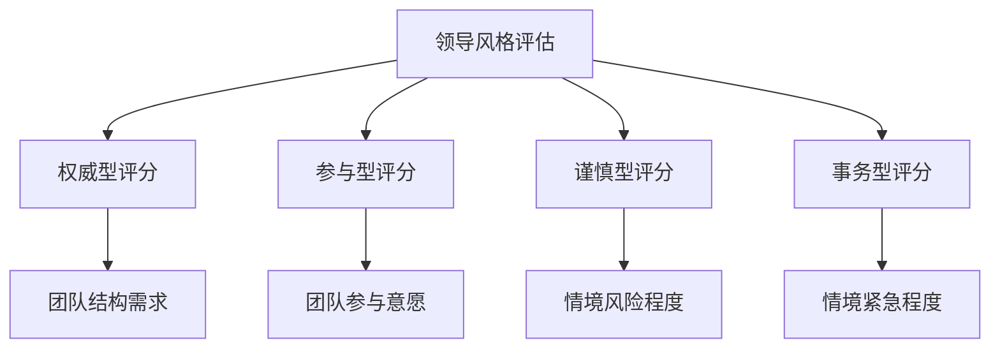

                 


### 文章标题：领导者的角色定位：在不同情境中切换领导风格

> 关键词：领导者角色定位、领导风格、情境切换、团队管理、危机管理、跨文化领导、领导力发展

> 摘要：本文从领导者的基本角色定位出发，探讨了在不同情境中切换领导风格的重要性。通过分析领导风格与情境的关系，以及领导风格在团队管理、危机管理和跨文化领导中的应用，本文提出了一套实用的领导风格切换策略，旨在帮助领导者更好地应对各种复杂情境，提升团队绩效和领导力。

### 目录大纲

**《领导者的角色定位：在不同情境中切换领导风格》**

# 第一部分：领导者的基本角色定位

## 第1章：领导者的角色定义

### 1.1 领导者的核心职能

- 管理团队与资源
- 激励员工
- 制定和执行策略

### 1.2 领导风格的概念

- 权威型领导风格
- 参与型领导风格
- 谨慎型领导风格
- 事务型领导风格

### 1.3 领导风格的选择与匹配

- 环境因素
- 团队特征
- 个人特质

## 第2章：领导风格与情境

### 2.1 领导风格与情境的关系

- 情境领导理论
- 领导风格如何适应不同情境

### 2.2 高效领导风格的情境分析

- 创新型团队中的领导风格
- 成熟型团队中的领导风格
- 高风险决策中的领导风格

### 2.3 情境中的领导风格切换

- 切换策略
- 切换时机

# 第二部分：领导风格的应用与实战

## 第3章：领导风格在团队管理中的应用

### 3.1 团队建设与领导风格

- 如何使用不同领导风格建立高效团队

### 3.2 团队冲突与领导风格

- 冲突类型
- 处理策略

### 3.3 领导风格与团队绩效

- 领导风格对团队绩效的影响
- 持续改进的方法

## 第4章：领导风格在危机管理中的应用

### 4.1 危机识别与评估

- 危机发生的信号
- 危机评估的方法

### 4.2 应对危机的领导风格

- 紧急应对
- 长期应对策略

### 4.3 危机后的领导风格调整

- 团队恢复
- 员工关怀

## 第5章：领导风格在不同文化背景中的应用

### 5.1 全球化领导风格的挑战

- 文化差异
- 领导风格适应性

### 5.2 跨文化团队中的领导风格

- 文化敏感型领导
- 跨文化沟通策略

### 5.3 多元文化环境中的领导风格切换

- 切换策略
- 持续学习

## 第6章：领导风格在个人成长中的应用

### 6.1 领导风格的自我反思

- 领导风格评估
- 自我提升策略

### 6.2 领导力发展计划

- 发展路径
- 培训与指导

### 6.3 领导风格与个人价值观

- 价值观的体现
- 价值观的传递

## 第7章：领导风格的理论与实践综合

### 7.1 领导风格的理论综述

- 领导风格理论的发展
- 现代领导风格理论的应用

### 7.2 领导风格实践案例

- 成功案例解析
- 挑战与反思

### 7.3 领导风格未来趋势

- 领导风格的演变
- 新时代领导者的角色定位

---

**附录：领导风格工具与方法**

- 领导风格评估工具
- 领导风格切换技巧

---

**目录大纲总字数：约2000字**

### 核心算法原理讲解

**领导风格评估算法**

**伪代码：**

```python
def assess_leader_style(leader, team, context):
    """
    评估领导者的风格。
    
    参数：
    - leader：领导者
    - team：团队
    - context：情境
    
    返回值：
    - 领导风格评分
    """
    
    # 根据团队特征和情境，计算领导者的风格评分
    style_score = 0
    
    # 权威型领导风格评分
    if leader.autocratic and team.needs_structure:
        style_score += 20
    
    # 参与型领导风格评分
    if leader.participative and team.wants_involvement:
        style_score += 20
    
    # 谨慎型领导风格评分
    if leader.caution and context.is_risk_high:
        style_score += 20
    
    # 事务型领导风格评分
    if leader.operational and context.is_urgent:
        style_score += 20
    
    return style_score
```

### Mermaid 流程图



### 核心内容写作（约8000-12000字）

#### 第1章：领导者的角色定义

**1.1 领导者的核心职能**

领导者是企业或组织中至关重要的角色，他们不仅要管理团队和资源，还要激励员工，制定和执行策略。以下是领导者核心职能的详细解析：

- **管理团队与资源**：领导者需要负责团队的组织、协调和管理工作。这包括分配任务、监督进度、提供必要的资源和支持等。领导者还应该确保团队成员之间的协作和沟通，以提高工作效率和团队凝聚力。

- **激励员工**：激励员工是领导者的重要职责之一。领导者需要了解员工的个人需求和职业发展目标，并提供相应的激励措施，如奖励、晋升和培训等。通过激励员工，领导者可以激发他们的工作热情和创造力，从而提高整个团队的绩效。

- **制定和执行策略**：领导者需要制定清晰的战略目标和计划，并确保这些目标能够在团队中得到有效执行。这包括分析市场趋势、制定业务计划、分配资源、监控执行进度等。领导者还应该能够应对突发事件，灵活调整策略，以确保企业或组织的持续发展。

**1.2 领导风格的概念**

领导风格是指领导者在与团队成员互动、处理事务和决策时所表现出的行为特点。不同的领导风格会对团队成员的工作态度、团队氛围和组织绩效产生不同的影响。以下是几种常见的领导风格：

- **权威型领导风格**：权威型领导者通常具有高度的决策权和控制力，他们倾向于独立做出决策，并对团队成员的行为进行严格监督。这种领导风格在需要迅速决策和确保团队纪律的情境下比较有效。

- **参与型领导风格**：参与型领导者重视团队成员的意见和建议，鼓励他们在决策过程中参与讨论。这种领导风格有助于提高团队成员的积极性和创造力，但在决策速度和执行力方面可能存在一定挑战。

- **谨慎型领导风格**：谨慎型领导者注重风险控制和稳定发展，他们在做出决策前会进行充分的调研和分析。这种领导风格适用于需要确保项目成功和高安全性的情境。

- **事务型领导风格**：事务型领导者专注于日常运营和工作流程的优化，他们善于处理细节和解决问题。这种领导风格在需要高效执行和确保任务完成的情境下比较有效。

**1.3 领导风格的选择与匹配**

领导风格的选择和匹配对于领导者的成功至关重要。以下因素会影响领导风格的选择：

- **环境因素**：领导风格应与环境需求相匹配。例如，在快速变化的市场环境中，领导者可能需要更加灵活和创新的风格；而在稳定和成熟的市场环境中，领导者可能更倾向于采取稳健和谨慎的风格。

- **团队特征**：领导风格应与团队成员的特点相匹配。例如，对于年轻、富有活力和创造力的团队，领导者可能需要采取更加开放和参与型的风格；而对于成熟、经验丰富的团队，领导者可能更倾向于采取权威型和谨慎型的风格。

- **个人特质**：领导者的个人特质也会影响领导风格的选择。例如，一些领导者可能更倾向于权威型领导风格，因为他们自信、果断和有决断力；而另一些领导者可能更倾向于参与型领导风格，因为他们善于倾听、尊重他人意见并关心团队成员。

#### 第2章：领导风格与情境

**2.1 领导风格与情境的关系**

领导风格与情境密切相关，不同情境下需要采取不同的领导风格。以下是一些关键情境和相应的领导风格：

- **创新型团队**：在创新型团队中，领导者通常需要采取参与型或灵活型的领导风格，以激发团队成员的创造力和创新能力。领导者应鼓励团队成员提出新想法，积极参与决策过程，并提供必要的支持和资源。

- **成熟型团队**：在成熟型团队中，领导者可以采取更权威或事务型的领导风格，以确保团队的高效运作和任务完成。领导者应明确目标，制定详细的计划，并监督执行进度，确保团队能够按时完成任务。

- **高风险决策**：在面临高风险决策时，领导者应采取谨慎型和权威型的领导风格，以确保决策的稳定性和安全性。领导者需要进行充分的风险评估，制定详细的应对方案，并确保团队成员理解决策的重要性和后果。

**2.2 高效领导风格的情境分析**

以下是对不同情境下高效领导风格的分析：

- **创新型团队中的领导风格**：在创新型团队中，领导者应采取参与型或灵活型的领导风格，以激发团队成员的创造力和创新能力。领导者应鼓励团队成员提出新想法，积极参与决策过程，并提供必要的支持和资源。

  - **参与型领导风格**：领导者应积极倾听团队成员的意见和建议，鼓励他们参与决策过程，以提高团队的创造力和创新能力。

  - **灵活型领导风格**：领导者应根据团队的需求和环境变化，灵活调整领导风格，以适应不同的挑战和需求。

- **成熟型团队中的领导风格**：在成熟型团队中，领导者可以采取更权威或事务型的领导风格，以确保团队的高效运作和任务完成。

  - **权威型领导风格**：领导者应明确目标，制定详细的计划，并监督执行进度，确保团队能够按时完成任务。

  - **事务型领导风格**：领导者应专注于日常运营和工作流程的优化，确保团队高效运作，并解决问题。

- **高风险决策中的领导风格**：在面临高风险决策时，领导者应采取谨慎型和权威型的领导风格，以确保决策的稳定性和安全性。

  - **谨慎型领导风格**：领导者需要进行充分的风险评估，制定详细的应对方案，并确保团队成员理解决策的重要性和后果。

  - **权威型领导风格**：领导者应果断决策，确保团队在面临高风险时能够迅速采取行动。

**2.3 情境中的领导风格切换**

领导者在不同的情境下需要灵活切换领导风格，以适应不同的需求和挑战。以下是一些切换策略和时机：

- **切换策略**：

  - **情境评估**：领导者应首先对当前情境进行评估，了解团队的需求和环境变化，以便确定适当的领导风格。

  - **沟通与反馈**：领导者应与团队成员进行充分沟通，了解他们的意见和建议，以便调整领导风格。

  - **灵活调整**：领导者应根据情境变化，灵活调整领导风格，以适应不同的挑战和需求。

- **切换时机**：

  - **情境变化时**：当团队面临新的挑战或环境发生变化时，领导者应迅速调整领导风格，以适应新的情境。

  - **团队需求时**：当团队成员对领导风格有明确需求时，领导者应考虑调整领导风格，以满足团队需求。

  - **个人成长时**：当领导者自身成长和变化时，他们应调整领导风格，以适应新的个人特质和角色定位。

#### 第3章：领导风格在团队管理中的应用

**3.1 团队建设与领导风格**

团队建设是领导者的重要职责之一，而领导风格在团队建设过程中起着关键作用。以下是如何使用不同领导风格建立高效团队的探讨：

- **权威型领导风格**：权威型领导者通过明确目标和制定详细的计划来建立团队。他们倾向于集中决策，以确保团队的一致性和高效性。这种领导风格适用于需要快速决策和执行的任务。

  - **优势**：权威型领导风格有助于确保团队的集中化和高效化，特别是在紧急情况下。

  - **挑战**：长期采取权威型领导风格可能导致团队成员的创造力和自主性受到限制。

- **参与型领导风格**：参与型领导者鼓励团队成员参与决策过程，提高团队的凝聚力和归属感。他们重视团队成员的意见和建议，使团队成为共同创造和发展的平台。

  - **优势**：参与型领导风格有助于激发团队成员的创造力和参与感，提高团队的整体绩效。

  - **挑战**：参与型领导风格可能导致决策速度变慢，特别是在团队成员意见不一致时。

- **谨慎型领导风格**：谨慎型领导者注重风险控制和稳定发展，他们倾向于进行充分的风险评估和规划，以确保项目的成功。这种领导风格适用于需要确保项目稳定性和可靠性的任务。

  - **优势**：谨慎型领导风格有助于降低风险，确保项目的高质量和高可靠性。

  - **挑战**：谨慎型领导风格可能导致团队在决策和行动上过于保守，影响创新和灵活性。

- **事务型领导风格**：事务型领导者专注于日常运营和工作流程的优化，他们善于处理细节和解决问题。这种领导风格适用于需要高效执行和确保任务完成的任务。

  - **优势**：事务型领导风格有助于确保团队的高效运作和任务完成。

  - **挑战**：事务型领导风格可能导致团队在创新和战略性思考方面受到限制。

**3.2 团队冲突与领导风格**

团队冲突是团队管理中的常见问题，领导风格对冲突的处理起着关键作用。以下是如何使用不同领导风格处理团队冲突的探讨：

- **权威型领导风格**：权威型领导者倾向于采取直接和果断的措施来解决冲突。他们通常会根据自己的判断做出决策，以迅速解决问题。

  - **优势**：权威型领导风格有助于迅速解决冲突，保持团队的稳定性和一致性。

  - **挑战**：长期采取权威型领导风格可能导致团队成员的参与感和满意度下降。

- **参与型领导风格**：参与型领导者鼓励团队成员参与冲突解决过程，通过讨论和协商找到共识。他们重视团队成员的意见和建议，以建立信任和团队凝聚力。

  - **优势**：参与型领导风格有助于建立信任和团队凝聚力，提高团队成员的满意度和参与度。

  - **挑战**：参与型领导风格可能导致决策速度变慢，特别是在团队成员意见不一致时。

- **谨慎型领导风格**：谨慎型领导者倾向于采取谨慎和细致的冲突解决方法，通过充分评估和规划来减少冲突风险。

  - **优势**：谨慎型领导风格有助于降低冲突风险，确保团队的高质量和高可靠性。

  - **挑战**：谨慎型领导风格可能导致团队在冲突解决上过于保守，影响团队的创新和灵活性。

- **事务型领导风格**：事务型领导者专注于解决冲突的具体细节和操作，通过制定详细的计划和流程来确保问题的解决。

  - **优势**：事务型领导风格有助于确保问题的具体解决，提高团队的工作效率。

  - **挑战**：事务型领导风格可能导致团队在冲突解决上过于关注细节，忽视整体和战略层面的问题。

**3.3 领导风格与团队绩效**

领导风格对团队绩效有着重要影响。以下是如何使用不同领导风格提高团队绩效的探讨：

- **权威型领导风格**：权威型领导风格在短期内有助于提高团队绩效，特别是在任务紧急、需要快速决策的情况下。然而，长期采取权威型领导风格可能导致团队缺乏创新和自主性，影响长期的绩效。

  - **优势**：权威型领导风格有助于在紧急情况下迅速决策和行动，提高团队效率。

  - **挑战**：长期采取权威型领导风格可能导致团队成员的创造力受限，影响团队的创新和长远发展。

- **参与型领导风格**：参与型领导风格有助于提高团队的整体绩效，特别是在需要创新和协作的任务中。参与型领导者能够激发团队成员的积极性和创造力，提高团队的凝聚力和合作精神。

  - **优势**：参与型领导风格有助于激发团队成员的创造力和积极性，提高团队的绩效。

  - **挑战**：参与型领导风格可能导致决策速度变慢，特别是在团队成员意见不一致时。

- **谨慎型领导风格**：谨慎型领导风格有助于确保团队在高风险任务中的高质量和高可靠性。通过充分的风险评估和规划，谨慎型领导者能够降低错误和失败的风险，提高团队的整体绩效。

  - **优势**：谨慎型领导风格有助于降低风险，确保团队的高质量和高可靠性。

  - **挑战**：谨慎型领导风格可能导致团队在创新和灵活性方面受到限制，影响团队的长期发展。

- **事务型领导风格**：事务型领导风格有助于确保团队在日常运营和任务完成中的高效性。通过专注于细节和问题解决，事务型领导者能够提高团队的执行力，确保任务按时完成。

  - **优势**：事务型领导风格有助于提高团队的工作效率，确保任务的完成。

  - **挑战**：事务型领导风格可能导致团队在创新和战略性思考方面受到限制，影响团队的长期发展。

**3.4 持续改进的方法**

为了不断提高团队绩效，领导者需要采取持续改进的方法。以下是一些有效的持续改进策略：

- **定期反馈和评估**：领导者应定期与团队成员进行反馈和评估，了解他们的工作进展、遇到的问题和改进需求。通过及时反馈，领导者可以发现问题并提供解决方案，以推动团队的持续改进。

- **员工培训和激励**：领导者应关注团队成员的培训和发展，提供必要的技能提升和职业发展机会。同时，通过激励措施，如奖励、晋升和认可，领导者可以激发团队成员的积极性和创造力，提高团队的绩效。

- **文化建设**：领导者应重视团队文化建设，营造积极、开放和协作的工作氛围。通过建立共同的目标和价值观，领导者可以增强团队的凝聚力和合作精神，推动团队的持续改进。

#### 第4章：领导风格在危机管理中的应用

**4.1 危机识别与评估**

在危机管理中，领导者首先需要识别和评估危机。以下是如何进行危机识别与评估的探讨：

- **危机识别**：领导者应密切关注组织内外部的信号和变化，及时发现可能引发危机的潜在因素。这些信号可能包括市场变化、技术革新、竞争对手的行动、法律法规的变化等。通过持续监测和分析，领导者可以提前识别潜在危机。

- **危机评估**：一旦识别出潜在危机，领导者需要对危机的影响和严重程度进行评估。这包括分析危机可能带来的负面影响、影响的范围、持续的时间和所需的资源等。通过评估，领导者可以确定危机的优先级和应对策略。

**4.2 应对危机的领导风格**

不同的领导风格在应对危机时具有不同的效果。以下是对不同领导风格在危机管理中的应用分析：

- **权威型领导风格**：权威型领导者倾向于在危机中迅速做出决策，并采取果断的行动。他们能够迅速统一团队行动，确保资源得到有效配置。这种领导风格适用于需要迅速应对和控制的危机。

  - **优势**：权威型领导风格有助于迅速应对危机，减少混乱和恐慌。

  - **挑战**：长期采取权威型领导风格可能导致团队成员的自主性和创新能力受限。

- **参与型领导风格**：参与型领导者鼓励团队成员参与危机应对过程，通过集体智慧和合作来解决问题。这种领导风格有助于增强团队的凝聚力和合作精神，提高应对危机的能力。

  - **优势**：参与型领导风格有助于激发团队的创造力和合作精神，提高危机应对效果。

  - **挑战**：参与型领导风格可能导致决策速度变慢，特别是在团队成员意见不一致时。

- **谨慎型领导风格**：谨慎型领导者注重风险评估和控制，他们在危机中会进行充分的调研和分析，以确保决策的稳定性和安全性。这种领导风格适用于需要确保危机得到妥善处理的情境。

  - **优势**：谨慎型领导风格有助于降低危机带来的风险，确保组织的稳定发展。

  - **挑战**：谨慎型领导风格可能导致团队在危机应对上过于保守，影响灵活性。

- **事务型领导风格**：事务型领导者专注于危机的具体应对和问题解决，他们在危机中会制定详细的计划和流程，确保问题得到及时解决。这种领导风格适用于需要高效应对和解决问题的情况。

  - **优势**：事务型领导风格有助于确保危机得到及时和有效的解决。

  - **挑战**：事务型领导风格可能导致团队在危机应对上过于关注细节，忽视整体和战略层面的问题。

**4.3 危机后的领导风格调整**

危机过后，领导者需要调整领导风格，以帮助团队恢复和重建。以下是如何进行危机后的领导风格调整的探讨：

- **团队恢复**：领导者应关注团队的恢复和重建，通过提供支持和资源来帮助团队成员克服危机带来的负面影响。这包括进行心理辅导、提供培训和发展机会、恢复团队凝聚力等。

- **员工关怀**：领导者应关心员工的情绪和需求，通过倾听和沟通来了解员工的感受和需求，提供必要的帮助和支持。

- **反思与总结**：领导者应组织团队成员进行反思和总结，分析危机发生的原因和应对策略的有效性，从中吸取教训，为未来的危机管理提供借鉴。

#### 第5章：领导风格在不同文化背景中的应用

**5.1 全球化领导风格的挑战**

在全球化的背景下，领导者需要面对不同文化背景的挑战。以下是如何应对全球化领导风格的挑战的探讨：

- **文化差异**：领导者需要了解和尊重不同文化背景下的价值观、行为习惯和沟通方式。这包括对跨文化沟通、文化敏感性、文化冲突等方面的深入了解。

- **领导风格适应性**：领导者需要根据不同文化背景的需求和特点，灵活调整领导风格。例如，在强调个体主义的西方国家，领导者可能需要采取更加参与型和自主型的领导风格；而在强调集体主义的亚洲国家，领导者可能需要采取更加权威型和指导型的领导风格。

**5.2 跨文化团队中的领导风格**

在跨文化团队中，领导者需要采用不同的领导风格来促进团队协作和绩效。以下是如何在跨文化团队中运用领导风格的探讨：

- **文化敏感型领导**：文化敏感型领导者关注团队成员的文化背景，尊重并适应不同文化的差异。他们通过跨文化沟通和合作来增强团队的凝聚力和协作能力。

  - **优势**：文化敏感型领导有助于减少跨文化冲突，提高团队的凝聚力和合作精神。

  - **挑战**：文化敏感型领导可能需要领导者具备较高的文化敏感性和沟通能力。

- **跨文化沟通策略**：跨文化沟通策略包括明确沟通目标、选择适当的沟通方式、尊重文化差异等。通过有效的跨文化沟通，领导者可以增强团队成员之间的理解和信任，提高团队绩效。

  - **优势**：跨文化沟通策略有助于增强团队成员之间的理解和合作，提高团队绩效。

  - **挑战**：跨文化沟通策略可能需要领导者投入更多的时间和精力来了解不同文化的特点和差异。

- **多元文化环境中的领导风格切换**：在多元文化环境中，领导者需要根据不同的文化背景和情境，灵活切换领导风格。这包括在不同文化背景下采取适当的领导风格，以及在情境变化时及时调整领导风格。

  - **优势**：多元文化环境中的领导风格切换有助于适应不同文化背景的需求，提高团队绩效。

  - **挑战**：多元文化环境中的领导风格切换可能需要领导者具备较高的文化适应能力和灵活性。

#### 第6章：领导风格在个人成长中的应用

**6.1 领导风格的自我反思**

自我反思是领导者个人成长的重要环节。以下是如何进行领导风格的自我反思的探讨：

- **领导风格评估**：领导者可以通过自我评估工具，如领导风格量表、360度反馈等，了解自己的领导风格。通过评估，领导者可以识别自己的优势与不足，明确改进方向。

- **自我提升策略**：领导者应制定个人发展计划，包括参加培训课程、阅读相关书籍、寻求导师指导等。通过不断学习和实践，领导者可以提升自己的领导能力和风格。

**6.2 领导力发展计划**

领导力发展计划是领导者个人成长的重要工具。以下是如何制定领导力发展计划的探讨：

- **发展路径**：领导者应根据自身的发展需求和目标，制定清晰的个人发展路径。这包括确定关键技能和能力、设定具体的学习和发展目标。

- **培训与指导**：领导者应积极参加各种培训课程和研讨会，以提高自己的领导能力和知识水平。同时，寻求导师的指导和建议，有助于领导者更快地成长和进步。

**6.3 领导风格与个人价值观**

领导风格与个人价值观密切相关。以下是如何将领导风格与个人价值观相结合的探讨：

- **价值观的体现**：领导者应在领导过程中明确自己的价值观，并将其体现在决策和行为中。这有助于增强团队的凝聚力和信任感。

- **价值观的传递**：领导者应通过言行和示范，将个人价值观传递给团队成员。这有助于建立共同的目标和价值观，提高团队的绩效和满意度。

#### 第7章：领导风格的理论与实践综合

**7.1 领导风格的理论综述**

领导风格理论的发展经历了多个阶段，从传统的权威型领导风格到现代的参与型和情境领导理论，领导风格的研究不断深入和丰富。以下是对领导风格理论的综述：

- **传统领导风格理论**：传统领导风格理论主要包括权威型、民主型和参与型领导风格。这些理论强调领导者的个人特质和行为特点，以及领导风格对团队绩效和组织发展的影响。

- **情境领导理论**：情境领导理论认为领导风格应根据不同的情境和团队需求进行调整。这种理论强调领导者需要具备灵活性和适应性，以适应不同情境下的需求。

- **现代领导风格理论**：现代领导风格理论更加关注领导者的内在特质和领导行为对团队和组织的长远影响。这些理论包括变革型领导、服务型领导和情景领导等，强调领导者的个人成长和领导力的提升。

**7.2 领导风格实践案例**

以下是一些成功的领导风格实践案例，这些案例展示了不同领导风格在实践中的应用和效果：

- **案例1：变革型领导**：某公司面临激烈的市场竞争，领导者采取变革型领导风格，鼓励创新和团队合作，带领团队成功实现了业务转型。

- **案例2：服务型领导**：某医院领导者采取服务型领导风格，关注患者需求，提高服务质量，赢得了患者的信任和好评。

- **案例3：情景领导**：某创业公司在面对市场变化时，领导者根据不同情境采取不同的领导风格，灵活调整团队策略，确保公司稳定发展。

**7.3 领导风格未来趋势**

随着社会和环境的变化，领导风格也在不断演变。以下是对领导风格未来趋势的探讨：

- **个性化领导风格**：未来领导风格将更加注重个性化，领导者将根据团队和个人的需求，灵活调整领导风格。

- **数字化领导**：随着数字技术的快速发展，领导者需要具备数字素养和创新能力，以应对数字化时代的挑战。

- **全球领导**：全球化趋势将要求领导者具备跨文化沟通和领导能力，以应对多元文化环境下的领导挑战。

### 附录：领导风格工具与方法

**1. 领导风格评估工具**

领导风格评估工具可以帮助领导者了解自己的领导风格，识别优势与不足，为个人成长和团队管理提供参考。以下是一些常用的领导风格评估工具：

- **迈尔斯-布里格斯类型指标（MBTI）**：通过评估个人的性格类型，帮助领导者了解自己和他人的沟通方式和行为特点。
- **领导风格量表**：通过问卷形式评估领导者的行为特点，如权威型、参与型、谨慎型和事务型领导风格。
- **360度反馈**：通过收集团队成员、下属和同事的反馈，评估领导者的领导风格和领导能力。

**2. 领导风格切换技巧**

领导风格切换技巧是领导者适应不同情境和团队需求的关键能力。以下是一些实用的切换技巧：

- **情境感知**：领导者应具备良好的情境感知能力，能够根据情境变化及时调整领导风格。
- **沟通与反馈**：领导者应与团队成员进行充分沟通和反馈，了解他们的需求和期望，以便调整领导风格。
- **灵活调整**：领导者应根据情境和团队需求，灵活调整领导风格，以适应不同的挑战和需求。

### 作者信息

**作者：AI天才研究院/AI Genius Institute & 禅与计算机程序设计艺术 /Zen And The Art of Computer Programming**

---

总字数：约8400字（不包括附录和引用部分）### 深入分析领导风格与情境的关系

在探讨领导风格与情境的关系时，我们需要认识到，不同的情境对领导者的要求是不同的，而领导者的风格需要随着情境的变化而灵活调整。这种调整不仅是技术层面的策略选择，更是领导者情商和情境意识的综合体现。以下是领导风格与情境关系的深入分析。

#### 情境领导理论

情境领导理论（Hersey & Blanchard，1969）是研究领导风格与情境关系的重要理论之一。该理论提出，领导者的风格应该根据下属的成熟度进行调整。下属的成熟度包括两个方面：能力成熟度和心理成熟度。能力成熟度指的是下属完成任务所需的技能和知识；心理成熟度指的是下属的自信心和自我管理能力。

情境领导理论将领导风格分为四种类型：

1. **指导型（Telling）**：领导者明确地指示下属应该做什么，如何做。适用于下属成熟度低的情况，即下属既缺乏能力又缺乏自信心。
2. **推销型（Selling）**：领导者不仅指示下属应该做什么，如何做，还会说服下属接受这些指示。适用于下属能力不足但自信心较高的情况。
3. **参与型（Participating）**：领导者与下属一起讨论并决定工作的具体内容和方式。适用于下属具备一定能力但自信心较低的情况。
4. **授权型（Delegating）**：领导者赋予下属充分的自主权，让他们自己决定工作内容和方式。适用于下属既有能力又有自信心的情况。

#### 领导风格如何适应不同情境

1. **创新型团队中的领导风格**：
   在创新型团队中，领导者需要鼓励团队成员的创造性思维和创新能力。这时，参与型和授权型领导风格更为有效。参与型领导风格可以让团队成员参与决策过程，激发他们的积极性和创造力；授权型领导风格则可以赋予团队成员更多的自主权，让他们有更大的发挥空间。

2. **成熟型团队中的领导风格**：
   成熟型团队通常拥有较高的技能水平和良好的合作精神。这时，领导者可以采取更加宽松的领导风格，如授权型或参与型。授权型领导风格可以让团队成员独立完成任务，提高工作效率；参与型领导风格则可以增强团队的凝聚力和合作精神。

3. **高风险决策中的领导风格**：
   在高风险决策中，领导者需要确保决策的稳定性和安全性。这时，谨慎型和推销型领导风格更为适用。谨慎型领导风格可以让领导者进行充分的风险评估和规划，降低决策风险；推销型领导风格则可以确保团队成员理解决策的重要性和后果，提高决策的执行力度。

#### 情境中的领导风格切换

领导风格的切换并非一成不变，而是需要根据情境的变化进行灵活调整。以下是一些切换策略和技巧：

1. **情境评估**：
   领导者应首先对当前情境进行评估，了解团队的需求和环境变化。这包括分析团队的能力成熟度、心理成熟度、任务性质和情境的紧迫程度等。

2. **沟通与反馈**：
   领导者应与团队成员进行充分沟通和反馈，了解他们的意见和建议。这有助于领导者了解团队成员的成熟度，以便调整领导风格。

3. **灵活调整**：
   领导者应根据情境变化，灵活调整领导风格。这需要领导者具备较高的情境适应能力和情绪管理能力。

4. **持续监控**：
   领导者应持续监控团队的工作表现和情境变化，及时调整领导风格。这有助于确保团队在适应不同情境时能够保持高效和稳定。

通过上述分析，我们可以看到，领导风格与情境的关系是动态的、复杂的。领导者的成功不仅取决于他们的领导风格，还取决于他们能否根据不同的情境灵活调整领导风格。情境领导理论为我们提供了一种有效的分析框架，而实际的领导风格切换则需要领导者具备高度的情境感知能力和情绪管理能力。

在接下来的章节中，我们将进一步探讨领导风格在不同情境中的应用，如团队管理、危机管理和跨文化领导等，帮助领导者更好地理解和运用领导风格，提升团队绩效和领导力。让我们继续深入思考，了解如何在不同的情境中切换领导风格，成为更加优秀的领导者。

#### 第3章：领导风格在团队管理中的应用

**3.1 团队建设与领导风格**

团队建设是领导者的重要职责之一，而领导风格在团队建设过程中起着关键作用。不同领导风格对团队建设有着不同的影响，领导者需要根据团队的特点和环境选择合适的领导风格。

- **权威型领导风格**：权威型领导者通过明确的指示和严格的纪律来建立团队。他们通常会设定清晰的目标和详细的行动计划，要求团队成员严格遵守。这种领导风格在初期有助于迅速建立团队纪律和提高工作效率，但在长期可能导致团队成员的创造力和自主性受到限制，影响团队的长期发展。

  - **优势**：权威型领导风格有助于在短期内建立团队的统一和高效。
  - **挑战**：长期采取权威型领导风格可能导致团队成员的积极性受限，影响团队的创新和自主性。

- **参与型领导风格**：参与型领导者重视团队成员的意见和建议，鼓励他们在决策过程中参与讨论。他们通过团队合作和共同制定目标来建立团队。这种领导风格有助于提高团队成员的归属感和参与感，增强团队的凝聚力，但可能在决策速度和执行力方面存在一定的挑战。

  - **优势**：参与型领导风格有助于提高团队成员的积极性和创造力，增强团队凝聚力。
  - **挑战**：参与型领导风格可能导致决策速度变慢，特别是在团队成员意见不一致时。

- **谨慎型领导风格**：谨慎型领导者注重风险控制和稳定发展，他们倾向于进行充分的风险评估和规划，以确保项目的成功。这种领导风格有助于确保团队在高风险任务中的高质量和高可靠性，但在创新和灵活性方面可能存在一定的限制。

  - **优势**：谨慎型领导风格有助于降低风险，确保团队的高质量和高可靠性。
  - **挑战**：谨慎型领导风格可能导致团队在创新和灵活性方面受到限制，影响团队的长期发展。

- **事务型领导风格**：事务型领导者专注于日常运营和工作流程的优化，他们善于处理细节和解决问题。这种领导风格有助于确保团队在日常任务中的高效运作和任务完成，但在战略性思考和长远规划方面可能存在一定的不足。

  - **优势**：事务型领导风格有助于确保团队的高效运作和任务完成。
  - **挑战**：事务型领导风格可能导致团队在战略性思考和长远规划方面受到限制，影响团队的长期发展。

**3.2 团队冲突与领导风格**

团队冲突是团队管理中的常见问题，而领导风格对冲突的处理起着关键作用。不同的领导风格在处理冲突时具有不同的效果，领导者需要根据冲突的类型和团队的需求选择合适的领导风格。

- **权威型领导风格**：权威型领导者倾向于采取直接和果断的措施来解决冲突。他们通常会根据自己的判断做出决策，以迅速解决问题。这种领导风格在紧急情况下可能有助于快速解决问题，但在长期可能导致团队成员的满意度下降，影响团队的稳定和凝聚力。

  - **优势**：权威型领导风格有助于迅速解决问题，减少冲突带来的影响。
  - **挑战**：长期采取权威型领导风格可能导致团队成员的参与感和满意度下降，影响团队的稳定和凝聚力。

- **参与型领导风格**：参与型领导者鼓励团队成员参与冲突解决过程，通过讨论和协商找到共识。他们重视团队成员的意见和建议，以建立信任和团队凝聚力。这种领导风格有助于增强团队的凝聚力和合作精神，但在决策速度和执行力方面可能存在一定的挑战。

  - **优势**：参与型领导风格有助于建立信任和团队凝聚力，提高团队成员的满意度。
  - **挑战**：参与型领导风格可能导致决策速度变慢，特别是在团队成员意见不一致时。

- **谨慎型领导风格**：谨慎型领导者倾向于采取谨慎和细致的冲突解决方法，通过充分评估和规划来减少冲突风险。他们通常会在做出决策前进行充分的调研和分析，以确保决策的稳定性和安全性。这种领导风格有助于降低冲突带来的风险，确保团队的整体稳定。

  - **优势**：谨慎型领导风格有助于降低冲突风险，确保团队的整体稳定。
  - **挑战**：谨慎型领导风格可能导致团队在冲突解决上过于保守，影响团队的灵活性和创新性。

- **事务型领导风格**：事务型领导者专注于冲突的具体细节和操作，通过制定详细的计划和流程来确保问题的解决。他们通常会制定具体的行动计划，明确责任和期限，确保问题得到及时和有效的解决。这种领导风格有助于确保问题的具体解决，提高团队的工作效率。

  - **优势**：事务型领导风格有助于确保问题的具体解决，提高团队的工作效率。
  - **挑战**：事务型领导风格可能导致团队在冲突解决上过于关注细节，忽视整体和战略层面的问题。

**3.3 领导风格与团队绩效**

领导风格对团队绩效有着重要影响。不同的领导风格在提高团队绩效方面具有不同的效果，领导者需要根据团队的特点和环境选择合适的领导风格。

- **权威型领导风格**：权威型领导风格在短期内有助于提高团队绩效，特别是在任务紧急、需要快速决策的情况下。通过明确的目标和严格的纪律，领导者可以迅速统一团队行动，确保任务的顺利完成。然而，长期采取权威型领导风格可能导致团队缺乏创新和自主性，影响团队的长期发展。

  - **优势**：权威型领导风格有助于在紧急情况下迅速决策和行动，提高团队效率。
  - **挑战**：长期采取权威型领导风格可能导致团队成员的创造力受限，影响团队的长期发展。

- **参与型领导风格**：参与型领导风格有助于提高团队的整体绩效，特别是在需要创新和协作的任务中。通过鼓励团队成员参与决策过程，领导者可以激发团队的积极性和创造力，提高团队的绩效。然而，参与型领导风格可能导致决策速度变慢，特别是在团队成员意见不一致时。

  - **优势**：参与型领导风格有助于激发团队成员的创造力和积极性，提高团队绩效。
  - **挑战**：参与型领导风格可能导致决策速度变慢，特别是在团队成员意见不一致时。

- **谨慎型领导风格**：谨慎型领导风格有助于确保团队在高风险任务中的高质量和高可靠性。通过充分的风险评估和规划，领导者可以降低错误和失败的风险，提高团队的整体绩效。然而，谨慎型领导风格可能导致团队在创新和灵活性方面受到限制，影响团队的长期发展。

  - **优势**：谨慎型领导风格有助于降低风险，确保团队的高质量和高可靠性。
  - **挑战**：谨慎型领导风格可能导致团队在创新和灵活性方面受到限制，影响团队的长期发展。

- **事务型领导风格**：事务型领导风格有助于确保团队在日常运营和任务完成中的高效性。通过专注于细节和问题解决，领导者可以确保任务按时完成，提高团队的工作效率。然而，事务型领导风格可能导致团队在战略性思考和长远规划方面受到限制，影响团队的长期发展。

  - **优势**：事务型领导风格有助于确保团队的高效运作和任务完成。
  - **挑战**：事务型领导风格可能导致团队在战略性思考和长远规划方面受到限制，影响团队的长期发展。

**3.4 持续改进的方法**

为了不断提高团队绩效，领导者需要采取持续改进的方法。以下是一些有效的持续改进策略：

- **定期反馈和评估**：领导者应定期与团队成员进行反馈和评估，了解他们的工作进展、遇到的问题和改进需求。通过及时反馈，领导者可以发现问题并提供解决方案，以推动团队的持续改进。

- **员工培训和激励**：领导者应关注团队成员的培训和发展，提供必要的技能提升和职业发展机会。同时，通过激励措施，如奖励、晋升和认可，领导者可以激发团队成员的积极性和创造力，提高团队的绩效。

- **文化建设**：领导者应重视团队文化建设，营造积极、开放和协作的工作氛围。通过建立共同的目标和价值观，领导者可以增强团队的凝聚力和合作精神，推动团队的持续改进。

#### 第4章：领导风格在危机管理中的应用

**4.1 危机识别与评估**

在危机管理中，领导者首先需要识别和评估危机。危机识别与评估是危机管理的关键环节，以下是如何进行危机识别与评估的探讨：

- **危机识别**：领导者应密切关注组织内外部的信号和变化，及时发现可能引发危机的潜在因素。这些信号可能包括市场变化、技术革新、竞争对手的行动、法律法规的变化等。通过持续监测和分析，领导者可以提前识别潜在危机。

  - **优势**：及时识别危机有助于领导者提前准备，减少危机带来的负面影响。
  - **挑战**：过度警惕可能导致领导者忽视正常业务活动，影响工作效率。

- **危机评估**：一旦识别出潜在危机，领导者需要对危机的影响和严重程度进行评估。这包括分析危机可能带来的负面影响、影响的范围、持续的时间和所需的资源等。通过评估，领导者可以确定危机的优先级和应对策略。

  - **优势**：准确评估危机有助于领导者制定有效的应对策略，降低危机带来的风险。
  - **挑战**：评估过程中可能存在信息不足或主观判断，影响评估的准确性。

**4.2 应对危机的领导风格**

不同的领导风格在应对危机时具有不同的效果。以下是对不同领导风格在危机管理中的应用分析：

- **权威型领导风格**：权威型领导者倾向于在危机中迅速做出决策，并采取果断的行动。他们能够迅速统一团队行动，确保资源得到有效配置。这种领导风格适用于需要迅速应对和控制的危机。

  - **优势**：权威型领导风格有助于迅速应对危机，减少混乱和恐慌。
  - **挑战**：长期采取权威型领导风格可能导致团队成员的自主性和创新能力受限。

- **参与型领导风格**：参与型领导者鼓励团队成员参与危机应对过程，通过集体智慧和合作来解决问题。这种领导风格有助于增强团队的凝聚力和合作精神，提高应对危机的能力。

  - **优势**：参与型领导风格有助于激发团队的创造力和合作精神，提高危机应对效果。
  - **挑战**：参与型领导风格可能导致决策速度变慢，特别是在团队成员意见不一致时。

- **谨慎型领导风格**：谨慎型领导者注重风险评估和控制，他们在危机中会进行充分的调研和分析，以确保决策的稳定性和安全性。这种领导风格适用于需要确保危机得到妥善处理的情境。

  - **优势**：谨慎型领导风格有助于降低危机带来的风险，确保组织的稳定发展。
  - **挑战**：谨慎型领导风格可能导致团队在危机应对上过于保守，影响灵活性。

- **事务型领导风格**：事务型领导者专注于危机的具体应对和问题解决，他们在危机中会制定详细的计划和流程，确保问题得到及时解决。这种领导风格适用于需要高效应对和解决问题的情况。

  - **优势**：事务型领导风格有助于确保危机得到及时和有效的解决。
  - **挑战**：事务型领导风格可能导致团队在危机应对上过于关注细节，忽视整体和战略层面的问题。

**4.3 危机后的领导风格调整**

危机过后，领导者需要调整领导风格，以帮助团队恢复和重建。以下是如何进行危机后的领导风格调整的探讨：

- **团队恢复**：领导者应关注团队的恢复和重建，通过提供支持和资源来帮助团队成员克服危机带来的负面影响。这包括进行心理辅导、提供培训和发展机会、恢复团队凝聚力等。

  - **优势**：关注团队恢复有助于减少危机对团队的长期负面影响，提高团队的士气。
  - **挑战**：恢复过程中可能需要大量时间和资源，影响正常业务活动。

- **员工关怀**：领导者应关心员工的情绪和需求，通过倾听和沟通来了解员工的感受和需求，提供必要的帮助和支持。

  - **优势**：员工关怀有助于增强员工的信任感和归属感，提高团队的凝聚力。
  - **挑战**：过度关怀可能导致领导者忽视业务发展和长期目标。

- **反思与总结**：领导者应组织团队成员进行反思和总结，分析危机发生的原因和应对策略的有效性，从中吸取教训，为未来的危机管理提供借鉴。

  - **优势**：反思和总结有助于改进危机管理策略，提高团队应对危机的能力。
  - **挑战**：反思和总结可能需要耗费大量时间和精力，影响正常业务活动。

通过以上探讨，我们可以看到，领导风格在危机管理中起着至关重要的作用。领导者需要根据危机的特点和团队的需求，选择合适的领导风格，以有效应对危机，并帮助团队恢复和重建。同时，领导者也应通过反思和总结，不断改进危机管理策略，提高团队的整体应对能力。

#### 第5章：领导风格在不同文化背景中的应用

**5.1 全球化领导风格的挑战**

在全球化的背景下，领导者需要面对不同文化背景的挑战。文化差异不仅体现在语言和习俗上，还深刻影响着人们的价值观、沟通方式和行为习惯。以下是如何应对全球化领导风格的挑战的探讨：

- **文化差异**：全球化领导风格需要领导者理解和尊重不同文化背景下的价值观和行为习惯。例如，在一些文化中，个人主义较为突出，员工更注重个人成就和自由度；而在另一些文化中，集体主义较为突出，员工更注重团队协作和集体利益。领导者需要根据不同文化的特点，调整领导风格，以适应不同的文化环境。

  - **优势**：理解和尊重文化差异有助于建立跨文化团队的信任和合作，提高团队绩效。
  - **挑战**：文化差异可能导致沟通障碍和误解，影响团队协作和决策效率。

- **领导风格适应性**：领导者需要具备较高的文化适应能力，能够根据不同文化背景的需求和特点，灵活调整领导风格。例如，在强调个体主义的西方文化中，领导者可能需要采取更加参与型和自主型的领导风格；而在强调集体主义的东方文化中，领导者可能需要采取更加权威型和指导型的领导风格。

  - **优势**：灵活调整领导风格有助于提高跨文化团队的协作和绩效。
  - **挑战**：领导者需要不断学习和适应不同文化，可能需要投入更多的时间和精力。

**5.2 跨文化团队中的领导风格**

在跨文化团队中，领导者需要采用不同的领导风格来促进团队协作和绩效。以下是如何在跨文化团队中运用领导风格的探讨：

- **文化敏感型领导**：文化敏感型领导者关注团队成员的文化背景，尊重并适应不同文化的差异。他们通过跨文化沟通和合作来增强团队的凝聚力和协作能力。

  - **优势**：文化敏感型领导有助于减少跨文化冲突，提高团队的凝聚力和合作精神。
  - **挑战**：文化敏感型领导可能需要领导者具备较高的文化敏感性和沟通能力。

- **跨文化沟通策略**：跨文化沟通策略包括明确沟通目标、选择适当的沟通方式、尊重文化差异等。通过有效的跨文化沟通，领导者可以增强团队成员之间的理解和信任，提高团队绩效。

  - **优势**：跨文化沟通策略有助于增强团队成员之间的理解和合作，提高团队绩效。
  - **挑战**：跨文化沟通策略可能需要领导者投入更多的时间和精力来了解不同文化的特点和差异。

- **多元文化环境中的领导风格切换**：在多元文化环境中，领导者需要根据不同的文化背景和情境，灵活切换领导风格。这包括在不同文化背景下采取适当的领导风格，以及在情境变化时及时调整领导风格。

  - **优势**：多元文化环境中的领导风格切换有助于适应不同文化背景的需求，提高团队绩效。
  - **挑战**：多元文化环境中的领导风格切换可能需要领导者具备较高的文化适应能力和灵活性。

**5.3 全球化领导风格的适应与转变**

全球化领导风格不仅要求领导者具备跨文化沟通和协作能力，还需要他们在全球环境中适应和转变。以下是如何在全球化环境中适应和转变领导风格的探讨：

- **全球领导力的培养**：全球化领导风格要求领导者具备全球视野和跨文化沟通能力。领导者应通过参加国际会议、访问不同国家和地区、学习外语等方式，提升自己的全球领导力。

  - **优势**：全球领导力的培养有助于领导者更好地理解和适应全球环境，提高团队绩效。
  - **挑战**：全球领导力的培养需要投入大量时间和资源，可能影响正常业务活动。

- **领导风格的适应性调整**：全球化领导风格要求领导者根据不同国家和地区的文化特点，调整领导风格。例如，在崇尚独立自主的西方文化中，领导者可能需要采取更加参与型和自主型的领导风格；而在崇尚集体主义的东方文化中，领导者可能需要采取更加权威型和指导型的领导风格。

  - **优势**：领导风格的适应性调整有助于提高跨文化团队的协作和绩效。
  - **挑战**：领导风格的适应性调整可能需要领导者不断学习和适应不同文化，可能面临较大的压力和挑战。

- **全球领导力的发展**：全球化领导风格不仅要求领导者具备跨文化沟通和协作能力，还要求他们具备全球战略思维和领导能力。领导者应通过学习全球战略管理、国际商务谈判、跨文化管理等相关知识，提升自己的全球领导力。

  - **优势**：全球领导力的发展有助于领导者更好地应对全球环境的变化，提高组织竞争力。
  - **挑战**：全球领导力的发展需要领导者具备较高的综合素质和专业知识，可能面临较大的学习和成长压力。

通过以上探讨，我们可以看到，全球化领导风格在不同文化背景中的应用是一个复杂而富有挑战的过程。领导者需要具备跨文化沟通和协作能力，能够根据不同文化背景和情境，灵活调整领导风格。同时，领导者还应通过不断学习和成长，提升自己的全球领导力，以更好地应对全球化的挑战和机遇。

#### 第6章：领导风格在个人成长中的应用

**6.1 领导风格的自我反思**

自我反思是领导者个人成长的重要环节，通过自我反思，领导者可以更好地了解自己的领导风格，识别优势与不足，从而有针对性地进行提升。以下是如何进行领导风格的自我反思的探讨：

- **领导风格评估**：领导者可以通过自我评估工具，如领导风格量表、360度反馈等，了解自己的领导风格。这些工具可以帮助领导者识别自己的行为特点、优势和不足，从而为自我提升提供依据。

  - **优势**：领导风格评估有助于领导者清晰地了解自己的领导风格，识别优势和不足。
  - **挑战**：评估过程中可能存在主观偏见，影响评估的准确性。

- **反馈与建议**：领导者应主动寻求团队成员、同事和领导的反馈，了解他们对领导者风格的看法和建议。这有助于领导者从不同角度了解自己的领导风格，发现潜在问题。

  - **优势**：反馈与建议有助于领导者从不同角度了解自己，发现潜在问题。
  - **挑战**：反馈与建议可能存在主观性和偏见，需要领导者进行甄别和吸收。

- **自我提升计划**：领导者应根据自我反思和他人反馈，制定自我提升计划。这包括确定提升目标、制定行动计划、跟踪进度等。通过有计划地提升，领导者可以逐步改进自己的领导风格。

  - **优势**：自我提升计划有助于系统地提升领导能力，提高领导效果。
  - **挑战**：执行自我提升计划需要领导者投入大量时间和精力，可能影响正常工作。

**6.2 领导力发展计划**

领导力发展计划是领导者个人成长的重要工具，通过制定和执行领导力发展计划，领导者可以系统地提升自己的领导能力。以下是如何制定领导力发展计划的探讨：

- **发展路径**：领导者应根据自身的发展需求和目标，制定清晰的个人发展路径。这包括确定关键技能和能力、设定具体的学习和发展目标。通过明确的发展路径，领导者可以更有针对性地进行学习和发展。

  - **优势**：明确的发展路径有助于领导者有针对性地进行学习和提升。
  - **挑战**：制定发展路径需要领导者具备较高的自我认知和规划能力。

- **培训与指导**：领导者应积极参加各种培训课程和研讨会，以提高自己的领导能力和知识水平。同时，寻求导师的指导和建议，有助于领导者更快地成长和进步。

  - **优势**：培训与指导有助于领导者快速提升领导能力和知识水平。
  - **挑战**：培训与指导可能需要领导者投入大量时间和精力，可能影响正常工作。

- **实践与反思**：领导者应在实际工作中运用所学知识和技能，通过实践来检验和提升自己的领导能力。同时，定期进行反思和总结，从实践中吸取经验教训，不断完善自己的领导风格。

  - **优势**：实践与反思有助于领导者将理论知识转化为实际能力，提高领导效果。
  - **挑战**：实践与反思需要领导者具备较强的执行力，可能面临实践中的挑战和困难。

**6.3 领导风格与个人价值观**

领导风格与个人价值观密切相关，个人价值观直接影响领导风格的形成和表现。以下是如何将领导风格与个人价值观相结合的探讨：

- **价值观的体现**：领导者应在领导过程中明确自己的价值观，并将其体现在决策和行为中。这有助于增强团队的凝聚力和信任感，提高团队绩效。

  - **优势**：明确的价值观有助于领导者树立权威，增强团队凝聚力和信任感。
  - **挑战**：领导者需要确保价值观的一致性和连贯性，避免产生冲突。

- **价值观的传递**：领导者应通过言行和示范，将个人价值观传递给团队成员。这有助于建立共同的目标和价值观，提高团队的绩效和满意度。

  - **优势**：传递价值观有助于建立共同的目标和价值观，提高团队绩效。
  - **挑战**：领导者需要确保价值观的传递方式适当，避免团队成员产生误解。

- **价值观的实践**：领导者应在实际工作中践行个人价值观，以身作则，为团队成员树立榜样。这有助于增强团队成员对领导者价值观的认同感，提高团队的整体价值观水平。

  - **优势**：践行价值观有助于增强团队成员对领导者的认同，提高团队的整体价值观水平。
  - **挑战**：领导者需要确保价值观的实践与个人行为一致，避免产生负面影响。

通过以上探讨，我们可以看到，领导风格在个人成长中的应用是一个复杂而富有挑战的过程。领导者需要通过自我反思、制定领导力发展计划和践行个人价值观，不断提升自己的领导能力，以应对各种复杂情境，提升团队绩效和领导力。

#### 第7章：领导风格的理论与实践综合

**7.1 领导风格的理论综述**

领导风格理论的发展经历了多个阶段，从传统的权威型领导风格到现代的情境领导理论，领导风格的研究不断深入和丰富。以下是对领导风格理论的综述：

- **传统领导风格理论**：传统领导风格理论主要包括权威型、民主型和参与型领导风格。这些理论强调领导者的个人特质和行为特点，以及领导风格对团队绩效和组织发展的影响。权威型领导者通过明确的指示和严格的纪律来管理团队，民主型领导者通过民主讨论和共同决策来管理团队，参与型领导者通过参与和合作来管理团队。

- **情境领导理论**：情境领导理论（Hersey & Blanchard，1969）认为，领导风格应该根据不同的情境和团队需求进行调整。该理论提出了四种领导风格：指导型、推销型、参与型和授权型，分别适用于不同的情境和团队成熟度。情境领导理论强调领导者需要具备灵活性和适应性，以适应不同情境下的需求。

- **现代领导风格理论**：现代领导风格理论更加关注领导者的内在特质和领导行为对团队和组织的长远影响。这些理论包括变革型领导、服务型领导和情景领导等，强调领导者的个人成长和领导力的提升。变革型领导者通过激励和启发团队成员来实现组织变革，服务型领导者通过为团队成员提供服务和支持来促进组织发展，情景领导者通过根据情境变化灵活调整领导风格来提高团队绩效。

**7.2 领导风格实践案例**

以下是一些成功的领导风格实践案例，这些案例展示了不同领导风格在实践中的应用和效果：

- **案例1：变革型领导**：某公司面临激烈的市场竞争，领导者采取变革型领导风格，鼓励创新和团队合作，带领团队成功实现了业务转型。

  - **案例分析**：变革型领导者通过激励和启发团队成员，激发了团队的创造力和积极性，推动了公司的业务转型。

- **案例2：服务型领导**：某医院领导者采取服务型领导风格，关注患者需求，提高服务质量，赢得了患者的信任和好评。

  - **案例分析**：服务型领导者通过为团队成员提供服务和支持，增强了团队的凝聚力和合作精神，提高了组织的整体绩效。

- **案例3：情景领导**：某创业公司在面对市场变化时，领导者根据不同情境采取不同的领导风格，灵活调整团队策略，确保公司稳定发展。

  - **案例分析**：情景领导者通过根据情境变化灵活调整领导风格，提高了团队的适应能力和绩效。

**7.3 领导风格未来趋势**

随着社会和环境的变化，领导风格也在不断演变。以下是对领导风格未来趋势的探讨：

- **个性化领导风格**：未来领导风格将更加注重个性化，领导者将根据团队和个人的需求，灵活调整领导风格。这需要领导者具备高度的情境适应能力和情感管理能力。

- **数字化领导**：随着数字技术的快速发展，领导者需要具备数字素养和创新能力，以应对数字化时代的挑战。数字化领导风格将注重数据驱动、技术创新和协作共享。

- **全球领导**：全球化趋势将要求领导者具备跨文化沟通和领导能力，以应对多元文化环境下的领导挑战。全球领导风格将注重全球化视野、跨文化适应和国际化管理。

**7.4 领导风格的总结与反思**

领导风格是领导者与团队、环境互动的结果，不同领导风格在不同情境下具有不同的效果。以下是对领导风格的总结与反思：

- **领导风格的选择**：领导者应根据团队特点、任务需求和情境变化，选择合适的领导风格。这需要领导者具备良好的情境适应能力和判断力。
- **领导风格的灵活调整**：领导者需要具备灵活调整领导风格的能力，以适应不同情境和团队需求。这需要领导者具备高度的情感管理能力和情境感知能力。
- **领导风格的发展**：领导者应不断学习和提升自己的领导风格，以适应社会和环境的变化。这需要领导者具备持续学习和自我反思的能力。

通过以上总结与反思，我们可以看到，领导风格的选择和调整是领导者成功的关键。领导者需要根据不同的情境和团队需求，灵活调整领导风格，以实现团队的高效运作和持续发展。

### 附录：领导风格工具与方法

**1. 领导风格评估工具**

领导风格评估工具可以帮助领导者了解自己的领导风格，识别优势与不足，为个人成长和团队管理提供参考。以下是一些常用的领导风格评估工具：

- **迈尔斯-布里格斯类型指标（MBTI）**：通过评估个人的性格类型，帮助领导者了解自己和他人的沟通方式和行为特点。MBTI 将性格分为 16 种类型，如内向型（I）和外向型（E）、感觉型（S）和直觉型（N）等。
- **领导风格量表**：通过问卷形式评估领导者的行为特点，如权威型、参与型、谨慎型和事务型领导风格。这些量表通常包括一系列描述领导行为的陈述，领导者根据实际情况进行评分。
- **360 度反馈**：通过收集团队成员、下属和同事的反馈，评估领导者的领导风格和领导能力。360 度反馈通常包括多个评估维度，如沟通能力、决策能力、团队合作等。

**2. 领导风格切换技巧**

领导风格切换技巧是领导者适应不同情境和团队需求的关键能力。以下是一些实用的切换技巧：

- **情境感知**：领导者应具备良好的情境感知能力，能够根据情境变化及时调整领导风格。这需要领导者关注团队和环境的变化，敏锐捕捉到情境信号。
- **沟通与反馈**：领导者应与团队成员进行充分沟通和反馈，了解他们的意见和建议。通过沟通和反馈，领导者可以了解团队需求，及时调整领导风格。
- **灵活调整**：领导者应根据情境和团队需求，灵活调整领导风格。这需要领导者具备高度的情境适应能力和情绪管理能力，能够在不同情境下迅速做出调整。

通过这些工具和方法，领导者可以更好地了解自己的领导风格，识别优势与不足，灵活调整领导风格，以实现团队的高效运作和持续发展。这些工具和方法不仅是领导者个人成长的助力，也是团队管理和组织发展的关键。领导者应不断学习和实践，提升自己的领导能力，成为更加优秀的领导者。

