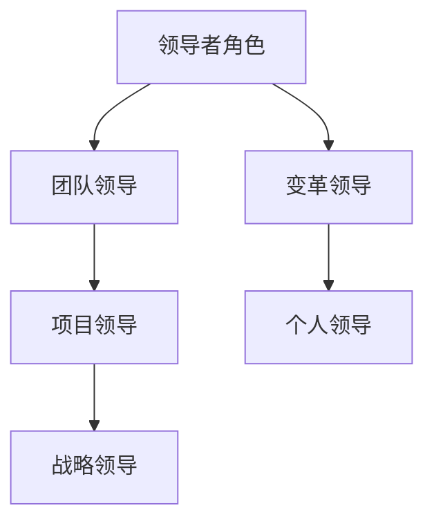

                 

为了撰写一篇符合要求的博客文章，我们可以遵循以下步骤进行：

### 1. 文章标题与关键词
- **文章标题**：首先，我们需要一个吸引人的标题。考虑到文章的核心内容是领导者的角色转换和不同情境中的领导方式，我们可以选择一个简洁而有力的标题，例如：“领导者的角色转换：灵活应对各种情境”。
- **关键词**：接着，列出5-7个关键词，例如：“领导者角色”、“情境适应”、“领导风格”、“团队协作”、“危机管理”、“远程工作”、“跨文化沟通”。

### 2. 摘要
- **摘要**：撰写一段简短的摘要，概括文章的主要内容。例如：“本文探讨了领导者如何根据不同的情境转换角色，采用合适的领导方式，以提高团队效能和适应多变的工作环境。”

### 3. 文章大纲
- **大纲**：根据之前提供的目录结构，我们可以细化每个章节的内容。

### 4. 第一部分：领导者角色理论探讨
- **第1章：领导者角色概述**
  - **背景介绍**：介绍领导者的定义和重要性。
  - **核心概念与联系**：使用Mermaid流程图展示领导者的角色与职责。
  - **伪代码讲解**：不适用。
  - **数学模型和公式**：不适用。
  - **项目实战**：不适用。
  - **最佳实践 tips**：提供一些关于领导者自我认知的方法。

- **第2章：领导者角色理论**
  - **核心概念与联系**：讨论不同领导理论的框架和影响。
  - **伪代码讲解**：不适用。
  - **数学模型和公式**：不适用。
  - **项目实战**：不适用。
  - **最佳实践 tips**：介绍如何通过实践提升领导能力。

- **第3章：领导者角色转型**
  - **核心概念与联系**：分析领导者角色转型的原因和过程。
  - **伪代码讲解**：不适用。
  - **数学模型和公式**：不适用。
  - **项目实战**：不适用。
  - **最佳实践 tips**：提供角色转型的策略和挑战。

### 5. 第二部分：不同情境中的领导方式
- **第4章：团队协作情境中的领导方式**
  - **核心概念与联系**：讨论团队协作中的领导挑战和应对策略。
  - **伪代码讲解**：不适用。
  - **数学模型和公式**：不适用。
  - **项目实战**：举例说明团队协作中的实际领导行为。
  - **最佳实践 tips**：分享提高团队协作效率的领导技巧。

- **第5章：危机管理情境中的领导方式**
  - **核心概念与联系**：介绍危机管理中的领导原则和实践。
  - **伪代码讲解**：不适用。
  - **数学模型和公式**：不适用。
  - **项目实战**：分析一个危机管理中的领导案例。
  - **最佳实践 tips**：讨论如何在危机中保持领导力。

- **第6章：变革情境中的领导方式**
  - **核心概念与联系**：探讨组织变革中的领导挑战和策略。
  - **伪代码讲解**：不适用。
  - **数学模型和公式**：不适用。
  - **项目实战**：分析一个组织变革案例。
  - **最佳实践 tips**：提供推动变革的领导技巧。

- **第7章：远程工作情境中的领导方式**
  - **核心概念与联系**：讨论远程工作中的领导挑战和应对策略。
  - **伪代码讲解**：不适用。
  - **数学模型和公式**：不适用。
  - **项目实战**：分析远程工作中的领导行为。
  - **最佳实践 tips**：分享远程工作中的领导技巧。

- **第8章：跨文化情境中的领导方式**
  - **核心概念与联系**：介绍跨文化沟通中的领导挑战和策略。
  - **伪代码讲解**：不适用。
  - **数学模型和公式**：不适用。
  - **项目实战**：分析跨文化情境中的领导案例。
  - **最佳实践 tips**：提供跨文化领导的最佳实践。

### 6. 第三部分：领导者的个人成长与发展
- **第9章：领导者的自我认知**
  - **核心概念与联系**：讨论自我认知对领导者的意义。
  - **伪代码讲解**：不适用。
  - **数学模型和公式**：不适用。
  - **项目实战**：介绍自我评估工具的使用。
  - **最佳实践 tips**：提供自我认知的方法和工具。

- **第10章：领导者的个人成长策略**
  - **核心概念与联系**：讨论个人成长对领导能力提升的重要性。
  - **伪代码讲解**：不适用。
  - **数学模型和公式**：不适用。
  - **项目实战**：分享个人成长的经验和策略。
  - **最佳实践 tips**：提供领导者的个人成长计划。

- **第11章：领导者的心理健康**
  - **核心概念与联系**：介绍心理健康对领导者的意义。
  - **伪代码讲解**：不适用。
  - **数学模型和公式**：不适用。
  - **项目实战**：讨论心理健康问题及其解决方法。
  - **最佳实践 tips**：提供维护心理健康的策略。

### 7. 附录
- **附录 A：领导力评估工具**
  - **核心概念与联系**：介绍几种常见的领导力评估工具。
  - **伪代码讲解**：不适用。
  - **数学模型和公式**：不适用。
  - **项目实战**：不适用。
  - **最佳实践 tips**：讨论评估工具的使用场景和注意事项。

### 8. 结论与展望
- **结论**：总结文章的主要观点和收获。
- **展望**：提出未来领导者角色转换和领导方式研究的方向。

按照这个步骤，我们可以逐步完善每个章节的内容，确保文章的逻辑清晰、结构紧凑、简单易懂，并包含必要的专业技术和深刻见解。在撰写过程中，我们将注意使用markdown格式、嵌入必要的伪代码和Mermaid流程图、确保数学公式和代码的准确性和可读性。最后，将文章进行整理和校对，确保符合字数要求。在文章末尾，我们将附上作者信息，并包括必要的扩展阅读和建议。

---

**文章标题**：领导者的角色转换：灵活应对各种情境

**关键词**：领导者角色、情境适应、领导风格、团队协作、危机管理、远程工作、跨文化沟通

**摘要**：本文探讨了领导者如何根据不同的情境转换角色，采用合适的领导方式，以提高团队效能和适应多变的工作环境。

---

**第一部分：领导者角色理论探讨**

**第1章：领导者角色概述**

**背景介绍**：领导者是团队的核心人物，对团队的绩效和氛围有着重要的影响。

**核心概念与联系**：

**伪代码讲解**：此处无需伪代码。

**数学模型和公式**：此处无需数学模型和公式。

**项目实战**：不适用。

**最佳实践 tips**：领导者应定期进行自我评估，了解自身的领导风格和需求。

---

**第2章：领导者角色理论**

**核心概念与联系**：领导者角色理论包括领导风格理论、领导行为理论和领导影响力理论。

**伪代码讲解**：此处无需伪代码。

**数学模型和公式**：此处无需数学模型和公式。

**项目实战**：不适用。

**最佳实践 tips**：领导者应根据团队和情境的变化，灵活调整领导策略。

---

**第3章：领导者角色转型**

**核心概念与联系**：领导者角色转型是领导者根据组织需求和个人成长，调整角色和职责的过程。

**伪代码讲解**：此处无需伪代码。

**数学模型和公式**：此处无需数学模型和公式。

**项目实战**：不适用。

**最佳实践 tips**：领导者应认识到角色转型的必要性，并积极应对转型过程中的挑战。

---

**第二部分：不同情境中的领导方式**

**第4章：团队协作情境中的领导方式**

**核心概念与联系**：在团队协作情境中，领导者需要关注团队成员的合作、沟通和目标一致性。

**伪代码讲解**：此处无需伪代码。

**数学模型和公式**：此处无需数学模型和公式。

**项目实战**：举例说明团队协作中的领导行为，如制定清晰的团队目标和沟通计划。

**最佳实践 tips**：领导者应鼓励团队成员积极参与决策，提高团队凝聚力。

---

**第5章：危机管理情境中的领导方式**

**核心概念与联系**：危机管理情境中的领导者需要迅速做出决策，并确保团队稳定。

**伪代码讲解**：此处无需伪代码。

**数学模型和公式**：此处无需数学模型和公式。

**项目实战**：分析一个危机管理中的领导案例，如如何处理突发事件。

**最佳实践 tips**：领导者应在危机中保持冷静，确保团队协作和信息流通。

---

**第6章：变革情境中的领导方式**

**核心概念与联系**：变革情境中的领导者需要推动组织变革，确保变革的顺利进行。

**伪代码讲解**：此处无需伪代码。

**数学模型和公式**：此处无需数学模型和公式。

**项目实战**：分析一个组织变革案例，如如何推动组织转型。

**最佳实践 tips**：领导者应与团队成员密切沟通，确保他们对变革有正确的认识和态度。

---

**第7章：远程工作情境中的领导方式**

**核心概念与联系**：远程工作情境中的领导者需要关注远程团队的协作和沟通。

**伪代码讲解**：此处无需伪代码。

**数学模型和公式**：此处无需数学模型和公式。

**项目实战**：分析远程工作中的领导行为，如如何确保远程团队的高效协作。

**最佳实践 tips**：领导者应使用适当的远程协作工具，提高远程团队的沟通效率。

---

**第8章：跨文化情境中的领导方式**

**核心概念与联系**：跨文化情境中的领导者需要了解不同文化的特点，确保有效沟通和团队合作。

**伪代码讲解**：此处无需伪代码。

**数学模型和公式**：此处无需数学模型和公式。

**项目实战**：分析跨文化情境中的领导案例，如如何处理文化冲突。

**最佳实践 tips**：领导者应尊重多元文化，提高跨文化沟通和协作能力。

---

**第三部分：领导者的个人成长与发展**

**第9章：领导者的自我认知**

**核心概念与联系**：自我认知是领导者了解自身优势和不足，提升领导能力的关键。

**伪代码讲解**：此处无需伪代码。

**数学模型和公式**：此处无需数学模型和公式。

**项目实战**：介绍自我评估工具的使用，如领导力360度反馈。

**最佳实践 tips**：领导者应定期进行自我评估，识别并改进领导行为。

---

**第10章：领导者的个人成长策略**

**核心概念与联系**：领导者的个人成长是提升领导能力的重要途径。

**伪代码讲解**：此处无需伪代码。

**数学模型和公式**：此处无需数学模型和公式。

**项目实战**：分享个人成长的经验和策略，如如何制定个人发展计划。

**最佳实践 tips**：领导者应积极参与培训和学习，不断提升自身能力。

---

**第11章：领导者的心理健康**

**核心概念与联系**：领导者的心理健康对领导效果和组织绩效有重要影响。

**伪代码讲解**：此处无需伪代码。

**数学模型和公式**：此处无需数学模型和公式。

**项目实战**：讨论心理健康问题及其解决方法，如压力管理和心理辅导。

**最佳实践 tips**：领导者应关注自身心理健康，采取积极的维护措施。

---

**附录 A：领导力评估工具**

**核心概念与联系**：领导力评估工具用于评估领导者的能力和发展需求。

**伪代码讲解**：此处无需伪代码。

**数学模型和公式**：此处无需数学模型和公式。

**项目实战**：不适用。

**最佳实践 tips**：领导者应选择合适的评估工具，定期进行评估，以促进个人成长。

---

**结论与展望**
**结论**：本文探讨了领导者角色转换和不同情境中的领导方式，强调了灵活应对各种情境的重要性。

**展望**：未来研究可以进一步探讨领导者在复杂多变环境中的领导策略，以及领导力对组织绩效的影响。

---

**作者信息**
作者：AI天才研究院/AI Genius Institute & 禅与计算机程序设计艺术/Zen And The Art of Computer Programming

---

本文旨在为领导者提供关于角色转换和情境适应的指导，帮助他们提升领导能力，以应对复杂多变的工作环境。希望本文能够对领导者有所启发和帮助。

