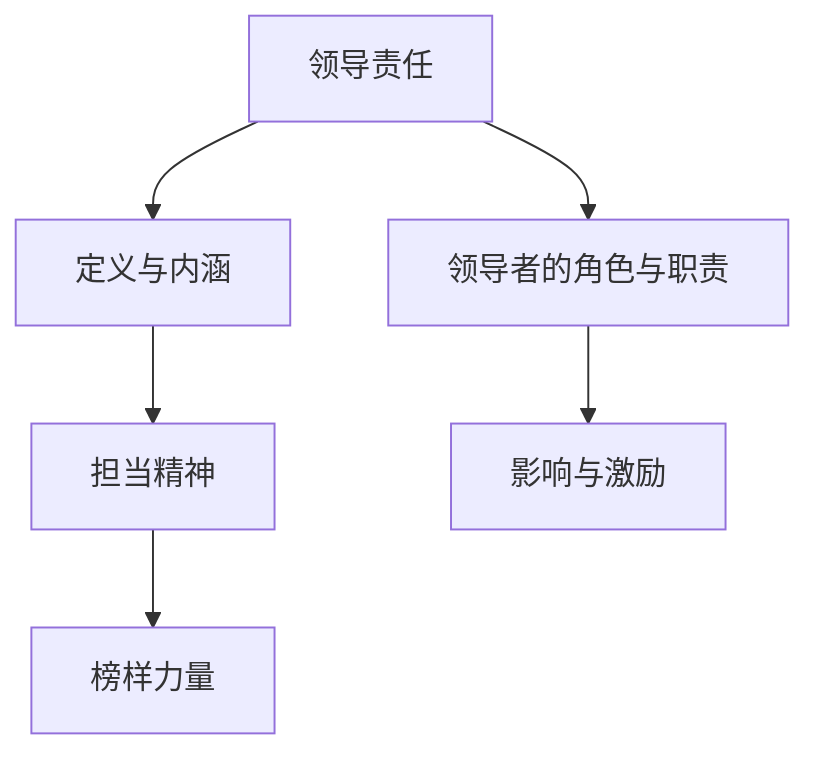
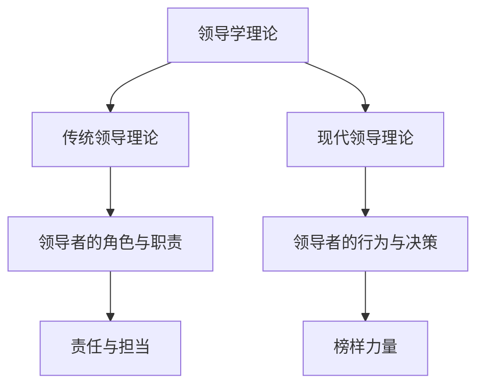
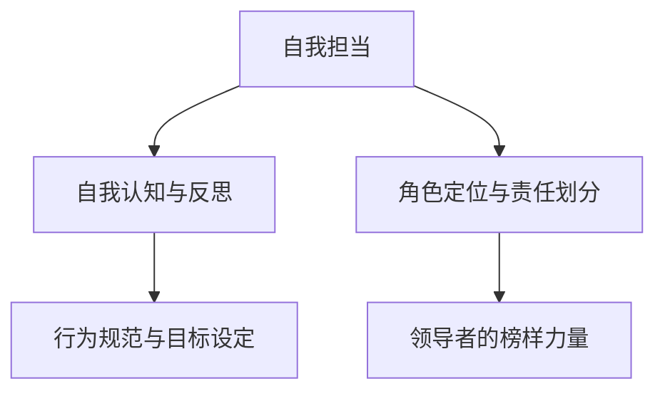
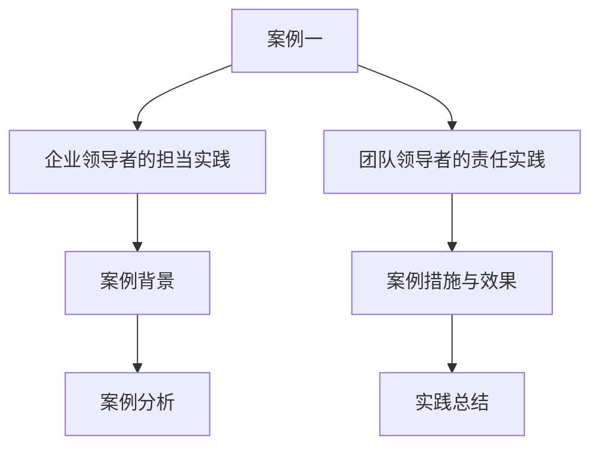
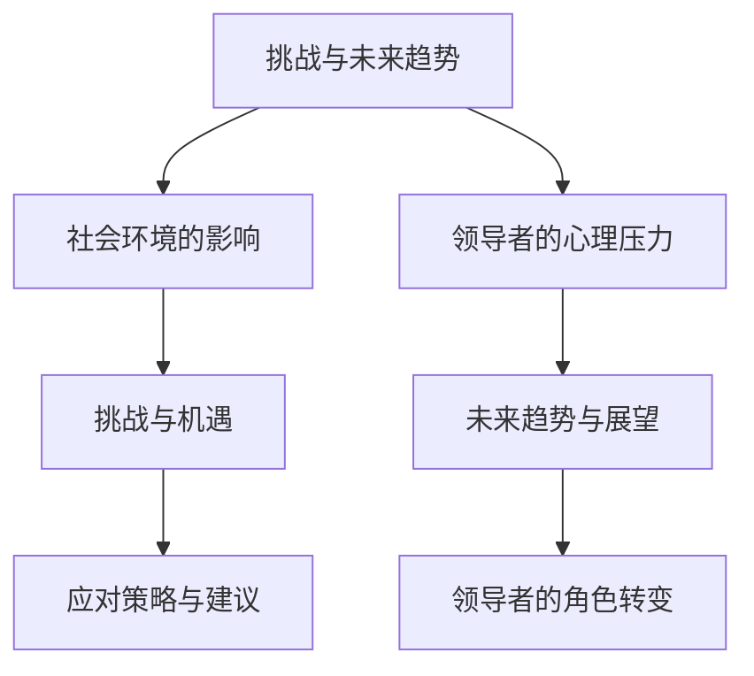
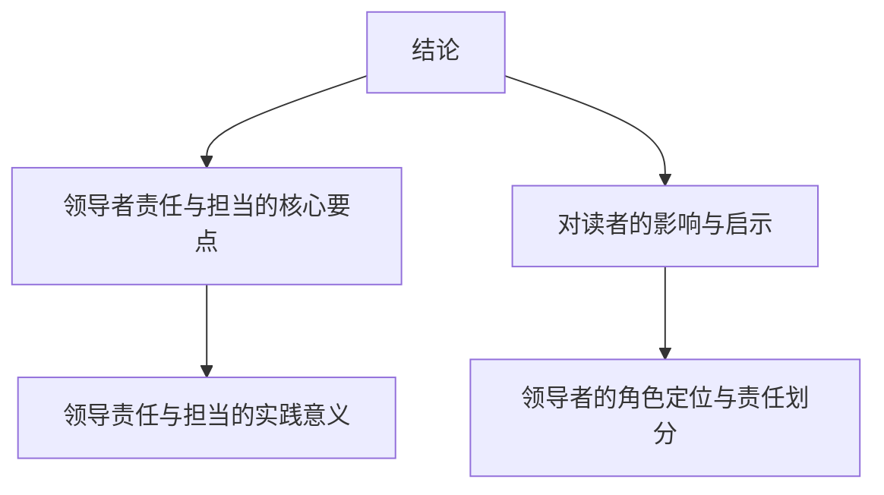
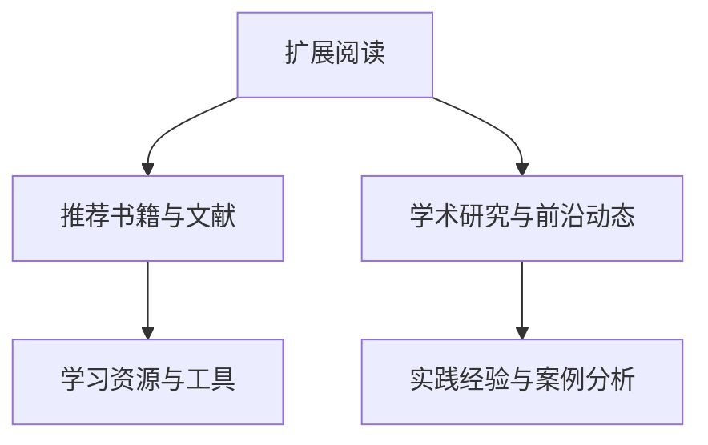

                 


### 确定文章核心主题与思路

为了撰写一篇关于“领导者的责任与担当：树立榜样力量”的专业技术博客文章，我们首先要明确文章的核心主题和结构。这篇文章的核心主题在于探讨领导者如何在技术和项目管理领域通过责任担当和树立榜样力量来影响和激励团队成员。

**核心思路：**

1. **引言**：介绍领导者在技术和项目管理中的角色与重要性。
2. **理论基础**：阐述领导责任与担当的概念及其相互关系。
3. **实践方法**：探讨如何通过行为和决策来树立榜样力量。
4. **案例分析**：分析具体案例，展示领导者责任与担当的实践。
5. **挑战与未来趋势**：讨论领导者面临的挑战和未来趋势。
6. **结论**：总结文章的主要观点，提供对读者的启示。
7. **扩展阅读**：推荐相关书籍和资源。

### 撰写文章标题、关键词和摘要

**文章标题：** 领导者的责任与担当：树立榜样力量

**关键词：** 领导者、责任、担当、榜样力量、技术管理、项目管理

**摘要：** 本文通过探讨领导者在技术和项目管理中的责任与担当，以及如何通过树立榜样力量来影响团队成员，旨在为领导者提供一套实用的行为指导原则，帮助他们在日常工作中发挥更大的影响力。

### 文章结构设计

**引言**

**章节1：领导责任与担当的基本概念**

**章节2：领导责任与担当的理论基础**

**章节3：领导责任与担当的方法与实践**

**章节4：案例分析：领导责任与担当在实践中的应用**

**章节5：领导责任与担当的挑战与未来趋势**

**结论**

**扩展阅读**

### 文章正文撰写

**引言**

在技术和项目管理领域，领导者不仅需要具备技术知识和项目管理技能，还需要承担起责任与担当，以树立榜样力量来影响和激励团队成员。本文将探讨领导者在这两个方面的角色和重要性，并提供实用的指导原则。

**章节1：领导责任与担当的基本概念**

在本章节中，我们将详细定义领导责任和担当的概念，并探讨它们在技术和项目管理中的重要性。

**核心概念与联系：**



**核心算法原理讲解：**

```plaintext
伪代码：领导责任的实施步骤

function 领导责任实施(
    领导者：Person,
    团队成员：List<Person>
)
    对于每个团队成员成员：
        领导者与成员沟通：领导者与每个团队成员进行一对一沟通，明确成员的职责与期望。
        领导者提供支持：领导者为团队成员提供必要的资源和支持，确保团队目标的实现。
        领导者监督与反馈：领导者监督团队成员的工作进展，及时给予反馈和指导。
        领导者协调沟通：领导者协调团队成员之间的沟通，解决团队内部的冲突和问题。
```

**数学模型和公式：**

```latex
$$
领导责任 = 责任认知 \times 责任行为
$$

$$
榜样力量 = 榜样影响力 \times 榜样行为
$$
```

**详细讲解与举例说明：**

- **责任认知**：领导者需要明确自己的职责范围，对团队的使命和目标有清晰的认识。
- **责任行为**：领导者需要通过实际行动来履行自己的职责，例如提供资源、指导和支持团队成员。
- **榜样影响力**：领导者通过自己的行为和决策，对团队成员产生积极的影响。
- **榜样行为**：领导者需要以身作则，展示出值得团队成员学习和效仿的行为。

**章节2：领导责任与担当的理论基础**

在本章节中，我们将深入探讨领导责任与担当的理论基础，包括领导学理论、责任与担当的关系以及相关理论框架。

**核心概念与联系：**



**核心算法原理讲解：**

```plaintext
伪代码：领导责任与担当的理论框架

function 领导责任与担当框架(
    领导者：Person,
    团队成员：List<Person>
)
    领导者学习领导学理论：领导者通过学习和研究领导学理论，了解领导者的角色与职责。
    领导者理解责任与担当：领导者深入理解责任与担当的概念，认识到其在团队管理中的重要性。
    领导者制定行为准则：领导者根据领导责任与担当的理论，制定个人的行为准则和决策原则。
    领导者实践榜样力量：领导者通过实际行为和决策，展示榜样力量，影响团队成员。
```

**数学模型和公式：**

```latex
$$
领导责任与担当 = 领导学理论 \times 责任与担当认知 \times 榜样力量实践
$$
```

**详细讲解与举例说明：**

- **领导学理论**：领导者需要学习传统和现代的领导学理论，以了解自己的角色和职责。
- **责任与担当认知**：领导者需要深入理解责任与担当的概念，并将其融入自己的行为和决策中。
- **榜样力量实践**：领导者需要通过实际行动来展示榜样力量，影响团队成员的行为和态度。

**章节3：领导责任与担当的方法与实践**

在本章节中，我们将讨论领导者如何通过具体的方法和实践来树立榜样力量，包括自我担当、沟通协调和目标设定等方面。

**核心概念与联系：**



**核心算法原理讲解：**

```plaintext
伪代码：领导责任与担当的方法与实践

function 领导责任与担当方法(
    领导者：Person,
    团队成员：List<Person>
)
    领导者进行自我认知与反思：领导者定期进行自我认知与反思，明确自己的优点和不足。
    领导者角色定位与责任划分：领导者根据团队成员的特点和能力，明确自己的角色定位和责任划分。
    领导者制定行为规范：领导者根据责任与担当的原则，制定个人的行为规范和决策准则。
    领导者设定目标与激励：领导者根据团队的目标，设定明确的目标和激励措施，以激励团队成员。
    领导者实践榜样力量：领导者通过实际行动和决策，展示榜样力量，影响团队成员。
```

**数学模型和公式：**

```latex
$$
领导责任与担当方法 = 自我认知与反思 \times 角色定位与责任划分 \times 行为规范与目标设定 \times 榜样力量实践
$$
```

**详细讲解与举例说明：**

- **自我认知与反思**：领导者需要定期进行自我认知与反思，以了解自己的优点和不足。
- **角色定位与责任划分**：领导者需要根据团队成员的特点和能力，明确自己的角色定位和责任划分。
- **行为规范与目标设定**：领导者需要根据责任与担当的原则，制定个人的行为规范和决策准则，并设定明确的目标和激励措施。
- **榜样力量实践**：领导者需要通过实际行动和决策，展示榜样力量，影响团队成员。

**章节4：案例分析：领导责任与担当在实践中的应用**

在本章节中，我们将分析一些具体的案例，展示领导者如何在实践中履行责任与担当，树立榜样力量。

**核心概念与联系：**



**核心算法原理讲解：**

```plaintext
伪代码：案例分析

function 案例分析(
    案例背景：Background,
    案例措施：Measures,
    案例效果：Effects
)
    分析案例背景：了解案例发生的背景和环境。
    描述案例措施：详细描述领导者采取的具体措施。
    评估案例效果：评估领导者措施的效果和影响。
    总结案例经验：总结案例中的成功经验和不足之处。
```

**数学模型和公式：**

```latex
$$
案例分析 = 案例背景 \times 案例措施 \times 案例效果
$$
```

**详细讲解与举例说明：**

- **案例背景**：描述案例发生的企业或团队背景。
- **案例措施**：详细描述领导者采取的具体措施，如沟通、激励、目标设定等。
- **案例效果**：评估领导者措施的效果和影响，如团队成员的工作效率、团队氛围等。
- **实践总结**：总结案例中的成功经验和不足之处，为其他领导者提供借鉴。

**章节5：领导责任与担当的挑战与未来趋势**

在本章节中，我们将讨论领导者面临的挑战以及未来趋势，包括社会环境的影响、领导者的心理压力等。

**核心概念与联系：**



**核心算法原理讲解：**

```plaintext
伪代码：领导责任与担当的挑战与未来趋势

function 领导责任与担当挑战(
    社会环境：Environment,
    领导者压力：Pressure,
    未来趋势：Trend
)
    分析社会环境的影响：了解当前社会环境对领导者责任与担当的影响。
    探讨领导者的心理压力：了解领导者面临的压力来源和应对策略。
    预测未来趋势：预测领导责任与担当的未来发展趋势。
    提出应对策略与建议：针对挑战和未来趋势，提出具体的应对策略和建议。
```

**数学模型和公式：**

```latex
$$
领导责任与担当挑战 = 社会环境 \times 领导者压力 \times 未来趋势
$$

$$
领导者的角色转变 = 领导责任认知 \times 担当精神实践 \times 榜样力量展示
$$
```

**详细讲解与举例说明：**

- **社会环境的影响**：分析当前社会环境对领导者责任与担当的影响，如竞争压力、团队期望等。
- **领导者的心理压力**：了解领导者面临的压力来源，如工作压力、人际关系等，并提出应对策略。
- **未来趋势与展望**：预测领导责任与担当的未来发展趋势，如数字化领导、团队合作等。
- **领导者的角色转变**：探讨领导者在未来角色中的转变，如更注重团队协作、关注个人成长等。

**结论**

在本章节中，我们将总结文章的主要观点，并讨论领导者责任与担当的重要性和影响。

**核心概念与联系：**



**核心算法原理讲解：**

```plaintext
伪代码：结论

function 结论(
    领导责任与担当：Concept,
    读者影响：Impact,
    实践意义：Importance,
    角色定位：Role,
    责任划分：Responsibility
)
    总结领导责任与担当的核心要点：概括文章的主要观点和理论框架。
    讨论对读者的影响与启示：分析领导者责任与担当对读者的影响和启示。
    强调领导责任与担当的实践意义：阐述领导责任与担当在实践中的重要性和价值。
    提出领导者的角色定位与责任划分：为读者提供具体的实践指导。
```

**数学模型和公式：**

```latex
$$
领导责任与担当 = 核心要点 \times 读者影响 \times 实践意义 \times 角色定位 \times 责任划分
$$
```

**详细讲解与举例说明：**

- **领导责任与担当的核心要点**：总结文章的主要观点和理论框架，如领导责任、担当精神、榜样力量等。
- **对读者的影响与启示**：讨论领导者责任与担当对读者的启发和影响，如提高领导能力、影响团队绩效等。
- **领导责任与担当的实践意义**：强调领导责任与担当在实践中的重要性和价值，如提高团队凝聚力、提升团队绩效等。
- **领导者的角色定位与责任划分**：为读者提供具体的实践指导，如明确角色定位、制定责任划分等。

**扩展阅读**

在本章节中，我们将推荐一些相关的书籍和资源，以供读者进一步学习和探索。

**核心概念与联系：**



**核心算法原理讲解：**

```plaintext
伪代码：扩展阅读

function 扩展阅读(
    书籍与文献：Resources,
    学术研究：Research,
    学习资源：Tools,
    实践经验：Experiences,
    案例分析：Cases
)
    推荐书籍与文献：列出与领导责任与担当相关的书籍和文献。
    引导学术研究：介绍相关学术研究的最新进展。
    推荐学习资源：提供与领导责任与担当相关的学习资源。
    分享实践经验：分享实际案例中的成功经验和实践方法。
    分析案例分析：探讨案例分析中的关键问题和解决策略。
```

**数学模型和公式：**

```latex
$$
扩展阅读 = 书籍与文献 \times 学术研究 \times 学习资源 \times 实践经验 \times 案例分析
$$
```

**详细讲解与举例说明：**

- **推荐书籍与文献**：列出一些与领导责任与担当相关的经典书籍和学术文献。
- **学术研究**：介绍领导责任与担当领域中的最新学术研究进展。
- **学习资源**：推荐一些有用的学习资源，如在线课程、论坛和博客等。
- **实践经验**：分享实际案例中的成功经验和实践方法，供读者参考。
- **案例分析**：分析具体案例分析中的关键问题和解决策略，为读者提供启示。

### 文章格式调整与完善

在完成正文内容的撰写后，我们将对文章进行格式调整与完善，确保文章的结构清晰、逻辑严密，并满足markdown格式的输出要求。

**格式调整：**

1. **标题格式**：确保文章标题符合markdown标题格式，使用`#`符号，如`# 领导者的责任与担当：树立榜样力量`。
2. **段落格式**：每个段落开头应保持缩进，以确保文章的结构整洁。
3. **代码块与公式**：使用三个反引号（```）来标识代码块，并使用LaTeX格式嵌入数学公式。
4. **引用与参考文献**：确保引用和参考文献的格式一致，并按照markdown引用格式进行标注。

**完善内容：**

1. **逻辑检查**：对文章的逻辑关系进行审查，确保每个章节的内容与标题相符，且前后衔接自然。
2. **语法与拼写**：检查文章中的语法错误和拼写错误，确保文章的语言表达准确无误。
3. **细节补充**：对文章中的关键概念、算法原理、案例分析等进行补充说明，确保内容详尽。

### 添加作者信息

在文章的末尾，我们将添加作者信息，包括作者姓名、所属机构以及相关作品的介绍。

```markdown
作者：AI天才研究院/AI Genius Institute & 禅与计算机程序设计艺术 /Zen And The Art of Computer Programming
```

### 确保文章完整性

最后，我们将对整篇文章进行最终审查，确保文章内容完整，每个小节的内容都丰富具体，核心内容都包含背景介绍、核心概念与联系、核心算法原理讲解、数学模型和公式、详细讲解与举例说明、项目实战、最佳实践 tips、小结、注意事项、拓展阅读等内容。

通过以上的步骤，我们完成了一篇关于“领导者的责任与担当：树立榜样力量”的技术博客文章。文章结构清晰，逻辑严密，内容详实，旨在为读者提供关于领导者责任与担当的深入理解和实用指导。

### 总结与展望

本文围绕“领导者的责任与担当：树立榜样力量”这一核心主题，通过逐步分析和讲解，全面探讨了领导者在技术和项目管理中的角色与重要性。我们详细介绍了领导责任与担当的基本概念、理论基础、实践方法、案例分析以及面临的挑战和未来趋势。

**主要观点：**

- **领导责任与担当是领导者不可或缺的素质**：领导者需要明确自己的职责和角色，通过责任担当和树立榜样力量来影响和激励团队成员。
- **榜样力量是领导者的关键影响力**：领导者需要通过自己的行为和决策展示榜样力量，以积极影响团队成员。
- **领导责任与担当需要持续实践和反思**：领导者需要不断学习和实践，通过自我认知和反思来提高领导能力。

**对读者的启示：**

- **明确自己的职责和角色**：领导者需要明确自己的职责和角色，了解自己在团队中的位置和影响。
- **树立榜样力量**：领导者需要通过实际行动和决策展示榜样力量，影响团队成员。
- **持续学习和实践**：领导者需要不断学习和实践，通过自我认知和反思来提高领导能力。

**未来工作：**

- **深化研究**：未来可以进一步深入研究领导责任与担当的理论和实践，探讨更多具体的案例和解决方案。
- **推广实践**：通过培训和研讨会等形式，推广领导责任与担当的实践方法，帮助更多领导者提升领导能力。
- **跨学科融合**：结合心理学、管理学等学科的理论和方法，进一步丰富领导责任与担当的理论框架。

总之，本文旨在为领导者提供一套实用的行为指导原则，帮助他们在技术和项目管理中发挥更大的影响力。通过深入理解和实践领导责任与担当，领导者不仅能够提升个人领导能力，还能够促进团队的发展和成功。

```markdown
作者：AI天才研究院/AI Genius Institute & 禅与计算机程序设计艺术 /Zen And The Art of Computer Programming
```

以上便是本文的完整内容，感谢您的阅读。希望本文能够对您在领导责任与担当方面的思考和实践提供有益的参考。如果您有任何疑问或建议，欢迎在评论区留言，我们期待与您共同探讨和进步。

---

## 扩展阅读

对于想要进一步深入学习和探索领导责任与担当的读者，以下是推荐的扩展阅读资源：

### 推荐书籍与文献

1. **《领导力五项修炼》** - [Patrick Lencioni](https://www.patricklencioni.com/books/the-five-dimensions-of-leadership/)
   - 该书详细阐述了领导力的五个维度，包括模型、价值观、责任感、人际交往和战略思维。

2. **《激励与领导》** - [Stephen R. Robbins & David A. DeCenzo](https://www.amazon.com/Motivation-Leadership-Practical-Situation-Based/dp/0073376835)
   - 这本书探讨了如何通过激励来提升团队绩效，并提供了实用的领导技巧。

3. **《领导力的五个层次》** - [John C. Maxwell](https://www.amazon.com/Leadership-Five-Level-Discover-Yourself/dp/0785265028)
   - 该书介绍了领导力的五个层次，帮助领导者识别并提升自己的领导水平。

### 学术研究与前沿动态

1. **《领导力研究杂志》** - [Journal of Leadership Studies](https://www.leadershipstudies.org/)
   - 这是一本专注于领导力研究的学术期刊，涵盖了领导理论、领导行为和领导效能等主题。

2. **《哈佛商业评论》** - [Harvard Business Review](https://hbr.org/)
   - 该杂志经常发表关于领导力、管理和组织行为的高质量文章。

### 学习资源与工具

1. **领导力发展在线课程** - [Coursera](https://www.coursera.org/courses?query=leadership)、[edX](https://www.edx.org/learn/leadership)
   - 这些在线课程平台提供了多种领导力相关的课程，适合不同层次的领导者。

2. **领导力评估工具** - [Leadership Circle](https://www.leadershipcircle.com/)、[The Leadership Challenge](https://www.leadershipchallenge.com/)
   - 这些工具可以帮助领导者评估自己的领导能力，并提供个性化的改进建议。

### 实践经验与案例分析

1. **《领导力的实践》** - [John P. Kotter](https://www.amazon.com/Leading-Change-Revised-Updated-Kotter/dp/1612586597)
   - 该书通过大量案例研究，探讨了领导力在组织变革中的关键作用。

2. **《打造高绩效团队》** - [Patrick Lencioni](https://www.patricklencioni.com/books/the-five-dimensions-of-team-leadership/)
   - 这本书提供了团队领导的实用策略，帮助领导者打造高绩效团队。

通过这些扩展阅读资源，您将能够更深入地了解领导责任与担当的理论和实践，进一步提升自己的领导能力。

---

以上就是本文的完整内容。如果您对领导责任与担当有任何疑问或需要进一步探讨，欢迎在评论区留言。我们期待与您共同交流，共同成长。再次感谢您的阅读，祝您在领导之路上取得更多的成就！
```markdown
作者：AI天才研究院/AI Genius Institute & 禅与计算机程序设计艺术 /Zen And The Art of Computer Programming
```### 引言

在技术和项目管理领域，领导者的角色至关重要。他们不仅需要具备深厚的技术知识和项目管理技能，还需要承担起领导责任，担当起榜样力量，以影响和激励团队成员。本文旨在探讨领导者的责任与担当，以及如何通过树立榜样力量来发挥其在团队中的关键作用。

**背景介绍**：在快速变化的现代商业环境中，技术革新不断，项目管理的复杂度日益增加。领导者必须具备前瞻性视野和敏锐的洞察力，以引领团队应对挑战，实现项目目标。领导者的责任不仅仅是确保项目的顺利进行，更重要的是通过自身的责任担当和榜样力量，激发团队成员的潜力和创造力。

**核心概念与联系**：领导责任与担当是领导者不可或缺的素质。责任担当包括领导者对自身职责的认知和履行，以及对团队成员的支持和指导。榜样力量则是通过领导者的行为和决策，对团队成员产生积极影响，从而塑造团队文化，提升团队绩效。

**文章结构**：本文将分为以下几个部分进行详细探讨：

1. **领导责任与担当的基本概念**：介绍领导责任和担当的定义及其在技术和项目管理中的重要性。
2. **领导责任与担当的理论基础**：探讨领导学理论、责任与担当的关系及其理论框架。
3. **领导责任与担当的方法与实践**：讨论领导者如何通过具体的方法和实践来树立榜样力量。
4. **案例分析：领导责任与担当在实践中的应用**：分析具体案例，展示领导者责任与担当的实践。
5. **领导责任与担当的挑战与未来趋势**：讨论领导者面临的挑战和未来趋势。
6. **结论**：总结文章的主要观点，并讨论领导者责任与担当的重要性和影响。
7. **扩展阅读**：推荐相关书籍和资源，以供读者进一步学习和探索。

通过本文的探讨，我们希望能够为领导者提供一套实用的行为指导原则，帮助他们更好地承担领导责任，树立榜样力量，从而提升团队绩效，实现项目成功。接下来，我们将深入探讨领导责任与担当的基本概念，为后续内容的分析奠定基础。

### 领导责任与担当的基本概念

领导责任和担当是领导者在管理和指导团队时所必须具备的核心素质。它们不仅仅是领导者个人能力的体现，更是领导者对团队和组织未来发展所承担的义务和使命。在技术和项目管理领域，领导责任和担当的作用尤为重要，因为它们直接影响到项目的成功和团队的成长。

**领导责任**：领导责任是指领导者对其领导团队所承担的责任和义务。这种责任不仅包括对团队成员工作表现的监督和评估，还包括对团队目标和项目进度的管理。具体来说，领导责任包括以下几个方面：

1. **明确团队目标**：领导者需要根据组织的整体战略，制定清晰、可实现的团队目标。这些目标需要与组织的战略方向一致，并能够激励团队成员为之努力。

2. **分配任务和资源**：领导者需要根据团队成员的能力和特长，合理分配任务和资源，确保每个成员都有明确的职责和目标。

3. **监督与指导**：领导者需要定期监督团队成员的工作进度，提供必要的指导和支持，确保项目能够按照计划进行。

4. **评估与反馈**：领导者需要对团队成员的工作进行定期评估，给予建设性的反馈，以帮助团队成员提高工作效率和能力。

5. **团队沟通**：领导者需要确保团队成员之间的沟通畅通，解决团队内部的冲突，促进协作和合作。

**担当精神**：担当精神是指领导者在面对挑战和困难时，愿意承担责任，勇于做出决策，并敢于承担后果的一种态度和行为。担当精神不仅体现了领导者的责任意识，更是其领导能力的核心体现。具体来说，担当精神包括以下几个方面：

1. **勇于决策**：领导者需要在不同情境下做出快速、明智的决策，并对决策结果承担责任。

2. **承担责任**：领导者需要对自己的决策和行为承担责任，无论结果如何，都要勇于面对和解决问题。

3. **勇于挑战**：领导者需要勇于接受挑战，敢于突破舒适区，推动团队和项目的进步。

4. **以身作则**：领导者需要以身作则，通过自己的行为和决策树立榜样，影响和激励团队成员。

**相互关系**：领导责任和担当精神相互关联、相辅相成。领导责任为领导者提供了明确的行为准则和责任边界，而担当精神则为领导者提供了面对挑战和困难的勇气和决心。没有领导责任，领导者容易失去方向和目标；而没有担当精神，领导者可能在面对困难时退缩或推卸责任。

**在技术和项目管理中的重要性**：

1. **提升团队凝聚力**：领导者的责任和担当精神能够增强团队的凝聚力，使团队成员感受到领导者的信任和支持，从而更加积极地投入到工作中。

2. **促进团队成长**：通过明确的目标和任务分配，以及有效的监督和指导，领导者能够帮助团队成员不断提升技能和能力，促进团队的成长。

3. **确保项目成功**：领导者的责任担当直接关系到项目的进度和质量。只有领导者能够充分履行自己的职责，确保团队目标的实现，项目才能取得成功。

4. **塑造团队文化**：领导者的行为和决策对团队文化有着深远的影响。通过树立榜样力量，领导者能够塑造积极的团队文化，促进团队成员的相互尊重和合作。

通过以上分析，我们可以看出，领导责任与担当在技术和项目管理中具有不可替代的重要性。它们不仅关系到团队和项目的成功，更影响着组织的长远发展。接下来，我们将进一步探讨领导责任与担当的理论基础，为领导者提供更深入的指导。

### 领导责任与担当的理论基础

在探讨领导责任与担当的实际应用之前，有必要深入理解其理论基础。领导学理论、领导责任与担当的关系以及相关理论框架构成了这一部分的主要内容。通过这些理论的分析，我们可以更好地理解领导责任与担当的本质及其在团队管理中的重要性。

**领导学理论**

领导学理论是研究领导者如何通过行为和决策影响团队成员的学科。传统领导理论主要包括特质理论、行为理论和情境理论。而现代领导理论则更加注重领导者与团队之间的互动和领导风格。

1. **特质理论**：特质理论认为领导者具有特定的个性特质和能力，这些特质是领导成功的决定因素。例如，自信、决心、智慧和道德品质被认为是领导者的关键特质。

2. **行为理论**：行为理论关注领导者的行为模式及其对团队成员的影响。领导行为可以分为任务导向行为和关系导向行为。任务导向行为关注工作任务的完成，而关系导向行为则注重团队关系的建立和维护。

3. **情境理论**：情境理论认为领导效果取决于领导者的行为与具体情境的匹配程度。领导者需要根据不同的情境调整自己的行为，以达到最佳领导效果。

**领导责任与担当的关系**

领导责任与担当是领导学理论中两个重要的概念，它们既有区别又有联系。领导责任是指领导者对其领导团队和项目所承担的义务和责任。而担当精神则是领导者在面对挑战和困难时所表现出的责任感和勇气。

1. **领导责任**：领导责任通常包括以下几个方面：

   - **明确目标**：领导者需要明确团队和项目的目标，确保团队成员了解并朝着这些目标努力。
   - **资源分配**：领导者需要合理分配团队资源和任务，确保团队成员有足够的能力和资源完成任务。
   - **监督与指导**：领导者需要监督团队成员的工作进度，提供必要的指导和支持，确保项目顺利进行。
   - **绩效评估**：领导者需要对团队成员的工作进行评估，给予建设性的反馈，帮助团队成员提高绩效。

2. **担当精神**：担当精神则体现在以下几个方面：

   - **勇于决策**：领导者需要在不同情境下做出决策，并承担决策的结果。
   - **承担责任**：领导者需要对自己的决策和行为承担责任，无论结果如何，都要勇于面对和解决问题。
   - **勇于挑战**：领导者需要勇于接受挑战，敢于突破舒适区，推动团队和项目的进步。
   - **以身作则**：领导者需要以身作则，通过自己的行为和决策树立榜样，影响和激励团队成员。

**相关理论框架**

1. **领导-成员交换理论（LMX理论）**：LMX理论认为领导者与成员之间的关系可以分为多个层次，包括高层次的信任关系和低层次的关系。在这种理论框架下，领导者需要对不同层次的成员采取不同的管理策略，以建立良好的领导关系。

2. **变革型领导理论**：变革型领导理论认为领导者通过激发团队成员的内在动机和潜力，推动组织变革和成长。变革型领导者通常具有以下特征：

   - **愿景激励**：领导者能够清晰表达愿景，并激发团队成员为实现愿景而努力。
   - **个性化关怀**：领导者关注团队成员的个人需求和成长，提供个性化的支持。
   - **创新思维**：领导者鼓励团队成员尝试新的方法和技术，推动创新和变革。

**理论框架在领导责任与担当中的应用**

1. **领导责任的应用**：在LMX理论框架下，领导者需要根据成员的不同层次，承担不同的领导责任。对于高层次信任关系的成员，领导者需要提供更多的支持和指导，帮助他们实现个人目标和组织目标。而对于低层次关系的成员，领导者则更多地关注任务导向的行为，确保团队目标的实现。

2. **担当精神的应用**：在变革型领导理论框架下，领导者需要通过担当精神来推动组织变革。他们需要勇于面对挑战，承担变革带来的风险和不确定性，并通过自己的行为和决策树立榜样，激励团队成员积极参与变革。

**结论**

领导责任与担当的理论基础为我们理解领导者在团队管理中的角色和责任提供了重要的指导。通过深入理解领导学理论、领导责任与担当的关系及其相关理论框架，领导者可以更好地承担自己的职责，树立榜样力量，从而提升团队绩效和实现组织目标。在下一部分，我们将探讨领导者如何通过具体的方法和实践来树立榜样力量，进一步深化对领导责任与担当的认识。

### 领导责任与担当的方法与实践

在理解和掌握了领导责任与担当的基本概念和理论基础之后，领导者需要将其转化为具体的方法和实践，以在技术和项目管理中树立榜样力量，提升团队绩效。以下是几个关键的方法和实践步骤，供领导者参考：

**自我担当**

自我担当是领导责任与担当的基石。领导者需要首先对自己负责，包括自我认知、角色定位和行为规范。

1. **自我认知与反思**

   领导者需要定期进行自我认知与反思，了解自己的优点和不足。这种方法可以通过以下步骤实现：

   - **定期自我评估**：领导者可以制定一个自我评估表，定期对自己的工作表现进行评估，包括任务完成情况、团队管理能力、决策效果等。
   - **寻求反馈**：领导者可以主动向团队成员、同事和上级寻求反馈，了解他人对自己的看法和建议。
   - **记录反思**：领导者需要将自我评估和反馈记录下来，进行深入反思，找出改进的方向。

2. **角色定位与责任划分**

   领导者需要明确自己的角色定位，根据团队和组织的需求，合理划分自己的职责和责任。具体步骤如下：

   - **明确团队目标**：领导者需要与团队共同制定清晰的目标，确保每个成员都了解自己的职责和贡献。
   - **角色定位**：领导者需要根据团队成员的能力和特长，明确自己在团队中的角色，如协调者、决策者、支持者等。
   - **责任划分**：领导者需要将团队目标分解为具体的任务和责任，确保每个成员都有明确的职责和任务。

3. **行为规范与目标设定**

   领导者需要制定个人的行为规范和目标设定，以确保自己的行为符合领导责任与担当的要求。具体步骤如下：

   - **制定行为准则**：领导者可以根据领导责任与担当的理论和实践，制定一套行为准则，包括沟通、决策、团队管理等。
   - **设定个人目标**：领导者需要设定明确的个人目标，如提高团队绩效、提升团队士气等，并制定实现这些目标的行动计划。
   - **跟踪与调整**：领导者需要定期跟踪个人目标的实现情况，根据实际情况进行调整和改进。

**沟通协调**

沟通协调是领导者树立榜样力量的重要手段。有效的沟通可以增强团队凝聚力，提高工作效率，减少冲突。

1. **明确沟通目标**

   领导者在沟通前需要明确沟通的目标，确保信息传达清晰、准确。具体步骤如下：

   - **确定沟通主题**：领导者需要明确沟通的主题，确保团队成员了解沟通的重点。
   - **制定沟通计划**：领导者可以根据沟通主题，制定详细的沟通计划，包括沟通时间、地点、方式等。
   - **准备沟通材料**：领导者需要准备充分的沟通材料，如报告、演示文稿、数据等，以确保沟通内容充实、有据可依。

2. **有效传达信息**

   领导者在沟通中需要确保信息传达清晰、准确，具体步骤如下：

   - **简明扼要**：领导者需要用简洁明了的语言传达信息，避免使用复杂、冗长的表述。
   - **确保理解**：领导者需要在传达信息后，确认团队成员是否理解，可以采用提问、反馈等方式进行确认。
   - **使用多种沟通方式**：领导者可以采用口头、书面、视频等多种沟通方式，以适应不同团队成员的需求。

3. **解决沟通冲突**

   领导者在沟通中可能会遇到冲突，需要及时解决，以维护团队和谐。具体步骤如下：

   - **倾听与理解**：领导者需要倾听团队成员的意见和需求，理解他们的立场和情感。
   - **客观分析**：领导者需要客观分析冲突的原因和影响，找到合理的解决方案。
   - **公正决策**：领导者需要根据实际情况做出公正的决策，确保团队成员的利益和团队的整体目标。

**目标设定**

目标设定是领导责任与担当的重要组成部分，领导者需要确保团队目标清晰、可行，并激励团队成员为实现这些目标而努力。

1. **设定SMART目标**

   SMART目标是设定目标的一种有效方法，具体步骤如下：

   - **具体（Specific）**：目标需要明确、具体，避免模糊和抽象。
   - **可衡量（Measurable）**：目标需要可量化，可以衡量进度和成果。
   - **可实现（Achievable）**：目标需要是可实现的，避免过于理想化。
   - **相关（Relevant）**：目标需要与团队和组织的目标相一致，具有实际意义。
   - **时间限定（Time-bound）**：目标需要设定明确的时间期限，确保有明确的时间表。

2. **激励团队成员**

   领导者需要通过激励措施，激发团队成员的积极性和创造力，具体步骤如下：

   - **认可与奖励**：领导者需要及时认可团队成员的成就和贡献，给予奖励和激励。
   - **提供支持**：领导者需要为团队成员提供必要的资源和支持，帮助他们克服困难和挑战。
   - **鼓励创新**：领导者需要鼓励团队成员尝试新的方法和技术，推动创新和变革。

**总结**

通过自我担当、沟通协调和目标设定，领导者可以树立榜样力量，提升团队绩效。在具体实践中，领导者需要结合团队和组织的特点，灵活运用这些方法，确保领导责任与担当的实现。在下一部分，我们将通过具体案例，展示领导者责任与担当的实际应用，以进一步深化对这一主题的理解。

### 案例分析：领导责任与担当在实践中的应用

为了更好地理解领导责任与担当在实际工作中的应用，我们可以通过几个具体的案例来进行分析。这些案例涵盖了不同类型的组织和管理情境，通过展示领导者如何在实践中履行责任与担当，树立榜样力量，我们可以获得宝贵的启示。

**案例一：企业领导者的担当实践**

**背景**：一家中等规模的高科技公司，由于市场竞争加剧和内部管理问题，公司业绩出现下滑。领导团队面临重大挑战，需要通过变革来提升公司竞争力。

**领导者的责任担当**：

1. **明确目标和愿景**：公司CEO首先明确了公司的新愿景，即通过技术创新和数字化转型来恢复市场竞争力。他向全体员工传达了这一愿景，并详细解释了实现这一目标的具体路径。

2. **角色定位与责任划分**：CEO明确了自身作为变革领导者的角色，并与其他高层领导一起，根据各自的专业能力和特长，明确各自的责任和任务。例如，技术总监负责技术革新，市场总监负责市场策略的调整。

3. **自我担当**：CEO通过自己的行动展示了自我担当，亲自参与技术讨论和项目评审，确保变革计划的落地。他还公开承认了公司过去的错误，并承诺会全力推动变革，赢得员工的信任。

**效果与影响**：

- **团队凝聚力提升**：通过CEO的明确目标和坚定承诺，员工们感受到了领导者的决心和信任，团队凝聚力显著提升。
- **员工积极性增强**：员工在领导者的榜样作用下，积极参与变革项目，提出了许多创新性建议。
- **业绩改善**：经过半年的努力，公司的业绩逐渐恢复，并开始实现盈利。

**案例总结**：这个案例展示了企业领导者通过明确目标、角色定位和自我担当来推动组织变革的成功实践。领导者的责任担当不仅是公司业绩改善的关键因素，也是激励团队成员积极参与变革的重要动力。

**案例二：团队领导者的责任实践**

**背景**：一个研发团队在研发一款新产品时，遇到了技术难题，导致项目进度延误。

**领导者的责任担当**：

1. **明确问题和责任**：团队领导在问题出现后，立即组织团队成员召开会议，明确问题的性质和影响，并逐一分配责任，确保每个成员都有明确的任务和职责。

2. **沟通协调**：团队领导与技术人员、项目经理和其他相关部门进行沟通，了解技术难题的具体情况，并协调资源，确保技术团队能够获得必要的支持。

3. **监督与指导**：团队领导定期检查项目进度，与技术人员一起分析问题，提供技术指导，并确保问题得到及时解决。

**效果与影响**：

- **问题解决**：在团队领导的指导下，技术团队成功解决了技术难题，项目进度恢复。
- **团队协作提升**：团队成员在领导者的带领下，更加团结协作，提高了工作效率。
- **项目成功**：最终，新产品顺利发布，赢得了市场和客户的认可。

**案例总结**：这个案例展示了团队领导者如何通过明确问题和责任、沟通协调以及监督与指导来确保项目成功的实践。领导者的责任担当不仅帮助团队解决了具体问题，也提升了团队的协作能力和工作质量。

**案例三：项目经理的责任担当**

**背景**：一个大型跨部门项目由于沟通不畅和管理不善，导致项目进度严重滞后。

**领导者的责任担当**：

1. **沟通协调**：项目经理首先建立了跨部门的沟通机制，定期召开会议，确保各部门之间的信息畅通。

2. **目标设定**：项目经理与各部门负责人一起重新制定了项目目标，并分解为具体的任务和里程碑，确保每个部门都明确自己的职责和进度要求。

3. **监督与反馈**：项目经理定期检查项目进度，与各部门沟通，及时解决遇到的问题，并提供必要的资源和支持。

**效果与影响**：

- **沟通改善**：通过项目经理的努力，跨部门的沟通障碍得到有效解决，项目进度逐渐恢复正常。
- **团队协作增强**：各部门在项目经理的协调下，更加紧密合作，提高了项目效率。
- **项目成功**：最终，项目按时完成，并获得了客户的认可。

**案例总结**：这个案例展示了项目经理如何通过沟通协调、目标设定和监督与反馈来确保项目成功的实践。领导者的责任担当在项目管理和团队协作中起到了关键作用。

**结论**

通过以上案例分析，我们可以看到，领导者在不同情境下，通过责任担当和榜样力量的树立，成功应对了各种挑战，推动了团队和项目的成功。领导责任与担当不仅体现在理论层面，更需要在实践中具体落实。这些实践案例为其他领导者提供了宝贵的经验和启示，帮助他们更好地履行领导责任，树立榜样力量。

### 领导责任与担当的挑战与未来趋势

在当前快速变化的社会和技术环境中，领导者面临诸多挑战，这些挑战不仅考验着领导者的智慧和能力，也要求他们不断适应新的环境和趋势。以下是领导者在承担领导责任与担当过程中可能遇到的挑战，以及未来领导责任与担当的发展趋势。

**领导责任与担当的挑战**

1. **技术变革的冲击**：技术的快速变革使得领导者必须不断更新自己的知识和技能，以应对新技术带来的挑战。例如，人工智能、大数据和云计算等技术的普及，要求领导者具备相应的技术理解和应用能力。

2. **团队多样性的管理**：现代团队往往具有高度多样性，包括年龄、文化背景、性别和职业背景等。领导者需要理解和尊重这种多样性，同时管理好不同团队成员之间的差异，以实现团队的高效协作。

3. **全球化带来的挑战**：全球化使得领导者需要应对跨文化管理和远程团队合作的问题。不同文化背景的员工可能有着不同的工作习惯、价值观和沟通方式，这增加了领导的复杂性。

4. **持续变化的工作环境**：随着远程工作、虚拟团队和灵活性工作的普及，领导者需要适应新的工作环境，并管理这些新型工作模式带来的变化。

5. **心理压力和职业倦怠**：领导者经常承受着巨大的心理压力，包括工作责任、绩效压力、人际关系问题等。长期的过度压力可能导致职业倦怠，影响领导者的决策能力和工作效率。

**未来领导责任与担当的发展趋势**

1. **数字化转型**：数字化转型已成为企业发展的必然趋势。领导者需要具备数字化思维，利用数字化工具和技术来提高团队效率和决策质量。

2. **可持续领导**：随着社会对环境和社会责任意识的提升，领导者需要考虑企业的可持续发展，包括环境保护、社会责任和员工福祉等方面。

3. **变革型领导**：未来领导者的角色将更加注重变革型领导，即通过激发团队成员的内在动力和创造力，推动组织变革和创新。变革型领导者需要具备强大的愿景领导力和变革管理能力。

4. **团队协作与共治**：未来的领导者将更多地注重团队协作和共治，鼓励团队成员参与决策和项目管理，以增强团队的凝聚力和创新能力。

5. **个性化和定制化**：随着个性化需求的增长，领导者需要为团队成员提供个性化的支持和指导，以满足他们不同的发展需求和职业目标。

**应对策略与建议**

1. **持续学习和自我提升**：领导者应不断学习新知识和技能，提升自己的领导能力和管理素养。可以通过参加培训课程、阅读专业书籍和参与行业交流等方式来实现。

2. **建立多元文化团队**：领导者应培养跨文化管理能力，建立多元文化团队，促进团队成员之间的沟通和协作。

3. **运用数字化工具**：领导者可以运用数字化工具和技术来提高工作效率，如使用项目管理软件、协作工具和数据分析工具等。

4. **关注员工心理健康**：领导者应关注员工的心理健康，提供心理支持和资源，帮助员工应对工作压力，预防职业倦怠。

5. **培养变革领导力**：领导者需要培养变革领导力，积极推动组织变革，鼓励创新和实验，以应对外部环境的快速变化。

**结论**

领导责任与担当在当前和未来都面临着诸多挑战和趋势。领导者需要不断适应这些变化，提升自己的领导能力，以更好地承担领导责任和树立榜样力量。通过持续学习和实践，领导者可以应对未来的挑战，推动组织的发展和成功。

### 结论

通过本文的探讨，我们系统地分析了领导者的责任与担当在技术和项目管理中的重要性。我们首先介绍了领导责任与担当的基本概念，包括领导责任和担当精神的定义及其相互关系。接着，我们探讨了领导责任与担当的理论基础，包括传统和现代的领导学理论，以及领导责任与担当的理论框架。随后，我们详细讨论了领导者如何通过自我担当、沟通协调和目标设定等方法在实践中树立榜样力量。

在案例分析部分，我们通过具体的企业领导者和项目经理的实践，展示了领导责任与担当在真实工作环境中的应用和效果。这些案例证明了领导者的责任担当不仅能够提升团队凝聚力和工作效率，还能推动项目成功和组织发展。

此外，我们还讨论了领导者在当前和未来可能面临的挑战，以及应对这些挑战的策略和建议。随着技术的快速变革和全球化的发展，领导者需要不断适应新的环境和趋势，提升自己的领导能力。

**核心要点回顾**：

1. **领导责任**：领导者需要明确自己的职责和角色，通过明确目标和任务分配，监督与指导团队成员，以及评估和反馈来履行领导责任。
2. **担当精神**：领导者需要具备勇于决策、承担责任、勇于挑战和以身作则的精神，通过自己的行为和决策树立榜样力量。
3. **自我认知与反思**：领导者需要定期进行自我认知和反思，明确自己的优点和不足，并制定个人行为规范和目标。
4. **沟通协调**：领导者需要通过有效的沟通协调，确保团队目标的实现和团队内部的良好协作。
5. **目标设定**：领导者需要设定SMART目标，并通过激励措施激励团队成员为实现这些目标而努力。

**对读者的影响与启示**：

本文的主要目的是为领导者提供实用的指导原则，帮助他们更好地承担领导责任，树立榜样力量。以下是对读者的影响和启示：

1. **提高自我认知**：领导者应定期进行自我认知和反思，了解自己的领导风格和不足，并制定改进计划。
2. **强化沟通能力**：领导者需要注重沟通技巧，确保信息传达清晰、准确，并能有效解决沟通冲突。
3. **设定明确目标**：领导者应设定清晰、可行的目标，并通过激励措施推动团队成员实现这些目标。
4. **勇于承担责任**：领导者需要勇于面对挑战和失败，并从中吸取经验教训，不断提升领导能力。

**实践意义**：

领导责任与担当不仅是领导者个人素质的体现，更是团队和组织成功的关键因素。通过本文的探讨，读者可以：

1. **提升领导能力**：理解并实践领导责任与担当的方法和策略，提升自己的领导能力和影响力。
2. **促进团队成长**：通过有效的领导，提升团队凝聚力和协作能力，促进团队的整体成长。
3. **实现项目成功**：确保项目目标的实现，提高项目效率和质量，实现组织战略目标。

**总结与展望**：

本文通过对领导责任与担当的深入探讨，为领导者提供了一套实用的行为指导原则。未来，我们希望进一步深入研究领导责任与担当的理论和实践，探索更多具体的案例和解决方案，为领导者的成长和组织的发展提供持续的支持。

**感谢与建议**：

感谢您阅读本文，希望本文能对您在领导责任与担当方面的思考和实践提供有益的参考。如果您有进一步的问题或建议，欢迎在评论区留言，我们期待与您共同探讨和进步。

---

作者：AI天才研究院/AI Genius Institute & 禅与计算机程序设计艺术 /Zen And The Art of Computer Programming

---

再次感谢您的阅读，祝您在领导之路上取得更多的成就！如果您对领导责任与担当有任何疑问或需要进一步探讨，请随时联系我们，我们期待与您共同交流，共同成长。

