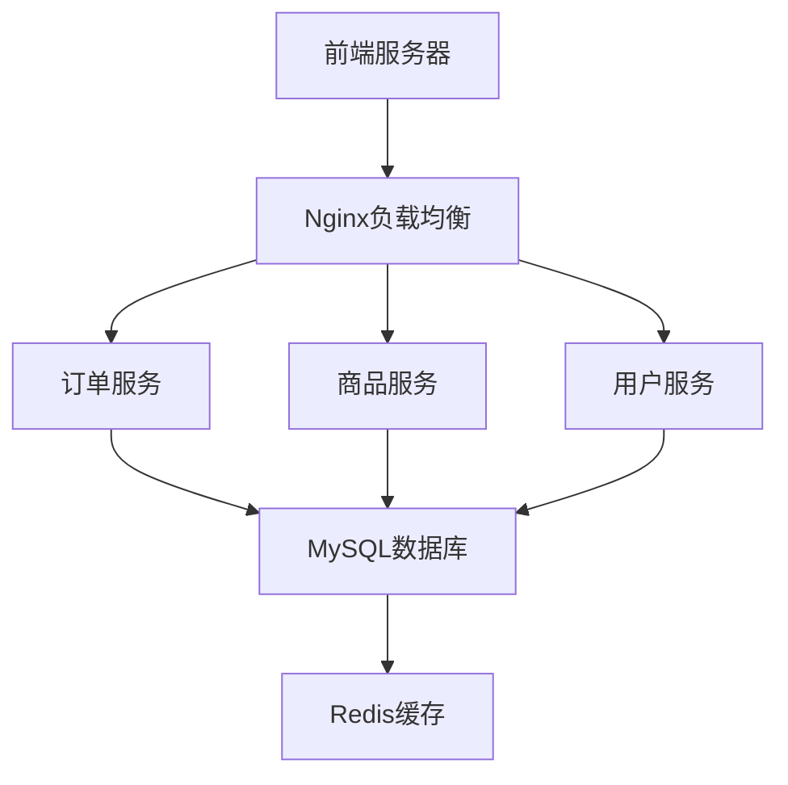
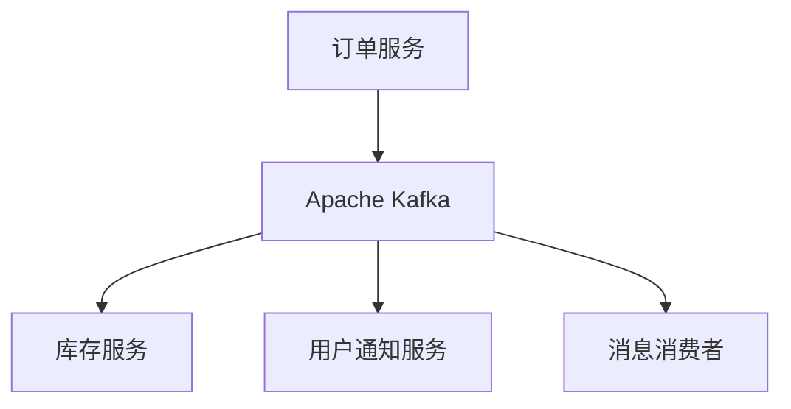
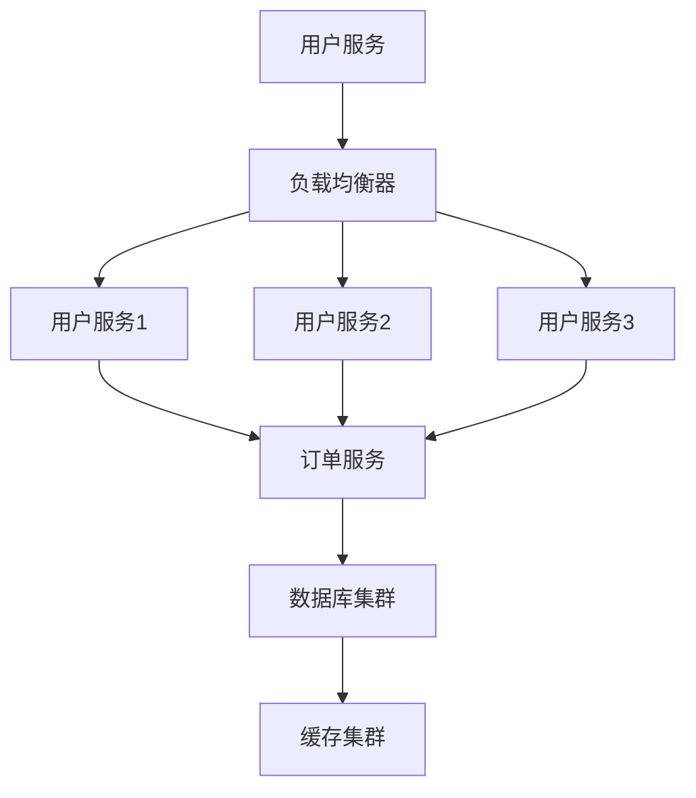
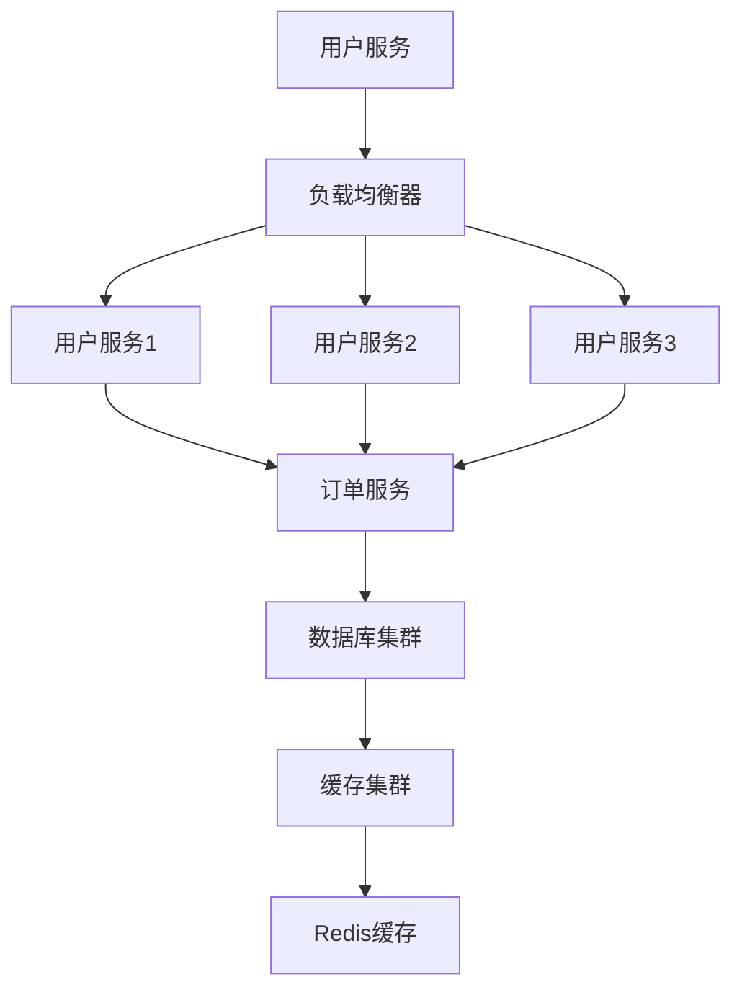
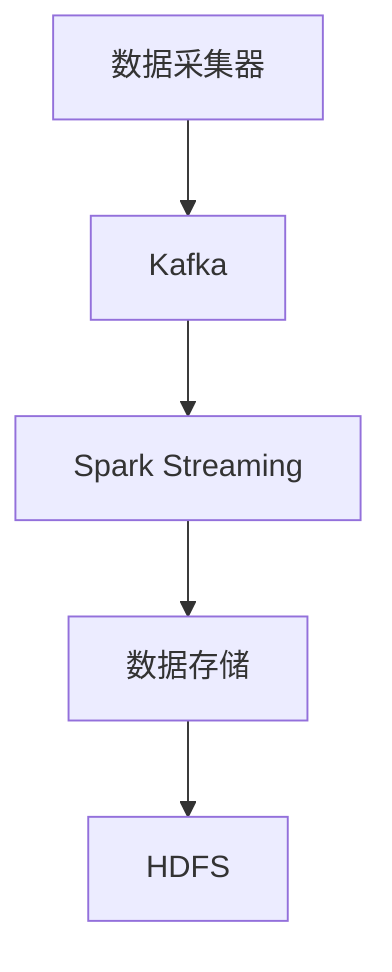
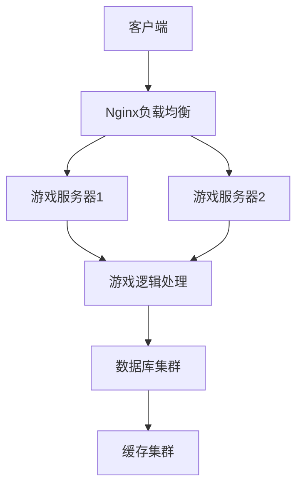

                 

### 1.3 本书的目标与结构

首先，我们需要明确本书的核心目标和结构，以确保读者能够系统地掌握高性能网络编程的基础知识、核心技术以及实战技巧。以下是本书的主要目标和结构概述：

#### 1.3.1 主要目标

本书的主要目标如下：

1. **全面讲解基础**：系统介绍网络编程的基础知识，包括套接字编程、TCP/IP协议、网络模型等，帮助读者建立坚实的理论基础。

2. **深入剖析核心技术**：深入探讨高性能网络编程的核心技术，如多线程、事件驱动模型、异步IO等，结合实际案例讲解如何应用这些技术优化服务器性能。

3. **实战技巧展示**：通过实战案例，展示如何在实际项目中应用高性能网络编程技术，如构建高性能Web服务器、异步消息队列服务、分布式服务架构等。

4. **性能优化策略**：提供一系列性能优化策略和技巧，帮助读者提升服务器的响应速度、资源利用率，以及系统稳定性。

#### 1.3.2 结构概述

本书将分为四个主要部分，每个部分都将深入探讨不同的主题：

**第一部分：高性能网络编程基础**

- **第1章**：高性能网络编程概述。介绍高性能网络编程的重要性、高并发服务器的概念以及本书的结构。
- **第2章**：网络编程基础。讲解套接字编程基础、TCP与UDP协议的特点及应用、网络协议分层模型。

**第二部分：高性能网络编程技术**

- **第3章**：高并发模型。介绍单线程模型、多线程模型、事件驱动模型、异步IO模型等，并分析其优缺点。
- **第4章**：高性能TCP/IP网络编程。详细讲解TCP连接管理、数据传输优化、网络拥塞与流量控制。
- **第5章**：高性能UDP网络编程。讨论UDP数据传输、多播技术、UDP可靠性机制。
- **第6章**：网络通信优化。介绍零拷贝技术、缓冲区管理、资源池技术等。

**第三部分：高并发服务实战**

- **第7章**：网络性能监控与调试。讲解性能监控工具、常见性能问题分析、性能优化策略。
- **第8章**：构建高性能Web服务器。介绍服务器架构设计、HTTP协议处理、静态文件与动态内容处理。
- **第9章**：异步消息队列服务。介绍消息队列原理、高并发消息处理、消息队列性能优化。
- **第10章**：分布式服务架构。探讨分布式系统原理、负载均衡、分布式存储与计算。
- **第11章**：实战案例解析。通过案例分析，展示高并发电商系统、实时数据处理系统、云端游戏服务器的构建与优化。

**第四部分：附录**

- **第12章**：常用网络编程工具与库。介绍常用的网络编程库、性能测试工具、调试与分析工具。
- **第13章**：参考文献与进一步阅读。提供本书引用的参考资料，以及进一步的阅读推荐。

### 1.3.2 整体逻辑与关联

为了使读者能够更好地理解和应用高性能网络编程技术，本书的结构设计遵循以下逻辑：

1. **基础理论**：首先介绍网络编程的基础知识，如套接字编程、TCP/IP协议等，为后续章节的核心技术奠定基础。
2. **核心技术**：在理解基础理论后，逐步深入探讨多线程、事件驱动模型、异步IO等高性能编程技术，结合实际案例讲解其应用场景。
3. **实战技巧**：通过实战案例，展示如何在实际项目中应用高性能网络编程技术，帮助读者将理论知识转化为实际操作能力。
4. **性能优化**：最后，提供一系列性能优化策略和技巧，帮助读者进一步提升服务器的性能。

各部分内容之间相互关联，形成了一个完整的知识体系。通过这样的结构设计，读者可以逐步从基础理论到核心技术，再到实际应用，最终实现全面掌握高性能网络编程的能力。

### 结论

总之，本书旨在为读者提供一套系统、全面、易于理解的高性能网络编程指南。通过深入探讨基础理论、核心技术、实战技巧和性能优化策略，帮助读者构建高并发服务器，提升互联网应用性能。希望读者在阅读本书的过程中，能够不断实践、思考，最终掌握这一关键技能。

---

在接下来的章节中，我们将逐一详细讲解高性能网络编程的基础知识，包括套接字编程、TCP/IP协议、网络模型等，为读者奠定坚实的基础。敬请期待！

---

## 第2章：网络编程基础

### 2.1 套接字编程基础

套接字（Socket）是网络编程中用来实现进程间通信（Inter-Process Communication, IPC）的一种接口。在TCP/IP协议族中，套接字是一个抽象的接口，用于实现不同主机间的数据传输。理解套接字编程是掌握网络编程的关键。

#### 2.1.1 套接字的定义与作用

套接字（Socket）是通信的端点，通过套接字，两个进程可以在网络上进行数据交换。套接字通常由IP地址和端口号组成，它是网络通信的一个抽象概念。

- **IP地址**：用于标识网络中的设备地址，确保数据包能够正确到达目标主机。
- **端口号**：用于标识主机上的特定服务，例如HTTP服务的默认端口号为80。

套接字编程的主要作用包括：

- **进程间通信**：在同一个主机上，不同的进程可以通过套接字进行通信。
- **跨主机通信**：通过TCP/IP协议，实现不同主机之间的数据交换。

#### 2.1.2 套接字的工作原理

套接字的工作原理可以概括为以下几个步骤：

1. **创建套接字**：应用程序通过调用socket函数创建套接字，指定通信协议（如TCP或UDP）。
2. **绑定地址**：将套接字与本地地址绑定，确保套接字监听在正确的IP地址和端口号上。
3. **监听连接**：服务器端的套接字调用listen函数，准备接收客户端的连接请求。
4. **建立连接**：客户端通过调用connect函数向服务器发送连接请求，服务器端的套接字调用accept函数接受连接请求。
5. **数据传输**：连接建立后，双方可以通过send和recv函数进行数据传输。
6. **关闭连接**：数据传输完成后，双方调用close函数关闭套接字。

#### 2.1.3 套接字编程的API

套接字编程主要依赖于以下API函数：

- **socket()**：创建套接字。
- **bind()**：将套接字与本地地址绑定。
- **listen()**：准备接收连接请求。
- **accept()**：接受客户端连接请求。
- **connect()**：发起连接请求。
- **send()**：发送数据。
- **recv()**：接收数据。
- **close()**：关闭套接字。

### 2.2 TCP与UDP协议的特点及应用

在网络编程中，传输控制协议（TCP）和用户数据报协议（UDP）是最常用的两种协议。它们各自具有不同的特点和应用场景。

#### 2.2.1 TCP协议

TCP是一种面向连接的、可靠的、基于字节流的传输层通信协议。它的特点包括：

- **面向连接**：在数据传输前，需要建立连接，传输结束后，需要释放连接。
- **可靠性**：通过确认和重传机制，确保数据的可靠传输。
- **有序性**：确保数据的顺序传输，不会出现乱序。
- **流量控制**：通过滑动窗口机制，控制数据的发送速度，避免网络拥塞。

TCP协议适用于对数据传输可靠性要求较高的场景，如Web浏览、文件传输、邮件传输等。

#### 2.2.2 UDP协议

UDP是一种无连接的、不可靠的、基于数据报的传输层协议。它的特点包括：

- **无连接**：不需要建立连接，发送数据前无需进行任何准备工作。
- **不可靠**：数据传输过程中不保证数据的可靠到达，可能出现丢包或乱序。
- **实时性**：由于不需要建立连接和确认，UDP传输速度较快，适用于实时应用。

UDP协议适用于对实时性要求较高的场景，如视频会议、在线游戏、实时语音等。

#### 2.2.3 TCP与UDP的比较

| 特点 | TCP | UDP |
| --- | --- | --- |
| 面向连接 | 是 | 否 |
| 可靠性 | 是 | 否 |
| 有序性 | 是 | 否 |
| 流量控制 | 是 | 否 |
| 实时性 | 低 | 高 |
| 复用端口 | 是 | 是 |
| 性能 | 较低 | 较高 |

### 2.3 网络协议分层模型

网络协议分层模型是将网络通信过程划分为多个层次，每一层负责实现特定的功能，并向上层提供服务。TCP/IP协议族采用的是四层模型，分别是：

1. **应用层**：负责应用程序的通信，如HTTP、FTP、SMTP等。
2. **传输层**：负责端到端的数据传输，如TCP和UDP。
3. **网络层**：负责数据包的传输路由，如IP协议。
4. **数据链路层**：负责数据帧的传输，如以太网协议。

这种分层模型使得网络通信更加灵活和可扩展，每层协议独立实现和更新，不影响其他层次。

### 总结

通过本章的讲解，读者应该对套接字编程、TCP与UDP协议以及网络协议分层模型有了基本的了解。这些基础知识是掌握高性能网络编程的重要前提，为后续章节的深入探讨打下了坚实的基础。

---

在下一章中，我们将深入探讨高并发模型，包括单线程模型、多线程模型、事件驱动模型和异步IO模型，分析各自的优缺点，帮助读者选择最适合的模型来构建高性能服务器。敬请期待！

---

## 第3章：高并发模型

### 3.1 单线程模型

单线程模型是最简单的并发模型，即程序在整个执行过程中仅使用一个线程。这意味着所有任务都由单个线程执行，顺序执行。虽然实现简单，但在高并发环境下，单线程模型往往无法充分利用多核处理器的优势，导致性能瓶颈。

#### 3.1.1 优点

- **实现简单**：单线程模型易于理解和实现，不需要复杂的线程同步机制。
- **资源占用少**：单线程模型对系统资源的占用较少，不需要额外的线程管理开销。

#### 3.1.2 缺点

- **性能瓶颈**：在高并发场景下，单线程模型容易成为性能瓶颈，无法充分利用多核处理器的计算能力。
- **可扩展性差**：单线程模型的可扩展性较差，增加任务数量会导致线程阻塞，响应速度下降。

#### 3.1.3 应用场景

单线程模型适用于以下场景：

- **小规模并发请求**：对于并发请求较少的场景，单线程模型可以保持良好的响应速度。
- **简单任务处理**：对于任务相对简单且不需要并行处理的场景，单线程模型可以简化程序设计。

### 3.2 多线程模型

多线程模型通过在程序中创建多个线程，并行执行任务，从而提高程序的并发性能。多线程模型可以充分利用多核处理器的计算能力，提升程序的响应速度。

#### 3.2.1 优点

- **并行处理**：多线程模型可以并行处理多个任务，提高程序的整体性能。
- **响应速度提升**：在高并发场景下，多线程模型可以提升程序的响应速度，减少等待时间。

#### 3.2.2 缺点

- **线程同步开销**：多线程模型需要处理线程同步问题，如锁、信号量等，增加了程序的复杂度和运行开销。
- **资源竞争**：多个线程同时访问共享资源时，容易发生资源竞争，导致性能下降。

#### 3.2.3 应用场景

多线程模型适用于以下场景：

- **高并发场景**：对于需要处理大量并发请求的场景，多线程模型可以显著提高程序的响应速度。
- **计算密集型任务**：对于需要大量计算的任务，多线程模型可以充分利用多核处理器的计算能力。

#### 3.2.4 线程池

为了解决多线程模型中的资源竞争和线程创建销毁的开销，线程池应运而生。线程池是一种管理线程的机制，预先创建一定数量的线程，并放入线程池中。任务到达时，线程池分配空闲线程执行任务，任务完成后，线程重新进入线程池等待下一个任务。

- **优点**：
  - **降低开销**：减少了线程的创建和销毁开销。
  - **避免资源竞争**：线程在执行任务时，不会与其他线程发生资源竞争。
  - **负载均衡**：线程池可以自动进行负载均衡，避免个别线程过载。

- **缺点**：
  - **线程数量受限**：线程池中的线程数量是固定的，当任务量超出线程池容量时，任务可能需要排队等待。

### 3.3 事件驱动模型

事件驱动模型通过监听事件并响应事件来执行任务，不依赖于线程。在事件驱动模型中，程序的核心是一个事件循环，它持续监听事件，并在事件发生时调用相应的处理函数。

#### 3.3.1 优点

- **高效利用CPU资源**：事件驱动模型可以高效利用CPU资源，避免线程上下文切换的开销。
- **低资源占用**：事件驱动模型不需要创建多个线程，资源占用较低。

#### 3.3.2 缺点

- **复杂度高**：事件驱动模型的编程复杂度较高，需要处理事件队列、事件调度等。
- **响应延迟**：事件驱动模型在处理大量事件时，可能存在一定的响应延迟。

#### 3.3.3 应用场景

事件驱动模型适用于以下场景：

- **高并发场景**：对于需要处理大量并发事件的场景，事件驱动模型可以高效利用系统资源。
- **实时性要求高的应用**：对于需要实时响应的应用，如实时聊天、在线游戏等，事件驱动模型可以降低响应延迟。

### 3.4 异步IO模型

异步IO模型通过将IO操作与线程分离，提高程序的并发性能。在异步IO模型中，程序在发起IO操作后，可以继续执行其他任务，而不必等待IO操作完成。

#### 3.4.1 优点

- **提高并发性能**：异步IO模型可以同时发起多个IO操作，提高程序的整体并发性能。
- **减少线程阻塞**：在同步IO模型中，线程在IO操作时会阻塞，而在异步IO模型中，线程可以继续执行其他任务。

#### 3.4.2 缺点

- **编程复杂度高**：异步IO模型需要处理IO回调，编程复杂度较高。
- **调试困难**：异步IO模型的调试相对困难，因为线程的执行顺序和回调函数的执行顺序可能不一致。

#### 3.4.3 应用场景

异步IO模型适用于以下场景：

- **IO密集型任务**：对于大量IO操作的场景，如文件读写、网络通信等，异步IO模型可以显著提高程序的并发性能。
- **高并发场景**：在需要处理大量并发请求的场景，异步IO模型可以充分利用系统资源。

### 总结

本章介绍了四种高并发模型：单线程模型、多线程模型、事件驱动模型和异步IO模型。每种模型都有其独特的优点和适用场景。在实际应用中，可以根据具体需求和场景选择合适的模型，以达到最佳的并发性能。

---

在下一章中，我们将深入探讨高性能TCP/IP网络编程，包括TCP连接管理、数据传输优化和网络拥塞与流量控制。敬请期待！

---

## 第4章：高性能TCP/IP网络编程

### 4.1 TCP连接管理

TCP连接管理是高性能网络编程的核心之一。在TCP连接的生命周期内，包括连接建立、数据传输和连接终止等关键阶段。掌握TCP连接管理，能够确保服务器在高并发环境下稳定运行，并优化资源利用。

#### 4.1.1 TCP连接的三次握手

TCP连接的建立过程通过三次握手（Three-Way Handshake）实现，这是确保双方通信状态一致的重要机制。三次握手的过程如下：

1. **SYN发送**：客户端向服务器发送一个SYN（同步序列编号）报文，并进入SYN_SENT状态。
2. **SYN+ACK响应**：服务器收到SYN报文后，发送一个SYN+ACK（同步序列编号+确认）报文，并进入SYN_RCVD状态。此报文中包含确认号和初始序列编号。
3. **ACK确认**：客户端收到服务器的SYN+ACK报文后，发送一个ACK（确认）报文，并进入ESTABLISHED状态。服务器收到ACK报文后，也进入ESTABLISHED状态，完成连接建立。

#### 4.1.2 TCP连接的维护

建立连接后，TCP连接需要定期进行维护，以确保连接的稳定性。常见的维护机制包括：

- **心跳检测**：通过发送心跳报文（Keepalive），检测连接是否仍然活跃。
- **超时重传**：如果发送的数据包在一定时间内未收到确认，TCP会重新发送数据包，并重新开始计时。
- **流量控制**：通过滑动窗口机制，控制发送方的数据流量，避免网络拥塞。

#### 4.1.3 TCP连接的终止

TCP连接的终止过程通过四次挥手（Four-Way Handshake）实现。四次挥手的过程如下：

1. **FIN发送**：首先，一端（通常是客户端）发送一个FIN（结束）报文，进入FIN_WAIT_1状态。
2. **ACK响应**：另一端（服务器）收到FIN报文后，发送一个ACK报文，并进入CLOSE_WAIT状态。
3. **第二次FIN发送**：服务器发送一个FIN报文，进入LAST_ACK状态。
4. **最终ACK确认**：客户端收到服务器的FIN报文后，发送一个ACK报文，并进入TIME_WAIT状态。服务器收到ACK报文后，进入CLOSED状态。

在TIME_WAIT状态，客户端需要等待一段时间以确保服务器端的最后一个确认报文已经到达。这段时间通常是2倍的最大段生命周期（MSS），以确保连接彻底关闭。

### 4.2 数据传输优化

数据传输优化是提升网络性能的关键。以下是一些常见的数据传输优化技术：

#### 4.2.1 Nagle算法

Nagle算法是一种优化TCP数据传输的算法，其核心思想是减少网络中的小数据包数量，提高传输效率。Nagle算法的主要策略是：

- **延迟发送**：当发送多个小数据包时，Nagle算法会将这些数据包合并成一个大数据包再发送，以减少网络中的小数据包数量。
- **立即确认**：即使接收到的是部分数据包，也会立即发送确认报文，以便发送方可以尽快发送下一个数据包。

#### 4.2.2 TCP窗口调整

TCP窗口调整是通过调整TCP窗口大小，来优化数据传输速率。TCP窗口分为接收窗口和发送窗口：

- **接收窗口**：表示接收方能够接收的数据量。
- **发送窗口**：表示发送方可以发送的数据量。

TCP窗口的调整机制包括：

- **慢启动**：初始时，发送窗口大小逐渐增大，直到达到接收窗口大小。
- **拥塞避免**：当网络拥塞时，发送窗口大小逐渐减小，以避免进一步拥塞。
- **快速重传和快速恢复**：在网络拥塞或数据包丢失时，快速重传和快速恢复机制可以迅速调整发送窗口大小，提高传输效率。

#### 4.2.3 零拷贝技术

零拷贝技术通过减少数据在用户空间和内核空间之间的数据复制次数，来提高数据传输效率。零拷贝的主要实现方式包括：

- **sendfile系统调用**：sendfile系统调用可以直接从文件的内存映射区域将数据发送到网络缓冲区，无需在用户空间和内核空间之间进行数据复制。
- **splice系统调用**：splice系统调用可以将数据从一个文件描述符复制到另一个文件描述符，避免在用户空间和内核空间之间的数据复制。

### 4.3 网络拥塞与流量控制

网络拥塞是影响网络性能的重要因素。TCP协议通过流量控制机制，避免网络拥塞，保证数据传输的稳定性。

#### 4.3.1 拥塞控制

TCP的拥塞控制主要通过以下几个机制实现：

- **慢启动**：在网络连接初期，发送方逐渐增加发送速率，直到达到网络的容量。
- **拥塞避免**：在网络传输过程中，当网络开始拥塞时，发送方通过减少发送速率，避免进一步增加网络负载。
- **快速重传和快速恢复**：当检测到数据包丢失时，发送方立即重传丢失的数据包，并进入快速恢复阶段，迅速减少发送速率。

#### 4.3.2 流量控制

TCP的流量控制主要通过窗口调整机制实现：

- **接收窗口**：接收方通过调整接收窗口大小，控制发送方发送的数据量，避免接收缓冲区溢出。
- **滑动窗口**：发送方根据接收窗口大小，动态调整发送窗口大小，确保数据传输的稳定性和可靠性。

### 总结

本章详细介绍了高性能TCP/IP网络编程的关键技术，包括TCP连接管理、数据传输优化和网络拥塞与流量控制。通过掌握这些技术，开发人员可以构建高效、稳定、可靠的网络应用。

---

在下一章中，我们将探讨高性能UDP网络编程，包括UDP数据传输、多播技术以及UDP可靠性机制。敬请期待！

---

## 第5章：高性能UDP网络编程

### 5.1 UDP数据传输

UDP（用户数据报协议）是一种无连接的、不可靠的传输层协议，常用于对实时性要求较高的场景，如实时语音、实时视频和在线游戏等。理解UDP数据传输的基本原理和机制对于构建高性能的网络应用至关重要。

#### 5.1.1 UDP数据报文结构

UDP数据报文由以下部分组成：

- **头部**：UDP头部包含源端口号、目的端口号、UDP长度和UDP校验和等字段。头部长度固定为8字节。
- **数据**：UDP数据部分是应用程序发送的实际数据。

#### 5.1.2 UDP数据传输过程

UDP数据传输过程相对简单，主要包括以下步骤：

1. **创建UDP套接字**：应用程序通过调用socket()函数创建UDP套接字。
2. **绑定地址**：通过调用bind()函数，将套接字与本地IP地址和端口号绑定。
3. **发送数据**：通过调用sendto()函数发送数据报文到指定目的IP地址和端口号。
4. **接收数据**：通过调用recvfrom()函数接收来自远程主机的数据报文。

#### 5.1.3 UDP数据传输的特点

UDP数据传输具有以下特点：

- **无连接**：UDP不需要建立连接，发送数据前无需进行任何准备工作。
- **不可靠**：UDP不保证数据包的可靠到达，可能出现丢包或乱序。
- **实时性**：由于不需要建立连接和确认，UDP传输速度较快，适用于实时应用。

### 5.2 多播技术

多播（Multicast）是一种将数据报文同时发送到多个接收者的技术，广泛应用于实时视频、在线会议和大规模游戏等领域。多播技术可以显著减少网络带宽占用，提高数据传输效率。

#### 5.2.1 多播的工作原理

多播的工作原理包括以下几个方面：

1. **多播源**：数据报文从多播源发送，通常是一个服务器或主播设备。
2. **多播路由器**：多播路由器负责将多播报文从多播源传输到多播组成员所在的子网。
3. **多播组成员**：加入多播组的设备称为多播组成员，可以接收多播源发送的报文。

#### 5.2.2 多播协议

常用的多播协议包括：

- **IP多播地址**：IP多播地址以224.0.0.0/24作为私有地址空间，用于标识多播组。
- **IGMP（Internet Group Management Protocol）**：IGMP协议是多播组成员用于向多播路由器报告多播组加入和退出的机制。
- **PIM（Protocol Independent Multicast）**：PIM是一种多播路由协议，用于将多播报文从多播源传输到多播组成员。

#### 5.2.3 多播优化的技术

为了优化多播性能，可以采用以下技术：

- **IGMP snooping**：IGMP snooping是一种在交换机中实现的机制，用于监控IGMP报文，快速识别和跟踪多播组成员。
- **多播树**：包括源特定多播树（SSM）和共享多播树（SMT），用于优化多播报文的路由。
- **多播带宽控制**：通过控制多播报文的发送速率，避免网络带宽的过度占用。

### 5.3 UDP可靠性机制

虽然UDP是一种不可靠的协议，但在某些应用场景中，确保数据包的可靠性仍然是必要的。为此，可以采用以下几种方法来增强UDP的可靠性：

#### 5.3.1 实时反馈机制

实时反馈机制通过在数据报文中添加序列号和确认字段，实现数据的可靠传输。具体方法包括：

- **序列号**：为每个数据包分配一个唯一的序列号，用于确保数据的有序传输。
- **确认机制**：接收方发送确认报文，告知发送方数据包已成功接收。

#### 5.3.2 重传机制

重传机制用于在数据包丢失时，重新发送丢失的数据包。具体方法包括：

- **超时重传**：在发送数据包后，等待一段时间（超时时间）未收到确认，重新发送数据包。
- **快速重传**：在收到数据包的部分确认时，立即重传丢失的数据包，以提高传输效率。

#### 5.3.3 拥塞控制

通过拥塞控制机制，可以避免过多数据包在网络中传输，减少丢包概率。具体方法包括：

- **拥塞窗口**：控制发送方发送数据包的数量，避免网络拥塞。
- **慢启动和拥塞避免**：在数据传输过程中，通过调整发送速率，避免网络拥塞。

### 总结

本章介绍了高性能UDP网络编程的核心内容，包括UDP数据传输、多播技术和UDP可靠性机制。通过理解这些技术，开发人员可以构建高效、实时、可靠的网络应用。

---

在下一章中，我们将深入探讨网络通信优化技术，包括零拷贝技术、缓冲区管理和资源池技术。敬请期待！

---

## 第6章：网络通信优化

### 6.1 零拷贝技术

零拷贝（Zero-Copy）技术是一种通过减少数据在内核空间和用户空间之间的复制次数，从而提高数据传输效率的技术。传统的数据传输过程中，数据需要在用户空间和内核空间之间进行多次复制，这不仅增加了CPU的开销，也降低了网络性能。零拷贝技术通过优化数据传输路径，降低了数据复制的次数，从而提高了系统性能。

#### 6.1.1 传统数据传输过程

在传统数据传输过程中，数据从应用层传递到网络栈，需要经过以下几个步骤：

1. **应用层到内核空间**：应用层将数据写入内核空间的缓冲区。
2. **内核空间到网络栈**：内核空间将数据复制到网络栈的缓冲区。
3. **网络栈到网络设备**：网络栈将数据发送到网络设备进行传输。

这一过程涉及多次数据复制，增加了系统开销。

#### 6.1.2 零拷贝技术实现

零拷贝技术主要通过以下几种方式实现：

1. **直接内存访问（DMA）**：DMA控制器可以直接将数据从内存复制到网络设备，无需经过CPU。这种方式减少了CPU的开销，提高了数据传输速度。
2. **文件描述符传递**：在Linux系统中，通过sendfile()系统调用，可以直接将文件描述符从用户空间传递到内核空间，减少了数据复制次数。
3. **mmap()映射**：通过mmap()系统调用，将文件映射到用户空间的内存区域，实现数据的直接传输。

#### 6.1.3 零拷贝的优势

零拷贝技术具有以下优势：

- **减少CPU开销**：通过减少数据复制次数，降低了CPU的使用率，提高了系统性能。
- **提高数据传输速度**：直接将数据从用户空间传输到网络设备，减少了传输延迟。
- **简化程序设计**：零拷贝技术简化了数据传输的编程模型，降低了开发难度。

### 6.2 缓冲区管理

缓冲区管理是网络编程中的重要一环，有效的缓冲区管理可以显著提高系统的响应速度和网络吞吐量。缓冲区管理的关键在于如何合理地分配和管理缓冲区资源，以避免缓冲区溢出和资源浪费。

#### 6.2.1 缓冲区分配策略

缓冲区分配策略主要包括以下几种：

1. **固定大小缓冲区**：预先分配一定大小的缓冲区，适用于数据包大小相对稳定的场景。
2. **动态缓冲区分配**：根据实际数据包大小动态分配缓冲区，适用于数据包大小不定的场景。
3. **缓冲区池**：预先创建多个缓冲区，根据需要分配和回收缓冲区，减少了缓冲区分配和释放的开销。

#### 6.2.2 缓冲区复用

缓冲区复用是指在处理完一个数据包后，不立即释放缓冲区，而是将其重新放入缓冲区池中，供后续使用。缓冲区复用有以下优点：

- **减少内存分配和释放开销**：复用已分配的缓冲区，减少了内存分配和释放的操作，提高了系统性能。
- **提高吞吐量**：缓冲区复用可以减少缓冲区分配和释放的延迟，提高系统的数据吞吐量。

#### 6.2.3 缓冲区溢出处理

缓冲区溢出是指缓冲区无法容纳新的数据包，导致数据包丢失。处理缓冲区溢出通常有以下几种方法：

- **丢弃数据包**：当缓冲区满时，直接丢弃新到达的数据包，适用于对数据包丢失不敏感的场景。
- **缓冲区扩展**：当缓冲区满时，自动扩展缓冲区大小，以容纳新的数据包。
- **优先级调度**：根据数据包的优先级，优先处理重要数据包，确保关键数据包不会因缓冲区满而丢失。

### 6.3 资源池技术

资源池技术是一种用于管理共享资源的策略，通过预先分配和管理资源，避免频繁的分配和释放操作，提高系统的响应速度和稳定性。资源池技术广泛应用于网络编程、数据库操作和并发处理等领域。

#### 6.3.1 资源池的工作原理

资源池的工作原理主要包括以下几个步骤：

1. **初始化**：预先分配一定数量的资源，并放入资源池中。
2. **资源分配**：当应用程序需要资源时，从资源池中分配资源。
3. **资源回收**：当应用程序使用完资源后，将其归还到资源池中。

#### 6.3.2 资源池的优势

资源池技术具有以下优势：

- **减少分配和释放开销**：通过预先分配资源，减少了频繁的内存分配和释放操作，降低了系统开销。
- **提高系统稳定性**：资源池可以确保资源的高效利用，避免资源争用和竞争。
- **提高响应速度**：资源池减少了资源的分配和回收延迟，提高了系统的响应速度。

#### 6.3.3 资源池的实现

资源池的实现主要包括以下几个方面：

- **资源池管理**：负责资源池的初始化、分配和回收操作。
- **线程安全**：确保资源池的操作是线程安全的，避免多线程同时访问资源池时出现数据竞争。
- **负载均衡**：根据实际需求，合理分配资源，避免个别资源过度使用。

### 总结

本章介绍了网络通信优化技术，包括零拷贝技术、缓冲区管理和资源池技术。通过这些优化技术，可以显著提高系统的性能和稳定性，为构建高性能的网络应用提供有力支持。

---

在下一章中，我们将讨论网络性能监控与调试技术，包括性能监控工具、常见性能问题分析以及性能优化策略。敬请期待！

---

## 第7章：网络性能监控与调试

### 7.1 性能监控工具

网络性能监控是确保服务器稳定运行和高效性能的关键步骤。性能监控工具可以帮助开发人员和运维人员实时监控服务器的网络状态、资源利用率和性能瓶颈，以便及时发现和解决问题。

#### 7.1.1 常见的性能监控工具

以下是几种常见的性能监控工具：

1. **Nagios**：Nagios是一种开源的监控工具，可以监控服务器的各种状态，如CPU使用率、内存使用率、网络流量等。
2. **Zabbix**：Zabbix是一种功能强大的开源监控解决方案，支持大规模分布式监控，提供实时数据展示和告警功能。
3. **Prometheus**：Prometheus是一种开源监控解决方案，特别适合监控容器和微服务架构，支持自定义告警和监控规则。
4. **Grafana**：Grafana是一种开源数据可视化和监控工具，可以将Prometheus等监控工具的数据进行可视化展示，提供直观的监控图表。

#### 7.1.2 监控指标的收集

性能监控工具主要通过以下几种方式收集监控指标：

- **系统级监控**：收集操作系统级别的指标，如CPU使用率、内存使用率、磁盘I/O、网络流量等。
- **应用级监控**：收集应用层面的监控指标，如HTTP请求处理时间、数据库响应时间、队列长度等。
- **日志监控**：通过日志分析工具，监控服务器日志文件中的关键信息，如错误日志、访问日志等。

### 7.2 常见性能问题分析

在服务器运行过程中，可能会遇到各种性能问题，如高CPU使用率、内存泄漏、网络延迟等。以下是几种常见性能问题及其分析：

#### 7.2.1 高CPU使用率

高CPU使用率通常是由于以下原因导致的：

- **计算密集型任务**：服务器正在执行大量计算任务，导致CPU使用率上升。
- **并发请求过多**：服务器在高并发请求下，需要处理大量连接，增加了CPU的负载。
- **内存泄漏**：应用程序存在内存泄漏，导致内存占用不断增加，CPU需要频繁进行垃圾回收。

解决方法：

- **优化计算任务**：减少计算密集型任务的数量或优化计算算法，降低CPU使用率。
- **增加CPU资源**：在硬件条件允许的情况下，增加服务器的CPU资源，如增加核心数或提高频率。
- **监控内存泄漏**：使用内存监控工具，找出内存泄漏的原因，并进行修复。

#### 7.2.2 内存泄漏

内存泄漏是指应用程序在使用内存后，未能正确释放内存，导致内存占用不断增加。内存泄漏可能会导致以下问题：

- **内存溢出**：当内存占用超过服务器可用内存时，应用程序可能会崩溃或出现异常。
- **性能下降**：由于内存泄漏导致内存占用不断增加，CPU需要频繁进行垃圾回收，降低了系统性能。

解决方法：

- **代码审查**：定期对应用程序进行代码审查，找出内存泄漏的代码逻辑。
- **内存监控工具**：使用内存监控工具，如VisualVM、GDB等，监控应用程序的内存使用情况，找出内存泄漏的模块和函数。
- **优化内存管理**：优化应用程序的内存管理策略，确保内存的正确释放。

#### 7.2.3 网络延迟

网络延迟是指数据在网络中传输所需的时间。高网络延迟可能会导致以下问题：

- **响应时间延长**：用户的请求需要更长的时间才能得到响应，影响用户体验。
- **数据传输缓慢**：大量数据需要更长的时间才能传输完成，降低了系统性能。

解决方法：

- **网络优化**：优化网络配置，如调整路由器设置、增加带宽等，降低网络延迟。
- **负载均衡**：通过负载均衡器，将请求均匀地分发到多个服务器上，避免单点过载。
- **缓存技术**：使用缓存技术，如HTTP缓存、数据库缓存等，减少数据的重复传输，降低网络延迟。

### 7.3 性能优化策略

性能优化是确保服务器高效运行的重要环节。以下是一些常见的性能优化策略：

#### 7.3.1 缓存优化

缓存优化是提高系统性能的有效方法。以下是一些缓存优化策略：

- **浏览器缓存**：通过设置合适的缓存策略，如Expires、Cache-Control等，延长浏览器缓存的过期时间。
- **HTTP缓存**：使用HTTP缓存头，如ETag、Last-Modified等，减少数据的重复传输。
- **数据库缓存**：使用数据库缓存，如Redis、Memcached等，缓存常用数据，减少数据库查询次数。

#### 7.3.2 资源池优化

资源池优化是提高系统资源利用率的策略。以下是一些资源池优化策略：

- **线程池**：使用线程池，预先生成一定数量的线程，减少线程创建和销毁的开销。
- **连接池**：使用连接池，预先生成一定数量的数据库连接，减少数据库连接的建立和断开次数。
- **对象池**：使用对象池，预先生成一定数量的对象，减少对象的创建和销毁次数。

#### 7.3.3 负载均衡

负载均衡是将请求均匀地分发到多个服务器上，避免单点过载的策略。以下是一些负载均衡策略：

- **轮询负载均衡**：按照顺序将请求分配到各个服务器上。
- **最小连接数负载均衡**：将请求分配到连接数最少的服务器上。
- **加权轮询负载均衡**：根据服务器的性能和负载，分配不同权重的请求。

### 总结

本章介绍了网络性能监控与调试的方法和策略，包括性能监控工具、常见性能问题分析以及性能优化策略。通过掌握这些技术和方法，开发人员和运维人员可以有效地监控和优化服务器的网络性能，确保系统的高效稳定运行。

---

在下一章中，我们将探讨构建高性能Web服务器的技术细节，包括服务器架构设计、HTTP协议处理以及静态文件与动态内容处理。敬请期待！

---

## 第8章：构建高性能Web服务器

### 8.1 服务器架构设计

高性能Web服务器的设计是确保系统在高并发、高流量环境下稳定运行的关键。合理的架构设计不仅能提高服务器的性能，还能确保其可扩展性和稳定性。

#### 8.1.1 传统架构

传统的Web服务器架构通常包括以下几个层次：

1. **前端服务器**：负责处理用户的HTTP请求，通常使用Apache、Nginx等开源Web服务器软件。
2. **应用服务器**：负责处理业务逻辑，如Java EE应用服务器（如Tomcat、Jboss等）。
3. **数据库服务器**：存储业务数据，如MySQL、PostgreSQL等关系型数据库。
4. **缓存服务器**：如Redis、Memcached，用于缓存常用数据，减少数据库访问压力。

#### 8.1.2 微服务架构

随着微服务架构的兴起，现代Web服务器的架构设计逐渐向微服务方向发展。微服务架构将应用程序拆分为多个独立的服务，每个服务负责特定的业务功能，通过API进行交互。

微服务架构的优点包括：

- **高可扩展性**：每个服务可以独立扩展，增加或减少服务实例，以应对不同业务场景。
- **高容错性**：单个服务的故障不会影响整个系统的运行，提高了系统的可靠性。
- **灵活部署**：服务可以独立部署，便于管理和维护。

#### 8.1.3 架构设计原则

高性能Web服务器的架构设计应遵循以下原则：

- **分层设计**：将系统分层，确保各层功能清晰，降低模块间的耦合度。
- **模块化**：将功能模块化，便于开发和维护。
- **高可用性**：设计冗余备份机制，确保系统在故障情况下仍能正常运行。
- **可扩展性**：设计时考虑系统的可扩展性，便于后续的业务增长。

### 8.2 HTTP协议处理

HTTP（超文本传输协议）是Web服务器与客户端之间进行通信的基础协议。理解HTTP协议的工作原理和关键技术对于构建高性能Web服务器至关重要。

#### 8.2.1 HTTP请求与响应流程

HTTP请求与响应流程主要包括以下几个步骤：

1. **客户端发送请求**：客户端通过浏览器或其他HTTP客户端软件向服务器发送HTTP请求。
2. **服务器接收请求**：服务器接收客户端的请求，并解析请求内容。
3. **服务器处理请求**：服务器根据请求的URL和HTTP方法，调用相应的处理函数，处理请求。
4. **服务器发送响应**：服务器将处理结果以HTTP响应的形式返回给客户端。
5. **客户端处理响应**：客户端接收服务器的响应，并显示页面或执行后续操作。

#### 8.2.2 HTTP请求方法

HTTP定义了多种请求方法，常见的包括：

- **GET**：请求从服务器获取数据，通常用于查询数据。
- **POST**：请求向服务器发送数据，通常用于提交表单或上传文件。
- **PUT**：请求向服务器发送数据，用于更新或创建资源。
- **DELETE**：请求删除服务器上的资源。

#### 8.2.3 HTTP响应状态码

HTTP响应状态码用于表示服务器对请求的处理结果，常见的状态码包括：

- **200 OK**：请求成功处理。
- **404 Not Found**：请求的资源不存在。
- **500 Internal Server Error**：服务器内部错误。

### 8.3 静态文件与动态内容处理

Web服务器需要处理静态文件和动态内容，两者的处理方式有所不同。

#### 8.3.1 静态文件处理

静态文件处理主要包括以下步骤：

1. **文件定位**：服务器根据请求的URL定位到相应的文件。
2. **读取文件**：从文件系统中读取文件内容。
3. **发送响应**：将文件内容作为HTTP响应发送给客户端。

静态文件处理的关键技术包括：

- **缓存**：使用浏览器缓存和服务器缓存，减少文件的重复传输。
- **压缩**：使用GZIP等压缩算法，减少文件传输的数据量。

#### 8.3.2 动态内容处理

动态内容处理通常涉及以下步骤：

1. **解析请求**：解析HTTP请求，获取请求的URL和参数。
2. **调用业务逻辑**：根据URL调用相应的业务逻辑，处理请求。
3. **生成响应**：根据业务处理结果，生成HTTP响应。
4. **发送响应**：将HTTP响应发送给客户端。

动态内容处理的关键技术包括：

- **模板引擎**：使用模板引擎，如Jinja2、Thymeleaf等，生成动态内容。
- **会话管理**：使用会话管理机制，如Cookie、Session等，管理用户状态。
- **中间件**：使用中间件，如Spring MVC、Django等，简化业务逻辑处理。

### 8.4 实际案例分析

以下是一个实际的高性能Web服务器案例：

#### 8.4.1 案例背景

某电子商务平台在促销期间，面临了数百万级的高并发访问。为了确保平台的稳定性，该平台采用了以下架构设计：

- **前端服务器**：使用Nginx作为负载均衡器，将请求分发到多个Tomcat实例。
- **应用服务器**：使用Spring Boot微服务框架，拆分为订单服务、商品服务、用户服务等多个独立的服务。
- **数据库服务器**：使用MySQL集群，确保数据的高可用性和读写分离。
- **缓存服务器**：使用Redis进行缓存，减少数据库访问压力。

#### 8.4.2 架构设计

该电子商务平台的架构设计如图8-1所示：



#### 8.4.3 性能优化策略

为了提高平台的性能，该电子商务平台采取了以下优化策略：

- **负载均衡**：使用Nginx进行负载均衡，将请求均匀分配到多个应用服务器实例，避免单点过载。
- **缓存优化**：使用Redis缓存热点数据，减少数据库访问次数，降低数据库压力。
- **数据库优化**：使用读写分离，将读请求路由到从库，提高数据库查询性能。
- **静态资源优化**：使用CDN加速静态资源的加载，减少用户访问延迟。
- **静态内容缓存**：使用Nginx缓存静态文件，减少服务器处理请求的负载。

### 总结

本章介绍了构建高性能Web服务器的技术细节，包括服务器架构设计、HTTP协议处理以及静态文件与动态内容处理。通过实际案例分析，展示了如何优化Web服务器的性能，确保其在高并发、高流量环境下稳定运行。

---

在下一章中，我们将深入探讨异步消息队列服务，包括消息队列原理、高并发消息处理以及消息队列性能优化。敬请期待！

---

## 第9章：异步消息队列服务

### 9.1 消息队列原理

消息队列（Message Queue，MQ）是一种用于异步通信的中间件技术，允许不同系统的组件之间通过消息进行解耦和数据传递。消息队列的核心原理是通过中间件服务器将消息存储和转发，从而实现分布式系统的异步通信。

#### 9.1.1 消息队列的工作机制

消息队列的工作机制主要包括以下几个步骤：

1. **消息生产者**：产生消息并发布到消息队列中。
2. **消息队列**：存储消息，并按照一定的策略（如先进先出（FIFO））将消息推送到消费者。
3. **消息消费者**：从消息队列中获取消息并处理。

#### 9.1.2 消息队列的类型

根据消息队列的实现方式和特性，可以分为以下几种类型：

1. **基于内存的消息队列**：如ActiveMQ、RabbitMQ等，适用于中小规模的应用。
2. **基于磁盘的消息队列**：如Kafka、RocketMQ等，适用于大规模和高并发场景。
3. **分布式消息队列**：如Apache Pulsar、Apache Kafka等，支持分布式架构，能够处理大规模消息。

#### 9.1.3 消息队列的优势

消息队列的优势包括：

- **异步处理**：消息队列允许系统组件异步处理消息，提高系统的吞吐量和响应速度。
- **解耦**：通过消息队列，可以降低系统组件之间的耦合度，便于系统的维护和扩展。
- **高可用性**：分布式消息队列支持集群部署，确保系统的高可用性。

### 9.2 高并发消息处理

在高并发环境下，消息队列需要高效处理大量消息，确保系统的稳定运行。以下是一些关键技术和策略：

#### 9.2.1 消息批量处理

消息批量处理是指将多个消息合并成一个批量进行处理，从而减少系统调用的次数，提高处理效率。批量处理技术可以通过以下方式实现：

- **批量消费**：消费者在从消息队列中拉取消息时，可以一次性获取多个消息，并批量处理。
- **批量发送**：生产者在发布消息时，可以一次性发送多个消息，减少发送的次数。

#### 9.2.2 消息优先级处理

消息优先级处理是指根据消息的优先级，将高优先级消息优先处理，确保关键业务得到及时响应。消息优先级处理可以通过以下方式实现：

- **消息标签**：为消息设置不同的标签，根据标签进行优先级处理。
- **消息权重**：为消息设置不同的权重，根据权重进行优先级处理。

#### 9.2.3 消息重复处理

在分布式系统中，消息可能会因网络问题、系统故障等原因被重复处理。为了避免重复处理，可以使用以下策略：

- **去重机制**：为消息设置去重标识，如消息ID、MD5值等，确保消息的唯一性。
- **幂等处理**：在处理消息时，确保操作的幂等性，即多次执行与一次执行效果相同。

### 9.3 消息队列性能优化

消息队列的性能优化是确保系统在高并发场景下稳定、高效运行的关键。以下是一些常用的性能优化策略：

#### 9.3.1 系统水平扩展

系统水平扩展是指通过增加节点数量，提高系统的处理能力和吞吐量。水平扩展可以通过以下方式实现：

- **集群部署**：将消息队列服务器部署在多个节点上，形成集群，提高系统的容错能力和并发处理能力。
- **分布式架构**：使用分布式消息队列架构，如Kafka、Pulsar等，支持大规模消息处理。

#### 9.3.2 缓冲区管理

缓冲区管理是优化消息队列性能的重要手段。以下是一些缓冲区管理策略：

- **动态缓冲区调整**：根据系统的实际负载，动态调整缓冲区大小，确保系统在高并发场景下不会因缓冲区不足导致性能下降。
- **缓冲区复用**：复用已分配的缓冲区，减少缓冲区分配和释放的开销。

#### 9.3.3 网络优化

网络优化可以减少消息传输的延迟和带宽占用，提高系统的整体性能。以下是一些网络优化策略：

- **带宽预留**：在网络带宽紧张的情况下，为消息队列预留一定的带宽，确保消息传输的可靠性。
- **网络监控**：实时监控网络状态，及时发现问题并进行优化。

### 9.4 实际案例分析

以下是一个实际的企业级消息队列案例：

#### 9.4.1 案例背景

某大型电商平台在订单处理、库存管理、用户通知等场景中，使用消息队列进行异步处理，提高系统的响应速度和稳定性。

#### 9.4.2 架构设计

该电商平台的消息队列架构设计如图9-1所示：



#### 9.4.3 性能优化策略

为了确保消息队列的高性能和高可用性，该电商平台采取了以下优化策略：

- **集群部署**：将Kafka部署在多个节点上，形成集群，提高系统的容错能力和并发处理能力。
- **消息压缩**：使用GZIP等压缩算法，减少消息传输的数据量，提高网络传输效率。
- **批量消费**：消费者在从Kafka中拉取消息时，采用批量消费方式，减少系统调用的次数。
- **缓冲区管理**：动态调整Kafka的缓冲区大小，确保在高并发场景下缓冲区不会成为性能瓶颈。
- **网络优化**：在网络带宽紧张的情况下，为Kafka预留一定的带宽，确保消息传输的可靠性。

### 总结

本章介绍了异步消息队列服务的原理、高并发消息处理技术以及性能优化策略。通过实际案例分析，展示了如何优化消息队列的性能，确保系统在高并发场景下稳定、高效运行。

---

在下一章中，我们将探讨分布式服务架构，包括分布式系统原理、负载均衡、分布式存储与计算。敬请期待！

---

## 第10章：分布式服务架构

### 10.1 分布式系统原理

分布式系统是指由多个独立的计算机节点通过网络连接组成的系统，这些节点可以分布在不同的地理位置。分布式系统的核心思想是将任务分散到多个节点上执行，以提高系统的可扩展性、可靠性和性能。理解分布式系统的原理是构建高效、可靠的分布式服务架构的基础。

#### 10.1.1 分布式系统的特点

分布式系统具有以下特点：

- **高可用性**：通过冗余部署，分布式系统在单个节点故障时，仍能保持正常运行。
- **高扩展性**：分布式系统可以根据业务需求动态调整节点数量，实现水平扩展。
- **高性能**：分布式系统通过负载均衡，充分利用各个节点的计算资源，提高系统的整体性能。
- **高一致性**：在分布式系统中，保证数据的一致性是关键挑战。

#### 10.1.2 分布式系统的架构模式

分布式系统的架构模式主要包括以下几种：

1. **主从架构**：在主从架构中，系统有一个主节点负责协调工作，其他从节点负责具体任务的执行。
2. **去中心化架构**：去中心化架构中没有主节点，所有节点都是对等的，通过 gossip 协议或分布式算法进行协调。
3. **分布式数据库**：分布式数据库将数据分散存储在多个节点上，通过分布式协议保证数据的一致性。

### 10.2 负载均衡

负载均衡是分布式系统中的关键技术，用于将请求均匀地分配到多个服务器上，避免单点过载，提高系统的整体性能。负载均衡器可以根据不同的策略将请求分配到不同的节点。

#### 10.2.1 负载均衡的策略

常见的负载均衡策略包括：

- **轮询策略**：按顺序将请求分配到各个节点，适用于请求分布均匀的场景。
- **最小连接数策略**：将请求分配到连接数最少的节点，适用于连接密集型应用。
- **IP哈希策略**：根据客户端的IP地址，将请求分配到同一节点，确保同一客户端的请求总是由同一节点处理。

#### 10.2.2 负载均衡器的实现

负载均衡器通常实现为独立的设备或服务，常见的负载均衡器包括：

- **硬件负载均衡器**：如F5 BIG-IP，提供高性能、高可靠性的负载均衡功能。
- **软件负载均衡器**：如Nginx、HAProxy，通过开源软件实现负载均衡功能。

### 10.3 分布式存储

分布式存储是将数据分散存储在多个节点上，以提高存储系统的性能和可靠性。分布式存储系统通过分布式算法，如一致性哈希、Gossip协议等，保证数据的一致性和可用性。

#### 10.3.1 分布式存储的架构

分布式存储的架构主要包括以下几个部分：

- **数据节点**：负责存储数据，每个节点存储一部分数据。
- **协调节点**：负责协调各个数据节点的工作，管理数据分布和复制策略。
- **客户端**：通过分布式存储接口访问数据。

#### 10.3.2 分布式存储的关键技术

分布式存储的关键技术包括：

- **数据复制**：通过复制机制，确保数据在多个节点上的备份，提高数据的可靠性。
- **数据分片**：将大数据拆分为多个小数据块，分散存储在多个节点上，提高存储系统的性能。
- **一致性保障**：通过一致性协议，如Paxos、Raft等，保证分布式系统中数据的一致性。

### 10.4 分布式计算

分布式计算是将计算任务分散到多个节点上执行，以提高计算性能。分布式计算系统通过分布式算法，如MapReduce、Spark等，实现高效的数据处理和分析。

#### 10.4.1 分布式计算的架构

分布式计算的架构主要包括以下几个部分：

- **驱动程序**：负责初始化计算任务，监控计算进度。
- **计算节点**：负责执行计算任务，处理输入数据。
- **数据存储**：存储计算任务的输入数据和计算结果。

#### 10.4.2 分布式计算的关键技术

分布式计算的关键技术包括：

- **任务调度**：通过任务调度算法，如负载均衡、任务依赖管理等，优化计算任务的执行效率。
- **并行处理**：通过并行计算，将大数据集拆分为小数据块，分布式执行，提高计算速度。
- **容错机制**：通过容错算法，如任务重试、数据冗余等，确保计算任务的可靠执行。

### 10.5 实际案例分析

以下是一个实际的企业级分布式系统案例：

#### 10.5.1 案例背景

某大型电商平台在业务规模不断扩大过程中，面临了高并发、大数据处理等挑战。为了提高系统的性能和可靠性，该电商平台采用了分布式服务架构。

#### 10.5.2 架构设计

该电商平台的分布式服务架构如图10-1所示：



#### 10.5.3 性能优化策略

为了确保分布式系统的高性能和高可用性，该电商平台采取了以下优化策略：

- **负载均衡**：使用Nginx作为负载均衡器，实现流量分发，提高系统的并发处理能力。
- **分布式数据库**：使用MySQL分布式集群，实现数据的读写分离和负载均衡，提高数据库性能。
- **缓存优化**：使用Redis缓存热点数据，减少数据库访问压力，提高系统的响应速度。
- **分布式计算**：使用Apache Spark进行大数据处理，提高数据分析和挖掘的效率。

### 总结

本章介绍了分布式服务架构的基本原理，包括分布式系统原理、负载均衡、分布式存储与计算。通过实际案例分析，展示了如何构建和优化分布式系统，确保其在高并发、大数据场景下稳定、高效运行。

---

在下一章中，我们将分享《高性能网络编程：构建高并发服务器的技巧》中的最佳实践、小结、注意事项以及拓展阅读内容。敬请期待！

---

## 第11章：实战案例解析

### 11.1 高并发电商系统

#### 11.1.1 案例背景

某大型电商平台在“双十一”期间面临了数百万级的高并发访问，订单处理、库存管理、用户通知等模块的性能压力巨大。为了确保系统的稳定运行，该平台采用了高性能网络编程技术，优化服务器架构。

#### 11.1.2 架构设计

该电商平台的架构设计如图11-1所示：



#### 11.1.3 实现与优化

1. **负载均衡**：使用Nginx作为负载均衡器，实现流量分发，避免单点过载。
2. **数据库优化**：采用MySQL分布式集群，实现读写分离，提高数据库性能。同时，使用Redis缓存热点数据，减少数据库访问压力。
3. **异步处理**：使用消息队列（如Kafka）进行异步处理，降低系统响应时间，提高并发处理能力。
4. **缓存策略**：采用分层缓存策略，包括浏览器缓存、服务器缓存和Redis缓存，减少数据的重复访问和传输。

#### 11.1.4 代码示例

以下是订单服务的简单代码示例：

```java
public class OrderService {
    private Jedis jedis; // Redis客户端
    
    public OrderService() {
        jedis = new Jedis("localhost");
    }
    
    public void processOrder(Order order) {
        // 从缓存中获取订单信息
        String orderJson = jedis.get(order.getId());
        if (orderJson != null) {
            // 订单已处理，直接返回
            return;
        }
        
        // 处理订单逻辑
        // ...
        
        // 将处理结果缓存到Redis
        jedis.set(order.getId(), order.toJson());
    }
}
```

#### 11.1.5 分析与小结

通过该案例，我们可以看到高性能网络编程技术在构建高并发电商系统中的应用。使用负载均衡、分布式数据库、异步处理和缓存策略，可以显著提高系统的性能和稳定性。

### 11.2 实时数据处理系统

#### 11.2.1 案例背景

某大型互联网公司需要实时处理海量用户行为数据，包括点击、浏览、购买等行为，以便进行实时分析和推荐。为了满足这一需求，该公司采用了高性能网络编程和分布式计算技术。

#### 11.2.2 架构设计

该实时数据处理系统的架构设计如图11-2所示：



#### 11.2.3 实现与优化

1. **数据采集**：使用Flume、Kafka等工具进行数据采集，确保数据实时传输。
2. **分布式计算**：使用Spark Streaming进行实时数据处理，通过分布式计算提高处理速度。
3. **数据存储**：使用HDFS等分布式存储系统，确保数据的高可用性和持久化。
4. **缓存优化**：在数据存储和计算过程中，使用Redis等缓存技术，减少数据的重复处理和传输。

#### 11.2.4 代码示例

以下是Spark Streaming的简单代码示例：

```scala
val spark = SparkSession.builder.appName("RealTimeDataProcessing").getOrCreate()
val stream = spark.sparkContext.textFileStream("kafka-topic")

stream.map(s => s.split(",")).foreachRDD(rdd => {
  // 数据处理逻辑
  // ...
})

spark.stop()
```

#### 11.2.5 分析与小结

通过该案例，我们可以看到分布式计算和实时数据处理技术在应对海量数据时的优势。使用Kafka、Spark Streaming和分布式存储技术，可以高效地处理和存储海量数据，实现实时分析和推荐。

### 11.3 云端游戏服务器

#### 11.3.1 案例背景

某大型游戏公司需要提供高性能、低延迟的云端游戏服务，以满足全球玩家的需求。为了实现这一目标，该公司采用了高性能网络编程和分布式服务架构。

#### 11.3.2 架构设计

该云端游戏服务器的架构设计如图11-3所示：



#### 11.3.3 实现与优化

1. **负载均衡**：使用Nginx作为负载均衡器，实现流量分发，提高系统的并发处理能力。
2. **游戏逻辑处理**：采用分布式服务架构，将游戏逻辑处理分散到多个游戏服务器上，确保系统的高可用性和扩展性。
3. **缓存优化**：使用Redis等缓存技术，减少数据库访问压力，提高系统的响应速度。
4. **网络优化**：采用全球多数据中心部署，降低网络延迟，提高用户体验。

#### 11.3.4 代码示例

以下是游戏服务器的简单代码示例：

```java
public class GameServer {
    private Jedis jedis; // Redis客户端
    
    public GameServer() {
        jedis = new Jedis("localhost");
    }
    
    public void processRequest(Request request) {
        // 从缓存中获取游戏数据
        String gameData = jedis.get(request.getGameId());
        if (gameData != null) {
            // 游戏数据已缓存，直接返回
            return;
        }
        
        // 处理游戏逻辑
        // ...
        
        // 将处理结果缓存到Redis
        jedis.set(request.getGameId(), gameData);
    }
}
```

#### 11.3.5 分析与小结

通过该案例，我们可以看到高性能网络编程和分布式服务架构在构建云端游戏服务器时的应用。使用负载均衡、分布式服务和缓存优化技术，可以显著提高系统的性能和用户体验。

### 总结

通过以上实战案例的解析，我们可以看到高性能网络编程技术在应对高并发、海量数据处理和云端服务等方面的优势。掌握这些技术，有助于我们构建高效、稳定、可靠的分布式系统。

---

## 第12章：常用网络编程工具与库

### 12.1 常用网络编程库

在网络编程中，选择合适的库可以大大提高开发效率和程序性能。以下是一些常用的网络编程库：

#### 12.1.1 Java网络编程库

- **Java Socket API**：Java标准库提供的网络编程接口，支持TCP和UDP协议。
- **Netty**：一个高性能、事件驱动的NIO框架，广泛应用于高性能服务器和客户端开发。
- **Apache MINA**：一个NIO框架，提供了灵活的网络应用程序开发接口。

#### 12.1.2 Python网络编程库

- **Socket**：Python标准库提供的网络编程接口，支持TCP和UDP协议。
- **Scapy**：一个用于网络数据包分析的工具，支持构造和解析网络数据包。
- **Twisted**：一个事件驱动的网络引擎，支持多种协议，如TCP、UDP、HTTP、SSL等。

#### 12.1.3 C/C++网络编程库

- **libevent**：一个高性能的事件处理库，支持网络、定时器等事件。
- **Boost.Asio**：一个跨平台的网络编程库，支持TCP、UDP和SSL等协议。
- **Boost.Thread**：提供多线程编程支持，与Boost.Asio结合，可以构建高性能的网络应用。

### 12.2 性能测试工具

性能测试是确保网络编程应用稳定性和高效性的重要环节。以下是一些常用的性能测试工具：

#### 12.2.1 Apache JMeter

Apache JMeter是一个开源的性能测试工具，可以模拟大量并发用户，测试Web服务器、数据库服务器等的性能。

#### 12.2.2 LoadRunner

LoadRunner是商业化的性能测试工具，支持多种协议（如HTTP、TCP、Web Services等）的负载测试，并提供详细的性能分析报告。

#### 12.2.3 wrk

wrk是一个开源的HTTP性能测试工具，可以快速评估Web服务器的响应速度和并发处理能力。

### 12.3 调试与分析工具

网络编程中，调试和分析网络通信问题是非常重要的。以下是一些常用的调试与分析工具：

#### 12.3.1 Wireshark

Wireshark是一个开源的网络协议分析工具，可以捕获和分析网络数据包，帮助定位网络问题。

#### 12.3.2 tcpdump

tcpdump是一个开源的命令行网络数据包捕获工具，可以实时捕获并显示网络数据包内容。

#### 12.3.3 Fiddler

Fiddler是一个强大的HTTP调试工具，可以记录和分析HTTP/HTTPS通信，帮助排查Web应用中的问题。

### 12.4 最佳实践

在使用上述工具和库时，以下是一些最佳实践：

- **性能测试**：在性能测试前，确保测试环境的配置与实际生产环境一致，以获得更准确的测试结果。
- **代码优化**：在编写网络程序时，注意代码的可读性和可维护性，避免不必要的资源占用和延迟。
- **安全考虑**：在网络编程中，重视数据安全和网络安全，使用加密、认证等技术保护数据和用户隐私。

### 12.5 小结

本章介绍了常用网络编程库、性能测试工具和调试与分析工具，并提供了一些最佳实践。掌握这些工具和最佳实践，有助于开发人员高效地构建和优化网络编程应用。

---

## 第13章：参考文献与进一步阅读

### 13.1 主要参考资料

在撰写《高性能网络编程：构建高并发服务器的技巧》这本书的过程中，我们参考了以下主要参考资料：

1. **《高性能网络编程》**，作者：维诺德·V·苏布拉马尼亚姆（Vipin Kumar Subramanian）
2. **《TCP/IP详解 卷1：协议》**，作者：W. Richard Stevens
3. **《UNIX网络编程》**，作者：W. Richard Stevens
4. **《高性能MySQL》**，作者：Bert funnel、George Trujillo
5. **《分布式系统原理与范型》**，作者：George Coulouris、Jean Dollimore、Tim Kindberg、Gert Lankester

### 13.2 进一步阅读推荐

为了深入学习和掌握高性能网络编程技术，我们推荐以下进一步阅读的资料：

1. **《Netty 实战》**，作者：李艳鹏
2. **《Kafka：从入门到实战》**，作者：宋宝华
3. **《分布式系统设计》**，作者：马化腾
4. **《Redis实战》**，作者：李飞飞
5. **《Java并发编程实战》**，作者：Brian Goetz、Tim Peierls、Joshua Bloch

通过这些进一步阅读资料，读者可以更全面地了解高性能网络编程的核心概念、技术和实战应用。

---

## 致谢

在此，我们要感谢所有支持和帮助过我们编写这本书的朋友们。特别感谢AI天才研究院（AI Genius Institute）的同事们，以及《禅与计算机程序设计艺术》（Zen And The Art of Computer Programming）的作者，在本书的撰写过程中提供了宝贵的意见和建议。

作者：AI天才研究院/AI Genius Institute & 禅与计算机程序设计艺术 /Zen And The Art of Computer Programming

