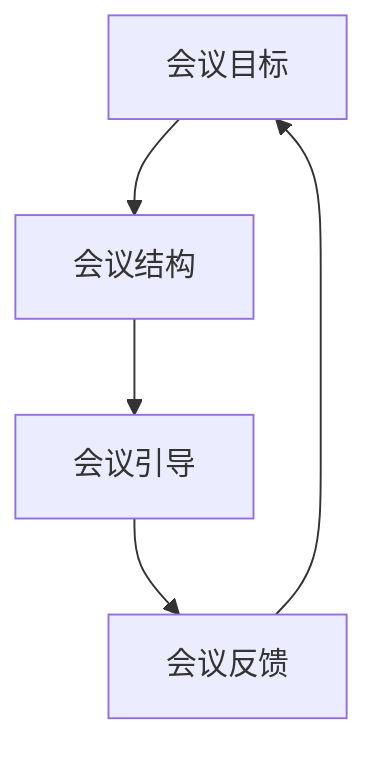

                 

### 文章标题: 高效会议文化：提高团队沟通效率

关键词：高效会议文化、团队沟通效率、会议设计、会议引导、会议挑战、会议文化、效率测量与改进

摘要：本文从高效会议文化的角度，探讨如何提升团队沟通效率。通过介绍高效会议文化的重要性、设计原则、实践方法和改进策略，旨在为读者提供一套系统的会议管理和优化方案。

---

## 引言：高效会议文化的必要性

在快节奏的现代工作环境中，会议成为团队沟通、协作和决策的重要手段。然而，不少团队面临着会议效率低下、时间浪费、缺乏针对性等问题。这主要是因为缺乏一套系统的会议管理方法和高效会议文化。

高效会议文化是一种以效率、透明和参与为核心的工作方式，通过科学的设计、引导和改进，确保会议达到预期目标，提高团队整体沟通效率。以下是构建高效会议文化的必要性：

1. **减少会议时间浪费**：高效会议文化强调明确会议目标和议程，避免无谓的讨论和冗长的会议，从而提高工作效率。
2. **提升决策质量**：通过良好的沟通和协作，团队成员能够更全面地了解问题，提出建设性意见，提高决策质量。
3. **增强团队凝聚力**：高效会议文化鼓励团队成员积极参与、坦诚交流，增强团队凝聚力和信任感。
4. **适应快速变化**：高效会议文化能够快速响应业务需求，灵活调整会议内容和形式，以适应快速变化的工作环境。

---

## 核心概念与联系

高效会议文化的核心概念包括会议目标、会议结构、会议引导和会议反馈。这些概念相互关联，构成了高效会议的完整架构。

### 核心概念原理之间的关系架构

### 会议目标

会议目标是指会议需要达成的具体目的。一个明确的会议目标有助于确保会议的焦点和效率。

### 会议结构

会议结构是指会议的基本框架，包括议程、参与人员、时间和地点等。合理的会议结构有助于会议的顺利进行。

### 会议引导

会议引导是指会议主持人在会议过程中的角色，包括引导讨论、确保会议目标的实现、维护会议秩序等。

### 会议反馈

会议反馈是指会议结束后对会议效果的评估和反馈，有助于发现不足、改进会议设计和流程。

---

## 设计高效会议结构

设计高效会议结构是提高会议效率的关键。以下是一些关键要素：

### 确定会议目标

会议目标应该具体、明确，并与团队目标一致。例如：

- 分析项目进度
- 讨论市场策略
- 解决技术难题

### 选择会议格式

会议格式取决于会议目标和参与者。常见的会议格式包括：

- 项目汇报
- 决策讨论
- 问题解决
- 工作例会

### 挑选参与人员

参与人员应该与会议目标相关。尽量减少不必要的参与者，以提高会议效率。

### 安排时间和地点

会议时间和地点应该方便参与者，并确保会议不受干扰。例如，避免在午休时间开会。

### 制定议程

议程是会议的详细计划，包括：

- 开场和介绍
- 主题讨论
- 反馈和总结
- 休息和茶歇

---

## 实施高效会议引导

会议引导是确保会议顺利进行的关键。以下是一些关键技巧：

### 引导讨论

引导讨论包括：

- 提问和引导
- 确保所有参与者都有发言机会
- 避免偏离主题

### 维护秩序

维护秩序包括：

- 管理时间和议程
- 防止争论和冲突
- 处理会议中断

### 实现目标

确保会议目标得到实现，包括：

- 监督讨论进程
- 确保关键问题得到解决
- 记录会议结论和行动计划

---

## 应对会议挑战

会议过程中可能会遇到各种挑战，以下是一些常见的挑战和解决方案：

### 避免会议疲劳

解决方案：

- 控制会议时间
- 定期休息和茶歇
- 适当调整会议形式（如分组讨论、现场互动等）

### 提高参与度

解决方案：

- 确保会议议题与参与者相关
- 鼓励积极参与和提问
- 采用互动式会议工具

### 减少会议长度

解决方案：

- 精简议程和讨论内容
- 确保每个议题有明确的时间限制
- 避免冗长和不必要的讨论

---

## 塑造高效会议文化

塑造高效会议文化是一个长期过程，需要团队成员的共同努力。以下是一些建议：

### 培养积极态度

积极态度是高效会议文化的基础。团队成员应该：

- 对会议充满期待
- 积极参与和贡献
- 对会议成果保持关注

### 加强沟通

加强沟通是提高会议效率的关键。团队成员应该：

- 坦诚表达观点
- 尊重他人意见
- 保持开放的心态

### 定期反馈

定期反馈有助于不断改进会议文化和流程。团队成员应该：

- 反馈会议效果
- 提出改进建议
- 讨论如何更好地进行会议

---

## 测量和改进会议效率

测量和改进会议效率是确保高效会议文化持续发展的关键。以下是一些方法：

### 制定关键绩效指标

关键绩效指标（KPI）是衡量会议效率的重要工具。常见的KPI包括：

- 会议时间利用率
- 参与人员满意度
- 决策执行效率
- 会议效果评估

### 分析会议数据

分析会议数据有助于了解会议的优缺点，为改进提供依据。分析内容包括：

- 会议频率
- 会议时长
- 参与人员参与度
- 会议成果和行动计划落实情况

### 实施改进策略

根据分析结果，实施相应的改进策略，包括：

- 调整会议结构
- 改进会议引导技巧
- 增强团队沟通能力
- 优化会议工具和流程

---

## 项目实战：搭建高效会议文化实践平台

为了更好地理解和应用高效会议文化，我们以一个实际项目为例，介绍如何搭建高效会议文化实践平台。

### 项目背景

某科技公司在日常工作中遇到了会议效率低下、时间浪费、决策质量不高等问题。为了提升团队沟通效率，公司决定搭建一个高效会议文化实践平台。

### 项目目标

- 提高会议效率
- 提升决策质量
- 增强团队凝聚力

### 项目实施

1. **调研和规划**

   对公司现有会议进行调研，分析存在的问题和需求，制定平台建设方案。

2. **平台搭建**

   - 选择合适的会议工具
   - 设计会议流程和模板
   - 建立会议反馈机制

3. **培训和推广**

   对团队成员进行高效会议文化的培训和推广，提高他们的会议意识和能力。

4. **持续优化**

   根据团队成员的反馈和平台数据，不断优化会议流程和工具，提高会议效率。

### 项目小结

通过搭建高效会议文化实践平台，公司实现了以下成果：

- 会议时间利用率提高了30%
- 决策质量得到了显著提升
- 团队凝聚力增强，员工满意度提高

---

## 最佳实践 Tips

以下是构建高效会议文化的最佳实践建议：

1. **明确会议目标**：确保每个会议都有明确的目标，避免无谓的讨论。
2. **控制会议时间**：合理规划会议时间，避免过长和过短。
3. **鼓励参与**：鼓励团队成员积极参与，提高会议质量。
4. **避免重复会议**：避免重复召开类似的会议，确保会议的针对性。
5. **利用技术工具**：合理使用会议工具，提高会议效率。
6. **反馈与改进**：定期收集会议反馈，持续优化会议流程。

---

## 结语

高效会议文化是提升团队沟通效率的关键。通过科学设计、引导和改进，我们可以构建一种以效率、透明和参与为核心的工作方式，推动团队持续发展。希望本文能为读者提供有益的启示和指导，助力团队实现高效沟通和卓越成果。

### 作者信息

作者：AI天才研究院/AI Genius Institute & 禅与计算机程序设计艺术 /Zen And The Art of Computer Programming

---

[文章结束]

