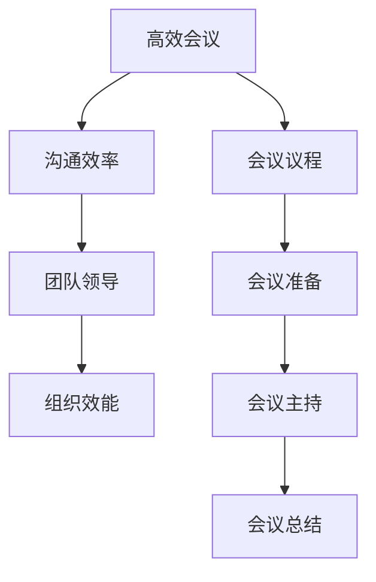

                 


## 《高效会议领导：提升团队沟通效率的方法》目录大纲设计

### 设计思路

在设计《高效会议领导：提升团队沟通效率的方法》的目录大纲时，我们遵循以下原则和步骤：

#### 1. 确定核心概念与联系
首先，我们需要明确书籍的核心概念，例如高效会议、沟通效率、团队领导等。通过绘制 Mermaid 流程图，我们可以清晰地展示这些概念之间的关系。



#### 2. 确定核心算法原理讲解
为了帮助读者理解会议领导的技巧，我们需要使用伪代码详细阐述关键算法原理。以下是关于“如何准备会议”的伪代码示例：

```plaintext
Algorithm PrepareMeeting(meetingTopic, participants)
    Input: meetingTopic (string), participants (list of strings)
    Output: meetingPreparationPlan (dictionary)

    meetingPreparationPlan = {
        "topic": meetingTopic,
        "participants": participants,
        "agenda": [],
        "materials": [],
        "time": "",
        "venue": ""
    }

    for participant in participants:
        meetingPreparationPlan["agenda"].append(AskParticipantForInput(participant))
        meetingPreparationPlan["materials"].append(CollectMaterialsForTopic(meetingTopic))

    meetingPreparationPlan["time"] = ScheduleMeetingTime()
    meetingPreparationPlan["venue"] = ChooseMeetingVenue()

    return meetingPreparationPlan
```

#### 3. 数学模型和公式讲解
在讨论沟通效率时，我们可以引入相关数学模型和公式。以下是一个简单的沟通效率公式及其解释：

$$
E = \frac{TP}{TP + FP}
$$

其中，\(E\) 是沟通效率，\(TP\) 是正确沟通的次数，\(FP\) 是错误沟通的次数。这个公式可以帮助我们评估会议沟通的效果。

#### 4. 项目实战
为了使读者更好地理解高效会议领导的方法，我们可以通过实际项目来展示。以下是项目实战的框架：

```markdown
## 项目实战：实施高效会议领导

### 1. 项目背景
- 描述项目的具体背景和目标。

### 2. 开发环境搭建
- 说明所需工具和软件的安装步骤。

### 3. 源代码实现
- 提供源代码实现，并进行详细解读。

### 4. 代码解读与分析
- 分析代码的关键部分，解释其工作原理。

### 5. 实际案例分析与讲解
- 通过实际案例展示高效会议领导的应用，并进行详细剖析。

### 6. 项目小结
- 总结项目的成果和经验教训。

### 7. 拓展阅读
- 推荐相关阅读材料，以供读者深入学习。
```

#### 5. 最佳实践 Tips、小结、注意事项、拓展阅读
最后，在每个章节的结尾，我们可以提供以下内容：

- **最佳实践 Tips**：总结实践中积累的经验和技巧。
- **小结**：回顾章节的核心内容。
- **注意事项**：提醒读者在实践过程中需要注意的事项。
- **拓展阅读**：推荐相关书籍、文章或资源，以供读者进一步学习。

### 目录大纲示例

以下是根据上述设计思路，《高效会议领导：提升团队沟通效率的方法》的目录大纲示例：

```markdown
# 《高效会议领导：提升团队沟通效率的方法》

> 关键词：高效会议，沟通效率，团队领导，沟通技巧，会议准备，会议主持

> 摘要：本书旨在帮助读者掌握高效会议领导的技巧，提升团队沟通效率，从而提高组织效能。

## 第1章 引言

### 1.1 高效会议领导的重要性

### 1.2 团队沟通中的常见问题

### 1.3 本书结构安排

## 第2章 会议沟通理论基础

### 2.1 沟通模型概述

### 2.2 沟通障碍分析

### 2.3 沟通效率公式讲解

## 第3章 高效会议准备技巧

### 3.1 会议主题设定

### 3.2 会议议程制定

### 3.3 会议准备工作

## 第4章 高效会议主持技巧

### 4.1 开场技巧

### 4.2 控制会议节奏

### 4.3 激发参与度

## 第5章 高效会议沟通技巧

### 5.1 沟通技巧概述

### 5.2 有效提问技巧

### 5.3 非语言沟通技巧

## 第6章 高效会议冲突处理技巧

### 6.1 冲突类型分析

### 6.2 冲突处理策略

### 6.3 案例分析

## 第7章 高效会议总结与跟进

### 7.1 会议总结技巧

### 7.2 跟进措施

### 7.3 持续改进

## 第8章 工具与方法

### 8.1 数字化工具介绍

### 8.2 工具应用案例

### 8.3 工具选择建议

## 结论

### 9.1 总结与展望

### 9.2 未来发展建议

作者：AI天才研究院/AI Genius Institute & 禅与计算机程序设计艺术 /Zen And The Art of Computer Programming
```

通过上述目录大纲的设计，本书能够系统地帮助读者掌握高效会议领导的方法，提升团队沟通效率。每个章节都包含了丰富的内容，确保读者能够全面理解并应用这些技巧。同时，通过项目实战和案例分析，读者可以更好地将理论应用于实践。

