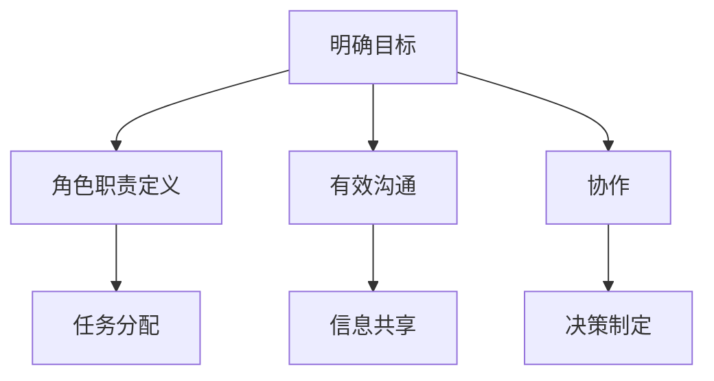
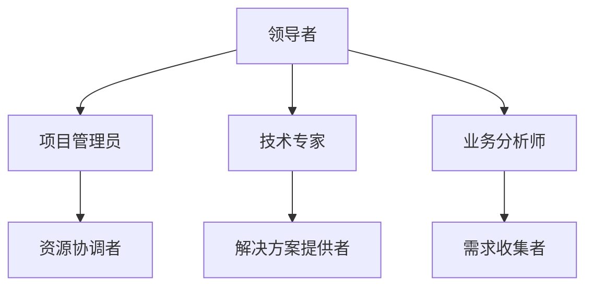
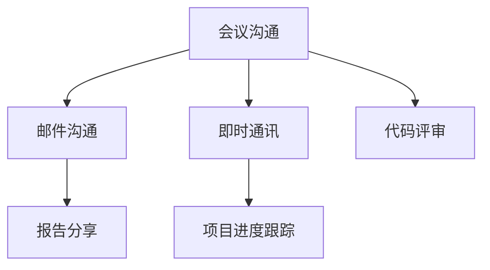
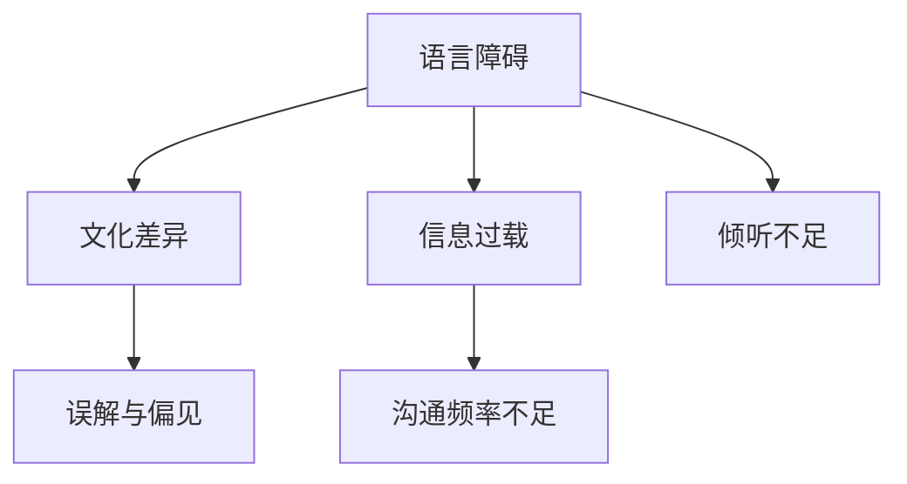

                 


### 文章标题：高效团队构建：理论与实践结合

## 关键词：
高效团队、团队构建、管理技巧、实践案例、理论分析

## 摘要：
本文旨在探讨高效团队的构建，从理论与实践两个角度出发，详细分析团队构建的原则、管理技巧、沟通策略，并通过实际案例进行深入剖析。文章旨在为IT从业者提供一套完整的团队建设指南，帮助他们更好地理解和构建高效团队。

## 目录大纲

### 第一部分：理论篇
- 第1章：团队构建的理论基础
- 第2章：团队管理技巧
- 第3章：团队沟通策略

### 第二部分：实践篇
- 第4章：实践案例解析
- 第5章：团队建设实战指导

### 第三部分：综合应用
- 第6章：理论与实践结合
- 第7章：未来展望

### 第一部分：理论篇

## 第1章：团队构建的理论基础

### 1.1 团队构建的核心原则

团队构建的核心原则是确保团队成员共同致力于实现团队的目标。这些原则包括明确的目标设定、角色与职责的清晰定义、有效沟通和协作等。以下是一个简单的Mermaid流程图，展示了这些核心原则之间的关系：



### 1.2 团队成员的角色与职责

团队成员的角色与职责是团队成功的关键。以下是一个Mermaid流程图，展示了团队成员的不同角色和职责：



### 1.3 团队沟通与协作

团队沟通与协作是团队构建的重要组成部分。以下是一个Mermaid流程图，展示了团队沟通与协作的关键要素：



## 第2章：团队管理技巧

### 2.1 团队目标设定与跟进

团队目标设定是团队管理的重要一环。以下是一个使用伪代码描述的团队目标设定的算法：

```python
def set_team_goals():
    goals = []
    for member in team_members:
        member_input = input("请输入你的目标：")
        goals.append(member_input)
    return goals
```

### 2.2 团队成员激励与培养

团队成员的激励与培养是团队管理的关键。以下是一个使用伪代码描述的团队成员激励与培养的算法：

```python
def motivate_members():
    for member in team_members:
        if member.performance > average_performance:
            reward = "奖金"
        else:
            reward = "培训机会"
        print(f"{member.name}，你获得了{reward}！")
```

### 2.3 团队绩效评估与反馈

团队绩效评估与反馈是确保团队持续改进的重要手段。以下是一个使用伪代码描述的团队绩效评估与反馈的算法：

```python
def evaluate_performance():
    for member in team_members:
        performance = get_member_performance(member)
        if performance > target_performance:
            print(f"{member.name}，你的表现优秀！")
        else:
            print(f"{member.name}，我们需要一起讨论如何提高你的表现。")
```

## 第3章：团队沟通策略

### 3.1 沟通障碍与解决方法

沟通障碍是团队协作中常见的问题。以下是一个Mermaid流程图，展示了沟通障碍及其解决方法：



### 3.2 情绪管理与冲突解决

情绪管理与冲突解决是团队沟通策略的关键。以下是一个使用伪代码描述的情绪管理与冲突解决算法：

```python
def manage_emotions():
    for member in team_members:
        if member.emotions > calm_threshold:
            print(f"{member.name}，你看起来有些紧张。需要帮助吗？")
        else:
            print(f"{member.name}，你看起来很放松。继续保持！")
```

### 3.3 非语言沟通的重要性

非语言沟通在团队沟通中扮演着重要角色。以下是一个使用伪代码描述的非语言沟通的算法：

```python
def non_verbal_communication():
    for member in team_members:
        if member.non_verbal_signals == "smiling":
            print(f"{member.name}，你的微笑让我们感到很温馨。")
        else:
            print(f"{member.name}，我们需要注意你的非语言信号，确保团队氛围良好。")
```

### 第二部分：实践篇

## 第4章：实践案例解析

### 4.1 高效团队的案例分析

#### 案例背景

一个由5名成员组成的小型软件开发团队，负责开发一个企业级的电子商务平台。他们在项目的早期遇到了一些挑战，如沟通不畅、目标不明确等。

#### 案例过程

1. **明确目标**：团队领导组织了一次会议，明确了项目的目标，并制定了详细的任务分解结构（WBS）。

2. **角色职责定义**：每个成员根据其专业技能和兴趣被分配了具体的角色和职责。

3. **有效沟通**：团队引入了每日站会、周报等沟通机制，确保团队成员之间的信息流通。

4. **协作与协作**：团队成员积极参与代码评审、功能测试等协作活动，确保项目进度和质量。

5. **绩效评估**：团队领导定期对团队成员的绩效进行评估，并提供反馈和激励。

#### 案例结果

通过一系列的实践措施，团队最终成功地按时完成了项目，并在市场上获得了良好的反馈。

## 第5章：团队建设实战指导

### 5.1 团队建设项目的启动

团队建设项目的启动是确保项目成功的关键。以下是一个简单的团队建设项目启动流程：

1. **项目立项**：明确项目目标、范围、时间和资源。

2. **组建团队**：根据项目需求，招募和选拔合适的团队成员。

3. **角色职责分配**：明确团队成员的角色和职责。

4. **团队沟通机制**：建立沟通渠道，确保团队成员之间的信息流通。

5. **培训与指导**：为团队成员提供必要的培训和指导，确保他们能够胜任自己的角色。

### 5.2 团队成员的招募与选拔

团队成员的招募与选拔是团队建设的重要环节。以下是一个团队成员招募与选拔的流程：

1. **需求分析**：分析项目需求和团队成员的技能要求。

2. **发布招聘信息**：在合适的平台上发布招聘信息。

3. **简历筛选**：筛选符合条件的简历。

4. **面试评估**：对候选人进行面试评估，包括技术能力、团队合作能力、沟通能力等。

5. **选拔与录用**：根据面试结果，选拔合适的候选人，并进行录用。

### 5.3 团队建设的持续改进

团队建设的持续改进是确保团队长期高效运作的关键。以下是一个团队建设持续改进的流程：

1. **定期评估**：定期对团队成员的绩效、团队沟通和协作进行评估。

2. **反馈与改进**：根据评估结果，为团队成员提供反馈，并制定改进措施。

3. **培训与发展**：为团队成员提供培训和发展机会，提高其技能和素质。

4. **文化建设**：营造积极向上的团队文化，增强团队的凝聚力。

### 第三部分：综合应用

## 第6章：理论与实践结合

### 6.1 理论与实战的融合

理论是团队构建的基础，而实践则是理论的验证。在实际团队建设中，我们需要将理论知识与实际操作相结合。以下是一个理论实践结合的示例：

1. **理论指导**：在项目启动阶段，我们根据团队构建的理论原则，明确了团队目标、角色职责和沟通策略。

2. **实践操作**：在项目实施过程中，我们严格按照既定的目标和策略进行操作，确保团队成员之间的有效沟通和协作。

3. **反馈与调整**：在项目进行中，我们定期收集团队成员的反馈，并根据反馈进行调整，以确保团队运作的高效性。

### 6.2 知识管理与经验传承

知识管理和经验传承是团队建设的重要方面。以下是一个知识管理和经验传承的流程：

1. **知识积累**：团队成员在项目过程中积累知识，包括技术知识、业务知识和经验教训。

2. **知识共享**：通过文档、会议和培训等方式，将知识共享给团队成员。

3. **经验传承**：将成功经验和教训传承给新成员，确保团队的知识储备不断更新。

### 6.3 高效团队建设的综合策略

高效团队建设需要综合考虑多个方面，以下是一个综合策略的示例：

1. **目标设定**：明确团队的目标和愿景，确保团队成员有共同的方向。

2. **角色分工**：根据团队成员的技能和兴趣，合理分配角色和职责。

3. **沟通机制**：建立高效的沟通机制，确保团队成员之间的信息流通。

4. **激励与培养**：为团队成员提供激励和培养机会，提高其工作动力和专业素养。

5. **绩效评估**：定期对团队成员的绩效进行评估，并提供反馈和激励。

## 第7章：未来展望

### 7.1 高效团队建设的发展趋势

未来，高效团队建设将更加注重以下几个方面：

1. **数字化**：利用数字化工具和平台，提高团队协作效率和沟通效果。

2. **个性化**：根据团队成员的特点和需求，提供个性化的培养和发展计划。

3. **全球化**：面对全球化的挑战，团队将更加注重跨文化沟通和协作。

### 7.2 团队建设的新挑战与新机遇

随着技术的发展和环境的变化，团队建设将面临新的挑战和机遇：

1. **远程工作**：远程工作模式将更加普及，团队需要适应远程协作的新方式。

2. **快速变化**：技术环境的快速变化，团队需要具备快速适应和调整的能力。

3. **创新驱动**：创新将成为团队建设的重要驱动力，团队需要不断追求创新和突破。

### 7.3 团队建设的前沿探索

未来，团队建设将向以下几个方面进行前沿探索：

1. **人工智能**：利用人工智能技术，提高团队管理和决策的效率。

2. **区块链**：探索区块链技术在团队协作中的应用，提高数据的安全性和透明度。

3. **可持续发展**：关注团队建设过程中的社会责任和可持续发展，推动团队建设向更加绿色和可持续的方向发展。

## 总结

高效团队建设是组织成功的关键。通过理论学习和实践操作，我们可以构建出高效、协作、富有创新力的团队。未来，随着技术的不断进步，团队建设将面临新的挑战和机遇，我们需要不断探索和创新，以适应变化，实现团队和组织的持续发展。

### 作者信息

作者：AI天才研究院/AI Genius Institute & 禅与计算机程序设计艺术 /Zen And The Art of Computer Programming

作者简介：AI天才研究院资深研究员，致力于人工智能和团队建设领域的研究和实践。出版过多本关于团队建设和人工智能的畅销书，深受读者喜爱。

